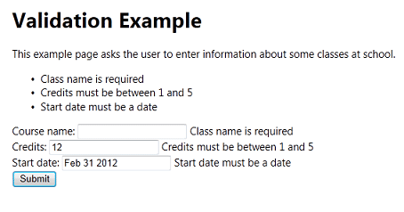
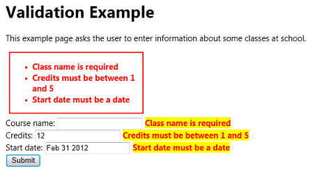

Validating User Input in ASP.NET Web Pages (Razor) Sites
====================
by [Tom FitzMacken](https://github.com/tfitzmac)

> This article discusses how to validate information you get from users &mdash; that is, to make sure that users enter valid information in HTML forms in an ASP.NET Web Pages (Razor) site.
> 
> What you'll learn:
> 
> - How to check that a user's input matches validation criteria that you define.
> - How to determine whether all validation tests have passed.
> - How to display validation errors (and how to format them).
> - How to validate data that doesn't come directly from users.
> 
> These are the ASP.NET programming concepts introduced in the article:
> 
> - The `Validation` helper.
> - The `Html.ValidationSummary` and `Html.ValidationMessage` methods.
>   
> 
> ## Software versions used in the tutorial
> 
> 
> - ASP.NET Web Pages (Razor) 3
>   
> 
> This tutorial also works with ASP.NET Web Pages 2.

This article contains the following sections:

- [Overview of User Input Validation](#Overview_of_User_Input_Validation)
- [Validating User Input](#Validating_User_Input)
- [Adding Client-Side Validation](#Adding_Client-Side_Validation)
- [Formatting Validation Errors](#Formatting_Validation_Errors)
- [Validating Data That Doesn't Come Directly from Users](#Validating_Data_That_Doesnt_Come_Directly_from_Users)

## Overview of User Input Validation

If you ask users to enter information in a page — for example, into a form — it's important to make sure that the values that they enter are valid. For example, you don't want to process a form that's missing critical information.

When users enter values into an HTML form, the values that they enter are strings. In many cases, the values you need are some other data types, like integers or dates. Therefore, you also have to make sure that the values that users enter can be correctly converted to the appropriate data types.

You might also have certain restrictions on the values. Even if users correctly enter an integer, for example, you might need to make sure that the value falls within a certain range.

> [!NOTE] 
> 
> **Important** Validating user input is also important for security. When you restrict the values that users can enter in forms, you reduce the chance that someone can enter a value that can compromise the security of your site.

## Validating User Input

In ASP.NET Web Pages 2, you can use the `Validator` helper to test user input. The basic approach is to do the following:

1. Determine which input elements (fields) you want to validate.

    You typically validate values in `<input>` elements in a form. However, it's a good practice to validate all input, even input that comes from a constrained element like a `<select>` list. This helps to make sure that users don't bypass the controls on a page and submit a form.
2. In the page code, add individual validation checks for each input element by using methods of the `Validation` helper.

    To check for required fields, use `Validation.RequireField(field, [error message])` (for an individual field) or `Validation.RequireFields(field1, field2, ...))` (for a list of fields). For other types of validation, use `Validation.Add(field, ValidationType)`. For `ValidationType`, you can use these options:

    `Validator.DateTime ([error message])`  
`Validator.Decimal([error message])`  
`Validator.EqualsTo(otherField [, error message])`  
`Validator.Float([error message])`  
`Validator.Integer([error message])`  
`Validator.Range(min, max [, error message])`  
`Validator.RegEx(pattern [, error message])`  
`Validator.Required([error message])`  
`Validator.StringLength(length)`  
`Validator.Url([error message])`
3. When the page is submitted, check whether validation has passed by checking `Validation.IsValid`:

    [!code-csharp[Main](validating-user-input-in-aspnet-web-pages-sites/samples/sample1.cs)]

    If there are any validation errors, you skip normal page processing. For example, if the purpose of the page is to update a database, you don't do that until all validation errors have been fixed.
4. If there are validation errors, display error messages in the page's markup by using `Html.ValidationSummary` or `Html.ValidationMessage`, or both.

The following example shows a page that illustrates these steps.

[!code-cshtml[Main](validating-user-input-in-aspnet-web-pages-sites/samples/sample2.cshtml)]

To see how validation works, run this page and deliberately make mistakes. For example, here's what the page looks like if you forget to enter a course name, if you enter an, and if you enter an invalid date:

## Adding Client-Side Validation

By default, user input is validated after users submit the page — that is, the validation is performed in server code. A disadvantage of this approach is that users don't know that they've made an error until after they submit the page. If a form is long or complex, reporting errors only after the page is submitted can be inconvenient to the user.

You can add support to perform validation in client script. In that case, the validation is performed as users work in the browser. For example, suppose you specify that a value should be an integer. If a user enters a non-integer value, the error is reported as soon as the user leaves the entry field. Users get immediate feedback, which is convenient for them. Client-based validation can also reduce the number of times that the user has to submit the form to correct multiple errors.

> [!NOTE]
> Even if you use client-side validation, validation is always also performed in server code. Performing validation in server code is a security measure, in case users bypass client-based validation.

1. Register the following JavaScript libraries in the page:  

    [!code-html[Main](validating-user-input-in-aspnet-web-pages-sites/samples/sample3.html)]

 Two of the libraries are loadable from a content delivery network (CDN), so you don't necessarily have to have them on your computer or server. However, you must have a local copy of *jquery.validate.unobtrusive.js*. If you are not already working with a WebMatrix template (like **Starter Site** ) that includes the library, create a Web Pages site that's based on **Starter Site**. Then copy the *.js* file to your current site.
2. In markup, for each element that you're validating, add a call to `Validation.For(field)`. This method emits attributes that are used by client-side validation. (Rather than emitting actual JavaScript code, the method emits attributes like `data-val-...`. These attributes support unobtrusive client validation that uses jQuery to do the work.)

The following page shows how to add client validation features to the example shown earlier.

[!code-cshtml[Main](validating-user-input-in-aspnet-web-pages-sites/samples/sample4.cshtml?highlight=35-39,51,61,71)]

Not all validation checks run on the client. In particular, data-type validation (integer, date, and so on) don't run on the client. The following checks work on both the client and server:

- `Required`
- `Range(minValue, maxValue)`
- `StringLength(maxLength[, minLength])`
- `Regex(pattern)`
- `EqualsTo(otherField)`

In this example, the test for a valid date won't work in client code. However, the test will be performed in server code.

## Formatting Validation Errors

You can control how validation errors are displayed by defining CSS classes that have the following reserved names:

- `field-validation-error`. Defines the output of the `Html.ValidationMessage` method when it's displaying an error.
- `field-validation-valid`. Defines the output of the `Html.ValidationMessage` method when there is no error.
- `input-validation-error`. Defines how `<input>` elements are rendered when there's an error. (For example, you can use this class to set the background color of an &lt;input&gt; element to a different color if its value is invalid.) This CSS class is used only during client validation (in ASP.NET Web Pages 2).
- `input-validation-valid`. Defines the appearance of `<input>` elements when there is no error.
- `validation-summary-errors`. Defines the output of the `Html.ValidationSummary` method it's displaying a list of errors.
- `validation-summary-valid`. Defines the output of the `Html.ValidationSummary` method when there is no error.

The following `<style>` block shows rules for error conditions.

[!code-css[Main](validating-user-input-in-aspnet-web-pages-sites/samples/sample5.css)]

If you include this style block in the example pages from earlier in the article, the error display will look like the following illustration:

> [!NOTE]
> If you're not using client validation in ASP.NET Web Pages 2, the CSS classes for the `<input>` elements (`input-validation-error` and `input-validation-valid` don't have any effect.

### Static and Dynamic Error Display

The CSS rules come in pairs, such as `validation-summary-errors` and `validation-summary-valid`. These pairs let you define rules for both conditions: an error condition and a "normal" (non-error) condition. It's important to understand that the markup for the error display is always rendered, even if there are no errors. For example, if a page has an `Html.ValidationSummary` method in the markup, the page source will contain the following markup even when the page is requested for the first time:

`
<ul></ul>
`

In other words, the `Html.ValidationSummary` method always renders a `
` element and a list, even if the error list is empty. Similarly, the `Html.ValidationMessage` method always renders a `` element as a placeholder for an individual field error, even if there is no error.

In some situations, displaying an error message can cause the page to reflow and can cause elements on the page to move around. The CSS rules that end in `-valid` let you define a layout that can help prevent this problem. For example, you can define `field-validation-error` and `field-validation-valid` to both have the same fixed size. That way, the display area for the field is static and won't change the page flow if an error message is displayed.

## Validating Data That Doesn't Come Directly from Users

Sometimes you have to validate information that doesn't come directly from an HTML form. A typical example is a page where a value is passed in a query string, as in the following example:

`http://server/myapp/EditClassInformation?classid=1022`

In this case, you want to make sure that the value that's passed to the page (here, 1022 for the value of `classid`) is valid. You can't directly use the `Validation` helper to perform this validation. However, you can use other features of the validation system, like the ability to display validation error messages.

> [!NOTE] 
> 
> **Important** Always validate values that you get from *any* source, including form-field values, query-string values, and cookie values. It's easy for people to change these values (perhaps for malicious purposes). So you must check these values in order to protect your application.

The following example shows how you might validate a value that's passed in a query string. The code tests that the value is not empty and that it's an integer.

[!code-csharp[Main](validating-user-input-in-aspnet-web-pages-sites/samples/sample6.cs)]

Notice that the test is performed when the request is not a form submission (`if(!IsPost)`). This test would pass the first time that the page is requested, but not when the request is a form submission.

To display this error, you can add the error to the list of validation errors by calling `Validation.AddFormError("message")`. If the page contains a call to the `Html.ValidationSummary` method, the error is displayed there, just like a user-input validation error.

## Additional Resources

[Working with HTML Forms in ASP.NET Web Pages Sites](https://go.microsoft.com/fwlink/?LinkID=202892)