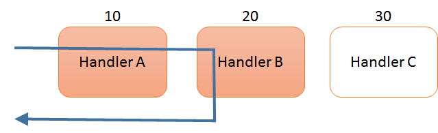

# ASP.NET WebHooks handlers

Once WebHooks requests has been validated by a WebHook receiver, it is ready to be processed by user code. This is where *handlers* come in. Handlers derive from the [IWebHookHandler](https://github.com/aspnet/WebHooks/blob/master/src/Microsoft.AspNet.WebHooks.Receivers/WebHooks/WebHookHandler.cs) interface but typically uses the [WebHookHandler](https://github.com/aspnet/WebHooks/blob/master/src/Microsoft.AspNet.WebHooks.Receivers/WebHooks/WebHookHandler.cs) class instead of deriving directly from the interface.

A WebHook request can be processed by one or more handlers. Handlers are called in order based on their respective *Order* property going from lowest to highest where Order is a simple integer (suggested to be between 1 and 100):



A handler can optionally set the *Response* property on the WebHookHandlerContext which will lead the processing to stop and the response to be sent back as the HTTP response to the WebHook. In the case above, Handler C won’t get called because it has a higher order than B and B sets the response.

Setting the response is typically only relevant for WebHooks where the response can carry information back to the originating API. This is for example the case with Slack WebHooks where the response is posted back to the channel where the WebHook came from. Handlers can set the Receiver property if they only want to receive WebHooks from that particular receiver. If they don’t set the receiver they are called for all of them.

One other common use of a response is to use a *410 Gone* response to indicate that the WebHook no longer is active and no further requests should be submitted.

By default a handler will be called by all WebHook receivers. However, if the *Receiver* property is set to the name of a handler then that handler will only receive WebHook requests from that receiver.

## Processing a WebHook

When a handler is called, it gets a [WebHookHandlerContext](https://github.com/aspnet/WebHooks/blob/master/src/Microsoft.AspNet.WebHooks.Receivers/WebHooks/WebHookHandlerContext.cs) containing information about the WebHook request. The data, typically the HTTP request body, is available from the *Data* property.

The type of the data is typically JSON or HTML form data, but it is possible to cast to a more specific type if desired. For example, the custom WebHooks generated by ASP.NET WebHooks can be cast to the type [CustomNotifications](https://github.com/aspnet/WebHooks/blob/master/src/Microsoft.AspNet.WebHooks.Receivers.Custom/WebHooks/CustomNotifications.cs) as follows:

<!-- literal_block {"names": [], "classes": [], "dupnames": [], "xml:space": "preserve", "backrefs": [], "ids": []} -->

```csharp
public class MyWebHookHandler : WebHookHandler
{
    public MyWebHookHandler()
    {
        this.Receiver = "custom";
    }

    public override Task ExecuteAsync(string generator, WebHookHandlerContext context)
    {
        CustomNotifications notifications = context.GetDataOrDefault<CustomNotifications>();
        foreach (var notification in notifications.Notifications)
        {
            ...
        }
        return Task.FromResult(true);
    }
}
```

  ## Queued Processing

Most WebHook senders will resend a WebHook if a response is not generated within a handful of seconds. This means that your handler must complete the processing within that time frame in order not for it to be called again.

If the processing takes longer, or is better handled separately then the [WebHookQueueHandler](https://github.com/aspnet/WebHooks/blob/master/src/Microsoft.AspNet.WebHooks.Receivers/WebHooks/WebHookQueueHandler.cs) can be used to submit the WebHook request to a queue, for example [Azure Storage Queue](https://msdn.microsoft.com/en-us/library/azure/dd179353.aspx).

An outline of a [WebHookQueueHandler](https://github.com/aspnet/WebHooks/blob/master/src/Microsoft.AspNet.WebHooks.Receivers/WebHooks/WebHookQueueHandler.cs) implementation is provided here:

<!-- literal_block {"names": [], "classes": [], "dupnames": [], "xml:space": "preserve", "backrefs": [], "ids": []} -->

```csharp
public class QueueHandler : WebHookQueueHandler
{
    public override Task EnqueueAsync(WebHookQueueContext context)
    {

        // Enqueue WebHookQueueContext to your queuing system of choice

        return Task.FromResult(true);
    }
}
```
