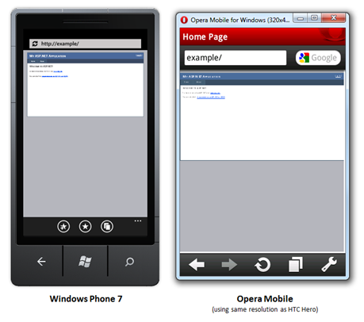
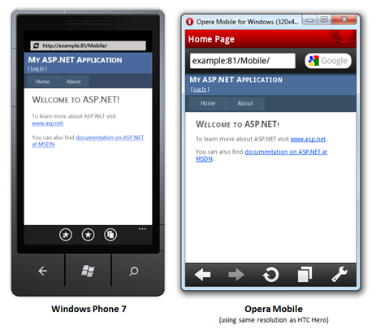

How To: Add Mobile Pages to Your ASP.NET Web Forms / MVC Application
====================
> **Applies To**
> 
> - ASP.NET Web Forms version 4.0
> - ASP.NET MVC version 3.0
> 
> **Summary**
> 
> This How To describes various ways to serve pages optimized for mobile devices from your ASP.NET Web Forms / MVC application, and suggests architectural and design issues to consider when targeting a broad range of devices. This document also explains why the ASP.NET Mobile Controls from ASP.NET 2.0 to 3.5 are now obsolete, and discusses some modern alternatives.

## Contents

- Overview
- Architectural options
- Browser and device detection
- How ASP.NET Web Forms applications can present mobile-specific pages
- How ASP.NET MVC applications can present mobile-specific pages
- Additional resources

For downloadable code samples demonstrating this white paper's techniques for both ASP.NET Web Forms and MVC, see [http://aspnetmobilesamples.codeplex.com/](http://aspnetmobilesamples.codeplex.com/).

## Overview

Mobile devices – smartphones, feature phones, and tablets – continue to grow in popularity as a means to access the Web. For many web developers and web-oriented businesses, this means it's increasingly important to provide a great browsing experience for visitors using those devices.

### How earlier versions of ASP.NET supported mobile browsers

ASP.NET versions 2.0 to 3.5 included *ASP.NET Mobile Controls*: a set of server controls for mobile devices in the *System.Web.Mobile.dll* assembly and the *System.Web.UI.MobileControls* namespace. The assembly is still included in ASP.NET 4, but it is deprecated. Developers are advised to migrate to more modern approaches, such as those described in this paper.

The reason why ASP.NET Mobile Controls have been marked as obsolete is that their design is oriented around the mobile phones that were common around 2005 and earlier. The controls are mainly designed to render WML or cHTML markup (instead of regular HTML) for the WAP browsers of that era. But WAP, WML, and cHTML are no longer relevant for most projects, because HTML has now become the ubiquitous markup language for mobile and desktop browsers alike.

### The challenges of supporting mobile devices today

Even though mobile browsers now almost universally support HTML, you will still face many challenges when aiming to create great mobile browsing experiences:

- ***Screen size*** - Mobile devices vary dramatically in form, and their screens are often much smaller than desktop monitors. So, you may need to design completely different page layouts for them.
- ***Input methods*** – Some devices have keypads, some have styluses, others use touch. You may need to consider multiple navigation mechanisms and data input methods.
- ***Standards compliance*** – Many mobile browsers do not support the latest HTML, CSS, or JavaScript standards.
- ***Bandwidth*** – Cellular data network performance varies wildly, and some end users are on tariffs that charge by the megabyte.

There's no one-size-fits-all solution; your application will have to look and behave differently according to the device accessing it. Depending on what level of mobile support you want, this can be a bigger challenge for web developers than the desktop "browser wars" ever was.

Developers approaching mobile browser support for the first time often initially think it's only important to support the latest and most sophisticated smartphones (e.g., Windows Phone 7, iPhone, or Android), perhaps because developers often personally own such devices. However, cheaper phones are still extremely popular, and their owners do use them to browse the web – especially in countries where mobile phones are easier to get than a broadband connection. Your business will need to decide what range of devices to support by considering its likely customers. If you're building an online brochure for a luxury health spa, you might make a business decision only to target advanced smartphones, whereas if you're creating a ticket booking system for a cinema, you probably need to account for visitors with less powerful feature phones.

## Architectural options

Before we get to the specific technical details of ASP.NET Web Forms or MVC, note that web developers in general have three main possible options for supporting mobile browsers:

1. ***Do nothing –*** You can simply create a standard, desktop-oriented web application, and rely on mobile browsers to render it acceptably. 

    - **Advantage**: It's the cheapest option to implement and maintain – no extra work
    - **Disadvantage**: Gives the worst end-user experience: 

        - The latest smartphones may render your HTML just as well as a desktop browser, but users will still be forced to zoom and scroll horizontally and vertically to consume your content on a small screen. This is far from optimal.
        - Older devices and feature phones may fail to render your markup in a satisfactory way.
        - Even on the latest tablet devices (whose screens can be as big as laptop screens), different interaction rules apply. Touch-based input works best with larger buttons and links spread further apart, and there's no way to hover a mouse cursor over a fly-out menu.
2. ***Solve the problem on the client* –** With careful use of CSS and [progressive enhancement](http://en.wikipedia.org/wiki/Progressive_enhancement) you can create markup, styles, and scripts that adapt to whatever browser is running them. For example, with [CSS 3 media queries](http://www.w3.org/TR/2010/CR-css3-mediaqueries-20100727/), you could create a multi-column layout that turns into a single column layout on devices whose screens are narrower than a chosen threshold. 

    - **Advantage**: Optimizes rendering for the specific device in use, even for unknown future devices according to whatever screen and input characteristics they have
    - **Advantage**: Easily lets you share server-side logic across all device types – minimal duplication of code or effort
    - **Disadvantage**: Mobile devices are so different from desktop devices that you may really want your mobile pages to be completely different from your desktop pages, showing different information. Such variations can be inefficient or impossible to achieve robustly through CSS alone, especially considering how inconsistently older devices interpret CSS rules. This is particularly true of CSS 3 attributes.
    - **Disadvantage**: Provides no support for varying server-side logic and workflows for different devices. You can't, for example, implement a simplified shopping cart checkout workflow for mobile users by means of CSS alone.
    - **Disadvantage**: Inefficient bandwidth use. You server may have to transmit the markup and styles that apply to all possible devices, even though the target device will only use a subset of that information.
3. ***Solve the problem on the server* –** If your server knows what device is accessing it – or at least the characteristics of that device, such as its screen size and input method, and whether it's a mobile device – it can run different logic and output different HTML markup. 

    - **Advantage:** Maximum flexibility. There's no limit to how much you can vary your server-side logic for mobiles or optimize your markup for the desired, device-specific layout.
    - **Advantage:** Efficient bandwidth use. You only need to transmit the markup and styling information that the target device is going to use.
    - **Disadvantage:** Sometimes forces repetition of effort or code (e.g., making you create similar but slightly different copies of your Web Forms pages or MVC views). Where possible you will factor out common logic into an underlying layer or service, but still, some parts of your UI code or markup may have to be duplicated and then maintained in parallel.
    - **Disadvantage:** Device detection is not trivial. It requires a list or database of known device types and their characteristics (which may not always be perfectly up-to-date) and isn't guaranteed to accurately match every incoming request. This document describes some options and their pitfalls later.

To get the best results, most developers find they need to combine options (2) and (3). Minor stylistic differences are best accommodated on the client using CSS or even JavaScript, whereas major differences in data, workflow, or markup are most effectively implemented in server-side code.

### This paper focuses on server-side techniques

Since ASP.NET Web Forms and MVC are both primarily server-side technologies, this white paper will focus on server-side techniques that let you produce different markup and logic for mobile browsers. Of course, you can also combine this with any client-side technique (e.g., CSS 3 media queries, progressive-enhancement JavaScript), but that's more a matter of web design than ASP.NET development.

## Browser and device detection

The key prerequisite for all server-side techniques for supporting mobile devices is to know what device your visitor is using. In fact, even better than knowing the manufacturer and model number of that device is knowing the *characteristics* of the device. Characteristics may include:

- Is it a mobile device?
- Input method (mouse/keyboard, touch, keypad, joystick, …)
- Screen size (physically and in pixels)
- Supported media and data formats
- Etc.

It's better to make decisions based on characteristics than model number, because then you'll be better equipped to handle future devices.

### Using ASP.NET's built-in browser detection support

ASP.NET Web Forms and MVC developers can immediately discover important characteristics of a visiting browser by inspecting properties of the *Request.Browser* object. For example, see

- Request.Browser.IsMobileDevice
- Request.Browser.MobileDeviceManufacturer, Request.Browser.MobileDeviceModel
- Request.Browser.ScreenPixelsWidth
- Request.Browser.SupportsXmlHttp
- …and many others

Behind the scenes, the ASP.NET platform matches the incoming *User-Agent* (UA) HTTP header against regular expressions in a set of Browser Definition XML files. By default the platform includes definitions for many common mobile devices, and you can add custom Browser Definition files for others you wish to recognize. For more details, see the MSDN page [ASP.NET Web Server Controls and Browser Capabilities](https://msdn.microsoft.com/en-us/library/x3k2ssx2.aspx).

### Using the WURFL device database via 51Degrees.mobi Foundation

While ASP.NET's built-in browser detection support will be sufficient for many applications, there are two main cases when it might not be enough:

- ***You want to recognize the latest devices***(without manually creating Browser Definition files for them). Note that .NET 4's Browser Definition files are not recent enough to recognize Windows Phone 7, Android phones, Opera Mobile browsers, or Apple iPads.
- ***You need more detailed information about device capabilities***. You may need to know about a device's input method (e.g., touch vs keypad), or what audio formats the browser supports. This information isn't available in the standard Browser Definition files.

The [*Wireless Universal Resource File* (WURFL) project](http://wurfl.sourceforge.net/) maintains much more up-to-date and detailed information about mobile devices in use today.

The great news for .NET developers is that ASP.NET's browser detection feature is extensible, so it's possible to enhance it to overcome these problems. For example, you can add the open source [*51Degrees.mobi Foundation*](http://51degrees.codeplex.com/) library to your project. It's an ASP.NET IHttpModule or Browser Capabilities Provider (usable on both Web Forms and MVC applications), that directly reads WURFL data and hooks it into ASP.NET's built-in browser detection mechanism. Once you've installed the module, *Request.Browser* will suddenly contain a lot more accurate and detailed information: it will correctly recognize many of the devices previously mentioned and list their capabilities (including additional capabilities such as input method). See the project's documentation for more details.

## How Web Forms applications can present mobile-specific pages

By default, here's how a brand new Web Forms application displays on common mobile devices:

Clearly, neither layout looks very mobile-friendly – this page was designed for a large, landscape-oriented monitor, not for a small portrait-oriented screen. So what can you do about it?

As discussed earlier in this paper, there are many ways to tailor your pages for mobile devices. Some techniques are server-based, others run on the client.

### Creating a mobile-specific master page

Depending on your requirements, you may be able to use the same Web Forms for all visitors, but have two separate master pages: one for desktop visitors, another for mobile visitors. This gives you the flexibility of changing the CSS stylesheet or your top-level HTML markup to suit mobile devices, without forcing you to duplicate any page logic.

This is easy to do. For example, you can add a PreInit handler such as the following to a Web Form:

[!code-csharp[Main](add-mobile-pages-to-your-aspnet-web-forms-mvc-application/samples/sample1.cs)]

Now, create a master page called Mobile.Master in the top-level folder of your application, and it will be used when a mobile device is detected. Your mobile master page can reference a mobile-specific CSS stylesheet if necessary. Desktop visitors will still see your default master page, not the mobile one.

### Creating independent mobile-specific Web Forms

For maximum flexibility, you can go much further than just having separate master pages for different device types. You can implement two *totally separate sets of Web Forms pages* – one set for desktop browsers, another set for mobiles. This works best if you want to present very different information or workflows to mobile visitors. The rest of this section describes this approach in detail.

Assuming you already have a Web Forms application designed for desktop browsers, the easiest way to proceed is to create a subfolder called "Mobile" within your project, and build your mobile pages there. You can construct an entire sub-site, with its own master pages, style sheets, and pages, using all the same techniques that you'd use for any other Web Forms application. You don't necessarily need to produce a mobile equivalent for *every* page in your desktop site; you can choose what subset of functionality makes sense for mobile visitors.

Your mobile pages can share common static resources (such as images, JavaScript, or CSS files) with your regular pages if you wish. Since your "Mobile" folder will *not* be marked as a separate application when hosted in IIS (it's just a simple subfolder of Web Forms pages), it will also share all the same configuration, Session data, and other infrastructure as your desktop pages.

> [!NOTE]
> Since this approach usually involves some duplication of code (mobile pages are likely to share some similarities with desktop pages), it's important to factor out any common business logic or data access code into a shared underlying layer or service. Otherwise, you'll double the effort of creating and maintaining your application.

#### Redirecting mobile visitors to your mobile pages

It's often convenient to redirect mobile visitors to the mobile pages only on the *first* request in their browsing session (and not on every request in their session), because:

- You can then easily allow mobile visitors to access your desktop pages if they wish – just put a link on your master page that goes to "Desktop version". The visitor won't be redirected back to a mobile page, because it's no longer the first request in their session.
- It avoids the risk of interfering with requests for any dynamic resources shared between desktop and mobile parts of your site (e.g., if you have a common Web Form that both desktop and mobile parts of your site display in an IFRAME, or certain Ajax handlers)

To do this, you can place your redirection logic in a **Session\_Start** method. For example, add the following method to your Global.asax.cs file:

[!code-csharp[Main](add-mobile-pages-to-your-aspnet-web-forms-mvc-application/samples/sample2.cs)]

#### Configuring Forms Authentication to respect your mobile pages

Note that Forms Authentication makes certain assumptions about where it can redirect visitors during and after the authentication process:

- When a user needs to be authenticated, Forms Authentication will redirect them to your desktop login page, regardless of whether they're a desktop or mobile user (because it only has a concept of *one* login URL). Assuming you want to style your mobile login page differently, you need to enhance your desktop login page so that it redirects mobile users to a separate mobile login page. For example, add the following code to your **desktop** login page code-behind: 

    [!code-csharp[Main](add-mobile-pages-to-your-aspnet-web-forms-mvc-application/samples/sample3.cs)]
- After a user successfully logs in, Forms Authentication will by default redirect them to your desktop home page (because it only has a concept of *one* default page). You need to enhance your mobile login page so that it redirects to the mobile home page after a successful log-in. For example, add the following code to your **mobile** login page code-behind: 

    [!code-csharp[Main](add-mobile-pages-to-your-aspnet-web-forms-mvc-application/samples/sample4.cs)]
  
 This code assumes your page has a Login server control called LoginUser, as in the default project template.

### Working with Output Caching

If you're using output caching, beware that by default it's possible for a desktop user to visit a certain URL (causing its output to be cached), followed by a mobile user who then receives the cached desktop output. This warning applies whether you're just varying your master page by device type, or implementing totally separate Web Forms per device type.

To avoid the problem, you can instruct ASP.NET to vary the cache entry according to whether the visitor is using a mobile device. Add a VaryByCustom parameter to your page's OutputCache declaration as follows:

[!code-aspx[Main](add-mobile-pages-to-your-aspnet-web-forms-mvc-application/samples/sample5.aspx)]

Next, define *isMobileDevice* as a custom cache parameter by adding the following method override to your Global.asax.cs file:

[!code-csharp[Main](add-mobile-pages-to-your-aspnet-web-forms-mvc-application/samples/sample6.cs)]

This will ensure that mobile visitors to the page don't receive output previously put into the cache by a desktop visitor.

### A working example

To see these techniques in action, download [this white paper's code samples](http://aspnetmobilesamples.codeplex.com/). The Web Forms sample application automatically redirects mobile users to a set of mobile-specific pages in a subfolder called Mobile. The markup and styling of those pages is better optimized for mobile browsers, as you can see from the following screenshots:

For more tips about optimizing your markup and CSS for mobile browsers, see the section "Styling mobile pages for mobile browsers" later in this document.

## How ASP.NET MVC applications can present mobile-specific pages

Since the Model-View-Controller pattern decouples application logic (in controllers) from presentation logic (in views), you can choose from any of the following approaches to handling mobile support in server-side code:

1. ***Use the same controllers and views for both desktop and mobile browsers, but render the views with different Razor layouts depending on the device type*.** This option works best if you're displaying identical data on all devices, but simply want to supply different CSS stylesheets or change a few top-level HTML elements for mobiles.
2. ***Use the same controllers for both desktop and mobile browsers, but render different views depending on the device type***. This option works best if you're displaying roughly the same data and providing the same workflows for end users, but want to render very different HTML markup to suit the device being used.
3. ***Create separate areas for desktop and mobile browsers, implementing independent controllers and views for each*.** This option works best if you're displaying very different screens, containing different information and leading the user through different workflows optimized for their device type. It may mean some repetition of code, but you can minimize that by factoring out common logic into an underlying layer or service.

If you want to take the **first** option and vary only the Razor layout per device type, it's very easy. Just modify your \_ViewStart.cshtml file as follows:

[!code-cshtml[Main](add-mobile-pages-to-your-aspnet-web-forms-mvc-application/samples/sample7.cshtml)]

Now you can create a mobile-specific layout called \_LayoutMobile.cshtml with a page structure and CSS rules optimized for mobile devices.

If you want to take the **second** option render totally different views according to the visitor's device type, see [Scott Hanselman's blog post](http://www.hanselman.com/blog/ABetterASPNETMVCMobileDeviceCapabilitiesViewEngine.aspx).

The rest of this paper focuses on the **third** option – creating separate controllers *and* views for mobile devices – so you can control exactly what subset of functionality is offered for mobile visitors.

### Setting up a Mobile area within your ASP.NET MVC application

You can add an area called "Mobile" to an existing ASP.NET MVC application in the normal way: right-click on your project name in Solution Explorer, then choose Add à Area. You can then add controllers and views as you would for any other area within an ASP.NET MVC application. For example, add to your Mobile area a new controller called HomeController to act as a homepage for mobile visitors.

### Ensuring the URL /Mobile reaches the mobile homepage

If you want the URL /Mobile to reach the Index action on HomeController inside your Mobile area, you will need to make two small changes to your routing configuration. First, update your MobileAreaRegistration class so that HomeController is the default controller in your Mobile area, as shown in the following code:

[!code-csharp[Main](add-mobile-pages-to-your-aspnet-web-forms-mvc-application/samples/sample8.cs)]

This means the mobile homepage will now be located at /Mobile, rather than /Mobile/Home, because "Home" is now the implicitly default controller name for mobile pages.

Next, note that by adding a second HomeController to your application (i.e., the mobile one, in addition to the existing desktop one), you'll have broken your regular desktop homepage. It will fail with the error "*Multiple types were found that match the controller named 'Home'*". To resolve this, update your top-level routing configuration (in Global.asax.cs) to specify that your desktop HomeController should take priority when there's ambiguity:

[!code-csharp[Main](add-mobile-pages-to-your-aspnet-web-forms-mvc-application/samples/sample9.cs)]

Now the error will go away, and the URL http://*yoursite*/ will reach the desktop homepage, and http://*yoursite*/mobile/ will reach the mobile homepage.

### Redirecting mobile visitors to your mobile area

There are many different extensibility points in ASP.NET MVC, so there are many possible ways to inject redirection logic. One neat option is to create a filter attribute, [RedirectMobileDevicesToMobileArea], that performs a redirection if the following conditions are met:

1. It's the first request in the user's session (i.e., Session.IsNewSession equals true)
2. The request comes from a mobile browser (i.e., Request.Browser.IsMobileDevice equals true)
3. The user is not already requesting a resource in the mobile area (i.e., the *path* part of the URL does not begin with /Mobile)

The downloadable sample included with this white paper includes an implementation of this logic. It's implemented as an authorization filter, derived from AuthorizeAttribute, which means it can work correctly even if you are using output caching (otherwise, if a desktop visitor first accesses a certain URL, the desktop output might be cached and then served to subsequent mobile visitors).

As it's a filter, you can choose either to apply it to specific controllers and actions, e.g.,

[!code-csharp[Main](add-mobile-pages-to-your-aspnet-web-forms-mvc-application/samples/sample10.cs)]

… or you can apply it to all controllers and actions as an MVC 3 *global filter* in your Global.asax.cs file:

[!code-csharp[Main](add-mobile-pages-to-your-aspnet-web-forms-mvc-application/samples/sample11.cs)]

The downloadable sample also demonstrates how you can create subclasses of this attribute that redirect to specific locations within your mobile area. This means, for example, you can:

- Register a global filter as shown above that sends mobile visitors to the mobile homepage by default.
- Also apply a special [RedirectMobileDevicesToMobileProductPage] filter to a "view product" action that takes mobile visitors to the mobile version of whatever product page they had requested.
- Also apply other special subclasses of the filter to specific actions, redirecting mobile visitors to the equivalent mobile page

### Configuring Forms Authentication to respect your mobile pages

If you're using Forms Authentication, you should note that when a user needs to log in, it automatically redirects the user to a single specific "log on" URL, which by default is **/Account/LogOn**. This means that mobile users may be redirected to your desktop "log on" action.

To avoid this problem, add logic to your desktop "log on" action so that it redirects mobile users again to a mobile "log on" action. If you're using the default ASP.NET MVC application template, update AccountController's LogOn action as follows:

[!code-csharp[Main](add-mobile-pages-to-your-aspnet-web-forms-mvc-application/samples/sample12.cs)]

… and then implement a suitable mobile-specific "log on" action on a controller called AccountController in your Mobile area.

### Working with Output Caching

If you're using the [OutputCache] filter, you must force the cache entry to vary by device type. For example, write:

[!code-javascript[Main](add-mobile-pages-to-your-aspnet-web-forms-mvc-application/samples/sample13.js)]

Then, add the following method to your Global.asax.cs file:

[!code-csharp[Main](add-mobile-pages-to-your-aspnet-web-forms-mvc-application/samples/sample14.cs)]

This will ensure that mobile visitors to the page don't receive output previously put into the cache by a desktop visitor.

### A working example

To see these techniques in action, download [this white paper's code associated samples](http://aspnetmobilesamples.codeplex.com/). The sample includes an ASP.NET MVC 3 (Release Candidate) application enhanced to support mobile devices using the methods described above.

## Further guidance and suggestions

The following discussion applies both to Web Forms and MVC developers who are using the techniques covered in this document.

### Enhancing your redirection logic using 51Degrees.mobi Foundation

The redirection logic shown in this document may be perfectly sufficient for your application, but it won't work if you need to disable sessions, or with mobile browsers that reject cookies (these can't have sessions), because it won't know whether a given request is the first one from that visitor.

You already learned how the open source 51Degrees.mobi Foundation can improve the accuracy of ASP.NET's browser detection. It also has a built-in ability to redirect mobile visitors to specific locations configured in Web.config. It's able to work without depending on ASP.NET Sessions (and hence cookies) by storing a temporary log of hashes of visitors' HTTP headers and IP addresses, so it knows whether or not each request is the first one from a given vistor.

The following element added to the fiftyOne section of the web.config file will redirect the first request from a detected mobile device to the page ~/Mobile/Default.aspx. Any requests to pages under the Mobile folder will *not* be redirected, regardless of device type. If the mobile device has been inactive for a period of 20 minutes or more the device will be forgotten and subsequent requests will be treated as new ones for the purposes of redirection.

[!code-xml[Main](add-mobile-pages-to-your-aspnet-web-forms-mvc-application/samples/sample15.xml)]

For more details, see [51degrees.mobi Foundation documentation](http://51degrees.codeplex.com/documentation).

> [!NOTE]
> You *can* use 51Degrees.mobi Foundation's redirection feature on ASP.NET MVC applications, but you will need to define your redirection configuration in terms of plain URLs, not in terms of routing parameters or by putting MVC filters on actions. This is because (at the time of writing) 51Degrees.mobi Foundation does not recognize filters or routing.

### Disabling Transcoders and Proxy Servers

Mobile network operators have two broad objectives in their approach to the mobile internet:

1. Provide as much relevant content as possible
2. Maximize the number of customers who can share the limited radio network bandwidth

Since most web pages were designed for large desktop-sized screens and fast fixed-line broadband connections, many operators use *transcoders* or *proxy servers* that dynamically alter web content. They may modify your HTML markup or CSS to suit smaller screens (especially for "feature phones" that lack the processing power to handle complex layouts), and they may recompress your images (significantly reducing their quality) to improve page delivery speeds.

But if you've taken the effort to produce a mobile-optimized version of your site, you probably don't want the network operator to interfere with it any further. You can add the following line to the Page\_Load event in any ASP.NET Web Form:

[!code-csharp[Main](add-mobile-pages-to-your-aspnet-web-forms-mvc-application/samples/sample16.cs)]

Or, for an ASP.NET MVC controller, you could add the following method override so that it applies to all actions on that controller:

[!code-csharp[Main](add-mobile-pages-to-your-aspnet-web-forms-mvc-application/samples/sample17.cs)]

The resulting HTTP message informs W3C compliant transcoders and proxies not to alter content. Of course, there is no guarantee that mobile network operators will respect this message.

### Styling mobile pages for mobile browsers

It's beyond the scope of this document to describe in great detail what kinds of HTML markup work correctly or which web design techniques maximize usability on particular devices. It's up to you to find a sufficiently simple layout, optimized for a mobile-sized screen, without using unreliable HTML or CSS positioning tricks. One important technique worth mentioning, however, is the *viewport meta tag*.

Certain modern mobile browsers, in an effort display web pages meant for desktop monitors, render the page on a virtual canvas, also called "viewport" (e.g., the virtual viewport is 980 pixels wide on iPhone, and 850 pixels wide on Opera Mobile by default) and then scale the result down to fit onto the screen's physical pixels. The user can then zoom in and pan around that viewport. This has the advantage that it lets the browser display the page in its intended layout, but it's also has the disadvantage that it forces zooming and panning, which is inconvenient for the user. If you're designing for mobile, it's better to design for a narrow screen so that no zooming or horizontal scrolling is necessary.

A way to tell the mobile browser how wide the viewport should be is through the nonstandard *viewport* meta tag. For example, if you add the following to your page's HEAD section,

[!code-html[Main](add-mobile-pages-to-your-aspnet-web-forms-mvc-application/samples/sample18.html)]

… then supporting smartphone browsers will lay out the page on a 480-pixel wide virtual canvas. This means that if your HTML elements define their widths in percentage terms, the percentages will be interpreted with respect to this 480-pixel width, not the default viewport width. As a result, the user is less likely to have to zoom and pan horizontally – considerably improving the mobile browsing experience.

If you want the viewport width to match the device's physical pixels, you can specify the following:

[!code-html[Main](add-mobile-pages-to-your-aspnet-web-forms-mvc-application/samples/sample19.html)]

For this to work correctly, you must not explicitly force elements to exceed that width (e.g., using a *width* attribute or CSS property), otherwise the browser will be forced to use a larger viewport regardless. See also: [more details about the nonstandard viewport tag](https://developer.apple.com/library/safari/#documentation/AppleApplications/Reference/SafariHTMLRef/Articles/MetaTags.html).

Most modern smartphones support *dual orientation*: they can be held in either portrait or landscape mode. So, it's important not to make assumptions about the screen width in pixels. Don't even assume that the screen width is fixed, because the user can re-orient their device while they are on your page.

Older Windows Mobile and Blackberry devices may also accept the following meta tags in the page header to inform them content has been optimized for mobile and therefore should not be transformed.

[!code-html[Main](add-mobile-pages-to-your-aspnet-web-forms-mvc-application/samples/sample20.html)]

## Additional Resources

For a list of mobile device emulators and simulators you can use to test your mobile ASP.NET web application, see the page [Simulate popular mobile devices for testing](../mobile/device-simulators.md).

## Credits

- Primary author: Steven Sanderson
- Reviewers / additional content writers: James Rosewell, Mikael Söderström, Scott Hanselman, Scott Hunter