Running ASP.NET 1.1 with IIS 6.0
====================
> While Windows Server 2003 includes both IIS 6.0 and ASP.NET 1.1, these components are disabled by default. This whitepaper describes how to enable IIS 6.0 and ASP.NET 1.1, and recommends several configuration settings to get the optimal performance from IIS and ASP.NET.
> 
> Applies to ASP.NET 1.1 and IIS 6.0.

ASP.NET 1.1 ships with Windows Server 2003, which also includes the latest version of Internet Information Server (IIS) version 6.0. IIS 6.0 and ASP.NET 1.1 are designed to integrate seamlessly and ASP.NET now defaults to the new IIS 6.0 worker process model.

## ASP.NET 1.1 is not installed by default

Unlike previous versions of Microsoft's server operating systems, Internet Information Server (IIS) is not enabled by default; nor is ASP.NET 1.1. There are two options for enabling IIS:

### Enabling IIS, option #1 - Configure Your Server Wizard

Windows Server 2003 ships a new 'Configure Your Server Wizard' to help you properly configure your server in the desired mode.

To start the wizard - note, to run the wizard you must be logged in as an administrator - go to: Start | Programs | Administrative Tools and select 'Configure Your Server'.

Once selected you should see the 'Configure Your Server Wizard' opening screen:

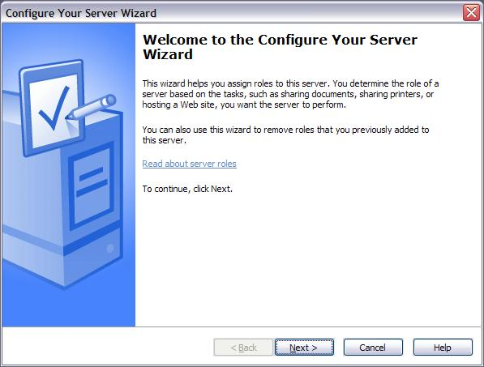

Click 'Next &gt;':

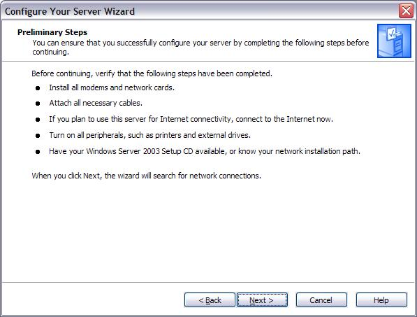

Click 'Next &gt;'

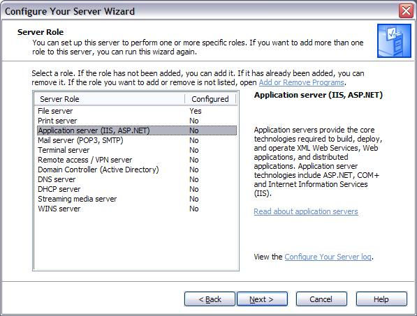

On this screen you will need to select 'Application server (IIS, ASP.NET) as the options to configure.

Click 'Next &gt;'.

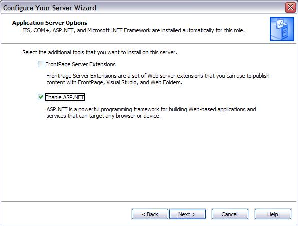

After selecting to configure the server as an Application Server, this screen will be displayed prompting what additional capabilities should be installed. Neither option is selected by default. To enable ASP.NET automatically, you need to select 'Enable ASP.NET'.

Click 'Next &gt;'.

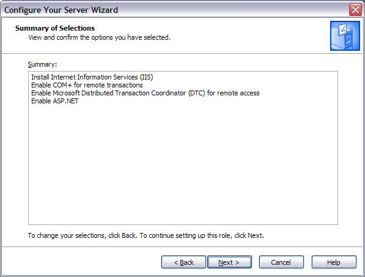

This screen displays what options are to be installed.

Click 'Next &gt;'.

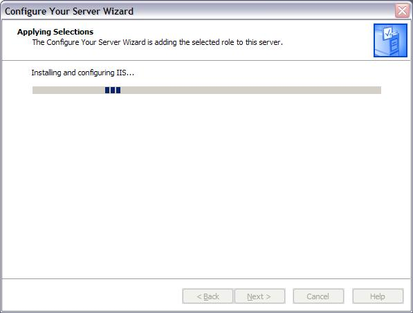

You will see this screen while the options you selected are being installed. It is normal to see other dialog boxes appear as services are being installed. You may additionally be prompted for the location of the Windows 2003 Server installation CD.

Click 'Next &gt;' when complete.

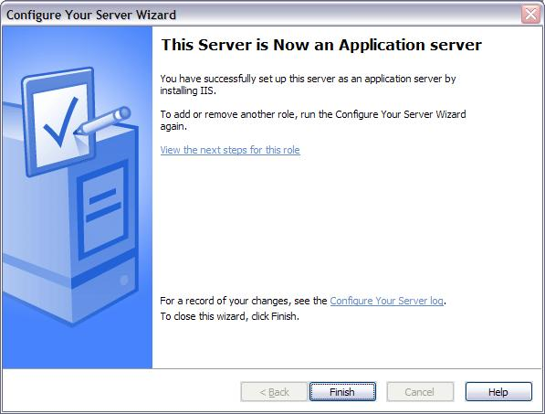

Click 'Finish' - the Windows Server 2003 is now configured to support IIS 6.0 and ASP.NET 1.1.

### Enabling IIS, option #2 - Manually configuring IIS and ASP.NET

If you do not wish to use the 'Configure Your Server Wizard' you can optionally install IIS 6.0 and ASP.NET 1.1 using 'Add or Remove Programs' from the Control Panel.

First open the Control Panel:

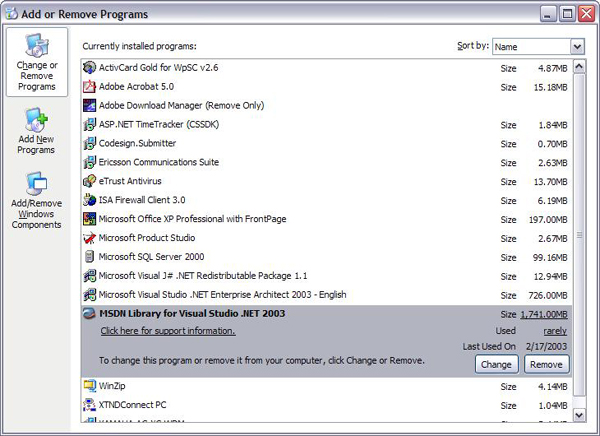

Next, click on 'Add/Remove Windows Components' which will open the 'Windows Components Wizard':

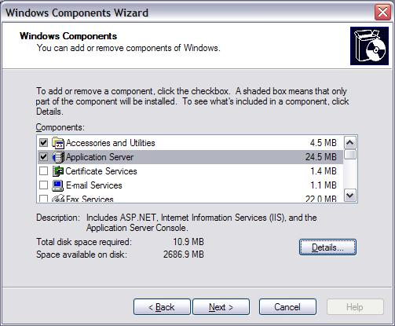

Highlight and check 'Application Server' and then click the 'Details?' button:

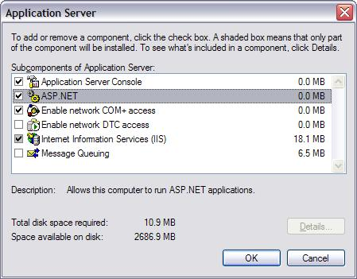

To install ASP.NET, check 'ASP.NET'.

Click 'OK' to return to the Windows Component Wizard. Click 'Next &gt;' from the Windows Component Wizard to begin installing:

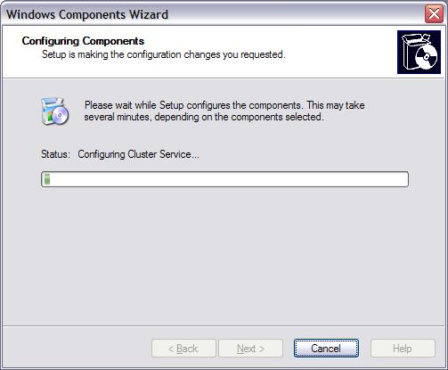

It is normal to see other dialog boxes appear as services are being installed. You may additionally be prompted for the location of the Windows 2003 Server installation CD.

When installation is complete you will see the last screen of the Windows Component Wizard:

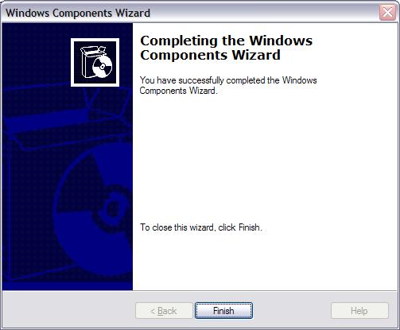

IIS 6.0 and ASP.NET 1.1 are now configured and available.

## Recommended Settings

When running ASP.NET 1.1 with IIS 6.0 there are several configuration settings that are recommended to get the optimal performance from ASP.NET:

- Configuring worker process memory limits
- Configuring worker process recycling

### Configuring worker process memory limits

By default IIS 6.0 does not set a limit on the amount of memory that IIS is allowed to use. ASP.NET's Cache feature relies on a limitation of memory so the Cache can proactively remove unused items from memory.

It is recommended that you configure the memory recycling feature of IIS 6.0. To configure this open Internet Information Services Manager (Start | Programs | Administrative Tools | Internet Information Services). Once open, expand the 'Application Pools' folder:

For each application pool:

1. Right-click on the application pool, e.g. 'DefaultAppPool', and select 'Properties':

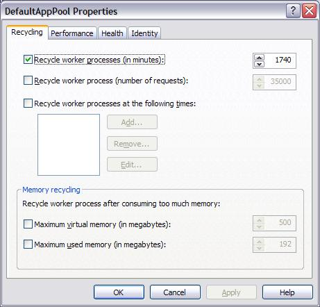

2. Next, enable Memory recycling by clicking on either 'Maximum used memory (in megabytes):'. The value should not be more than the amount of physical (not virtual) memory on the server, a good approximation is 60% of the physical memory, i.e. for a server with 512MB of physical memory select 310. It is also recommended that the maximum not exceed 800MB when using a 2GB address space. If the memory address space of the server is 3GB, the maximum memory limit for the worker process can be as high as 1,800MB:

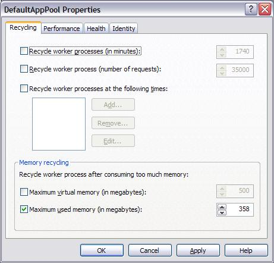

Click 'Apply' and the 'OK' to exit the properties dialog. Repeat this for all available application pools.

### Configuring worker recycling

By default IIS 6.0 is configured to recycle its worker process every 29 hours. This is a bit aggressive for an application running ASP.NET and it is recommended that automatic worker process recycling is disabled.

To disable automatic worker process recycling, first open Internet Information Services Manager (Start | Programs | Administrative Tools | Internet Information Services). Once open, expand the 'Application Pools' folder:

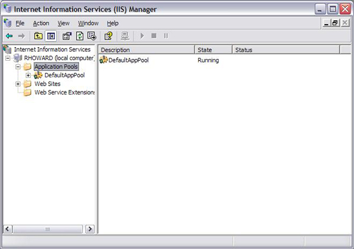

For each application pool:

1. Right-click on the application pool, e.g. 'DefaultAppPool', and select 'Properties':

2. Uncheck 'Recycle worker process (in minutes):':

Click 'Apply' and the 'OK' to exit the properties dialog. Repeat this for all available application pools.

## Granting write access to the file system

If your application requires write access to the file system and you are using NTFS you will need to modify an Access Control List (ACL) on the folder or file to grant ASP.NET access to.

For example, to grant ASP.NET write access to the c:\inetpub\wwwroot first open explorer and navigate to the directory:

Next, right-click on the directory, e.g. 'wwwroot' and select properties. After the properties dialog opens, select the 'Security' tab:

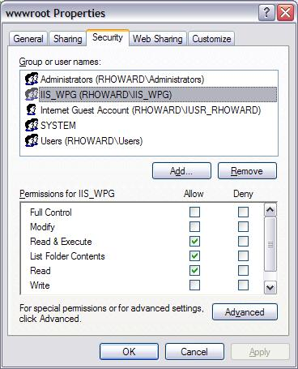

The c:\inetpub\wwwroot\ directory is a special directory in that the special IIS 6.0 group 'IIS\_WPG' is already granted Read &amp; Execute, List Folder Contents, and Read permissions. However, to grant Write permission, you need to click the Allow checkbox for Write:

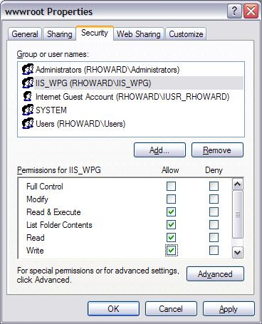

IIS 6.0 now has write permission on this folder. To grant write permissions on other folders, follow these steps - note, you may need to add the IIS\_WPG group if it does not already exist.

> [!CAUTION]
> Granting write permission to IIS\_WPG will allow any ASP.NET application to write to this directory.

## Supporting integrated authentication with SQL Server

Integrated authentication allows for SQL Server to leverage Windows NT authentication to validate SQL Server logon accounts. This allows the user to bypass the standard SQL Server logon process. With this approach, a network user can access a SQL Server database without supplying a separate logon identification or password because SQL Server obtains the user and password information from the Windows NT network security process.

Choosing integrated authentication for ASP.NET applications is a good choice because no credentials are ever stored within your connection string for your application. Rather the connection string used to connect to SQL will look as follows:

`"server=localhost; database=Northwind;Trusted_Connection=true"`

This connection string tells SQL Server to use the Windows credentials of the application attempting to access SQL Server. In the case of ASP.NET/IIS 6 this would be an account in the IIS\_WPG group.

To enable integrated authentication between SQL Server and ASP.NET, you will need to first ensure that SQL Server is configured for either Integrated authentication or Mixed-Mode authentication - check with your DBA to determine this. If SQL Server is in one of these two modes, you can use integrated authentication.

Open SQL Server Enterprise Manager (Start | Programs | Microsoft SQL Server | Enterprise Manager), select the appropriate server, and expand the Security folder:

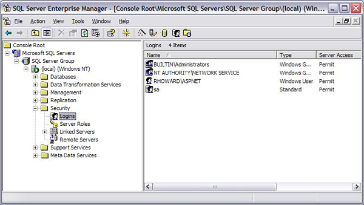

If 'BUILTINT\IIS\_WPG' group is not listed, right-click on Logins and select 'New Login':

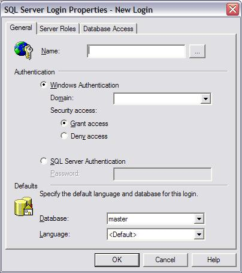

In the 'Name:' textbox either enter '[Server/Domain Name]\IIS\_WPG' or click on the ellipses button to open the Windows NT user/group picker:

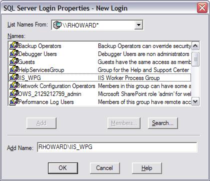

Select the current machine's IIS\_WPG group and click 'Add' and OK to close the picker.

You then need to also set the default database and the permissions to access the database. To set the default database choose from the drop down list, e.g. below Northwind is selected:

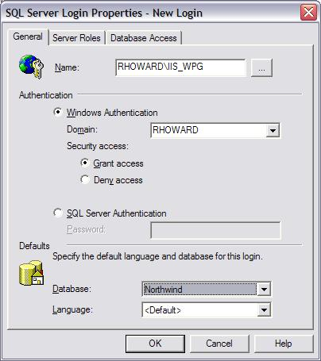

Next, click on the Database Access tab:

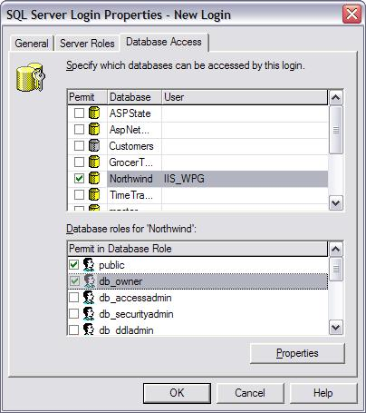

Click on the Permit checkbox for every database that you wish to allow access to. You will also need to select database roles, checking db\_owner will ensure your login has all necessary permissions to manage and use the selected database.

Click OK to exit the property dialog. Your ASP.NET application is now configured to support integrated SQL Server authentication.

## Don't run ASP.NET 1.0 in IIS 6.0 native mode

ASP.NET 1.0 on IIS 6.0 is only supported in IIS 5 compatibility mode.

To configure ASP.NET 1.0 to run in IIS 5.0 compatibility mode, open Internet Services Manager and right click Web Sites and select properties:

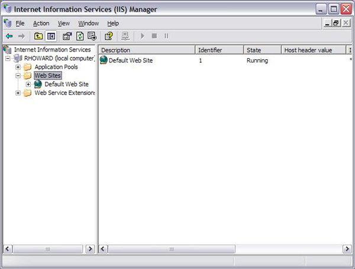

Switch to the Service Tab and check ?Run WWW Service in IIS 5.0 Isolation Mode?:

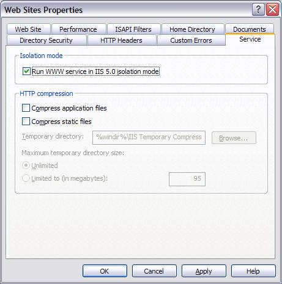