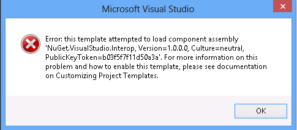

ASP.NET and Web Tools 2012.2 Release Notes
====================
> This document describes the release of ASP.NET and Web Tools 2012.2. It is an update to Visual Studio Web Tooling and ASP.NET.

- [Installation Notes](#_Installation)
- [Documentation](#_Documentation)
- [Support](#_Support)
- [Software Requirements](#_Software_Requirements)
- [New Features in ASP.NET and Web Tools 2012.2](#_New_Features_in)

    - [Tooling](#_Tooling)
    - [Web Publishing](#_Web_Publishing)
    - [ASP.NET MVC Templates](#_Templates)
    - [ASP.NET Web API](#_ASP.NET_Web_API)

    - [ASP.NET SignalR](#_ASP.NET_SignalR)
    - [ASP.NET Friendly URLs](#_ASP.NET_Friendly_URLs)
- [Known Issues and Breaking Changes](#_Known_Issues_and)

## Installation Notes

ASP.NET and Web Tools 2012.2 for Visual Studio 2012 can be installed using [Web Platform installer](https://www.microsoft.com/web/handlers/webpi.ashx?command=getinstallerredirect&appid=ASPDOTNETandWebTools2012_2). This is an update to Visual Studio 2012 or Visual Studio Express 2012 for Web, which is required. If you do not have Visual Studio installed, Visual Studio Express 2012 for Web will be installed.

You can also install ASP.NET and Web Tools 2012.2 manually. You must have Visual Studio 2012 or Visual Studio Express 2012 for Web installed. Then use the following instructions: 

1. Download [ASP.NET and Web Frameworks 2012.2](https://download.microsoft.com/download/6/5/6/6562AFBE-9503-4E64-970C-1427133FCD73/AspNetWebTools2012Setup.exe) installer from Download Center.
2. When prompted click Run. You can also save the file to run it later.
3. Verify the version of Visual Studio you will update. You can do this by launching the Visual Studio you wish to update. Then click the Help menu item.   
    
4. If you see the menu item &quot;About Microsoft Visual Studio 2012 for Web&quot; then download [Web Developer Tools 2012.2 - Visual Studio Express 2012 for Web](https://go.microsoft.com/fwlink/?LinkID=282228). Otherwise download [Web Developer Tools 2012.2 - Visual Studio 2012](https://go.microsoft.com/fwlink/?LinkID=282228).
5. When prompted click Run. You can also save the file to run it later.

> [!NOTE]
> ASP.NET and Web Tools 2012.2 release does not include SQL Server Data Tools. SQL Server and Windows Azure SQL Databases provides a richer set of database tooling including offline project-backed development, schema comparison and enhanced database deployment capabilities. For more information or to install SQL Server Data Tools visit [https://go.microsoft.com/fwlink/?LinkID=237127](https://go.microsoft.com/fwlink/?LinkID=237127).

## Documentation

Tutorials and other information about ASP.NET and Web Tools 2012.2 are available from ASP.NET web site ( https://www.asp.net).

## Support

ASP.NET and Web Tools 2012.2 is officially released and supported. You can use your normal support channel. You can also post questions to the ASP.NET forums ([https://forums.asp.net/](https://forums.asp.net/)), where members of the ASP.NET community are frequently able to provide informal support.

## Software Requirements

The ASP.NET and Web Tools 2012.2 requires Visual Studio 2012 or Visual Studio Express 2012 for Web.

## New Features in ASP.NET and Web Tools 2012.2

This section describes features that have been introduced in the ASP.NET and Web Tools 2012.2 release.

### Tooling

- Page Inspector 

    - Support JavaScript selection mapping allowing Page Inspector to map items that were dynamically added to the page back to the corresponding JavaScript code.
    - The ability to see CSS updates in real-time.
    - For more information, read [CSS Auto-Sync and JavaScript Selection Mapping in Page Inspector](https://blogs.msdn.com/b/webdev/archive/2012/12/14/css-auto-sync-and-javascript-selection-mapping-in-page-inspector.aspx).
- Editor 

    - Support syntax highlighting for CoffeeScript, Mustache, Handlebars, and JsRender.
    - The HTML editor provides Intellisense for Knockout bindings.
    - LESS editing and compiler support to enable building dynamic CSS using LESS.
    - Paste JSON as a .NET class. Using this Special Paste command to paste JSON into a C# or VB.NET code file, and Visual Studio will automatically generate .NET classes inferred from the JSON.
- Mobile Emulator support adds extensibility hooks so that third-party emulators can be installed as a VSIX. The installed emulators will show up in the F5 dropdown, so that developers can preview their websites on a variety of mobile devices. Read more about this feature in Scott Hanselman's blog entry on [the new BrowserStack integration with Visual Studio](http://www.hanselman.com/blog/CrossBrowserDebuggingIntegratedIntoVisualStudioWithBrowserStack.aspx).

### Web Publishing

- Web site projects now have the same publishing experience as Web Application projects including publishing to Windows Azure Web Sites.
- Selective publish &#8211; for one or more files you can perform the following actions (after publishing to a Web Deploy endpoint): 

    - Publish selected files.
    - See the difference between a local file and a remote file.
    - Update the local file with the remote file or update the remote file with the local file.

### ASP.NET MVC Templates

- The new Facebook Application template makes writing Facebook Canvas applications easy. In a few simple steps, you can create a Facebook application that gets data from a logged in user and integrates with their friends. The template includes a new library to take care of all the plumbing involved in building a Facebook app, including authentication, permissions, accessing Facebook data and more. For more information on using the Facebook Application template see [https://go.microsoft.com/fwlink/?LinkID=269921](https://go.microsoft.com/fwlink/?LinkID=269921).
- A new Single Page Application MVC template allows developers to build interactive client-side web apps using HTML 5, CSS 3, and the popular Knockout and jQuery JavaScript libraries, on top of ASP.NET Web API. The template includes a "todo" list application that demonstrates common practices for building a JavaScript HTML5 application that uses a RESTful server API. You can read more at [https://www.asp.net/single-page-application](../single-page-application/index.md).
- You can now create a VSIX that adds new templates to the ASP.NET MVC New Project dialog. Learn how here: [https://go.microsoft.com/fwlink/?LinkId=275019](https://go.microsoft.com/fwlink/?LinkId=275019)
- FixedDisplayModes package &#8211; MVC project templates have been updated to include the new ‘FixedDisplayModes' NuGet package, which contains a workaround for a bug in MVC 4. For more information on the fix contained in the package, refer to this blog post ([https://blogs.msdn.com/b/rickandy/archive/2012/09/17/asp-net-mvc-4-mobile-caching-bug-fixed.aspx](https://blogs.msdn.com/b/rickandy/archive/2012/09/17/asp-net-mvc-4-mobile-caching-bug-fixed.aspx)) from the MVC team.

### ASP.NET Web API

ASP.NET Web API has been enhanced with several new features:

- ASP.NET Web API OData
- ASP.NET Web API Tracing
- ASP.NET Web API Help Page

#### ASP.NET Web API OData

ASP.NET Web API OData gives you the flexibility you need to build OData endpoints with rich business logic over any data source. With ASP.NET Web API OData you control the amount of OData semantics that you want to expose. ASP.NET Web API OData is included with the ASP.NET MVC 4 project templates and is also available from NuGet ([http://www.nuget.org/packages/microsoft.aspnet.webapi.odata](http://www.nuget.org/packages/microsoft.aspnet.webapi.odata)).

ASP.NET Web API OData currently supports the following features:

- Enable OData query semantics by applying the [Queryable] attribute.
- Easily validate OData queries and restrict the set of supported query options, operators and functions.
- Parameter bind to ODataQueryOptions directly to get an abstract syntax tree representation of the query that can then be validated and applied to an IQueryable or IEnumerable.
- Enable service-driven paging and next page link generation by specifying result limits on [Queryable] attribute.
- Request an inlined count of the total number of matching resources using $inlinecount.
- Control null propagation.
- Any/All operators in $filter.
- Infer an entity data model by convention or explicitly customize a model in a manner similar to Entity Framework Code-First.
- Expose entity sets by deriving from EntitySetController.
- Simple, customizable conventions for exposing navigation properties, manipulating links and implementing OData actions.
- Simplified routing using the MapODataRoute extension method.
- Support for versioning by exposing multiple EDM models.
- Expose service document and $metadata so you can generate clients (.NET, Windows Phone, Windows Store, etc.) for your Web API.
- Support for the OData Atom, JSON, and JSON verbose formats.
- Create, update, partially update (PATCH) and delete entities.
- Query and manipulate relationships between entities.
- Create relationship links that wire up to your routes.
- Complex types.
- Entity Type Inheritance.
- Collection properties.
- Enums.
- OData actions.
- Built upon the same foundation as WCF Data Services, namely ODataLib ([http://www.nuget.org/packages/microsoft.data.odata](http://www.nuget.org/packages/microsoft.data.odata)).

For more information on ASP.NET Web API OData see [https://go.microsoft.com/fwlink/?LinkId=271141](https://go.microsoft.com/fwlink/?LinkId=271141).

#### ASP.NET Web API Tracing

ASP.NET Web API Tracing integrates tracing data from your web APIs with .NET Tracing. It is now enabled by default in the Web API project template. Tracing data for your web APIs is sent to the Output window and is made available through IntelliTrace. ASP.NET Web API Tracing enables you to trace information about your Web API when hosted on Windows Azure through integration with [Windows Azure Diagnostics](https://msdn.microsoft.com/en-us/library/windowsazure/hh411529.aspx). You can also install and enable ASP.NET Web API Tracing in any application using the ASP.NET Web API Tracing NuGet package ([http://www.nuget.org/packages/microsoft.aspnet.webapi.tracing](http://www.nuget.org/packages/microsoft.aspnet.webapi.tracing)).

For more information on configuring and using ASP.NET Web API Tracing see [https://go.microsoft.com/fwlink/?LinkID=269874](https://go.microsoft.com/fwlink/?LinkID=269874).

#### ASP.NET Web API Help Page

The ASP.NET Web API Help Page is now included by default in the Web API project template. The ASP.NET Web API Help Page automatically generates documentation for web APIs including the HTTP endpoints, the supported HTTP methods, parameters and example request and response message payloads. Documentation is automatically pulled from comments in your code. You can also add the ASP.NET Web API Help Page to any application using the ASP.NET Web API Help Page NuGet package ([http://www.nuget.org/packages/microsoft.aspnet.webapi.helppage](http://www.nuget.org/packages/microsoft.aspnet.webapi.helppage)).

For more information on setting up and customizing the ASP.NET Web API Help Page see [https://go.microsoft.com/fwlink/?LinkId=271140](https://go.microsoft.com/fwlink/?LinkId=271140).

### ASP.NET SignalR

ASP.NET SignalR makes it simple to add real-time web capabilities to your ASP.NET application, using WebSockets if available and automatically falling back to other techniques when it isn't.

For more information on using ASP.NET SignalR see [https://go.microsoft.com/fwlink/?LinkId=271271](https://go.microsoft.com/fwlink/?LinkId=271271).

### ASP.NET Friendly URLs

ASP.NET FriendlyURLs makes it very easy for web forms developers to generate cleaner looking URLs(without the .aspx extension). It requires little to no configuration and can be used with existing ASP.NET v4.0 applications. The FriendlyURLs feature also makes it easier for developers to add mobile support to their applications, by supporting switching between desktop and mobile views.

For more information on installing and using ASP.NET Friendly URLs see [http://www.hanselman.com/blog/IntroducingASPNETFriendlyUrlsCleanerURLsEasierRoutingAndMobileViewsForASPNETWebForms.aspx](http://www.hanselman.com/blog/IntroducingASPNETFriendlyUrlsCleanerURLsEasierRoutingAndMobileViewsForASPNETWebForms.aspx).

## Known Issues and Breaking Changes

This section describes known issues and breaking changes that are in the ASP.NET and Web Tools 2012.2 release.

### Installation Issues

#### Out of order installs of Visual Studio 2012

Installing an additional SKU of Visual Studio 2012 after installing the ASP.NET and Web Tools 2012.2 will require a repair operation. Consider the following sequence:

1. Install Visual Studio 2012 Express for Web
2. Install ASP.NET and Web Tools 2012.2
3. Install Visual Studio 2012 Professional, Premium or Ultimate

Step 2 would only result in installing updates for Express for Web. To ensure that the additional SKU installed during step 3 contains the update you will need to repair the ASP.NET and Web Tools 2012.2 to install the updates for the last SKU installed. This also applies if the SKUs in Step 1 and 3 are reversed.

#### Installing Microsoft ASP.NET and Web Tools 2012.2 when Visual Studio is open

If VS is open during installation of Microsoft ASP.NET and Web Tools 2012.2, Visual Studio might end up in a bad state. It is recommended that users close all instances of Visual Studio before proceeding with install.

#### Canceling ASP.NET and Web Tools 2012.2 setup in the middle of installation

Canceling ASP.NET and Web Tools 2012.2 setup in the middle of installation will leave Visual Studio in a bad state. To address this problem follow these steps: 

- Go to Add Remove Programs
- Uninstall Microsoft ASP.NET and Web Tools 2012.2, if present.
- Reinstall Microsoft ASP.NET and Web Tools 2012.2

#### After uninstalling ASP.NET and Web Tools 2012.2 the ASP.NET MVC 4 templates and Razor v2 Web Site templates are missing

Uninstalling ASP.NET and Web Tools 2012.2 will also uninstall all of ASP.NET MVC 4 and Razor v2 Web Site templates from Visual Studio 2012.

The workaround is to repair your Visual Studio 2012 installation to reinstall ASP.NET MVC 4 and Razor v2 Web Site templates.

### Tooling Issues

#### NuGet error reported during project creation

After installing ASP.NET and Web Tools 2012.2 you may see the following error when creating an MVC 4 project

The ASP.NET and Web Tools 2012.2 ships NuGet 2.1 and will upgrade the extension in Visual Studio 2012. In some cases, the VSIX installer will fail to correctly update the VSIX. The following steps will allow you to address this problem:

1. Start Visual Studio 2012 as an Administrator
2. Go to Tools-&gt;Extensions and Updates and uninstall NuGet.
3. Close Visual Studio
4. Navigate to the ASP.NET and Web Tools 2012.2 installation folder:

    1. For Visual Studio 2012: **Program Files\Microsoft ASP.NET\ASP.NET Web Stack\Visual Studio 2012**
    2. For Visual Studio 2012 Express for Web: **Program Files\Microsoft ASP.NET\ASP.NET Web Stack\Visual Studio Express 2012 for Web**
5. Double click on the NuGet.Tools.vsix to reinstall NuGet

### Web API Issues

#### Parsing issues in $filter and DateTime literals

The OData URI parser fails to parse partial datetime literals properly. For example, $filter=start eq datetime'2012-12-31T12:00' fails to parse properly. A workaround is to use the full literal, $filter=start eq datetime'2012-12-31T12:00:00'.

#### OData doesn't support case-insensitive property names.

OData doesn't support case-insensitive property names in OData queries and odata path. See workitems:

- [http://aspnetwebstack.codeplex.com/workitem/366](http://aspnetwebstack.codeplex.com/workitem/366)
- [http://aspnetwebstack.codeplex.com/workitem/704](http://aspnetwebstack.codeplex.com/workitem/704)

If users have different casing on javascript client side and server side, they probably will encounter this issue. This issue is by design in odata protocol. However, many users reports this issue. To work around it, users have to correct their cases in URL.

#### Default OData routing conventions doesn't support POST/PUT on navigation property.

Default OData routing conventions doesn't support POST/PUT on navigation property. See workitem [http://aspnetwebstack.codeplex.com/workitem/366](http://aspnetwebstack.codeplex.com/workitem/366). We are missing this commonly used convention in default conventions.

To work around it, users need to extend new routing convention to support it.

### Facebook Template Issues

#### Facebook Application template only works using .NET 4.5

You must select .NET 4.5 in the framework dropdown list in the New Project dialog to see the Facebook Application template in ASP.NET MVC 4.

#### Real-time Update Controller

The Facebook Application template allows user easily create a Web API Controller to handle real-time updates from Facebook. If your development machine is behind NAT, your Controller may not work without further network configuration. See here for details: [http://facebook.stackoverflow.com/questions/5259467/can-a-computer-behind-a-nat-router-receive-realtime-updates-from-facebook](http://facebook.stackoverflow.com/questions/5259467/can-a-computer-behind-a-nat-router-receive-realtime-updates-from-facebook)

#### Query string values conflict with Facebook OAuth parameters

The following fields conflict with Facebook OAuth dialog's call back URL. Do not add your own query string values with the following names: code, error, error\_description, error\_reason.

#### Using Page Inspector with Facebook Template

You can't use the Page Inspector feature in Visual Studio 2012 while debugging your Facebook Application. The Page Inspector does not currently support iframes.

### Single Page Application Template Issues

#### With JQuery 1.9/Knockout 2.2.1 update, when running default MVC SPA project, new todo item edit enter focus event is not handled properly.

With JQuery 1.9/Knockout 2.2.1 update, when running default MVC SPA project, new todo item edit enter no longer focus back to the new todo item edit box after entering the new todo item to the todo list.

To workaround reference [http://knockoutjs.com/documentation/hasfocus-binding.html](http://knockoutjs.com/documentation/hasfocus-binding.html), and make similar fix to the following sample code:

File todo.model.js  
 function todolist(data), add following:  
 **self.isSelected = ko.observable(false);**

function todoList.prototype.addTodo, add the following blacked text:  
 **self.isSelected(true);**  
 self.newTodoTitle(&quot;&quot;);

File index.cshtml, add the following blacked text:  
 &lt;form data-bind=&quot;submit: addTodo&quot;&gt;  
 &lt;input class=&quot;addTodo&quot; type=&quot;text&quot; data-bind=&quot;value: newTodoTitle, placeholder: 'Type here to add', blurOnEnter: true, **hasfocus: isSelected**, event: { blur: addTodo }&quot; /&gt;  
 &lt;/form&gt;