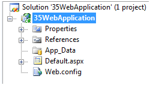
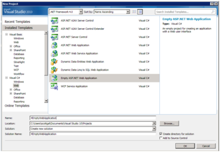
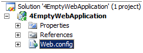
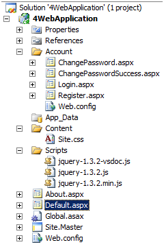
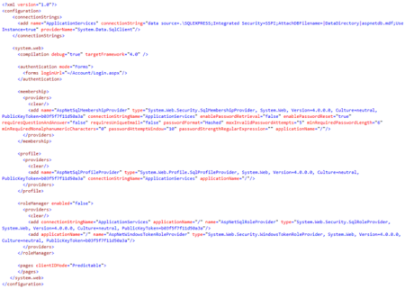
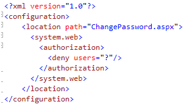
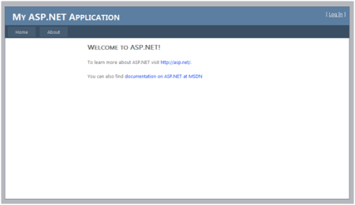
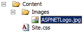
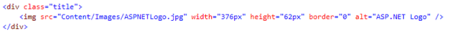
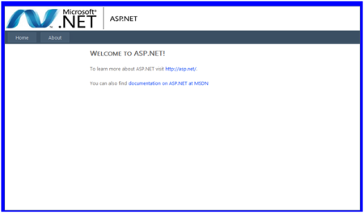

ASP.NET 4 and Visual Studio 2010 Web Development Overview
====================
> This document provides an overview of many of the new features for ASP.NET that are included in the.NET Framework 4 and in Visual Studio 2010.
> 
> [Download This Whitepaper](https://download.microsoft.com/download/7/1/A/71A105A9-89D6-4201-9CC5-AD6A3B7E2F22/ASP_NET_4_and_Visual_Studio_2010_Web_Development_Overview.pdf)

**Contents**

**[Core Services](#0.2__Toc253429238 "_Toc253429238")**  
[Web.config File Refactoring](#0.2__Toc253429239 "_Toc253429239")  
[Extensible Output Caching](#0.2__Toc253429240 "_Toc253429240")  
[Auto-Start Web Applications](#0.2__Toc253429241 "_Toc253429241")  
[Permanently Redirecting a Page](#0.2__Toc253429242 "_Toc253429242")  
[Shrinking Session State](#0.2__Toc253429243 "_Toc253429243")  
[Expanding the Range of Allowable URLs](#0.2__Toc253429244 "_Toc253429244")  
[Extensible Request Validation](#0.2__Toc253429245 "_Toc253429245")  
[Object Caching and Object Caching Extensibility](#0.2__Toc253429246 "_Toc253429246")  
[Extensible HTML, URL, and HTTP Header Encoding](#0.2__Toc253429247 "_Toc253429247")  
[Performance Monitoring for Individual Applications in a Single Worker Process](#0.2__Toc253429248 "_Toc253429248")  
[Multi-Targeting](#0.2__Toc253429249 "_Toc253429249")

**[Ajax](#0.2__Toc253429250 "_Toc253429250")**  
[jQuery Included with Web Forms and MVC](#0.2__Toc253429251 "_Toc253429251")  
[Content Delivery Network Support](#0.2__Toc253429252 "_Toc253429252")  
[ScriptManager Explicit Scripts](#0.2__Toc253429253 "_Toc253429253")

**[Web Forms](#0.2__Toc253429256 "_Toc253429256")**  
[Setting Meta Tags with the Page.MetaKeywords and Page.MetaDescription Properties](#0.2__Toc253429257 "_Toc253429257")  
[Enabling View State for Individual Controls](#0.2__Toc253429258 "_Toc253429258")  
[Changes to Browser Capabilities](#0.2__Toc253429259 "_Toc253429259")  
[Routing in ASP.NET 4](#0.2__Toc253429260 "_Toc253429260")  
[Setting Client IDs](#0.2__Toc253429261 "_Toc253429261")  
[Persisting Row Selection in Data Controls](#0.2__Toc253429262 "_Toc253429262")  
[ASP.NET Chart Control](#0.2__Toc253429263 "_Toc253429263")  
[Filtering Data with the QueryExtender Control](#0.2__Toc253429264 "_Toc253429264")  
[Html Encoded Code Expressions](#0.2__Toc253429265 "_Toc253429265")  
[Project Template Changes](#0.2__Toc253429266 "_Toc253429266")  
[CSS Improvements](#0.2__Toc253429267 "_Toc253429267")  
[Hiding div Elements Around Hidden Fields](#0.2__Toc253429268 "_Toc253429268")  
[Rendering an Outer Table for Templated Controls](#0.2__Toc253429269 "_Toc253429269")  
[ListView Control Enhancements](#0.2__Toc253429270 "_Toc253429270")  
[CheckBoxList and RadioButtonList Control Enhancements](#0.2__Toc253429271 "_Toc253429271")  
[Menu Control Improvements](#0.2__Toc253429272 "_Toc253429272")  
[Wizard and CreateUserWizard Controls 56](#0.2__Toc253429273 "_Toc253429273")

**[ASP.NET MVC](#0.2__Toc253429274 "_Toc253429274")**  
[Areas Support](#0.2__Toc253429275 "_Toc253429275")  
[Data-Annotation Attribute Validation Support](#0.2__Toc253429276 "_Toc253429276")  
[Templated Helpers](#0.2__Toc253429277 "_Toc253429277")

**[Dynamic Data](#0.2__Toc253429278 "_Toc253429278")**  
[Enabling Dynamic Data for Existing Projects](#0.2__Toc253429279 "_Toc253429279")  
[Declarative DynamicDataManager Control Syntax](#0.2__Toc253429280 "_Toc253429280")  
[Entity Templates](#0.2__Toc253429281 "_Toc253429281")  
[New Field Templates for URLs and E-mail Addresses](#0.2__Toc253429282 "_Toc253429282")  
[Creating Links with the DynamicHyperLink Control](#0.2__Toc253429283 "_Toc253429283")  
[Support for Inheritance in the Data Model](#0.2__Toc253429284 "_Toc253429284")  
[Support for Many-to-Many Relationships (Entity Framework Only)](#0.2__Toc253429285 "_Toc253429285")  
[New Attributes to Control Display and Support Enumerations](#0.2__Toc253429286 "_Toc253429286")  
[Enhanced Support for Filters](#0.2__Toc253429287 "_Toc253429287")

**[Visual Studio 2010 Web Development Improvements](#0.2__Toc253429288 "_Toc253429288")**  
[Improved CSS Compatibility](#0.2__Toc253429289 "_Toc253429289")  
[HTML and JavaScript Snippets](#0.2__Toc253429290 "_Toc253429290")  
[JavaScript IntelliSense Enhancements](#0.2__Toc253429291 "_Toc253429291")

**[Web Application Deployment with Visual Studio 2010](#0.2__Toc253429292 "_Toc253429292")**  
[Web Packaging](#0.2__Toc253429293 "_Toc253429293")  
[Web.config Transformation](#0.2__Toc253429294 "_Toc253429294")  
[Database Deployment](#0.2__Toc253429295 "_Toc253429295")  
[One-Click Publish for Web Applications](#0.2__Toc253429296 "_Toc253429296")  
[Resources](#0.2__Toc253429297 "_Toc253429297")

**[Disclaimer](#0.2__Toc253429298 "_Toc253429298")**

## Core Services

ASP.NET 4 introduces a number of features that improve core ASP.NET services such as output caching and session-state storage.

### Web.config File Refactoring

The `Web.config` file that contains the configuration for a Web application has grown considerably over the past few releases of the .NET Framework as new features have been added, such as Ajax, routing, and integration with IIS 7. This has made it harder to configure or start new Web applications without a tool like Visual Studio. In .the NET Framework 4, the major configuration elements have been moved to the `machine.config` file, and applications now inherit these settings. This allows the `Web.config` file in ASP.NET 4 applications either to be empty or to contain just the following lines, which specify for Visual Studio what version of the framework the application is targeting:

[!code-xml[Main](overview/samples/sample1.xml)]

### Extensible Output Caching

Since the time that ASP.NET 1.0 was released, output caching has enabled developers to store the generated output of pages, controls, and HTTP responses in memory. On subsequent Web requests, ASP.NET can serve content more quickly by retrieving the generated output from memory instead of regenerating the output from scratch. However, this approach has a limitation — generated content always has to be stored in memory, and on servers that are experiencing heavy traffic, the memory consumed by output caching can compete with memory demands from other portions of a Web application.

ASP.NET 4 adds an extensibility point to output caching that enables you to configure one or more custom output-cache providers. Output-cache providers can use any storage mechanism to persist HTML content. This makes it possible to create custom output-cache providers for diverse persistence mechanisms, which can include local or remote disks, cloud storage, and distributed cache engines.

You create a custom output-cache provider as a class that derives from the new *System.Web.Caching.OutputCacheProvider* type. You can then configure the provider in the `Web.config` file by using the new *providers* subsection of the *outputCache* element, as shown in the following example:

[!code-xml[Main](overview/samples/sample2.xml)]

By default in ASP.NET 4, all HTTP responses, rendered pages, and controls use the in-memory output cache, as shown in the previous example, where the *defaultProvider* attribute is set to AspNetInternalProvider. You can change the default output-cache provider used for a Web application by specifying a different provider name for *defaultProvider*.

In addition, you can select different output-cache providers per control and per request. The easiest way to choose a different output-cache provider for different Web user controls is to do so declaratively by using the new *providerName* attribute in a control directive, as shown in the following example:

[!code-aspx[Main](overview/samples/sample3.aspx)]

Specifying a different output cache provider for an HTTP request requires a little more work. Instead of declaratively specifying the provider, you override the new *GetOuputCacheProviderName* method in the `Global.asax` file to programmatically specify which provider to use for a specific request. The following example shows how to do this.

[!code-csharp[Main](overview/samples/sample4.cs)]

With the addition of output-cache provider extensibility to ASP.NET 4, you can now pursue more aggressive and more intelligent output-caching strategies for your Web sites. For example, it is now possible to cache the "Top 10" pages of a site in memory, while caching pages that get lower traffic on disk. Alternatively, you can cache every vary-by combination for a rendered page, but use a distributed cache so that the memory consumption is offloaded from front-end Web servers.

### Auto-Start Web Applications

Some Web applications need to load large amounts of data or perform expensive initialization processing before serving the first request. In earlier versions of ASP.NET, for these situations you had to devise custom approaches to "wake up" an ASP.NET application and then run initialization code during the *Application\_Load* method in the `Global.asax` file.

A new scalability feature named *auto-start* that directly addresses this scenario is available when ASP.NET 4 runs on IIS 7.5 on Windows Server 2008 R2. The auto-start feature provides a controlled approach for starting up an application pool, initializing an ASP.NET application, and then accepting HTTP requests.

> [!NOTE] 
> 
> IIS Application Warm-Up Module for IIS 7.5
> 
> The IIS team has released the first beta test version of the Application Warm-Up Module for IIS 7.5. This makes warming up your applications even easier than previously described. Instead of writing custom code, you specify the URLs of resources to execute before the Web application accepts requests from the network. This warm-up occurs during startup of the IIS service (if you configured the IIS application pool as *AlwaysRunning*) and when an IIS worker process recycles. During recycle, the old IIS worker process continues to execute requests until the newly spawned worker process is fully warmed up, so that applications experience no interruptions or other issues due to unprimed caches. Note that this module works with any version of ASP.NET, starting with version 2.0.
> 
> For more information, see [Application Warm-Up](https://www.iis.net/extensions/applicationwarmup%20on%20the%20IIS.net) on the IIS.net Web site. For a walkthrough that illustrates how to use the warm-up feature, see [Getting Started with the IIS 7.5 Application Warm-Up Module](https://www.iis.net/learn/manage) on the IIS.net Web site.

To use the auto-start feature, an IIS administrator sets an application pool in IIS 7.5 to be automatically started by using the following configuration in the `applicationHost.config` file:

[!code-xml[Main](overview/samples/sample5.xml)]

Because a single application pool can contain multiple applications, you specify individual applications to be automatically started by using the following configuration in the `applicationHost.config` file:

[!code-xml[Main](overview/samples/sample6.xml)]

When an IIS 7.5 server is cold-started or when an individual application pool is recycled, IIS 7.5 uses the information in the `applicationHost.config` file to determine which Web applications need to be automatically started. For each application that is marked for auto-start, IIS7.5 sends a request to ASP.NET 4 to start the application in a state during which the application temporarily does not accept HTTP requests. When it is in this state, ASP.NET instantiates the type defined by the *serviceAutoStartProvider* attribute (as shown in the previous example) and calls into its public entry point.

You create a managed auto-start type with the necessary entry point by implementing the *IProcessHostPreloadClient* interface, as shown in the following example:

[!code-csharp[Main](overview/samples/sample7.cs)]

After your initialization code runs in the *Preload* method and the method returns, the ASP.NET application is ready to process requests.

With the addition of auto-start to IIS .5 and ASP.NET 4, you now have a well-defined approach for performing expensive application initialization prior to processing the first HTTP request. For example, you can use the new auto-start feature to initialize an application and then signal a load-balancer that the application was initialized and ready to accept HTTP traffic.

### Permanently Redirecting a Page

It is common practice in Web applications to move pages and other content around over time, which can lead to an accumulation of stale links in search engines. In ASP.NET, developers have traditionally handled requests to old URLs by using by using the *Response.Redirect* method to forward a request to the new URL. However, the *Redirect* method issues an HTTP 302 Found (temporary redirect) response, which results in an extra HTTP round trip when users attempt to access the old URLs.

ASP.NET 4 adds a new *RedirectPermanent* helper method that makes it easy to issue HTTP 301 Moved Permanently responses, as in the following example:

[!code-csharp[Main](overview/samples/sample8.cs)]

Search engines and other user agents that recognize permanent redirects will store the new URL that is associated with the content, which eliminates the unnecessary round trip made by the browser for temporary redirects.

### Shrinking Session State

ASP.NET provides two default options for storing session state across a Web farm: a session-state provider that invokes an out-of-process session-state server, and a session-state provider that stores data in a Microsoft SQL Server database. Because both options involve storing state information outside a Web application's worker process, session state has to be serialized before it is sent to remote storage. Depending on how much information a developer saves in session state, the size of the serialized data can grow quite large.

ASP.NET 4 introduces a new compression option for both kinds of out-of-process session-state providers. When the *compressionEnabled* configuration option shown in the following example is set to *true*, ASP.NET will compress (and decompress) serialized session state by using the .NET Framework *System.IO.Compression.GZipStream* class.

[!code-xml[Main](overview/samples/sample9.xml)]

With the simple addition of the new attribute to the `Web.config` file, applications with spare CPU cycles on Web servers can realize substantial reductions in the size of serialized session-state data.

### Expanding the Range of Allowable URLs

ASP.NET 4 introduces new options for expanding the size of application URLs. Previous versions of ASP.NET constrained URL path lengths to 260 characters, based on the NTFS file-path limit. In ASP.NET 4, you have the option to increase (or decrease) this limit as appropriate for your applications, using two new *httpRuntime* configuration attributes. The following example shows these new attributes.

[!code-xml[Main](overview/samples/sample10.xml)]

To allow longer or shorter paths (the portion of the URL that does not include protocol, server name, and query string), modify the *[maxUrlLength](https://msdn.microsoft.com/en-us/library/system.web.configuration.httpruntimesection.maxurllength.aspx)* attribute. To allow longer or shorter query strings, modify the value of the *[maxQueryStringLength](https://msdn.microsoft.com/en-us/library/system.web.configuration.httpruntimesection.maxquerystringlength.aspx)* attribute.

ASP.NET 4 also enables you to configure the characters that are used by the URL character check. When ASP.NET finds an invalid character in the path portion of a URL, it rejects the request and issues an HTTP 400 error. In previous versions of ASP.NET, the URL character checks were limited to a fixed set of characters. In ASP.NET 4, you can customize the set of valid characters using the new *requestPathInvalidChars* attribute of the *httpRuntime* configuration element, as shown in the following example:

[!code-xml[Main](overview/samples/sample11.xml)]

By default, the *requestPathInvalidChars* attribute defines eight characters as invalid. (In the string that is assigned to *requestPathInvalidChars* by default*,*the less than (&lt;), greater than (&gt;), and ampersand (&amp;) characters are encoded, because the `Web.config` file is an XML file.) You can customize the set of invalid characters as needed.

> [!NOTE]
> Note ASP.NET 4 always rejects URL paths that contain characters in the ASCII range of 0x00 to 0x1F, because those are invalid URL characters as defined in RFC 2396 of the IETF ([http://www.ietf.org/rfc/rfc2396.txt](http://www.ietf.org/rfc/rfc2396.txt)). On versions of Windows Server that run IIS 6 or higher, the http.sys protocol device driver automatically rejects URLs with these characters.

### Extensible Request Validation

ASP.NET request validation searches incoming HTTP request data for strings that are commonly used in cross-site scripting (XSS) attacks. If potential XSS strings are found, request validation flags the suspect string and returns an error. The built-in request validation returns an error only when it finds the most common strings used in XSS attacks. Previous attempts to make the XSS validation more aggressive resulted in too many false positives. However, customers might want request validation that is more aggressive, or conversely might want to intentionally relax XSS checks for specific pages or for specific types of requests.

In ASP.NET 4, the request validation feature has been made extensible so that you can use custom request-validation logic. To extend request validation, you create a class that derives from the new *System.Web.Util.RequestValidator* type, and you configure the application (in the *httpRuntime* section of the `Web.config` file) to use the custom type. The following example shows how to configure a custom request-validation class:

[!code-xml[Main](overview/samples/sample12.xml)]

The new *requestValidationType* attribute requires a standard .NET Framework type identifier string that specifies the class that provides custom request validation. For each request, ASP.NET invokes the custom type to process each piece of incoming HTTP request data. The incoming URL, all the HTTP headers (both cookies and custom headers), and the entity body are all available for inspection by a custom request validation class like that shown in the following example:

[!code-csharp[Main](overview/samples/sample13.cs)]

For cases where you do not want to inspect a piece of incoming HTTP data, the request-validation class can fall back to let the ASP.NET default request validation run by simply calling *base.IsValidRequestString.*

### Object Caching and Object Caching Extensibility

Since its first release, ASP.NET has included a powerful in-memory object cache (*System.Web.Caching.Cache*). The cache implementation has been so popular that it has been used in non-Web applications. However, it is awkward for a Windows Forms or WPF application to include a reference to `System.Web.dll` just to be able to use the ASP.NET object cache.

To make caching available for all applications, the .NET Framework 4 introduces a new assembly, a new namespace, some base types, and a concrete caching implementation. The new `System.Runtime.Caching.dll` assembly contains a new caching API in the *System.Runtime.Caching* namespace. The namespace contains two core sets of classes:

- Abstract types that provide the foundation for building any type of custom cache implementation.
- A concrete in-memory object cache implementation (the *System.Runtime.Caching.MemoryCache* class).

The new *MemoryCache* class is modeled closely on the ASP.NET cache, and it shares much of the internal cache engine logic with ASP.NET. Although the public caching APIs in *System.Runtime.Caching* have been updated to support development of custom caches, if you have used the ASP.NET *Cache* object, you will find familiar concepts in the new APIs.

An in-depth discussion of the new *MemoryCache* class and supporting base APIs would require an entire document. However, the following example gives you an idea of how the new cache API works. The example was written for a Windows Forms application, without any dependency on `System.Web.dll`.

[!code-csharp[Main](overview/samples/sample14.cs)]

### Extensible HTML, URL, and HTTP Header Encoding

In ASP.NET 4, you can create custom encoding routines for the following common text-encoding tasks:

- HTML encoding.
- URL encoding.
- HTML attribute encoding.
- Encoding outbound HTTP headers.

You can create a custom encoder by deriving from the new *System.Web.Util.HttpEncoder* type and then configuring ASP.NET to use the custom type in the *httpRuntime* section of the `Web.config` file, as shown in the following example:

[!code-xml[Main](overview/samples/sample15.xml)]

After a custom encoder has been configured, ASP.NET automatically calls the custom encoding implementation whenever public encoding methods of the *System.Web.HttpUtility* or *System.Web.HttpServerUtility* classes are called. This lets one part of a Web development team create a custom encoder that implements aggressive character encoding, while the rest of the Web development team continues to use the public ASP.NET encoding APIs. By centrally configuring a custom encoder in the *httpRuntime* element, you are guaranteed that all text-encoding calls from the public ASP.NET encoding APIs are routed through the custom encoder.

### Performance Monitoring for Individual Applications in a Single Worker Process

In order to increase the number of Web sites that can be hosted on a single server, many hosters run multiple ASP.NET applications in a single worker process. However, if multiple applications use a single shared worker process, it is difficult for server administrators to identify an individual application that is experiencing problems.

ASP.NET 4 leverages new resource-monitoring functionality introduced by the CLR. To enable this functionality, you can add the following XML configuration snippet to the `aspnet.config` configuration file.

[!code-xml[Main](overview/samples/sample16.xml)]

> [!NOTE]
> Note The `aspnet.config` file is in the directory where the .NET Framework is installed. It is not the `Web.config` file.

When the *appDomainResourceMonitoring* feature has been enabled, two new performance counters are available in the "ASP.NET Applications" performance category: *% Managed Processor Time* and *Managed Memory Used*. Both of these performance counters use the new CLR application-domain resource management feature to track estimated CPU time and managed memory utilization of individual ASP.NET applications. As a result, with ASP.NET 4, administrators now have a more granular view into the resource consumption of individual applications running in a single worker process.

### Multi-Targeting

You can create an application that targets a specific version of the .NET Framework. In ASP.NET 4, a new attribute in the *compilation* element of the `Web.config` file lets you target the .NET Framework 4 and later. If you explicitly target the .NET Framework 4, and if you include optional elements in the `Web.config` file such as the entries for *system.codedom*, these elements must be correct for the .NET Framework 4. (If you do not explicitly target the .NET Framework 4, the target framework is inferred from the lack of an entry in the `Web.config` file.)

The following example shows the use of the *targetFramework* attribute in the *compilation* element of the `Web.config` file.

[!code-xml[Main](overview/samples/sample17.xml)]

Note the following about targeting a specific version of the .NET Framework:

- In a .NET Framework 4 application pool, the ASP.NET build system assumes the .NET Framework 4 as a target if the `Web.config` file does not include the *targetFramework* attribute or if the `Web.config` file is missing. (You might have to make coding changes to your application to make it run under the .NET Framework 4.)
- If you do include the *targetFramework* attribute, and if the *system.codeDom* element is defined in the `Web.config` file, this file must contain the correct entries for the .NET Framework 4.
- If you are using the *aspnet\_compiler* command to precompile your application (such as in a build environment), you must use the correct version of the *aspnet\_compiler* command for the target framework. Use the compiler that shipped with the .NET Framework 2.0 (%WINDIR%\Microsoft.NET\Framework\v2.0.50727) to compile for the .NET Framework 3.5 and earlier versions. Use the compiler that ships with the .NET Framework 4 to compile applications created using that framework or using later versions.
- At run time, the compiler uses the latest framework assemblies that are installed on the computer (and therefore in the GAC). If an update is made later to the framework (for example, a hypothetical version 4.1 is installed), you will be able to use features in the newer version of the framework even though the *targetFramework* attribute targets a lower version (such as 4.0). (However, at design time in Visual Studio 2010 or when you use the *aspnet\_compiler* command, using newer features of the framework will cause compiler errors).

## Ajax

### jQuery Included with Web Forms and MVC

The Visual Studio templates for both Web Forms and MVC include the open-source jQuery library. When you create a new website or project, a Scripts folder containing the following 3 files is created:

- jQuery-1.4.1.js – The human-readable, unminified version of the jQuery library.
- jQuery-14.1.min.js – The minified version of the jQuery library.
- jQuery-1.4.1-vsdoc.js – The Intellisense documentation file for the jQuery library.

Include the unminified version of jQuery while developing an application. Include the minified version of jQuery for production applications.

For example, the following Web Forms page illustrates how you can use jQuery to change the background color of ASP.NET TextBox controls to yellow when they have focus.

[!code-aspx[Main](overview/samples/sample18.aspx)]

### Content Delivery Network Support

The Microsoft Ajax Content Delivery Network (CDN) enables you to easily add ASP.NET Ajax and jQuery scripts to your Web applications. For example, you can start using the jQuery library simply by adding a `<script>` tag to your page that points to Ajax.microsoft.com like this:

[!code-html[Main](overview/samples/sample19.html)]

By taking advantage of the Microsoft Ajax CDN, you can significantly improve the performance of your Ajax applications. The contents of the Microsoft Ajax CDN are cached on servers located around the world. In addition, the Microsoft Ajax CDN enables browsers to reuse cached JavaScript files for Web sites that are located in different domains.

The Microsoft Ajax Content Delivery Network supports SSL (HTTPS) in case you need to serve a web page using the Secure Sockets Layer.

To learn more about the Microsoft Ajax CDN, visit the following website:

[https://www.asp.net/ajaxlibrary/CDN.ashx](../../ajax/cdn/overview.md)

The ASP.NET ScriptManager supports the Microsoft Ajax CDN. Simply by setting one property, the EnableCdn property, you can retrieve all ASP.NET framework JavaScript files from the CDN:

[!code-aspx[Main](overview/samples/sample20.aspx)]

After you set the EnableCdn property to the value true, the ASP.NET framework will retrieve all ASP.NET framework JavaScript files from the CDN including all JavaScript files used for validation and the UpdatePanel. Setting this one property can have a dramatic impact on the performance of your web application.

You can set the CDN path for your own JavaScript files by using the WebResource attribute. The new CdnPath property specifies the path to the CDN used when you set the EnableCdn property to the value true:

[!code-csharp[Main](overview/samples/sample21.cs)]

### ScriptManager Explicit Scripts

In the past, if you used the ASP.NET ScriptManger then you were required to load the entire monolithic ASP.NET Ajax Library. By taking advantage of the new ScriptManager.AjaxFrameworkMode property, you can control exactly which components of the ASP.NET Ajax Library are loaded and load only the components of the ASP.NET Ajax Library that you need.

The ScriptManager.AjaxFrameworkMode property can be set to the following values:

- Enabled -- Specifies that the ScriptManager control automatically includes the MicrosoftAjax.js script file, which is a combined script file of every core framework script (legacy behavior).
- Disabled -- Specifies that all Microsoft Ajax script features are disabled and that the ScriptManager control does not reference any scripts automatically.
- Explicit -- Specifies that you will explicitly include script references to individual framework core script file that your page requires, and that you will include references to the dependencies that each script file requires.

For example, if you set the AjaxFrameworkMode property to the value Explicit then you can specify the particular ASP.NET Ajax component scripts that you need:

[!code-aspx[Main](overview/samples/sample22.aspx)]

## Web Forms

Web Forms has been a core feature in ASP.NET since the release of ASP.NET 1.0. Many enhancements have been in this area for ASP.NET 4, including the following:

- The ability to set *meta* tags.
- More control over view state.
- Easier ways to work with browser capabilities.
- Support for using ASP.NET routing with Web Forms.
- More control over generated IDs.
- The ability to persist selected rows in data controls.
- More control over rendered HTML in the *FormView* and *ListView* controls.
- Filtering support for data source controls.

### Setting Meta Tags with the Page.MetaKeywords and Page.MetaDescription Properties

ASP.NET 4 adds two properties to the *Page* class, *MetaKeywords* and *MetaDescription*. These two properties represent corresponding *meta* tags in your page, as shown in the following example:

[!code-aspx[Main](overview/samples/sample23.aspx)]

These two properties work the same way that the page's *Title* property does. They follow these rules:

1. If there are no *meta* tags in the *head* element that match the property names (that is, name="keywords" for *Page.MetaKeywords* and name="description" for *Page.MetaDescription*, meaning that these properties have not been set), the *meta* tags will be added to the page when it is rendered.
2. If there are already *meta* tags with these names, these properties act as get and set methods for the contents of the existing tags.

You can set these properties at run time, which lets you get the content from a database or other source, and which lets you set the tags dynamically to describe what a particular page is for.

You can also set the *Keywords* and *Description* properties in the *@ Page* directive at the top of the Web Forms page markup, as in the following example:

[!code-aspx[Main](overview/samples/sample24.aspx)]

This will override the *meta* tag contents (if any) already declared in the page.

The contents of the description *meta* tag are used for improving search listing previews in Google. (For details, see [Improve snippets with a meta description makeover](http://googlewebmastercentral.blogspot.com/2007/09/improve-snippets-with-meta-description.html) on the Google Webmaster Central blog.) Google and Windows Live Search do not use the contents of the keywords for anything, but other search engines might. For more information, see [Meta Keywords Advice](http://www.searchengineguide.com/richard-ball/meta-keywords-a.php) on the Search Engine Guide Web site.

These new properties are a simple feature, but they save you from the requirement to add these manually or from writing your own code to create the *meta* tags.

### Enabling View State for Individual Controls

By default, view state is enabled for the page, with the result that each control on the page potentially stores view state even if it is not required for the application. View state data is included in the markup that a page generates and increases the amount of time it takes to send a page to the client and post it back. Storing more view state than is necessary can cause significant performance degradation. In earlier versions of ASP.NET, developers could disable view state for individual controls in order to reduce page size, but had to do so explicitly for individual controls. In ASP.NET 4, Web server controls include a *ViewStateMode* property that lets you disable view state by default and then enable it only for the controls that require it in the page.

The *ViewStateMode* property takes an enumeration that has three values: *Enabled*, *Disabled*, and *Inherit*. *Enabled* enables view state for that control and for any child controls that are set to *Inherit* or that have nothing set. *Disabled* disables view state, and *Inherit* specifies that the control uses the *ViewStateMode* setting from the parent control.

The following example shows how the *ViewStateMode* property works. The markup and code for the controls in the following page includes values for the *ViewStateMode* property:

[!code-aspx[Main](overview/samples/sample25.aspx)]

As you can see, the code disables view state for the PlaceHolder1 control. The child label1 control inherits this property value (*Inherit* is the default value for *ViewStateMode* for controls.) and therefore saves no view state. In the PlaceHolder2 control, *ViewStateMode* is set to *Enabled*, so label2 inherits this property and saves view state. When the page is first loaded, the *Text* property of both *Label* controls is set to the string "[DynamicValue]".

The effect of these settings is that when the page loads the first time, the following output is displayed in the browser:

Disabled `: [DynamicValue]`

Enabled:`[DynamicValue]`

After a postback, however, the following output is displayed:

Disabled `: [DeclaredValue]`

Enabled:`[DynamicValue]`

The label1 control (whose *ViewStateMode* value is set to *Disabled*) has not preserved the value that it was set to in code. However, the label2 control (whose *ViewStateMode* value is set to *Enabled*) has preserved its state.

You can also set *ViewStateMode* in the *@ Page* directive, as in the following example:

[!code-aspx[Main](overview/samples/sample26.aspx)]

The *Page* class is just another control; it acts as the parent control for all the other controls in the page. The default value of *ViewStateMode* is *Enabled* for instances of *Page*. Because controls default to *Inherit*, controls will inherit the *Enabled* property value unless you set *ViewStateMode* at page or control level.

The value of the *ViewStateMode* property determines if view state is maintained only if the *EnableViewState* property is set to *true*. If the *EnableViewState* property is set to *false*, view state will not be maintained even if *ViewStateMode* is set to *Enabled*.

A good use for this feature is with *ContentPlaceHolder* controls in master pages, where you can set *ViewStateMode* to *Disabled* for the master page and then enable it individually for *ContentPlaceHolder* controls that in turn contain controls that require view state.

### Changes to Browser Capabilities

ASP.NET determines the capabilities of the browser that a user is using to browse your site by using a feature called *browser capabilities*. Browser capabilities are represented by the *HttpBrowserCapabilities* object (exposed by the *Request.Browser* property). For example, you can use the *HttpBrowserCapabilities* object to determine whether the type and version of the current browser supports a particular version of JavaScript. Or, you can use the *HttpBrowserCapabilities* object to determine whether the request originated from a mobile device.

The *HttpBrowserCapabilities* object is driven by a set of browser definition files. These files contain information about the capabilities of particular browsers. In ASP.NET 4, these browser definition files have been updated to contain information about recently introduced browsers and devices such as Google Chrome, Research in Motion BlackBerry smartphones, and Apple iPhone.

The following list shows new browser definition files:

- *blackberry.browser*
- *chrome.browser*
- *Default.browser*
- *firefox.browser*
- *gateway.browser*
- *generic.browser*
- *ie.browser*
- *iemobile.browser*
- *iphone.browser*
- *opera.browser*
- *safari.browser*

#### Using Browser Capabilities Providers

In ASP.NET version 3.5 Service Pack 1, you can define the capabilities that a browser has in the following ways:

- At the computer level, you create or update a `.browser` XML file in the following folder:

- [!code-console[Main](overview/samples/sample27.cmd)]

- After you define the browser capability, you run the following command from the Visual Studio Command Prompt in order to rebuild the browser capabilities assembly and add it to the GAC:

- [!code-console[Main](overview/samples/sample28.cmd)]

- For an individual application, you create a `.browser` file in the application's `App_Browsers` folder.

These approaches require you to change XML files, and for computer-level changes, you must restart the application after you run the aspnet\_regbrowsers.exe process.

ASP.NET 4 includes a feature referred to as *browser capabilities providers*. As the name suggests, this lets you build a provider that in turn lets you use your own code to determine browser capabilities.

In practice, developers often do not define custom browser capabilities. Browser files are hard to update, the process for updating them is fairly complicated, and the XML syntax for `.browser` files can be complex to use and define. What would make this process much easier is if there were a common browser definition syntax, or a database that contained up-to-date browser definitions, or even a Web service for such a database. The new browser capabilities providers feature makes these scenarios possible and practical for third-party developers.

There are two main approaches for using the new ASP.NET 4 browser capabilities provider feature: extending the ASP.NET browser capabilities definition functionality, or totally replacing it. The following sections describe first how to replace the functionality, and then how to extend it.

#### Replacing the ASP.NET Browser Capabilities Functionality

To replace the ASP.NET browser capabilities definition functionality completely, follow these steps:

1. Create a provider class that derives from *HttpCapabilitiesProvider* and that overrides the *GetBrowserCapabilities* method, as in the following example: 

    [!code-csharp[Main](overview/samples/sample29.cs)]

    The code in this example creates a new *HttpBrowserCapabilities* object, specifying only the capability named browser and setting that capability to MyCustomBrowser.
2. Register the provider with the application. 

    In order to use a provider with an application, you must add the *provider* attribute to the *browserCaps* section in the `Web.config` or `Machine.config` files. (You can also define the provider attributes in a *location* element for specific directories in application, such as in a folder for a specific mobile device.) The following example shows how to set the *provider* attribute in a configuration file:

    [!code-xml[Main](overview/samples/sample30.xml)]

    Another way to register the new browser capability definition is to use code, as shown in the following example:

    [!code-csharp[Main](overview/samples/sample31.cs)]

    This code must run in the *Application\_Start* event of the `Global.asax` file. Any change to the *BrowserCapabilitiesProvider* class must occur before any code in the application executes, in order to make sure that the cache remains in a valid state for the resolved *HttpCapabilitiesBase* object.

#### Caching the HttpBrowserCapabilities Object

The preceding example has one problem, which is that the code would run each time the custom provider is invoked in order to get the *HttpBrowserCapabilities* object. This can happen multiple times during each request. In the example, the code for the provider does not do much. However, if the code in your custom provider performs significant work in order to get the *HttpBrowserCapabilities* object, this can affect performance. To prevent this from happening, you can cache the *HttpBrowserCapabilities* object. Follow these steps:

1. Create a class that derives from *HttpCapabilitiesProvider*, like the one in the following example: 

    [!code-csharp[Main](overview/samples/sample32.cs)]

    In the example, the code generates a cache key by calling a custom BuildCacheKey method, and it gets the length of time to cache by calling a custom GetCacheTime method. The code then adds the resolved *HttpBrowserCapabilities* object to the cache. The object can be retrieved from the cache and reused on subsequent requests that make use of the custom provider.
2. Register the provider with the application as described in the preceding procedure.

#### Extending ASP.NET Browser Capabilities Functionality

The previous section described how to create a new *HttpBrowserCapabilities* object in ASP.NET 4. You can also extend the ASP.NET browser capabilities functionality by adding new browser capabilities definitions to those that are already in ASP.NET. You can do this without using the XML browser definitions. The following procedure shows how.

1. Create a class that derives from *HttpCapabilitiesEvaluator* and that overrides the *GetBrowserCapabilities* method, as shown in the following example: 

    [!code-csharp[Main](overview/samples/sample33.cs)]

    This code first uses the ASP.NET browser capabilities functionality to try to identify the browser. However, if no browser is identified based on the information defined in the request (that is, if the *Browser* property of the *HttpBrowserCapabilities* object is the string "Unknown"), the code calls the custom provider (MyBrowserCapabilitiesEvaluator) to identify the browser.
2. Register the provider with the application as described in the previous example.

#### Extending Browser Capabilities Functionality by Adding New Capabilities to Existing Capabilities Definitions

In addition to creating a custom browser definition provider and to dynamically creating new browser definitions, you can extend existing browser definitions with additional capabilities. This lets you use a definition that is close to what you want but lacks only a few capabilities. To do this, use the following steps.

1. Create a class that derives from *HttpCapabilitiesEvaluator* and that overrides the *GetBrowserCapabilities* method, as shown in the following example: 

    [!code-csharp[Main](overview/samples/sample34.cs)]

    The example code extends the existing ASP.NET *HttpCapabilitiesEvaluator* class and gets the *HttpBrowserCapabilities* object that matches the current request definition by using the following code:

    [!code-csharp[Main](overview/samples/sample35.cs)]

    The code can then add or modify a capability for this browser. There are two ways to specify a new browser capability:

    - Add a key/value pair to the *IDictionary* object that is exposed by the *Capabilities* property of the *HttpCapabilitiesBase* object. In the previous example, the code adds a capability named MultiTouch with a value of *true*.
    - Set existing properties of the *HttpCapabilitiesBase* object. In the previous example, the code sets the *Frames* property to *true*. This property is simply an accessor for the *IDictionary* object that is exposed by the *Capabilities* property. 

        > [!NOTE]
        > Note This model applies to any property of *HttpBrowserCapabilities*, including control adapters.
2. Register the provider with the application as described in the earlier procedure.

### Routing in ASP.NET 4

ASP.NET 4 adds built-in support for using routing with Web Forms. Routing lets you configure an application to accept request URLs that do not map to physical files. Instead, you can use routing to define URLs that are meaningful to users and that can help with search-engine optimization (SEO) for your application. For example, the URL for a page that displays product categories in an existing application might look like the following example:

[!code-console[Main](overview/samples/sample36.cmd)]

By using routing, you can configure the application to accept the following URL to render the same information:

[!code-console[Main](overview/samples/sample37.cmd)]

Routing has been available starting with ASP.NET 3.5 SP1. (For an example of how to use routing in ASP.NET 3.5 SP1, see the entry [Using Routing With WebForms](http://haacked.com/archive/2008/03/11/using-routing-with-webforms.aspx "Title of this entry.") on Phil Haack's blog.) However, ASP.NET 4 includes some features that make it easier to use routing, including the following:

- The *PageRouteHandler* class, which is a simple HTTP handler that you use when you define routes. The class passes data to the page that the request is routed to.
- The new properties *HttpRequest.RequestContext* and *Page.RouteData* (which is a proxy for the *HttpRequest.RequestContext.RouteData* object). These properties make it easier to access information that is passed from the route.
- The following new expression builders, which are defined in *System.Web.Compilation.RouteUrlExpressionBuilder* and *System.Web.Compilation.RouteValueExpressionBuilder*:
- *RouteUrl*, which provides a simple way to create a URL that corresponds to a route URL within an ASP.NET server control.
- *RouteValue*, which provides a simple way to extract information from the *RouteContext* object.
- The *RouteParameter* class, which makes it easier to pass data contained in a *RouteContext* object to a query for a data source control (similar to [*FormParameter*](https://msdn.microsoft.com/en-us/library/system.web.ui.webcontrols.formparameter.aspx)).

#### Routing for Web Forms Pages

The following example shows how to define a Web Forms route by using the new *MapPageRoute* method of the *Route* class:

[!code-csharp[Main](overview/samples/sample38.cs)]

ASP.NET 4 introduces the *MapPageRoute* method. The following example is equivalent to the SearchRoute definition shown in the previous example, but uses the *PageRouteHandler* class.

[!code-csharp[Main](overview/samples/sample39.cs)]

The code in the example maps the route to a physical page (in the first route, to `~/search.aspx`). The first route definition also specifies that the parameter named searchterm should be extracted from the URL and passed to the page.

The *MapPageRoute* method supports the following method overloads:

- *MapPageRoute(string routeName, string routeUrl, string physicalFile, bool checkPhysicalUrlAccess)*
- *MapPageRoute(string routeName, string routeUrl, string physicalFile, bool checkPhysicalUrlAccess, RouteValueDictionary defaults)*
- *MapPageRoute(string routeName, string routeUrl, string physicalFile, bool checkPhysicalUrlAccess, RouteValueDictionary defaults, RouteValueDictionary constraints)*

The *checkPhysicalUrlAccess* parameter specifies whether the route should check the security permissions for the physical page being routed to (in this case, search.aspx) and the permissions on the incoming URL (in this case, search/{searchterm}). If the value of *checkPhysicalUrlAccess* is *false*, only the permissions of the incoming URL will be checked. These permissions are defined in the `Web.config` file using settings such as the following:

[!code-xml[Main](overview/samples/sample40.xml)]

In the example configuration, access is denied to the physical page `search.aspx` for all users except those who are in the admin role. When the *checkPhysicalUrlAccess* parameter is set to *true* (which is its default value), only admin users are allowed to access the URL /search/{searchterm}, because the physical page search.aspx is restricted to users in that role. If *checkPhysicalUrlAccess* is set to *false* and the site is configured as shown in the previous example, all authenticated users are allowed to access the URL /search/{searchterm}.

#### Reading Routing Information in a Web Forms Page

In the code of the Web Forms physical page, you can access the information that routing has extracted from the URL (or other information that another object has added to the *RouteData* object) by using two new properties: *HttpRequest.RequestContext* and *Page.RouteData*. (*Page.RouteData* wraps *HttpRequest.RequestContext.RouteData*.) The following example shows how to use *Page.RouteData*.

[!code-csharp[Main](overview/samples/sample41.cs)]

The code extracts the value that was passed for the searchterm parameter, as defined in the example route earlier. Consider the following request URL:

[!code-console[Main](overview/samples/sample42.cmd)]

When this request is made, the word "scott" would be rendered in the `search.aspx` page.

#### Accessing Routing Information in Markup

The method described in the previous section shows how to get route data in code in a Web Forms page. You can also use expressions in markup that give you access to the same information. Expression builders are a powerful and elegant way to work with declarative code. (For more information, see the entry [Express Yourself With Custom Expression Builders](http://haacked.com/archive/2006/11/29/Express_Yourself_With_Custom_Expression_Builders.aspx) on Phil Haack's blog.)

ASP.NET 4 includes two new expression builders for Web Forms routing. The following example shows how to use them.

[!code-aspx[Main](overview/samples/sample43.aspx)]

In the example, the *RouteUrl* expression is used to define a URL that is based on a route parameter. This saves you from having to hard-code the complete URL into the markup, and lets you change the URL structure later without requiring any change to this link.

Based on the route defined earlier, this markup generates the following URL:

[!code-console[Main](overview/samples/sample44.cmd)]

ASP.NET automatically works out the correct route (that is, it generates the correct URL) based on the input parameters. You can also include a route name in the expression, which lets you specify a route to use.

The following example shows how to use the *RouteValue* expression.

[!code-aspx[Main](overview/samples/sample45.aspx)]

When the page that contains this control runs, the value "scott" is displayed in the label.

The *RouteValue* expression makes it simple to use route data in markup, and it avoids having to work with the more complex Page.RouteData["x"] syntax in markup.

#### Using Route Data for Data Source Control Parameters

The *RouteParameter* class lets you specify route data as a parameter value for queries in a data source control. It [works much like the](https://msdn.microsoft.com/en-us/library/system.web.ui.webcontrols.formparameter.aspx) class, as shown in the following example:

[!code-aspx[Main](overview/samples/sample46.aspx)]

In this case, the value of the route parameter searchterm will be used for the @companyname parameter in the *Select* statement.

### Setting Client IDs

The new *ClientIDMode* property addresses a long-standing issue in ASP.NET, namely how controls create the *id* attribute for elements that they render. Knowing the *id* attribute for rendered elements is important if your application includes client script that references these elements.

The *id* attribute in HTML that is rendered for Web server controls is generated based on the *ClientID* property of the control. Until ASP.NET 4, the algorithm for generating the *id* attribute from the *ClientID* property has been to concatenate the naming container (if any) with the ID, and in the case of repeated controls (as in data controls), to add a prefix and a sequential number. While this has always guaranteed that the IDs of controls in the page are unique, the algorithm has resulted in control IDs that were not predictable, and were therefore difficult to reference in client script.

The new *ClientIDMode* property lets you specify more precisely how the client ID is generated for controls. You can set the *ClientIDMode* property for any control, including for the page. Possible settings are the following:

- *AutoID* – This is equivalent to the algorithm for generating *ClientID* property values that was used in earlier versions of ASP.NET.
- *Static* – This specifies that the *ClientID* value will be the same as the ID without concatenating the IDs of parent naming containers. This can be useful in Web user controls. Because a Web user control can be located on different pages and in different container controls, it can be difficult to write client script for controls that use the *AutoID* algorithm because you cannot predict what the ID values will be.
- *Predictable* – This option is primarily for use in data controls that use repeating templates. It concatenates the ID properties of the control's naming containers, but generated *ClientID* values do not contain strings like "ctlxxx". This setting works in conjunction with the *ClientIDRowSuffix* property of the control. You set the *ClientIDRowSuffix* property to the name of a data field, and the value of that field is used as the suffix for the generated *ClientID* value. Typically you would use the primary key of a data record as the *ClientIDRowSuffix* value.
- *Inherit* – This setting is the default behavior for controls; it specifies that a control's ID generation is the same as its parent.

You can set the *ClientIDMode* property at the page level. This defines the default *ClientIDMode* value for all controls in the current page.

The default *ClientIDMode* value at the page level is *AutoID*, and the default *ClientIDMode* value at the control level is *Inherit*. As a result, if you do not set this property anywhere in your code, all controls will default to the *AutoID* algorithm.

You set the page-level value in the *@ Page* directive, as shown in the following example:

[!code-aspx[Main](overview/samples/sample47.aspx)]

You can also set the *ClientIDMode* value in the configuration file, either at the computer (machine) level or at the application level. This defines the default *ClientIDMode* setting for all controls in all pages in the application. If you set the value at the computer level, it defines the default *ClientIDMode* setting for all Web sites on that computer. The following example shows the *ClientIDMode* setting in the configuration file:

[!code-xml[Main](overview/samples/sample48.xml)]

As noted earlier, the value of the *ClientID* property is derived from the naming container for a control's parent. In some scenarios, such as when you are using master pages, controls can end up with IDs like those in the following rendered HTML:

[!code-html[Main](overview/samples/sample49.html)]

Even though the *input* element shown in the markup (from a *TextBox* control) is only two naming containers deep in the page (the nested *ContentPlaceholder* controls), because of the way master pages are processed, the end result is a control ID like the following:

[!code-console[Main](overview/samples/sample50.cmd)]

This ID is guaranteed to be unique in the page, but is unnecessarily long for most purposes. Imagine that you want to reduce the length of the rendered ID, and to have more control over how the ID is generated. (For example, you want to eliminate "ctlxxx" prefixes.) The easiest way to achieve this is by setting the *ClientIDMode* property as shown in the following example:

[!code-aspx[Main](overview/samples/sample51.aspx)]

In this sample, the *ClientIDMode* property is set to *Static* for the outermost *NamingPanel* element, and set to *Predictable* for the inner *NamingControl* element. These settings result in the following markup (the rest of the page and the master page is assumed to be the same as in the previous example):

[!code-html[Main](overview/samples/sample52.html)]

The *Static* setting has the effect of resetting the naming hierarchy for any controls inside the outermost *NamingPanel* element, and of eliminating the *ContentPlaceHolder* and *MasterPage* IDs from the generated ID. (The *name* attribute of rendered elements is unaffected, so the normal ASP.NET functionality is retained for events, view state, and so on.) A side effect of resetting the naming hierarchy is that even if you move the markup for the *NamingPanel* elements to a different *ContentPlaceholder* control, the rendered client IDs remain the same.

> [!NOTE]
> Note It is up to you to make sure that the rendered control IDs are unique. If they are not, it can break any functionality that requires unique IDs for individual HTML elements, such as the client *document.getElementById* function.

#### Creating Predictable Client IDs in Data-Bound Controls

The *ClientID* values that are generated for controls in a data-bound list control by the legacy algorithm can be long and are not really predictable. The *ClientIDMode* functionality can help you have more control over how these IDs are generated.

The markup in the following example includes a *ListView* control:

[!code-aspx[Main](overview/samples/sample53.aspx)]

In the previous example, the *ClientIDMode* and *RowClientIDRowSuffix* properties are set in markup. The *ClientIDRowSuffix* property can be used only in data-bound controls, and its behavior differs depending on which control you are using. The differences are these:

- *GridView* control — You can specify the name of one or more columns in the data source, which are combined at run time to create the client IDs. For example, if you set *RowClientIDRowSuffix* to "ProductName, ProductId", control IDs for rendered elements will have a format like the following:

- [!code-console[Main](overview/samples/sample54.cmd)]

- *ListView* control — You can specify a single column in the data source that is appended to the client ID. For example, if you set *ClientIDRowSuffix* to "ProductName", the rendered control IDs will have a format like the following:

- [!code-console[Main](overview/samples/sample55.cmd)]

- In this case the trailing 1 is derived from the product ID of the current data item.

- *Repeater* control— This control does not support the *ClientIDRowSuffix* property. In a *Repeater* control, the index of the current row is used. When you use ClientIDMode="Predictable" with a *Repeater* control, client IDs are generated that have the following format:

- [!code-console[Main](overview/samples/sample56.cmd)]

- The trailing 0 is the index of the current row.

The *FormView* and *DetailsView* controls do not display multiple rows, so they do not support the *ClientIDRowSuffix* property.

### Persisting Row Selection in Data Controls

The *GridView* and *ListView* controls can let users select a row. In previous versions of ASP.NET, selection has been based on the row index on the page. For example, if you select the third item on page 1 and then move to page 2, the third item on that page is selected.

Persisted selection was initially supported only in Dynamic Data projects in the .NET Framework 3.5 SP1. When this feature is enabled, the current selected item is based on the data key for the item. This means that if you select the third row on page 1 and move to page 2, nothing is selected on page 2. When you move back to page 1, the third row is still selected. Persisted selection is now supported for the *GridView* and *ListView* controls in all projects by using the *EnablePersistedSelection* property, as shown in the following example:

[!code-aspx[Main](overview/samples/sample57.aspx)]

### ASP.NET Chart Control

The ASP.NET *Chart* control expands the data-visualization offerings in the .NET Framework. Using the *Chart* control, you can create ASP.NET pages that have intuitive and visually compelling charts for complex statistical or financial analysis. The ASP.NET *Chart* control was introduced as an add-on to the .NET Framework version 3.5 SP1 release and is part of the .NET Framework 4 release.

The control includes the following features:

- 35 distinct chart types.
- An unlimited number of chart areas, titles, legends, and annotations.
- A wide variety of appearance settings for all chart elements.
- 3-D support for most chart types.
- Smart data labels that can automatically fit around data points.
- Strip lines, scale breaks, and logarithmic scaling.
- More than 50 financial and statistical formulas for data analysis and transformation.
- Simple binding and manipulation of chart data.
- Support for common data formats such as dates, times, and currency.
- Support for interactivity and event-driven customization, including client click events using Ajax.
- State management.
- Binary streaming.

The following figures show examples of financial charts that are produced by the ASP.NET Chart control.

Figure 2: ASP.NET Chart control examples

For more examples of how to use the ASP.NET Chart control, download the sample code on the [Samples Environment for Microsoft Chart Controls](https://go.microsoft.com/fwlink/?LinkId=128300) page on the MSDN Web site. You can find more samples of community content at the [Chart Control Forum](https://go.microsoft.com/fwlink/?LinkId=128713).

#### Adding the Chart Control to an ASP.NET Page

The following example shows how to add a *Chart* control to an ASP.NET page by using markup. In the example, the *Chart* control produces a column chart for static data points.

[!code-aspx[Main](overview/samples/sample58.aspx)]

#### Using 3-D Charts

The *Chart* control contains a *ChartAreas* collection, which can contain *ChartArea* objects that define characteristics of chart areas. For example, to use 3-D for a chart area, use the *Area3DStyle* property as in the following example:

[!code-aspx[Main](overview/samples/sample59.aspx)]

The figure below shows a 3-D chart with four series of the *Bar* chart type.

Figure 3: 3-D Bar Chart

#### Using Scale Breaks and Logarithmic Scales

Scale breaks and logarithmic scales are two additional ways to add sophistication to the chart. These features are specific to each axis in a chart area. For example, to use these features on the primary Y axis of a chart area, use the *AxisY.IsLogarithmic* and *ScaleBreakStyle* properties in a *ChartArea* object. The following snippet shows how to use scale breaks on the primary Y axis.

[!code-aspx[Main](overview/samples/sample60.aspx)]

The figure below shows the Y axis with scale breaks enabled.

Figure 4: Scale Breaks

### Filtering Data with the QueryExtender Control

A very common task for developers who create data-driven Web pages is to filter data. This traditionally has been performed by building *Where* clauses in data source controls. This approach can be complicated, and in some cases the *Where* syntax does not let you take advantage of the full functionality of the underlying database.

To make filtering easier, a new *QueryExtender* control has been added in ASP.NET 4. This control can be added to *EntityDataSource* or *LinqDataSource* controls in order to filter the data returned by these controls. Because the *QueryExtender* control relies on LINQ, the filter is applied on the database server before the data is sent to the page, which results in very efficient operations.

The *QueryExtender* control supports a variety of filter options. The following sections describe these options and provide examples of how to use them.

#### Search

For the search option, the *QueryExtender* control performs a search in specified fields. In the following example, the control uses the text that is entered in the TextBoxSearch control and searches for its contents in the `ProductName` and `Supplier.CompanyName` columns in the data that is returned from the *LinqDataSource* control.

[!code-aspx[Main](overview/samples/sample61.aspx)]

#### Range

The range option is similar to the search option, but specifies a pair of values to define the range. In the following example, the *QueryExtender* control searches the `UnitPrice` column in the data returned from the *LinqDataSource* control. The range is read from the TextBoxFrom and TextBoxTo controls on the page.

[!code-aspx[Main](overview/samples/sample62.aspx)]

#### PropertyExpression

The property expression option lets you define a comparison to a property value. If the expression evaluates to *true*, the data that is being examined is returned. In the following example, the *QueryExtender* control filters data by comparing the data in the `Discontinued` column to the value from the CheckBoxDiscontinued control on the page.

[!code-aspx[Main](overview/samples/sample63.aspx)]

#### CustomExpression

Finally, you can specify a custom expression to use with the *QueryExtender* control. This option lets you call a function in the page that defines custom filter logic. The following example shows how to declaratively specify a custom expression in the *QueryExtender* control.

[!code-aspx[Main](overview/samples/sample64.aspx)]

The following example shows the custom function that is invoked by the *QueryExtender* control. In this case, instead of using a database query that includes a *Where* clause, the code uses a LINQ query to filter the data.

[!code-csharp[Main](overview/samples/sample65.cs)]

These examples show only one expression being used in the *QueryExtender* control at a time. However, you can include multiple expressions inside the *QueryExtender* control.

### Html Encoded Code Expressions

Some ASP.NET sites (especially with ASP.NET MVC) rely heavily on using `<%`= `expression %>` syntax (often called "code nuggets") to write some text to the response. When you use code expressions, it is easy to forget to HTML-encode the text, If the text comes from user input, it can leave pages open to an XSS (Cross Site Scripting) attack.

ASP.NET 4 introduces the following new syntax for code expressions:

[!code-aspx[Main](overview/samples/sample66.aspx)]

This syntax uses HTML encoding by default when writing to the response. This new expression effectively translates to the following:

[!code-aspx[Main](overview/samples/sample67.aspx)]

For example, &lt;%: Request["UserInput"] %&gt; performs HTML encoding on the value of *Request["UserInput"]*.

The goal of this feature is to make it possible to replace all instances of the old syntax with the new syntax so that you are not forced to decide at every step which one to use. However, there are cases in which the text being output is meant to be HTML or is already encoded, in which case this could lead to double encoding.

For those cases, ASP.NET 4 introduces a new interface, *IHtmlString*, along with a concrete implementation, *HtmlString*. Instances of these types let you indicate that the return value is already properly encoded (or otherwise examined) for displaying as HTML, and that therefore the value should not be HTML-encoded again. For example, the following should not be (and is not) HTML encoded:

[!code-aspx[Main](overview/samples/sample68.aspx)]

ASP.NET MVC 2 helper methods have been updated to work with this new syntax so that they are not double encoded, but only when you are running ASP.NET 4. This new syntax does not work when you run an application using ASP.NET 3.5 SP1.

Keep in mind that this does not guarantee protection from XSS attacks. For example, HTML that uses attribute values that are not in quotation marks can contain user input that is still susceptible. Note that the output of ASP.NET controls and ASP.NET MVC helpers always includes attribute values in quotation marks, which is the recommended approach.

Likewise, this syntax does not perform JavaScript encoding, such as when you create a JavaScript string based on user input.

### Project Template Changes

In earlier versions of ASP.NET, when you use Visual Studio to create a new Web Site project or Web Application project, the resulting projects contain only a Default.aspx page, a default `Web.config` file, and the `App_Data` folder, as shown in the following illustration:

Visual Studio also supports an Empty Web Site project type, which contains no files at all, as shown in the following figure:

The result is that for the beginner, there is very little guidance on how to build a production Web application. Therefore, ASP.NET 4 introduces three new templates, one for an empty Web application project, and one each for a Web Application and Web Site project.

#### Empty Web Application Template

As the name suggests, the Empty Web Application template is a stripped-down Web Application project. You select this project template from the Visual Studio New Project dialog box, as shown in the following figure:

([Click to view full-size image](overview/_static/image8.png))

When you create an Empty ASP.NET Web Application, Visual Studio creates the following folder layout:

This is similar to the Empty Web Site layout from earlier versions of ASP.NET, with one exception. In Visual Studio 2010, Empty Web Application and Empty Web Site projects contain the following minimal `Web.config` file that contains information used by Visual Studio to identify the framework that the project is targeting:

Without this *targetFramework* property, Visual Studio defaults to targeting the .NET Framework 2.0 in order to preserve compatibility when opening older applications.

#### Web Application and Web Site Project Templates

The other two new project templates that are shipped with Visual Studio 2010 contain major changes. The following figure shows the project layout that is created when you create a new Web Application project. (The layout for a Web Site project is virtually identical.)

- 

The project includes a number of files that were not created in earlier versions. In addition, the new Web Application project is configured with basic membership functionality, which lets you quickly get started in securing access to the new application. Because of this inclusion, the `Web.config` file for the new project includes entries that are used to configure membership, roles, and profiles. The following example shows the `Web.config` file for a new Web Application project. (In this case, *roleManager* is disabled.)

([Click to view full-size image](overview/_static/image14.png))

The project also contains a second `Web.config` file in the `Account` directory. The second configuration file provides a way to secure access to the ChangePassword.aspx page for non-logged in users. The following example shows the contents of the second `Web.config` file.

The pages created by default in the new project templates also contain more content than in previous versions. The project contains a default master page and CSS file, and the default page (Default.aspx) is configured to use the master page by default. The result is that when you run the Web application or Web site for the first time, the default (home) page is already functional. In fact, it is similar to the default page you see when you start up a new MVC application.

([Click to view full-size image](overview/_static/image18.png))

The intention of these changes to the project templates is to provide guidance on how to start building a new Web application. With semantically correct, strict XHTML 1.0-compliant markup and with layout that is specified using CSS, the pages in the templates represent best practices for building ASP.NET 4 Web applications. The default pages also have a two-column layout that you can easily customize.

For example, imagine that for a new Web Application you want to change some of the colors and insert your company logo in place of the My ASP.NET Application logo. To do this, you create a new directory under `Content` to store your logo image:

To add the image to the page, you then open the `Site.Master` file, find where the My ASP.NET Application text is defined, and replace it with an *image* element whose *src* attribute is set to the new logo image, as in the following example:

([Click to view full-size image](overview/_static/image22.png))

You can then go into the Site.css file and modify CSS class definitions to change the background color of the page as well as that of the header.

The result of these changes is that you can display a customized home page with very little effort:

([Click to view full-size image](overview/_static/image25.png))

### CSS Improvements

One of the major areas of work in ASP.NET 4 has been to help render HTML that is compliant with the latest HTML standards. This includes changes to how ASP.NET Web server controls use CSS styles.

#### Compatibility Setting for Rendering

By default, when a Web application or Web site targets the .NET Framework 4, the *controlRenderingCompatibilityVersion* attribute of the *pages* element is set to "4.0". This element is defined in the machine-level `Web.config` file and by default applies to all ASP.NET 4 applications:

[!code-xml[Main](overview/samples/sample69.xml)]

The value for *controlRenderingCompatibility* is a string, which allows potential new version definitions in future releases. In the current release, the following values are supported for this property:

- "3.5". This setting indicates legacy rendering and markup. Markup rendered by controls is 100% backward compatible, and the setting of the *xhtmlConformance* property is honored.
- "4.0". If the property has this setting, ASP.NET Web server controls do the following:
- The *xhtmlConformance* property is always treated as "Strict". As a result, controls render XHTML 1.0 Strict markup.
- Disabling non-input controls no longer renders invalid styles.
- *div* elements around hidden fields are now styled so they do not interfere with user-created CSS rules.
- Menu controls render markup that is semantically correct and compliant with accessibility guidelines.
- Validation controls do not render inline styles.
- Controls that previously rendered border="0" (controls that derive from the ASP.NET *Table* control, and the ASP.NET *Image* control) no longer render this attribute.

#### Disabling Controls

In ASP.NET 3.5 SP1 and earlier versions, the framework renders the *disabled* attribute in the HTML markup for any control whose *Enabled* property set to *false*. However, according to the HTML 4.01 specification, only *input* elements should have this attribute.

In ASP.NET 4, you can set the *controlRenderingCompatabilityVersion* property to "3.5", as in the following example:

[!code-xml[Main](overview/samples/sample70.xml)]

You might create markup for a *Label* control like the following, which disables the control:

[!code-aspx[Main](overview/samples/sample71.aspx)]

The *Label* control would render the following HTML:

[!code-html[Main](overview/samples/sample72.html)]

In ASP.NET 4, you can set the *controlRenderingCompatabilityVersion* to "4.0". In that case, only controls that render *input* elements will render a *disabled* attribute when the control's *Enabled* property is set to *false*. Controls that do not render HTML *input* elements instead render a *class* attribute that references a CSS class that you can use to define a disabled look for the control. For example, the *Label* control shown in the earlier example would generate the following markup:

[!code-html[Main](overview/samples/sample73.html)]

The default value for the class that specified for this control is "aspNetDisabled". However, you can change this default value by setting the static *DisabledCssClass* static property of the *WebControl* class. For control developers, the behavior to use for a specific control can also be defined using the *SupportsDisabledAttribute* property.

### Hiding div Elements Around Hidden Fields

ASP.NET 2.0 and later versions render system-specific hidden fields (such as the *hidden* element used to store view state information) inside *div* element in order to comply with the XHTML standard. However, this can cause a problem when a CSS rule affects *div* elements on a page. For example, it can result in a one-pixel line appearing in the page around hidden *div* elements. In ASP.NET 4, *div* elements that enclose the hidden fields generated by ASP.NET add a CSS class reference as in the following example:

[!code-html[Main](overview/samples/sample74.html)]

You can then define a CSS class that applies only to the *hidden* elements that are generated by ASP.NET, as in the following example:

[!code-css[Main](overview/samples/sample75.css)]

### Rendering an Outer Table for Templated Controls

By default, the following ASP.NET Web server controls that support templates are automatically wrapped in an outer table that is used to apply inline styles:

- *FormView*
- *Login*
- *PasswordRecovery*
- *ChangePassword*
- *Wizard*
- *CreateUserWizard*

A new property named *RenderOuterTable* has been added to these controls that allows the outer table to be removed from the markup. For example, consider the following example of a *FormView* control:

[!code-aspx[Main](overview/samples/sample76.aspx)]

This markup renders the following output to the page, which includes an HTML table:

[!code-html[Main](overview/samples/sample77.html)]

To prevent the table from being rendered, you can set the *FormView* control's *RenderOuterTable* property, as in the following example:

[!code-aspx[Main](overview/samples/sample78.aspx)]

The previous example renders the following output, without the *table*, *tr*, and *td* elements:

> Content

This enhancement can make it easier to style the content of the control with CSS, because no unexpected tags are rendered by the control.

> [!NOTE]
> Note This change disables support for the auto-format function in the Visual Studio 2010 designer, because there is no longer a *table* element that can host style attributes that are generated by the auto-format option.

### ListView Control Enhancements

The *ListView* control has been made easier to use in ASP.NET 4. The earlier version of the control required that you specify a layout template that contained a server control with a known ID. The following markup shows a typical example of how to use the *ListView* control in ASP.NET 3.5.

[!code-aspx[Main](overview/samples/sample79.aspx)]

In ASP.NET 4, the *ListView* control does not require a layout template. The markup shown in the previous example can be replaced with the following markup:

[!code-aspx[Main](overview/samples/sample80.aspx)]

### CheckBoxList and RadioButtonList Control Enhancements

In ASP.NET 3.5, you can specify layout for the *CheckBoxList* and *RadioButtonList* using the following two settings:

- *Flow*. The control renders *span* elements to contain its content.
- *Table*. The control renders a *table* element to contain its content.

The following example shows markup for each of these controls.

[!code-aspx[Main](overview/samples/sample81.aspx)]

By default, the controls render HTML similar to the following:

[!code-html[Main](overview/samples/sample82.html)]

Because these controls contain lists of items, to render semantically correct HTML, they should render their contents using HTML list (*li*) elements. This makes it easier for users who read Web pages using assistive technology, and makes the controls easier to style using CSS.

In ASP.NET 4, the *CheckBoxList* and *RadioButtonList* controls support the following new values for the *RepeatLayout* property:

- *OrderedList* – The content is rendered as *li* elements within an *ol* element.
- *UnorderedList* – The content is rendered as *li* elements within a *ul* element.

The following example shows how to use these new values.

[!code-aspx[Main](overview/samples/sample83.aspx)]

The preceding markup generates the following HTML:

[!code-html[Main](overview/samples/sample84.html)]

> [!NOTE]
> Note If you set *RepeatLayout* to *OrderedList* or *UnorderedList*, the *RepeatDirection* property can no longer be used and will throw an exception at run time if the property has been set within your markup or code. The property would have no value because the visual layout of these controls is defined using CSS instead.

### Menu Control Improvements

Before ASP.NET 4, the *Menu* control rendered a series of HTML tables. This made it more difficult to apply CSS styles outside of setting inline properties and was also not compliant with accessibility standards.

In ASP.NET 4, the control now renders HTML using semantic markup that consists of an unordered list and list elements. The following example shows markup in an ASP.NET page for the *Menu* control.

[!code-aspx[Main](overview/samples/sample85.aspx)]

When the page renders, the control produces the following HTML (the *onclick* code has been omitted for clarity):

[!code-html[Main](overview/samples/sample86.html)]

In addition to rendering improvements, keyboard navigation of the menu has been improved using focus management. When the *Menu* control gets focus, you can use the arrow keys to navigate elements. The *Menu* control also now attaches accessible rich internet applications (ARIA) roles and attributes follo[wing the](http://www.w3.org/TR/wai-aria-practices/#menu "Menu ARIA guidelines")for improved accessibility.

Styles for the menu control are rendered in a style block at the top of the page, rather than in line with the rendered HTML elements. If you want to take full control over the styling for the control, you can set the new *IncludeStyleBlock* property to *false*, in which case the style block is not emitted. One way to use this property is to use the auto-format feature in the Visual Studio designer to set the appearance of the menu. You can then run the page, open the page source, and then copy the rendered style block to an external CSS file. In Visual Studio, undo the styling and set *IncludeStyleBlock* to *false*. The result is that the menu appearance is defined using styles in an external style sheet.

### Wizard and CreateUserWizard Controls

The ASP.NET *Wizard* and *CreateUserWizard* controls support templates that let you define the HTML that they render. (*CreateUserWizard* derives from *Wizard*.) The following example shows the markup for a fully templated *CreateUserWizard* control:

[!code-aspx[Main](overview/samples/sample87.aspx)]

The control renders HTML similar to the following:

[!code-html[Main](overview/samples/sample88.html)]

In ASP.NET 3.5 SP1, although you can change the template contents, you still have limited control over the output of the *Wizard* control. In ASP.NET 4, you can create a *LayoutTemplate* template and insert *PlaceHolder* controls (using reserved names) to specify how you want the *Wizard control* to render. The following example shows this:

[!code-aspx[Main](overview/samples/sample89.aspx)]

The example contains the following named placeholders in the *LayoutTemplate* element:

- *headerPlaceholder* – At run time, this is replaced by the contents of the *HeaderTemplate* element.
- *sideBarPlaceholder* – At run time, this is replaced by the contents of the *SideBarTemplate* element.
- *wizardStepPlaceHolder* – At run time, this is replaced by the contents of the *WizardStepTemplate* element.
- *navigationPlaceholder* – At run time, this is replaced by any navigation templates that you have defined.

The markup in the example that uses placeholders renders the following HTML (without the content actually defined in the templates):

[!code-html[Main](overview/samples/sample90.html)]

The only HTML that is now not user-defined is a *span* element. (We anticipate that in future releases, even the *span* element will not be rendered.) This now gives you full control over virtually all the content that is generated by the *Wizard* control.

## ASP.NET MVC

ASP.NET MVC was introduced as an add-on framework to ASP.NET 3.5 SP1 in March 2009. Visual Studio 2010 includes ASP.NET MVC 2, which includes new features and capabilities.

### Areas Support

Areas let you group controllers and views into sections of a large application in relative isolation from other sections. Each area can be implemented as a separate ASP.NET MVC project that can then be referenced by the main application. This helps manage complexity when you build a large application and makes it easier for multiple teams to work together on a single application.

### Data-Annotation Attribute Validation Support

*DataAnnotations* attributes let you attach validation logic to a model by using metadata attributes. *DataAnnotations* attributes were introduced in ASP.NET Dynamic Data in ASP.NET 3.5 SP1. These attributes have been integrated into the default model binder and provide a metadata-driven means to validate user input.

### Templated Helpers

Templated helpers let you automatically associate edit and display templates with data types. For example, you can use a template helper to specify that a date-picker UI element is automatically rendered for a *System.DateTime* value. This is similar to field templates in ASP.NET Dynamic Data.

The *Html.EditorFor* and *Html.DisplayFor* helper methods have built-in support for rendering standard data types as well as complex objects with multiple properties. They also customize rendering by letting you apply data-annotation attributes like *DisplayName* and *ScaffoldColumn* to the *ViewModel* object.

Often you want to customize the output from UI helpers even further and have complete control over what is generated. The *Html.EditorFor* and *Html.DisplayFor* helper methods support this using a templating mechanism that lets you define external templates that can override and control the output rendered. The templates can be rendered individually for a class.

## Dynamic Data

Dynamic Data was introduced in the .NET Framework 3.5 SP1 release in mid-2008. This feature provides many enhancements for creating data-driven applications, including the following:

- A RAD experience for quickly building a data-driven Web site.
- Automatic validation that is based on constraints defined in the data model.
- The ability to easily change the markup that is generated for fields in the *GridView* and *DetailsView* controls by using field templates that are part of your Dynamic Data project.

> [!NOTE]
> Note For more information, see the [Dynamic Data documentation](https://msdn.microsoft.com/en-us/library/cc488545.aspx) in the MSDN Library.

For ASP.NET 4, Dynamic Data has been enhanced to give developers even more power for quickly building data-driven Web sites.

### Enabling Dynamic Data for Existing Projects

Dynamic Data features that shipped in the .NET Framework 3.5 SP1 brought new features such as the following:

- Field templates – These provide data-type-based templates for data-bound controls. Field templates provide a simpler way to customize the look of data controls than using template fields for each field.
- Validation – Dynamic Data lets you use attributes on data classes to specify validation for common scenarios like required fields, range checking, type checking, pattern matching using regular expressions, and custom validation. Validation is enforced by the data controls.

However, these features had the following requirements:

- The data-access layer had to be based on Entity Framework or LINQ to SQL.
- The only data source controls supported for these features were the *EntityDataSource* or *LinqDataSource* controls.
- The features required a Web project that had been created using the Dynamic Data or Dynamic Data Entities templates in order to have all the files that were required to support the feature.

A major goal of Dynamic Data support in ASP.NET 4 is to enable the new functionality of Dynamic Data for any ASP.NET application. The following example shows markup for controls that can take advantage of Dynamic Data functionality in an existing page.

[!code-aspx[Main](overview/samples/sample91.aspx)]

In the code for the page, the following code must be added in order to enable Dynamic Data support for these controls:

[!code-csharp[Main](overview/samples/sample92.cs)]

When the *GridView* control is in edit mode, Dynamic Data automatically validates that the data entered is in the proper format. If it is not, an error message is displayed.

This functionality also provides other benefits, such as being able to specify default values for insert mode. Without Dynamic Data, to implement a default value for a field, you must attach to an event, locate the control (using *FindControl*), and set its value. In ASP.NET 4, the *EnableDynamicData* call supports a second parameter that lets you pass default values for any field on the object, as shown in this example:

[!code-csharp[Main](overview/samples/sample93.cs)]

### Declarative DynamicDataManager Control Syntax

The *DynamicDataManager* control has been enhanced so that you can configure it declaratively, as with most controls in ASP.NET, instead of only in code. The markup for the *DynamicDataManager* control looks like the following example:

[!code-aspx[Main](overview/samples/sample94.aspx)]

This markup enables Dynamic Data behavior for the GridView1 control that is referenced in the *DataControls* section of the *DynamicDataManager* control.

### Entity Templates

Entity templates offer a new way to customize the layout of data without requiring you to create a custom page. Page templates use the *FormView* control (instead of the *DetailsView* control, as used in page templates in earlier versions of Dynamic Data) and the *DynamicEntity* control to render Entity templates. This gives you more control over the markup that is rendered by Dynamic Data.

The following list shows the new project directory layout that contains entity templates:

[!code-console[Main](overview/samples/sample95.cmd)]

The `EntityTemplate` directory contains templates for how to display data model objects. By default, objects are rendered by using the `Default.ascx` template, which provides markup that looks just like the markup created by the *DetailsView* control used by Dynamic Data in ASP.NET 3.5 SP1. The following example shows the markup for the `Default.ascx` control:

[!code-aspx[Main](overview/samples/sample96.aspx)]

The default templates can be edited to change the look and feel for the entire site. There are templates for display, edit, and insert operations. New templates can be added based on the name of the data object in order to change the look and feel of just one type of object. For example, you can add the following template:

[!code-console[Main](overview/samples/sample97.cmd)]

The template might contain the following markup:

[!code-aspx[Main](overview/samples/sample98.aspx)]

The new entity templates are displayed on a page by using the new *DynamicEntity* control. At run time, this control is replaced with the contents of the entity template. The following markup shows the *FormView* control in the `Detail.aspx` page template that uses the entity template. Notice the *DynamicEntity* element in the markup.

[!code-aspx[Main](overview/samples/sample99.aspx)]

### New Field Templates for URLs and E-mail Addresses

ASP.NET 4 introduces two new built-in field templates, `EmailAddress.ascx` and `Url.ascx`. These templates are used for fields that are marked as *EmailAddress* or *Url* with the *DataType* attribute. For *EmailAddress* objects, the field is displayed as a hyperlink that is created by using the *mailto:* protocol. When users click the link, it opens the user's e-mail client and creates a skeleton message. Objects typed as *Url* are displayed as ordinary hyperlinks.

The following example shows how fields would be marked.

[!code-csharp[Main](overview/samples/sample100.cs)]

### Creating Links with the DynamicHyperLink Control

Dynamic Data uses the new routing feature that was added in the .NET Framework 3.5 SP1 to control the URLs that end users see when they access the Web site. The new *DynamicHyperLink* control makes it easy to build links to pages in a Dynamic Data site. The following example shows how to use the *DynamicHyperLink* control:

[!code-aspx[Main](overview/samples/sample101.aspx)]

This markup creates a link that points to the List page for the `Products` table based on routes that are defined in the `Global.asax` file. The control automatically uses the default table name that the Dynamic Data page is based on.

### Support for Inheritance in the Data Model

Both the Entity Framework and LINQ to SQL support inheritance in their data models. An example of this might be a database that has an `InsurancePolicy` table. It might also contain `CarPolicy` and `HousePolicy` tables that have the same fields as `InsurancePolicy` and then add more fields. Dynamic Data has been modified to understand inherited objects in the data model and to support scaffolding for the inherited tables.

### Support for Many-to-Many Relationships (Entity Framework Only)

The Entity Framework has rich support for many-to-many relationships between tables, which is implemented by exposing the relationship as a collection on an *Entity* object. New `ManyToMany.ascx` and `ManyToMany_Edit.ascx` field templates have been added to provide support for displaying and editing data that is involved in many-to-many relationships.

### New Attributes to Control Display and Support Enumerations

The *DisplayAttribute* has been added to give you additional control over how fields are displayed. The *DisplayName* attribute in earlier versions of Dynamic Data allowed you to change the name that is used as a caption for a field. The new *DisplayAttribute* class lets you specify more options for displaying a field, such as the order in which a field is displayed and whether a field will be used as a filter. The attribute also provides independent control of the name used for the labels in a *GridView* control, the name used in a *DetailsView* control, the help text for the field, and the watermark used for the field (if the field accepts text input).

The *EnumDataTypeAttribute* class has been added to let you map fields to enumerations. When you apply this attribute to a field, you specify an enumeration type. Dynamic Data uses the new `Enumeration.ascx` field template to create UI for displaying and editing enumeration values. The template maps the values from the database to the names in the enumeration.

### Enhanced Support for Filters

Dynamic Data 1.0 shipped with built-in filters for Boolean columns and foreign-key columns. The filters did not allow you to specify whether they were displayed or in what order they were displayed. The new *DisplayAttribute* attribute addresses both of these issues by giving you control over whether a column is displayed as a filter and in what order it will be displayed.

An additional enhancement is that filtering support has been re[written to use the new](#0.2__QueryExtender "_QueryExtender") feature of Web Forms. This lets you create filters without requiring knowledge of the data source control that the filters will be used with. Along with these extensions, filters have also been turned into template controls, which allows you to add new ones. Finally, the *DisplayAttribute* class mentioned earlier allows the default filter to be overridden, in the same way that *UIHint* allows the default field template for a column to be overridden.

## Visual Studio 2010 Web Development Improvements

Web development in Visual Studio 2010 has been enhanced for greater CSS compatibility, increased productivity through HTML and ASP.NET markup snippets and new dynamic IntelliSense JavaScript.

### Improved CSS Compatibility

The Visual Web Developer designer in Visual Studio 2010 has been updated to improve CSS 2.1 standards compliance. The designer better preserves integrity of the HTML source and is more robust than in previous versions of Visual Studio. Under the hood, architectural improvements have also been made that will better enable future enhancements in rendering, layout, and serviceability.

### HTML and JavaScript Snippets

In the HTML editor, IntelliSense auto-completes tag names. The IntelliSense Snippets feature auto-completes entire tags and more. In Visual Studio 2010, IntelliSense snippets are supported for JavaScript, alongside C# and Visual Basic, which were supported in earlier versions of Visual Studio.

Visual Studio 2010 includes over 200 snippets that help you auto-complete common ASP.NET and HTML tags, including required attributes (such as runat="server") and common attributes specific to a tag (such as *ID*, *DataSourceID*, *ControlToValidate*, and *Text*).

You can download additional snippets, or you can write your own snippets that encapsulate the blocks of markup that you or your team use for common tasks.

### JavaScript IntelliSense Enhancements

In Visual 2010, JavaScript IntelliSense has been redesigned to provide an even richer editing experience. IntelliSense now recognizes objects that have been dynamically generated by methods such as *registerNamespace* and by similar techniques used by other JavaScript frameworks. Performance has been improved to analyze large libraries of script and to display IntelliSense with little or no processing delay. Compatibility has been dramatically increased to support nearly all third-party libraries and to support diverse coding styles. Documentation comments are now parsed as you type and are immediately leveraged by IntelliSense.

## Web Application Deployment with Visual Studio 2010

When ASP.NET developers deploy a Web application, they often find that they encounter issues such as the following:

- Deploying to a shared hosting site requires technologies such as FTP, which can be slow. In addition, you must manually perform tasks such as running SQL scripts to configure a database and you must change IIS settings, such as configuring a virtual directory folder as an application.
- In an enterprise environment, in addition to deploying the Web application files, administrators frequently must modify ASP.NET configuration files and IIS settings. Database administrators must run a series of SQL scripts to get the application database running. Such installations are labor intensive, often take hours to complete, and must be carefully documented.

Visual Studio 2010 includes technologies that address these issues and that let you seamlessly deploy Web applications. One of these technologies is the IIS Web Deployment Tool (MsDeploy.exe).

Web deployment features in Visual Studio 2010 include the following major areas:

- Web packaging
- Web.config transformation
- Database deployment
- One-click publish for Web applications

The following sections provide details about these features.

### Web Packaging

Visual Studio 2010 uses the MSDeploy tool to create a compressed (.zip) file for your application, which is referred to as a *Web package*. The package file contains metadata about your application plus the following content:

- IIS settings, which includes application pool settings, error page settings, and so on.
- The actual Web content, which includes Web pages, user controls, static content (images and HTML files), and so on.
- SQL Server database schemas and data.
- Security certificates, components to install in the GAC, registry settings, and so on.

A Web package can be copied to any server and then installed manually by using IIS Manager. Alternatively, for automated deployment, the package can be installed by using command-line commands or by using deployment APIs.

Visual Studio 2010 provides built in MSBuild tasks and targets to create Web packages. For more information, see [ASP.NET Web Application Project Deployment Overview](https://msdn.microsoft.com/en-us/library/dd394698%28VS.100%29.aspx) on the MSDN Web site and [10 + 20 reasons why you should create a Web Package](http://vishaljoshi.blogspot.com/2009/07/10-20-reasons-why-you-should-create-web.html) on Vishal Joshi's blog.

### Web.config Transformation

For Web application deployment, Visual Studio 2010 introduces [XML Document Transform (XDT)](http://vishaljoshi.blogspot.com/2009/03/web-deployment-webconfig-transformation_23.html), which is a feature that lets you transform a `Web.config` file from development settings to production settings. Transformation settings are specified in transform files named `web.debug.config`, `web.release.config`, and so on. (The names of these files match MSBuild configurations.) A transform file includes just the changes that you need to make to a deployed `Web.config` file. You specify the changes by using simple syntax.

The following example shows a portion of a `web.release.config` file that might be produced for deployment of your release configuration. The Replace keyword in the example specifies that during deployment the *connectionString* node in the `Web.config` file will be replaced with the values that are listed in the example.

[!code-xml[Main](overview/samples/sample102.xml)]

For more information, see [Web.config Transformation Syntax for Web Application Project Deployment](https://msdn.microsoft.com/en-us/library/dd465326%28VS.100%29.aspx) on the MSDN  Web site and[Web Deployment: Web.Config Transformation](http://vishaljoshi.blogspot.com/2009/03/web-deployment-webconfig-transformation_23.html) on Vishal Joshi's blog.

### Database Deployment

A Visual Studio 2010 deployment package can include dependencies on SQL Server databases. As part of the package definition, you provide the connection string for your source database. When you create the Web package, Visual Studio 2010 creates SQL scripts for the database schema and optionally for the data, and then adds these to the package. You can also provide custom SQL scripts and specify the sequence in which they should run on the server. At deployment time, you provide a connection string that is appropriate for the target server; the deployment process then uses this connection string to run the scripts that create the database schema and add the data.

In addition, by using one-click publish, you can configure deployment to publish your database directly when the application is published to a remote shared hosting site. For more information, see [How to: Deploy a Database With a Web Application Project](https://msdn.microsoft.com/en-us/library/dd465343%28VS.100%29.aspx) on the MSDN Web site and [Database Deployment with VS 2010](http://vishaljoshi.blogspot.com/2009/03/web-deployment-webconfig-transformation_23.html) on Vishal Joshi's blog.

### One-Click Publish for Web Applications

Visual Studio 2010 also lets you use the IIS remote management service to publish a Web application to a remote server. You can create a publish profile for your hosting account or for testing servers or staging servers. Each profile can save appropriate credentials securely. You can then deploy to any of the target servers with one click by using the Web one-click publish toolbar. With Visual Studio 2010, you can also publish by using the MSBuild command line. This lets you configure your team build environment to include publishing in a continuous-integration model.

For more information, see [How to: Deploy a Web Application Project Using One-Click Publish and Web Deploy](https://msdn.microsoft.com/en-us/library/dd465337%28VS.100%29.aspx) on the MSDN Web site and [Web 1-Click Publish with VS 2010](http://vishaljoshi.blogspot.com/2009/05/web-1-click-publish-with-vs-2010.html) on Vishal Joshi's blog. To view video presentations about Web application deployment in Visual Studio 2010, see [VS 2010 for Web Developer Previews](http://vishaljoshi.blogspot.com/2008/12/vs-2010-for-web-developer-previews.html) on Vishal Joshi's blog.

### Resources

The following Web sites provide additional information about ASP.NET 4 and Visual Studio 2010.

- [ASP.NET 4](https://msdn.microsoft.com/en-us/library/ee532866%28VS.100%29.aspx) — The official documentation for ASP.NET 4 on the MSDN Web site.
- [https://www.asp.net/](https://www.asp.net/) — The ASP.NET team's own Web site.
- [https://www.asp.net/dynamicdata/](https://msdn.microsoft.com/en-us/library/cc488545.aspx) and [ASP.NET Dynamic Data Content Map](https://msdn.microsoft.com/en-us/library/cc488545%28VS.100%29.aspx) — Online resources on the ASP.NET team site and in the official documentation for ASP.NET Dynamic Data.
- [https://www.asp.net/ajax/](../../ajax/index.md) — The main Web resource for ASP.NET Ajax development.
- [https://blogs.msdn.com/webdevtools/](https://blogs.msdn.com/webdevtools/) — The Visual Web Developer Team blog, which includes information about features in Visual Studio 2010.
- [http://www.codeplex.com/aspnet](http://www.codeplex.com/aspnet) — The main Web resource for preview releases of ASP.NET.

## Disclaimer

This is a preliminary document and may be changed substantially prior to final commercial release of the software described herein.

The information contained in this document represents the current view of Microsoft Corporation on the issues discussed as of the date of publication. Because Microsoft must respond to changing market conditions, it should not be interpreted to be a commitment on the part of Microsoft, and Microsoft cannot guarantee the accuracy of any information presented after the date of publication.

This White Paper is for informational purposes only. MICROSOFT MAKES NO WARRANTIES, EXPRESS, IMPLIED OR STATUTORY, AS TO THE INFORMATION IN THIS DOCUMENT.

Complying with all applicable copyright laws is the responsibility of the user. Without limiting the rights under copyright, no part of this document may be reproduced, stored in or introduced into a retrieval system, or transmitted in any form or by any means (electronic, mechanical, photocopying, recording, or otherwise), or for any purpose, without the express written permission of Microsoft Corporation.

Microsoft may have patents, patent applications, trademarks, copyrights, or other intellectual property rights covering subject matter in this document. Except as expressly provided in any written license agreement from Microsoft, the furnishing of this document does not give you any license to these patents, trademarks, copyrights, or other intellectual property.

Unless otherwise noted, the example companies, organizations, products, domain names, e-mail addresses, logos, people, places and events depicted herein are fictitious, and no association with any real company, organization, product, domain name, email address, logo, person, place or event is intended or should be inferred.

© 2009 Microsoft Corporation. All rights reserved.

Microsoft and Windows are either registered trademarks or trademarks of Microsoft Corporation in the United States and/or other countries.

The names of actual companies and products mentioned herein may be the trademarks of their respective owners.