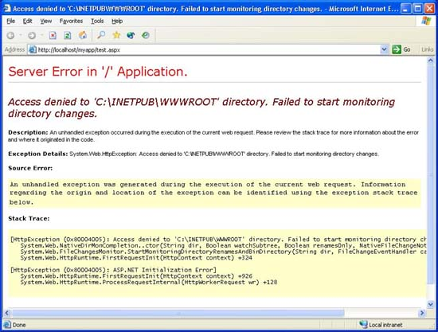
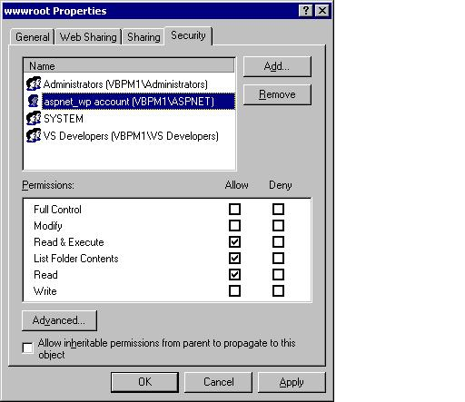

ASP.NET Denied Access to IIS Directories
====================
> This whitepaper describes what you must do if a request to your ASP.NET application returns the error, "Denied Access to *DirectoryName* directory. Failed to start monitoring directory chaanges."
> 
> Applies to ASP.NET 1.0 and ASP.NET 1.1.

ASP.NET V1 RTM now runs using a less privileged windows account - registered as the "ASPNET" account on a local machine.

On some locked down systems, this account may not by default have read security access to a website's content directories, the application root directory, or the web site root directory. In this case you will receive the following error when requesting pages from a given web application:

To fix this you will need to change the security permissions on the appropriate directories.

Specifically, ASP.NET requires read, execute, and list access for the ASPNET account for the web site root (for example: c:\inetpub\wwwroot or any alternative site directory you may have configured in IIS), the content directory and the application root directory in order to monitor for configuration file changes. The application root corresponds to the folder path associated with the application virtual directory in the IIS Administration tool (inetmgr).

For example, consider the following application hierarchy under the wwwroot folder.

`C:\inetpub\wwwroot\myapp\default.aspx`

For this example, the ASPNET account needs the read permissions defined above for content in both the myapp and the wwwroot directory. A single inherited ACL on the root folder can also be optionally used for both directories if they're nested.

To add permissions to a directory, perform the following steps:

- Using the Windows explorer, navigate to the directory
- Right click on the directory folder and choose "Properties"
- Navigate to the "Security" tab on the property dialog
- Click the "Add" button and enter the machine name followed by the ASPNET account name. For example, on a machine named "webdev", you would enter webdev\ASPNET and hit "OK".
- Ensure that the ASPNET account has the "Read &amp; Execute", "List Folder Contents", and "Read" checkboxes checked.
- Hit OK to dismiss the dialog and save the changes.

If desired, these changes can be automated using scripts or the "cacls.exe" tool that ships with Windows. For more information on the ASPNET account, please see the [FAQ document](https://go.microsoft.com/fwlink/?LinkId=5828).

If a given web application relies on having write or modify permissions to a particular folder or file, this can be granted by following the same procedure and checking the "Write" and/or "Modify" checkboxes.

On machines that allow Everyone or the Users group read access to these directories (which is the default configuration), no issues will be encountered and the above steps will not be required.