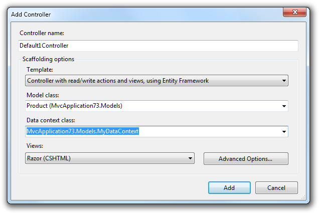
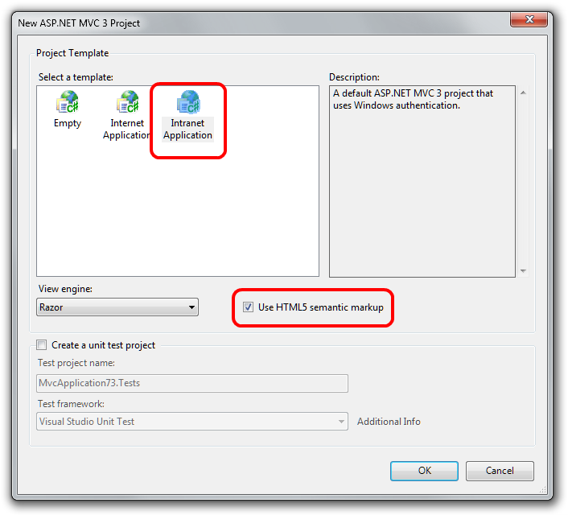
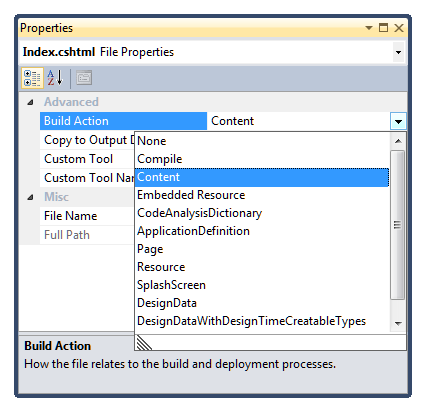
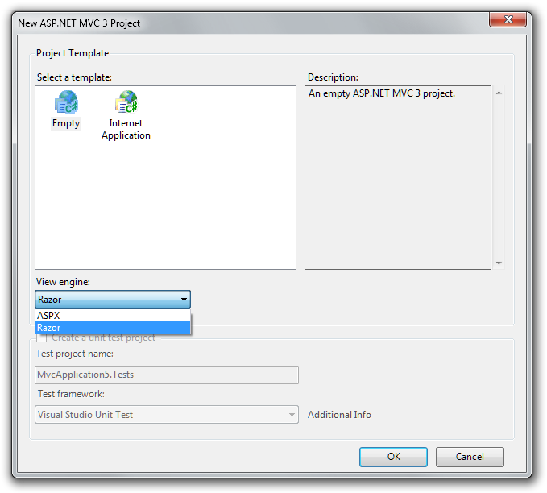

ASP.NET MVC 3
====================
- [Overview](#overview)
- [Installation Notes](#installation-notes)
- [Software Requirements](#software-requirements)
- [Documentation](#documentation)
- [Support](#support)
- [Upgrading an ASP.NET MVC 2 Project to ASP.NET MVC 3 Tools Update](#upgrading)
- [ASP.NET MVC 3 Tools Update (April 12, 2011)](#tu-changes)

    - ["Add Controller" dialog box can now scaffold controllers with views and data access code](#tu-AddControllerDialog)
    - [Improvements to the "ASP.NET MVC 3 New Project" Dialog Box](#tu-ImprovementsNewDialogBox)
    - [Project templates now include Modernizr 1.7](#tu-Modernizr)
    - [Project templates include updated versions of jQuery, jQuery UI, and jQuery Validation](#tu-UpdatedJQuery)
    - [Project templates now include ADO.NET Entity Framework 4.1 as a pre-installed NuGet package](#tu-EF)
    - [Project templates include JavaScript libraries as pre-installed NuGet packages](#tu-JavaScriptLibsNuget)
    - [Known Issues](#tu-KI)
- [ASP.NET MVC 3 RTM (January 13, 2011)](#MVC3RTM)

    - [Change: Updated the version of jQuery UI to 1.8.7](#RTM-1)
    - [Change: Changed the default ModelMetadataProvider back to DataAnnotationsModelMetadataProvider](#RTM-2)
    - [Fixed: Pasting part of a Razor expression that contains whitespace results in it being reversed](#RTM-3)
    - [Fixed: Renaming a Razor file that is opened in the editor disables syntax colorization and IntelliSense](#RTM-4)
    - [Known Issues](#RTM-KI)
    - [Breaking Changes](#RTM-BC)
- [ASP.NET MVC 3 Release Candidate 2 (December 10, 2010)](#_Toc2)

    - [Project Templates Changed to Include jQuery 1.4.4, jQuery Validation 1.7, and jQuery UI 1.8.6y UI 1.8.6](#_Toc2_1)
    - [Added "AdditionalMetadataAttribute" Class](#_Toc2_2)
    - [Improved View Scaffolding](#_Toc2_3)
    - [Added Html.Raw Method](#_Toc2_3)
    - [Renamed "Controller.ViewModel" Property and the "View" Property To "ViewBag"](#_Toc2_4)
    - [Renamed "ControllerSessionStateAttribute" Class to "SessionStateAttribute"](#_Toc2_5)
    - [Renamed RemoteAttribute "Fields" Property to "AdditionalFields"](#_Toc2_6)
    - [Renamed "SkipRequestValidationAttribute" to "AllowHtmlAttribute"](#_Toc2_7)
    - [Changed "Html.ValidationMessage" Method to Display the First Useful Error Message](#_Toc2_8)
    - [Fixed @model Declaration to not Add Whitespace to the Document](#_Toc2_9)
    - [Added "FileExtensions" Property to View Engines to Support Engine-Specific File Names](#_Toc2_10)
    - [Fixed "LabelFor" Helper to Emit the Correct Value for the "For" Attribute](#_Toc2_11)
    - [Fixed "RenderAction" Method to Give Explicit Values Precedence During Model Binding](#_Toc2_12)
    - [Breaking Changes](#_Toc2_BC)
    - [Known Issues](#_Toc2_KI)
- [ASP.NET MVC 3 Release Candidate (Nov 9, 2010)](#TOC_ASP_NET_3_RC)

    - [New Features in ASP.NET MVC 3 RC](#_Toc276711785)
    - [NuGet Package Manager](#_Toc276711786)
    - [Improved "New Project" Dialog Box](#_Toc276711787)
    - [Sessionless Controllers](#_Toc276711788)
    - [New Validation Attributes](#_Toc276711789)
    - [New Overloads for "LabelFor" and "LabelForModel" Methods](#_Toc276711790)
    - [Child Action Output Caching](#_Toc276711791)
    - ["Add View" Dialog Box Improvements](#_Toc276711792)
    - [Granular Request Validation](#_Toc276711793)
    - [Breaking Changes](#_Toc276711794)
    - [Known Issues](#_Toc276711795)
- [ASP.MVC 3 Beta Notes (Oct 6, 2010)](#TOC_ASP_NET_3_Beta)

    - [New Features in ASP.NET MVC 3 Beta](#0.1__Toc274034215)
    - [NuPack Package Manager](#0.1__Toc274034216)
    - [Improved New Project Dialog Box](#0.1__Toc274034217)
    - [Simplified Way to Specify Strongly Typed Models in Razor Views](#0.1__Toc274034218)
    - [Support for New ASP.NET Web Pages Helper Methods](#0.1__Toc274034219)
    - [Additional Dependency Injection Support](#0.1__Toc274034220)
    - [New Support for Unobtrusive jQuery-Based Ajax](#0.1__Toc274034221)
    - [New Support for Unobtrusive jQuery Validation](#0.1__Toc274034222)
    - [New Application-Wide Flags for Client Validation and Unobtrusive JavaScript](#0.1__Toc274034223)
    - [New Support for Code that Runs Before Views Run](#0.1__Toc274034224)
    - [New Support for the VBHTML Razor Syntax](#0.1__Toc274034225)
    - [More Granular Control over ValidateInputAttribute](#0.1__Toc274034226)
    - [Helpers Convert Underscores to Hyphens for HTML Attribute Names Specified Using Anonymous Objects](#0.1__Toc274034227)
    - [Bug Fixes](#0.1__Toc274034228)
    - [Breaking Changes](#0.1__Toc274034229)
    - [Known Issues](#0.1__Toc274034230)
- [Disclaimer](#0.1__Toc274034231)

## Overview

This document describes the release of ASP.NET MVC 3 RTM for Visual Studio 2010. ASP.NET MVC is a framework for developing Web applications that uses the Model-View-Controller (MVC) pattern. The ASP.NET MVC 3 installer includes the following components:

- ASP.NET MVC 3 runtime components
- ASP.NET MVC 3 Visual Studio 2010 tools
- ASP.NET Web Pages run-time components
- ASP.NET Web Pages Visual Studio 2010 tools
- Microsoft Package Manager for .NET (NuGet)
- An update for Visual Studio 2010 that enables support for Razor syntax. (For details, see KnowledgeBase article 2483190.)

The full set of release notes for each pre-release version of ASP.NET MVC 3 can be found on the ASP.NET website at the following URL:

https://www.asp.net/learn/whitepapers/mvc3-release-notes

## Installation Notes

To install ASP.NET MVC 3 RTM using the Web Platform Installer (Web PI), visit the following page:

[https://www.microsoft.com/web/gallery/install.aspx?appid=MVC3](https://www.microsoft.com/web/gallery/install.aspx?appid=MVC3)

Alternatively, you can download the installer for ASP.NET MVC 3 RTM for Visual Studio 2010 from the following page:

https://go.microsoft.com/fwlink/?LinkID=208140

ASP.NET MVC 3 can be installed and can run side-by-side with ASP.NET MVC 2.

## Software Requirements

The ASP.NET MVC 3 run-time components require the following software:

- .NET Framework version 4. 

    ASP.NET MVC 3 Visual Studio 2010 tools require the following software:
- Visual Studio 2010 or Visual Web Developer 2010 Express.

## Documentation

Documentation for ASP.NET MVC is available on the MSDN Web site at the following URL:

[https://go.microsoft.com/fwlink/?LinkId=205717](https://go.microsoft.com/fwlink/?LinkId=205717)

Tutorials and other information about ASP.NET MVC are available on the MVC page of the ASP.NET Web site at the following URL:

[https://www.asp.net/mvc/](../mvc/index.md)

## Support

This is a fully supported release. Information about getting technical support can be found at the [Microsoft Support website](https://support.microsoft.com/).

Also feel free to post questions about this release to the ASP.NET MVC forum, where members of the ASP.NET community are frequently able to provide informal support:

[https://forums.asp.net/1146.aspx](https://forums.asp.net/1146.aspx)

## Upgrading an ASP.NET MVC 2 Project to ASP.NET MVC 3 Tools Update

ASP.NET MVC 3 can be installed side by side with ASP.NET MVC 2 on the same computer, which gives you flexibility in choosing when to upgrade an ASP.NET MVC 2 application to ASP.NET MVC 3.

To manually upgrade an existing ASP.NET MVC 2 application to version 3, do the following:

1. Create a new empty ASP.NET MVC 3 project on your computer. This project will contain some files that are required for the upgrade.
2. Copy the following files from the ASP.NET MVC 3 project into the corresponding location of your ASP.NET MVC 2 project. You'll need to update any references to the jQuery library to account for the new filename ( jQuery-1.5.1.js): 

    - /Views/Web.config
    - /packages.config
    - /scripts/\*.js
    - /Content/themes/\*.\*
3. Copy the *packages* folder in the root of the empty ASP.NET MVC 3 project solution into the root of your solution, which is in the directory where the solution's .sln file is located.
4. If your ASP.NET MVC 2 project contains any areas, copy the /Views/Web.config file to the *Views* folder of each area.
5. In both Web.config files in the ASP.NET MVC 2 project, globally search and replace the ASP.NET MVC version. Find the following: 

    [!code-console[Main](mvc3-release-notes/samples/sample1.cmd)]

    Replace it with the following:

    [!code-console[Main](mvc3-release-notes/samples/sample2.cmd)]
6. In Solution Explorer, delete the reference to *System.Web.Mvc* (which points to the DLL from version 2), then add a reference to *System.Web.Mvc* (v3.0.0.0).
7. Add a reference to System.Web.WebPages.dll and System.Web.Helpers.dll. These assemblies are located in the following folders: 

    - %ProgramFiles%\ Microsoft ASP.NET\ASP.NET MVC 3\Assemblies
    - %ProgramFiles%\ Microsoft ASP.NET\ASP.NET Web Pages\v1.0\Assemblies
8. In Solution Explorer, right-click the project name and select Unload Project. Then right-click the project name again and select Edit *ProjectName*.csproj.
9. Locate the *ProjectTypeGuids* element and replace {F85E285D-A4E0-4152-9332-AB1D724D3325} with {E53F8FEA-EAE0-44A6-8774-FFD645390401}.
10. Save the changes, right-click the project, and then select Reload Project.
11. In the application's root Web.config file, add the following settings to the *assemblies* section. 

    [!code-xml[Main](mvc3-release-notes/samples/sample3.xml)]
12. If the project references any third-party libraries that are compiled using ASP.NET MVC 2, add the following highlighted *bindingRedirect* element to the Web.config file in the application root under the *configuration* section: 

    [!code-xml[Main](mvc3-release-notes/samples/sample4.xml)]

## Changes in ASP.NET MVC 3 Tools Update

This section describes changes made in the ASP.NET MVC 3 Tools Update release since the ASP.NET MVC 3 RTM release.

### "Add Controller" dialog box can now scaffold controllers with views and data access code

Scaffolding is a way of quickly generating a controller and views for your application. After the code has been generated, you can edit it to meet your project's requirements.

To launch the *Add Controller* dialog box in ASP.NET MVC 3, right-click the *Controllers* folder in *Solution Explorer*, click *Add*, and then click *Controller*. The dialog box has been enhanced to offer additional scaffolding options.

There are three scaffolding templates available by default.

#### Empty Controller

This template generates an empty controller file. This template is equivalent to not checking *Add actions for create, edit, details, delete scenarios* in previous versions of ASP.NET MVC. If you choose this, no further options are available.

#### Controller with empty read/write actions

This template generates a controller file that has all the required action methods but no implementation code in the methods. This template is equivalent to checking *Add actions for create, edit, details, delete scenarios* in previous versions of ASP.NET MVC. If you choose this, no further options are available.

#### Controller with read/write actions and views, using Entity Framework

This template enables you to quickly create a working data-entry user interface. It generates code that handles a range of common requirements and scenarios, such as the following:

- *Data access*. The generated code reads and writes entities in a database. It works with the Entity Framework Code First approach if you choose an existing data context class or if you let the template generate a new *DbContext* class. It also works with the Entity Framework Database First or Model First approach if you choose an existing *ObjectContext* class.
- *Validation*. The generated code uses ASP.NET MVC model binding and metadata features so that form submissions are validated according to rules declared on your model class. This includes built-in validation rules, such as the *Required* and *StringLength* attributes, and custom validation rules.
- *One-to-many relationships*. If you define one-to-many foreign-key relationships between your model classes, the generated code will produce drop-down lists for selecting related entities. For example, you might define the following model classes following Entity Framework Code First conventions: 

    [!code-csharp[Main](mvc3-release-notes/samples/sample5.cs)]

    When you then scaffold a controller for the *Product* class, its views will allow users to choose a *Category* object for each *Product* instance.

    This template enables additional options in the *Add Controller* dialog box. For *Model class*, you can choose any model class in your solution, which determines the type of data that users will be able to create or edit:
- If you want to use Entity Framework Code First, you can choose any model class.
- If you are using Entity Framework Database First or Entity Framework Model First, be sure to choose an entity class defined in your conceptual model.

For *Data Context class*, you can make these choices:

- If you want to use Code First and have no existing data context class, choose *&lt;New data context…&gt;*". A data context class will then be generated for you.
- If you want to use Code First and have an existing data context class, choose it here. It will be updated to persist the model class you have selected.
- If you are using Database First or Model First, choose your object context class here.

For Views, choose the view engine you want to use, or choose None if you don't want to scaffold any views.

You can select Advanced Optionsto specify further options for the generated views. For example, you can choose the layout or master page to use.

### Improvements to the "ASP.NET MVC 3 New Project" Dialog Box

The dialog box you use to create new ASP.NET MVC 3 projects includes multiple improvements, as listed below.

#### New "Intranet Project" Template

The Project Template list includes a new Intranet Application template. This template contains settings for building a web application using Windows authentication instead of forms authentication. Because an intranet application requires some IIS settings that can't be encapsulated in a project template, the template includes a readme file with instructions for how to make the project template work in IIS. Documentation for the a new Intranet Application template is available on the MSDN website at the following URL:

[https://msdn.microsoft.com/en-us/library/gg703322(VS.98).aspx](https://msdn.microsoft.com/en-us/library/gg703322(VS.98).aspx)

#### Project templates are now HTML5 enabled

The new-project dialog box now contains an option to add HTML5-specific features to the project templates. Selecting the option causes views to be generated that contain the new HTML5 *&lt;header&gt;*, *&lt;footer&gt;*, and *&lt;navigation&gt;* elements.

Note that earlier versions of browsers do not support HTML5-specific tags. To address this limitation, the HTML5 project templates include a reference to the Modernizr library. (See the next section.)

### Project templates now include Modernizr 1.7

Modernizr is a JavaScript library that enables support for CSS 3 and HTML5 in browsers that do not yet support these features. This library is included as a pre-installed NuGet package in templates for ASP.NET MVC 3 projects. For more information about Modernizr, see [http://www.modernizr.com/](http://www.modernizr.com/).

### Project templates include updated versions of jQuery, jQuery UI, and jQuery Validation

The project templates now include the following versions of the jQuery scripts:

- jQuery 1.5.1
- jQuery Validation 1.8
- jQuery UI 1.8.11

These libraries are included as pre-installed NuGet packages.

### Project templates now include ADO.NET Entity Framework 4.1 as a pre-installed NuGet package

The ADO.NET Entity Framework 4.1 includes the Code First feature. Code First is a new development pattern for the ADO.NET Entity Framework that provides an alternative to the existing Database First and Model First patterns.

Code First is focused around defining your model using POCO classes ("plain old CLR objects") written in Visual Basic or C#. These classes can then be mapped to an existing database or be used to generate a database schema. Additional configuration can be supplied using *DataAnnotations* attributes or using fluent APIs.

Documentation for using Code Firstwith ASP.NET MVC is available on the ASP.NET website at the following URLs:

[https://www.asp.net/mvc/tutorials/getting-started-with-mvc3-part1-cs](../mvc/overview/older-versions/getting-started-with-aspnet-mvc3/cs/intro-to-aspnet-mvc-3.md) [https://www.asp.net/entity-framework/tutorials/creating-an-entity-framework-data-model-for-an-asp-net-mvc-application](../mvc/overview/getting-started/getting-started-with-ef-using-mvc/creating-an-entity-framework-data-model-for-an-asp-net-mvc-application.md)

### Project templates include JavaScript libraries as pre-installed NuGet packages

When you create a new ASP.NET MVC 3 project, the project includes the JavaScript files mentioned previously (for example, the Modernizr library) by installing them using NuGet instead of directly adding the scripts to the Scripts folder in the project template contents. This enables you to use NuGet to update the scripts to the latest version when new versions of the scripts are released.

For example, given the frequency of new jQuery releases, the version of jQuery included in the project template will at some point be out of date. However, because jQuery is included as an installed NuGet package, you will be notified in the NuGet dialog box when newer versions of jQuery are available.

Because jQuery includes the version number in the file name, updating jQuery to the latest version also requires updating the *&lt;script&gt;* tag that references the jQuery file to use the new file name. Other included script libraries do not include the version number in the script name, so they can be more easily updated to their latest versions.

## Known Issues

- In some cases, installation may fail with the error message "Installation failed with error code (0x80070643)". For information about how to work around this issue, see [KnowledgeBase article 2531566](https://support.microsoft.com/kb/2531566).
- The scaffolding for adding a controller does not scaffold entities that take advantage of entity inheritance support within Entity Framework. For example, given a base *Person* class that's inherited by a *Student* class, scaffolding the *Student* class will result in generated code that does not compile.
- Creating a new ASP.NET MVC 3 project within a solution folder causes a *NullReferenceException* error. The workaround is to create the ASP.NET MVC 3 project in the root of the solution and then move it into the solution folder.
- IntelliSense for Razor syntax does not work when ReSharper is installed. If you have ReSharper installed and want to take advantage of the Razor IntelliSense support in ASP.NET MVC 3, see the entry [Razor Intellisense and ReSharper](http://blogs.jetbrains.com/dotnet/2010/11/razor-intellisense-and-resharper/) on Hadi Hariri's blog, which discusses ways to use them together today.
- During installation, the EULA acceptance dialog box displays the license terms in a window that is smaller than intended.
- When you are editing a Razor view (.cshtml or .*vbhtml* file), views. ASP.NET MVC 3 does not include any snippets for Razor views..aspxselecting a code snippet for ASP.NET MVC will show snippets for
- If you install ASP.NET MVC 3 for Visual Web Developer Express on a computer where Visual Studio is not installed, and then later install Visual Studio, you must reinstall ASP.NET MVC 3. Visual Studio and Visual Web Developer Express share components that are upgraded by the ASP.NET MVC 3 installer. The same issue applies if you install ASP.NET MVC 3 for Visual Studio on a computer that does not have Visual Web Developer Express and then later install Visual Web Developer Express.

## Changes in ASP.NET MVC 3 RTM

This section describes changes and bug fixes made in the ASP.NET MVC 3 RTM release since the RC2 release.

### Change: Updated the version of jQuery UI to 1.8.7

The ASP.NET MVC project templates for Visual Studio were updated to include the latest version of the jQuery UI library. The templates also include the minimal set of resource files required by jQuery UI, such as the associated CSS and image files.

### Change: Changed the default ModelMetadataProvider back to DataAnnotationsModelMetadataProvider

The RC2 release of ASP.NET MVC 3 introduced a *CachedDataAnnotationsMetadataProvider* class that provided caching on top of the existing *DataAnnotationsModelMetadataProvider* class as a performance improvement. However, some bugs were reported with this implementation, so the change has been reverted and moved into the MVC Futures project, which is available on the CodePlex website at [http://aspnet.codeplex.com/](http://aspnet.codeplex.com/).

### Fixed: Pasting part of a Razor expression that contains whitespace results in it being reversed

In pre-release versions of ASP.NET MVC 3, when you paste a part of a Razor expression that contains whitespace into a Razor file, the resulting expression is reversed. For example, consider the following Razor code block:

[!code-cshtml[Main](mvc3-release-notes/samples/sample6.cshtml)]

If you select the text "first param" in the first method and paste it as an argument into the second method, the result is as follows:

[!code-cshtml[Main](mvc3-release-notes/samples/sample7.cshtml)]

The correct behavior is that the paste operation should result in the following:

[!code-cshtml[Main](mvc3-release-notes/samples/sample8.cshtml)]

This issue has been fixed in the RTM release so that the expression is correctly preserved during the paste operation.

### Fixed: Renaming a Razor file that is opened in the editor disables syntax colorization and IntelliSense

Renaming a Razor file using Solution Explorer while the file is opened in the editor window causes syntax highlighting and IntelliSense to stop working for that file. This has been fixed so that highlighting and IntelliSense are maintained after a rename.

## Known Issues

- If you close Visual Studio 2010 SP1 Beta while the NuGet Package Manager Console is open, Visual Studio crashes and attempts to restart. This will be fixed in the RTM release of Visual Studio 2010 SP1.
- The ASP.NET MVC 3 installer is only able to install an initial version of the NuGet package manager. After you have installed the initial version, NuGet can be installed and updated using Visual Studio Extension Manager. If you already have NuGet installed, go to the Visual Studio Extension Gallery to update to the latest version of NuGet.
- Creating a new ASP.NET MVC 3 project within a solution folder causes a *NullReferenceException* error. The workaround is to create the ASP.NET MVC 3 project in the root of the solution and then move it into the solution folder.
- The installer might take much longer than previous versions of ASP.NET MVC to complete. This is because it updates components of Visual Studio 2010.
- IntelliSense for Razor syntax does not work when ReSharper is installed. If you have ReSharper installed and want to take advantage of the Razor IntelliSense support in ASP.NET MVC 3, see the entry [Razor Intellisense and ReSharper](http://blogs.jetbrains.com/dotnet/2010/11/razor-intellisense-and-resharper/) on Hadi Hariri's blog, which discusses ways to use them together today.
- CCSHTML and VBHTML views created with the Beta version of ASP.NET MVC 3 do not have their build action set correctly, with the result that these view types are omitted when the project is published. The Build Action value for these files should be set to "Content". ASP.NET MVC 3 RTM fixes this issue for new files, but doesn't correct the setting for existing files for a project created with prerelease versions.
- 
- During installation, the EULA acceptance dialog box displays the license terms in a window that is smaller than intended./li&gt;
- When you are editing a Razor view (.cshtml file), the Go To Controller menu item in Visual Studio will not be available, and there are no code snippets.
- If you install ASP.NET MVC 3 for Visual Web Developer Express on a computer where Visual Studio is not installed, and then later install Visual Studio, you must reinstall ASP.NET MVC 3. Visual Studio and Visual Web Developer Express share components that are upgraded by the ASP.NET MVC 3 installer. The same issue applies if you install ASP.NET MVC 3 for Visual Studio on a computer that does not have Visual Web Developer Express and then later install Visual Web Developer Express.

## Breaking Changes

- In previous versions of ASP.NET MVC, action filters are create per request except in a few cases. This behavior was never a guaranteed behavior but merely an implementation detail and the contract for filters was to consider them stateless. In ASP.NET MVC 3, filters are cached more aggressively. Therefore, any custom action filters which improperly store instance state might be broken.
- The order of execution for exception filters has changed for exception filters that have the same *Order* value. In ASP.NET MVC 2 and earlier, exception filters on the controller that have the same *Order* value as those on an action method are executed before the exception filters on the action method. This would typically be the case when exception filters are applied without a specified *Order* value. In ASP.NET MVC 3, this order has been reversed so that the most specific exception handler executes first. As in earlier versions, if the *Order* property is explicitly specified, the filters are run in the specified order.
- A new property named *FileExtensions* was added to the *VirtualPathProviderViewEngine* base class. When ASP.NET looks up a view by path (not by name), only views with a file extension contained in the list specified by this new property are considered. This is a breaking change in applications where a custom build provider is registered in order to enable a custom file extension for Web Form views and where the provider references those views by using a full path rather than a name. The workaround is to modify the value of the *FileExtensions* property to include the custom file extension.
- Custom controller factory implementations that directly implement the *IControllerFactory* interface must provide an implementation of the new *GetControllerSessionBehavior* method that was added to the interface in this release. In general, it is recommended that you do not implement this interface directly and instead derive your class from *DefaultControllerFactory*.

## Changes in ASP.NET MVC 3 RC2

This section describes changes (new features and bug fixes) made in the ASP.NET MVC 3 RC2 release since the RC release.

### Project Templates Changed to Include jQuery 1.4.4, jQuery Validation 1.7, and jQuery UI 1.8.6

The project templates for ASP.NET MVC 3 now include the latest versions of jQuery, jQuery Validation, and jQuery UI. jQuery UI is a new addition to the project templates and provides useful user interface widgets. For more information about jQuery UI, visit their homepage: [http://jqueryui.com/](http://jqueryui.com/).

### Added "AdditionalMetadataAttribute" Class

You can use the *AdditionalMetadataAttribute* class to populate the *ModelMetadata.AdditionalValues* dictionary for a model property.

For example, suppose a view model has properties that should be displayed only to an administrator. That model can be annotated with the new attribute using AdminOnly as the key and true as the value, as in the following example:

[!code-csharp[Main](mvc3-release-notes/samples/sample9.cs)]

This metadata is made available to any display or editor template when a product view model is rendered. It is up to you as application developer to interpret the metadata information.

### Improved View Scaffolding

The T4 templates used for scaffolding views now generate calls to template helper methods such as *EditorFor* instead of helpers such as *TextBoxFor*. This change improves support for metadata on the model in the form of data annotation attributes when the Add View dialog box generates a view.

The Add View scaffolding also includes improved detection and usage of primary key information on the model, based on convention. For example, the Add View dialog box uses this information to ensure that the primary key value is not scaffolded as an editable form field.

The default Edit and Create templates include references to the jQuery scripts needed for client validation.

### Added Html.Raw Method

By default, the Razor view engine HTML-encodes all values. For example, the following code snippet encodes the HTML inside the greeting variable so that it is displayed in the page as &amp;lt;strong&amp;gt;Hello World!&amp;lt;/strong&amp;gt;.

[!code-cshtml[Main](mvc3-release-notes/samples/sample10.cshtml)]

The new *Html.Raw* method provides a simple way of displaying unencoded HTML when the content is known to be safe. The following example displays the same string, but the string is rendered as markup:

[!code-cshtml[Main](mvc3-release-notes/samples/sample11.cshtml)]

### Renamed "Controller.ViewModel" Property and the "View" Property To "ViewBag"

Previously, the *ViewModel* property of *Controller* corresponded to the *View* property of a view. Both of these properties provide a way to access values of the *ViewDataDictionary* object using dynamic property-accessor syntax. Both properties have been renamed to be the same in order to avoid confusion and to be more consistent.

### Renamed "ControllerSessionStateAttribute" Class to "SessionStateAttribute"

The *ControllerSessionStateAttribute* class was introduced in the RC release of ASP.NET MVC 3. The property was renamed to be more succinct.

### Renamed RemoteAttribute "Fields" Property to "AdditionalFields"

The *RemoteAttribute* class's *Fields* property caused some confusion among users. Renaming this property to *AdditionalFields* clarifies its intent.

### Renamed "SkipRequestValidationAttribute" to "AllowHtmlAttribute"

The *SkipRequestValidationAttribute* attribute was renamed to *AllowHtmlAttribute* to better represent its intended usage.

### Changed "Html.ValidationMessage" Method to Display the First Useful Error Message

The *Html.ValidationMessage* method was fixed to show the first useful error message instead of simply displaying the first error.

During model binding, the *ModelState* dictionary can be populated from multiple sources with error messages about the property, including from the model itself (if it implements *IValidatableObject*), from validation attributes applied to the property, and from exceptions thrown while the property is being accessed.

When the *Html.ValidationMessage* method displays a validation message, it skips model-state entries that include an exception, because these are generally not intended for the end user. Instead, the method looks for the first validation message that is not associated with an exception and displays that message. If no such message is found, it defaults to a generic error message that is associated with the first exception.

### Fixed @model Declaration to not Add Whitespace to the Document

In earlier releases, the *@model* declaration at the top of a view added a blank line to the rendered HTML output. This has been fixed so that the declaration does not introduce whitespace.

### Added "FileExtensions" Property to View Engines to Support Engine-Specific File Names

A view engine can return a view using an explicit view path as in the following example:

[!code-csharp[Main](mvc3-release-notes/samples/sample12.cs)]

The first view engine always attempts to render the view. By default, the Web Forms view engine is the first view engine; because the Web Forms engine cannot render a Razor view, an error occurs. View engines now have a *FileExtensions* property that is used to specify which file extensions they support. This property is checked when ASP.NET determines whether a view engine can render a file. This is a breaking change and more details are included in the [Breaking Changes](#_Toc2_BC) section of this document.

### Fixed "LabelFor" Helper to Emit the Correct Value for the "For" Attribute

A bug was fixed where the *LabelFor* method rendered a *for* attribute that matches the *input* element's *name* attribute instead of its ID. According to the W3C, the *for* attribute should match the *input* element's ID.

### Fixed "RenderAction" Method to Give Explicit Values Precedence During Model Binding

In earlier versions, explicit values that were passed to the *RenderAction* method were being ignored in favor of the current form values during model binding inside a child action. The fix ensures that explicit values take precedence during model binding.

## Breaking Changes

- In previous versions of ASP.NET MVC, action filters were created per request except in a few cases. This behavior was never a guaranteed behavior but merely an implementation detail and the contract for filters was to consider them stateless. In ASP.NET MVC 3, filters are cached more aggressively. Therefore, any custom action filters which improperly store instance state might be broken.
- The order of execution for exception filters has changed for exception filters that have the same *Order* value. In ASP.NET MVC 2 and earlier, exception filters on the controller that had the same *Order* value as those on an action method were executed before the exception filters on the action method. This would typically be the case when exception filters were applied without a specified *Order* value. In ASP.NET MVC 3, this order has been reversed so that the most specific exception handler executes first. As in earlier versions, if the *Order* property is explicitly specified, the filters are run in the specified order.
- A new property named *FileExtensions* was added to the *VirtualPathProviderViewEngine* base class. When ASP.NET looks up a view by path (not by name), only views with a file extension contained in the list specified by this new property are considered. This is a breaking change in applications where a custom build provider is registered in order to enable a custom file extension for Web Form views and where the provider references those views by using a full path rather than a name. The workaround is to modify the value of the *FileExtensions* property to include the custom file extension.
- Custom controller factory implementations that directly implement the *IControllerFactory* interface must provide an implementation of the new *GetControllerSessionBehavior**method that was added to the interface in this release*. In general, it is recommended that you do not implement this interface directly and instead derive your class from *DefaultControllerFactory*.

## Known Issues

- The ASP.NET MVC 3 installer is only able to install an initial version of the NuGet package manager. After you have installed the initial version, NuGet can be installed and updated using Visual Studio Extension Manager. If you already have NuGet installed, go to the Visual Studio Extension Gallery to update to the latest version of NuGet.
- Creating a new ASP.NET MVC 3 project within a solution folder causes a *NullReferenceException* error. The workaround is to create the ASP.NET MVC 3 project in the root of the solution and then move it into the solution folder.
- The installer might take much longer than previous versions of ASP.NET MVC to complete. This is because it updates components of Visual Studio 2010.
- IntelliSense for Razor syntax does not work when ReSharper is installed. If you have ReSharper installed and want to take advantage of the Razor IntelliSense support in ASP.NET MVC 3 RC2, see the entry [Razor Intellisense and ReSharper](http://blogs.jetbrains.com/dotnet/2010/11/razor-intellisense-and-resharper/) on Hadi Hariri's blog, which discusses ways to use them together today.
- CSHTML and VBHTML views created with the Beta version of ASP.NET MVC 3 do not have their build action set correctly, with the result that these view types are omitted when the project is published. The *Build Action* value for these files should be set to Content". ASP.NET MVC 3 RC2 fixes this issue for new files, but doesn't correct the setting for existing files for a project created with the Beta version.
- During installation, the EULA acceptance dialog box displays the license terms in a window that is smaller than intended.
- When you are editing a Razor view (.cshtml file), the Go To Controller menu item in Visual Studio will not be available, and there are no code snippets.
- If you install ASP.NET MVC 3 for Visual Web Developer Express on a computer where Visual Studio is not installed, and then later install Visual Studio, you must reinstall ASP.NET MVC 3. Visual Studio and Visual Web Developer Express share components that are upgraded by the ASP.NET MVC 3 installer. The same issue applies if you install ASP.NET MVC 3 for Visual Studio on a computer that does not have Visual Web Developer Express and then later install Visual Web Developer Express.
- Installing ASP.NET MVC 3 RC 2 does not update NuGet if you already have it installed. To upgrade NuGet, go to the Visual Studio Extension manager and it should show up as an available update. You can upgrade NuGet to the latest release from there.

## ASP.NET MVC 3 Release Candidate

ASP.NET MVC Release Candidate was released on November 9, 2010.

## New Features in ASP.NET MVC 3 RC

This section describes features that have been introduced in the ASP.NET MVC 3 RC release since the Beta release.

### NuGet Package Manager

ASP.NET MVC 3 includes the NuGet Package Manager (formerly known as NuPack), which is an integrated package management tool for adding libraries and tools to Visual Studio projects. This tool automates the steps that developers take today to get a library into their source tree.

You can work with NuGet as a command-line tool, as an integrated console window inside Visual Studio 2010, from the Visual Studio context menu, and as a set of PowerShell cmdlets.

For more information about NuGet, visit [http://NuGet.codeplex.com/](http://nupack.codeplex.com/) and read the [Getting Started Guide](http://nupack.codeplex.com/documentation?title=Getting%20Started).

### Improved "New Project" Dialog Box

When you create a new project, the New Project dialog box now lets you specify the view engine as well as an ASP.NET MVC project type.

Support for modifying the list of templates and view engines listed in the dialog box is included in this release.

The default templates are the following:

Empty. Contains a minimal set of files for an ASP.NET MVC project, including the default directory structure for ASP.NET MVC projects, a Site.css file that contains the default ASP.NET MVC styles, and a Scripts directory that contains the default JavaScript files.

Internet Application. Contains sample functionality that demonstrates how to use the membership provider with ASP.NET MVC.

The list of project templates that is displayed in the dialog box is specified in the Windows registry.

### Sessionless Controllers

The new *ControllerSessionStateAttribute* gives you more control over session-state behavior for controllers by specifying a [System.Web.SessionState.SessionStateBehavior](https://msdn.microsoft.com/en-us/library/system.web.sessionstate.sessionstatebehavior.aspx) enumeration value.

The following example shows how to turn off session state for all requests to a controller.

[!code-csharp[Main](mvc3-release-notes/samples/sample13.cs)]

The following example shows how to set read-only session state for all requests to a controller.

[!code-csharp[Main](mvc3-release-notes/samples/sample14.cs)]

### New Validation Attributes

#### CompareAttribute

The new *CompareAttribute* validation attribute lets you compare the values of two different properties of a model. In the following example, the *ComparePassword* property must match the *Password* field in order to be valid.

[!code-csharp[Main](mvc3-release-notes/samples/sample15.cs)]

#### RemoteAttribute

The new *RemoteAttribute* validation attribute takes advantage of the jQuery Validation plug-in's remote validator, which enables client-side validation to call a method on the server that performs the actual validation logic.

In the following example, the *UserName* property has the *RemoteAttribute* applied. When editing this property in an Edit view, client validation will call an action named *UserNameAvailable* on the *UsersController* class in order to validate this field.

[!code-csharp[Main](mvc3-release-notes/samples/sample16.cs)]

The following example shows the corresponding controller.

[!code-csharp[Main](mvc3-release-notes/samples/sample17.cs)]

By default, the property name that the attribute is applied to is sent to the action method as a query-string parameter.

### New Overloads for "LabelFor" and "LabelForModel" Methods

New overloads have been added for the *LabelFor* and *LabelForModel* methods that let you specify the label text. The following example shows how to use these overloads.

[!code-cshtml[Main](mvc3-release-notes/samples/sample18.cshtml)]

### Child Action Output Caching

The *OutputCacheAttribute* supports output caching of child actions that are called by using the *Html.RenderAction* or *Html.Action* helper methods. The following example shows a view that calls another action.

[!code-cshtml[Main](mvc3-release-notes/samples/sample19.cshtml)]

The *GetDate* action is annotated with the *OutputCacheAttribute*:

[!code-csharp[Main](mvc3-release-notes/samples/sample20.cs)]

When this code runs, the result of the call to Html.Action("GetDate") is cached for 100 seconds.

### "Add View" Dialog Box Improvements

When you add a strongly typed view, the Add View dialog box now filters out more non-applicable types than in previous releases, such as many core .NET Framework types. Also, the list is now sorted by the class name and not by the fully qualified type name, which makes it easier to find types. For example, the type name is now displayed as in the following example:

ClassName (namespace)

In earlier releases, this would have been displayed as the following:

Namespace.ClassName

### Granular Request Validation

The *Exclude* property of *ValidateInputAttribute* no longer exists. Instead, to have request validation skipped for specific properties of a model during model binding, use the new *SkipRequestValidationAttribute*.

For example, suppose an action method is used to edit a blog post:

[!code-csharp[Main](mvc3-release-notes/samples/sample21.cs)]

The following example shows the view model for a blog post.

[!code-csharp[Main](mvc3-release-notes/samples/sample22.cs)]

When a user submits some markup for the Description property, model binding will fail due to request validation. To disable request validation during model binding for the blog post Description, apply the *SkipRequpestValidationAttribute* to the property, as shown in this example:.

[!code-csharp[Main](mvc3-release-notes/samples/sample23.cs)]

Alternatively, to turn off request validation for every property of the model, apply *ValidateInputAttribute* with a value of *false* to the action method:

[!code-csharp[Main](mvc3-release-notes/samples/sample24.cs)]

## Breaking Changes

- The order of execution for exception filters has changed for exception filters that have the same *Order* value. In ASP.NET MVC 2 and earlier, exception filters on the controller that had the same *Order* as those on an action method were executed before the exception filters on the action method. This would typically be the case when exception filters were applied without a specified *Order* value. In ASP.NET MVC 3, this order has been reversed so that the most specific exception handler executes first. As in earlier versions, if the *Order* property is explicitly specified, the filters are run in the specified order.
- Added a new property named *FileExtensions* to the *VirtualPathProviderViewEngine* base class. When looking up a view by path (and not by name), only views with a file extension contained in the list specified by this new property is considered. This is a breaking change for those who register a custom build provider to enable a custom file extension for web form views and and are referencing those views by using a full path rather than a name. The workaround is to modify the value of the *FileExtensions* property to include the custom file extension.

## Known Issues

- The installer may take much longer than previous versions of ASP.NET MVC to complete because it updates components of Visual Studio 2010.
- The Add View scaffolding when selecting astrongly typed view scaffolds write-only properties. These should always be ignored by scaffolding. The Add View dialog also scaffolds read-only properties when generating an "Edit" or "Create" view. Read-only properties should only be scaffolded for the Display and List views.
- Debugging doesn't work when ASP.NET MVC 3 is installed alongside the Async CTP. ASP.NET MVC 3 cannot be installed side-by-side with the Async CTP. Uninstall the Async CTP to repair debugging. For more details, read [this blog post](http://drew-prog.blogspot.com/2010/11/how-to-uninstall-microsoft-aspnet-mvc-3.html) about uninstalling all the pieces of ASP.NET MVC 3 RC.
- Razor Intellisense does not work when Resharper is installed. If you have ReSharper installed and want to take advantage of the Razor intellisense support in ASP.NET MVC 3 RC, please read [this blog post](http://blogs.jetbrains.com/dotnet/2010/11/razor-intellisense-and-resharper/) from JetBrains which discusses ways to use them together today.
- CSHTML and VBHTML views created with Beta of ASP.NET MVC 3 do not have their build action correctly which omits them from publishing. The *Build Action* for these files should be set to "Content". ASP.NET MVC 3 RC fixes this issue for new files, but doesn't correct the setting for existing files for a project created with the Beta.
- The installer may take much longer than previous versions of ASP.NET MVC to complete because it updates components of Visual Studio 2010.
- The Add View scaffolding when selecting an "Edit" strongly typed view scaffolds read only properties. Likewise, write-only properties are scaffolded for "Display" views.
- During installation, the EULA acceptance dialog box displays the license terms in a window that is smaller than intended.
- Installing the [Visual Studio Async CTP](https://www.microsoft.com/downloads/en/details.aspx?FamilyID=18712f38-fcd2-4e9f-9028-8373dc5732b2&amp;displaylang=en) causes a conflict with the Razor release that is included as part of the ASP.NET MVC 3 tooling installation. Make sure that you do not try to install both the Visual Studio Async CTP and the Razor release on the same machine.
- When you are editing a Razor view (.cshtml file), the Go To Controller menu item in Visual Studio will not be available, and there are no code snippets.

## ASP.NET MVC 3 Beta

ASP.NET MVC 3 Beta was released on October 6, 2010. The following notes are specific to the Beta release, and are subject to any updates or changes referenced in the ASP.NET MVC 3 Release Candidate section above.

##   New Featuresin ASP.NET MVC 3 Beta

This section describes features that have been introduced in the ASP.NET MVC 3 Beta release.

###   NuPack Package Manager

ASP.NET MVC 3 includes NuPack Package Manager, which is an integrated package management tool for adding libraries and tools to Visual Studio projects. For the most part, it automates the steps that developers take today to get a library into their source tree.

You can work with NuPack as a command line tool, as an integrated console window inside Visual Studio 2010, from the Visual Studio context menu, and as set of PowerShell cmdlets.

For more information about NuPack, visit [http://nupack.codeplex.com/](http://nupack.codeplex.com/) and read the [Getting Started Guide](http://nupack.codeplex.com/documentation?title=Getting%20Started).

###   Improved New Project Dialog Box

When you create a new project, the New Project dialog box now lets you specify the view engine as well as an ASP.NET MVC project type.

Support for modifying the list of templates and view engines listed in the dialog box is not included in this release.

The default templates are the following:

Empty. Contains a minimal set of files for an ASP.NET MVC project, including the default directory structure for ASP.NET MVC projects, a small Site.css file that contains the default ASP.NET MVC styles, and a Scripts directory that contains the default JavaScript files.

Internet Application. Contains sample functionality that demonstrates how to use the membership provider within ASP.NET MVC.

###   Simplified Way to Specify Strongly Typed Models in Razor Views

The way to specify the model type for strongly typed Razor views has been simplified by using the new @model directive for CSHTML views and @ModelType directive for VBHTML views. In earlier versions of ASP.NET MVC, you would specify a strongly typed model for Razor views this way:

[!code-cshtml[Main](mvc3-release-notes/samples/sample25.cshtml)]

In this release, you can use the following syntax:

[!code-cshtml[Main](mvc3-release-notes/samples/sample26.cshtml)]

###   Support for New ASP.NET Web Pages Helper Methods

The new ASP.NET Web Pages technology includes a set of helper methods that are useful for adding commonly used functionality to views and controllers. ASP.NET MVC 3 supports using these helper methods within controllers and views (where appropriate). These methods are contained in the System.Web.Helpers assembly. The following table lists a few of the ASP.NET Web Pages helper methods.

| **Helper** | **Description** |
| --- | --- |
| Chart | Renders a chart within a view. Contains methods such as Chart.ToWebImage, Chart.Save, and Chart.Write. |
| Crypto | Uses hashing algorithms to create properly salted and hashed passwords. |
| WebGrid | Renders a collection of objects (typically, data from a database) as a grid. Supports paging and sorting. |
| WebImage | Renders an image. |
| WebMail | Sends an email message. |

A quick reference topic that lists the helpers and basic syntax is available as part of the ASP.NET Razor syntax documentation at the following URL:

[https://www.asp.net/webmatrix/tutorials/asp-net-web-pages-api-reference](../web-pages/overview/api-reference/asp-net-web-pages-api-reference.md)

###   Additional Dependency Injection Support

Building on the ASP.NET MVC 3 Preview 1 release, the current release includes added support for two new services and four existing services, and improved support for dependency resolution and the Common Service Locator.

#### New IControllerActivator Interface for Fine-Grained Controller Instantiation

The new IControllerActivator interface provides more fine-grained control over how controllers are instantiated via dependency injection. The following example shows the interface:

[!code-csharp[Main](mvc3-release-notes/samples/sample27.cs)]

Contrast this to the role of the controller factory. A controller factory is an implementation of the IControllerFactory interface, which is responsible both for locating a controller type and for instantiating an instance of that controller type.

Controller activators are responsible only for instantiating an instance of a controller type. They do not perform the controller type lookup. After locating a proper controller type, controller factories should delegate to an instance of IControllerActivator to handle the actual instantiation of the controller.

The DefaultControllerFactory class has a new constructor that accepts an IControllerFactory instance. This lets you apply Dependency Injection to manage this aspect of controller creation without having to override the default controller-type lookup behavior.

#### IServiceLocator Interface Replaced with IDependencyResolver

Based on community feedback, the ASP.NET MVC 3 Beta release has replaced the use of the IServiceLocator interface with a slimmed-down IDependencyResolver interface specific to the needs of ASP.NET MVC. The following example shows the new interface:

[!code-csharp[Main](mvc3-release-notes/samples/sample28.cs)]

As part of this change, the ServiceLocator class was also replaced with the DependencyResolver class. Registration of a dependency resolver is similar to earlier versions of ASP.NET MVC:

[!code-csharp[Main](mvc3-release-notes/samples/sample29.cs)]

Implementations of this interface should simply delegate to the underlying dependency injection container to provide the registered service for the requested type.

When there are no registered services of the requested type, ASP.NET MVC expects implementations of this interface to return null from GetService and to return an empty collection from GetServices.

The new DependencyResolver class lets you register classes that implement either the new IDependencyResolver interface or the Common Service Locator interface (IServiceLocator). For more information about Common Service Locator, see [http://commonservicelocator.codeplex.com/](http://commonservicelocator.codeplex.com/).

#### New IViewActivator Interface for Fine-Grained View Page Instantiation

The new IViewPageActivator interface provides more fine-grained control over how view pages are instantiated via dependency injection. This applies to both WebFormView instances and RazorView instances. The following example shows the new interface:

[!code-csharp[Main](mvc3-release-notes/samples/sample30.cs)]

These classes now accept an IViewPageActivator constructor argument, which lets you use dependency injection to control how the ViewPage, ViewUserControl, and WebViewPage types are instantiated.

#### New Dependency Resolver Support for Existing Services

The new release includes dependency resolution support for the following services:

- Model validation providers. Classes that implement ModelValidatorProvider can be registered in the dependency resolver, and the system will use them to support client- and server-side validation.
- Model metadata provider. A single class that implements ModelMetadataProvider can be registered in the dependency resolver, and the system will use it to provide metadata for the templating and validation systems.
- Value providers. Classes that implement ValueProviderFactory can be registered in the dependency resolver, and the system will use them to create value providers that are consumed by the controller and during model binding.
- Model binders. Classes that implement IModelBinderProvider can be registered in the dependency resolver, and the system will use them to create model binders that are consumed by the model binding system.

###   New Support for Unobtrusive jQuery-Based Ajax

ASP.NET MVC includes Ajax helper methods such as the following:

- Ajax.ActionLink
- Ajax.RouteLink
- Ajax.BeginForm
- Ajax.BeginRouteForm

These methods use JavaScript to invoke an action method on the server rather than using a full postback. This functionality has been updated to take advantage of jQuery in an unobtrusive manner. Rather than intrusively emitting inline client scripts, these helper methods separate the behavior from the markup by emitting HTML5 attributes using the *data-ajax* prefix. Behavior is then applied to the markup by referencing the appropriate JavaScript files. Make sure that the following JavaScript files are referenced:

- jquery-1.4.1.js
- jquery.unobtrusive.ajax.js

This feature is enabled by default in the Web.config file in the ASP.NET MVC 3 new project templates, but is disabled by default for existing projects. For more information, see [Added application-wide flags for client validation and unobtrusive JavaScript](#0.1_AddedApplicationWideFlagsForClientValida) later in this document.

###   New Support for Unobtrusive jQuery Validation

By default, ASP.NET MVC 3 Beta uses jQuery validation in an unobtrusive manner in order to perform client-side validation. To enable unobtrusive client validation, make a call like the following from within a view:

[!code-csharp[Main](mvc3-release-notes/samples/sample31.cs)]

This requires that ViewContext.UnobtrusiveJavaScriptEnabled property is set to true, which you can do by making the following call:

[!code-csharp[Main](mvc3-release-notes/samples/sample32.cs)]

Also make sure the following JavaScript files are referenced.

- jquery-1.4.1.js
- jquery.validate.js
- jquery.validate.unobtrusive.js

This feature is enabled on by default in the Web.config file in the ASP.NET MVC 3 new project templates, but is disabled by default for existing projects. For more information, see [New application-wide flags for client validation and unobtrusive JavaScript](#0.1_AddedApplicationWideFlagsForClientValida) later in this document.

###   New Application-Wide Flags for Client Validation and Unobtrusive JavaScript

You can enable or disable client validation and unobtrusive JavaScript globally using static members of the HtmlHelper class, as in the following example:

[!code-csharp[Main](mvc3-release-notes/samples/sample33.cs)]

The default project templates enable unobtrusive JavaScript by default. You can also enable or disable these features in the root Web.config file of your application using the following settings:

[!code-xml[Main](mvc3-release-notes/samples/sample34.xml)]

Because you can enable these features by default, new overloads were introduced to the HtmlHelper class that let you override the default settings, as shown in the following examples:

[!code-csharp[Main](mvc3-release-notes/samples/sample35.cs)]

For backward compatibility, both of these features are disabled by default.

###   New Support for Code that Runs Before Views Run

You can now put a file named \_viewstart.cshtml (or \_viewstart.vbhtml) in the Views directory and add code to it that will be shared among multiple views in that directory and its subdirectories. For example, you might put the following code into the \_viewstart.cshtml page in the ~/Views folder:

[!code-cshtml[Main](mvc3-release-notes/samples/sample36.cshtml)]

This sets the layout page for every view within the Views folder and all its subfolders recursively. When a view is being rendered, the code in the \_viewstart.cshtml file runs before the view code runs. The \_viewstart.cshtml code applies to every view in that folder.

By default, the code in the \_viewstart.cshtml file also applies to views in any subfolder. However, individual subfolders can have their own version of the \_viewstart.cshtml file; in that case, the local version takes precedence. For example, to run code that is common to all views for the HomeController, put a \_viewstart.cshtml file in the ~/Views/Home folder.

###   New Support for the VBHTML Razor Syntax

The previous ASP.NET MVC preview included support for views using Razor syntax based on C#. These views use the .cshtml file extension. As part of ongoing work to support Razor, the ASP.NET MVC 3 Beta introduces support for the Razor syntax in Visual Basic, which uses the .vbhtml file extension.

For an introduction to using Visual Basic syntax in VBHTML pages, see the tutorial at the following URL:

[https://www.asp.net/webmatrix/tutorials/asp-net-web-pages-visual-basic](../web-pages/overview/getting-started/introducing-razor-syntax-vb.md)

###   More Granular Control over ValidateInputAttribute

ASP.NET MVC has always included the ValidateInputAttribute class, which invokes the core ASP.NET request validation infrastructure to make sure that the incoming request does not contain potentially malicious input. By default, input validation is enabled. It is possible to disable request validation by using the ValidateInputAttribute attribute, as in the following example:

[!code-csharp[Main](mvc3-release-notes/samples/sample37.cs)]

However, many web applications have individual form fields that need to allow HTML, while the remaining fields should not. The ValidateInputAttribute class now lets you specify a list of fields that should not be included in request validation.

For example, if you are developing a blog engine, you might want to allow markup in the Body and Summary fields. These fields might be represented by two input element, each with a name attribute corresponding to the property name ("Body" and "Summary"). To disable request validation for these fields only, specify the names (comma-separated) in the Exclude property of the ValidateInput class, as in the following example:

[!code-csharp[Main](mvc3-release-notes/samples/sample38.cs)]

###   Helpers Convert Underscores to Hyphens for HTML Attribute Names Specified Using Anonymous Objects

Helper methods let you specify attribute name/value pairs using an anonymous object, as in the following example:

[!code-csharp[Main](mvc3-release-notes/samples/sample39.cs)]

This approach doesn't let you use hyphens in the attribute name, because a hyphen cannot be used for a property name in ASP.NET. However, hyphens are important for custom HTML5 attributes; for example, HTML5 uses the "data-" prefix.

At the same time, underscores cannot be used for attribute names in HTML, but are valid within property names. Therefore, if you specify attributes using an anonymous object, and if the attribute names include an underscore,, helper methods will convert the underscores to hyphens. For example, the following helper syntax uses an underscore:

[!code-csharp[Main](mvc3-release-notes/samples/sample40.cs)]

The previous example renders the following markup when the helper runs:

[!code-html[Main](mvc3-release-notes/samples/sample41.html)]

##   Bug Fixes

The default object template for the EditorFor and DisplayFor template helpers now supports the ordering specified in the DisplayAttribute.Order property. (In previous versions, the Order setting was not used.)

Client validation now supports validation of overridden properties that have validation attributes applied.

JsonValueProviderFactory is now registered by default.

##   Breaking Changes

The order of execution for exception filters has changed for exception filters that have the same Order value. In ASP.NET MVC 2 and earlier, exception filters on the controller with the same Order as those on an action method were executed before the exception filters on the action method. This would typically be the case when exception filters were applied without a specified Order value. In ASP.NET MVC 3, this order has been reversed so that the most specific exception handler executes first. As in earlier versions, if the Order property is explicitly specified, the filters are run in the specified order.

##   Known Issues

During installation, the EULA acceptance dialog box displays the license terms in a window that is smaller than intended.

Razor views do not have IntelliSense support nor syntax highlighting. It is anticipated that support for Razor syntax in Visual Studio will be included as part of a later release.

When you are editing a Razor view (CSHTML file), the  Go To Controller menu item in Visual Studio will not be available, and there are no code snippets.

When using the @model syntax to specify a strongly typed CSHTML view, language-specific shortcuts for types are not recognized. For example, @model int will not work, but @model Int32 will work. The workaround for this bug is to use the actual type name when you specify the model type.

When using the @model syntax to specify a strongly typed CSHTML view (or @ModelType to specify a strongly typed VBHTML view), nullable types and array declarations are not supported. For example, @model int? is not supported. Instead, use @model Nullable&lt;Int32&gt;. The syntax @model string[] is also not supported; instead, use @model IList&lt;string&gt;.

When you upgrade an ASP.NET MVC 2 project to ASP.NET MVC 3, make sure to add the following to the appSettings section of the Web.config file:

[!code-xml[Main](mvc3-release-notes/samples/sample42.xml)]

There's a known issue that causes Forms Authentication to always redirect unauthenticated users to ~/Account/Login, ignoring the forms authentication setting used in Web.config. The workaround is to add the following app setting.

[!code-xml[Main](mvc3-release-notes/samples/sample43.xml)]

##   Disclaimer

© 2011 Microsoft Corporation. All rights reserved. This document is provided "as-is." Information and views expressed in this document, including URL and other Internet Web site references, may change without notice. You bear the risk of using it.

This document does not provide you with any legal rights to any intellectual property in any Microsoft product. You may copy and use this document for your internal, reference purposes.