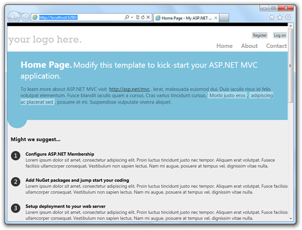
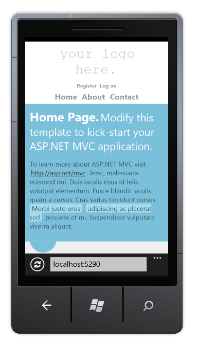
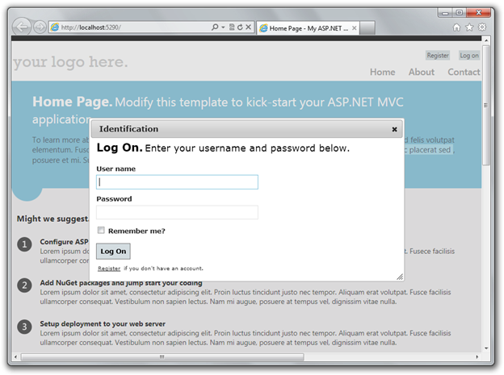
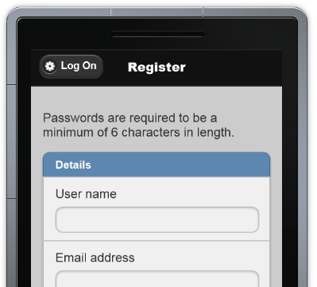
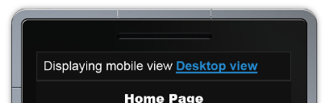

ASP.NET MVC 4
====================
> This document describes the release of ASP.NET MVC 4 Beta for Visual Studio 2010.
> 
> > [!NOTE]
> > This is not the most current release. The ASP.NET MVC 4 RC release notes are available [here](mvc4-release-notes.md).

- [Installation Notes](#_Toc303253802)
- [Documentation](#_Toc303253803)
- [Support](#_Toc303253804)
- [Software Requirements](#_Toc303253805)
- [Upgrading an ASP.NET MVC 3 Project to ASP.NET MVC 4](#_Toc303253806)
- [New Features in ASP.NET MVC 4 Beta](#_Toc303253807)

    - [ASP.NET Web API](#_Toc317096197)
    - [ASP.NET Single Page Application](#_Toc317096198)
    - [Enhancements to Default Project Templates](#_Toc303253808)
    - [Mobile Project Template](#_Toc303253809)
    - [Display Modes](#_Toc303253810)
    - [jQuery Mobile, the View Switcher, and Browser Overriding](#_Toc303253811)
    - [Recipes for Code Generation in Visual Studio](#_Toc303253812)
    - [Task Support for Asynchronous Controllers](#_Toc303253813)
    - [Azure SDK](#_Toc303253814)
    - [Known Issues and Breaking Changes](#_Toc303253815)

## Installation Notes

ASP.NET MVC 4 Beta for Visual Studio 2010 can be installed from the [ASP.NET MVC 4 home page](../mvc/mvc4.md) using the Web Platform Installer.

You must uninstall any previously installed previews of ASP.NET MVC 4 prior to installing ASP.NET MVC 4 Beta.

This release is not compatible with the .NET Framework 4.5 Developer Preview. You must uninstall the .NET 4.5 Developer Preview before installing the ASP.NET MVC 4 Beta.

ASP.NET MVC 4 can be installed and can run side-by-side with ASP.NET MVC 3.

## Documentation

Documentation for ASP.NET MVC is available on the MSDN website at the following URL:

[https://go.microsoft.com/fwlink/?LinkID=243043](https://go.microsoft.com/fwlink/?LinkID=243043)

Tutorials and other information about ASP.NET MVC are available on the MVC 4 page of the ASP.NET website ([https://www.asp.net/mvc/mvc4](../mvc/mvc4.md)).

## Support

This is a preview release and is not officially supported. If you have questions about working with this release, post them to the ASP.NET MVC forum ([https://forums.asp.net/1146.aspx](https://forums.asp.net/1146.aspx)), where members of the ASP.NET community are frequently able to provide informal support.

## Software Requirements

The ASP.NET MVC 4 components for Visual Studio require PowerShell 2.0 and either Visual Studio 2010 with Service Pack 1 or Visual Web Developer Express 2010 with Service Pack 1.

## Upgrading an ASP.NET MVC 3 Project to ASP.NET MVC 4

ASP.NET MVC 4 can be installed side by side with ASP.NET MVC 3 on the same computer, which gives you flexibility in choosing when to upgrade an ASP.NET MVC 3 application to ASP.NET MVC 4.

The simplest way to upgrade is to create a new ASP.NET MVC 4 project and copy all the views, controllers, code, and content files from the existing MVC 3 project to the new project and then to update the assembly references in the new project to match the old project. If you have made changes to the Web.config file in the MVC 3 project, you must also merge those changes into the Web.config file in the MVC 4 project.

To manually upgrade an existing ASP.NET MVC 3 application to version 4, do the following:

1. In all Web.config files in the project (there is one in the root of the project, one in the Views folder, and one in the Views folder for each area in your project), replace every instance of the following text:

    [!code-console[Main](mvc4-beta-release-notes/samples/sample1.cmd)]

    with the following corresponding text:

    [!code-console[Main](mvc4-beta-release-notes/samples/sample2.cmd)]
2. In the root Web.config file, update the *webPages:Version* element to "2.0.0.0" and add a new *PreserveLoginUrl* key that has the value "true":

    [!code-xml[Main](mvc4-beta-release-notes/samples/sample3.xml)]
3. In Solution Explorer, delete the reference to *System.Web.Mvc* (which points to the version 3 DLL). Then add a reference to *System.Web.Mvc* (v4.0.0.0). In particular, make the following changes to update the assembly references. Here are the details:

    1. In Solution Explorer, delete the references to the following assemblies: 

        - *System.Web.Mvc*(v3.0.0.0)
        - *System.Web.WebPages*(v1.0.0.0)
        - *System.Web.Razor*(v1.0.0.0)
        - *System.Web.WebPages.Deployment*(v1.0.0.0)
        - *System.Web.WebPages.Razor*(v1.0.0.0)
    2. Add a references to the following assemblies: 

        - *System.Web.Mvc*(v4.0.0.0)
        - *System.Web.WebPages*(v2.0.0.0)
        - *System.Web.Razor*(v2.0.0.0)
        - *System.Web.WebPages.Deployment*(v2.0.0.0)
        - *System.Web.WebPages.Razor*(v2.0.0.0)
4. In Solution Explorer, right-click the project name and then select Unload Project. Then right-click the name again and select Edit *ProjectName*.csproj.
5. Locate the *ProjectTypeGuids* element and replace {E53F8FEA-EAE0-44A6-8774-FFD645390401} with {E3E379DF-F4C6-4180-9B81-6769533ABE47}.
6. Save the changes, close the project (.csproj) file you were editing, right-click the project, and then select Reload Project.
7. If the project references any third-party libraries that are compiled using previous versions of ASP.NET MVC, open the root Web.config file and add the following three *bindingRedirect* elements under the *configuration* section: 

    [!code-xml[Main](mvc4-beta-release-notes/samples/sample4.xml)]

## New Features in ASP.NET MVC 4 Beta

This section describes features that have been introduced in the ASP.NET MVC 4 Beta release.

### ASP.NET Web API

ASP.NET MVC 4 now includes ASP.NET Web API, a new framework for creating HTTP services that can reach a broad range of clients including browsers and mobile devices. ASP.NET Web API is also an ideal platform for building RESTful services.

ASP.NET Web API includes support for the following features:

- **Modern HTTP programming model:** Directly access and manipulate HTTP requests and responses in your Web APIs using a new, strongly typed HTTP object model. The same programming model and HTTP pipeline is symmetrically available on the client through the new HttpClient type.
- **Full support for routes**: Web APIs now support the full set of route capabilities that have always been a part of the Web stack, including route parameters and constraints. Additionally, mapping to actions has full support for conventions, so you no longer need to apply attributes such as [HttpPost] to your classes and methods.
- **Content negotiation**: The client and server can work together to determine the right format for data being returned from an API. We provide default support for XML, JSON, and Form URL-encoded formats, and you can extend this support by adding your own formatters, or even replace the default content negotiation strategy.
- **Model binding and validation:** Model binders provide an easy way to extract data from various parts of an HTTP request and convert those message parts into .NET objects which can be used by the Web API actions.
- **Filters:** Web APIs now supports filters, including well-known filters such as the [Authorize] attribute. You can author and plug in your own filters for actions, authorization and exception handling.
- **Query composition:** By simply returning IQueryable&lt;T&gt;, your Web API will support querying via the OData URL conventions.
- **Improved testability of HTTP details:** Rather than setting HTTP details in static context objects, Web API actions can now work with instances of HttpRequestMessage and HttpResponseMessage. Generic versions of these objects also exist to let you work with your custom types in addition to the HTTP types.
- **Improved Inversion of Control (IoC) via DependencyResolver:** Web API now uses the service locator pattern implemented by MVC's dependency resolver to obtain instances for many different facilities.
- **Code-based configuration:** Web API configuration is accomplished solely through code, leaving your config files clean.
- **Self-host:** Web APIs can be hosted in your own process in addition to IIS while still using the full power of routes and other features of Web API.

For more details on ASP.NET Web API please visit [https://www.asp.net/web-api](../web-api/index.md).

### ASP.NET Single Page Application

ASP.NET MVC 4 now includes an early preview of the experience for building single page applications with significant client-side interactions using JavaScript and Web APIs. This support includes:

- A set of JavaScript libraries for richer local interactions with cached data
- Additional Web API components for unit of work and DAL support
- An MVC project template with scaffolding to get started quickly

For more details on the Single Page Application support in ASP.NET MVC 4 please visit [https://www.asp.net/single-page-application](../single-page-application/index.md).

### Enhancements to Default Project Templates

The template that is used to create new ASP.NET MVC 4 projects has been updated to create a more modern-looking website:

In addition to cosmetic improvements, there's improved functionality in the new template. The template employs a technique called adaptive rendering to look good in both desktop browsers and mobile browsers without any customization.

To see adaptive rendering in action, you can use a mobile emulator or just try resizing the desktop browser window to be smaller. When the browser window gets small enough, the layout of the page will change.

Another enhancement to the default project template is the use of JavaScript to provide a richer UI. The Login and Register links that are used in the template are examples of how to use the jQuery UI Dialog to present a rich login screen:

### Mobile Project Template

If you're starting a new project and want to create a site specifically for mobile and tablet browsers, you can use the new Mobile Application project template. This is based on jQuery Mobile, an open-source library for building touch-optimized UI:

This template contains the same application structure as the Internet Application template (and the controller code is virtually identical), but it's styled using jQuery Mobile to look good and behave well on touch-based mobile devices. To learn more about how to structure and style mobile UI, see the [jQuery Mobile project website](http://jquerymobile.com/).

If you already have a desktop-oriented site that you want to add mobile-optimized views to, or if you want to create a single site that serves differently styled views to desktop and mobile browsers, you can use the new Display Modes feature. (See the next section.)

### Display Modes

The new Display Modes feature lets an application select views depending on the browser that's making the request. For example, if a desktop browser requests the Home page, the application might use the Views\Home\Index.cshtml template. If a mobile browser requests the Home page, the application might return the Views\Home\Index.mobile.cshtml template.

Layouts and partials can also be overridden for particular browser types. For example:

- If your Views\Shared folder contains both the \_Layout.cshtml and \_Layout.mobile.cshtml templates, by default the application will use \_Layout.mobile.cshtml during requests from mobile browsers and \_Layout.cshtml during other requests.
- If a folder contains both \_MyPartial.cshtml and \_MyPartial.mobile.cshtml, the instruction @Html.Partial("\_MyPartial") will render \_MyPartial.mobile.cshtml during requests from mobile browsers, and \_MyPartial.cshtml during other requests.

If you want to create more specific views, layouts, or partial views for other devices, you can register a new *DefaultDisplayMode* instance to specify which name to search for when a request satisfies particular conditions. For example, you could add the following code to the *Application\_Start* method in the Global.asax file to register the string "iPhone" as a display mode that applies when the Apple iPhone browser makes a request:

[!code-csharp[Main](mvc4-beta-release-notes/samples/sample5.cs)]

After this code runs, when an Apple iPhone browser makes a request, your application will use the Views\Shared\\_Layout.iPhone.cshtml layout (if it exists).

### jQuery Mobile, the View Switcher, and Browser Overriding

jQuery Mobile is an open source library for building touch-optimized web UI. If you want to use jQuery Mobile with an ASP.NET MVC 4 application, you can download and install a NuGet package that helps you get started. To install it from the Visual Studio Package Manager Console, type the following command:

[!code-powershell[Main](mvc4-beta-release-notes/samples/sample6.ps1)]

This installs jQuery Mobile and some helper files, including the following:

- Views/Shared/\_Layout.Mobile.cshtml, which is a jQuery Mobile-based layout.
- A view-switcher component, which consists of the Views/Shared/\_ViewSwitcher.cshtml partial view and the ViewSwitcherController.cs controller.

After you install the package, run your application using a mobile browser (or equivalent, like the Firefox [User Agent Switcher](http://chrispederick.com/work/user-agent-switcher/) add-on). You'll see that your pages look quite different, because jQuery Mobile handles layout and styling. To take advantage of this, you can do the following:

- Create mobile-specific view overrides as described under [Display Modes](#_Toc303253810) earlier (for example, create Views\Home\Index.mobile.cshtml to override Views\Home\Index.cshtml for mobile browsers).
- Read the [jQuery Mobile documentation](http://jquerymobile.com/) to learn more about how to add touch-optimized UI elements in mobile views.

A convention for mobile-optimized web pages is to add a link whose text is something like Desktop view or Full site mode that lets users switch to a desktop version of the page. The jQuery.Mobile.MVC package includes a sample view-switcher component for this purpose. It's used in the default Views\Shared\\_Layout.Mobile.cshtml view, and it looks like this when the page is rendered:

If visitors click the link, they're switched to the desktop version of the same page.

Because your desktop layout will not include a view switcher by default, visitors won't have a way to get to mobile mode. To enable this, add the following reference to *\_ViewSwitcher* to your desktop layout, just inside the *&lt;body&gt;* element:

[!code-cshtml[Main](mvc4-beta-release-notes/samples/sample7.cshtml)]

The view switcher uses a new feature called Browser Overriding. This feature lets your application treat requests as if they were coming from a different browser (user agent) than the one they're actually from. The following table lists the methods that Browser Overriding provides.

| `HttpContext.SetOverriddenBrowser(userAgentString)` | Overrides the request's actual user agent value using the specified user agent. |
| --- | --- |
| `HttpContext.GetOverriddenUserAgent()` | Returns the request's user agent override value, or the actual user agent string if no override has been specified. |
| `HttpContext.GetOverriddenBrowser()` | Returns an *HttpBrowserCapabilitiesBase* instance that corresponds to the user agent currently set for the request (actual or overridden). You can use this value to get properties such as *IsMobileDevice*. |
| `HttpContext.ClearOverriddenBrowser()` | Removes any overridden user agent for the current request. |

Browser Overriding is a core feature of ASP.NET MVC 4 and is available even if you don't install the jQuery.Mobile.MVC package. However, it affects only view, layout, and partial-view selection — it does not affect any other ASP.NET feature that depends on the *Request.Browser* object.

By default, the user-agent override is stored using a cookie. If you want to store the override elsewhere (for example, in a database), you can replace the default provider (*BrowserOverrideStores.Current*). Documentation for this provider will be available to accompany a later release of ASP.NET MVC.

### Recipes for Code Generation in Visual Studio

The new Recipes feature enables Visual Studio to generate solution-specific code based on packages that you can install using NuGet. The Recipes framework makes it easy for developers to write code-generation plugins, which you can also use to replace the built-in code generators for Add Area, Add Controller, and Add View. Because recipes are deployed as NuGet packages, they can easily be checked into source control and shared with all developers on the project automatically. They are also available on a per-solution basis.

### Task Support for Asynchronous Controllers

You can now write asynchronous action methods as single methods that return an object of type *Task* or *Task&lt;ActionResult&gt;*.

For example, if you're using Visual C# 5 (or using the [Async CTP](https://msdn.microsoft.com/en-us/vstudio/async.aspx)), you can create an asynchronous action method that looks like the following:

[!code-csharp[Main](mvc4-beta-release-notes/samples/sample8.cs)]

In the previous action method, the calls to *newsService.GetHeadlinesAsync* and *sportsService.GetScoresAsync* are called asynchronously and do not block a thread from the thread pool.

Asynchronous action methods that return *Task* instances can also support timeouts. To make your action method cancellable, add a parameter of type *CancellationToken* to the action method signature. The following example shows an asynchronous action method that has a timeout of 2500 milliseconds and that displays a *TimedOut* view to the client if a timeout occurs.

[!code-csharp[Main](mvc4-beta-release-notes/samples/sample9.cs)]

### Azure SDK

ASP.NET MVC 4 Beta supports the September 2011 1.5 release of the Windows Azure SDK.

## Known Issues and Breaking Changes

- **After installing ASP.NET MVC 4 Beta, the CSHTML/VBHTML editor in Visual Studio 2010 Service Pack 1 CSHTML/VBHTML editor may pause for a long time after typing snippet or JavaScript inside cshtml or vbhtml files.** This occurs only in ASP.NET MVC 4 applications which have just been created and have not yet been compiled.

    The workaround is to compile the project to get the assemblies in the bin folder. Note, if you clean the project which removes the assemblies from the bin folder, the editor problem will come back.

    This will be corrected in the next release.
- **C# Project templates for Visual Studio 11 Beta contain an incorrect connection string in Global.asax.cs.** The default connection specified in the Application\_Start method for projects created in Visual Studio 11 Beta contain a LocalDB connection string which contains an unescaped backslash (\) character. This results in a connection error upon attempts to access a Entity Framework DbContext, which generates a SqlException.

    To correct this issue, escape the backslash character in the App\_Start method of Global.asax.cs so that it reads as follows:

    [!code-csharp[Main](mvc4-beta-release-notes/samples/sample10.cs)]
- **ASP.NET MVC 4 applications which target .NET 4.5 will throw a FileLoadException upon attempt to access the System.Net.Http.dll assembly when run under .NET 4.0.** ASP.NET MVC 4 applications created under .NET 4.5 contain a binding redirect that will result in a FileLoadException which that states "Could not load file or assembly 'System.Net.Http' or one of its dependencies." when the application is executed on a system with .NET 4.0 installed. To correct this issue, remove the following binding redirect from web.config:

    [!code-xml[Main](mvc4-beta-release-notes/samples/sample11.xml)]

    The assembly binding element in the modified web.config should appear as follows:

    [!code-xml[Main](mvc4-beta-release-notes/samples/sample12.xml)]
- **The "Add Controller" item template in Visual Basic projects generates an incorrect namespace when invoked****from inside an area.** When you add a controller to an area in an ASP.NET MVC project that uses Visual Basic, the item template inserts the wrong namespace into the controller. The result is a "file not found" error when you navigate to any action in the controller.  
  
 The generated namespace omits everything after the root namespace. For example, the namespace generated is *RootNamespace* but should be *RootNamespace.Areas.AreaName.Controllers* .
- **Breaking changes in the Razor View Engine.** As part of a rewrite of the Razor parser, the following types were removed from *System.Web.Mvc.Razor*: 

    - *ModelSpan*
    - *MvcVBRazorCodeGenerator*
    - *MvcCSharpRazorCodeGenerator*
    - *MvcVBRazorCodeParser*

 The following methods were also removed: 

    - *MvcCSharpRazorCodeParser.ParseInheritsStatement(System.Web.Razor.Parser.CodeBlockInfo)*
    - *MvcWebPageRazorHost.DecorateCodeGenerator(System.Web.Razor.Generator.RazorCodeGenerator)*
    - *MvcVBRazorCodeParser.ParseInheritsStatement(System.Web.Razor.Parser.CodeBlockInfo)*
- **When WebMatrix.WebData.dll is included in in the /bin directory of an ASP.NET MVC 4 apps, it takes over the URL for forms authentication.** Adding the WebMatrix.WebData.dll assembly to your application (for example, by selecting "ASP.NET Web Pages with Razor Syntax" when using the Add Deployable Dependencies dialog) will override the authentication login redirect to /account/logon rather than /account/login as expected by the default ASP.NET MVC Account Controller. To prevent this behavior and use the URL specified already in the authentication section of web.config, you can add an appSetting called PreserveLoginUrl and set it to true: 

    [!code-xml[Main](mvc4-beta-release-notes/samples/sample13.xml)]
- **The NuGet package manager fails to install when attempting to install ASP.NET MVC 4 for side by side installations of Visual Studio 2010 and Visual Web Developer 2010.** To run Visual Studio 2010 and Visual Web Developer 2010 side by side with ASP.NET MVC 4 you must install ASP.NET MVC 4 after both versions of Visual Studio have already been installed.
- **Uninstalling ASP.NET MVC 4 fails if prerequisites have already been uninstalled.** To cleanly uninstall ASP.NET MVC 4you must uninstall ASP.NET MVC 4 prior to uninstalling Visual Studio.
- **Running a default Web API project shows instructions that incorrectly direct the user to add routes using the RegisterApis method, which doesn't exist.** Routes should be added in the RegisterRoutes method using the ASP.NET route table.
- **Installing ASP.NET MVC 4 Beta breaks ASP.NET MVC 3 RTM applications.** ASP.NET MVC 3 applications that were created with the RTM release (not with the ASP.NET MVC 3 Tools Update release) require the following changes in order to work side-by-side with ASP.NET MVC 4 Beta. Building the project without making these updates results in compilation errors. 

    **Required updates**

    1. In the root Web.config file, add a new *&lt;appSettings&gt;* entry with the key *webPages:Version* and the value *1.0.0.0*.

        [!code-xml[Main](mvc4-beta-release-notes/samples/sample14.xml)]
    2. In Solution Explorer, right-click the project name and then select Unload Project. Then right-click the name again and select Edit *ProjectName*.csproj.
    3. Locate the following assembly references: 

        [!code-xml[Main](mvc4-beta-release-notes/samples/sample15.xml)]

        Replace them with the following:

        [!code-xml[Main](mvc4-beta-release-notes/samples/sample16.xml)]
    4. Save the changes, close the project (.csproj) file you were editing, and then right-click the project and select Reload.