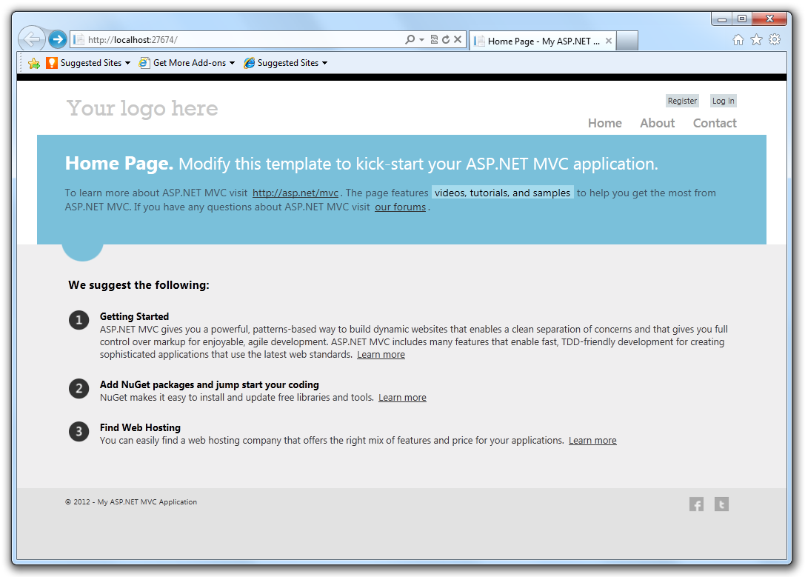
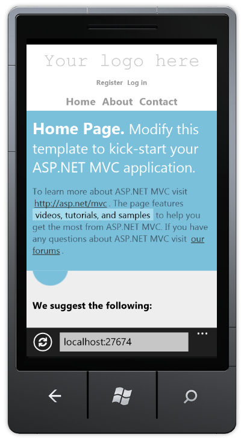
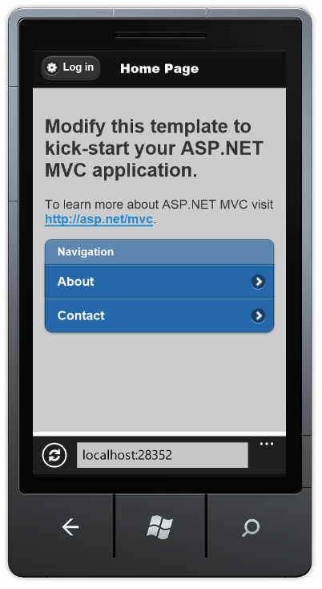

ASP.NET MVC 4
====================
> This document describes the release of ASP.NET MVC 4 .

- [Installation Notes](#_Toc303253802)
- [Documentation](#_Toc303253803)
- [Support](#_Toc303253804)
- [Software Requirements](#_Toc303253805)
- [New Features in ASP.NET MVC 4](#_Toc303253807)

    - [ASP.NET Web API](#_Toc317096197)
    - [Enhancements to Default Project Templates](#_Toc303253808)
    - [Mobile Project Template](#_Toc303253809)
    - [Display Modes](#_Toc303253810)
    - [jQuery Mobile, the View Switcher, and Browser Overriding](#_Toc303253811)
    - [Task Support for Asynchronous Controllers](#_Toc303253813)
    - [Azure SDK](#_Toc303253814)
    - [Database Migrations](#_Toc303253818)
    - [Empty Project Template](#_Toc303253819)
    - [Add Controller to any project folder](#_Toc303253820)
    - [Bundling and Minification](#_Toc303253821)
    - [Enabling Logins from Facebook and Other Sites Using OAuth and OpenID](#_Toc303253822)
- [Upgrading an ASP.NET MVC 3 Project to ASP.NET MVC 4](#_Toc303253806)
- [Changes from ASP.NET MVC 4 Release Candidate](#_Toc303253817)
- [Known Issues and Breaking Changes](#_Toc303253815)

## Installation Notes

ASP.NET MVC 4 for Visual Studio 2010 can be installed from the [ASP.NET MVC 4 home page](../mvc/mvc4.md) using the Web Platform Installer.

We recommend uninstalling any previously installed previews of ASP.NET MVC 4 prior to installing ASP.NET MVC 4. You can upgrade the ASP.NET MVC 4 Beta and Release Candidate to ASP.NET MVC 4 without uninstalling.

This release is not compatible with any preview releases of .NET Framework 4.5. You must separately upgrade the any installed preview releases of .NET Framework 4.5 to the final version prior to installing ASP.NET MVC 4.

ASP.NET MVC 4 can be installed and run side-by-side with ASP.NET MVC 3.

## Documentation

Documentation for ASP.NET MVC is available on the MSDN website at the following URL:

[https://go.microsoft.com/fwlink/?LinkID=243043](https://go.microsoft.com/fwlink/?LinkID=243043)

Tutorials and other information about ASP.NET MVC are available on the MVC 4 page of the ASP.NET website ([https://www.asp.net/mvc/mvc4](../mvc/mvc4.md)).

## Support

ASP.NET MVC 4 is fully supported. If you have questions about working with this release you can also post them to the ASP.NET MVC forum ([https://forums.asp.net/1146.aspx](https://forums.asp.net/1146.aspx)), where members of the ASP.NET community are frequently able to provide informal support.

## Software Requirements

The ASP.NET MVC 4 components for Visual Studio require PowerShell 2.0 and either Visual Studio 2010 with Service Pack 1 or Visual Web Developer Express 2010 with Service Pack 1.

## New Features in ASP.NET MVC 4

This section describes features that have been introduced in the ASP.NET MVC 4 release.

### ASP.NET Web API

ASP.NET MVC 4 includes ASP.NET Web API, a new framework for creating HTTP services that can reach a broad range of clients including browsers and mobile devices. ASP.NET Web API is also an ideal platform for building RESTful services.

ASP.NET Web API includes support for the following features:

- **Modern HTTP programming model:** Directly access and manipulate HTTP requests and responses in your Web APIs using a new, strongly typed HTTP object model. The same programming model and HTTP pipeline is symmetrically available on the client through the new *HttpClient* type.
- **Full support for routes:** ASP.NET Web API supports the full set of route capabilities of ASP.NET Routing, including route parameters and constraints. Additionally, use simple conventions to map actions to HTTP methods.
- **Content negotiation:** The client and server can work together to determine the right format for data being returned from a web API. ASP.NET Web API provides default support for XML, JSON, and Form URL-encoded formats and you can extend this support by adding your own formatters, or even replace the default content negotiation strategy.
- **Model binding and validation:** Model binders provide an easy way to extract data from various parts of an HTTP request and convert those message parts into .NET objects which can be used by the Web API actions. Validation is also performed on action parameters based on data annotations.
- **Filters:** ASP.NET Web API supports filters including well-known filters such as the *[Authorize]* attribute. You can author and plug in your own filters for actions, authorization and exception handling.
- **Query composition:** Use the *[Queryable]* filter attribute on an action that returns *IQueryable* to enable support for querying your web API via the OData query conventions.
- **Improved testability:** Rather than setting HTTP details in static context objects, web API actions work with instances of *HttpRequestMessage* and *HttpResponseMessage*. Create a unit test project along with your Web API project to get started quickly writing unit tests for your Web API functionality.
- **Code-based configuration:** ASP.NET Web API configuration is accomplished solely through code, leaving your config files clean. Use the provided service locator pattern to configure extensibility points.
- **Improved support for Inversion of Control (IoC) containers:** ASP.NET Web API provides great support for IoC containers through an improved dependency resolver abstraction
- **Self-host:** Web APIs can be hosted in your own process in addition to IIS while still using the full power of routes and other features of Web API.
- **Create custom help and test pages:** You now can easily build custom help and test pages for your web APIs by using the new *IApiExplorer* service to get a complete runtime description of your web APIs.
- **Monitoring and diagnostics:** ASP.NET Web API now provides light weight tracing infrastructure that makes it easy to integrate with existing logging solutions such as System.Diagnostics, ETW and third party logging frameworks. You can enable tracing by providing an *ITraceWriter* implementation and adding it to your web API configuration.
- **Link generation:** Use the ASP.NET Web API *UrlHelper* to generate links to related resources in the same application.
- **Web API project template:** Select the new Web API project form the New MVC 4 Project wizard to quickly get up and running with ASP.NET Web API.
- **Scaffolding:** Use the **Add Controller** dialog to quickly scaffold a web API controller based on an Entity Framework based model type.

For more details on ASP.NET Web API please visit [https://www.asp.net/web-api](../web-api/index.md).

### Enhancements to Default Project Templates

The template that is used to create new ASP.NET MVC 4 projects has been updated to create a more modern-looking website:

In addition to cosmetic improvements, there's improved functionality in the new template. The template employs a technique called adaptive rendering to look good in both desktop browsers and mobile browsers without any customization.

To see adaptive rendering in action, you can use a mobile emulator or just try resizing the desktop browser window to be smaller. When the browser window gets small enough, the layout of the page will change.

### Mobile Project Template

If you're starting a new project and want to create a site specifically for mobile and tablet browsers, you can use the new Mobile Application project template. This is based on jQuery Mobile, an open-source library for building touch-optimized UI:

This template contains the same application structure as the Internet Application template (and the controller code is virtually identical), but it's styled using jQuery Mobile to look good and behave well on touch-based mobile devices. To learn more about how to structure and style mobile UI, see the [jQuery Mobile project website](http://jquerymobile.com/).

If you already have a desktop-oriented site that you want to add mobile-optimized views to, or if you want to create a single site that serves differently styled views to desktop and mobile browsers, you can use the new Display Modes feature. (See the next section.)

### Display Modes

The new Display Modes feature lets an application select views depending on the browser that's making the request. For example, if a desktop browser requests the Home page, the application might use the Views\Home\Index.cshtml template. If a mobile browser requests the Home page, the application might return the Views\Home\Index.mobile.cshtml template.

Layouts and partials can also be overridden for particular browser types. For example:

- If your Views\Shared folder contains both the \_Layout.cshtml and \_Layout.mobile.cshtml templates, by default the application will use \_Layout.mobile.cshtml during requests from mobile browsers and \_Layout.cshtml during other requests.
- If a folder contains both \_MyPartial.cshtml and \_MyPartial.mobile.cshtml, the instruction @Html.Partial("\_MyPartial") will render \_MyPartial.mobile.cshtml during requests from mobile browsers, and \_MyPartial.cshtml during other requests.

If you want to create more specific views, layouts, or partial views for other devices, you can register a new *DefaultDisplayMode* instance to specify which name to search for when a request satisfies particular conditions. For example, you could add the following code to the *Application\_Start* method in the Global.asax file to register the string "iPhone" as a display mode that applies when the Apple iPhone browser makes a request:

[!code-csharp[Main](mvc4-release-notes/samples/sample1.cs)]

After this code runs, when an Apple iPhone browser makes a request, your application will use the Views\Shared\\_Layout.iPhone.cshtml layout (if it exists). For more information on Display Mode, see [ASP.NET MVC 4 Mobile Features](../mvc/overview/older-versions/aspnet-mvc-4-mobile-features.md). Applications using DisplayModeProvider should install the [Fixed DisplayModes](http://nuget.org/packages/Microsoft.AspNet.Mvc.FixedDisplayModes) NuGet package. The [ASP.NET Fall 2012 Update](https://go.microsoft.com/fwlink/?LinkID=271322) includes the [Fixed DisplayModes](http://nuget.org/packages/Microsoft.AspNet.Mvc.FixedDisplayModes) NuGet package in the new project templates. See [ASP.NET MVC 4 Mobile Caching Bug Fixedd](https://blogs.msdn.com/b/rickandy/archive/2012/09/17/asp-net-mvc-4-mobile-caching-bug-fixed.aspx) for details on the fix.

### jQuery Mobile and Mobile Features

For information on building Mobile applications with ASP.NET MVC 4 using jQuery Mobile, see the tutorial [ASP.NET MVC 4 Mobile Features](../mvc/overview/older-versions/aspnet-mvc-4-mobile-features.md).

### Task Support for Asynchronous Controllers

You can now write asynchronous action methods as single methods that return an object of type *Task* or *Task&lt;ActionResult&gt;*.

 For more information see [Using Asynchronous Methods in ASP.NET MVC 4](../mvc/overview/performance/using-asynchronous-methods-in-aspnet-mvc-4.md).

### Azure SDK

ASP.NET MVC 4 supports the 1.6 and newer releases of the Windows Azure SDK.

### Database Migrations

ASP.NET MVC 4 projects now include Entity Framework 5. One of the great features in Entity Framework 5 is support for database migrations. This feature enables you to easily evolve your database schema using a code-focused migration while preserving the data in the database. For more information on database migrations, see [Adding a New Field to the Movie Model and Table](../mvc/overview/older-versions/getting-started-with-aspnet-mvc4/adding-a-new-field-to-the-movie-model-and-table.md) in the [Introduction to ASP.NET MVC 4 tutorial](../mvc/overview/older-versions/getting-started-with-aspnet-mvc4/intro-to-aspnet-mvc-4.md).

### Empty Project Template

The MVC Empty project template is now truly empty so that you can start from a completely clean slate. The earlier version of the Empty project template has been renamed to Basic.

### Add Controller to any project folder

You can now right click and select **Add Controller** from any folder in your MVC project. This gives you more flexibility to organize your controllers however you want, including keeping your MVC and Web API controllers in separate folders.

### Bundling and Minification

The bundling and minification framework enables you to reduce the number of HTTP requests that a Web page needs to make by combining individual files into a single, bundled file for scripts and CSS. It can then reduce the overall size of those requests by minifying the contents of the bundle. Minifying can include activities like eliminating whitespace to shortening variable names to even collapsing CSS selectors based on their semantics. Bundles are declared and configured in code and are easily referenced in views via helper methods which can generate either a single link to the bundle or, when debugging, multiple links to the individual contents of the bundle. For more information see [Bundling and Minification](../mvc/overview/performance/bundling-and-minification.md).

### Enabling Logins from Facebook and Other Sites Using OAuth and OpenID

The default templates in ASP.NET MVC 4 Internet Project template now includes support for OAuth and OpenID login using the DotNetOpenAuth library. For information on configuring an OAuth or OpenID provider, see [OAuth/OpenID Support for WebForms, MVC and WebPages](https://blogs.msdn.com/b/webdev/archive/2012/08/15/oauth-openid-support-for-webforms-mvc-and-webpages.aspx) and the [OAuth and OpenID feature documentation in ASP.NET Web Pages](../web-pages/overview/releases/top-features-in-web-pages-2.md#oauthsetup).

## Upgrading an ASP.NET MVC 3 Project to ASP.NET MVC 4

ASP.NET MVC 4 can be installed side by side with ASP.NET MVC 3 on the same computer, which gives you flexibility in choosing when to upgrade an ASP.NET MVC 3 application to ASP.NET MVC 4.

The simplest way to upgrade is to create a new ASP.NET MVC 4 project and copy all the views, controllers, code, and content files from the existing MVC 3 project to the new project and then to update the assembly references in the new project to match any non-MVC template included assembiles you are using. If you have made changes to the Web.config file in the MVC 3 project, you must also merge those changes into the Web.config file in the MVC 4 project.

To manually upgrade an existing ASP.NET MVC 3 application to version 4, do the following:

1. In all Web.config files in the project (there is one in the root of the project, one in the Views folder, and one in the Views folder for each area in your project), replace every instance of the following text (note: System.Web.WebPages, Version=1.0.0.0 is not found in projects created with Visual Studio 2012): 

    [!code-console[Main](mvc4-release-notes/samples/sample2.cmd)]

    with the following corresponding text:

    [!code-console[Main](mvc4-release-notes/samples/sample3.cmd)]
2. In the root Web.config file, update the *webPages:Version* element to "2.0.0.0" and add a new *PreserveLoginUrl* key that has the value "true": 

    [!code-xml[Main](mvc4-release-notes/samples/sample4.xml)]
3. In Solution Explorer, right-click on the References and select Manage NuGet Packages. In the left pane, select **Online\NuGet official package source**, then update the following:

    - ASP.NET MVC 4
    - (Optional) jQuery, jQuery Validation and jQuery UI
    - (Optional) Entity Framework
    - (Optonal) Modernizr
4. In Solution Explorer, right-click the project name and then select Unload Project. Then right-click the name again and select Edit *ProjectName*.csproj.
5. Locate the *ProjectTypeGuids* element and replace {E53F8FEA-EAE0-44A6-8774-FFD645390401} with {E3E379DF-F4C6-4180-9B81-6769533ABE47}.
6. Save the changes, close the project (.csproj) file you were editing, right-click the project, and then select Reload Project.
7. If the project references any third-party libraries that are compiled using previous versions of ASP.NET MVC, open the root Web.config file and add the following three *bindingRedirect* elements under the *configuration* section: 

    [!code-xml[Main](mvc4-release-notes/samples/sample5.xml)]

## Changes from ASP.NET MVC 4 Release Candidate

The release notes for ASP.NET MVC 4 Release Candidate can be found  here:

The major changes from ASP.NET MVC 4 Release Candidate in this release are summarized below:

- **Per controller configuration:** ASP.NET Web API controllers can be attributed with a custom attribute that implements *IControllerConfiguration* to setup their own formatters, action selector and parameter binders. The *HttpControllerConfigurationAttribute* has been removed.
- **Per route message handlers:** You can now specify the final message handler in the request chain for a given route. This enables support for ride-along frameworks to use routing to dispatch to their own (non-*IHttpController*) endpoints.
- **Progress notifications:** The *ProgressMessageHandler* generates progress notification for both request entities being uploaded and response entities being downloaded. Using this handler it is possible to keep track of how far you are uploading a request body or downloading a response body.
- **Push content:** The *PushStreamContent* class enables scenarios where a data producer wants to write directly to the request or response(either synchronously or asynchronously) using a stream. When the *PushStreamContent* is ready to accept data it calls out to an action delegate with the output stream. The developer can then write to the stream for as long as necessary and close the stream when writing has completed. The *PushStreamContent* detects the closing of the stream and completes the underlying asynchronous *Task* for writing out the content.
- **Creating error responses:** Use the *HttpError* type to consistently represent error information from such as validation errors and exceptions while still honoring the *IncludeErrorDetailPolicy*. Use the new *CreateErrorResponse* extension methods to easily create error responses with *HttpError* as content. The *HttpError* content is fully content negotiated.
- **MediaRangeMapping removed:** Media type ranges are now handled by the default content negotiator.
- **Default parameter binding for simple type parameters is now [FromUri]:** In previous releases of ASP.NET Web API the default parameter binding for simple type parameters used model binding. The default parameter binding for simple type parameters is now *[FromUri]*.
- **Action selection honors required parameters:** Action selection in ASP.NET Web API will now only select an action if all required parameters that come from the URI are provided. A parameter can be specified as optional by providing a default value for the argument in the action method signature.
- **Customize HTTP parameter bindings:** Use the *ParameterBindingAttribute* to customize the parameter binding for a specific action parameter or use the *ParameterBindingRules* on the *HttpConfiguration* to customize parameter bindings more broadly.
- **MediaTypeFormatter improvements:** Formatters now have access to the full *HttpContent* instance.
- **Host buffering policy selection:** Implement and configure the *IHostBufferPolicySelector* service in ASP.NET Web API to enable hosts to determine the policy for when buffering is to be used.
- **Access client certificates in a host agnostic manner:** Use the *GetClientCertificate* extension method to get the supplied client certificate from the request message.
- **Content negotiation extensibility:** Customize content negotiation by deriving from the *DefaultContentNegotiator* and overriding any aspect of content negotiation that you would like.
- **Support for returning 406 Not Acceptable responses:** You can now return 406 Not Acceptable responses in ASP.NET Web API when a suitable formatter is not found by creating a *DefaultContentNegotiator* with the *excludeMatchOnTypeOnly* parameter set to *true*.
- **Read form data as NameValueCollection or JToken:** You can read form data in the URI query string or in the request body as a *NameValueCollection* using the *ParseQueryString* and *ReadAsFormDataAsync* extension methods respectively. Similarly, you can read form data in the URI query string or in the request body as a *JToken* using the *TryReadQueryAsJson* and *ReadAsAsync*&lt;T&gt; extension methods respectively.
- **Multipart improvements:** It is now possible to write a *MultipartStreamProvider* that is completely tailored to the type of MIME multipart data that it can read and present the result in the optimal way to the user. You can also hook a post processing step on the *MultipartStreamProvider* that allows the implementation to do whatever post processing it wants on the MIME multipart body parts. For example, the *MultipartFormDataStreamProvider* implementation reads the HTML form data parts and adds them to a *NameValueCollection* so they are easy to get at from the caller.
- **Link generation improvements:** The *UrlHelper* no longer depends on *HttpControllerContext*. You can now access the *UrlHelper* from any context where the *HttpRequestMessage* is available.
- **Message handler execution order change:** Message handlers are now executed in the order that they are configured instead of in reverse order.
- **Helper for wiring up message handlers:** The new *HttpClientFactory* that can wire up *DelegatingHandlers* and create an *HttpClient* with the desired pipeline ready to go. It also provides functionality for wiring up with alternative inner handlers (the default is *HttpClientHandler*) as well as do the wiring up when using *HttpMessageInvoker* or another *DelegatingHandler* instead of *HttpClient* as the top-invoker.
- **Support for CDNs in ASP.NET Web Optimization:** ASP.NET Web Optimization now provides support for CDN alternate paths enabling you to specify for each bundle an additional URL which points to that same resource on a content delivery network. Supporting CDNs enables you to get your script and style bundles geographically closer to the end consumers of your Web applications.
- **ASP.NET Web API routes and configuration moved to *WebApiConfig.Register* static method that can be resused in test code.** ASP.NET Web API routes previously were added in *RouteConfig.RegisterRoutes* along with the standard MVC routes. The default ASP.NET Web API routes and configuration are now handled in a separate *WebApiConfig.Register* method to facilitate testing.

## Known Issues and Breaking Changes

- **The RC and RTM version of ASP.NET MVC 4 incorrectly returned cached desktop views when mobile views should be returned.**

    - See [ASP.NET MVC 4 Mobile Caching Bug Fixed](https://blogs.msdn.com/b/rickandy/archive/2012/09/17/asp-net-mvc-4-mobile-caching-bug-fixed.aspx) for details on the fix. The fix can be installed from the [Fixed DisplayModes](http://nuget.org/packages/Microsoft.AspNet.Mvc.FixedDisplayModes) NuGet package.
- **Breaking changes in the Razor View Engine**. The following types were removed from *System.Web.Mvc.Razor*: 

    - *ModelSpan*
    - *MvcVBRazorCodeGenerator*
    - *MvcCSharpRazorCodeGenerator*
    - *MvcVBRazorCodeParser*

 The following methods were also removed: 

    - *MvcCSharpRazorCodeParser.ParseInheritsStatement(System.Web.Razor.Parser.CodeBlockInfo)*
    - *MvcWebPageRazorHost.DecorateCodeGenerator(System.Web.Razor.Generator.RazorCodeGenerator)*
    - *MvcVBRazorCodeParser.ParseInheritsStatement(System.Web.Razor.Parser.CodeBlockInfo)*
- **When WebMatrix.WebData.dll is included in in the /bin directory of an ASP.NET MVC 4 apps, it takes over the URL for forms authentication.** Adding the WebMatrix.WebData.dll assembly to your application (for example, by selecting "ASP.NET Web Pages with Razor Syntax" when using the Add Deployable Dependencies dialog) will override the authentication login redirect to /account/logon rather than /account/login as expected by the default ASP.NET MVC Account Controller. To prevent this behavior and use the URL specified already in the authentication section of web.config, you can add an appSetting called PreserveLoginUrl and set it to true: 

    [!code-xml[Main](mvc4-release-notes/samples/sample6.xml)]
- **The NuGet package manager fails to install when attempting to install ASP.NET MVC 4 for side by side installations of Visual Studio 2010 and Visual Web Developer 2010.** To run Visual Studio 2010 and Visual Web Developer 2010 side by side with ASP.NET MVC 4 you must install ASP.NET MVC 4 after both versions of Visual Studio have already been installed.
- **Uninstalling ASP.NET MVC 4 fails if prerequisites have already been uninstalled.** To cleanly uninstall ASP.NET MVC 4you must uninstall ASP.NET MVC 4 prior to uninstalling Visual Studio.
- **Installing ASP.NET MVC 4 breaks ASP.NET MVC 3 RTM applications.** ASP.NET MVC 3 applications that were created with the RTM release (not with the [ASP.NET MVC 3 Tools Update](https://www.microsoft.com/en-us/download/details.aspx?id=1491) release) require the following changes in order to work side-by-side with ASP.NET MVC 4. Building the project without making these updates results in compilation errors. 

    **Required updates**

    1. In the root Web.config file, add a new *&lt;appSettings&gt;* entry with the key *webPages:Version* and the value *1.0.0.0*. 

        [!code-xml[Main](mvc4-release-notes/samples/sample7.xml)]
    2. In Solution Explorer, right-click the project name and then select Unload Project. Then right-click the name again and select Edit *ProjectName*.csproj.
    3. Locate the following assembly references: 

        [!code-xml[Main](mvc4-release-notes/samples/sample8.xml)]

        Replace them with the following:

        [!code-xml[Main](mvc4-release-notes/samples/sample9.xml)]
    4. Save the changes, close the project (.csproj) file you were editing, and then right-click the project and select Reload.
- **Changing an ASP.NET MVC 4 project to target 4.0 from 4.5 does not update the EntityFramework assembly reference:** If you change an ASP.NET MVC 4 project to target 4.0 after targetting 4.5 the reference to the EntityFramework assembly will still point to the 4.5 version. To fix this issue uninstall and reinstall the EntityFramework NuGet package.
- **403 Forbidden when running an ASP.NET MVC 4 application on Azure after changing to target 4.0 from 4.5:** If you change an ASP.NET MVC 4 project to target 4.0 after targetting 4.5 and then deploy to Azure you may see a 403 Forbidden error at runtime. To workaround this issue add the following to your web.config: `<modules runAllManagedModulesForAllRequests="true" />`
- **Visual Studio 2012 crashes when you type a '\' in a string literal in a Razor file.** To work around the issue enter the closing quote of the string literal first.
- **Browsing to &quot;Account/Manage&quot; in the Internet template results in a runtime error for CHS, TRK and CHT languages.** To fix the issue modify the page to separate out *@User.Identity.Name* by puting it as the only content within the *&lt;strong&gt;* tag.
- **Google and LinkedIn providers are not supported within Azure Web Sites.** Use alternative authentication providers when deploying to Azure Web Sites.
- **When using UriPathExtensionMapping with IIS 8 Express/IIS, you would receive 404 Not Found errors when you try to use the extension.** The static file handler will interfere with requests to web APIs that use *UriPathExtensionMappings*. Set *runAllManagedModulesForAllRequests=true* in web.config to work around the issue.
- **Controller.Execute method is no longer called.** All MVC controllers are now always executed asynchronously.
