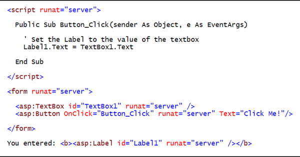
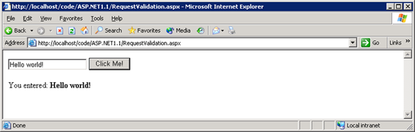
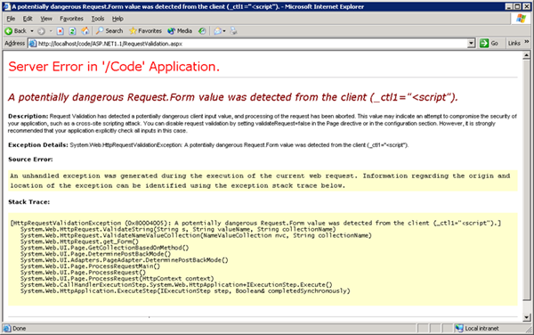
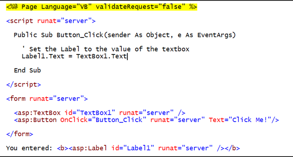
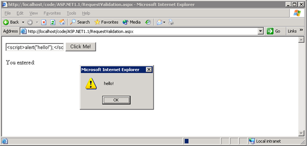
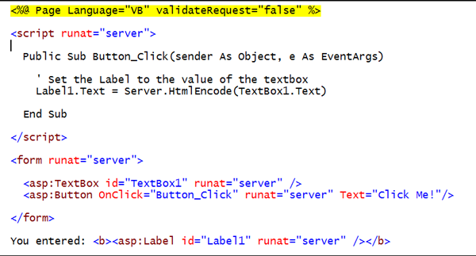

Request Validation - Preventing Script Attacks
====================
> This paper describes the request validation feature of ASP.NET where, by default, the application is prevented from processing unencoded HTML content submitted to the server. This request validation feature can be disabled when the application has been designed to safely process HTML data.
> 
> Applies to ASP.NET 1.1 and ASP.NET 2.0.

Request validation, a feature of ASP.NET since version 1.1, prevents the server from accepting content containing un-encoded HTML. This feature is designed to help prevent some script-injection attacks whereby client script code or HTML can be unknowingly submitted to a server, stored, and then presented to other users. We still strongly recommend that you validate all input data and HTML encode it when appropriate.

For example, you create a Web page that requests a user's e-mail address and then stores that e-mail address in a database. If the user enters &lt;SCRIPT&gt;alert("hello from script")&lt;/SCRIPT&gt; instead of a valid e-mail address, when that data is presented, this script can be executed if the content was not properly encoded. The request validation feature of ASP.NET prevents this from happening.

## Why this feature is useful

Many sites are not aware that they are open to simple script injection attacks. Whether the purpose of these attacks is to deface the site by displaying HTML, or to potentially execute client script to redirect the user to a hacker's site, script injection attacks are a problem that Web developers must contend with.

Script injection attacks are a concern of all web developers, whether they are using ASP.NET, ASP, or other web development technologies.

The ASP.NET request validation feature proactively prevents these attacks by not allowing unencoded HTML content to be processed by the server unless the developer decides to allow that content.

## What to expect: Error Page

The screen shot below shows some sample ASP.NET code:

Running this code results in a simple page that allows you to enter some text in the textbox, click the button, and display the text in the label control:

However, were JavaScript, such as `` to be entered and submitted we would get an exception:

The error message states that a 'potentially dangerous Request.Form value was detected' and provides more details in the description as to exactly what occurred and how to change the behavior. For example:

Request validation has detected a potentially dangerous client input value, and processing of the request has been aborted. This value may indicate an attempt to compromise the security of your application, such as a cross-site scripting attack. You can disable request validation by setting `validateRequest=false` in the Page directive or in the configuration section. However, it is strongly recommended that your application explicitly check all inputs in this case.

## Disabling request validation on a page

To disable request validation on a page you must set the `validateRequest` attribute of the Page directive to `false`:

[!code-aspx[Main](request-validation/samples/sample1.aspx)]

> [!CAUTION]
> When request validation is disabled, content can be submitted to a page; it is the responsibility of the page developer to ensure that content is properly encoded or processed.

## Disabling request validation for your application

To disable request validation for your application, you must modify or create a Web.config file for your application and set the validateRequest attribute of the `<pages />` section to `false`:

[!code-xml[Main](request-validation/samples/sample2.xml)]

If you wish to disable request validation for all applications on your server, you can make this modification to your Machine.config file.

> [!CAUTION]
> When request validation is disabled, content can be submitted to your application; it is the responsibility of the application developer to ensure that content is properly encoded or processed.

The code below is modified to turn off request validation:

Now if the following JavaScript was entered into the textbox `` the result would be:

To prevent this from happening, with request validation turned off, we need to HTML encode the content.

## How to HTML encode content

If you have disabled request validation, it is good practice to HTML-encode content that will be stored for future use. HTML encoding will automatically replace any ‘&lt;' or ‘&gt;' (together with several other symbols) with their corresponding HTML encoded representation. For example, ‘&lt;' is replaced by ‘&amp;lt;' and ‘&gt;' is replaced by ‘&amp;gt;'. Browsers use these special codes to display the ‘&lt;' or ‘&gt;' in the browser.

Content can be easily HTML-encoded on the server using the `Server.HtmlEncode(string)` API. Content can also be easily HTML-decoded, that is, reverted back to standard HTML using the `Server.HtmlDecode(string)` method.

Resulting in:

