ASP.NET Side-by-Side Execution of .NET Framework 1.0 and 1.1
====================
> This whitepaper describes how to install both .NET 1.0 and .NET 1.1 on your machine, allowing an ASP.NET Web application to run on either version of the framework.
> 
> Applies to ASP.NET 1.0 and ASP.NET 1.1.

In ASP.NET, applications are said to be running side by side when they are installed on the same computer, but use different versions of the .NET Framework. The following topic describes how to configure ASP.NET applications for side-by-side execution and provides detailed steps to:

- [Maintain your Web application's mapping to .NET Framework version 1.0 during installation](#1)
- [Map a Web application to a specific version of the .NET Framework](#2)
- [Find the version of the .NET Framework that a Web site is using](#3)

Traditionally, when a component or application is updated on a computer, the older version is removed and replaced with the newer version. If the new version is not compatible with the previous version, this usually breaks other applications that use the component or application. The .NET Framework provides support for side-by-side execution, which allows multiple versions of an assembly or application to be installed on the same computer at the same time. Because multiple versions can be installed simultaneously, managed applications can select which version to use without affecting applications that use a different version.

By default, during the installation of the .NET Framework version 1.1, all existing ASP.NET applications are automatically reconfigured to use the latest version of the .NET Framework. If you do not want your ASP.NET applications to default to .NET Framework 1.1, click [here](#1) to learn how to prevent this during installation.

If you update your Web server to .NET Framework 1.1 and want one or more Web applications to run .NET Framework 1.0, you need to update the Internet Information Services (IIS) Script Map. The script mapping is the mechanism to map the .aspx file extension for a specific Web application to a version of the .NET Framework. Click [here](#2) to learn how to map a Web application to a specific version of the .NET Framework.

You can use the Internet Information Manger or the ASP.NET IIS Registration Tool (Aspnet\_regiis.exe) to find which .NET Framework version is running a particular Web application. Click [here](#3) to learn how to find the version of the .NET Framework that a Web site is using.

One import consideration when migrating to .NET Framework 1.1 is that each version of the .NET Framework uses its own Machine.config file. As a result, if a Web administrator has made changes to the Machine.config file, those changes must be migrated to the .NET Framework 1.1 Machine.config file.

## Maintaining your Web application's mapping to .NET Framework 1.0 during installation

By default, all existing ASP.NET applications are automatically reconfigured during installation to use the newer version of the .NET Framework. Using the newer version of the .NET Framework, applications can take full advantage of improvements and new features included in the new release. At the same time, the Web administrator, who might want granular control over which applications are updated, can prevent the automatic remapping of all existing ASP.NET applications during installation of the .NET Framework.

To prevent the automatic remapping of the entire ASP.NET application to the newer version of the .NET Framework, the Web administrator can use the /noaspupgrade command-line option with the Dotnetfx.exe setup program.

**To prevent total remapping of ASP.NET application to newer version**

1. Go to **Start**.
2. Click on **run**.
3. Type **cmd**.
4. Click **OK**.  
  
    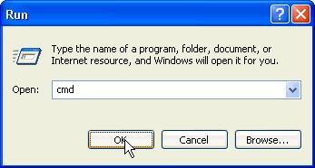
5. From the command prompt, type the following line to start the installation of the .NET Framework: **Dotnetfx.exe /c:"install /noaspupgrade?**.  
  
    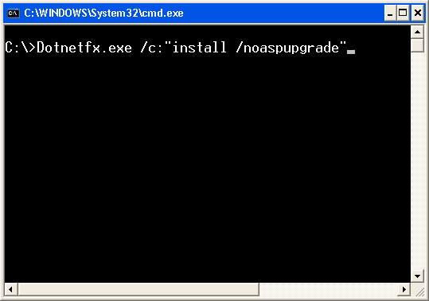
6. Click **Yes** in the Microsoft .NET Framework 1.1 Setup. This will start the setup process of the .NET Framework 1.1.  
  
    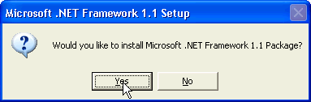

## Map a Web application to a specific version of the .NET Framework

Each version of the .NET Framework includes a version of the ASP.NET IIS Registration Tool (Aspnet\_regiis.exe). This tool enables administrators to specify that a Web application be run under a particular version of the .NET Framework. This is referred to as mapping a Web application to a version of the .NET Framework. Administrators must select the Aspnet\_regiis.exe that corresponds to the version of the .NET Framework that will be associated with the Web application. For example, an administrator who wants to specify that a Web site use .NET Framework 1.1 must use the Aspnet\_regiis.exe that comes with .NET Framework 1.1.

The Aspnet\_regiis.exe for version 1.0 is located at:

- C:\WINDOWS\Microsoft.NET\Framework\**v1.0.3705**\aspnet\_regiis

The Aspnet\_regiis.exe for version 1,1 is located at:

- C:\WINDOWS\Microsoft.NET\Framework\**v1.1.4322**\aspnet\_regiis

The Aspnet\_regiis.exe provides two options for script mapping a Web application:

- **-s** sets the script map in the path and in its child directories.
- **-sn** sets the script map in the path only.

The path defines the Web application IIS metadata path, which is defined in the form of W3SVC/ROOT/{WebSiteNumber}/{Application\_Name}. For example, for a Web application called Portal located under the default Web site, the metabase path is W3SVC/1/ROOT/Portal.

Note You can also use a tool called the Metabase Editor to get the metabase path. You can download this tool from the Microsoft Support site at [https://support.microsoft.com/default.aspx?scid=kb;en-us;232068.](https://support.microsoft.com/default.aspx?scid=kb;en-us;232068)

- Run Aspnet\_regiis.exe -s W3SVC/1/ROOT/Portal to update the portal IIS script map and its subapplication.  
  
    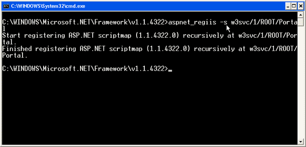

- Run Aspnet\_regiis.exe -sn W3SVC/1/ROOT/Portal to update the portal IIS script map, without affecting applications in the portal?s subdirectories.  
  
    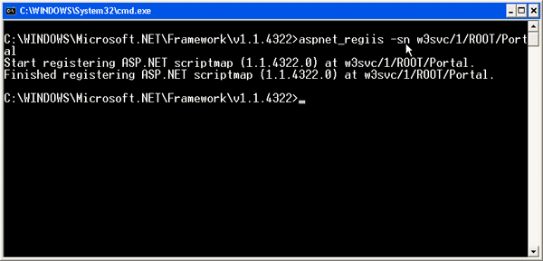

## Find the .NET Framework version that a Web application is using

An administrator can use the Internet Service Manager to find which version of the .NET Framework runs a Web site. Different operating system versions launch the Internet Service Manager differently. To start the service manager, follow the steps listed below.

**To start Internet Service Manager**

1. Go to **Start**.
2. Click on **run**.
3. Type **inetmgr**.  
  
    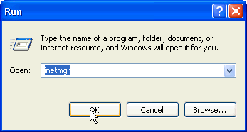
4. From the Internet Service Manager, select the Web application whose version of the .NET Framework you want to know.  
  
    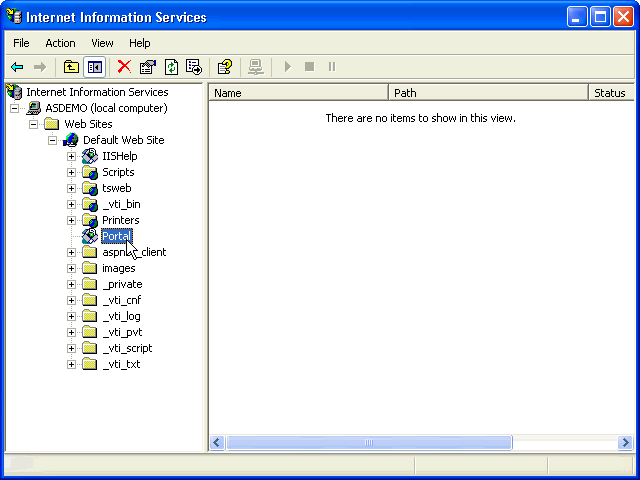
5. Right-click on the Web application, and click on **Properties.**  
  
    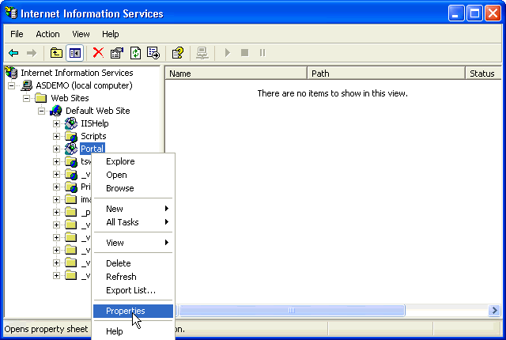
6. From the Property window, select **Configuration.**  
  
    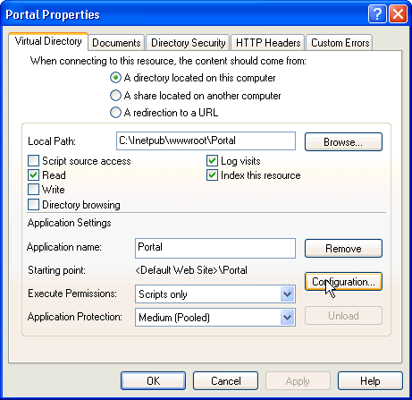
7. From the application mapping table, select **.aspx**, and click **Edit**.  
  
    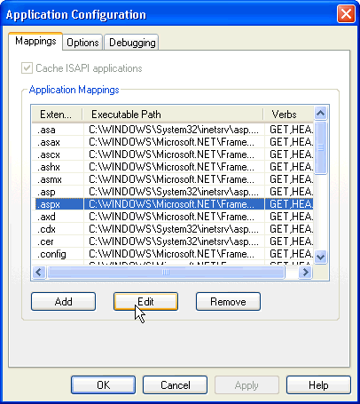
8. From the **Executable** text box, look at the version directory by scrolling. If the version directory is v.1.1.4322, the application is mapped to .NET Framework 1.1. Conversely, if the version directory is v1.0.3705, the application is mapped to .NET Framework 1.0.  
  
    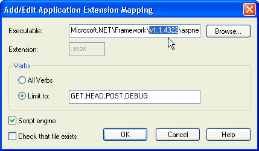