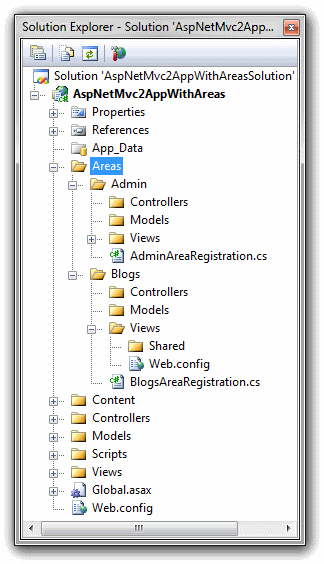

What’s New in ASP.NET MVC 2
====================
> This document describes new features and improvements introduced in ASP.NET MVC 2. This document is also available for [Download](https://download.microsoft.com/download/F/1/6/F16F9AF9-8EF4-4845-BC97-639791D5699C/WhatIsNewInMVC_2.pdf)

[Introduction](#_TOC1)   
[Upgrading an ASP.NET MVC 1.0 Project to ASP.NET MVC 2](#_TOC2)   
[New Features](#_TOC3)   
[Templated Helpers](#_TOC3_1)   
[Areas](#_TOC3_2)   
[Support for Asynchronous Controllers](#_TOC3_3)   
[Support for DefaultValueAttribute in Action-Method Parameters](#_TOC3_4)   
[Support for Binding Binary Data with Model Binders](#_TOC3_5)   
[ModelMetadata and ModelMetadataProvider Classes](#_TOC3_6)   
[Support for DataAnnotations Attributes](#_TOC3_7)   
[Model-Validator Providers](#_TOC3_8)   
[Client-Side Validation](#_TOC3_9)   
[New Code Snippets for Visual Studio 2010](#_TOC3_10)   
[New RequireHttpsAttribute Action Filter](#_TOC3_11)   
[Overriding the HTTP Method Verb](#_TOC3_12)   
[New HiddenInputAttribute Class for Templated Helpers](#_TOC3_13)   
[Html.ValidationSummary Helper Method Can Display Model-Level Errors](#_TOC3_14)   
[T4 Templates in Visual Studio Generate Code that is Specific to the Target Version of the .NET Framework](#_TOC3_15)[API Improvements](#_TOC4)  
[Breaking Changes](#_TOC5)  
[Disclaimer](#_TOC6)  

##   Introduction

ASP.NET MVC 2 builds on ASP.NET MVC 1.0 and introduces a large set of enhancements and features that are focused on increasing productivity. This release is compatible with ASP.NET MVC 1.0, so all your knowledge, skills, code, and extensions for ASP.NET MVC 1.0 continue to apply.

For more information about ASP.NET MVC, visit the following resources:

- [ASP.NET MVC documentation on MSDN](https://go.microsoft.com/fwlink/?LinkId=159758)
- [The ASP.NET MVC Web site](https://asp.net/mvc/)
- [The ASP.NET MVC forums](https://forums.asp.net/1146.aspx)

##   Upgrading an ASP.NET MVC 1.0 Project to ASP.NET MVC 2

ASP.NET MVC 2 can be installed side by side with ASP.NET MVC 1.0 on the same server, which gives application developers flexibility in choosing when to upgrade an ASP.NET MVC 1.0 application to ASP.NET MVC 2. For information on how to upgrade, see the document [Upgrading an ASP.NET MVC 1.0 Application to ASP.NET MVC 2](https://go.microsoft.com/fwlink/?LinkID=185459).

##   New Features

This section describes features that have been introduced in the MVC 2 release.

###   Templated Helpers

Templated helpers let you automatically associate HTML elements for edit and display with data types. For example, when data of type System.DateTime is displayed in a view, a date-picker UI element can be automatically rendered. This is similar to how field templates work in ASP.NET Dynamic Data. For more information, see [Using Templated Helpers to Display Data](https://go.microsoft.com/fwlink/?LinkId=159062) on the MSDN Web site.

###   Areas

Areas let you organize a large project into multiple smaller sections in order to manage the complexity of a large Web application. Each section ("area") typically represents a separate section of a large Web site and is used to group related sets of controllers and views. For more information, see [Walkthrough: Organizing an ASP.NET MVC Application by Areas](https://go.microsoft.com/fwlink/?LinkId=158978) on the MSDN Web site.

To create a new area, in Solution Explorer, right-click the project, click Add, and then click Area. This displays a dialog box that prompts you for the area name. After you enter the area name, Visual Studio adds a new area to the project.

The following figure shows an example layout for a project with two areas, Admin and Blogs.

When you create an area, Visual Studio adds a class that derives from AreaRegistration to each area. This class is required in order to register the area and its routes, as shown in the following example:

[!code-csharp[Main](what-is-new-in-aspnet-mvc/samples/sample1.cs)]

The default project template for ASP.NET MVC 2 includes a call to the RegisterAllAreas method in the code for the Global.asax file. This method registers each area in the project by looking for all types that derive from the AreaRegistration class, instantiating an instance of the type, and then calling the RegisterArea method on the instance. The following example shows how this is done.

[!code-csharp[Main](what-is-new-in-aspnet-mvc/samples/sample2.cs)]

If you do not specify the namespace in the RegisterArea method by calling the context.Namespaces.Add method, the namespace of the registration class is used by default.

###   Support for Asynchronous Controllers

ASP.NET MVC 2 now allows controllers to process requests asynchronously. This can lead to performance gains by allowing servers which frequently call blocking operations (like network requests) to call non-blocking counterparts instead. For more information, see the [Using an Asynchronous Controller in ASP.NET MVC](https://msdn.microsoft.com/en-us/library/ee728598(v=VS.100).aspx) topic on MSDN.

###   Support for DefaultValueAttribute in Action-Method Parameters

The System.ComponentModel.DefaultValueAttribute class allows a default value to be supplied for the argument parameter to an action method. For example, assume that the following default route is defined:

[!code-json[Main](what-is-new-in-aspnet-mvc/samples/sample3.json)]

Also assume that the following controller and action method is defined:

[!code-csharp[Main](what-is-new-in-aspnet-mvc/samples/sample4.cs)]

Any of the following request URLs will invoke the View action method that is defined in the preceding example.

- /Article/View/123
- /Article/View/123?page=1 (Effectively the same as the previous request)
- /Article/View/123?page=2

Without the DefaultValueAttribute attribute, the first URL from the preceding list would not work, because the page argument is a non-nullable value type whose value has not been provided.

If your code is written in Visual Basic 2010 or Visual C# 2010, you can use optional parameters instead of the DefaultValueAttribute attribute, as shown in the following example:

[!code-vb[Main](what-is-new-in-aspnet-mvc/samples/sample5.vb)]

###   Support for Binding Binary Data with Model Binders

There are two new overloads of the Html.Hidden helper that encode binary values as base-64-encoded strings:

[!code-csharp[Main](what-is-new-in-aspnet-mvc/samples/sample6.cs)]

A typical use is to embed a timestamp for an object in the view. For example, your application might include the following Product object:

[!code-csharp[Main](what-is-new-in-aspnet-mvc/samples/sample7.cs)]

An edit form can render the TimeStamp property in the form as shown in the following example:

[!code-aspx[Main](what-is-new-in-aspnet-mvc/samples/sample8.aspx)]

This markup renders a hidden input element with the timestamp value as a base-64-encoded string that resembles the following example:

[!code-html[Main](what-is-new-in-aspnet-mvc/samples/sample9.html)]

This form might be posted to an action method that has an argument of type Product, as shown in the following example:

[!code-csharp[Main](what-is-new-in-aspnet-mvc/samples/sample10.cs)]

In the action method, the TimeStamp property is populated correctly because the posted base-64-encoded string is converted to a byte array.

###   ModelMetadata and ModelMetadataProvider Classes

The ModelMetadataProvider class provides an abstraction for obtaining metadata for the model within a view. MVC 2 includes a default provider that makes available the metadata that is exposed by the attributes in the System.ComponentModel.DataAnnotations namespace. It is possible to create metadata providers that provide metadata from other data stores, such as databases or XML files.

The ViewDataDictionary class exposes a ModelMetadata object that contains the metadata that is extracted from the model by the ModelMetadataProvider class. This enables the templated helpers to consume this metadata and adjust their output accordingly.

For more information, see the documentation for the [ModelMetadata](https://msdn.microsoft.com/en-us/library/system.web.mvc.modelmetadataprovider(VS.100).aspx) and [ModelMetadataProvider](https://msdn.microsoft.com/en-us/library/system.web.mvc.modelmetadataprovider(VS.100).aspx) classes.

###   Support for DataAnnotations Attributes

ASP.NET MVC 2 supports using the RangeAttribute, RequiredAttribute, StringLengthAttribute, and RegexAttribute validation attributes (defined in the System.ComponentModel.DataAnnotations namespace) when you bind to a model in order to provide input validation.

For more information, see [How to: Validate Model Data Using DataAnnotations Attributes](https://go.microsoft.com/fwlink/?LinkId=159063) on the MSDN Web site. A sample project that illustrates the use of these attributes is available for download at [https://go.microsoft.com/fwlink/?LinkId=157753](https://go.microsoft.com/fwlink/?LinkId=157753).

###   Model-Validator Providers

The model-validation provider class represents an abstraction that provides validation logic for the model. ASP.NET MVC includes a default provider based on validation attributes that are included in the System.ComponentModel.DataAnnotations namespace. You can also create your own validation providers that define custom validation rules and custom mappings of validation rules to the model. For more information, see the documentation for the [ModelValidatorProvider](https://msdn.microsoft.com/en-us/library/system.web.mvc.ModelValidatorProvider(VS.100).aspx) class.

###   Client-Side Validation

The model-validator provider class exposes validation metadata to the browser in the form of JSON-serialized data that can be consumed by a client-side validation library. ASP.NET MVC 2 includes a client validation library and adapter that supports the DataAnnotations namespace validation attributes noted earlier. The provider class also enables you to use other client-validation libraries by writing an adapter that processes the JSON data and calls into the alternate library.

###   New Code Snippets for Visual Studio 2010

A set of HTML code snippets for ASP.NET MVC 2 is installed with Visual Studio 2010. To view a list of these snippets, in the Tools menu, select Code Snippets Manager. For the language, select HTML, and for location, select ASP.NET MVC 2. For more information about how to use code snippets, see the Visual Studio documentation.

###   New RequireHttpsAttribute Action Filter

ASP.NET MVC 2 includes a new RequireHttpsAttribute class that can be applied to action methods and controllers. By default, the filter redirects a non-SSL (HTTP) request to the SSL-enabled (HTTPS) equivalent.

###   Overriding the HTTP Method Verb

When you build a Web site by using the REST architectural style, HTTP verbs are used to determine which action to perform for a resource. REST requires that applications support the full range of common HTTP verbs, including GET, PUT, POST, and DELETE.

ASP.NET MVC 2 includes new attributes that you can apply to action methods and that feature compact syntax. These attributes enable ASP.NET MVC to select an action method based on the HTTP verb. In the following example, a POST request will call the first action method and a PUT request will call the second action method.

[!code-csharp[Main](what-is-new-in-aspnet-mvc/samples/sample11.cs)]

In earlier versions of ASP.NET MVC, these action methods required more verbose syntax, as shown in the following example:

[!code-csharp[Main](what-is-new-in-aspnet-mvc/samples/sample12.cs)]

Because browsers support only the GET and POST HTTP verbs, it is not possible to post to an action that requires a different verb. Thus it is not possible to natively support all RESTful requests.

However, to support RESTful requests during POST operations, ASP.NET MVC 2 introduces a new HttpMethodOverride HTML helper method. This method renders a hidden input element that causes the form to effectively emulate any HTTP method. For example, by using the HttpMethodOverride HTML helper method, you can have a form submission appear be a PUT or DELETE request. The behavior of HttpMethodOverride affects the following attributes:

- HttpPostAttribute
- HttpPutAttribute
- HttpGetAttribute
- HttpDeleteAttribute
- AcceptVerbsAttribute

The hidden input element has its name X-HTTP-Method-Override and its value set to the HTTP verb to emulate. The override value can also be specified in an HTTP header or in a query string value as a name/value pair.

The override can only be used when the real request is a POST request. The override value will be ignored for requests that use any other HTTP verb.

###   New HiddenInputAttribute Class for Templated Helpers

You can apply the new HiddenInputAttribute attribute to a model property to indicate whether a hidden input element should be rendered when displaying the model in an editor template. (The attribute sets an implicit UIHint value of HiddenInput). The attribute's DisplayValue property lets you specify whether the value is displayed in editor and display modes. When DisplayValue is set to false, nothing is displayed, not even the HTML markup that normally surrounds a field. The default value for DisplayValue is true.

You might use HiddenInputAttribute attribute in the following scenarios:

- When a view lets users edit the ID of an object and it is necessary to display the value as well as to provide a hidden input element that contains the old ID so that it can be passed back to the controller.
- When a view lets users edit a binary property that should never be displayed, such as a timestamp property. In that case, the value and surrounding HTML markup (such as the label and value) are not displayed.

The following example shows how to use the HiddenInputAttribute class.

[!code-csharp[Main](what-is-new-in-aspnet-mvc/samples/sample13.cs)]

When the attribute is set to true (or no parameter is specified), the following occurs:

- In display templates, a label is rendered and the value is displayed to the user.
- In editor templates, a label is rendered and the value is rendered in a hidden input element.

When the attribute is set to false, the following occurs:

- In display templates, nothing is rendered for that field.
- In editor templates, no label is rendered and the value is rendered in a hidden input element.

###   Html.ValidationSummary Helper Method Can Display Model-Level Errors

Instead of always displaying all validation errors, the Html.ValidationSummary helper method has a new option to display only model-level errors. This enables model-level errors to be displayed in the validation summary and field-specific errors to be displayed next to each field.

###   T4 Templates in Visual Studio Generate Code that is Specific to the Target Version of the .NET Framework

A new property is available to T4 files from the ASP.NET MVC T4 host that specifies the version of the .NET Framework that is used by the application. This enables T4 templates to generate code and markup that is specific to a version of the .NET Framework. In Visual Studio 2008, the value is always .NET 3.5. In Visual Studio 2010, the value is either .NET 3.5 or .NET 4.

##   API Improvements

This section describes changes to existing ASP.NET MVC types and members.

- Added a protected virtual CreateActionInvoker method in the Controller class. This method is invoked by the ActionInvoker property of Controller and allows for lazy instantiation of the invoker if no invoker is already set.
- Added a protected virtual HandleUnauthorizedRequest method in the AuthorizeAttribute class. This enables filters that derive from AuthorizeAttribute to control the behavior when authorization fails.
- Added an Add(string key, object value) method in the ValueProviderDictionary class. This enables you to use the dictionary initializer syntax for ValueProviderDictionary, as in the following example:

[!code-csharp[Main](what-is-new-in-aspnet-mvc/samples/sample14.cs)]

- Added a get\_object method in the Sys.Mvc.AjaxContext class. This is a JavaScript method that is similar to the get\_data method, but if the content type of the response is application/json, get\_object returns the JSON object.
- Added an ActionDescriptor property in the AuthorizationContext class.
- Added a UrlParameter.Optional token that can be used to work around problems when binding to a model that contains an ID property when the property is absent in a form post. For more detail, see the entry [ASP.NET MVC 2 Optional URL Parameters](http://haacked.com/archive/2010/02/12/asp-net-mvc-2-optional-url-parameters.aspx) on Phil Haack's blog.

##   Breaking Changes

The following changes might cause errors in existing ASP.NET MVC 1.0 applications.

#### Change in property validation behavior for classes that implement IDataErrorInfo

For model objects that use IDataErrorInfo to perform validation, every property is validated, regardless of whether a new value was set. In ASP.NET MVC 1.0, only properties that had new values set were validated. In ASP.NET MVC 2, the Error property of IDataErrorInfo is called only if all the property validators were successful.

#### IIS script mapping script is no longer available in the installer

The IIS script-mapping script is a command-line script that is used to configure script maps for IIS 6 and for IIS 7 in Classic mode. The script-mapping script is not needed if you use the Visual Studio Development Server or if you use IIS 7 in Integrated mode. The scripts are available as a separate unsupported download on the [ASP.NET CodePlex site](http://aspnet.codeplex.com/).

#### The Html.Substitute helper method in MVC Futures is no longer available

Due to changes in the rendering behavior of MVC view engines, the Html.Substitute helper method does not work and has been removed.

#### The IValueProvider interface replaces all uses of IDictionary

Every property or method argument that accepted IDictionary in MVC 1.0 now accepts IValueProvider. This change affects only applications that include custom value providers or custom model binders. Examples of properties and methods that are affected by this change include the following:

- The ValueProvider property of the ControllerBase and ModelBindingContext classes.
- The TryUpdateModel methods of the Controller class.

#### New CSS classes were added in the Site.css file

The Site.css file in the ASP.NET MVC project templates has been updated to include new styles used by the validation functionality and by the templated helpers.

#### Helpers now return an MvcHtmlString object

In order to take advantage of the new HTML-encoding expression syntax in ASP.NET 4, the return type for HTML helpers is now MvcHtmlString instead of a string. If you use ASP.NET MVC 2 and the new helpers on ASP.NET 3.5, you will not be able to take advantage of the HTML-encoding syntax; the new syntax is available only when you run ASP.NET MVC 2 on ASP.NET 4.

#### JsonResult now responds only to HTTP POST requests

In order to mitigate JSON hijacking attacks that have the potential for information disclosure, by default, the JsonResult class now responds only to HTTP POST requests. Ajax GET calls to action methods that return a JsonResult object should be changed to use POST instead. If necessary, you can override this behavior by setting the new JsonRequestBehavior property of JsonResult. For more information about the potential exploit, see the blog post [JSON Hijacking](http://haacked.com/archive/2009/06/25/json-hijacking.aspx) on Phil Haack's blog.

#### Model and ModelType property setters on ModelBindingContext are obsolete

A new settable ModelMetadata property has been added to the ModelBindingContext class. The new property encapsulates both the Model and the ModelType properties. Although the Model and ModelType properties are obsolete, for backward compatibility the property getters still work; they delegate to the ModelMetadata property to retrieve the value.

#### Changes to the DefaultControllerFactory class break custom controller factories that derive from it

The DefaultControllerFactory class was fixed by removing the RequestContext property. In place of this property, the request context instance is passed to the protected virtual GetControllerInstance and GetControllerType methods. This change affects custom controller factories that derive from DefaultControllerFactory.

Custom controller factories are often used to provide dependency injection for ASP.NET MVC applications. To update the custom controller factories to support ASP.NET MVC 2, change the method signature or signatures to match the new signatures, and use the request context parameter instead of the property.

#### "Area" is a now a reserved route-value key

The string "area" in Route values now has special meaning in ASP.NET MVC, in the same way that "controller" and "action" do. One implication is that if HTML helpers are supplied with a route-value dictionary containing "area", the helpers will no longer append "area" in the query string.

If you are using the Areas feature, make sure to not use {area} as part of your route URL.

##   Disclaimer

This is a preliminary document and may be changed substantially prior to final commercial release of the software described herein.

The information contained in this document represents the current view of Microsoft Corporation on the issues discussed as of the date of publication. Because Microsoft must respond to changing market conditions, it should not be interpreted to be a commitment on the part of Microsoft, and Microsoft cannot guarantee the accuracy of any information presented after the date of publication.

This White Paper is for informational purposes only. MICROSOFT MAKES NO WARRANTIES, EXPRESS, IMPLIED OR STATUTORY, AS TO THE INFORMATION IN THIS DOCUMENT.

Complying with all applicable copyright laws is the responsibility of the user. Without limiting the rights under copyright, no part of this document may be reproduced, stored in or introduced into a retrieval system, or transmitted in any form or by any means (electronic, mechanical, photocopying, recording, or otherwise), or for any purpose, without the express written permission of Microsoft Corporation.

Microsoft may have patents, patent applications, trademarks, copyrights, or other intellectual property rights covering subject matter in this document. Except as expressly provided in any written license agreement from Microsoft, the furnishing of this document does not give you any license to these patents, trademarks, copyrights, or other intellectual property.

Unless otherwise noted, the example companies, organizations, products, domain names, e-mail addresses, logos, people, places and events depicted herein are fictitious, and no association with any real company, organization, product, domain name, email address, logo, person, place or event is intended or should be inferred.

© 2010 Microsoft Corporation. All rights reserved.

Microsoft and Windows are either registered trademarks or trademarks of Microsoft Corporation in the United States and/or other countries.

The names of actual companies and products mentioned herein may be the trademarks of their respective owners.