What's New in ASP.NET 4.5 and Visual Studio 2012
====================
> This document describes new features and enhancements that are being introduced in ASP.NET 4.5. It also describes improvements being made for web development in Visual Studio 2012. This document was originally published on February 29, 2012.

- [ASP.NET Core Runtime and Framework](#_Toc318097372)

    - [Asynchronously Reading and Writing HTTP Requests and Responses](#_Toc318097373)
    - [Improvements to HttpRequest handling](#_Toc318097374)
    - [Asynchronously flushing a response](#_Toc318097375)
    - [Support for *await* and *Task*-Based Asynchronous Modules and Handlers](#_Toc318097376)
    - [Asynchronous HTTP modules](#_Toc318097377)
    - [Asynchronous HTTP handlers](#_Toc318097378)
    - [New ASP.NET Request Validation Features](#_Toc318097379)
    - [Deferred ("lazy") request validation](#_Toc318097380)
    - [Support for unvalidated requests](#_Toc318097381)
    - [AntiXSS Library](#_Toc318097382)
    - [Support for WebSockets Protocol](#_Toc318097383)
    - [Bundling and Minification](#_Toc318097384)
    - [Performance Improvements for Web Hosting](#_Toc_perf)

        - [Key Performance Factors](#_Toc_perf_1)
        - [Requirements for New Performance Features](#_Toc_perf_2)
        - [Sharing Common Assemblies](#_Toc_perf_3)
        - [Using multi-Core JIT compilation for faster startup](#_Toc_perf_4)
        - [Tuning garbage collection to optimize for memory](#_Toc_perf_5)
        - [Prefetching for web applications](#_Toc_perf_6)
- [ASP.NET Web Forms](#_Toc318097385)

    - [Strongly Typed Data Controls](#_Toc318097386)
    - [Model Binding](#_Toc318097387)

        - [Selecting data](#_Toc318097388)
        - [Value providers](#_Toc318097389)
        - [Filtering by values from a control](#_Toc318097390)
    - [HTML Encoded Data-Binding Expressions](#_Toc318097391)
    - [Unobtrusive Validation](#_Toc318097392)
    - [HTML5 Updates](#_Toc318097393)
- [ASP.NET MVC 4](#_Toc318097394)
- [ASP.NET Web Pages 2](#_Toc318097395)
- [Visual Studio 2012 Release Candidate](#_Toc318097396)

    - [Project Sharing Between Visual Studio 2010 and Visual Studio 2012 Release Candidate (Project Compatibility)](#project-compatibility)
    - [Configuration Changes in ASP.NET 4.5 Website Templates](#Configuration_Changes_In_ASPNET45_Website_Templates)
    - [Native Support in IIS 7 for ASP.NET Routing](#Native_Support_In_IIS7_For_ASPNET_Routine)
    - [HTML Editor](#_Toc318097397)

        - [Smart Tasks](#_Toc318097398)
        - [WAI-ARIA support](#_Toc318097399)
        - [New HTML5 snippets](#_Toc318097400)
        - [Extract to user control](#_Toc318097401)
        - [IntelliSense for code nuggets in attributes](#_Toc318097402)
        - [Automatic renaming of matching tag when you rename an opening or closing tag](#_Toc318097403)
        - [Event handler generation](#_Toc318097404)
        - [Smart indent](#_Toc318097405)
        - [Auto-reduce statement completion](#_Toc318097406)
    - [JavaScript Editor](#_Toc318097407)

        - [Code outlining](#_Toc318097408)
        - [Brace matching](#_Toc318097409)
        - [Go to Definition](#_Toc318097410)
        - [ECMAScript5 support](#_Toc318097411)
        - [DOM IntelliSense](#_Toc318097412)
        - [VSDOC signature overloads](#_Toc318097413)
        - [Implicit references](#_Toc318097414)
    - [CSS Editor](#_Toc318097415)

        - [Auto-reduce statement completion](#_Toc318097416)
        - [Hierarchical indentation.](#_Toc318097417)
        - [CSS hacks support](#_Toc318097418)
        - [Vendor specific schemas (-moz-,-webkit)](#_Toc318097419)
        - [Commenting and uncommenting support](#_Toc318097420)
        - [Color picker](#_Toc318097421)
        - [Snippets](#_Toc318097422)
        - [Custom regions](#_Toc318097423)
    - [Page Inspector](#_Toc318097424)
    - [Publishing](#_Toc318097425)

        - [Publish profiles](#_Toc318097426)
        - [ASP.NET precompilation and merge](#_Toc318097427)
- [IIS Express](#_Toc318097428)
- [Disclaimer](#_Toc318097429)

## ASP.NET Core Runtime and Framework

### Asynchronously Reading and Writing HTTP Requests and Responses

ASP.NET 4 introduced the ability to read an HTTP request entity as a stream using the *HttpRequest.GetBufferlessInputStream* method. This method provided streaming access to the request entity. However, it executed synchronously, which tied up a thread for the duration of a request.

ASP.NET 4.5 supports the ability to read streams asynchronously on an HTTP request entity, and the ability to flush asynchronously. ASP.NET 4.5 also gives you the ability to double-buffer an HTTP request entity, which provides easier integration with downstream HTTP handlers such as .aspx page handlers and ASP.NET MVC controllers.

#### Improvements to HttpRequest handling

The Stream reference returned by ASP.NET 4.5 from *HttpRequest.GetBufferlessInputStream* supports both synchronous and asynchronous read methods. The *Stream* object returned from *GetBufferlessInputStream* now implements both the BeginRead and EndRead methods. The asynchronous *Stream* methods let you asynchronously read the request entity in chunks, while ASP.NET releases the current thread between each iteration of an asynchronous read loop.

ASP.NET 4.5 has also added a companion method for reading the request entity in a buffered way: *HttpRequest.GetBufferedInputStream*. This new overload works like *GetBufferlessInputStream*, supporting both synchronous and asynchronous reads. However, as it reads, *GetBufferedInputStream* also copies the entity bytes into ASP.NET internal buffers so that downstream modules and handlers can still access the request entity. For example, if some upstream code in the pipeline has already read the request entity using *GetBufferedInputStream*, you can still use *HttpRequest.Form* or *HttpRequest.Files*. This lets you perform asynchronous processing on a request (for example, streaming a large file upload to a database), but still run .aspx pages and MVC ASP.NET controllers afterward.

#### Asynchronously flushing a response

Sending responses to an HTTP client can take considerable time when the client is far away or has a low-bandwidth connection. Normally ASP.NET buffers the response bytes as they are created by an application. ASP.NET then performs a single send operation of the accrued buffers at the very end of request processing.

If the buffered response is large (for example, streaming a large file to a client), you must periodically call *HttpResponse.Flush* to send buffered output to the client and keep memory usage under control. However, because *Flush* is a synchronous call, iteratively calling *Flush* still consumes a thread for the duration of potentially long-running requests.

ASP.NET 4.5 adds support for performing flushes asynchronously using the *BeginFlush* and *EndFlush* methods of the *HttpResponse* class. Using these methods, you can create asynchronous modules and asynchronous handlers that incrementally send data to a client without tying up operating-system threads. In between *BeginFlush* and *EndFlush* calls, ASP.NET releases the current thread. This substantially reduces the total number of active threads that are needed in order to support long-running HTTP downloads.

### Support for *await* and *Task* - Based Asynchronous Modules and Handlers

The .NET Framework 4 introduced an asynchronous programming concept referred to as a *task*. Tasks are represented by the *Task* type and related types in the *System.Threading.Tasks* namespace. The .NET Framework 4.5 builds on this with compiler enhancements that make working with *Task* objects simple. In the .NET Framework 4.5, the compilers support two new keywords: *await* and *async*. The *await* keyword is syntactical shorthand for indicating that a piece of code should asynchronously wait on some other piece of code. The *async* keyword represents a hint that you can use to mark methods as task-based asynchronous methods.

The combination of *await*, *async*, and the *Task* object makes it much easier for you to write asynchronous code in .NET 4.5. ASP.NET 4.5 supports these simplifications with new APIs that let you write asynchronous HTTP modules and asynchronous HTTP handlers using the new compiler enhancements.

#### Asynchronous HTTP modules

Suppose that you want to perform asynchronous work within a method that returns a *Task* object. The following code example defines an asynchronous method that makes an asynchronous call to download the Microsoft home page. Notice the use of the *async* keyword in the method signature and the *await* call to *DownloadStringTaskAsync*.

[!code-csharp[Main](whats-new-in-aspnet-45-and-visual-studio-2012/samples/sample1.cs)]

That's all you have to write — the .NET Framework will automatically handle unwinding the call stack while waiting for the download to complete, as well as automatically restoring the call stack after the download is done.

Now suppose that you want to use this asynchronous method in an asynchronous ASP.NET HTTP module. ASP.NET 4.5 includes a helper method (*EventHandlerTaskAsyncHelper*) and a new delegate type (*TaskEventHandler*) that you can use to integrate task-based asynchronous methods with the older asynchronous programming model exposed by the ASP.NET HTTP pipeline. This example shows how:

[!code-csharp[Main](whats-new-in-aspnet-45-and-visual-studio-2012/samples/sample2.cs)]

#### Asynchronous HTTP handlers

The traditional approach to writing asynchronous handlers in ASP.NET is to implement the *IHttpAsyncHandler* interface. ASP.NET 4.5 introduces the *HttpTaskAsyncHandler* asynchronous base type that you can derive from, which makes it much easier to write asynchronous handlers.

The *HttpTaskAsyncHandler* type is abstract and requires you to override the *ProcessRequestAsync* method. Internally ASP.NET takes care of integrating the return signature (a *Task* object) of *ProcessRequestAsync* with the older asynchronous programming model used by the ASP.NET pipeline.

The following example shows how you can use *Task* and *await* as part of the implementation of an asynchronous HTTP handler:

[!code-csharp[Main](whats-new-in-aspnet-45-and-visual-studio-2012/samples/sample3.cs)]

### New ASP.NET Request Validation Features

By default, ASP.NET performs request validation — it examines requests to look for markup or script in fields, headers, cookies, and so on. If any is detected, ASP.NET throws an exception. This acts as a first line of defense against potential cross-site scripting attacks.

ASP.NET 4.5 makes it easy to selectively read unvalidated request data. ASP.NET 4.5 also integrates the popular AntiXSS library, which was formerly an external library.

Developers have frequently asked for the ability to selectively turn off request validation for their applications. For example, if your application is forum software, you might want to allow users to submit HTML-formatted forum posts and comments, but still make sure that request validation is checking everything else.

ASP.NET 4.5 introduces two features that make it easy for you to selectively work with unvalidated input: deferred ("lazy") request validation and access to unvalidated request data.

#### Deferred ("lazy") request validation

In ASP.NET 4.5, by default all request data is subject to request validation. However, you can configure the application to defer request validation until you actually access request data. (This is sometimes referred to as lazy request validation, based on terms like lazy loading for certain data scenarios.) You can configure the application to use deferred validation in the Web.config file by setting the *requestValidationMode* attribute to 4.5 in the *httpRUntime* element, as in the following example:

[!code-xml[Main](whats-new-in-aspnet-45-and-visual-studio-2012/samples/sample4.xml)]

When request validation mode is set to 4.5, request validation is triggered only for a specific request value and only when your code accesses that value. For example, if your code gets the value of Request.Form["forum\_post"], request validation is invoked only for that element in the form collection. None of the other elements in the *Form* collection are validated. In previous versions of ASP.NET, request validation was triggered for the entire request collection when any element in the collection was accessed. The new behavior makes it easier for different application components to look at different pieces of request data without triggering request validation on other pieces.

#### Support for unvalidated requests

Deferred request validation alone doesn't solve the problem of selectively bypassing request validation. The call to Request.Form["forum\_post"] still triggers request validation for that specific request value. However, you might want to access this field without triggering validation because you want to allow markup in that field.

To allow this, ASP.NET 4.5 now supports unvalidated access to request data. ASP.NET 4.5 includes a new *Unvalidated* collection property in the *HttpRequest* class. This collection provides access to all of the common values of request data, like *Form*, *QueryString*, *Cookies*, and *Url*.

Using the forum example, to be able to read unvalidated request data, you first need to configure the application to use the new request validation mode:

[!code-xml[Main](whats-new-in-aspnet-45-and-visual-studio-2012/samples/sample5.xml)]

You can then use the *HttpRequest.Unvalidated* property to read the unvalidated form value:

[!code-csharp[Main](whats-new-in-aspnet-45-and-visual-studio-2012/samples/sample6.cs)]

> [!WARNING]
> Security - *Use unvalidated request data with care!* ASP.NET 4.5 added the unvalidated request properties and collections to make it easier for you to access very specific unvalidated request data. However, you must still perform custom validation on the raw request data to ensure that dangerous text is not rendered to users.

### AntiXSS Library

Due to the popularity of the Microsoft AntiXSS Library, ASP.NET 4.5 now incorporates core encoding routines from version 4.0 of that library.

The encoding routines are implemented by the *AntiXssEncoder* type in the new *System.Web.Security.AntiXss* namespace. You can use the *AntiXssEncoder* type directly by calling any of the static encoding methods that are implemented in the type. However, the easiest approach for using the new anti-XSS routines is to configure an ASP.NET application to use the *AntiXssEncoder* class by default. To do this, add the following attribute to the Web.config file:

[!code-xml[Main](whats-new-in-aspnet-45-and-visual-studio-2012/samples/sample7.xml)]

When the *encoderType* attribute is set to use the *AntiXssEncoder* type, all output encoding in ASP.NET automatically uses the new encoding routines.

These are the portions of the external AntiXSS library that have been incorporated into ASP.NET 4.5:

- *HtmlEncode*, *HtmlFormUrlEncode*, and *HtmlAttributeEncode*
- *XmlAttributeEncode* and *XmlEncode*
- *UrlEncode* and *UrlPathEncode* (new)
- *CssEncode*

### Support for WebSockets Protocol

WebSockets protocol is a standards-based network protocol that defines how to establish secure, real-time bidirectional communications between a client and a server over HTTP. Microsoft has worked with both the IETF and W3C standards bodies to help define the protocol. The WebSockets protocol is supported by any client (not just browsers), with Microsoft investing substantial resources supporting WebSockets protocol on both client and mobile operating systems.

WebSockets protocol makes it much easier to create long-running data transfers between a client and a server. For example, writing a chat application is much easier because you can establish a true long-running connection between a client and a server. You do not have to resort to workarounds like periodic polling or HTTP long-polling to simulate the behavior of a socket.

ASP.NET 4.5 and IIS 8 include low-level WebSockets support, enabling ASP.NET developers to use managed APIs for asynchronously reading and writing both string and binary data on a WebSockets object. For ASP.NET 4.5, there is a new *System.Web.WebSockets* namespace that contains types for working with WebSockets protocol.

A browser client establishes a WebSockets connection by creating a DOM *WebSocket* object that points to a URL in an ASP.NET application, as in the following example:

[!code-csharp[Main](whats-new-in-aspnet-45-and-visual-studio-2012/samples/sample8.cs)]

You can create WebSockets endpoints in ASP.NET using any kind of module or handler. In the previous example, an .ashx file was used, because .ashx files are a quick way to create a handler.

According to the WebSockets protocol, an ASP.NET application accepts a client's WebSockets request by indicating that the request should be upgraded from an HTTP GET request to a WebSockets request. Here's an example:

[!code-csharp[Main](whats-new-in-aspnet-45-and-visual-studio-2012/samples/sample9.cs)]

The *AcceptWebSocketRequest* method accepts a function delegate because ASP.NET unwinds the current HTTP request and then transfers control to the function delegate. Conceptually this approach is similar to how you use *System.Threading.Thread*, where you define a thread-start delegate in which background work is performed.

After ASP.NET and the client have successfully completed a WebSockets handshake, ASP.NET calls your delegate and the WebSockets application starts running. The following code example shows a simple echo application that uses the built-in WebSockets support in ASP.NET:

[!code-csharp[Main](whats-new-in-aspnet-45-and-visual-studio-2012/samples/sample10.cs)]

The support in .NET 4.5 for the *await* keyword and asynchronous task-based operations is a natural fit for writing WebSockets applications. The code example shows that a WebSockets request runs completely asynchronously inside ASP.NET. The application waits asynchronously for a message to be sent from a client by calling *await socket.ReceiveAsync*. Similarly, you can send an asynchronous message to a client by calling *await socket.SendAsync*.

In the browser, an application receives WebSockets messages through an *onmessage* function. To send a message from a browser, you call the *send* method of the *WebSocket* DOM type, as shown in this example:

[!code-csharp[Main](whats-new-in-aspnet-45-and-visual-studio-2012/samples/sample11.cs)]

In the future, we might release updates to this functionality that abstract away some of the low-level coding that is required in this release for WebSockets applications.

### Bundling and Minification

Bundling lets you combine individual JavaScript and CSS files into a bundle that can be treated like a single file. Minification condenses JavaScript and CSS files by removing whitespace and other characters that are not required. These features work with Web Forms, ASP.NET MVC, and Web Pages.

Bundles are created using the Bundle class or one of its child classes, ScriptBundle and StyleBundle. After configuring an instance of a bundle, the bundle is made available to incoming requests by simply adding it to a global BundleCollection instance. In the default templates, bundle configuration is performed in a BundleConfig file. This default configuration creates bundles for all of the core scripts and css files used by the templates.

Bundles are referenced from within views by using one of a couple possible helper methods. In order to support rendering different markup for a bundle when in debug vs. release mode, the ScriptBundle and StyleBundle classes have the helper method, Render. When in debug mode, Render will generate markup for each resource in the bundle. When in release mode, Render will generate a single markup element for the entire bundle. Toggling between debug and release mode can be accomplished by modifying the debug attribute of the compilation element in web.config as shown below:

[!code-xml[Main](whats-new-in-aspnet-45-and-visual-studio-2012/samples/sample12.xml)]

Additionally, enabling or disabling optimization can be set directly via the BundleTable.EnableOptimizations property.

[!code-csharp[Main](whats-new-in-aspnet-45-and-visual-studio-2012/samples/sample13.cs)]

When files are bundled, they are first sorted alphabetically (the way they are displayed in **Solution Explorer**). They are then organized so that known libraries and their custom extensions (such as jQuery, MooTools, and Dojo) are loaded first. For example, the final order for the bundling of the Scripts folder as shown above will be:

1. jquery-1.6.2.js
2. jquery-ui.js
3. jquery.tools.js
4. a.js

CSS files are also sorted alphabetically and then reorganized so that reset.css and normalize.css come before any other file. The final sorting of the bundling of the Styles folder shown above will be this:

1. reset.css
2. content.css
3. forms.css
4. globals.css
5. menu.css
6. styles.css

### Performance Improvements for Web Hosting

The .NET Framework 4.5 and Windows 8 introduce features that can help you achieve a significant performance boost for web-server workloads. This includes a reduction (up to 35%) in both startup time and in the memory footprint of web hosting sites that use ASP.NET.

#### Key performance factors

Ideally, all websites should be active and in memory to assure quick response to the next request, whenever it comes. Factors that can affect site responsiveness include:

- The time it takes for a site to restart after an app pool recycles. This is the time it takes to launch a web server process for the site when the site assemblies are no longer in memory. (The platform assemblies are still in memory, since they are used by other sites.) This situation is referred to as "cold site, warm framework startup" or just "cold site startup."
- How much memory the site occupies. Terms for this are "per-site memory consumption" or "unshared working set."

The new performance improvements focus on both of these factors.

#### Requirements for New Performance Features

The requirements for the new features can be broken down into these categories:

- Improvements that run on the .NET Framework 4.
- Improvements that require the .NET Framework 4.5 but can run on any version of Windows.
- Improvements that are available only with .NET Framework 4.5 running on Windows 8.

Performance increases with each level of improvement that you are able to enable.

Some of the .NET Framework 4.5 improvements take advantage of broader performance features that apply to other scenarios as well.

#### Sharing Common Assemblies

**Requirement**: .NET Framework 4 and Visual Studio 11 Developer Preview SDK

Different sites on a server often use the same helper assemblies (for example, assemblies from a starter kit or sample application). Each site has its own copy of these assemblies in its Bin directory. Even though the object code for the assemblies is identical, they're physically separate assemblies, so each assembly has to be read separately during cold site startup and kept separately in memory.

The new interning functionality solves this inefficiency and reduces both RAM requirements and load time. Interning lets Windows keep a single copy of each assembly in the file system, and individual assemblies in the site Bin folders are replaced with symbolic links to the single copy. If an individual site needs a distinct version of the assembly, the symbolic link is replaced by the new version of the assembly, and only that site is affected.

Sharing assemblies using symbolic links requires a new tool named aspnet\_intern.exe, which lets you create and manage the store of interned assemblies. It is provided as a part of the Visual Studio 11 Developer Preview SDK. (However, it will work on a system that has only the .NET Framework 4 installed, assuming you have installed the latest [update](https://support.microsoft.com/kb/2468871).)

To make sure all eligible assemblies have been interned, you run aspnet\_intern.exe periodically (for example, once a week as a scheduled task). A typical use is as follows:

[!code-console[Main](whats-new-in-aspnet-45-and-visual-studio-2012/samples/sample14.cmd)]

To see all options, run the tool with no arguments.

#### Using multi-Core JIT compilation for faster startup

**Requirement**: .NET Framework 4.5

For a cold site startup, not only do assemblies have to be read from disk, but the site must be JIT-compiled. For a complex site, this can add significant delays. A new general-purpose technique in the .NET Framework 4.5 reduces these delays by spreading JIT-compilation across available processor cores. It does this as much and as early as possible by using information gathered during previous launches of the site. This functionality implemented by the [System.Runtime.ProfileOptimization.StartProfile](https://msdn.microsoft.com/en-us/library/system.runtime.profileoptimization.startprofile(VS.110).aspx) method.

JIT-compiling using multiple cores is enabled by default in ASP.NET, so you do not need to do anything to take advantage of this feature. If you want to disable this feature, make the following setting in the Web.config file:

[!code-xml[Main](whats-new-in-aspnet-45-and-visual-studio-2012/samples/sample15.xml)]

#### Tuning garbage collection to optimize for memory

**Requirement**: .NET Framework 4.5

Once a site is running, its use of the garbage-collector (GC) heap can be a significant factor in its memory consumption. Like any garbage collector, the .NET Framework GC makes tradeoffs between CPU time (frequency and significance of collections) and memory consumption (extra space that is used for new, freed, or free-able objects). For previous releases, we have provided guidance on how to configure the GC to achieve the right balance (for example, see [ASP.NET 2.0/3.5 Shared Hosting Configuration](https://www.iis.net/learn/web-hosting/web-server-for-shared-hosting/aspnet-20-35-shared-hosting-configuration)).

For the .NET Framework 4.5, instead of multiple standalone settings, a workload-defined configuration setting is available that enables all of the previously recommended GC settings as well as new tuning that delivers additional performance for the per-site working set.

To enable GC memory tuning, add the following setting to the Windows\Microsoft.NET\Framework\v4.0.30319\aspnet.config file:

[!code-xml[Main](whats-new-in-aspnet-45-and-visual-studio-2012/samples/sample16.xml)]

(If you're familiar with the previous guidance for changes to aspnet.config, note that this setting replaces the old settings — for example, there is no need to set gcServer, gcConcurrent, etc. You do not have to remove the old settings.)

#### Prefetching for web applications

**Requirement**: .NET Framework 4.5 running on Windows 8

For several releases, Windows has included a technology known as the [prefetcher](http://en.wikipedia.org/wiki/Prefetcher) that reduces the disk-read cost of application startup. Because cold startup is a problem predominantly for client applications, this technology has not been included in Windows Server, which includes only components that are essential to a server. Prefetching is now available in the latest version of Windows Server, where it can optimize the launch of individual websites.

For Windows Server, the prefetcher is not enabled by default. To enable and configure the prefetcher for high-density web hosting, run the following set of commands at the command line:

[!code-console[Main](whats-new-in-aspnet-45-and-visual-studio-2012/samples/sample17.cmd)]

Then, to integrate the prefetcher with ASP.NET applications, add the following to the Web.config file:

[!code-xml[Main](whats-new-in-aspnet-45-and-visual-studio-2012/samples/sample18.xml)]

## ASP.NET Web Forms

### Strongly Typed Data Controls

In ASP.NET 4.5, Web Forms includes some improvements for working with data. The first improvement is strongly typed data controls. For Web Forms controls in previous versions of ASP.NET, you display a data-bound value using *Eval* and a data-binding expression:

[!code-aspx[Main](whats-new-in-aspnet-45-and-visual-studio-2012/samples/sample19.aspx)]

For two-way data binding, you use *Bind*:

[!code-aspx[Main](whats-new-in-aspnet-45-and-visual-studio-2012/samples/sample20.aspx)]

At run time, these calls use reflection to read the value of the specified member and then display the result in the markup. This approach makes it easy to data bind against arbitrary, unshaped data.

However, data-binding expressions like this don't support features like IntelliSense for member names, navigation (like Go To Definition), or compile-time checking for these names.

To address this issue, ASP.NET 4.5 adds the ability to declare the data type of the data that a control is bound to. You do this using the new *ItemType* property. When you set this property, two new typed variables are available in the scope of data-binding expressions: *Item* and *BindItem*. Because the variables are strongly typed, you get the full benefits of the Visual Studio development experience.

For two-way data-binding expressions, use the *BindItem* variable:

[!code-aspx[Main](whats-new-in-aspnet-45-and-visual-studio-2012/samples/sample21.aspx)]

Most controls in the ASP.NET Web Forms framework that support data binding have been updated to support the *ItemType* property.

### Model Binding

Model binding extends data binding in ASP.NET Web Forms controls to work with code-focused data access. It incorporates concepts from the *ObjectDataSource* control and from model binding in ASP.NET MVC.

#### Selecting data

To configure a data control to use model binding to select data, you set the control's *SelectMethod* property to the name of a method in the page's code. The data control calls the method at the appropriate time in the page life cycle and automatically binds the returned data. There's no need to explicitly call the *DataBind* method.

In the following example, the *GridView* control is configured to use a method named *GetCategories*:

[!code-aspx[Main](whats-new-in-aspnet-45-and-visual-studio-2012/samples/sample22.aspx)]

You create the *GetCategories* method in the page's code. For a simple select operation, the method needs no parameters and should return an *IEnumerable* or *IQueryable* object. If the new *ItemType* property is set (which enables strongly typed data-binding expressions, as explained under [Strongly Typed Data Controls](#_Toc318097386) earlier), the generic versions of these interfaces should be returned — *IEnumerable&lt;T&gt;* or *IQueryable&lt;T&gt;*, with the *T* parameter matching the type of the *ItemType* property (for example, *IQueryable&lt;Category&gt;*).

The following example shows the code for a *GetCategories* method. This example uses the Entity Framework Code First model with the Northwind sample database. The code makes sure that the query returns details of the related products for each category by way of the *Include* method. (This ensures that the *TemplateField* element in the markup displays the count of products in each category without requiring an [n+1 select](http://stackoverflow.com/questions/97197/what-is-the-n1-selects-problem).)

[!code-csharp[Main](whats-new-in-aspnet-45-and-visual-studio-2012/samples/sample23.cs)]

When the page runs, the *GridView* control calls the *GetCategories* method automatically and renders the returned data using the configured fields:

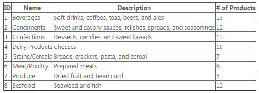

Because the select method returns an *IQueryable* object, the *GridView* control can further manipulate the query before executing it. For example, the *GridView* control can add query expressions for sorting and paging to the returned *IQueryable* object before it is executed, so that those operations are performed by the underlying LINQ provider. In this case, Entity Framework will ensure those operations are performed in the database.

The following example shows the *GridView* control modified to allow sorting and paging:

[!code-aspx[Main](whats-new-in-aspnet-45-and-visual-studio-2012/samples/sample24.aspx)]

Now when the page runs, the control can make sure that only the current page of data is displayed and that it's ordered by the selected column:

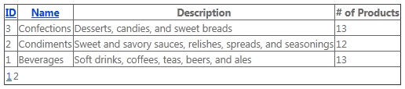

To filter the returned data, parameters have to be added to the select method. These parameters will be populated by the model binding at run time, and you can use them to alter the query before returning the data.

For example, assume that you want to let users filter products by entering a keyword in the query string. You can add a parameter to the method and update the code to use the parameter value:

[!code-csharp[Main](whats-new-in-aspnet-45-and-visual-studio-2012/samples/sample25.cs)]

This code includes a *Where* expression if a value is provided for *keyword* and then returns the query results.

#### Value providers

The previous example was not specific about where the value for the *keyword* parameter was coming from. To indicate this information, you can use a parameter attribute. For this example, you can use the *QueryStringAttribute* class that's in the *System.Web.ModelBinding* namespace:

[!code-csharp[Main](whats-new-in-aspnet-45-and-visual-studio-2012/samples/sample26.cs)]

This instructs model binding to try to bind a value from the query string to the *keyword* parameter at run time. (This might involve performing type conversion, although it doesn't in this case.) If a value cannot be provided and the type is non-nullable, an exception is thrown.

The sources of values for these methods are referred to as value providers, and the parameter attributes that indicate which value provider to use are referred to as value provider attributes. Web Forms will include value providers and corresponding attributes for all of the typical sources of user input in a Web Forms application, such as the query string, cookies, form values, controls, view state, session state, and profile properties. You can also write custom value providers.

By default, the parameter name is used as the key to find a value in the value provider collection. In the example, the code will look for a query-string value named keyword (for example, ~/default.aspx?keyword=chef). You can specify a custom key by passing it as an argument to the parameter attribute. For example, to use the value of the query-string variable named q, you could do this:

[!code-csharp[Main](whats-new-in-aspnet-45-and-visual-studio-2012/samples/sample27.cs)]

If this method is in the page's code, users can filter the results by passing a keyword using the query string:

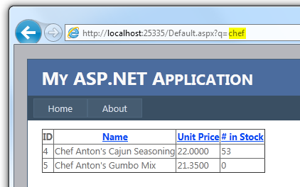

Model binding accomplishes many tasks that you would otherwise have to code by hand: reading the value, checking for a null value, attempting to convert it to the appropriate type, checking whether the conversion was successful, and finally, using the value in the query. Model binding results in far less code and in the ability to reuse the functionality throughout your application.

#### Filtering by values from a control

Suppose you want to extend the example to let the user choose a filter value from a drop-down list. Add the following drop-down list to the markup and configure it to get its data from another method using the *SelectMethod* property:

[!code-aspx[Main](whats-new-in-aspnet-45-and-visual-studio-2012/samples/sample28.aspx)]

Typically you would also add an *EmptyDataTemplate* element to the *GridView* control so that the control will display a message if no matching products are found:

[!code-aspx[Main](whats-new-in-aspnet-45-and-visual-studio-2012/samples/sample29.aspx)]

In the page code, add the new select method for the drop-down list:

[!code-csharp[Main](whats-new-in-aspnet-45-and-visual-studio-2012/samples/sample30.cs)]

Finally, update the *GetProducts* select method to take a new parameter that contains the ID of the selected category from the drop-down list:

[!code-csharp[Main](whats-new-in-aspnet-45-and-visual-studio-2012/samples/sample31.cs)]

Now when the page runs, users can select a category from the drop-down list, and the *GridView* control is automatically re-bound to show the filtered data. This is possible because model binding tracks the values of parameters for select methods and detects whether any parameter value has changed after a postback. If so, model binding forces the associated data control to re-bind to the data.

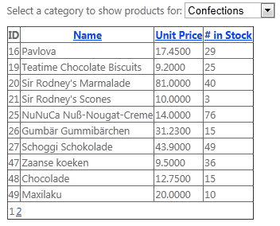

### HTML Encoded Data-Binding Expressions

You can now HTML-encode the result of data-binding expressions. Add a colon (:) to the end of the &lt;%# prefix that marks the data-binding expression:

[!code-aspx[Main](whats-new-in-aspnet-45-and-visual-studio-2012/samples/sample32.aspx)]

### Unobtrusive Validation

You can now configure the built-in validator controls to use unobtrusive JavaScript for client-side validation logic. This significantly reduces the amount of JavaScript rendered inline in the page markup and reduces the overall page size. You can configure unobtrusive JavaScript for validator controls in any of these ways:

- Globally by adding the following setting to the *&lt;appSettings&gt;* element in the Web.config file: 

    [!code-xml[Main](whats-new-in-aspnet-45-and-visual-studio-2012/samples/sample33.xml)]
- Globally by setting the static *System.Web.UI.ValidationSettings.UnobtrusiveValidationMode* property to *UnobtrusiveValidationMode.WebForms* (typically in the *Application\_Start* method in the Global.asax file).
- Individually for a page by setting the new *UnobtrusiveValidationMode* property of the *Page* class to *UnobtrusiveValidationMode.WebForms*.

### HTML5 Updates

Some improvements have been made to Web Forms server controls to take advantage of new features of HTML5:

- The *TextMode* property of the *TextBox* control has been updated to support the new HTML5 input types like *email*, *datetime*, and so on.
- The *FileUpload* control now supports multiple file uploads from browsers that support this HTML5 feature.
- Validator controls now support validating HTML5 input elements.
- New HTML5 elements that have attributes that represent a URL now support runat="server". As a result, you can use ASP.NET conventions in URL paths, like the ~ operator to represent the application root (for example, &lt;video runat="server" src="~/myVideo.wmv" /&gt;).
- The *UpdatePanel* control has been fixed to support posting HTML5 input fields.

## ASP.NET MVC 4

ASP.NET MVC 4 Beta is now included with Visual Studio 11 Beta. ASP.NET MVC is a framework for developing highly testable and maintainable Web applications by leveraging the Model-View-Controller (MVC) pattern. ASP.NET MVC 4 makes it easy to build applications for the mobile Web and includes ASP.NET Web API, which helps you build HTTP services that can reach any device. For more information, see the [ASP.NET MVC 4 Release Notes](mvc4-release-notes.md).

## ASP.NET Web Pages 2

New features include the following:

- New and updated site templates.
- Adding server-side and client-side validation using the *Validation* helper.
- The ability to register scripts using an assets manager.
- Enabling logins from Facebook and other sites using OAuth and OpenID.
- Adding maps using the *Maps* helper.
- Running Web Pages applications side-by-side.
- Rendering pages for mobile devices.

For more information about these features and full-page code examples, see [The Top Features in Web Pages 2 Beta](https://go.microsoft.com/fwlink/?LinkID=227824).

## Visual Web Developer 11 Beta

This section provides information about improvements for web development in Visual Web Developer 11 Beta and Visual Studio 2012 Release Candidate.

### Project Sharing Between Visual Studio 2010 and Visual Studio 2012 Release Candidate (Project Compatibility)

Until Visual Studio 2012 Release Candidate, opening an existing project in a newer version of Visual Studio launched the Conversion Wizard. This forced an upgrade of the content (assets) of a project and solution to new formats that were not backward compatible. Therefore, after the conversion you could not open the project in the older version of Visual Studio.

Many customers have told us that this was not the right approach. In Visual Studio 11 Beta, we now support sharing projects and solutions with Visual Studio 2010 SP1. This means that if you open a 2010 project in Visual Studio 2012 Release Candidate, you will still be able to open the project in Visual Studio 2010 SP1.

> [!NOTE]
> A few types of projects cannot be shared between Visual Studio 2010 SP1 and Visual Studio 2012 Release Candidate. These include some older projects (such as ASP.NET MVC 2 projects) or projects for special purposes (such as Setup projects).

When you open a Visual Studio 2010 SP1 Web project for the first time in Visual Studio 11 Beta, the following properties are added to the project file:

- FileUpgradeFlags
- UpgradeBackupLocation
- OldToolsVersion
- VisualStudioVersion
- VSToolsPath

FileUpgradeFlags, UpgradeBackupLocation, and OldToolsVersion are used by the process that upgrades the project file. They have no impact on working with the project in Visual Studio 2010.

VisualStudioVersion is a new property used by MSBuild 4.5 that indicates the version of Visual Studio for the current project. Because this property didn't exist in MSBuild 4.0 (the version of MSBuild that Visual Studio 2010 SP1 uses), we inject a default value into the project file.

The VSToolsPath property is used to determine the correct .targets file to import from the path represented by the MSBuildExtensionsPath32 setting.

There are also some changes related to Import elements. These changes are required in order to support compatibility between both versions of Visual Studio.

> [!NOTE]
> If a project is being shared between Visual Studio 2010 SP1 and Visual Studio 11 Beta on two different computers, and if the project includes a local database in the App\_Data folder, you must make sure that the version of SQL Server used by the database is installed on both computers.

### Configuration Changes in ASP.NET 4.5 Website Templates

The following changes have been made to the default *Web.config* file for site that are created using website templates in Visual Studio 2012 Release Candidate:

- In the `<httpRuntime>` element, the `encoderType` attribute is now set by default to use the AntiXSS types that were added to ASP.NET. For details, see [AntiXSS Library](#_Toc318097382).
- Also in the `<httpRuntime>` element, the `requestValidationMode` attribute is set to "4.5". This means that by default, request validation is configured to use deferred ("lazy") validation. For details, see [New ASP.NET Request Validation Features](#_Toc318097379).
- The `<modules>` element of the `<system.webServer>` section does not contain a `runAllManagedModulesForAllRequests` attribute. (Its default value is false.) This means that if you are using a version of IIS 7 that has not been updated to SP1, you might have issues with routing in a new site. For more information, see [Native Support in IIS 7 for ASP.NET Routing](#Native_Support_In_IIS7_For_ASPNET_Routine).

These changes do not affect existing applications. However, they might represent a difference in behavior between existing websites and new websites that you create for ASP.NET 4.5 using the new templates.

### Native Support in IIS 7 for ASP.NET Routing

This is not a change to ASP.NET as such, but a change in templates for new website projects that can affect you if you are working a version of IIS 7 that has not had the SP1 update applied.

In ASP.NET, you can add the following configuration setting to applications in order to support routing:

[!code-xml[Main](whats-new-in-aspnet-45-and-visual-studio-2012/samples/sample34.xml?highlight=3)]

When **runAllManagedModulesForAllRequests** is true, a URL like `http://mysite/myapp/home` goes to ASP.NET, even though there is no *.aspx*, *.mvc*, or similar extension on the URL.

An update that was made to IIS 7 makes the **runAllManagedModulesForAllRequests** setting unnecessary and supports ASP.NET routing natively. (For information about the update, see the Microsoft Support article [An update is available that enables certain IIS 7.0 or IIS 7.5 handlers to handle requests whose URLs do not end with a period](https://support.microsoft.com/kb/980368).)

If your website is running on IIS 7 and if IIS has been updated, you do not need to set **runAllManagedModulesForAllRequests** to true. In fact, setting it to true is not recommended, because it adds unnecessary processing overhead to request. When this setting is true, all requests, including those for *.htm*, *.jpg*, and other static files, also go through the ASP.NET request pipeline.

If you create a new ASP.NET 4.5 website using the templates that are provided in Visual Studio 2012 RC, the configuration for the website does not include the **runAllManagedModulesForAllRequests** setting. This means that by default the setting is false.

If you then run the website on Windows 7 without SP1 installed, IIS 7 will not include the required update. As a consequence, routing will not work and you will see errors. If you have a problem where routing does not work, you can do either the following:

- Update Windows 7 to SP1, which will add the update to IIS 7.
- Install the update that's described in the Microsoft Support article listed previously.
- Set **runAllManagedModulesForAllRequests** to true in that website's Web.config file. Note that this will add some overhead to requests.

### HTML Editor

#### Smart Tasks

In Design view, complex properties of server controls often have associated dialog boxes and wizards to make it easy to set them. For example, you can use a special dialog box to add a data source to a *Repeater* control or add columns to a *GridView* control.

However, this type of UI help for complex properties has not been available in Source view. Therefore, Visual Studio 11 introduces Smart Tasks for Source view. Smart Tasks are context-aware shortcuts for commonly used features in the C# and Visual Basic editors.

For ASP.NET Web Forms controls, Smart Tasks appear on server tags as a small glyph when the insertion point is inside the element:

The Smart Task expands when you click the glyph or press CTRL+. (dot), just as in the code editors. It then displays shortcuts that are similar to the Smart Tasks in Design view.

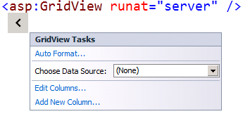

For example, the Smart Task in the previous illustration shows the GridView Tasks options. If you choose Edit Columns, the following dialog box is displayed:

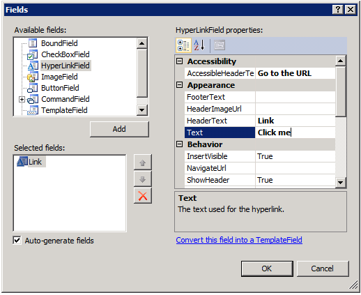

Filling in the dialog box sets the same properties you can set in Design view. When you click OK, the markup for the control is updated with the new settings:

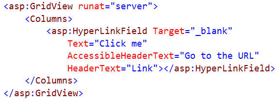

#### WAI-ARIA support

Writing accessible websites is becoming increasingly important. The [WAI-ARIA accessibility standard](http://www.w3.org/WAI/intro/aria) defines how developers should write accessible websites. This standard is now fully supported in Visual Studio.

For example, the *role* attribute now has full IntelliSense:

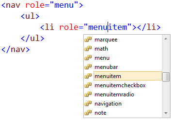

The WAI-ARIA standard also introduces attributes that are prefixed with *aria-* that let you add semantics to an HTML5 document. Visual Studio also fully supports these *aria-* attributes:

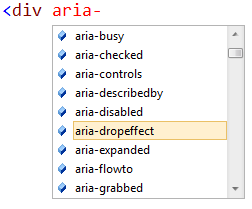 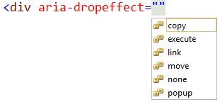

#### New HTML5 snippets

To make it faster and easier to write commonly used HTML5 markup, Visual Studio includes a number of snippets. An example is the video snippet:

To invoke the snippet, press Tab twice when the element is selected in IntelliSense:

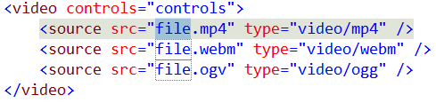

This produces a snippet that you can customize.

#### Extract to user control

In large web pages, it can be a good idea to move individual pieces into user controls. This form of refactoring can help increase the readability of the page and can simplify the page structure.

To make this easier, when you edit Web Forms pages in Source view, you can now select text in a page, right-click it, and then choose Extract to User Control:

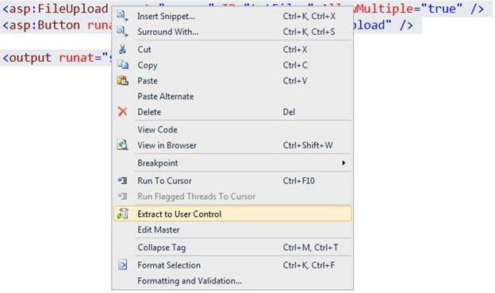

#### IntelliSense for code nuggets in attributes

Visual Studio has always provided IntelliSense for server-side code nuggets in any page or control. Now Visual Studio includes IntelliSense for code nuggets in HTML attributes as well.

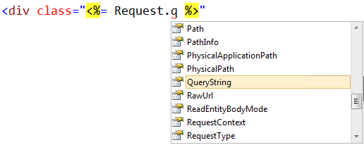

This makes it easier to create data-binding expressions:

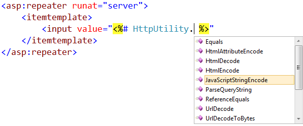

#### Automatic renaming of matching tag when you rename an opening or closing tag

If you rename an HTML element (for example, you change a *div* tag to be a *header* tag), the corresponding opening or closing tag also changes in real time.

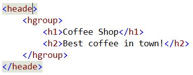

This helps avoid the error where you forget to change a closing tag or change the wrong one.

#### Event handler generation

Visual Studio now includes features in Source view to help you write event handlers and bind them manually. If you are editing an event name in Source view, IntelliSense displays &lt;Create New Event&gt;, which will create an event handler in the page's code that has the right signature:

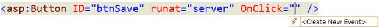

By default, the event handler will use the control's ID for the name of the event-handling method:

The resulting event handler will look like this (in this case, in C#):

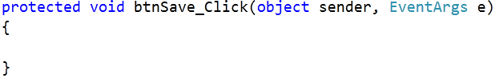

#### Smart indent

When you press Enter while inside an empty HTML element, the editor will put the insertion point in the right place:

If you press Enter in this location, the closing tag is moved down and indented to match the opening tag. The insertion point is also indented:

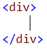

#### Auto-reduce statement completion

The IntelliSense list in Visual Studio now filters based on what you type so that it displays only relevant options:

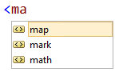

IntelliSense also filters based on the title case of the individual words in the IntelliSense list. For example, if you type "dl", both dl and asp:DataList are displayed:

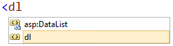

This feature makes it faster to get statement completion for known elements.

### JavaScript Editor

The JavaScript editor in Visual Studio 2012 Release Candidate is completely new and it greatly improves the experience of working with JavaScript in Visual Studio.

#### Code outlining

Outlining regions are now automatically created for all functions, allowing you to collapse parts of the file that aren't pertinent to your current focus.

#### Brace matching

When you put the insertion point on an opening or closing brace, the editor highlights the matching one.

#### Go to Definition

The Go to Definition command lets you jump to the source for a function or variable.

#### ECMAScript5 support

The editor supports the new syntax and APIs in ECMAScript5, the latest version of the standard that describes the JavaScript language.

#### DOM IntelliSense

IntelliSense for DOM APIs has been improved, with support for many new HTML5 APIs including *querySelector*, DOM Storage, cross-document messaging, and *canvas*. DOM IntelliSense is now driven by a single simple JavaScript file, rather than by a native type library definition. This makes it easy to extend or replace.

#### VSDOC signature overloads

Detailed IntelliSense comments can now be declared for separate overloads of JavaScript functions by using the new *&lt;signature&gt;* element, as shown in this example:

[!code-csharp[Main](whats-new-in-aspnet-45-and-visual-studio-2012/samples/sample35.cs)]

#### Implicit references

You can now add JavaScript files to a central list that will be implicitly included in the list of files that any given JavaScript file or block references, meaning you'll get IntelliSense for its contents. For example, you can add jQuery files to the central list of files, and you'll get IntelliSense for jQuery functions in any JavaScript block of file, whether you've referenced it explicitly (using /// &lt;reference /&gt;) or not.

### CSS Editor

#### Auto-reduce statement completion

The IntelliSense list for CSS now filters based on the CSS properties and values supported by the selected schema.

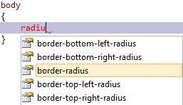

IntelliSense also supports title case searches:

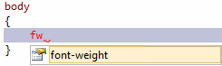

#### Hierarchical indentation

The CSS editor uses indentation to display hierarchical rules, which gives you an overview of how the cascading rules are logically organized. In the following example, the #list a selector is a cascading child of list and is therefore indented.

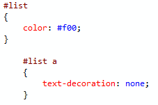

The following example shows more complex inheritance:

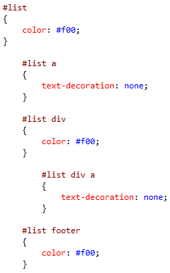

The indentation of a rule is determined by its parent rules. Hierarchical indentation is enabled by default, but you can disable it the Options dialog box (Tools, Options from the menu bar):

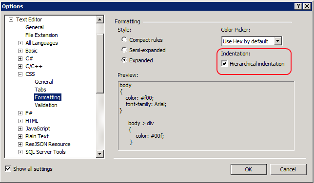

#### CSS hacks support

Analysis of hundreds of real-world CSS files shows that CSS hacks are very common, and now Visual Studio supports the most widely used ones. This support includes IntelliSense and validation of the star (\*) and underscore (\_) property hacks:

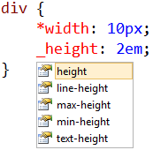

Typical selector hacks are also supported so that hierarchical indentation is maintained even when they are applied. A typical selector hack used to target Internet Explorer 7 is to prepend a selector with *\*:first-child + html*. Using that rule will maintain the hierarchical indentation:

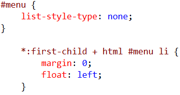

#### Vendor specific schemas (-moz-, -webkit)

CSS3 introduces many properties that have been implemented by different browsers at different times. This previously forced developers to code for specific browsers by using vendor-specific syntax. These browser-specific properties are now included in IntelliSense.

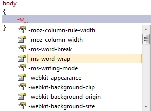

#### Commenting and uncommenting support

You can now comment and uncomment CSS rules using the same shortcuts that you use in the code editor (Ctrl+K,C to comment and Ctrl+K,U to uncomment).

#### Color picker

In previous versions of Visual Studio, IntelliSense for color-related attributes consisted of a drop-down list of named color values. That list has been replaced by a full-featured color picker.

When you enter a color value, the color picker is displayed automatically and presents a list of previously used colors followed by a default color palette. You can select a color using the mouse or the keyboard.

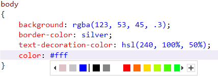

The list can be expanded into a complete color picker. The picker lets you control the alpha channel by automatically converting any color into RGBA when you move the opacity slider:

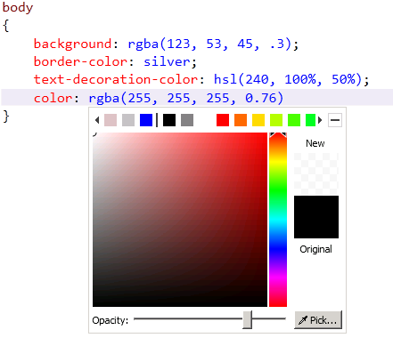

#### Snippets

Snippets in the CSS editor make it easier and faster to create cross-browser styles. Many CSS3 properties that require browser-specific settings have now been rolled into snippets.

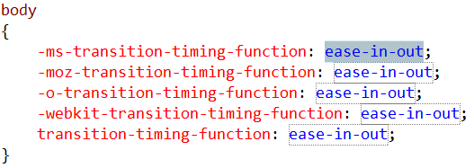

CSS snippets support advanced scenarios (like CSS3 media queries) by typing the at-symbol (@), which shows the IntelliSense list.

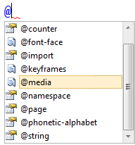

When you select @media value and press Tab, the CSS editor inserts the following snippet:

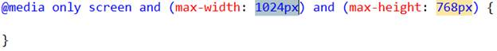

As with snippets for code, you can create your own CSS snippets.

#### Custom regions

Named code regions, which are already available in the code editor, are now available for CSS editing. This lets you easily group related style blocks.

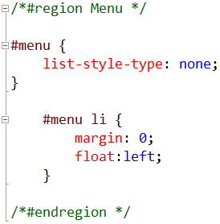

When a region is collapsed it displays the name of the region:

### Page Inspector

Page Inspector is a tool that renders a web page (HTML, Web Forms, ASP.NET MVC, or Web Pages) in the Visual Studio IDE and lets you examine both the source code and the resulting output. For ASP.NET pages, Page Inspector lets you determine which server-side code has produced the HTML markup that is rendered to the browser.

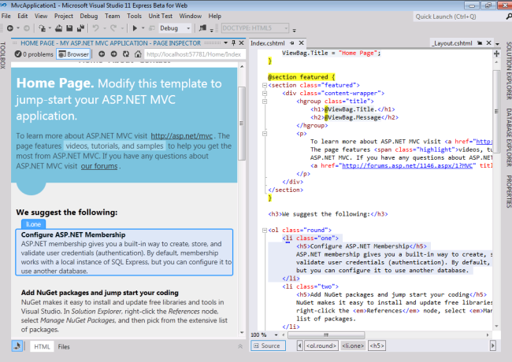

For more information about Page Inspector, please see the following tutorials:

- Using Page Inspector in [ASP.NET MVC](../mvc/overview/views/using-page-inspector-in-aspnet-mvc.md)
- Using Page Inspector in [ASP.NET Web Forms](../web-forms/overview/getting-started/using-page-inspector-in-a-visual-studio-11-beta-web-forms-project.md)

### Publishing

#### Publish profiles

In Visual Studio 2010, publishing information for Web application projects is not stored in version control and is not designed for sharing with others. In Visual Studio 2012 Release Candidate, the format of the publish profile has been changed. It has been made a team artifact, and it is now easy to leverage from builds based on MSBuild. Build configuration information is in the Publish dialog box so that you can easily switch build configurations before publishing.

Publish profiles are stored in the PublishProfiles folder. The location of the folder depends on what programming language you are using:

- C#: Properties\PublishProfiles
- Visual Basic: My Project\PublishProfiles

Each profile is an MSBuild file. During publishing, this file is imported into the project's MSBuild file. In Visual Studio 2010, if you want to make changes to the publish or package process, you have to put your customizations in a file named **ProjectName**.wpp.targets. This is still supported, but you can now put your customizations in the publish profile itself. That way, the customizations will be used only for that profile.

You can now also leverage publish profiles from MSBuild. To do so, use the following command when you build the project:

[!code-console[Main](whats-new-in-aspnet-45-and-visual-studio-2012/samples/sample36.cmd)]

The project.csproj value is the path of the project, and ProfileName is the name of the profile to publish. Alternatively, instead of passing the profile name for the *PublishProfile* property, you can pass in the full path to the publish profile.

#### ASP.NET precompilation and merge

For Web application projects, Visual Studio 2012 Release Candidate adds an option on the Package/Publish Web properties page that lets you precompile and merge your site's content when you publish or package the project. To see these options, right-click the project in Solution Explorer, choose Properties, and then choose the Package/Publish Web property page. The following illustration shows the Precompile this application before publishing option.

When this option is selected, Visual Studio precompiles the application whenever you publish or package the web application. If you want to control how the site is precompiled or how assemblies are merged, click the Advanced button to configure those options.

### IIS Express

The default web server for testing web projects in Visual Studio is now IIS Express. The Visual Studio Development Server is still an option for local web server during development, but IIS Express is now the recommended server. The experience of using IIS Express in Visual Studio 11 Beta is very similar to using it in Visual Studio 2010 SP1.

## Disclaimer

This is a preliminary document and may be changed substantially prior to final commercial release of the software described herein.

The information contained in this document represents the current view of Microsoft Corporation on the issues discussed as of the date of publication. Because Microsoft must respond to changing market conditions, it should not be interpreted to be a commitment on the part of Microsoft, and Microsoft cannot guarantee the accuracy of any information presented after the date of publication.

This White Paper is for informational purposes only. MICROSOFT MAKES NO WARRANTIES, EXPRESS, IMPLIED OR STATUTORY, AS TO THE INFORMATION IN THIS DOCUMENT.

Complying with all applicable copyright laws is the responsibility of the user. Without limiting the rights under copyright, no part of this document may be reproduced, stored in or introduced into a retrieval system, or transmitted in any form or by any means (electronic, mechanical, photocopying, recording, or otherwise), or for any purpose, without the express written permission of Microsoft Corporation.

Microsoft may have patents, patent applications, trademarks, copyrights, or other intellectual property rights covering subject matter in this document. Except as expressly provided in any written license agreement from Microsoft, the furnishing of this document does not give you any license to these patents, trademarks, copyrights, or other intellectual property.

Unless otherwise noted, the example companies, organizations, products, domain names, e-mail addresses, logos, people, places and events depicted herein are fictitious, and no association with any real company, organization, product, domain name, email address, logo, person, place or event is intended or should be inferred.

© 2012 Microsoft Corporation. All rights reserved.

Microsoft and Windows are either registered trademarks or trademarks of Microsoft Corporation in the United States and/or other countries.

The names of actual companies and products mentioned herein may be the trademarks of their respective owners.