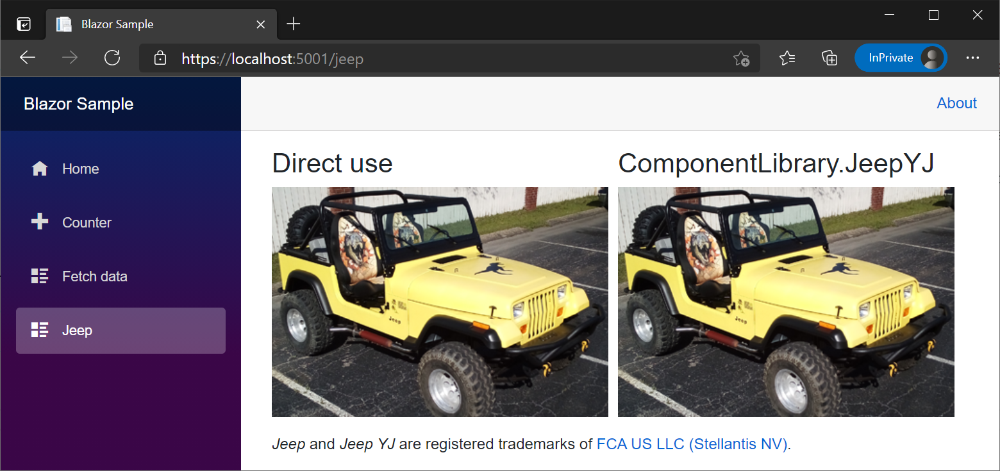

# Consume ASP.NET Core Razor components from Razor class libraries

Components can be shared in a [Razor class library (RCL)](xref:razor-pages/ui-class) across projects. Include components and static assets in an app from:

* Another project in the solution.
* A referenced .NET library.
* A NuGet package.

Just as components are regular .NET types, components provided by an RCL are normal .NET assemblies.

## Create an RCL

# [Visual Studio](#tab/visual-studio)

1. Create a new project.
1. In the **Create a new project** dialog, select **Razor Class Library** from the list of ASP.NET Core project templates. Select **Next**.
1. In the **Configure your new project** dialog, provide a project name in the **Project name** field or accept the default project name. Examples in this topic use the project name `ComponentLibrary`. Select **Create**.
1. In the **Create a new Razor class library** dialog, select **Create**.
1. Add the RCL to a solution:
   1. Open the solution.
   1. Right-click the solution in **Solution Explorer**. Select **Add** > **Existing Project**.
   1. Navigate to the RCL's project file.
   1. Select the RCL's project file (`.csproj`).
1. Add a reference to the RCL from the app:
   1. Right-click the app project. Select **Add** > **Project Reference**.
   1. Select the RCL project. Select **OK**.

If the **Support pages and views** checkbox is selected to support pages and views when generating the RCL from the template, add an `_Imports.razor` file to root of the generated RCL project with the following contents to enable Razor component authoring:

```razor
@using Microsoft.AspNetCore.Components.Web
```

# [Visual Studio for Mac](#tab/visual-studio-mac)

1. Create a new project.
1. In the sidebar under **Web and Console**, select **App**. Under **ASP.NET Core**, select **Razor Class Library** from the project templates shown. Select **Next**.
1. Select the target framework for the library with the **Target Framework** dropdown list. Select **Next**.
1. In the **Configure your new Class Library** dialog, provide a project name in the **Project Name** field. Examples in this topic use the project name `ComponentLibrary`. Select **Create**.
1. Add the RCL to a solution:
   1. Open the solution.
   1. Right-click the solution in **Solution Explorer**. Select **Add** > **Existing Project**.
   1. Navigate to the RCL's project file.
   1. Select the RCL's project file (`.csproj`).
1. Add a reference to the RCL from the app:
   1. Right-click the app project. Select **Add** > **Reference**.
   1. Select the RCL project. Select **OK**.

If the **Support pages and views** checkbox is selected to support pages and views when generating the RCL from the template, add an `_Imports.razor` file to root of the generated RCL project with the following contents to enable Razor component authoring:

```razor
@using Microsoft.AspNetCore.Components.Web
```

# [Visual Studio Code / .NET Core CLI](#tab/visual-studio-code+netcore-cli)

1. Use the **Razor Class Library** project template (`razorclasslib`) with the [`dotnet new`](/dotnet/core/tools/dotnet-new) command in a command shell. In the following example, an RCL is created and named `ComponentLibrary` using the `-o|--output` option. The folder that holds `ComponentLibrary` is created automatically when the command is executed:

   ```dotnetcli
   dotnet new razorclasslib -o ComponentLibrary
   ```

1. To add the library to an existing project, use the [`dotnet add reference`](/dotnet/core/tools/dotnet-add-reference) command in a command shell. In the following command, the `{PATH TO LIBRARY}` placeholder is the path to the library's project folder:

   ```dotnetcli
   dotnet add reference {PATH TO LIBRARY}
   ```

If the `-s|--support-pages-and-views` option is used to support pages and views when generating the RCL from the template, add an `_Imports.razor` file to root of the generated RCL project with the following contents to enable Razor component authoring:

```razor
@using Microsoft.AspNetCore.Components.Web
```

---

## Consume a Razor component from an RCL

To consume components from an RCL in another project, use either of the following approaches:

* Use the full component type name, which includes the RCL's namespace.
* Individual components can be added by name without the RCL's namespace if Razor's [`@using`](xref:mvc/views/razor#using) directive declares the RCL's namespace. Use the following approaches:
  * Add the `@using` directive to individual components.
  * include the `@using` directive in the top-level `_Imports.razor` file to make the library's components available to an entire project. Add the directive to an `_Imports.razor` file at any level to apply the namespace to a single component or set of components within a folder. When an `_Imports.razor` file is used, individual components don't require an `@using` directive for the RCL's namespace.

In the following examples, `ComponentLibrary` is an RCL containing the `Component1` component. The `Component1` component is an example component automatically added to an RCL created from the RCL project template that isn't created to support pages and views.

> [!NOTE]
> If the RCL is created to support pages and views, manually add the `Component1` component and its static assets to the RCL if you plan to follow the examples in this article. The component and static assets are shown in this section.

`Component1.razor` in the `ComponentLibrary` RCL:

```razor
<div class="my-component">
    This component is defined in the <strong>ComponentLibrary</strong> package.
</div>
```

In the app that consumes the RCL, reference the `Component1` component using its namespace, as the following example shows.

`Pages/ConsumeComponent1.razor`:

```razor
@page "/consume-component-1"

<h1>Consume component (full namespace example)</h1>

<ComponentLibrary.Component1 />
```

Alternatively, add a [`@using`](xref:mvc/views/razor#using) directive and use the component without its namespace. The following `@using` directive can also appear in any `_Imports.razor` file in or above the current folder.

`Pages/ConsumeComponent2.razor`:

```razor
@page "/consume-component-2"
@using ComponentLibrary

<h1>Consume component (<code>@@using</code> example)</h1>

<Component1 />
```

The following background image and stylesheet are used by the RCL's `Component1` example component. There's no need to add these static assets to a new RCL created from the RCL project template, as they're added automatically by the project template.

`wwwroot/background.png` in the `ComponentLibrary` RCL:


`wwwroot/styles.css` in the `ComponentLibrary` RCL:

```css
.my-component {
    border: 2px dashed red;
    padding: 1em;
    margin: 1em 0;
    background-image: url('background.png');
}
```

To provide `Component1`'s `my-component` CSS class, link to the library's stylesheet in the app's `<head>` markup.

`wwwroot/index.html` file (Blazor WebAssembly) or `Pages/_Host.cshtml` file (Blazor Server):

```diff
+ <link href="_content/ComponentLibrary/styles.css" rel="stylesheet" />
```

## Create an RCL with static assets

An RCL's static assets are available to any app that consumes the library.

Place static assets in the `wwwroot` folder of the RCL and reference the static assets with the following path in the app: `_content/{LIBRARY NAME}/{PATH AND FILE NAME}`. The `{LIBRARY NAME}` placeholder is the library name. The `{PATH AND FILE NAME}` placeholder is path and file name under `wwwroot`.

The following example demonstrates the use of RCL static assets with an RCL named `ComponentLibrary` and a Blazor app that consumes the RCL. The app has a project reference for the `ComponentLibrary` RCL.

The following Jeep&reg; image is used in this section's example. If you implement the example shown in this section, right-click the image to save it locally.

`wwwroot/jeep-yj.png` in the `ComponentLibrary` RCL:


Add the following `JeepYJ` component to the RCL.

`JeepYJ.razor` in the `ComponentLibrary` RCL:

```razor
<h3>ComponentLibrary.JeepYJ</h3>

<p>
    
</p>
```

Add the following `Jeep` component to the app that consumes the `ComponentLibrary` RCL. The `Jeep` component uses:

* The Jeep YJ&reg; image from the `ComponentLibrary` RCL's `wwwroot` folder.
* The `JeepYJ` component from the RCL.

`Pages/Jeep.razor`:

```razor
@page "/jeep"
@using ComponentLibrary

<div style="float:left;margin-right:10px">
    <h3>Direct use</h3>

    <p>
        
    </p>
</div>

<JeepYJ />

<p>
    <em>Jeep</em> and <em>Jeep YJ</em> are registered trademarks of 
    <a href="https://www.stellantis.com">FCA US LLC (Stellantis NV)</a>.
</p>
```

Rendered `Jeep` component:



For more information, see <xref:razor-pages/ui-class#create-an-rcl-with-static-assets>.

## Supply components and static assets to multiple hosted Blazor apps

For more information, see <xref:blazor/host-and-deploy/webassembly#static-assets-and-class-libraries-for-multiple-blazor-webassembly-apps>.

## Build, pack, and ship to NuGet

Because Razor class libraries that contain Razor components are standard .NET libraries, packing and shipping them to NuGet is no different from packing and shipping any library to NuGet. Packing is performed using the [`dotnet pack`](/dotnet/core/tools/dotnet-pack) command in a command shell:

```dotnetcli
dotnet pack
```

Upload the package to NuGet using the [`dotnet nuget push`](/dotnet/core/tools/dotnet-nuget-push) command in a command shell.

## Trademarks

*Jeep* and *Jeep YJ* are registered trademarks of [FCA US LLC (Stellantis NV)](https://www.stellantis.com).

## Additional resources

* <xref:razor-pages/ui-class>
* [Add an XML Intermediate Language (IL) Linker configuration file to a library](xref:blazor/host-and-deploy/configure-linker#add-an-xml-linker-configuration-file-to-a-library)
