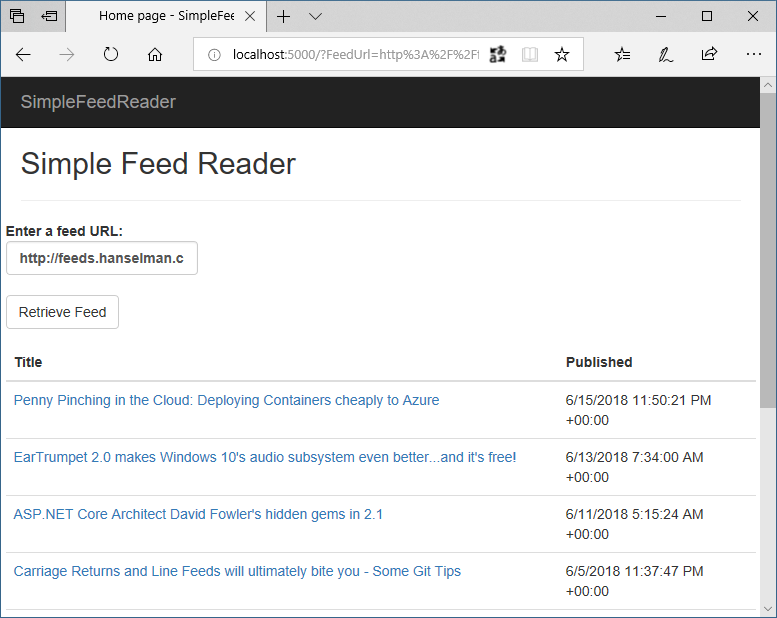
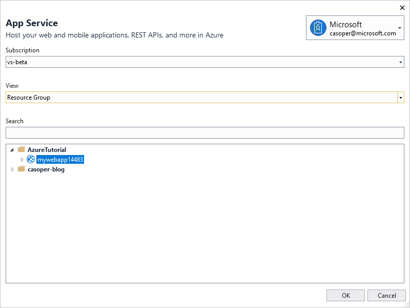
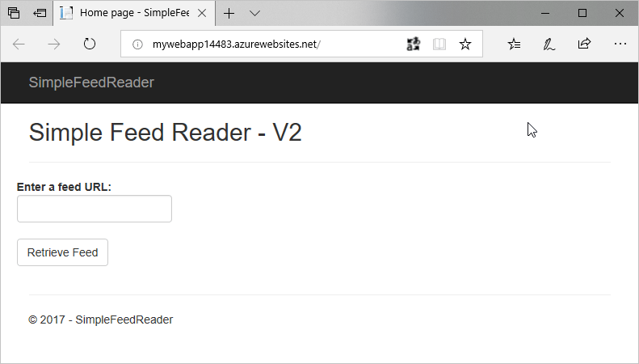
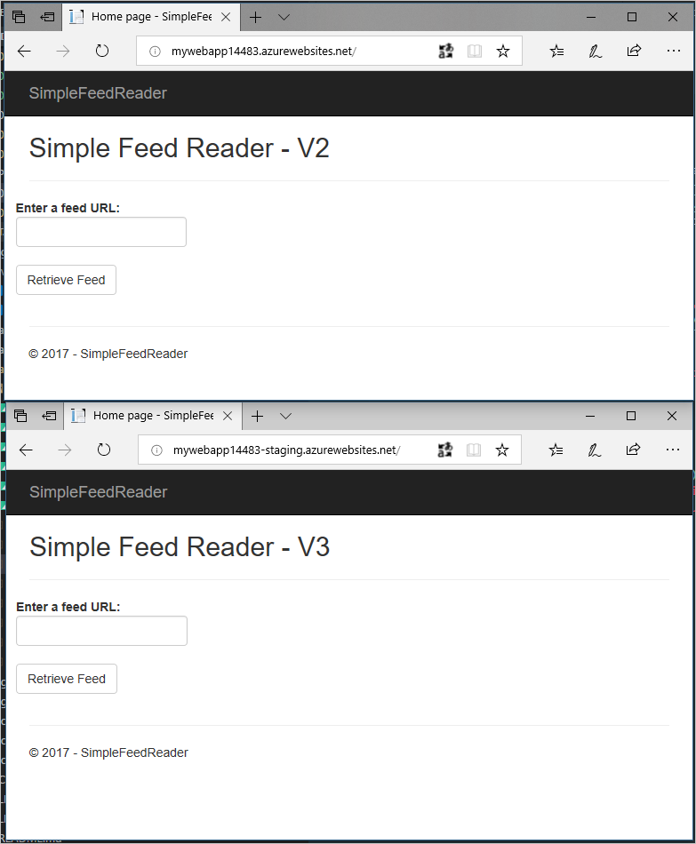
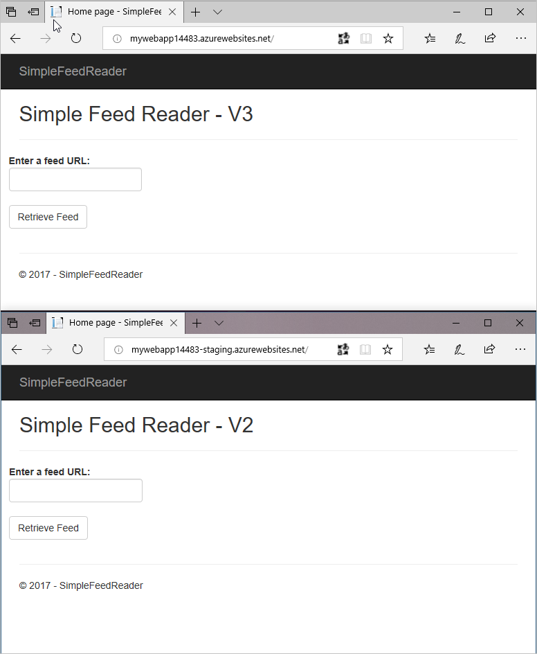

# Deploy an app to App Service

[Azure App Service](/azure/app-service/) is Azure's web hosting platform. Deploying a web app to Azure App Service can be done manually or by an automated process. This section of the guide discusses deployment methods that can be triggered manually or by script using the command line, or triggered manually using Visual Studio.

In this section, you'll accomplish the following tasks:

* Download and build the sample app.
* Create an Azure App Service Web App using the Azure Cloud Shell.
* Deploy the sample app to Azure using Git.
* Deploy a change to the app using Visual Studio.
* Add a staging slot to the web app.
* Deploy an update to the staging slot.
* Swap the staging and production slots.

## Download and test the app

The app used in this guide is a pre-built ASP.NET Core app, [Simple Feed Reader](https://github.com/Azure-Samples/simple-feed-reader/). It's a Razor Pages app that uses the `Microsoft.SyndicationFeed.ReaderWriter` API to retrieve an RSS/Atom feed and display the news items in a list.

Feel free to review the code, but it's important to understand that there's nothing special about this app. It's just a simple ASP.NET Core app for illustrative purposes.

From a command shell, download the code, build the project, and run it as follows.

> *Note: Linux/macOS users should make appropriate changes for paths, e.g., using forward slash (`/`) rather than back slash (`\`).*

1. Clone the code to a folder on your local machine.

    ```console
    git clone https://github.com/Azure-Samples/simple-feed-reader/
    ```

2. Change your working folder to the *simple-feed-reader* folder that was created.

    ```console
    cd .\simple-feed-reader\SimpleFeedReader
    ```

3. Restore the packages, and build the solution.

    ```dotnetcli
    dotnet build
    ```

4. Run the app.

    ```dotnetcli
    dotnet run
    ```

    

5. Open a browser and navigate to `http://localhost:5000`. The app allows you to type or paste a syndication feed URL and view a list of news items.

     

6. Once you're satisfied the app is working correctly, shut it down by pressing **Ctrl**+**C** in the command shell.

## Create the Azure App Service Web App

To deploy the app, you'll need to create an App Service [Web App](/azure/app-service/app-service-web-overview). After creation of the Web App, you'll deploy to it from your local machine using Git.

1. Sign in to the [Azure Cloud Shell](https://shell.azure.com/bash). Note: When you sign in for the first time, Cloud Shell prompts to create a storage account for configuration files. Accept the defaults or provide a unique name.

2. Use the Cloud Shell for the following steps.

    a. Declare a variable to store your web app's name. The name must be unique to be used in the default URL. Using the `$RANDOM` Bash function to construct the name guarantees uniqueness and results in the format `webappname99999`.

    ```console
    webappname=mywebapp$RANDOM
    ```

    b. Create a resource group. Resource groups provide a means to aggregate Azure resources to be managed as a group.

    ```azurecli
    az group create --location centralus --name AzureTutorial
    ```

    The `az` command invokes the [Azure CLI](/cli/azure/). The CLI can be run locally, but using it in the Cloud Shell saves time and configuration.

    c. Create an App Service plan in the S1 tier. An App Service plan is a grouping of web apps that share the same pricing tier. The S1 tier isn't free, but it's required for the staging slots feature.

    ```azurecli
    az appservice plan create --name $webappname --resource-group AzureTutorial --sku S1
    ```

    d. Create the web app resource using the App Service plan in the same resource group.

    ```azurecli
    az webapp create --name $webappname --resource-group AzureTutorial --plan $webappname
    ```

    e. Set the deployment credentials. These deployment credentials apply to all the web apps in your subscription. Don't use special characters in the user name.

    ```azurecli
    az webapp deployment user set --user-name REPLACE_WITH_USER_NAME --password REPLACE_WITH_PASSWORD
    ```

    f. Configure the web app to accept deployments from local Git and display the *Git deployment URL*. **Note this URL for reference later**.

    ```azurecli
    echo Git deployment URL: $(az webapp deployment source config-local-git --name $webappname --resource-group AzureTutorial --query url --output tsv)
    ```

    g. Display the *web app URL*. Browse to this URL to see the blank web app. **Note this URL for reference later**.

    ```console
    echo Web app URL: http://$webappname.azurewebsites.net
    ```

3. Using a command shell on your local machine, navigate to the web app's project folder (for example, `.\simple-feed-reader\SimpleFeedReader`). Execute the following commands to set up Git to push to the deployment URL:

    a. Add the remote URL to the local repository.

    ```console
    git remote add azure-prod GIT_DEPLOYMENT_URL
    ```

    b. Push the local *master* branch to the *azure-prod* remote's *master* branch.

    ```console
    git push azure-prod master
    ```

    You'll be prompted for the deployment credentials you created earlier. Observe the output in the command shell. Azure builds the ASP.NET Core app remotely.

4. In a browser, navigate to the *Web app URL* and note the app has been built and deployed. Additional changes can be committed to the local Git repository with `git commit`. These changes are pushed to Azure with the preceding `git push` command.

## Deployment with Visual Studio

> *Note: This section applies to Windows only. Linux and macOS users should make the change described in step 2 below. Save the file, and commit the change to the local repository with `git commit`. Finally, push the change with `git push`, as in the first section.*

The app has already been deployed from the command shell. Let's use Visual Studio's integrated tools to deploy an update to the app. Behind the scenes, Visual Studio accomplishes the same thing as the command line tooling, but within Visual Studio's familiar UI.

1. Open *SimpleFeedReader.sln* in Visual Studio.
2. In Solution Explorer, open *Pages\Index.cshtml*. Change `<h2>Simple Feed Reader</h2>` to `<h2>Simple Feed Reader - V2</h2>`.
3. Press **Ctrl**+**Shift**+**B** to build the app.
4. In Solution Explorer, right-click on the project and click **Publish**.

    
5. Visual Studio can create a new App Service resource, but this update will be published over the existing deployment. In the **Pick a publish target** dialog, select **App Service** from the list on the left, and then select **Select Existing**. Click **Publish**.
6. In the **App Service** dialog, confirm that the Microsoft or Organizational account used to create your Azure subscription is displayed in the upper right. If it's not, click the drop-down and add it.
7. Confirm that the correct Azure **Subscription** is selected. For **View**, select **Resource Group**. Expand the **AzureTutorial** resource group and then select the existing web app. Click **OK**.

    

Visual Studio builds and deploys the app to Azure. Browse to the web app URL. Validate that the `<h2>` element modification is live.



## Deployment slots

Deployment slots support the staging of changes without impacting the app running in production. Once the staged version of the app is validated by a quality assurance team, the production and staging slots can be swapped. The app in staging is promoted to production in this manner. The following steps create a staging slot, deploy some changes to it, and swap the staging slot with production after verification.

1. Sign in to the [Azure Cloud Shell](https://shell.azure.com/bash), if not already signed in.
2. Create the staging slot.

    a. Create a deployment slot with the name *staging*.

    ```azurecli
    az webapp deployment slot create --name $webappname --resource-group AzureTutorial --slot staging
    ```

    b. Configure the staging slot to use deployment from local Git and get the **staging** deployment URL. **Note this URL for reference later**.

    ```azurecli
    echo Git deployment URL for staging: $(az webapp deployment source config-local-git --name $webappname --resource-group AzureTutorial --slot staging --query url --output tsv)
    ```

    c. Display the staging slot's URL. Browse to the URL to see the empty staging slot. **Note this URL for reference later**.

    ```console
    echo Staging web app URL: http://$webappname-staging.azurewebsites.net
    ```

3. In a text editor or Visual Studio, modify *Pages/Index.cshtml* again so that the `<h2>` element reads `<h2>Simple Feed Reader - V3</h2>` and save the file.

4. Commit the file to the local Git repository, using either the **Changes** page in Visual Studio's *Team Explorer* tab, or by entering the following using the local machine's command shell:

    ```console
    git commit -a -m "upgraded to V3"
    ```

5. Using the local machine's command shell, add the staging deployment URL as a Git remote and push the committed changes:

    a. Add the remote URL for staging to the local Git repository.

    ```console
    git remote add azure-staging <Git_staging_deployment_URL>
    ```

    b. Push the local *master* branch to the *azure-staging* remote's *master* branch.

    ```console
    git push azure-staging master
    ```

    Wait while Azure builds and deploys the app.

6. To verify that V3 has been deployed to the staging slot, open two browser windows. In one window, navigate to the original web app URL. In the other window, navigate to the staging web app URL. The production URL serves V2 of the app. The staging URL serves V3 of the app.

    

7. In the Cloud Shell, swap the verified/warmed-up staging slot into production.

    ```azurecli
    az webapp deployment slot swap --name $webappname --resource-group AzureTutorial --slot staging
    ```

8. Verify that the swap occurred by refreshing the two browser windows.

    

## Summary

In this section, the following tasks were completed:

* Downloaded and built the sample app.
* Created an Azure App Service Web App using the Azure Cloud Shell.
* Deployed the sample app to Azure using Git.
* Deployed a change to the app using Visual Studio.
* Added a staging slot to the web app.
* Deployed an update to the staging slot.
* Swapped the staging and production slots.

In the next section, you'll learn how to build a DevOps pipeline with Azure Pipelines.

## Additional reading

* [Web Apps overview](/azure/app-service/app-service-web-overview)
* [Build a .NET Core and SQL Database web app in Azure App Service](/azure/app-service/app-service-web-tutorial-dotnetcore-sqldb)
* [Configure deployment credentials for Azure App Service](/azure/app-service/app-service-deployment-credentials)
* [Set up staging environments in Azure App Service](/azure/app-service/web-sites-staged-publishing)
