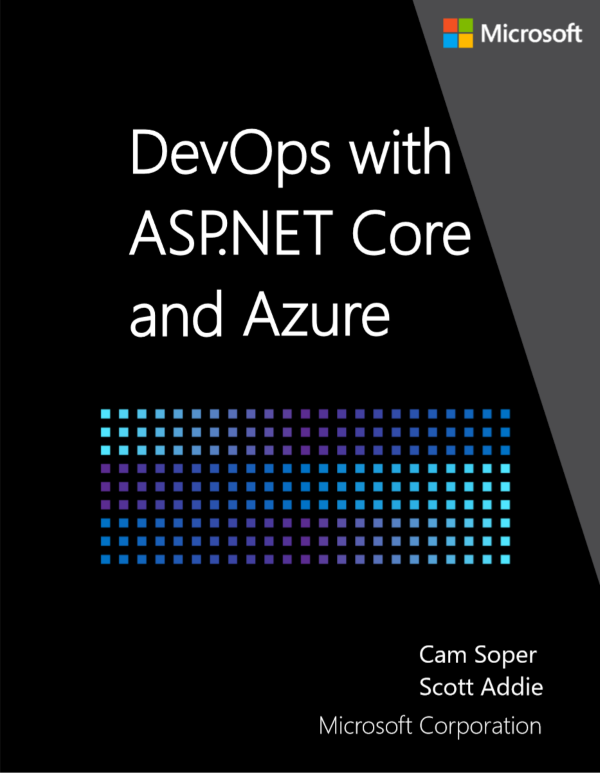

# DevOps with ASP.NET Core and Azure

By [Cam Soper](https://twitter.com/camsoper) and [Scott Addie](https://twitter.com/scottaddie)

This guide is available as a [downloadable PDF e-book](https://aka.ms/devopsbook).

## Welcome 

Welcome to the Azure Development Lifecycle guide for .NET! This guide introduces the basic concepts of building a development lifecycle around Azure using .NET tools and processes. After finishing this guide, you'll reap the benefits of a mature DevOps toolchain.

## Who this guide is for

You should be an experienced ASP.NET Core developer (200-300 level). You don't need to know anything about Azure, as we'll cover that in this introduction. This guide may also be useful for DevOps engineers who are more focused on operations than development.

This guide targets Windows developers. However, Linux and macOS are fully supported by .NET Core. To adapt this guide for Linux/macOS, watch for callouts for Linux/macOS differences.

## What this guide doesn't cover

This guide is focused on an end-to-end continuous deployment experience for .NET developers. It's not an exhaustive guide to all things Azure, and it doesn't focus extensively on .NET APIs for Azure services. The emphasis is all around continuous integration, deployment, monitoring, and debugging. Near the end of the guide, recommendations for next steps are offered. Included in the suggestions are Azure platform services that are useful to ASP.NET Core developers.

## What's in this guide

### [Tools and downloads](xref:azure/devops/tools-and-downloads)

Learn where to acquire the tools used in this guide.

### [Deploy to App Service](xref:azure/devops/deploy-to-app-service)

Learn the various methods for deploying an ASP.NET Core app to Azure App Service.

### [Continuous integration and deployment](xref:azure/devops/cicd)

Build an end-to-end continuous integration and deployment solution for your ASP.NET Core app with GitHub, Azure DevOps Services, and Azure.

### [Monitor and debug](xref:azure/devops/monitor)

Use Azure's tools to monitor, troubleshoot, and tune your application.

### [Next steps](xref:azure/devops/next-steps)

Other learning paths for the ASP.NET Core developer learning Azure.

## Additional introductory reading

If this is your first exposure to cloud computing, these articles explain the basics.

* [What is Cloud Computing?](https://azure.microsoft.com/overview/what-is-cloud-computing/)
* [Examples of Cloud Computing](https://azure.microsoft.com/overview/examples-of-cloud-computing/)
* [What is IaaS?](https://azure.microsoft.com/overview/what-is-iaas/)
* [What is PaaS?](https://azure.microsoft.com/overview/what-is-paas/)
