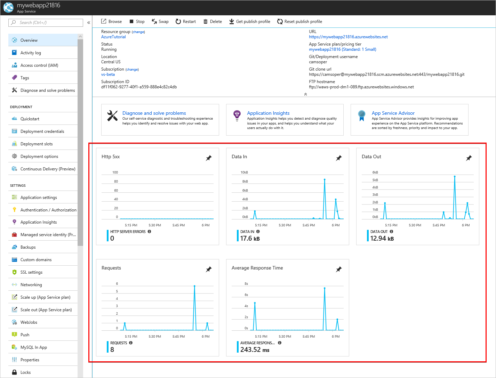
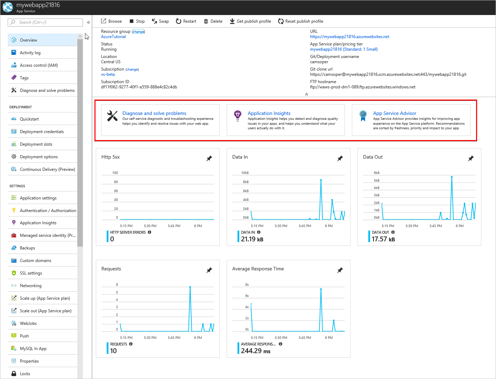
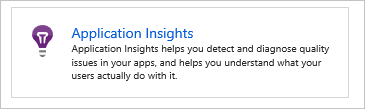
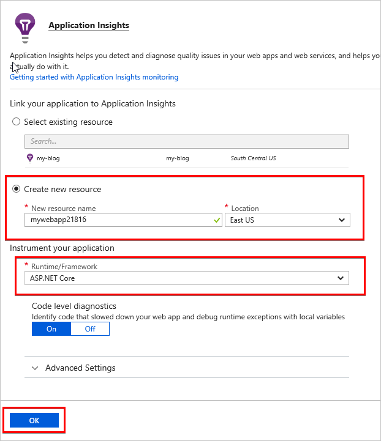
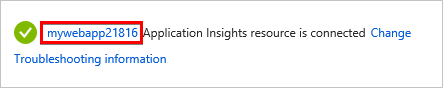
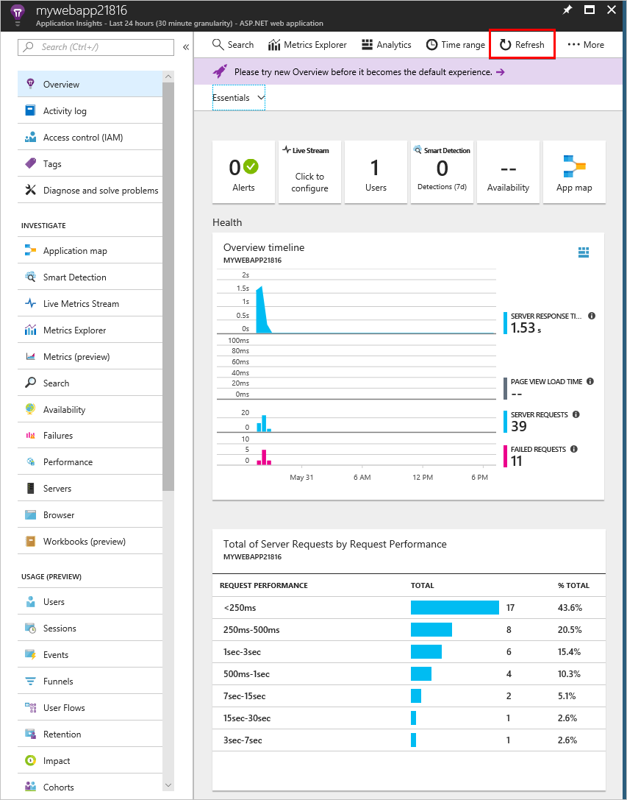
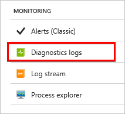
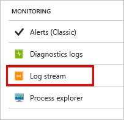
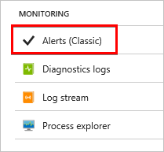

# Monitor and debug

Having deployed the app and built a DevOps pipeline, it's important to understand how to monitor and troubleshoot the app.

In this section, you'll complete the following tasks:

* Find basic monitoring and troubleshooting data in the Azure portal
* Learn how Azure Monitor provides a deeper look at metrics across all Azure services
* Connect the web app with Application Insights for app profiling
* Turn on logging and learn where to download logs
* Stream logs in real time
* Learn where to set up alerts
* Learn about remote debugging Azure App Service web apps.

## Basic monitoring and troubleshooting

App Service web apps are easily monitored in real time. The Azure portal renders metrics in easy-to-understand charts and graphs.

1. Open the [Azure portal](https://portal.azure.com), and then navigate to the *mywebapp\<unique_number\>* App Service.

1. The **Overview** tab displays useful "at-a-glance" information, including graphs displaying recent metrics.

    

    * **Http 5xx**: Count of server-side errors, usually exceptions in ASP.NET Core code.
    * **Data In**: Data ingress coming into your web app.
    * **Data Out**: Data egress from your web app to clients.
    * **Requests**: Count of HTTP requests.
    * **Average Response Time**: Average time for the web app to respond to HTTP requests.

    Several self-service tools for troubleshooting and optimization are also found on this page.

    

    * **Diagnose and solve problems** is a self-service troubleshooter.
    * **Application Insights** is for profiling performance and app behavior, and is discussed later in this section.
    * **App Service Advisor** makes recommendations to tune your app experience.

## Advanced monitoring

[Azure Monitor](/azure/monitoring-and-diagnostics/) is the centralized service for monitoring all metrics and setting alerts across Azure services. Within Azure Monitor, administrators can granularly track performance and identify trends. Each Azure service offers its own [set of metrics](/azure/monitoring-and-diagnostics/monitoring-supported-metrics#microsoftwebsites-excluding-functions) to Azure Monitor.

## Profile with Application Insights

[Application Insights](/azure/application-insights/app-insights-overview) is an Azure service for analyzing the performance and stability of web apps and how users use them. The data from Application Insights is broader and deeper than that of Azure Monitor. The data can provide developers and administrators with key information for improving apps. Application Insights can be added to an Azure App Service resource without code changes.

1. Open the [Azure portal](https://portal.azure.com), and then navigate to the *mywebapp\<unique_number\>* App Service.
1. From the **Overview** tab, click the **Application Insights** tile.

    

1. Select the **Create new resource** radio button. Use the default resource name, and select the location for the Application Insights resource. The location doesn't need to match that of your web app.

    

1. For **Runtime/Framework**, select **ASP.NET Core**. Accept the default settings.
1. Select **OK**. If prompted to confirm, select **Continue**.
1. After the resource has been created, click the name of Application Insights resource to navigate directly to the Application Insights page.

    

As the app is used, data accumulates. Select **Refresh** to reload the blade with new data.

Application Insights provides useful server-side information with no additional configuration. To get the most value from Application Insights, [instrument your app with the Application Insights SDK](/azure/application-insights/app-insights-asp-net-core). When properly configured, the service provides end-to-end monitoring across the web server and browser, including client-side performance. For more information, see the [Application Insights documentation](/azure/application-insights/app-insights-overview).

## Logging

Web server and app logs are disabled by default in Azure App Service. Enable the logs with the following steps:

1. Open the [Azure portal](https://portal.azure.com), and navigate to the *mywebapp\<unique_number\>* App Service.
1. In the menu to the left, scroll down to the **Monitoring** section. Select **Diagnostics logs**.

    

1. Turn on **Application Logging (Filesystem)**. If prompted, click the box to install the extensions to enable app logging in the web app.
1. Set **Web server logging** to **File System**.
1. Enter the **Retention Period** in days. For example, 30.
1. Click **Save**.

ASP.NET Core and web server (App Service) logs are generated for the web app. They can be downloaded using the FTP/FTPS information displayed. The password is the same as the deployment credentials created earlier in this guide. The logs can be [streamed directly to your local machine with PowerShell or Azure CLI](/azure/app-service/web-sites-enable-diagnostic-log#download). Logs can also be [viewed in Application Insights](/azure/app-service/web-sites-enable-diagnostic-log#how-to-view-logs-in-application-insights).

## Log streaming

App and web server logs can be streamed in real time through the portal.

1. Open the [Azure portal](https://portal.azure.com), and navigate to the *mywebapp\<unique_number\>* App Service.
1. In the menu to the left, scroll down to the **Monitoring** section and select **Log stream**.

    

Logs can also be [streamed via Azure CLI or Azure PowerShell](/azure/app-service/web-sites-enable-diagnostic-log#streamlogs), including through the Cloud Shell.

## Alerts

Azure Monitor also provides [real time alerts](/azure/monitoring-and-diagnostics/insights-alerts-portal) based on metrics, administrative events, and other criteria.

> *Note: Currently alerting on web app metrics is only available in the Alerts (classic) service.*

The [Alerts (classic) service](/azure/monitoring-and-diagnostics/monitor-quick-resource-metric-alert-portal) can be found in Azure Monitor or under the **Monitoring** section of the App Service settings.

## Live debugging

Azure App Service can be [debugged remotely with Visual Studio](/azure/app-service/web-sites-dotnet-troubleshoot-visual-studio#remotedebug) when logs don't provide enough information. However, remote debugging requires the app to be compiled with debug symbols. Debugging shouldn't be done in production, except as a last resort.

## Conclusion

In this section, you completed the following tasks:

* Find basic monitoring and troubleshooting data in the Azure portal
* Learn how Azure Monitor provides a deeper look at metrics across all Azure services
* Connect the web app with Application Insights for app profiling
* Turn on logging and learn where to download logs
* Stream logs in real time
* Learn where to set up alerts
* Learn about remote debugging Azure App Service web apps.

## Additional reading

* <xref:test/troubleshoot-azure-iis>
* <xref:host-and-deploy/azure-iis-errors-reference>
* [Monitor Azure web app performance with Application Insights](/azure/application-insights/app-insights-azure-web-apps)
* [Enable diagnostics logging for web apps in Azure App Service](/azure/app-service/web-sites-enable-diagnostic-log)
* [Troubleshoot a web app in Azure App Service using Visual Studio](/azure/app-service/web-sites-dotnet-troubleshoot-visual-studio)
* [Create classic metric alerts in Azure Monitor for Azure services - Azure portal](/azure/monitoring-and-diagnostics/insights-alerts-portal)
