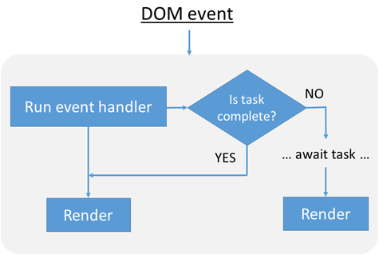

# ASP.NET Core Blazor lifecycle

The Blazor framework includes synchronous and asynchronous lifecycle methods. Override lifecycle methods to perform additional operations on components during component initialization and rendering.

The following diagrams illustrate the Blazor lifecycle. Lifecycle methods are defined with examples in the following sections of this article.

Component lifecycle events:

1. If the component is rendering for the first time on a request:
   * Create the component's instance.
   * Perform property injection. Run [`SetParametersAsync`](#before-parameters-are-set).
   * Call [`OnInitialized{Async}`](#component-initialization-methods). If a <xref:System.Threading.Tasks.Task> is returned, the <xref:System.Threading.Tasks.Task> is awaited and the component is rendered. If a <xref:System.Threading.Tasks.Task> isn't returned, the component is rendered.
1. Call [`OnParametersSet{Async}`](#after-parameters-are-set) and render the component. If a <xref:System.Threading.Tasks.Task> is returned from `OnParametersSetAsync`, the <xref:System.Threading.Tasks.Task> is awaited and then the component is rerendered.


Document Object Model (DOM) event processing:

1. The event handler is run.
1. If a <xref:System.Threading.Tasks.Task> is returned, the <xref:System.Threading.Tasks.Task> is awaited and then the component is rendered. If a <xref:System.Threading.Tasks.Task> isn't returned, the component is rendered.



The `Render` lifecycle:

1. Avoid further rendering operations on the component:
   * After the first render.
   * When [`ShouldRender`](#suppress-ui-refreshing) is `false`.
1. Build the render tree diff (difference) and render the component.
1. Await the DOM to update.
1. Call [`OnAfterRender{Async}`](#after-component-render).


Developer calls to [`StateHasChanged`](#state-changes) result in a render. For more information, see <xref:blazor/components/rendering>.

## Lifecycle methods

### Before parameters are set

<xref:Microsoft.AspNetCore.Components.ComponentBase.SetParametersAsync%2A> sets parameters supplied by the component's parent in the render tree or from route parameters. By overriding the method, developer code can interact directly with the <xref:Microsoft.AspNetCore.Components.ParameterView>'s parameters.

In the following example, <xref:Microsoft.AspNetCore.Components.ParameterView.TryGetValue%2A?displayProperty=nameWithType> assigns the `Param` parameter's value to `value` if parsing a route parameter for `Param` is successful. When `value` isn't `null`, the value is displayed by the component.

Although [route parameter matching is case insensitive](xref:blazor/fundamentals/routing#route-parameters), <xref:Microsoft.AspNetCore.Components.ParameterView.TryGetValue%2A> only matches case sensitive parameter names in the route template. The following example is required to use `/{Param?}`, not `/{param?}`, in order to get the value. If `/{param?}` is used in this scenario, <xref:Microsoft.AspNetCore.Components.ParameterView.TryGetValue%2A> returns `false` and `message` isn't set to either string.

`Pages/SetParametersAsyncExample.razor`:

```razor
@page "/setparametersasync-example/{Param?}"

<h1>SetParametersAsync Example</h1>

<p>@message</p>

@code {
    private string message;

    [Parameter]
    public string Param { get; set; }

    public override async Task SetParametersAsync(ParameterView parameters)
    {
        if (parameters.TryGetValue<string>(nameof(Param), out var value))
        {
            if (value is null)
            {
                message = "The value of 'Param' is null.";
            }
            else
            {
                message = $"The value of 'Param' is {value}.";
            }
        }

        await base.SetParametersAsync(parameters);
    }
}
```

<xref:Microsoft.AspNetCore.Components.ParameterView> contains the set of parameter values for the component each time <xref:Microsoft.AspNetCore.Components.ComponentBase.SetParametersAsync%2A> is called.

The default implementation of <xref:Microsoft.AspNetCore.Components.ComponentBase.SetParametersAsync%2A> sets the value of each property with the [`[Parameter]`](xref:Microsoft.AspNetCore.Components.ParameterAttribute) or [`[CascadingParameter]` attribute](xref:Microsoft.AspNetCore.Components.CascadingParameterAttribute) that has a corresponding value in the <xref:Microsoft.AspNetCore.Components.ParameterView>. Parameters that don't have a corresponding value in <xref:Microsoft.AspNetCore.Components.ParameterView> are left unchanged.

If [`base.SetParametersAsync`](xref:Microsoft.AspNetCore.Components.ComponentBase.SetParametersAsync%2A) isn't invoked, the custom code can interpret the incoming parameters value in any way required. For example, there's no requirement to assign the incoming parameters to the properties on the class.

If any event handlers are set up, unhook them on disposal. For more information, see the [Component disposal with `IDisposable`](#component-disposal-with-idisposable) section.

### Component initialization methods

<xref:Microsoft.AspNetCore.Components.ComponentBase.OnInitializedAsync%2A> and <xref:Microsoft.AspNetCore.Components.ComponentBase.OnInitialized%2A> are invoked when the component is initialized after having received its initial parameters from its parent component in <xref:Microsoft.AspNetCore.Components.ComponentBase.SetParametersAsync%2A>. 

Use <xref:Microsoft.AspNetCore.Components.ComponentBase.OnInitializedAsync%2A> when the component performs an asynchronous operation and should refresh when the operation is completed.

For a synchronous operation, override <xref:Microsoft.AspNetCore.Components.ComponentBase.OnInitialized%2A>:

```csharp
protected override void OnInitialized()
{
    ...
}
```

To perform an asynchronous operation, override <xref:Microsoft.AspNetCore.Components.ComponentBase.OnInitializedAsync%2A> and use the [`await`](/dotnet/csharp/language-reference/operators/await) operator on the operation:

```csharp
protected override async Task OnInitializedAsync()
{
    await ...
}
```

Blazor Server apps that [prerender their content](xref:blazor/fundamentals/signalr#render-mode) call <xref:Microsoft.AspNetCore.Components.ComponentBase.OnInitializedAsync%2A> *twice*:

* Once when the component is initially rendered statically as part of the page.
* A second time when the browser establishes a connection back to the server.

To prevent developer code in <xref:Microsoft.AspNetCore.Components.ComponentBase.OnInitializedAsync%2A> from running twice, see the [Stateful reconnection after prerendering](#stateful-reconnection-after-prerendering) section.

While a Blazor Server app is prerendering, certain actions, such as calling into JavaScript, aren't possible because a connection with the browser hasn't been established. Components may need to render differently when prerendered. For more information, see the [Detect when the app is prerendering](#detect-when-the-app-is-prerendering) section.

If any event handlers are set up, unhook them on disposal. For more information, see the [Component disposal with `IDisposable`](#component-disposal-with-idisposable) section.

### After parameters are set

<xref:Microsoft.AspNetCore.Components.ComponentBase.OnParametersSetAsync%2A> or <xref:Microsoft.AspNetCore.Components.ComponentBase.OnParametersSet%2A> are called:

* After the component is initialized in <xref:Microsoft.AspNetCore.Components.ComponentBase.OnInitialized%2A> or <xref:Microsoft.AspNetCore.Components.ComponentBase.OnInitializedAsync%2A>.
* When the parent component re-renders and supplies:
  * Only known primitive immutable types of which at least one parameter has changed.
  * Any complex-typed parameters. The framework can't know whether the values of a complex-typed parameter have mutated internally, so it treats the parameter set as changed.

```csharp
protected override async Task OnParametersSetAsync()
{
    await ...
}
```

> [!NOTE]
> Asynchronous work when applying parameters and property values must occur during the <xref:Microsoft.AspNetCore.Components.ComponentBase.OnParametersSetAsync%2A> lifecycle event.

```csharp
protected override void OnParametersSet()
{
    ...
}
```

If any event handlers are set up, unhook them on disposal. For more information, see the [Component disposal with `IDisposable`](#component-disposal-with-idisposable) section.

### After component render

<xref:Microsoft.AspNetCore.Components.ComponentBase.OnAfterRenderAsync%2A> and <xref:Microsoft.AspNetCore.Components.ComponentBase.OnAfterRender%2A> are called after a component has finished rendering. Element and component references are populated at this point. Use this stage to perform additional initialization steps using the rendered content, such as activating third-party JavaScript libraries that operate on the rendered DOM elements.

The `firstRender` parameter for <xref:Microsoft.AspNetCore.Components.ComponentBase.OnAfterRenderAsync%2A> and <xref:Microsoft.AspNetCore.Components.ComponentBase.OnAfterRender%2A>:

* Is set to `true` the first time that the component instance is rendered.
* Can be used to ensure that initialization work is only performed once.

```csharp
protected override async Task OnAfterRenderAsync(bool firstRender)
{
    if (firstRender)
    {
        await ...
    }
}
```

> [!NOTE]
> Asynchronous work immediately after rendering must occur during the <xref:Microsoft.AspNetCore.Components.ComponentBase.OnAfterRenderAsync%2A> lifecycle event.
>
> Even if you return a <xref:System.Threading.Tasks.Task> from <xref:Microsoft.AspNetCore.Components.ComponentBase.OnAfterRenderAsync%2A>, the framework doesn't schedule a further render cycle for your component once that task completes. This is to avoid an infinite render loop. It's different from the other lifecycle methods, which schedule a further render cycle once the returned task completes.

```csharp
protected override void OnAfterRender(bool firstRender)
{
    if (firstRender)
    {
        ...
    }
}
```

<xref:Microsoft.AspNetCore.Components.ComponentBase.OnAfterRender%2A> and <xref:Microsoft.AspNetCore.Components.ComponentBase.OnAfterRenderAsync%2A> *aren't called during the prerendering process on the server*. The methods are called when the component is rendered interactively after prerendering is finished. When the app prerenders:

1. The component executes on the server to produce some static HTML markup in the HTTP response. During this phase, <xref:Microsoft.AspNetCore.Components.ComponentBase.OnAfterRender%2A> and <xref:Microsoft.AspNetCore.Components.ComponentBase.OnAfterRenderAsync%2A> aren't called.
1. When `blazor.server.js` or `blazor.webassembly.js` start up in the browser, the component is restarted in an interactive rendering mode. After a component is restarted, <xref:Microsoft.AspNetCore.Components.ComponentBase.OnAfterRender%2A> and <xref:Microsoft.AspNetCore.Components.ComponentBase.OnAfterRenderAsync%2A> **are** called because the app isn't inside the prerendering phase any longer.

If any event handlers are set up, unhook them on disposal. For more information, see the [Component disposal with `IDisposable`](#component-disposal-with-idisposable) section.

### Suppress UI refreshing

Override <xref:Microsoft.AspNetCore.Components.ComponentBase.ShouldRender%2A> to suppress UI refreshing. If the implementation returns `true`, the UI is refreshed:

```csharp
protected override bool ShouldRender()
{
    var renderUI = true;

    return renderUI;
}
```

<xref:Microsoft.AspNetCore.Components.ComponentBase.ShouldRender%2A> is called each time the component is rendered.

Even if <xref:Microsoft.AspNetCore.Components.ComponentBase.ShouldRender%2A> is overridden, the component is always initially rendered.

For more information, see <xref:blazor/webassembly-performance-best-practices#avoid-unnecessary-rendering-of-component-subtrees>.

## State changes

<xref:Microsoft.AspNetCore.Components.ComponentBase.StateHasChanged%2A> notifies the component that its state has changed. When applicable, calling <xref:Microsoft.AspNetCore.Components.ComponentBase.StateHasChanged%2A> causes the component to be rerendered.

<xref:Microsoft.AspNetCore.Components.ComponentBase.StateHasChanged%2A> is called automatically for <xref:Microsoft.AspNetCore.Components.EventCallback> methods. For more information, see <xref:blazor/components/event-handling#eventcallback>.

For more information, see <xref:blazor/components/rendering>.

## Handle incomplete async actions at render

Asynchronous actions performed in lifecycle events might not have completed before the component is rendered. Objects might be `null` or incompletely populated with data while the lifecycle method is executing. Provide rendering logic to confirm that objects are initialized. Render placeholder UI elements (for example, a loading message) while objects are `null`.

In the `FetchData` component of the Blazor templates, <xref:Microsoft.AspNetCore.Components.ComponentBase.OnInitializedAsync%2A> is overridden to asynchronously receive forecast data (`forecasts`). When `forecasts` is `null`, a loading message is displayed to the user. After the `Task` returned by <xref:Microsoft.AspNetCore.Components.ComponentBase.OnInitializedAsync%2A> completes, the component is rerendered with the updated state.

`Pages/FetchData.razor` in the Blazor Server template:

::: moniker range=">= aspnetcore-5.0"

[!code-razor[](~/blazor/common/samples/5.x/BlazorSample_Server/Pages/components-lifecycle/FetchData.razor?name=snippet&highlight=9,21,25)]

::: moniker-end

::: moniker range="< aspnetcore-5.0"

[!code-razor[](~/blazor/common/samples/3.x/BlazorSample_Server/Pages/components-lifecycle/FetchData.razor?name=snippet&highlight=9,21,25)]

::: moniker-end

## Handle errors

For information on handling errors during lifecycle method execution, see <xref:blazor/fundamentals/handle-errors>.

## Stateful reconnection after prerendering

In a Blazor Server app when <xref:Microsoft.AspNetCore.Mvc.TagHelpers.ComponentTagHelper.RenderMode> is <xref:Microsoft.AspNetCore.Mvc.Rendering.RenderMode.ServerPrerendered>, the component is initially rendered statically as part of the page. Once the browser establishes a connection back to the server, the component is rendered *again*, and the component is now interactive. If the [`OnInitialized{Async}`](#component-initialization-methods) lifecycle method for initializing the component is present, the method is executed *twice*:

* When the component is prerendered statically.
* After the server connection has been established.

This can result in a noticeable change in the data displayed in the UI when the component is finally rendered.

To avoid the double-rendering scenario in a Blazor Server app:

* Pass in an identifier that can be used to cache the state during prerendering and to retrieve the state after the app restarts.
* Use the identifier during prerendering to save component state.
* Use the identifier after prerendering to retrieve the cached state.

The following code demonstrates an updated `WeatherForecastService` in a template-based Blazor Server app that avoids the double rendering:

```csharp
public class WeatherForecastService
{
    private static readonly string[] summaries = new[]
    {
        "Freezing", "Bracing", "Chilly", "Cool", "Mild",
        "Warm", "Balmy", "Hot", "Sweltering", "Scorching"
    };
    
    public WeatherForecastService(IMemoryCache memoryCache)
    {
        MemoryCache = memoryCache;
    }
    
    public IMemoryCache MemoryCache { get; }

    public Task<WeatherForecast[]> GetForecastAsync(DateTime startDate)
    {
        return MemoryCache.GetOrCreateAsync(startDate, async e =>
        {
            e.SetOptions(new MemoryCacheEntryOptions
            {
                AbsoluteExpirationRelativeToNow = 
                    TimeSpan.FromSeconds(30)
            });

            var rng = new Random();

            await Task.Delay(TimeSpan.FromSeconds(10));

            return Enumerable.Range(1, 5).Select(index => new WeatherForecast
            {
                Date = startDate.AddDays(index),
                TemperatureC = rng.Next(-20, 55),
                Summary = summaries[rng.Next(summaries.Length)]
            }).ToArray();
        });
    }
}
```

For more information on the <xref:Microsoft.AspNetCore.Mvc.TagHelpers.ComponentTagHelper.RenderMode>, see <xref:blazor/fundamentals/signalr#render-mode>.

## Detect when the app is prerendering

[!INCLUDE[](~/blazor/includes/prerendering.md)]

## Component disposal with `IDisposable`

If a component implements <xref:System.IDisposable>, the framework calls the [disposal method](/dotnet/standard/garbage-collection/implementing-dispose) when the component is removed from the UI, where unmanaged resources can be released. Disposal can occur at any time, including during [component initialization](#component-initialization-methods). The following component implements <xref:System.IDisposable> with the [`@implements`](xref:mvc/views/razor#implements) Razor directive:

```razor
@using System
@implements IDisposable

...

@code {
    public void Dispose()
    {
        ...
    }
}
```

If an object requires disposal, a lambda can be used to dispose of the object when <xref:System.IDisposable.Dispose%2A?displayProperty=nameWithType> is called:

`Pages/CounterWithTimerDisposal.razor`:

```razor
@page "/counter-with-timer-disposal"
@using System.Timers
@implements IDisposable

<h1>Counter with <code>Timer</code> disposal</h1>

<p>Current count: @currentCount</p>

@code {
    private int currentCount = 0;
    private Timer timer = new Timer(1000);

    protected override void OnInitialized()
    {
        timer.Elapsed += (sender, eventArgs) => OnTimerCallback();
        timer.Start();
    }

    private void OnTimerCallback()
    {
        _ = InvokeAsync(() =>
        {
            currentCount++;
            StateHasChanged();
        });
    }

    public void IDisposable.Dispose() => timer.Dispose();
}
```

The preceding example appears in <xref:blazor/components/rendering#receiving-a-call-from-something-external-to-the-blazor-rendering-and-event-handling-system>.

For asynchronous disposal tasks, use `DisposeAsync` instead of <xref:System.IDisposable.Dispose>:

```csharp
public async ValueTask DisposeAsync()
{
    ...
}
```

> [!NOTE]
> Calling <xref:Microsoft.AspNetCore.Components.ComponentBase.StateHasChanged%2A> in `Dispose` isn't supported. <xref:Microsoft.AspNetCore.Components.ComponentBase.StateHasChanged%2A> might be invoked as part of tearing down the renderer, so requesting UI updates at that point isn't supported.

Unsubscribe event handlers from .NET events. The following [Blazor form](xref:blazor/forms-validation) examples show how to unsubscribe an event handler in the `Dispose` method:

* Private field and lambda approach

  ::: moniker range=">= aspnetcore-5.0"

  [!code-razor[](~/blazor/common/samples/5.x/BlazorSample_WebAssembly/Pages/components-lifecycle/EventHandlerDisposal1.razor?name=snippet&highlight=24,29)]

  ::: moniker-end

  ::: moniker range="< aspnetcore-5.0"

  [!code-razor[](~/blazor/common/samples/3.x/BlazorSample_WebAssembly/Pages/components-lifecycle/EventHandlerDisposal1.razor?name=snippet&highlight=24,29)]

  ::: moniker-end

* Private method approach

  ::: moniker range=">= aspnetcore-5.0"

  [!code-razor[](~/blazor/common/samples/5.x/BlazorSample_WebAssembly/Pages/components-lifecycle/EventHandlerDisposal2.razor?name=snippet&highlight=16,26)]

  ::: moniker-end

  ::: moniker range="< aspnetcore-5.0"

  [!code-razor[](~/blazor/common/samples/3.x/BlazorSample_WebAssembly/Pages/components-lifecycle/EventHandlerDisposal2.razor?name=snippet&highlight=16,26)]

  ::: moniker-end

When [anonymous functions](/dotnet/csharp/programming-guide/statements-expressions-operators/anonymous-functions), methods or expressions, are used, it isn't necessary to implement <xref:System.IDisposable> and unsubscribe delegates. However, failing to unsubscribe a delegate is a problem **when the object exposing the event outlives the lifetime of the component registering the delegate**. When this occurs, a memory leak results because the registered delegate keeps the original object alive. Therefore, only use the following approaches when you know that the event delegate disposes quickly. When in doubt about the lifetime of objects that require disposal, subscribe a delegate method and properly dispose the delegate as the preceding examples show.

* Anonymous lambda method approach (explicit disposal not required)

  ```csharp
  private void HandleFieldChanged(object sender, FieldChangedEventArgs e)
  {
      formInvalid = !editContext.Validate();
      StateHasChanged();
  }

  protected override void OnInitialized()
  {
      editContext = new EditContext(starship);
      editContext.OnFieldChanged += (s, e) => HandleFieldChanged((editContext)s, e);
  }
  ```

* Anonymous lambda expression approach (explicit disposal not required)

  ```csharp
  private ValidationMessageStore messageStore;

  [CascadingParameter]
  private EditContext CurrentEditContext { get; set; }

  protected override void OnInitialized()
  {
      ...

      messageStore = new ValidationMessageStore(CurrentEditContext);

      CurrentEditContext.OnValidationRequested += (s, e) => messageStore.Clear();
      CurrentEditContext.OnFieldChanged += (s, e) => 
          messageStore.Clear(e.FieldIdentifier);
  }
  ```

  The full example of the preceding code with anonymous lambda expressions appears in <xref:blazor/forms-validation#validator-components>.

For more information, see [Cleaning up unmanaged resources](/dotnet/standard/garbage-collection/unmanaged) and the topics that follow it on implementing the `Dispose` and `DisposeAsync` methods.

## Cancelable background work

Components often perform long-running background work, such as making network calls (<xref:System.Net.Http.HttpClient>) and interacting with databases. It's desirable to stop the background work to conserve system resources in several situations. For example, background asynchronous operations don't automatically stop when a user navigates away from a component.

Other reasons why background work items might require cancellation include:

* An executing background task was started with faulty input data or processing parameters.
* The current set of executing background work items must be replaced with a new set of work items.
* The priority of currently executing tasks must be changed.
* The app has to be shut down in order to redeploy it to the server.
* Server resources become limited, necessitating the rescheduling of background work items.

To implement a cancelable background work pattern in a component:

* Use a <xref:System.Threading.CancellationTokenSource> and <xref:System.Threading.CancellationToken>.
* On [disposal of the component](#component-disposal-with-idisposable) and at any point cancellation is desired by manually cancelling the token, call [`CancellationTokenSource.Cancel`](xref:System.Threading.CancellationTokenSource.Cancel%2A) to signal that the background work should be cancelled.
* After the asynchronous call returns, call <xref:System.Threading.CancellationToken.ThrowIfCancellationRequested%2A> on the token.

In the following example:

* `await Task.Delay(5000, cts.Token);` represents long-running asynchronous background work.
* `BackgroundResourceMethod` represents a long-running background method that shouldn't start if the `Resource` is disposed before the method is called.

```razor
@implements IDisposable
@using System.Threading

<button @onclick="LongRunningWork">Trigger long running work</button>

@code {
    private Resource resource = new Resource();
    private CancellationTokenSource cts = new CancellationTokenSource();

    protected async Task LongRunningWork()
    {
        await Task.Delay(5000, cts.Token);

        cts.Token.ThrowIfCancellationRequested();
        resource.BackgroundResourceMethod();
    }

    public void Dispose()
    {
        cts.Cancel();
        cts.Dispose();
        resource.Dispose();
    }

    private class Resource : IDisposable
    {
        private bool disposed;

        public void BackgroundResourceMethod()
        {
            if (disposed)
            {
                throw new ObjectDisposedException(nameof(Resource));
            }
            
            ...
        }
        
        public void Dispose()
        {
            disposed = true;
        }
    }
}
```

## Blazor Server reconnection events

The component lifecycle events covered in this article operate separately from [Blazor Server's reconnection event handlers](xref:blazor/fundamentals/signalr#reflect-the-connection-state-in-the-ui). When a Blazor Server app loses its SignalR connection to the client, only UI updates are interrupted. UI updates are resumed when the connection is re-established. For more information on circuit handler events and configuration, see <xref:blazor/fundamentals/signalr>.
