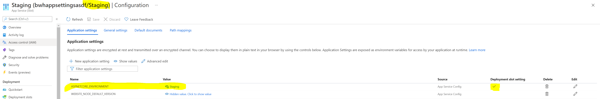
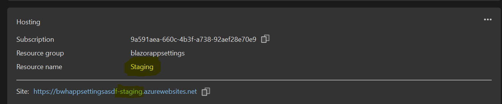
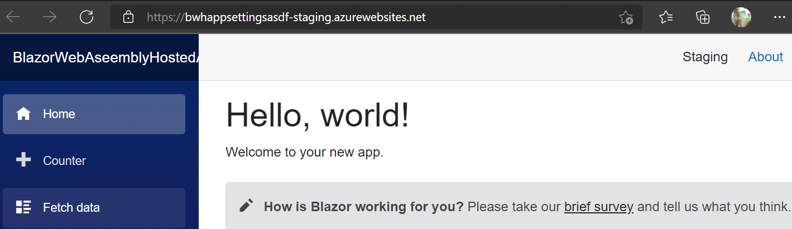
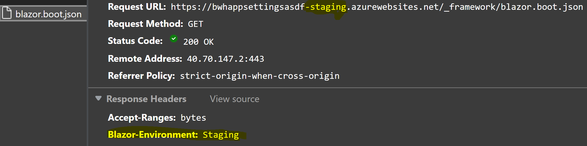
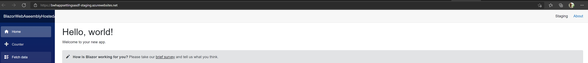

# ASP.NET Core Blazor environments

::: moniker range=">= aspnetcore-6.0"

> [!NOTE]
> This topic applies to Blazor WebAssembly. For general guidance on ASP.NET Core app configuration, which describes the approaches to use for Blazor Server apps, see <xref:fundamentals/environments>.

When running an app locally, the environment defaults to `Development`. When the app is published, the environment defaults to `Production`.

The environment is set using any of the following approaches:

* [Blazor start configuration](#set-the-environment-via-startup-configuration)
* [`Blazor-Environment` header](#set-the-environment-via-header)
* [Azure App Service](#set-the-environment-for-azure-app-service)

The client-side Blazor app (**`Client`**) of a hosted Blazor WebAssembly solution determines the environment from the **`Server`** app of the solution via a middleware that communicates the environment to the browser. The **`Server`** app adds a header named `Blazor-Environment` with the environment as the value of the header. The **`Client`** app reads the header. The **`Server`** app of the solution is an ASP.NET Core app, so more information on how to configure the environment is found in <xref:fundamentals/environments>.

For a standalone Blazor WebAssembly app running locally, the development server adds the `Blazor-Environment` header to specify the `Development` environment.

## Set the environment via startup configuration

The following example starts Blazor in the Staging environment:

```cshtml
<body>
    ...

    <script src="_framework/blazor.{webassembly|server}.js" autostart="false"></script>
    <script>
      Blazor.start({
        environment: "Staging"
      });
    </script>
</body>
```

Using the `environment` property overrides the environment set by the [`Blazor-Environment` header](#set-the-environment-via-header).

For more information on Blazor startup, see <xref:blazor/fundamentals/startup>.

## Set the environment via header

To specify the environment for other hosting environments, add the `Blazor-Environment` header.

In the following example for IIS, the custom header (`Blazor-Environment`) is added to the published `web.config` file. The `web.config` file is located in the `bin/Release/{TARGET FRAMEWORK}/publish` folder, where the placeholder `{TARGET FRAMEWORK}` is the target framework:

```xml
<?xml version="1.0" encoding="UTF-8"?>
<configuration>
  <system.webServer>

    ...

    <httpProtocol>
      <customHeaders>
        <add name="Blazor-Environment" value="Staging" />
      </customHeaders>
    </httpProtocol>
  </system.webServer>
</configuration>
```

> [!NOTE]
> To use a custom `web.config` file for IIS that isn't overwritten when the app is published to the `publish` folder, see <xref:blazor/host-and-deploy/webassembly#use-a-custom-webconfig>.

## Set the environment for Azure App Service

***The guidance in this section requires the use of a hosted Blazor WebAssembly app.***

> [!NOTE]
> **Standalone Blazor WebAssembly apps**
>
> For standalone Blazor Webassembly apps, set the environment manually via [start configuration](#set-the-environment-via-startup-configuration) or the [`Blazor-Environment` header](#set-the-environment-via-header).
>
> **Apps built and deployed with continuous integration (CI)**
>
> For app's built and deployed by a continuous integration (CI) process, you might be able to use a [JS Initializer](xref:blazor/js-interop/index#javascript-initializers) in conjunction with a build environment variable in the CI process to add an initializer specific to the environment as part of the build.

Use the following guidance for hosted Blazor WebAssembly solutions hosted by Azure App Service:

1. Confirm that the casing of environment segments in app settings filenames matches their environment name casing ***exactly***. For example, the matching app settings filename for the `Staging` environment is `appsettings.Staging.json`. If the filename is `appsettings.staging.json` (lowercase "`s`"), the file isn't located, and the settings in the file aren't used in the `Staging` environment.

1. In the Azure portal for the environment's deployment slot, set the environment with the `ASPNETCORE_ENVIRONMENT` app setting. In the following example for the `Staging` deployment slot, the app setting is set to `Staging`:

   

1. For Visual Studio deployment, confirm that the app is deployed to the correct deployment slot. In the following example, the app deploys from Visual Studio to the `Staging` deployment slot:

   

The app loads in the specified environment with the correct settings. In the following example, the app loads from the `Staging` deployment slot at the URL `https://bwhappsettingsasdf-staging.azurewebsites.net`:



In the response header collection for `blazor.boot.json`, the `Blazor-Environment` header indicates the environment. In the following example, the `Blazor-Environment` header is inspected in the browser's developer tools and has a value of `Staging`:



App settings from the files `appsettings.json` and `appsettings.{ENVIRONMENT}.json` (the `{ENVIRONMENT}` placeholder is the app's environment) are loaded by the app. In the following example, the app's settings files are loaded according to the browser's developer tools, which includes the settings file for the `Staging` environment (`appsettings.Staging.json`):



## Read the environment

Obtain the app's environment in a component by injecting <xref:Microsoft.AspNetCore.Components.WebAssembly.Hosting.IWebAssemblyHostEnvironment> and reading the <xref:Microsoft.AspNetCore.Components.WebAssembly.Hosting.IWebAssemblyHostEnvironment.Environment> property.

`Pages/ReadEnvironment.razor`:

[!code-razor[](~/blazor/samples/6.0/BlazorSample_WebAssembly/Pages/environments/ReadEnvironment.razor?highlight=3,7)]

During startup, the <xref:Microsoft.AspNetCore.Components.WebAssembly.Hosting.WebAssemblyHostBuilder> exposes the <xref:Microsoft.AspNetCore.Components.WebAssembly.Hosting.IWebAssemblyHostEnvironment> through the <xref:Microsoft.AspNetCore.Components.WebAssembly.Hosting.WebAssemblyHostBuilder.HostEnvironment> property, which enables environment-specific logic in host builder code.

In `Program.cs`:

```csharp
if (builder.HostEnvironment.Environment == "Custom")
{
    ...
};
```

The following convenience extension methods provided through <xref:Microsoft.AspNetCore.Components.WebAssembly.Hosting.WebAssemblyHostEnvironmentExtensions> permit checking the current environment for `Development`, `Production`, `Staging`, and custom environment names:

* <xref:Microsoft.AspNetCore.Components.WebAssembly.Hosting.WebAssemblyHostEnvironmentExtensions.IsDevelopment%2A>
* <xref:Microsoft.AspNetCore.Components.WebAssembly.Hosting.WebAssemblyHostEnvironmentExtensions.IsProduction%2A>
* <xref:Microsoft.AspNetCore.Components.WebAssembly.Hosting.WebAssemblyHostEnvironmentExtensions.IsStaging%2A>
* <xref:Microsoft.AspNetCore.Components.WebAssembly.Hosting.WebAssemblyHostEnvironmentExtensions.IsEnvironment%2A>

In `Program.cs`:

```csharp
if (builder.HostEnvironment.IsStaging())
{
    ...
};

if (builder.HostEnvironment.IsEnvironment("Custom"))
{
    ...
};
```

The <xref:Microsoft.AspNetCore.Components.WebAssembly.Hosting.IWebAssemblyHostEnvironment.BaseAddress?displayProperty=nameWithType> property can be used during startup when the <xref:Microsoft.AspNetCore.Components.NavigationManager> service isn't available.

## Additional resources

* <xref:blazor/fundamentals/startup>
* <xref:fundamentals/environments>

::: moniker-end

::: moniker range=">= aspnetcore-5.0 < aspnetcore-6.0"

> [!NOTE]
> This topic applies to Blazor WebAssembly. For general guidance on ASP.NET Core app configuration, which describes the approaches to use for Blazor Server apps, see <xref:fundamentals/environments>.

When running an app locally, the environment defaults to `Development`. When the app is published, the environment defaults to Production.

The environment is set using any of the following approaches:

* [Blazor start configuration](#set-the-environment-via-startup-configuration)
* [`Blazor-Environment` header](#set-the-environment-via-header)
* [Azure App Service](#set-the-environment-for-azure-app-service)

The client-side Blazor app (**`Client`**) of a hosted Blazor WebAssembly solution determines the environment from the **`Server`** app of the solution via a middleware that communicates the environment to the browser. The **`Server`** app adds a header named `Blazor-Environment` with the environment as the value of the header. The **`Client`** app reads the header. The **`Server`** app of the solution is an ASP.NET Core app, so more information on how to configure the environment is found in <xref:fundamentals/environments>.

For a standalone Blazor WebAssembly app running locally, the development server adds the `Blazor-Environment` header to specify the `Development` environment.

## Set the environment via startup configuration

The following example starts Blazor in the Staging environment:

```cshtml
<body>
    ...

    <script src="_framework/blazor.{webassembly|server}.js" autostart="false"></script>
    <script>
      Blazor.start({
        environment: "Staging"
      });
    </script>
</body>
```

Using the `environment` property overrides the environment set by the [`Blazor-Environment` header](#set-the-environment-via-header).

For more information on Blazor startup, see <xref:blazor/fundamentals/startup>.

## Set the environment via header

To specify the environment for other hosting environments, add the `Blazor-Environment` header.

In the following example for IIS, the custom header (`Blazor-Environment`) is added to the published `web.config` file. The `web.config` file is located in the `bin/Release/{TARGET FRAMEWORK}/publish` folder, where the placeholder `{TARGET FRAMEWORK}` is the target framework:

```xml
<?xml version="1.0" encoding="UTF-8"?>
<configuration>
  <system.webServer>

    ...

    <httpProtocol>
      <customHeaders>
        <add name="Blazor-Environment" value="Staging" />
      </customHeaders>
    </httpProtocol>
  </system.webServer>
</configuration>
```

> [!NOTE]
> To use a custom `web.config` file for IIS that isn't overwritten when the app is published to the `publish` folder, see <xref:blazor/host-and-deploy/webassembly#use-a-custom-webconfig>.

## Set the environment for Azure App Service

***The guidance in this section requires the use of a hosted Blazor WebAssembly app.***

> [!NOTE]
> **Standalone Blazor WebAssembly apps**
>
> For standalone Blazor Webassembly apps, set the environment manually via [start configuration](#set-the-environment-via-startup-configuration) or the [`Blazor-Environment` header](#set-the-environment-via-header).
>
> **Apps built and deployed with continuous integration (CI)**
>
> For app's built and deployed by a continuous integration (CI) process, you might be able to use a [JS Initializer](xref:blazor/js-interop/index#javascript-initializers) in conjunction with a build environment variable in the CI process to add an initializer specific to the environment as part of the build.

Use the following guidance for hosted Blazor WebAssembly solutions hosted by Azure App Service:

1. Confirm that the casing of environment segments in app settings filenames matches their environment name casing ***exactly***. For example, the matching app settings filename for the `Staging` environment is `appsettings.Staging.json`. If the filename is `appsettings.staging.json` (lowercase "`s`"), the file isn't located, and the settings in the file aren't used in the `Staging` environment.

1. In the Azure portal for the environment's deployment slot, set the environment with the `ASPNETCORE_ENVIRONMENT` app setting. In the following example for the `Staging` deployment slot, the app setting is set to `Staging`:

   

1. For Visual Studio deployment, confirm that the app is deployed to the correct deployment slot. In the following example, the app deploys from Visual Studio to the `Staging` deployment slot:

   

The app loads in the specified environment with the correct settings. In the following example, the app loads from the `Staging` deployment slot at the URL `https://bwhappsettingsasdf-staging.azurewebsites.net`:


In the response header collection for `blazor.boot.json`, the `Blazor-Environment` header indicates the environment. In the following example, the `Blazor-Environment` header is inspected in the browser's developer tools and has a value of `Staging`:


App settings from the files `appsettings.json` and `appsettings.{ENVIRONMENT}.json` (the `{ENVIRONMENT}` placeholder is the app's environment) are loaded by the app. In the following example, the app's settings files are loaded according to the browser's developer tools, which includes the settings file for the `Staging` environment (`appsettings.Staging.json`):


## Read the environment

Obtain the app's environment in a component by injecting <xref:Microsoft.AspNetCore.Components.WebAssembly.Hosting.IWebAssemblyHostEnvironment> and reading the <xref:Microsoft.AspNetCore.Components.WebAssembly.Hosting.IWebAssemblyHostEnvironment.Environment> property.

`Pages/ReadEnvironment.razor`:

[!code-razor[](~/blazor/samples/5.0/BlazorSample_WebAssembly/Pages/environments/ReadEnvironment.razor?highlight=3,7)]

During startup, the <xref:Microsoft.AspNetCore.Components.WebAssembly.Hosting.WebAssemblyHostBuilder> exposes the <xref:Microsoft.AspNetCore.Components.WebAssembly.Hosting.IWebAssemblyHostEnvironment> through the <xref:Microsoft.AspNetCore.Components.WebAssembly.Hosting.WebAssemblyHostBuilder.HostEnvironment> property, which enables environment-specific logic in host builder code.

In `Program.cs`:

```csharp
if (builder.HostEnvironment.Environment == "Custom")
{
    ...
};
```

The following convenience extension methods provided through <xref:Microsoft.AspNetCore.Components.WebAssembly.Hosting.WebAssemblyHostEnvironmentExtensions> permit checking the current environment for `Development`, `Production`, `Staging`, and custom environment names:

* <xref:Microsoft.AspNetCore.Components.WebAssembly.Hosting.WebAssemblyHostEnvironmentExtensions.IsDevelopment%2A>
* <xref:Microsoft.AspNetCore.Components.WebAssembly.Hosting.WebAssemblyHostEnvironmentExtensions.IsProduction%2A>
* <xref:Microsoft.AspNetCore.Components.WebAssembly.Hosting.WebAssemblyHostEnvironmentExtensions.IsStaging%2A>
* <xref:Microsoft.AspNetCore.Components.WebAssembly.Hosting.WebAssemblyHostEnvironmentExtensions.IsEnvironment%2A>

In `Program.cs`:

```csharp
if (builder.HostEnvironment.IsStaging())
{
    ...
};

if (builder.HostEnvironment.IsEnvironment("Custom"))
{
    ...
};
```

The <xref:Microsoft.AspNetCore.Components.WebAssembly.Hosting.IWebAssemblyHostEnvironment.BaseAddress?displayProperty=nameWithType> property can be used during startup when the <xref:Microsoft.AspNetCore.Components.NavigationManager> service isn't available.

## Additional resources

* <xref:blazor/fundamentals/startup>
* <xref:fundamentals/environments>

::: moniker-end

::: moniker range="< aspnetcore-5.0"

> [!NOTE]
> This topic applies to Blazor WebAssembly. For general guidance on ASP.NET Core app configuration, which describes the approaches to use for Blazor Server apps, see <xref:fundamentals/environments>.

When running an app locally, the environment defaults to `Development`. When the app is published, the environment defaults to Production.

The client-side Blazor app (**`Client`**) of a hosted Blazor WebAssembly solution determines the environment from the **`Server`** app of the solution via a middleware that communicates the environment to the browser. The **`Server`** app adds a header named `Blazor-Environment` with the environment as the value of the header. The **`Client`** app reads the header. The **`Server`** app of the solution is an ASP.NET Core app, so more information on how to configure the environment is found in <xref:fundamentals/environments>.

For a standalone Blazor WebAssembly app running locally, the development server adds the `Blazor-Environment` header to specify the `Development` environment.

For app's deployed to Azure App Service, see the [Azure App Service](#set-the-environment-for-azure-app-service) section.

## Set the environment via header

To specify the environment for other hosting environments, add the `Blazor-Environment` header.

In the following example for IIS, the custom header (`Blazor-Environment`) is added to the published `web.config` file. The `web.config` file is located in the `bin/Release/{TARGET FRAMEWORK}/publish` folder, where the placeholder `{TARGET FRAMEWORK}` is the target framework:

```xml
<?xml version="1.0" encoding="UTF-8"?>
<configuration>
  <system.webServer>

    ...

    <httpProtocol>
      <customHeaders>
        <add name="Blazor-Environment" value="Staging" />
      </customHeaders>
    </httpProtocol>
  </system.webServer>
</configuration>
```

> [!NOTE]
> To use a custom `web.config` file for IIS that isn't overwritten when the app is published to the `publish` folder, see <xref:blazor/host-and-deploy/webassembly#use-a-custom-webconfig>.

## Set the environment for Azure App Service

***The guidance in this section requires the use of a hosted Blazor WebAssembly app.***

> [!NOTE]
> **Standalone Blazor WebAssembly apps**
>
> For standalone Blazor Webassembly apps, set the environment manually via [start configuration](#set-the-environment-via-startup-configuration) or the [`Blazor-Environment` header](#set-the-environment-via-header).
>
> **Apps built and deployed with continuous integration (CI)**
>
> For app's built and deployed by a continuous integration (CI) process, you might be able to use a [JS Initializer](xref:blazor/js-interop/index#javascript-initializers) in conjunction with a build environment variable in the CI process to add an initializer specific to the environment as part of the build.

Use the following guidance for hosted Blazor WebAssembly solutions hosted by Azure App Service:

1. Confirm that the casing of environment segments in app settings filenames matches their environment name casing ***exactly***. For example, the matching app settings filename for the `Staging` environment is `appsettings.Staging.json`. If the filename is `appsettings.staging.json` (lowercase "`s`"), the file isn't located, and the settings in the file aren't used in the `Staging` environment.

1. In the Azure portal for the environment's deployment slot, set the environment with the `ASPNETCORE_ENVIRONMENT` app setting. In the following example for the `Staging` deployment slot, the app setting is set to `Staging`:

   

1. For Visual Studio deployment, confirm that the app is deployed to the correct deployment slot. In the following example, the app deploys from Visual Studio to the `Staging` deployment slot:

   

The app loads in the specified environment with the correct settings. In the following example, the app loads from the `Staging` deployment slot at the URL `https://bwhappsettingsasdf-staging.azurewebsites.net`:


In the response header collection for `blazor.boot.json`, the `Blazor-Environment` header indicates the environment. In the following example, the `Blazor-Environment` header is inspected in the browser's developer tools and has a value of `Staging`:


App settings from the files `appsettings.json` and `appsettings.{ENVIRONMENT}.json` (the `{ENVIRONMENT}` placeholder is the app's environment) are loaded by the app. In the following example, the app's settings files are loaded according to the browser's developer tools, which includes the settings file for the `Staging` environment (`appsettings.Staging.json`):


## Read the environment

Obtain the app's environment in a component by injecting <xref:Microsoft.AspNetCore.Components.WebAssembly.Hosting.IWebAssemblyHostEnvironment> and reading the <xref:Microsoft.AspNetCore.Components.WebAssembly.Hosting.IWebAssemblyHostEnvironment.Environment> property.

`Pages/ReadEnvironment.razor`:

[!code-razor[](~/blazor/samples/3.1/BlazorSample_WebAssembly/Pages/environments/ReadEnvironment.razor?highlight=3,7)]

During startup, the <xref:Microsoft.AspNetCore.Components.WebAssembly.Hosting.WebAssemblyHostBuilder> exposes the <xref:Microsoft.AspNetCore.Components.WebAssembly.Hosting.IWebAssemblyHostEnvironment> through the <xref:Microsoft.AspNetCore.Components.WebAssembly.Hosting.WebAssemblyHostBuilder.HostEnvironment> property, which enables environment-specific logic in host builder code.

In `Program.cs`:

```csharp
if (builder.HostEnvironment.Environment == "Custom")
{
    ...
};
```

The following convenience extension methods provided through <xref:Microsoft.AspNetCore.Components.WebAssembly.Hosting.WebAssemblyHostEnvironmentExtensions> permit checking the current environment for `Development`, `Production`, `Staging`, and custom environment names:

* <xref:Microsoft.AspNetCore.Components.WebAssembly.Hosting.WebAssemblyHostEnvironmentExtensions.IsDevelopment%2A>
* <xref:Microsoft.AspNetCore.Components.WebAssembly.Hosting.WebAssemblyHostEnvironmentExtensions.IsProduction%2A>
* <xref:Microsoft.AspNetCore.Components.WebAssembly.Hosting.WebAssemblyHostEnvironmentExtensions.IsStaging%2A>
* <xref:Microsoft.AspNetCore.Components.WebAssembly.Hosting.WebAssemblyHostEnvironmentExtensions.IsEnvironment%2A>

In `Program.cs`:

```csharp
if (builder.HostEnvironment.IsStaging())
{
    ...
};

if (builder.HostEnvironment.IsEnvironment("Custom"))
{
    ...
};
```

The <xref:Microsoft.AspNetCore.Components.WebAssembly.Hosting.IWebAssemblyHostEnvironment.BaseAddress?displayProperty=nameWithType> property can be used during startup when the <xref:Microsoft.AspNetCore.Components.NavigationManager> service isn't available.

## Additional resources

* <xref:blazor/fundamentals/startup>
* <xref:fundamentals/environments>

::: moniker-end
