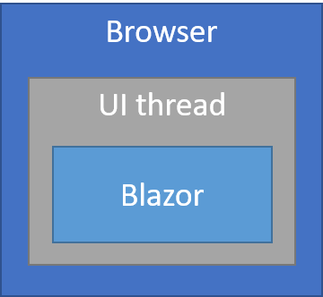
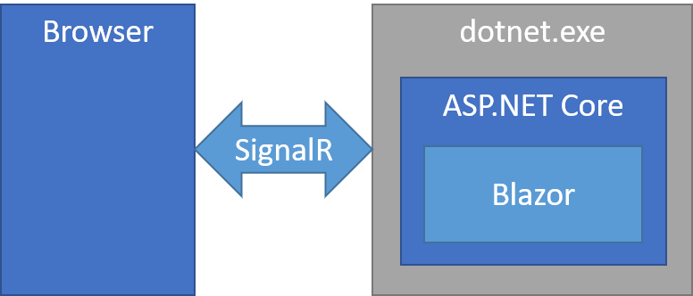

# ASP.NET Core Blazor hosting models

By [Daniel Roth](https://github.com/danroth27)

[!INCLUDE[](~/includes/blazorwasm-preview-notice.md)]

Blazor is a web framework designed to run client-side in the browser on a [WebAssembly](https://webassembly.org/)-based .NET runtime (*Blazor WebAssembly*) or server-side in ASP.NET Core (*Blazor Server*). Regardless of the hosting model, the app and component models *are the same*.

To create a project for the hosting models described in this article, see <xref:blazor/get-started>.

## Blazor WebAssembly

The principal hosting model for Blazor is running client-side in the browser on WebAssembly. The Blazor app, its dependencies, and the .NET runtime are downloaded to the browser. The app is executed directly on the browser UI thread. UI updates and event handling occur within the same process. The app's assets are deployed as static files to a web server or service capable of serving static content to clients.



To create a Blazor app using the client-side hosting model, use the **Blazor WebAssembly App** template ([dotnet new blazorwasm](/dotnet/core/tools/dotnet-new)).

After selecting the **Blazor WebAssembly App** template, you have the option of configuring the app to use an ASP.NET Core backend by selecting the **ASP.NET Core hosted** check box ([dotnet new blazorwasm --hosted](/dotnet/core/tools/dotnet-new)). The ASP.NET Core app serves the Blazor app to clients. The Blazor WebAssembly app can interact with the server over the network using web API calls or [SignalR](xref:signalr/introduction).

The templates include the `blazor.webassembly.js` script that handles:

* Downloading the .NET runtime, the app, and the app's dependencies.
* Initialization of the runtime to run the app.

The Blazor WebAssembly hosting model offers several benefits:

* There's no .NET server-side dependency. The app is fully functioning after downloaded to the client.
* Client resources and capabilities are fully leveraged.
* Work is offloaded from the server to the client.
* An ASP.NET Core web server isn't required to host the app. Serverless deployment scenarios are possible (for example, serving the app from a CDN).

There are downsides to Blazor WebAssembly hosting:

* The app is restricted to the capabilities of the browser.
* Capable client hardware and software (for example, WebAssembly support) is required.
* Download size is larger, and apps take longer to load.
* .NET runtime and tooling support is less mature. For example, limitations exist in [.NET Standard](/dotnet/standard/net-standard) support and debugging.

## Blazor Server

With the Blazor Server hosting model, the app is executed on the server from within an ASP.NET Core app. UI updates, event handling, and JavaScript calls are handled over a [SignalR](xref:signalr/introduction) connection.



To create a Blazor app using the Blazor Server hosting model, use the ASP.NET Core **Blazor Server App** template ([dotnet new blazorserver](/dotnet/core/tools/dotnet-new)). The ASP.NET Core app hosts the Blazor Server app and creates the SignalR endpoint where clients connect.

The ASP.NET Core app references the app's `Startup` class to add:

* Server-side services.
* The app to the request handling pipeline.

The `blazor.server.js` script&dagger; establishes the client connection. It's the app's responsibility to persist and restore app state as required (for example, in the event of a lost network connection).

The Blazor Server hosting model offers several benefits:

* Download size is significantly smaller than a Blazor WebAssembly app, and the app loads much faster.
* The app takes full advantage of server capabilities, including use of any .NET Core compatible APIs.
* .NET Core on the server is used to run the app, so existing .NET tooling, such as debugging, works as expected.
* Thin clients are supported. For example, Blazor Server apps work with browsers that don't support WebAssembly and on resource-constrained devices.
* The app's .NET/C# code base, including the app's component code, isn't served to clients.

There are downsides to Blazor Server hosting:

* Higher latency usually exists. Every user interaction involves a network hop.
* There's no offline support. If the client connection fails, the app stops working.
* Scalability is challenging for apps with many users. The server must manage multiple client connections and handle client state.
* An ASP.NET Core server is required to serve the app. Serverless deployment scenarios aren't possible (for example, serving the app from a CDN).

&dagger;The `blazor.server.js` script is served from an embedded resource in the ASP.NET Core shared framework.

### Comparison to server-rendered UI

One way to understand Blazor Server apps is to understand how it differs from traditional models for rendering UI in ASP.NET Core apps using Razor views or Razor Pages. Both models use the Razor language to describe HTML content, but they significantly differ in how markup is rendered.

When a Razor Page or view is rendered, every line of Razor code emits HTML in text form. After rendering, the server disposes of the page or view instance, including any state that was produced. When another request for the page occurs, for instance when server validation fails and the validation summary is displayed:

* The entire page is rerendered to HTML text again.
* The page is sent to the client.

A Blazor app is composed of reusable elements of UI called *components*. A component contains C# code, markup, and other components. When a component is rendered, Blazor produces a graph of the included components similar to an HTML or XML Document Object Model (DOM). This graph includes component state held in properties and fields. Blazor evaluates the component graph to produce a binary representation of the markup. The binary format can be:

* Turned into HTML text (during prerendering).
* Used to efficiently update the markup during regular rendering.

A UI update in Blazor is triggered by:

* User interaction, such as selecting a button.
* App triggers, such as a timer.

The graph is rerendered, and a UI *diff* (difference) is calculated. This diff is the smallest set of DOM edits required to update the UI on the client. The diff is sent to the client in a binary format and applied by the browser.

A component is disposed after the user navigates away from it on the client. While a user is interacting with a component, the component's state (services, resources) must be held in the server's memory. Because the state of many components might be maintained by the server concurrently, memory exhaustion is a concern that must be addressed. For guidance on how to author a Blazor Server app to ensure the best use of server memory, see <xref:security/blazor/server>.

### Integrate Razor components into Razor Pages and MVC apps

#### Use components in pages and views

An existing Razor Pages or MVC app can integrate Razor components into pages and views:

1. In the app's layout file (*_Layout.cshtml*):

   * Add the following `<base>` tag to the `<head>` element:

     ```html
     <base href="~/" />
     ```

     The `href` value (the *app base path*) in the preceding example assumes that the app resides at the root URL path (`/`). If the app is a sub-application, follow the guidance in the *App base path* section of the <xref:host-and-deploy/blazor/index#app-base-path> article.

     The *_Layout.cshtml* file is located in the *Pages/Shared* folder in a Razor Pages app or *Views/Shared* folder in an MVC app.

   * Add a `<script>` tag for the *blazor.server.js* script inside of the closing `</body>` tag:

     ```html
     <script src="_framework/blazor.server.js"></script>
     ```

     The framework adds the *blazor.server.js* script to the app. There's no need to manually add the script to the app.

1. Add an *_Imports.razor* file to the root folder of the project with the following content (change the last namespace, `MyAppNamespace`, to the namespace of the app):

   ```csharp
   @using System.Net.Http
   @using Microsoft.AspNetCore.Authorization
   @using Microsoft.AspNetCore.Components.Authorization
   @using Microsoft.AspNetCore.Components.Forms
   @using Microsoft.AspNetCore.Components.Routing
   @using Microsoft.AspNetCore.Components.Web
   @using Microsoft.JSInterop
   @using MyAppNamespace
   ```

1. In `Startup.ConfigureServices`, add the Blazor Server service:

   ```csharp
   services.AddServerSideBlazor();
   ```

1. In `Startup.Configure`, add the Blazor Hub endpoint to `app.UseEndpoints`:

   ```csharp
   endpoints.MapBlazorHub();
   ```

1. Integrate components into any page or view. For more information, see the *Integrate components into Razor Pages and MVC apps* section of the <xref:blazor/components#integrate-components-into-razor-pages-and-mvc-apps> article.

#### Use routable components in a Razor Pages app

To support routable Razor components in Razor Pages apps:

1. Follow the guidance in the [Use components in pages and views](#use-components-in-pages-and-views) section.

1. Add an *App.razor* file to the root of the project with the following content:

   ```razor
   @using Microsoft.AspNetCore.Components.Routing

   <Router AppAssembly="typeof(Program).Assembly">
       <Found Context="routeData">
           <RouteView RouteData="routeData" />
       </Found>
       <NotFound>
           <h1>Page not found</h1>
           <p>Sorry, but there's nothing here!</p>
       </NotFound>
   </Router>
   ```

1. Add a *_Host.cshtml* file to the *Pages* folder with the following content:

   ```cshtml
   @page "/blazor"
   @{
       Layout = "_Layout";
   }

   <app>
       <component type="typeof(App)" render-mode="ServerPrerendered" />
   </app>
   ```

   Components use the shared *_Layout.cshtml* file for their layout.

1. Add a low-priority route for the *_Host.cshtml* page to endpoint configuration in `Startup.Configure`:

   ```csharp
   app.UseEndpoints(endpoints =>
   {
       ...

       endpoints.MapFallbackToPage("/_Host");
   });
   ```

1. Add routable components to the app. For example:

   ```razor
   @page "/counter"

   <h1>Counter</h1>

   ...
   ```

   When using a custom folder to hold the app's components, add the namespace representing the folder to the *Pages/_ViewImports.cshtml* file. For more information, see <xref:blazor/components#integrate-components-into-razor-pages-and-mvc-apps>.

#### Use routable components in an MVC app

To support routable Razor components in MVC apps:

1. Follow the guidance in the [Use components in pages and views](#use-components-in-pages-and-views) section.

1. Add an *App.razor* file to the root of the project with the following content:

   ```razor
   @using Microsoft.AspNetCore.Components.Routing

   <Router AppAssembly="typeof(Program).Assembly">
       <Found Context="routeData">
           <RouteView RouteData="routeData" />
       </Found>
       <NotFound>
           <h1>Page not found</h1>
           <p>Sorry, but there's nothing here!</p>
       </NotFound>
   </Router>
   ```

1. Add a *_Host.cshtml* file to the *Views/Home* folder with the following content:

   ```cshtml
   @{
       Layout = "_Layout";
   }

   <app>
       <component type="typeof(App)" render-mode="ServerPrerendered" />
   </app>
   ```

   Components use the shared *_Layout.cshtml* file for their layout.

1. Add an action to the Home controller:

   ```csharp
   public IActionResult Blazor()
   {
      return View("_Host");
   }
   ```

1. Add a low-priority route for the controller action that returns the *_Host.cshtml* view to the endpoint configuration in `Startup.Configure`:

   ```csharp
   app.UseEndpoints(endpoints =>
   {
       ...

       endpoints.MapFallbackToController("Blazor", "Home");
   });
   ```

1. Create a *Pages* folder and add routable components to the app. For example:

   ```razor
   @page "/counter"

   <h1>Counter</h1>

   ...
   ```

   When using a custom folder to hold the app's components, add the namespace representing the folder to the *Views/_ViewImports.cshtml* file. For more information, see <xref:blazor/components#integrate-components-into-razor-pages-and-mvc-apps>.

### Circuits

A Blazor Server app is built on top of [ASP.NET Core SignalR](xref:signalr/introduction). Each client communicates to the server over one or more SignalR connections called a *circuit*. A circuit is Blazor's abstraction over SignalR connections that can tolerate temporary network interruptions. When a Blazor client sees that the SignalR connection is disconnected, it attempts to reconnect to the server using a new SignalR connection.

Each browser screen (browser tab or iframe) that is connected to a Blazor Server app uses a SignalR connection. This is yet another important distinction compared to typical server-rendered apps. In a server-rendered app, opening the same app in multiple browser screens typically doesn't translate into additional resource demands on the server. In a Blazor Server app, each browser screen requires a separate circuit and separate instances of component state to be managed by the server.

Blazor considers closing a browser tab or navigating to an external URL a *graceful* termination. In the event of a graceful termination, the circuit and associated resources are immediately released. A client may also disconnect non-gracefully, for instance due to a network interruption. Blazor Server stores disconnected circuits for a configurable interval to allow the client to reconnect. For more information, see the [Reconnection to the same server](#reconnection-to-the-same-server) section.

### UI Latency

UI latency is the time it takes from an initiated action to the time the UI is updated. Smaller values for UI latency are imperative for an app to feel responsive to a user. In a Blazor Server app, each action is sent to the server, processed, and a UI diff is sent back. Consequently, UI latency is the sum of network latency and the server latency in processing the action.

For a line of business app that's limited to a private corporate network, the effect on user perceptions of latency due to network latency are usually imperceptible. For an app deployed over the Internet, latency may become noticeable to users, particularly if users are widely distributed geographically.

Memory usage can also contribute to app latency. Increased memory usage results in frequent garbage collection or paging memory to disk, both of which degrade app performance and consequently increase UI latency. For more information, see <xref:security/blazor/server>.

Blazor Server apps should be optimized to minimize UI latency by reducing network latency and memory usage. For an approach to measuring network latency, see <xref:host-and-deploy/blazor/server#measure-network-latency>. For more information on SignalR and Blazor, see:

* <xref:host-and-deploy/blazor/server>
* <xref:security/blazor/server>

### Connection to the server

Blazor Server apps require an active SignalR connection to the server. If the connection is lost, the app attempts to reconnect to the server. As long as the client's state is still in memory, the client session resumes without losing state.

#### Reconnection to the same server

A Blazor Server app prerenders in response to the first client request, which sets up the UI state on the server. When the client attempts to create a SignalR connection, the client must reconnect to the same server. Blazor Server apps that use more than one backend server should implement *sticky sessions* for SignalR connections.

We recommend using the [Azure SignalR Service](/azure/azure-signalr) for Blazor Server apps. The service allows for scaling up a Blazor Server app to a large number of concurrent SignalR connections. Sticky sessions are enabled for the Azure SignalR Service by setting the service's `ServerStickyMode` option or configuration value to `Required`. For more information, see <xref:host-and-deploy/blazor/server#signalr-configuration>.

When using IIS, sticky sessions are enabled with Application Request Routing. For more information, see [HTTP Load Balancing using Application Request Routing](/iis/extensions/configuring-application-request-routing-arr/http-load-balancing-using-application-request-routing).

#### Reflect the connection state in the UI

When the client detects that the connection has been lost, a default UI is displayed to the user while the client attempts to reconnect. If reconnection fails, the user is provided the option to retry.

To customize the UI, define an element with an `id` of `components-reconnect-modal` in the `<body>` of the *_Host.cshtml* Razor page:

```cshtml
<div id="components-reconnect-modal">
    ...
</div>
```

The following table describes the CSS classes applied to the `components-reconnect-modal` element.

| CSS class                       | Indicates&hellip; |
| ------------------------------- | ------------------------- |
| `components-reconnect-show`     | A lost connection. The client is attempting to reconnect. Show the modal. |
| `components-reconnect-hide`     | An active connection is re-established to the server. Hide the modal. |
| `components-reconnect-failed`   | Reconnection failed, probably due to a network failure. To attempt reconnection, call `window.Blazor.reconnect()`. |
| `components-reconnect-rejected` | Reconnection rejected. The server was reached but refused the connection, and the user's state on the server is lost. To reload the app, call `location.reload()`. This connection state may result when:<ul><li>A crash in the server-side circuit occurs.</li><li>The client is disconnected long enough for the server to drop the user's state. Instances of the components that the user is interacting with are disposed.</li><li>The server is restarted, or the app's worker process is recycled.</li></ul> |

### Stateful reconnection after prerendering

Blazor Server apps are set up by default to prerender the UI on the server before the client connection to the server is established. This is set up in the *_Host.cshtml* Razor page:

```cshtml
<body>
    <app>
      <component type="typeof(App)" render-mode="ServerPrerendered" />
    </app>

    <script src="_framework/blazor.server.js"></script>
</body>
```

`RenderMode` configures whether the component:

* Is prerendered into the page.
* Is rendered as static HTML on the page or if it includes the necessary information to bootstrap a Blazor app from the user agent.

| `RenderMode`        | Description |
| ------------------- | ----------- |
| `ServerPrerendered` | Renders the component into static HTML and includes a marker for a Blazor Server app. When the user-agent starts, this marker is used to bootstrap a Blazor app. |
| `Server`            | Renders a marker for a Blazor Server app. Output from the component isn't included. When the user-agent starts, this marker is used to bootstrap a Blazor app. |
| `Static`            | Renders the component into static HTML. |

Rendering server components from a static HTML page isn't supported.

When `RenderMode` is `ServerPrerendered`, the component is initially rendered statically as part of the page. Once the browser establishes a connection back to the server, the component is rendered *again*, and the component is now interactive. If the [OnInitialized{Async}](xref:blazor/lifecycle#component-initialization-methods) lifecycle method for initializing the component is present, the method is executed *twice*:

* When the component is prerendered statically.
* After the server connection has been established.

This can result in a noticeable change in the data displayed in the UI when the component is finally rendered.

To avoid the double-rendering scenario in a Blazor Server app:

* Pass in an identifier that can be used to cache the state during prerendering and to retrieve the state after the app restarts.
* Use the identifier during prerendering to save component state.
* Use the identifier after prerendering to retrieve the cached state.

The following code demonstrates an updated `WeatherForecastService` in a template-based Blazor Server app that avoids the double rendering:

```csharp
public class WeatherForecastService
{
    private static readonly string[] Summaries = new[]
    {
        "Freezing", "Bracing", "Chilly", "Cool", "Mild",
        "Warm", "Balmy", "Hot", "Sweltering", "Scorching"
    };
    
    public WeatherForecastService(IMemoryCache memoryCache)
    {
        MemoryCache = memoryCache;
    }
    
    public IMemoryCache MemoryCache { get; }

    public Task<WeatherForecast[]> GetForecastAsync(DateTime startDate)
    {
        return MemoryCache.GetOrCreateAsync(startDate, async e =>
        {
            e.SetOptions(new MemoryCacheEntryOptions
            {
                AbsoluteExpirationRelativeToNow = 
                    TimeSpan.FromSeconds(30)
            });

            var rng = new Random();

            await Task.Delay(TimeSpan.FromSeconds(10));

            return Enumerable.Range(1, 5).Select(index => new WeatherForecast
            {
                Date = startDate.AddDays(index),
                TemperatureC = rng.Next(-20, 55),
                Summary = Summaries[rng.Next(Summaries.Length)]
            }).ToArray();
        });
    }
}
```

### Render stateful interactive components from Razor pages and views

Stateful interactive components can be added to a Razor page or view.

When the page or view renders:

* The component is prerendered with the page or view.
* The initial component state used for prerendering is lost.
* New component state is created when the SignalR connection is established.

The following Razor page renders a `Counter` component:

```cshtml
<h1>My Razor Page</h1>

<component type="typeof(Counter)" render-mode="ServerPrerendered" 
    param-InitialValue="InitialValue" />

@code {
    [BindProperty(SupportsGet=true)]
    public int InitialValue { get; set; }
}
```

### Render noninteractive components from Razor pages and views

In the following Razor page, the `Counter` component is statically rendered with an initial value that's specified using a form:

```cshtml
<h1>My Razor Page</h1>

<form>
    <input type="number" asp-for="InitialValue" />
    <button type="submit">Set initial value</button>
</form>

<component type="typeof(Counter)" render-mode="Static" 
    param-InitialValue="InitialValue" />

@code {
    [BindProperty(SupportsGet=true)]
    public int InitialValue { get; set; }
}
```

Since `MyComponent` is statically rendered, the component can't be interactive.

### Detect when the app is prerendering

[!INCLUDE[](~/includes/blazor-prerendering.md)]

### Configure the SignalR client for Blazor Server apps

Sometimes, you need to configure the SignalR client used by Blazor Server apps. For example, you might want to configure logging on the SignalR client to diagnose a connection issue.

To configure the SignalR client in the *Pages/_Host.cshtml* file:

* Add an `autostart="false"` attribute to the `<script>` tag for the `blazor.server.js` script.
* Call `Blazor.start` and pass in a configuration object that specifies the SignalR builder.

```html
<script src="_framework/blazor.server.js" autostart="false"></script>
<script>
  Blazor.start({
    configureSignalR: function (builder) {
      builder.configureLogging("information"); // LogLevel.Information
    }
  });
</script>
```

## Additional resources

* <xref:blazor/get-started>
* <xref:signalr/introduction>
