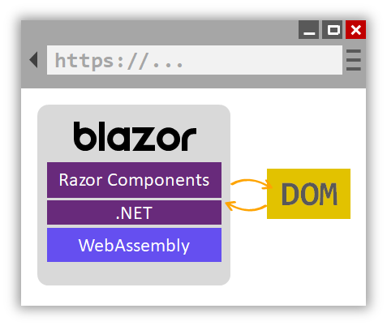

# Introduction to Blazor

By [Daniel Roth](https://github.com/danroth27) and [Luke Latham](https://github.com/guardrex)

Welcome to Blazor!

Build interactive client-side web UI with .NET:

* Build rich interactive UIs using C# instead of JavaScript.
* Share server-side and client-side app logic written with .NET.
* Render the UI as HTML and CSS for wide browser support, including mobile browsers.

Blazor supports core scenarios required by most apps:

* Parameters
* Event handling
* Data binding
* Routing
* Dependency injection
* Layouts
* Templates
* Cascading values

## Components

A *Razor component* in Blazor is an element of UI, such as a page, dialog, or data entry form. Components handle user events and define flexible UI rendering logic. Components can be nested and reused.

Components are .NET classes built into .NET assemblies that can be shared and distributed as NuGet packages. The component class is usually written in the form of a Razor markup page with a *.razor* file extension.

[Razor](xref:mvc/views/razor) is a syntax for combining HTML markup with C# code. Razor is designed for developer productivity, allowing the developer to switch between markup and C# in the same file with [IntelliSense](/visualstudio/ide/using-intellisense) support. Razor Pages and MVC views also use Razor. Unlike Razor Pages and MVC views, which are built around a request/response model, components are used specifically for handling UI composition. Razor components can be used specifically for client-side UI logic and composition.

The following markup is an example of a custom dialog component:

```cshtml
<div>
    <h2>@Title</h2>
    @BodyContent
    <button onclick="@OnOK">OK</button>
</div>

@functions {
    public string Title { get; set; }
    public RenderFragment BodyContent { get; set; }
    public Action OnOK { get; set; }
}
```

When this component is used elsewhere in the app, IntelliSense in [Visual Studio](https://visualstudio.microsoft.com/vs/) speeds development with syntax and parameter completion.

Components render into an in-memory representation of the browser DOM called a *render tree* that can then be used to update the UI in a flexible and efficient way.

## Blazor server-side

Blazor decouples component rendering logic from how UI updates are applied. Blazor server-side provides support for hosting Razor components on the server in an ASP.NET Core app. UI updates are handled over a SignalR connection.

The runtime:

* Handles sending UI events from the browser to the server.
* Applies UI updates sent by the server back to the browser after running the components.

The connection used by Blazor server-side to communicate with the browser is also used to handle JavaScript interop calls.


For more information, see <xref:blazor/hosting-models#server-side>.

## Blazor client-side

Blazor client-side is a single-page app framework for building interactive client-side Web apps with .NET. Blazor client-side uses open web standards without plugins or code transpilation. Blazor client-side works in all modern web browsers, including mobile browsers.

Using .NET in the browser for client-side web development offers many advantages:

* **C# language**: Write code in C# instead of JavaScript.
* **.NET Ecosystem**: Leverage the existing ecosystem of .NET libraries.
* **Full-stack development**: Share server and client-side logic.
* **Speed and scalability**: .NET was built for performance, reliability, and security.
* **Industry-leading tools**: Stay productive with Visual Studio on Windows, Linux, and macOS.
* **Stability and consistency**:  Build on a common set of languages, frameworks, and tools that are stable, feature-rich, and easy to use.

Running .NET code inside web browsers is made possible by [WebAssembly](http://webassembly.org) (abbreviated *wasm*). WebAssembly is an open web standard and supported in web browsers without plugins. WebAssembly is a compact bytecode format optimized for fast download and maximum execution speed.

WebAssembly code can access the full functionality of the browser via JavaScript interop. At the same time, .NET code executed via WebAssembly runs in the same trusted sandbox as JavaScript to prevent malicious actions on the client machine.



When a Blazor client-side app is built and run in a browser:

* C# code files and Razor files are compiled into .NET assemblies.
* The assemblies and the .NET runtime are downloaded to the browser.
* Blazor client-side bootstraps the .NET runtime and configures the runtime to load the assemblies for the app. Document Object Model (DOM) manipulation and browser API calls are handled by the Blazor client-side runtime via JavaScript interop.

To reduce the size of the downloaded app, unused code is stripped out of the app when it's published by the [Intermediate Language (IL) Linker](xref:host-and-deploy/blazor/configure-linker).

Blazor client-side is a client-side hosting model. Because Blazor decouples a component's rendering logic from how UI updates are applied, there's flexibility in how Blazor can be hosted. Use [Blazor server-side](#blazor-server-side) to host Blazor on the server in an ASP.NET Core app where UI updates are handled over a SignalR connection. For more information, see <xref:blazor/hosting-models#server-side>. 

Payload size is a critical performance factor for an app's useability. Blazor client-side optimizes payload size to reduce download times:

* Unused parts of .NET assemblies are removed during the build process.
* HTTP responses are compressed.
* The .NET runtime and assemblies are cached in the browser.

[Blazor server-side](#blazor-server-side) provides a smaller payload size than Blazor client-side by maintaining .NET assemblies, the app's assembly, and the runtime server-side. Blazor server-side apps only serve markup files and static assets to clients.

## JavaScript interop

For apps that require third-party JavaScript libraries and browser APIs, components interoperate with JavaScript. Components are capable of using any library or API that JavaScript is able to use. C# code can call into JavaScript code, and JavaScript code can call into C# code. For more information, see [JavaScript interop](xref:blazor/javascript-interop).

## Code sharing and .NET Standard

Apps can reference and use existing [.NET Standard](/dotnet/standard/net-standard) libraries. .NET Standard is a formal specification of .NET APIs that are common across .NET implementations. Blazor implements .NET Standard 2.0. APIs that aren't applicable inside a web browser (for example, accessing the file system, opening a socket, threading, and other features) throw <xref:System.PlatformNotSupportedException>. .NET Standard class libraries can be shared across different .NET platforms, such as Blazor, .NET Framework, .NET Core, Xamarin, Mono, and Unity.

## Additional resources

* [WebAssembly](http://webassembly.org/)
* [C# Guide](/dotnet/csharp/)
* <xref:mvc/views/razor>
* [HTML](https://www.w3.org/html/)
