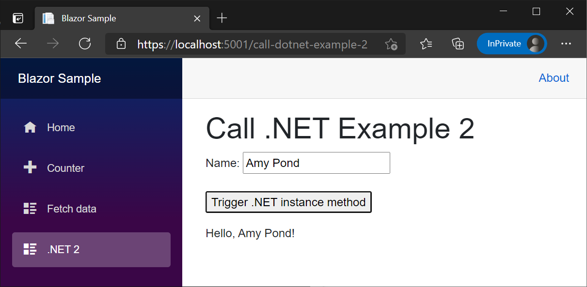

# Call .NET methods from JavaScript functions in ASP.NET Core Blazor

This article covers invoking .NET methods from JavaScript (JS). For information on how to call JS functions from .NET, see <xref:blazor/js-interop/call-javascript-from-dotnet>.

## Invoke a static .NET method

To invoke a static .NET method from JavaScript (JS), use `DotNet.invokeMethod` or `DotNet.invokeMethodAsync`. Pass in the identifier of the static method you wish to call, the name of the assembly containing the function, and any arguments. In the following example, the `{ASSEMBLY NAME}` placeholder is the app's assembly name and the `{.NET METHOD}` placeholder is the .NET method identifier:

```javascript
DotNet.invokeMethodAsync('{ASSEMBLY NAME}', '{.NET METHOD}');
```

The asynchronous version is preferred to support Blazor Server scenarios. The .NET method must be public, static, and have the [`[JSInvokable]` attribute](xref:Microsoft.JSInterop.JSInvokableAttribute). Calling open generic methods isn't currently supported.

In the following `CallDotNetExample1` component, the `ReturnArrayAsync` C# method returns an `int` array. The [`[JSInvokable]` attribute](xref:Microsoft.JSInterop.JSInvokableAttribute) is applied to the method, which makes the method invokable by JS.

`Pages/CallDotNetExample1.razor`:

::: moniker range=">= aspnetcore-5.0"

[!code-razor[](~/blazor/common/samples/5.x/BlazorSample_WebAssembly/Pages/call-dotnet-from-js/CallDotNetExample1.razor?highlight=12-16)]

::: moniker-end

::: moniker range="< aspnetcore-5.0"

[!code-razor[](~/blazor/common/samples/3.x/BlazorSample_WebAssembly/Pages/call-dotnet-from-js/CallDotNetExample1.razor?highlight=12-16)]

::: moniker-end

The `<button>` element's `onclick` HTML attribute is JavaScript's [`onclick`](https://developer.mozilla.org/docs/Web/API/GlobalEventHandlers/onclick) event handler assignment for processing [`click`](https://developer.mozilla.org/docs/Web/API/Element/click_event) events, not Blazor's `@onclick` directive attribute. The `returnArrayAsyncJs` JS function is assigned as the handler.

The following `returnArrayAsyncJs` JS function, calls the `ReturnArrayAsync` .NET method of the preceding `CallDotNetExample1` component and logs the result to the browser's web developer tools console. `BlazorSample` is the app's assembly name.

Inside the closing `</body>` tag of `wwwroot/index.html` (Blazor WebAssembly) or `Pages/_Host.cshtml` (Blazor Server):

```html
<script>
  window.returnArrayAsyncJs = () => {
    DotNet.invokeMethodAsync('BlazorSample', 'ReturnArrayAsync')
      .then(data => {
        console.log(data);
      });
    };
</script>
```

When the **`Trigger .NET static method`** button is selected, the browser's developer tools console output displays the array data. The format of the output differs slightly among browsers. The following output shows the format used by Microsoft Edge:

```console
Array(3) [ 1, 2, 3 ]
```

By default, the method identifier for the JS call is the .NET method name, but you can specify a different identifier using the [`[JSInvokable]` attribute](xref:Microsoft.JSInterop.JSInvokableAttribute) constructor. In the following example, `DifferentMethodName` is the assigned method identifier for the `ReturnArrayAsync` method:

```csharp
[JSInvokable("DifferentMethodName")]
public static Task<int[]> ReturnArrayAsync()
{
    return Task.FromResult(new int[] { 1, 2, 3 });
}
```

In the call to `DotNet.invokeMethodAsync`, call `DifferentMethodName` to execute the `ReturnArrayAsync` .NET method:

```javascript
window.returnArrayAsyncJs = () => {
  DotNet.invokeMethodAsync('BlazorSample', 'DifferentMethodName')
    .then(data => {
      console.log(data);
    });
};
```

## Invoke an instance .NET method

To invoke an instance .NET method from JavaScript (JS):

* Pass the .NET instance by reference to JS by wrapping the instance in a <xref:Microsoft.JSInterop.DotNetObjectReference> and calling <xref:Microsoft.JSInterop.DotNetObjectReference.Create%2A> on it.
* Invoke .NET instance methods from JS using `DotNet.invokeMethod` or `DotNet.invokeMethodAsync`. The .NET instance can also be passed as an argument when invoking other .NET methods from JS.
* Dispose of the <xref:Microsoft.JSInterop.DotNetObjectReference>.

When the **`Trigger .NET instance method`** button is selected in the following `CallDotNetExample2` component, `JsInteropClasses3.CallHelloHelperSayHello` is called with the value of `name`.

`Pages/CallDotNetExample2.razor`:

::: moniker range=">= aspnetcore-5.0"

[!code-razor[](~/blazor/common/samples/5.x/BlazorSample_WebAssembly/Pages/call-dotnet-from-js/CallDotNetExample2.razor?highlight=26-30)]

::: moniker-end

::: moniker range="< aspnetcore-5.0"

[!code-razor[](~/blazor/common/samples/3.x/BlazorSample_WebAssembly/Pages/call-dotnet-from-js/CallDotNetExample2.razor?highlight=26-30)]

::: moniker-end

The following `HelloHelper` class has a JS-invokable .NET method named `GetHelloMessage`. When `HelloHelper` is created, the name (`name`) is used to return a message from `GetHelloMessage`.

`HelloHelper.cs`:

::: moniker range=">= aspnetcore-5.0"

[!code-csharp[](~/blazor/common/samples/5.x/BlazorSample_WebAssembly/HelloHelper.cs?highlight=5,12-13)]

::: moniker-end

::: moniker range="< aspnetcore-5.0"

[!code-csharp[](~/blazor/common/samples/3.x/BlazorSample_WebAssembly/HelloHelper.cs?highlight=5,12-13)]

::: moniker-end

The `CallHelloHelperSayHello` method in the following `JsInteropClasses3` class invokes the JS function `sayHelloJs` with a new instance of `HelloHelper`.

`JsInteropClasses3.cs`:

::: moniker range=">= aspnetcore-5.0"

[!code-csharp[](~/blazor/common/samples/5.x/BlazorSample_WebAssembly/JsInteropClasses3.cs?highlight=15-20)]

::: moniker-end

::: moniker range="< aspnetcore-5.0"

[!code-csharp[](~/blazor/common/samples/3.x/BlazorSample_WebAssembly/JsInteropClasses3.cs?highlight=15-20)]

::: moniker-end

To avoid a memory leak and allow garbage collection, the .NET object reference created by <xref:Microsoft.JSInterop.DotNetObjectReference> is disposed in the `Dispose` method.

Inside the closing `</body>` tag of `wwwroot/index.html` (Blazor WebAssembly) or `Pages/_Host.cshtml` (Blazor Server):

```html
<script>
  window.sayHelloJs = (dotNetHelper) => {
    return dotNetHelper.invokeMethodAsync('GetHelloMessage');
  };
</script>
```

The name is passed to `HelloHelper`'s constructor, which sets the `HelloHelper.Name` property. When the JS function `sayHelloJs` is executed, `HelloHelper.GetHelloMessage` returns the `Hello, {Name}!` message with the name appearing in place of the `{Name}` placeholder.

The following image shows the rendered component with the name `Amy Pond` in the `Name` field. After the button is selected, `Hello, Amy Pond!` is displayed in the UI:



The preceding pattern shown in the `JsInteropClasses3` class can also be implemented entirely in a component.

`Pages/CallDotNetExample3.razor`:

::: moniker range=">= aspnetcore-5.0"

[!code-razor[](~/blazor/common/samples/5.x/BlazorSample_WebAssembly/Pages/call-dotnet-from-js/CallDotNetExample3.razor)]

::: moniker-end

::: moniker range="< aspnetcore-5.0"

[!code-razor[](~/blazor/common/samples/3.x/BlazorSample_WebAssembly/Pages/call-dotnet-from-js/CallDotNetExample3.razor)]

::: moniker-end

To avoid a memory leak and allow garbage collection, the .NET object reference created by <xref:Microsoft.JSInterop.DotNetObjectReference> is disposed in the `Dispose` method.

In the preceding `CallDotNetExample3` component, the .NET object reference is disposed. If a class or component doesn't dispose the <xref:Microsoft.JSInterop.DotNetObjectReference>, dispose it from the client by calling `dispose`:

```javascript
window.jsFunction = (dotnetHelper) => {
  dotnetHelper.invokeMethodAsync('{ASSEMBLY NAME}', '{.NET METHOD}');
  dotnetHelper.dispose();
}
```

In the preceding example, the `{ASSEMBLY NAME}` placeholder is the app's assembly name and the `{.NET METHOD}` placeholder is the .NET method identifier.

## Invoke a component instance .NET method

*This section only applies to Blazor WebAssembly apps.*

To invoke a component's .NET methods:

* Use `DotNet.invokeMethod` or `DotNet.invokeMethodAsync` from JS to make a static method call to the component.
* The component's static method wraps the call to its instance method as an invoked <xref:System.Action>.

> [!IMPORTANT]
> In Blazor Server apps, where several users might be concurrently using the same component, use a helper class to invoke instance methods. For more information, see the [Component instance method helper class](#component-instance-net-method-helper-class) section.

Inside the closing `</body>` tag of `wwwroot/index.html` (Blazor WebAssembly):

```html
<script>
  window.updateMessageCallerJs1 = () => {
    DotNet.invokeMethodAsync('BlazorSample', 'UpdateMessageCaller');
  };
</script>
```

In the preceding example, `BlazorSample` is the app's assembly name.

`Pages/CallDotNetExample4.razor`:

::: moniker range=">= aspnetcore-5.0"

[!code-razor[](~/blazor/common/samples/5.x/BlazorSample_WebAssembly/Pages/call-dotnet-from-js/CallDotNetExample4.razor?highlight=6,16,21,24-28,30-34)]

::: moniker-end

::: moniker range="< aspnetcore-5.0"

[!code-razor[](~/blazor/common/samples/3.x/BlazorSample_WebAssembly/Pages/call-dotnet-from-js/CallDotNetExample4.razor?highlight=6,16,21,24-28,30-34)]

::: moniker-end

In the preceding example, the `<button>` element's `onclick` HTML attribute is JavaScript's [`onclick`](https://developer.mozilla.org/docs/Web/API/GlobalEventHandlers/onclick) event handler assignment for processing [`click`](https://developer.mozilla.org/docs/Web/API/Element/click_event) events, not Blazor's `@onclick` directive attribute. The `updateMessageCallerJs1` JS function is assigned as the handler.

[`StateHasChanged`](xref:blazor/components/lifecycle#state-changes-statehaschanged) is called to update the UI when `message` is set in `UpdateMessage`. If `StateHasChanged` isn't called, Blazor has no way of knowing that the UI should be updated when the <xref:System.Action> is invoked.

To pass arguments to an instance method:

1. Add parameters to the .NET method invocation. In the following example, a name is passed to the method. Additional parameters can be added to the list as needed.

   ```html
   <script>
     window.updateMessageCallerJs2 = (name) => {
       DotNet.invokeMethodAsync('BlazorSample', 'UpdateMessageCaller2', name);
     };
   </script>
   ```

   In the preceding example, `BlazorSample` is the app's assembly name.

1. Provide the correct types to the <xref:System.Action> for the parameters. Provide the parameter list to the C# methods. Invoke the <xref:System.Action> (`UpdateMessage`) with the parameters (`action.Invoke(name)`).

   `Pages/CallDotNetExample5.razor`:

   ::: moniker range=">= aspnetcore-5.0"

   [!code-razor[](~/blazor/common/samples/5.x/BlazorSample_WebAssembly/Pages/call-dotnet-from-js/CallDotNetExample5.razor?highlight=6,16,24,31)]

   ::: moniker-end

   ::: moniker range="< aspnetcore-5.0"

   [!code-razor[](~/blazor/common/samples/3.x/BlazorSample_WebAssembly/Pages/call-dotnet-from-js/CallDotNetExample5.razor?highlight=6,16,24,31)]

   ::: moniker-end

  The value of `message` is displayed when the **`Call component instance .NET method`** button is selected:

  > `Sarah Jane, UpdateMessage Called!`

  [`StateHasChanged`](xref:blazor/components/lifecycle#state-changes-statehaschanged) is called to update the UI when `message` is set in `UpdateMessage`. If `StateHasChanged` isn't called, Blazor has no way of knowing that the UI should be updated when the <xref:System.Action> is invoked.

## Component instance .NET method helper class

*This section applies to both Blazor WebAssembly and Blazor Server apps but is especially important for JS interop in Blazor Server apps.*

A helper class can invoke a .NET instance method as an <xref:System.Action>. Helper classes are useful in the following scenarios:

* When several components of the same type are rendered on the same page.
* In a Blazor Server app, when multiple users concurrently use a component.

In the following example:

* The `CallDotNetExample6` component contains several `ListItem` components, which is a shared component in the app's `Shared` folder.
* Each `ListItem` component is composed of a message and a button.
* When a `ListItem` component button is selected, that `ListItem`'s `UpdateMessage` method changes the list item text and hides the button.

The following `MessageUpdateInvokeHelper` class maintains a JS-invokable .NET method, `UpdateMessageCaller3`, to invoke the <xref:System.Action> specified when the class is instantiated. `BlazorSample` is the app's assembly name.

`MessageUpdateInvokeHelper.cs`:

::: moniker range=">= aspnetcore-5.0"

[!code-csharp[](~/blazor/common/samples/5.x/BlazorSample_WebAssembly/MessageUpdateInvokeHelper.cs?highlight=8,13-17)]

::: moniker-end

::: moniker range="< aspnetcore-5.0"

[!code-csharp[](~/blazor/common/samples/3.x/BlazorSample_WebAssembly/MessageUpdateInvokeHelper.cs?highlight=8,13-17)]

::: moniker-end

The following `updateMessageCallerJs3` JS function invokes the `UpdateMessageCaller3` .NET method. `BlazorSample` is the app's assembly name.

Inside the closing `</body>` tag of `wwwroot/index.html` (Blazor WebAssembly) or `Pages/_Host.cshtml` (Blazor Server):

```html
<script>
  window.updateMessageCallerJs3 = (dotnetHelper) => {
    dotnetHelper.invokeMethodAsync('BlazorSample', 'UpdateMessageCaller3');
    dotnetHelper.dispose();
  }
</script>
```

The `ListItem` component is a shared component that can be used any number of times in a parent component. Any `ListItem` component created establishes an instance of `MessageUpdateInvokeHelper` with an <xref:System.Action> set to its `UpdateMessage` method. When its **`InteropCall`** button is selected, `updateMessageCallerJs3` is invoked with a created <xref:Microsoft.JSInterop.DotNetObjectReference> for the `MessageUpdateInvokeHelper` instance.

`Shared/ListItem.razor`:

::: moniker range=">= aspnetcore-5.0"

[!code-razor[](~/blazor/common/samples/5.x/BlazorSample_WebAssembly/Shared/call-dotnet-from-js/ListItem.razor?highlight=1,5,11,15,18-22,24)]

::: moniker-end

::: moniker range="< aspnetcore-5.0"

[!code-razor[](~/blazor/common/samples/3.x/BlazorSample_WebAssembly/Shared/call-dotnet-from-js/ListItem.razor?highlight=1,5,11,15,18-22,24)]

::: moniker-end

[`StateHasChanged`](xref:blazor/components/lifecycle#state-changes-statehaschanged) is called to update the UI when `message` is set in `UpdateMessage`. If `StateHasChanged` isn't called, Blazor has no way of knowing that the UI should be updated when the <xref:System.Action> is invoked.

The following `CallDotNetExample6` parent component includes four list items, each an instance of the `ListItem` component.

`Pages/CallDotNetExample6.razor`:

::: moniker range=">= aspnetcore-5.0"

[!code-razor[](~/blazor/common/samples/5.x/BlazorSample_WebAssembly/Pages/call-dotnet-from-js/CallDotNetExample6.razor?highlight=6-9)]

::: moniker-end

::: moniker range="< aspnetcore-5.0"

[!code-razor[](~/blazor/common/samples/3.x/BlazorSample_WebAssembly/Pages/call-dotnet-from-js/CallDotNetExample6.razor?highlight=6-9)]

::: moniker-end

The following image shows the rendered `CallDotNetExample6` parent component after the second **`InteropCall`** button is selected:

* The second `ListItem` component has displayed the `UpdateMessage Called!` message.
* The **`InteropCall`** button for the second `ListItem` component isn't visible because the button's CSS `display` property is set to `none`.


## Location of JavaScipt

Load JavaScript (JS) code using any of approaches described by the [JS interop overview article](xref:blazor/js-interop/index#location-of-javascipt):

* [Load a script in `<head>` markup](xref:blazor/js-interop/index#load-a-script-in-head-markup) (*Not generally recommended*)
* [Load a script in `<body>` markup](xref:blazor/js-interop/index#load-a-script-in-body-markup)
* [Load a script from an external JS file (`.js`)](xref:blazor/js-interop/index#load-a-script-from-an-external-js-file-js)
* [Inject a script after Blazor starts](xref:blazor/js-interop/index#inject-a-script-after-blazor-starts)

::: moniker range=">= aspnetcore-5.0"

For information on isolating scripts in [JS modules](https://developer.mozilla.org/docs/Web/JavaScript/Guide/Modules), see the [JavaScript isolation in JavaScript modules](#javascript-isolation-in-javascript-modules) section.

::: moniker-end

> [!WARNING]
> Don't place a `<script>` tag in a component file (`.razor`) because the `<script>` tag can't be updated dynamically.

## Avoid circular object references

Objects that contain circular references can't be serialized on the client for either:

* .NET method calls.
* JavaScript method calls from C# when the return type has circular references.

## Size limits on JavaScript interop calls

[!INCLUDE[](~/blazor/includes/js-interop-size-limits.md)]

::: moniker range=">= aspnetcore-5.0"

## JavaScript isolation in JavaScript modules

Blazor enables JavaScript (JS) isolation in standard [JavaScript modules](https://developer.mozilla.org/docs/Web/JavaScript/Guide/Modules) ([ECMAScript specification](https://tc39.es/ecma262/#sec-modules)).

JS isolation provides the following benefits:

* Imported JS no longer pollutes the global namespace.
* Consumers of a library and components aren't required to import the related JS.

For more information, see <xref:blazor/js-interop/call-javascript-from-dotnet#javascript-isolation-in-javascript-modules>.

::: moniker-end

## Additional resources

* <xref:blazor/js-interop/call-javascript-from-dotnet>
* [`InteropComponent.razor` example (dotnet/AspNetCore GitHub repository `main` branch)](https://github.com/dotnet/AspNetCore/blob/main/src/Components/test/testassets/BasicTestApp/InteropComponent.razor): The `main` branch represents the product unit's current development for the next release of ASP.NET Core. To select the branch for a different release (for example, `release/5.0`), use the **Switch branches or tags** dropdown list to select the branch.
