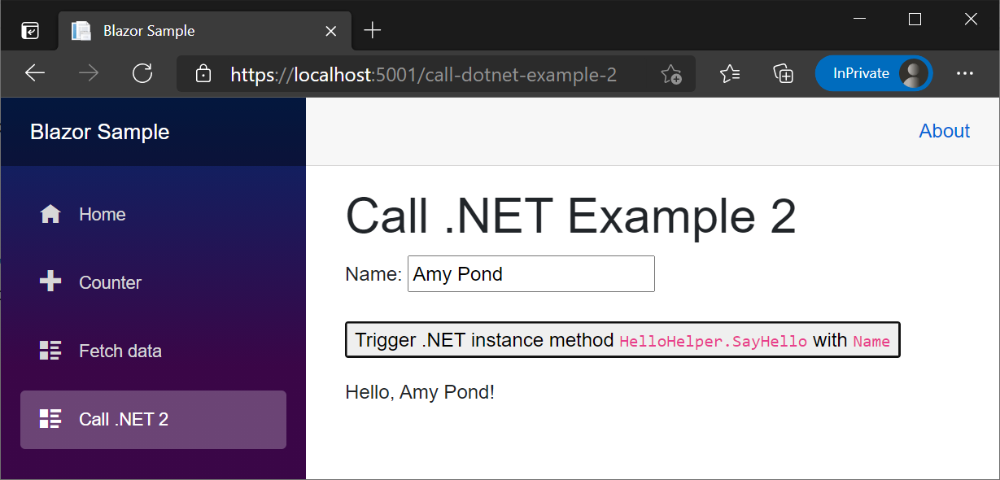

# Call .NET methods from JavaScript functions in ASP.NET Core Blazor

This article covers invoking .NET methods from JavaScript (JS). For information on how to call JS functions from .NET, see <xref:blazor/js-interop/call-javascript-from-dotnet>.

[View or download sample code](https://github.com/dotnet/AspNetCore.Docs/tree/main/aspnetcore/blazor/common/samples/) ([how to download](xref:index#how-to-download-a-sample))

## Location of JavaScipt

Load JavaScript (JS) code using any of approaches described by the [JavaScript (JS) interoperability (interop) overview article](xref:blazor/js-interop/index#location-of-javascipt):

* [Load a script in `<head>` markup](xref:blazor/js-interop/index#load-a-script-in-head-markup) (*Not generally recommended*)
* [Load a script in `<body>` markup](xref:blazor/js-interop/index#load-a-script-in-body-markup)
* [Load a script from an external JS file (`.js`)](xref:blazor/js-interop/index#load-a-script-from-an-external-js-file-js)
* [Inject a script after Blazor starts](xref:blazor/js-interop/index#inject-a-script-after-blazor-starts)

::: moniker range=">= aspnetcore-5.0"

For information on isolating scripts in [JS modules](https://developer.mozilla.org/docs/Web/JavaScript/Guide/Modules), see <xref:blazor/js-interop/index#javascript-isolation-in-javascript-modules>.

::: moniker-end

> [!WARNING]
> Don't place a `<script>` tag in a component file (`.razor`) because the `<script>` tag can't be updated dynamically.

## Static .NET method call

To invoke a static .NET method from JavaScript, use the `DotNet.invokeMethod` or `DotNet.invokeMethodAsync` functions. Pass in the identifier of the static method you wish to call, the name of the assembly containing the function, and any arguments. The asynchronous version is preferred to support Blazor Server scenarios. The .NET method must be public, static, and have the [`[JSInvokable]` attribute](xref:Microsoft.JSInterop.JSInvokableAttribute). Calling open generic methods isn't currently supported.

The sample app includes a C# method to return an `int` array. The [`[JSInvokable]` attribute](xref:Microsoft.JSInterop.JSInvokableAttribute) is applied to the method.

`Pages/CallDotNetExample1.razor`:

```razor
@page "/call-dotnet-example-1"

<h1>Call .NET Example 6</h1>

<button type="button" onclick="returnArrayAsyncJs()">
    Trigger .NET static method <code>ReturnArrayAsync</code>
</button>

@code {
    [JSInvokable]
    public static Task<int[]> ReturnArrayAsync()
    {
        return Task.FromResult(new int[] { 1, 2, 3 });
    }
}
```

JavaScript served to the client invokes the C# .NET method.

Note in the preceding example that the `<button>` element's  `onclick` HTML attribute is JavaScript's [`onclick`](https://developer.mozilla.org/docs/Web/API/GlobalEventHandlers/onclick) JS event handler assignment for processing a JS [`click`](https://developer.mozilla.org/docs/Web/API/Element/click_event) events, not Blazor's `@onclick` directive attribute.

Inside the closing `</body>` tag of `wwwroot/index.html` (Blazor WebAssembly) or `Pages/_Host.cshtml` (Blazor Server):

```javascript
<script>
  window.returnArrayAsyncJs = () => {
    DotNet.invokeMethodAsync('BlazorSample', 'ReturnArrayAsync')
      .then(data => {
        data.push(4);
        console.log(data);
      });
    };
</script>
```

In the preceding example, `BlazorSample` is the app's assembly name.

When the **`Trigger .NET static method ReturnArrayAsync`** button is selected, examine the console output in the browser's web developer tools.

The console output is:

```console
Array(4) [ 1, 2, 3, 4 ]
```

The fourth array value is pushed to the array (`data.push(4);`) returned by `ReturnArrayAsync`.

By default, the method identifier is the method name, but you can specify a different identifier using the [`[JSInvokable]` attribute](xref:Microsoft.JSInterop.JSInvokableAttribute) constructor:

```csharp
@code {
    [JSInvokable("DifferentMethodName")]
    public static Task<int[]> ReturnArrayAsync()
    {
        return Task.FromResult(new int[] { 1, 2, 3 });
    }
}
```

In the client-side JavaScript file:

```html
<script>
  window.returnArrayAsyncJs = () => {
    DotNet.invokeMethodAsync('BlazorSample', 'DifferentMethodName')
      .then(data => {
        data.push(4);
        console.log(data);
      });
  };
</script>
```

In the preceding example, `BlazorSample` is the app's assembly name.

## Instance method call

You can also call .NET instance methods from JavaScript. To invoke a .NET instance method from JavaScript:

* Pass the .NET instance by reference to JavaScript:
  * Make a static call to <xref:Microsoft.JSInterop.DotNetObjectReference.Create%2A?displayProperty=nameWithType>.
  * Wrap the instance in a <xref:Microsoft.JSInterop.DotNetObjectReference> instance and call <xref:Microsoft.JSInterop.DotNetObjectReference.Create%2A> on the <xref:Microsoft.JSInterop.DotNetObjectReference> instance. Dispose of <xref:Microsoft.JSInterop.DotNetObjectReference> objects (an example appears later in this section).
* Invoke .NET instance methods on the instance using the `invokeMethod` or `invokeMethodAsync` functions. The .NET instance can also be passed as an argument when invoking other .NET methods from JavaScript.

> [!NOTE]
> The sample app logs messages to the client-side console. For the following examples demonstrated by the sample app, examine the browser's console output in the browser's developer tools.

When the **`Trigger .NET instance method HelloHelper.SayHello`** button is selected, `JsInteropClasses3.CallHelloHelperSayHello` is called and passes a name, `Blazor`, to the method.

`Pages/CallDotNetExample2.razor`:

```razor
@page "/call-dotnet-example-2"
@inject IJSRuntime JS

<h1>Call .NET Example 2</h1>

<p>
    <label>
        Name: <input @bind="name" />
    </label>
</p>

<p>
    <button type="button" @onclick="TriggerDotNetInstanceMethod">
        Trigger .NET instance method <code>HelloHelper.SayHello</code> 
        with <code>Name</code>
    </button>
</p>

<p>
    @result
</p>

@code {
    public string name;
    public string result;

    public async Task TriggerDotNetInstanceMethod()
    {
        var jsInteropClasses = new JsInteropClasses3(JS);
        result = await jsInteropClasses.CallHelloHelperSayHello(name);
    }
}
```

`CallHelloHelperSayHello` invokes the JavaScript function `sayHello` with a new instance of `HelloHelper`.

`JsInteropClasses3.cs`:

```csharp
using System;
using System.Threading.Tasks;
using Microsoft.JSInterop;

public class JsInteropClasses3 : IDisposable
{
    private readonly IJSRuntime js;
    private DotNetObjectReference<HelloHelper> objRef;

    public JsInteropClasses3(IJSRuntime js)
    {
        this.js = js;
    }

    public ValueTask<string> CallHelloHelperSayHello(string name)
    {
        objRef = DotNetObjectReference.Create(new HelloHelper(name));

        return js.InvokeAsync<string>("sayHello", objRef);
    }

    public void Dispose()
    {
        objRef?.Dispose();
    }
}
```

To avoid a memory leak and allow garbage collection for the preceding class that created a <xref:Microsoft.JSInterop.DotNetObjectReference>, the instance is disposed in the `Dispose` method.

Inside the closing `</body>` tag of `wwwroot/index.html` (Blazor WebAssembly) or `Pages/_Host.cshtml` (Blazor Server):

```html
<script>
  window.sayHello = (dotNetHelper) => {
    return dotNetHelper.invokeMethodAsync('SayHello');
  };
</script>
```

The name is passed to `HelloHelper`'s constructor, which sets the `HelloHelper.Name` property. When the JavaScript function `sayHello` is executed, `HelloHelper.SayHello` returns the `Hello, {Name}!` message.

`HelloHelper.cs`:

```csharp
using Microsoft.JSInterop;

public class HelloHelper
{
    public HelloHelper(string name)
    {
        Name = name;
    }

    public string Name { get; set; }

    [JSInvokable]
    public string SayHello() => $"Hello, {Name}!";
}
```

Rendered component example showing the name 'Amy Pond' in the 'Name' field. The button has been selected, and 'Hello, Amy Pond!' is displayed:



The preceding pattern shown in the `JsInteropClasses3` class can also be implemented in a component:

`Pages/CallDotNetExample3.razor`:

```razor
@page "/call-dotnet-example-3"
@implements IDisposable
@inject IJSRuntime JS

<h1>Call .NET Example 3</h1>

<p>
    <label>
        Name: <input @bind="name" />
    </label>
</p>

<p>
    <button type="button" @onclick="TriggerDotNetInstanceMethod">
        Trigger .NET instance method <code>HelloHelper.SayHello</code> 
        with <code>Name</code>
    </button>
</p>

<p>
    @result
</p>

@code {
    private string name;
    private string result;
    private DotNetObjectReference<HelloHelper> objRef;

    public async Task TriggerDotNetInstanceMethod()
    {
        objRef = DotNetObjectReference.Create(new HelloHelper(name));
        result = await JS.InvokeAsync<string>("sayHello", objRef);
    }

    public void Dispose()
    {
        objRef?.Dispose();
    }
}
```

To avoid a memory leak and allow garbage collection for the preceding component that created a <xref:Microsoft.JSInterop.DotNetObjectReference>, the instance is disposed in the `Dispose` method.

When the class or component doesn't dispose the <xref:Microsoft.JSInterop.DotNetObjectReference>, dispose of the instance on the client by calling `dispose`:

```javascript
window.jsFunction = (dotnetHelper) => {
  dotnetHelper.invokeMethodAsync('BlazorSample', 'DotNetMethod');
  dotnetHelper.dispose();
}
```

In the preceding example, `BlazorSample` is the app's assembly name, and `DotNetMethod` is the .NET method name.

## Component instance method call

To invoke a component's .NET methods:

* Use the `invokeMethod` or `invokeMethodAsync` function to make a static method call to the component.
* The component's static method wraps the call to its instance method as an invoked <xref:System.Action>.

> [!NOTE]
> For Blazor Server apps, where several users might be concurrently using the same component, use a helper class to invoke instance methods.
>
> For more information, see the [Component instance method helper class](#component-instance-method-helper-class) section.

In the client-side JavaScript:

```javascript
function updateMessageCallerJS() {
  DotNet.invokeMethodAsync('BlazorSample', 'UpdateMessageCaller');
}
```

In the preceding example, `BlazorSample` is the app's assembly name.

`Pages/CallDotNetExample4.razor`:

```razor
@page "/call-dotnet-example-4"

<h1>Call .NET Example 4</h1>

<p>
    Message: @message
</p>

<p>
    <button onclick="updateMessageCallerJS()">Call JS Method</button>
</p>

@code {
    private static Action action;
    private string message = "Select the button.";

    protected override void OnInitialized()
    {
        action = UpdateMessage;
    }

    private void UpdateMessage()
    {
        message = "UpdateMessage Called!";
        StateHasChanged();
    }

    [JSInvokable]
    public static void UpdateMessageCaller()
    {
        action.Invoke();
    }
}
```

To pass arguments to the instance method:

* Add parameters to the JS method invocation. In the following example, a name is passed to the method. Additional parameters can be added to the list as needed.

  ```javascript
  function updateMessageCallerJS(name) {
    DotNet.invokeMethodAsync('BlazorSample', 'UpdateMessageCaller', name);
  }
  ```
  
  In the preceding example, `BlazorSample` is the app's assembly name.

* Provide the correct types to the <xref:System.Action> for the parameters. Provide the parameter list to the C# methods. Invoke the <xref:System.Action> (`UpdateMessage`) with the parameters (`action.Invoke(name)`).

  `Pages/CallDotNetExample5.razor`:

  ```razor
  @page "/call-dotnet-example-5"

  <h1>Call .NET Example 5</h1>

  <p>
      Message: @message
  </p>

  <p>
      <button onclick="updateMessageCallerJS('Sarah Jane')">
          Call JS Method
      </button>
  </p>

  @code {
      private static Action<string> action;
      private string message = "Select the button.";

      protected override void OnInitialized()
      {
          action = UpdateMessage;
      }

      private void UpdateMessage(string name)
      {
          message = $"{name}, UpdateMessage Called!";
          StateHasChanged();
      }

      [JSInvokable]
      public static void UpdateMessageCaller(string name)
      {
          action.Invoke(name);
      }
  }
  ```

  Output `message` when the **Call JS Method** button is selected:

  > `Sarah Jane, UpdateMessage Called!`

## Component instance method helper class

The helper class is used to invoke an instance method as an <xref:System.Action>. Helper classes are useful when:

* Several components of the same type are rendered on the same page.
* A Blazor Server app is used, where multiple users might be using a component concurrently.

In the following example:

* The `JSInteropExample` component contains several `ListItem` components.
* Each `ListItem` component is composed of a message and a button.
* When a `ListItem` component button is selected, that `ListItem`'s `UpdateMessage` method changes the list item text and hides the button.

`MessageUpdateInvokeHelper.cs`:

```csharp
using System;
using Microsoft.JSInterop;

public class MessageUpdateInvokeHelper
{
    private Action action;

    public MessageUpdateInvokeHelper(Action action)
    {
        this.action = action;
    }

    [JSInvokable("BlazorSample")]
    public void UpdateMessageCaller()
    {
        action.Invoke();
    }
}
```

In the preceding example, `BlazorSample` is the app's assembly name.

In the client-side JavaScript:

```javascript
window.updateMessageCallerJS = (dotnetHelper) => {
  dotnetHelper.invokeMethodAsync('BlazorSample', 'UpdateMessageCaller');
  dotnetHelper.dispose();
}
```

In the preceding example, `BlazorSample` is the app's assembly name.

`Shared/ListItem.razor`:

```razor
@inject IJSRuntime JS

<li>
    @message
    <button @onclick="InteropCall" style="display:@display">InteropCall</button>
</li>

@code {
    private string message = "Select one of these list item buttons.";
    private string display = "inline-block";
    private MessageUpdateInvokeHelper messageUpdateInvokeHelper;

    protected override void OnInitialized()
    {
        messageUpdateInvokeHelper = new MessageUpdateInvokeHelper(UpdateMessage);
    }

    protected async Task InteropCall()
    {
        await JS.InvokeVoidAsync("updateMessageCallerJS",
            DotNetObjectReference.Create(messageUpdateInvokeHelper));
    }

    private void UpdateMessage()
    {
        message = "UpdateMessage Called!";
        display = "none";
        StateHasChanged();
    }
}
```

`Pages/CallDotNetExample6.razor`:

```razor
@page "/call-dotnet-example-6"

<h1>Call .NET Example 6</h1>

<ul>
    <ListItem />
    <ListItem />
    <ListItem />
    <ListItem />
</ul>
```

## Avoid circular object references

Objects that contain circular references can't be serialized on the client for either:

* .NET method calls.
* JavaScript method calls from C# when the return type has circular references.

For more information, see the following issues:

* [Circular references are not supported, take two (dotnet/aspnetcore #20525)](https://github.com/dotnet/aspnetcore/issues/20525)
* [Proposal: Add mechanism to handle circular references when serializing (dotnet/runtime #30820)](https://github.com/dotnet/runtime/issues/30820)

## Size limits on JavaScript interop calls

In Blazor WebAssembly, the framework doesn't impose a limit on the size of JS interop inputs and outputs.

In Blazor Server, JS interop calls are limited in size by the maximum incoming SignalR message size permitted for hub methods, which is enforced by <xref:Microsoft.AspNetCore.SignalR.HubOptions.MaximumReceiveMessageSize?displayProperty=nameWithType> (default: 32 KB). JS to .NET SignalR messages larger than <xref:Microsoft.AspNetCore.SignalR.HubOptions.MaximumReceiveMessageSize> throw an error. The framework doesn't impose a limit on the size of a SignalR message from the hub to a client.

When SignalR logging isn't set to [Debug](xref:Microsoft.Extensions.Logging.LogLevel) or [Trace](xref:Microsoft.Extensions.Logging.LogLevel), a message size error only appears in the browser's developer tools console:

> Error: Connection disconnected with error 'Error: Server returned an error on close: Connection closed with an error.'.

When [SignalR server-side logging](xref:signalr/diagnostics#server-side-logging) is set to [Debug](xref:Microsoft.Extensions.Logging.LogLevel) or [Trace](xref:Microsoft.Extensions.Logging.LogLevel), server-side logging surfaces an <xref:System.IO.InvalidDataException> for a message size error.

`appsettings.Development.json`:

```json
{
  "DetailedErrors": true,
  "Logging": {
    "LogLevel": {
      "Default": "Information",
      "Microsoft": "Warning",
      "Microsoft.Hosting.Lifetime": "Information",
      "Microsoft.AspNetCore.SignalR": "Debug"
    }
  }
}
```

> System.IO.InvalidDataException: The maximum message size of 32768B was exceeded. The message size can be configured in AddHubOptions.

Increase the limit by setting <xref:Microsoft.AspNetCore.SignalR.HubOptions.MaximumReceiveMessageSize> in `Startup.ConfigureServices`. The following example sets the maximum receive message size to 64 KB (64 * 1024):

```csharp
services.AddServerSideBlazor()
   .AddHubOptions(options => options.MaximumReceiveMessageSize = 64 * 1024);
```

Increasing the SignalR incoming message size limit comes at the cost of requiring more server resources, and it exposes the server to increased risks from a malicious user. Additionally, reading a large amount of content in to memory as strings or byte arrays can also result in allocations that work poorly with the garbage collector, resulting in additional performance penalties.

One option for reading large payloads is to send the content in smaller chunks and process the payload as a <xref:System.IO.Stream>. This can be used when reading large JSON payloads or if data is available in JavaScript as raw bytes. For an example that demonstrates sending large binary payloads in Blazor Server that uses techniques similar to the `InputFile` component, see the [Binary Submit sample app](https://github.com/aspnet/samples/tree/master/samples/aspnetcore/blazor/BinarySubmit).

Consider the following guidance when developing code that transfers a large amount of data between JavaScript and Blazor:

* Slice the data into smaller pieces, and send the data segments sequentially until all of the data is received by the server.
* Don't allocate large objects in JavaScript and C# code.
* Don't block the main UI thread for long periods when sending or receiving data.
* Free any memory consumed when the process is completed or cancelled.
* Enforce the following additional requirements for security purposes:
  * Declare the maximum file or data size that can be passed.
  * Declare the minimum upload rate from the client to the server.
* After the data is received by the server, the data can be:
  * Temporarily stored in a memory buffer until all of the segments are collected.
  * Consumed immediately. For example, the data can be stored immediately in a database or written to disk as each segment is received.

## JavaScript modules

For JS isolation, JS interop works with the browser's default support for [EcmaScript modules (ESM)](https://developer.mozilla.org/docs/Web/JavaScript/Guide/Modules) ([ECMAScript specification](https://tc39.es/ecma262/#sec-modules)).

## Additional resources

* <xref:blazor/js-interop/call-javascript-from-dotnet>
* [`InteropComponent.razor` example (dotnet/AspNetCore GitHub repository `main` branch)](https://github.com/dotnet/AspNetCore/blob/main/src/Components/test/testassets/BasicTestApp/InteropComponent.razor): The `main` branch represents the product unit's current development for the next release of ASP.NET Core. To select the branch for a different release (for example, `release/5.0`), use the **Switch branches or tags** dropdown list to select the branch.
