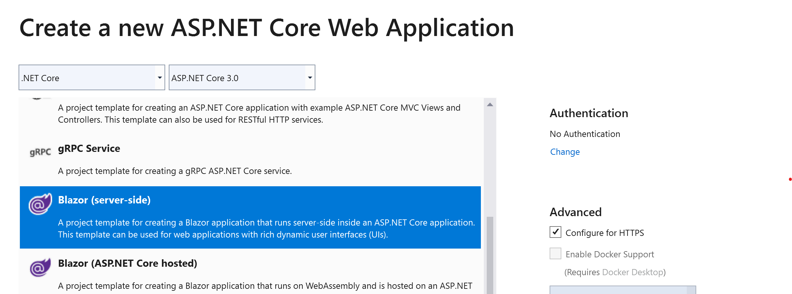
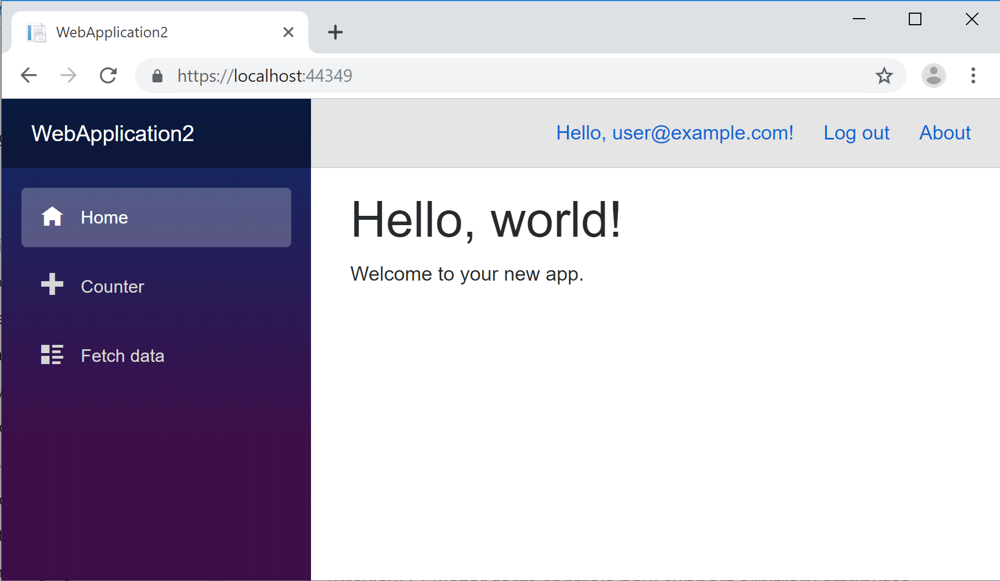

# Blazor security and Identity

By [Steve Sanderson](https://github.com/SteveSandersonMS)

Blazor provides *authentication* and *authorization* scenarios.

The scenarios differ between Blazor server-side and Blazor client-side:

* Blazor server-side apps run on the server. Authorization checks determine:
  * UI options (for example, which menu entries are available to a certain user).
  * Access rules.
* Blazor client-side apps run on the client. Authorization is *only* used as a way of determining which UI options to show (for example, which menu entries to provide). Since client-side checks can be modified or bypassed by a user, the enforcement of authorization access rules *must* be implemented on the backend server.

## Authentication-enabled templates for Blazor server-side

If you're creating a new Blazor server-side app, the project template can set up an authentication mechanism. During project creation, select **Change** under **Authentication**:



A dialog opens to offer the same set of authentication mechanisms available for other ASP.NET Core projects:

* No authentication (default)
* Individual user accounts. User accounts can be stored:
  * Within the app with ASP.NET Core's [Identity](xref:security/authentication/identity) system.
  * In the cloud with [Azure AD B2C](xref:security/authentication/azure-ad-b2c).
* Work or School accounts
* [Windows Authentication](xref:security/authentication/windowsauth)

The mechanism of authenticating a user (determining a user's identity using cookies or other information) is the same in Blazor as in any other ASP.NET Core app. To customize authentication, see <xref:security/index>.

The project tracks the identity of the signed-in user. The following sections describe how to apply authorization rules to authenticated users.



## Access information about the current user

There are three ways to access information about the current user. Each is useful in different scenarios.

### Use \<AuthorizeView> to display user information

This is the most high-level way to access authentication data. This approach is useful when you only need to *display* user data and don't need to use the data in procedural logic.

The `<AuthorizeView>` component exposes a `context` variable of type `AuthenticationState`, which you can use to display information about the signed-in user:

```cshtml
<AuthorizeView>
    <h1>Hello, @context.User.Identity.Name!</h1>
    <p>You can only see this content if you're authenticated.</p>
</AuthorizeView>
```

You can also supply different content for display if the user isn't authenticated:

```cshtml
<AuthorizeView>
    <Authorized>
        <h1>Hello, @context.User.Identity.Name!</h1>
        <p>You can only see this content if you're authenticated.</p>
    </Authorized>
    <NotAuthorized>
        <h1>Authentication Failure!</h1>
        <p>You're not signed in.</p>
    </NotAuthorized>
</AuthorizeView>
```

Static HTML content isn't required. The content can include arbitrary items, such as other interactive components.

Authorization conditions, such as roles or policies, can also be specified. Authorization conditions are covered later in this article. If no authorization conditions are specified, `<AuthorizeView>` treats:

* All authenticated (signed-in) users as authorized.
* Unauthenticated (signed-out) users as unauthorized.

**Troubleshooting**

If an error is received stating that *Authorization requires a cascading parameter of type Task\<AuthenticationState>. Consider using CascadingAuthenticationState to supply this.*, then it's likely that you didn't create the project using one of the authentication templates. In this scenario, wrap a `<CascadingAuthenticationState>` around some part of the UI tree, for example in *App.razor* as follows:

```cshtml
<CascadingAuthenticationState>
    <Router AppAssembly="typeof(Startup).Assembly">
        ...
    </Router>
</CascadingAuthenticationState>
```

The `<CascadingAuthenticationState>` supplies the `Task<AuthenticationState>` cascading parameter, which in turn it receives from the underlying `AuthenticationStateProvider` DI service.

### Use a cascaded Task\<AuthenticationState>

If authentication state data is required for procedural logic, such as when performing an action triggered by the user, obtain the state data by receiving a cascaded parameter of type `Task<AuthenticationState>`.

```cshtml
@page "/"

<button @onclick="@LogUsername">Log username</button>

@code {
    [CascadingParameter]
    private Task<AuthenticationState> authenticationStateTask { get; set; }

    private async Task LogUsername()
    {
        var authState = await authenticationStateTask;
        var user = authState.User;

        if (user.Identity.IsAuthenticated)
        {
            // Since the user is a ClaimsPrincipal, claims can be enumerated,
            // and membership in roles evaluated.
            Console.WriteLine($"Hello, {user.Identity.Name}!");
        }
        else
        {
            Console.WriteLine("You're not signed in.");
        }
    }
}
```

**Troubleshooting**

If a `null` value is received for `authenticationStateTask`, it's likely that the project wasn't created using one of the authentication templates. In this scenario, wrap a `<CascadingAuthenticationState>` around some part of the UI tree, for example in *App.razor* as follows:

```cshtml
<CascadingAuthenticationState>
    <Router AppAssembly="typeof(Startup).Assembly">
        ...
    </Router>
</CascadingAuthenticationState>
```

The `<CascadingAuthenticationState>` supplies the `Task<AuthenticationState>` cascading parameter, which in turn it receives from the underlying `AuthenticationStateProvider` DI service.

### Use the AuthenticationStateProvider DI service

This is the lowest-level way to access authentication state. In most cases, this approach shouldn't be used directly, as there are more convenient alternatives as described earlier. However, the AuthenticationStateProvider DI service is the underlying service that supports the high-level alternatives.

The `AuthenticationStateProvider` is a DI service that can provide the current user's `ClaimsPrincipal` data.

```cshtml
@page "/"
@inject AuthenticationStateProvider AuthenticationStateProvider

<button @onclick="@LogUsername">Write user info to console</button>

@code {
    private async Task LogUsername()
    {
        var authState = await AuthenticationStateProvider.GetAuthenticationStateAsync();
        var user = authState.User;

        if (user.Identity.IsAuthenticated)
        {
            // Since the user is a ClaimsPrincipal, claims can be enumerated,
            // and membership in roles evaluated.
            Console.WriteLine($"Hello, {user.Identity.Name}!");
        }
        else
        {
            Console.WriteLine("You're not signed in.");
        }
    }
}
```

The main drawback to using `AuthenticationStateProvider` directly is that the component won't be notified automatically if the underlying authentication state data changes. That's why we recommend using the cascaded `Task<AuthenticationState>` approach instead.

## Implement a custom AuthenticationStateProvider

Blazor server-side includes a built-in `AuthenticationStateProvider` DI service that obtains authentication state data from ASP.NET Core's server-side `HttpContext.User`. This is how authentication state integrates with all of the existing server-side authentication mechanisms.

> [!WARNING]
> **We don't recommend that you implement a custom `AuthenticationStateProvider`.**
>
> The built-in provider implementation already integrates with ASP.NET Core's built-in authentication mechanisms. If a custom provider is implemented, security vulnerabilities might be introduced to the app.

The only common scenario where a custom `AuthenticationStateProvider` is implemented is in Blazor client-side apps. A custom provider can integrate with any number of external authentication systems independently of server-side code. In Blazor client-side apps, authentication only exists to present a convenient UI to well-behaved users&mdash;authentication doesn't enforce security in Blazor client-side apps because client-side rules can always be bypassed.

If you're building a Blazor client-side app or if your requirements are different in some other way, a custom `AuthenticationStateProvider` can be implemented that obtains user data from an external source.

```csharp
class FakeAuthStateProvider : AuthenticationStateProvider
{
    public override Task<AuthenticationState> GetAuthenticationStateAsync()
    {
        var identity = new ClaimsIdentity(new[]
        {
            new Claim(ClaimTypes.Name, "K-9"),
        }, "Fake authentication type");

        var user = new ClaimsPrincipal(identity);

        return Task.FromResult(new AuthenticationState(user));
    }
}
```

The `FakeAuthStateProvider` service is registered in `Startup.ConfigureServices`:

```csharp
public void ConfigureServices(IServiceCollection services)
{
    services.AddScoped<AuthenticationStateProvider, FakeAuthStateProvider>();
}
```

With this custom `AuthenticationStateProvider`, all users are authenticated with the username `K-9`.

If you want to use `<AuthorizeView>` or a cascaded parameter of type `Task<AuthenticationState>`, ensure `<CascadingAuthenticationState>` is wrapped around the relevant part of the UI hierarchy, for example in *App.razor*:


```cshtml
<CascadingAuthenticationState>
    <Router AppAssembly="typeof(Startup).Assembly">
        ...
    </Router>
</CascadingAuthenticationState>
```

### Notification about authentication state changes

If the app determines that the underlying authentication state data has changed (for example, because the user signed out or another user has changed their roles), the custom authentication state provider can optionally invoke the method `NotifyAuthenticationStateChanged` on the `AuthenticationStateProvider` base class. This notifies consumers of the authentication state data (for example, `<AuthorizeView>` components) that they need to rerender using the new data.

## Authorization

Once a user is authenticated, *authorization* rules are applied to control what the user can do.

Access could be granted or denied based on whether:

* A user is authenticated (signed in).
* A user is in a certain *role*.
* A user has a certain *claim*.
* A certain *policy* is satisfied.

Each of these concepts is the same as in an ASP.NET Core MVC or Razor Pages app.

### Use \<AuthorizeView>

The `<AuthorizeView>` component supports *role-based* or *policy-based* authorization.

For role-base authorization, use the `Roles` parameter:

```cshtml
<AuthorizeView Roles="admin, superuser">
    You can only see this if you're an admin or superuser.
</AuthorizeView>
```

For more information, see <xref:security/authorization/roles>.

For policy-based authorization, use the `Policy` parameter:

```cshtml
<AuthorizeView Policy="content-editor">
    You can only see this if you satisfy the "content-editor" policy.
</AuthorizeView>
```

For more information, see <xref:security/authorization/policies>, which explains how to define authorization policies.

These APIs can be used with either Blazor server-side or Blazor client-side.

Claims-based authorization is a special case of policy-based authorization. For example, you can define a policy that requires users to have a certain claim.

If neither `Roles` nor `Policy` is specified, `<AuthorizeView>` uses the default policy, which by default is to treat:

* Authenticated users as authorized.
* Unauthenticated users as unauthorized.

#### Content displayed during asynchronous authentication

Blazor allows for authentication state to be determined *asynchronously*. The underlying `AuthenticationStateProvider` supplies a `Task<AuthenticationState>`. The primary scenario for this approach is in Blazor client-side apps that make a request to an external endpoint for authentication information.

By default while authentication is in progress, `<AuthorizeView>` displays no content. Alternatively, content can be displayed while authorization occurs:

```cshtml
<AuthorizeView>
    <Authorized>Hello, @context.User.Identity.Name!</Authorized>
    <Authorizing>Please wait...</Authorizing>
</AuthorizeView>
```

This approach isn't applicable to Blazor server-side apps by default because Blazor server-side apps always know the authentication state immediately. `Authorizing` content can be provided in a Blazor server-side app's `<AuthorizeView>` component, but the content is never displayed.

### Use the \[Authorize] attribute

Just like an app can use `[Authorize]` with an MVC controller or Razor page, `[Authorize]` can also be used with Razor Components:

```cshtml
@page "/"
@attribute [Authorize]

You can only see this if you're signed in.
```

**Important:** Only use `[Authorize]` on `@page` components reached via the router. Authorization is only performed as an aspect of routing and *not* for child components rendered within a page. To authorize the display of specific parts within a page, use `<AuthorizeView>` instead.

You may need to add `@using Microsoft.AspNetCore.Authorization` either to the component or to the *\_Imports.razor* file in order for this to compile.

The `[Authorize]` attribute also supports role-based or policy-based authorization. For role-based authorization, use the `Roles` parameter:

```cshtml
@page "/"
@attribute [Authorize(Roles = "admin, superuser")]

You can only see this if you're in the 'admin' or 'superuser' role.
```

For policy-based authorization, use the `Policy` parameter:

```cshtml
@page "/"
@attribute [Authorize(Policy = "content-editor")]

You can only see this if you satisfy the 'content-editor' policy.
```

If neither `Roles` nor `Policy` is specified, `<AuthorizeView>` uses the default policy, which by default is to treat:

* Authenticated users as authorized.
* Unauthenticated users as unauthorized.

#### Customize the display for unauthenticated users

The `Router` component allows the app to specify custom content if a user:

* Fails an `[Authorize]` condition.
* While asynchronous authentication is in progress.

In the default project templates, the `App.razor` file demonstrates how to set custom content for unauthenticated users:

```cshtml
<CascadingAuthenticationState>
    <Router AppAssembly="typeof(Startup).Assembly">
        <NotFoundContent>
            <p>Sorry, there's nothing at this address.</p>
        </NotFoundContent>
        <NotAuthorizedContent>
            <h1>Sorry</h1>
            <p>
                You're not authorized to reach this page.
                You may need to log in as a different user.
            </p>
        </NotAuthorizedContent>
        <AuthorizingContent>
            <p>Please wait...</p>
        </AuthorizingContent>
    </Router>
</CascadingAuthenticationState>
```

Static HTML isn't required. Any arbitrary content is permitted, such as interactive components.

If `NotAuthorizedContent` isn't specified, the router uses the following fallback message:

```
Not authorized.
```

**Known issue:** In ASP.NET Core 3.0 Preview 6, a custom `NotAuthorizedContent` or `AuthorizingContent` on the `Router` component can't be specified with Blazor server-side (though it does work with Blazor client-side). This will be addressed in the Preview 7 release.

### Use procedural logic

If the app needs to check authorization rules as part of procedural logic, use a cascaded parameter of type `Task<AuthenticationState>` to obtain the user's `ClaimsPrincipal`. `Task<AuthenticationState>` can be combined with other services, such as `IAuthorizationService`, to evaluate policies.

```cshtml
@inject IAuthorizationService AuthorizationService

<button @onclick="@DoSomething">Do something important</button>

@code {
    [CascadingParameter]
    private Task<AuthenticationState> authenticationStateTask { get; set; }

    private async Task DoSomething()
    {
        var user = (await authenticationStateTask).User;

        if (user.Identity.IsAuthenticated)
        {
            // Perform some action only available to authenticated (signed-in) users
        }

        if (user.IsInRole("admin"))
        {
            // Perform some action only available to users in the 'admin' role
        }

        if ((await AuthorizationService.AuthorizeAsync(user, "content-editor")).Succeeded)
        {
            // Perform some action only available to users satisfying the 'content-editor' policy
        }
    }
}
```

## Authorization in Blazor client-side apps

With Blazor server-side, authorization access checks can't be bypassed because the code runs on the server. But in Blazor client-side apps, the authorization checks *can* be bypassed because all client-side code can be modified by users. The same is true for all client-side app technologies, including JavaScript SPA frameworks or native apps for any operating system.

**Always perform authorization checks on the server within any API endpoints accessed by your client-side app.**
