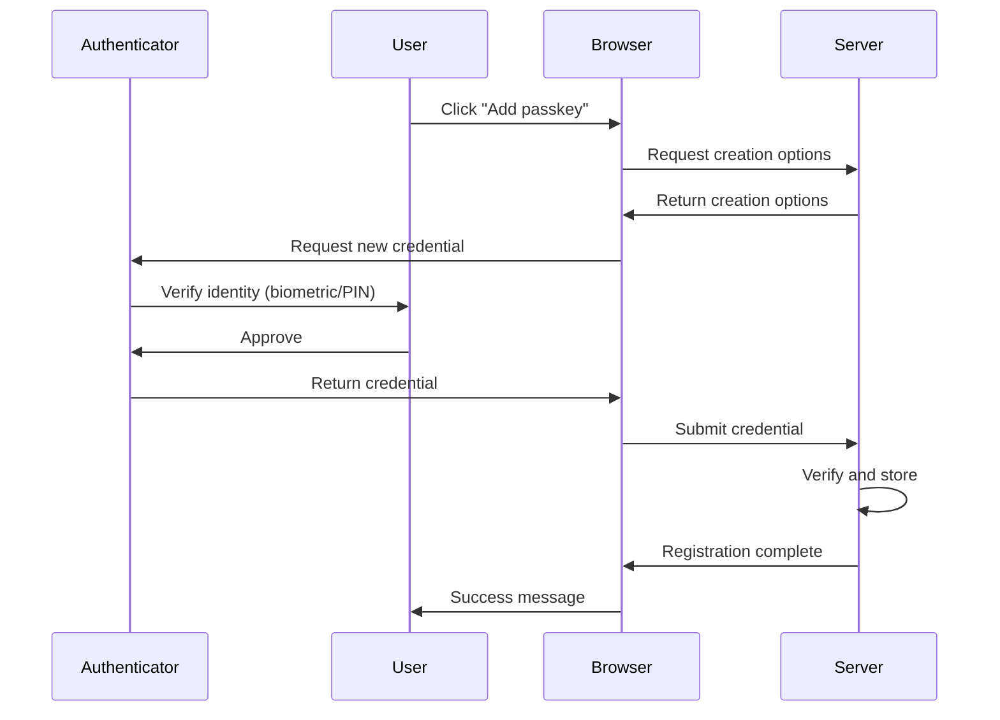

# Enable Web Authentication API (WebAuthn) passkeys in an ASP.NET Core Blazor Web App

<!-- [!INCLUDE[](~/includes/not-latest-version-without-not-supported-content.md)] -->

[!INCLUDE[](~/includes/not-latest-version.md)]

<!-- UPDATE 10.0 - API doc cross-links throughout article -->

Passkeys provide a modern, phishing-resistant authentication method based on the [Web Authentication API (WebAuthn)](https://developer.mozilla.org/docs/Web/API/Web_Authentication_API) and [FIDO2](https://www.microsoft.com/en-us/security/business/security-101/what-is-fido2) standards. They are a secure alternative to passwords, using public key cryptography and device-based authentication. This article explains how to configure an ASP.NET Core Blazor Web App to use passkeys to authenticate users.

The guidance in this article relies upon creating a .NET 10 or later Blazor Web App with **Individual Accounts** for the app's **Authentication type** or [scaffolding Identity](xref:security/authentication/scaffold-identity#scaffold-identity-into-a-blazor-project) into an existing .NET 10 or later Blazor Web App. For migration guidance from prior versions of .NET, see <xref:migration/blazor-web-app/passkeys>.

## What are passkeys?

Passkeys are a replacement for passwords that use cryptographic key pairs. The private key is stored securely on the user's device, such as in a hardware security module, platform authenticator (examples: Windows Hello, Touch ID, Face ID), or a password manager, while the public key is stored by the web app. During authentication, the user proves possession of the private key without it ever leaving their device.

Key benefits of passkeys include:

* **Phishing resistance**: Passkeys are bound to specific websites and can't be used on fake sites.
* **No shared secrets**: The server only stores public keys, eliminating the risk of password database breaches.
* **User convenience**: Simple biometric or PIN verification replaces complex password requirements.
* **Cross-device synchronization**: Many passkey providers sync credentials across a user's devices.

For more information, see [Web Authentication API (MDN documentation)](https://developer.mozilla.org/docs/Web/API/Web_Authentication_API).

## Passkeys in ASP.NET Core Identity

ASP.NET Core Identity includes built-in support for passkey registration and authentication:

* Seamless integration with Identity infrastructure.
* User authentication support for the most common WebAuthn scenarios.
* Built into the Blazor Web App project template, so only developer configuration is required.

> [!IMPORTANT]
> The passkey implementation in ASP.NET Core Identity is deliberately scoped to authentication scenarios. It isn't intended as a general-purpose WebAuthn library. Developers requiring full WebAuthn functionality should consider community libraries that provide comprehensive protocol support.

## Supported scenarios

The ASP.NET Core Identity passkey implementation supports the following primary scenarios:

* **Adding passkeys to existing accounts**: Users with password-based accounts can register passkeys as an additional authentication method.
* **Passwordless account creation**: Users can create accounts without a password by registering a passkey on account creation.
* **Passwordless sign-in**: Users can authenticate using only their passkey without entering a password.

## Limitations

The current implementation has the following limitations:

* **Scoped to ASP.NET Core Identity**: The APIs are designed specifically for Identity authentication scenarios.
* **No default attestation validation**: The implementation doesn't validate attestation statements by default.
* **Template support**: Only the Blazor Web App template includes passkey support.
* **No built-in 2FA support**: Passkeys are treated as a primary authentication factor, not as a second factor.

## Core concepts

Two fundamental processes underpin passkey operations: attestation and assertion.

### Attestation (registration)

*Attestation* is the process of creating and registering a new passkey. During attestation, the server generates a unique challenge that the authenticator must include in the returned credential. The authenticator creates a new key pair and returns the public key along with attestation data proving the key's origin. The server then verifies this attestation and stores the public key for future authentication attempts.

### Assertion (authentication)

*Assertion* is the process of authenticating with an existing passkey. The server generates a unique challenge, which the authenticator signs using the private key. The authenticator returns this signed assertion to the server, which verifies the signature using the previously stored public key. If the signature is valid, the user is authenticated.

## Prerequisites

<!-- UPDATE 10.0 - Remove preview link in favor of the download link ...

* [.NET SDK](https://dotnet.microsoft.com/download) (.NET 10 or later)

-->

* [.NET 10 SDK](https://dotnet.microsoft.com/download/dotnet/10.0)
* A modern web browser that supports WebAuthn.
* A device with a platform authenticator (such as Windows Hello, Touch ID, or Face ID) or a security key.

## Security considerations

When implementing passkeys in ASP.NET Core Identity, ensure the app meets the security requirements described in this section.

### Host header validation

The implementation infers the Relying Party ID from the host header when `ServerDomain` isn't explicitly configured. The hosting environment must validate host headers to prevent credential-scoping attacks, which involve using compromised or stolen user credentials (usernames, passwords, tokens) to gain unauthorized access.

**Mitigation**: Either explicitly configure `ServerDomain` in `IdentityPasskeyOptions` or ensure that the hosting environment (Kestrel, IIS, reverse proxy) validates host headers. For configuration details, see your hosting platform's documentation.

### Subdomain security

ASP.NET Core's passkeys implementation handles subdomain security through the `ServerDomain` configuration option. When `ServerDomain` isn't explicitly specified, the implementation uses the host header to determine the domain. This means that ***the page on which the passkey was registered controls the domain*** for that credential.

For example:

* If a passkey is registered on `app.contoso.com`, it also works on `*.app.contoso.com`.
* If registered on `contoso.com`, it also works on `*.contoso.com`.
* The browser enforces that passkeys can only be used on the domain (and subdomains) where they were registered.

**Requirement**: Apps requiring strict domain control should explicitly set `ServerDomain` rather than relying on the host header. Don't serve untrusted content on any subdomain within the `ServerDomain` scope. If you can't guarantee this, implement custom origin validation to restrict passkey usage to specific origins.

### HTTPS requirement

All passkey operations require HTTPS. The implementation stores authentication data in encrypted and signed cookies that could be intercepted over unencrypted connections.

**Requirement**: Always use HTTPS in production. Configure [HTTP Strict Transport Security Protocol (HSTS)](xref:security/enforcing-ssl#http-strict-transport-security-protocol-hsts) to prevent protocol downgrade attacks.

### Account recovery

Account recovery is primarily a concern for apps that allow passkeys as the only authentication mechanism. The default Blazor Web App project template already requires users to set up a backup authentication method (password or external provider) when creating an account, so account recovery is handled through these existing mechanisms.

**Recommendations**:

For applications implementing passkey-only authentication, consider:

* Recovery codes generated during account creation.
* Email-based recovery flows.
* Mandatory registration of multiple passkeys.
* Monitoring the `IsBackedUp` flag on `UserPasskeyInfo` to prompt users to add additional credentials.

### Administrative controls

When an authenticator model is discovered to have security vulnerabilities, you may need to revoke affected credentials. The implementation stores the complete attestation object with each credential, including the Authenticator Attestation GUID (AAGUID), which is a 128-bit identifier indicating the key type.

**Implementation**: Extract AAGUIDs from stored attestation objects, compare against known-compromised models, and revoke affected credentials. AAGUID reliability depends on whether your app validates attestation statements.

### Resource limits

To prevent database exhaustion attacks, apps should enforce limits on passkey registration, such as:

* Maximum number of passkeys per user account.
* Maximum length for passkey display names.

The Blazor Web App template enforces these limits by default.

## Create or migrate a Blazor Web App

For migration guidance to update an existing Blazor Web App to use passkeys, see <xref:migration/blazor-web-app/passkeys>.

Use the following guidance to create a new Blazor Web App with passkeys support.

# [Visual Studio](#tab/visual-studio)

> [!NOTE]
> Visual Studio 2022 or later and .NET 10 or later SDK are required.

In Visual Studio:

* Select **Create a new project** from the **Start Window** or select **File** > **New** > **Project** from the menu bar.
* In the **Create a new project** dialog, select **Blazor Web App** from the list of project templates. Select the **Next** button.
* In the **Configure your new project** dialog, name the project `BlazorWebAppPasskeys` in the **Project name** field, including matching the capitalization. Using this exact project name is important to ensure that the namespaces match for code that you copy from the article into the app that you're building.
* Confirm that the **Location** for the app is suitable. Leave the **Place solution and project in the same directory** checkbox selected. Select the **Next** button.
* In the **Additional information** dialog, set the **Authentication type** to **Individual Accounts**. Use the following settings for the other options:
  * **Framework**: Latest framework release (.NET 10 or later)
  * **Configure for HTTPS**: Selected
  * **Interactive render mode**: **Server**
  * **Interactivity location**: **Global**
  * **Include sample pages**: Selected
  * **Do not use top-level statements**: Not selected
  * **Use the .dev.localhost TLD in the application URL**: Not selected
  * Select **Create**.

# [Visual Studio Code](#tab/visual-studio-code)

This guidance assumes that you have familiarity with VS Code. If you're new to VS Code, see the [VS Code documentation](https://code.visualstudio.com/docs). The videos listed by the [Introductory Videos page](https://code.visualstudio.com/docs/getstarted/introvideos) are designed to give you an overview of VS Code's features.

In VS Code:

* Go to the **Explorer** view and select the **Create .NET Project** button. Alternatively, you can bring up the **Command Palette** using <kbd>Ctrl</kbd>+<kbd>Shift</kbd>+<kbd>P</kbd>, and then type "`.NET`" and find and select the **.NET: New Project** command.

* Select the **Blazor Web App** project template from the list.

* In the **Project Location** dialog, create or select a folder for the project.

* In the **Command Palette**, name the project `BlazorWebAppPasskeys`, including matching the capitalization. Using this exact project name is important to ensure that the namespaces match for code that you copy from the article into the app that you're building.

* Select **Create project** from the **Command Palette**.

# [.NET CLI](#tab/net-cli/)

In a command shell:

Change to the directory using the `cd` command to where you want to create the project folder (for example, `cd c:/users/Bernie_Kopell/Documents`).

Use the [`dotnet new` command](/dotnet/core/tools/dotnet-new) with the [`blazor` project template](/dotnet/core/tools/dotnet-new-sdk-templates#blazor) to create a new Blazor Web App project. The [`-o|--output` option](/dotnet/core/tools/dotnet-new#options) passed to the command creates the project in a new folder named `BlazorWebAppPasskeys` at the current directory location.

> [!IMPORTANT]
> Name the project `BlazorWebAppPasskeys`, including matching the capitalization, so the namespaces match for code that you copy from the article to the app.

```dotnetcli
dotnet new blazor -au Individual -o BlazorWebAppPasskeys
```

---

The preceding instructions create a Blazor Web App with:

* ASP.NET Core Identity configured for user authentication using the [`-au|--authentication` option](/dotnet/core/tools/dotnet-new-sdk-templates#blazor).
* Entity Framework Core with SQLite for data storage.
* Passkey registration and authentication endpoints.
* UI components for managing passkeys.

> [!NOTE]
> Currently, only the Blazor Web App project template includes built-in passkey support.

## Run the application

# [Visual Studio](#tab/visual-studio)

Press <kbd>F5</kbd> to run the app with debugging or <kbd>Ctrl</kbd>+<kbd>F5</kbd> to run the app without debugging.

# [Visual Studio Code](#tab/visual-studio-code)

Press <kbd>F5</kbd> to run the app with debugging or <kbd>Ctrl</kbd>+<kbd>F5</kbd> to run the app without debugging.

# [.NET CLI](#tab/net-cli/)

In a command shell opened to the root folder of the server `BlazorWebAppPasskeys` project, execute the following command:

```dotnetcli
dotnet watch
```

## Register a passkey

To test passkey functionality:

1. Register a new account or sign in with an existing account.
2. Navigate to **Manage your account** (select the username in the navigation menu).
3. Select **Passkeys** from the navigation menu.
4. Select **Add a new passkey**.
5. Follow the browser's prompts to create a passkey using your device's authenticator.

## Sign in with a passkey

After a passkey is registered:

1. Sign out of the app.
2. On the login page, enter your email address.
3. Select **Log in with a passkey**.
4. Follow the browser's prompts to authenticate with your passkey.

## Configure passkey options

ASP.NET Core Identity provides various options to configure passkey behavior through the `IdentityPasskeyOptions` class, which include:

* `AuthenticatorTimeout`: Gets or sets the time that the browser should wait for the authenticator to provide a passkey as a <xref:System.TimeSpan>. This option applies to both creating a new passkey and requesting an existing passkey. This option is treated as a hint to the browser, and the browser may ignore the option. The default value is 5 minutes.
* `ChallengeSize`: Gets or sets the size of the challenge in bytes sent to the client during attestation and assertion. This option applies to both creating a new passkey and requesting an existing passkey. The default value is 32 bytes.
* `ServerDomain`: Gets or sets the effective Relying Party ID (domain) of the server. This should be unique and will be used as the identity for the server. This option applies to both creating a new passkey and requesting an existing passkey. If `null`, which is the default value, the server's origin is used. For more information, see [Relying Party Identifier RP ID](https://www.w3.org/TR/webauthn-3/#rp-id).

Example configuration:

```csharp
builder.Services.Configure<IdentityPasskeyOptions>(options =>
{
    options.ServerDomain = "contoso.com";
    options.AuthenticatorTimeout = TimeSpan.FromMinutes(3);
    options.ChallengeSize = 64;
});
```

<!-- UPDATE 10.0 - For now, we'll point to the API. At GA, 
                   point this to the API docs and drop the 
                   ref source links NOTE ...

For a complete list of configuration options, see <xref:Microsoft.AspNetCore.Identity.IdentityPasskeyOptions%2A>.

-->

For a complete list of configuration options during the .NET 10 preview release period, see the [`IdentityPasskeyOptions` reference source (`dotnet/aspnetcore` GitHub repository)](https://github.com/dotnet/aspnetcore/blob/main/src/Identity/Core/src/IdentityPasskeyOptions.cs).

> [!NOTE]
> Documentation links to .NET reference source usually load the repository's default branch, which represents the current development for the next preview release of .NET. To select a tag for a specific release, use the **Switch branches or tags** dropdown list. For more information, see [How to select a version tag of ASP.NET Core source code (`dotnet/AspNetCore.Docs` #26205)](https://github.com/dotnet/AspNetCore.Docs/discussions/26205).

> [!NOTE]
> The browser defaults mentioned in the API documentation were valid as of August, 2025. See the [W3C WebAuthn specification](https://www.w3.org/TR/webauthn-3/) for the most up-to-date defaults.

## Custom attestation statement validation

By default, ASP.NET Core Identity doesn't validate attestation statements. This is suitable for most consumer authentication scenarios. If your app requires verification of authenticator properties (for example, in enterprise environments), you can implement custom attestation validation:

```csharp
builder.Services.Configure<IdentityPasskeyOptions>(options =>
{
    options.VerifyAttestationStatement = async (context) =>
    {
        // Custom attestation validation logic
        // Return 'true' if the attestation is valid
        // Return 'false' if the attestation is invalid
        return true;
    };
});
```

> [!WARNING]
> Attestation validation is complex and requires maintaining trust stores for authenticator certificates. Only implement custom validation if your app requires verification of specific authenticator properties.

## Custom origin validation

The default origin validation allows requests from subdomains and disallows cross-origin iframes. To customize this behavior:

```csharp
builder.Services.Configure<IdentityPasskeyOptions>(options =>
{
    options.ValidateOrigin = async (context) =>
    {
        // Custom origin validation logic
        //   Access the origin via 'context.Origin'
        //   Access the HTTP context via 'context.HttpContext'
        // Return 'true' if the origin is valid
        // Return 'false' if the origin is invalid
        return true;
    };
});
```

## Registration flow

This section walks through each step of the passkey registration process, explaining how ASP.NET Core Identity facilitates the creation and storage of passkey credentials.



### Step 1: Initiating registration

The registration process begins when a user decides to add a passkey to their account. This typically happens through a button or link in the app's user interface. When selected, this element triggers JavaScript code to orchestrate the registration flow.

The client-side implementation varies significantly between apps. In the Blazor Web App template, you can find a complete example in `PasskeySubmit.razor.js`, which shows how a custom web component handles the registration initiation and manages the subsequent WebAuthn API calls.

### Step 2: Requesting creation options

After registration is initiated, the browser must obtain creation options from the server. These options tell the browser what kind of credential to create and include important security parameters, such as the challenge that must be signed.

From the browser's perspective, this step involves making an HTTP request to the server:

```javascript
async function createCredential(headers, signal) {
  // Step 2: Request creation options from the server
  const optionsResponse = await fetchWithErrorHandling('/Account/PasskeyCreationOptions', {
    method: 'POST',
    headers,
    signal,
  });
  const optionsJson = await optionsResponse.json();
  const options = PublicKeyCredential.parseCreationOptionsFromJSON(optionsJson);
  return await navigator.credentials.create({ publicKey: options, signal });
}
```

The application should define an endpoint that generates these options:

```csharp
app.MapPost("/Account/PasskeyCreationOptions", async (
    HttpContext context,
    UserManager<ApplicationUser> userManager,
    SignInManager<ApplicationUser> signInManager) =>
{
    var user = await userManager.GetUserAsync(context.User);

    if (user is null)
    {
        return Results.NotFound();
    }

    var userId = await userManager.GetUserIdAsync(user);
    var userName = await userManager.GetUserNameAsync(user) ?? "User";
    
    var optionsJson = await signInManager.MakePasskeyCreationOptionsAsync(new()
    {
        Id = userId,
        Name = userName,
        DisplayName = userName
    });
    
    return TypedResults.Content(optionsJson, contentType: "application/json");
});
```

The `MakePasskeyCreationOptionsAsync` method is central to this process. The method accepts a `PasskeyUserEntity` that describes the user for whom the passkey is being created. This entity contains the user's ID, username (typically an email address), and a human-readable display name. The method returns a JSON string that conforms to the WebAuthn `PublicKeyCredentialCreationOptions` schema, which the browser uses in the next step. Behind the scenes, this method also stores temporary state in an authentication cookie to ensure that the response from the browser corresponds to these specific options.

### Step 3: Server generates options

When `MakePasskeyCreationOptionsAsync` executes, it uses the app's `IdentityPasskeyOptions` configuration to determine the specific parameters for credential creation. These options control various aspects of the passkey creation process.

You can customize these options during application startup. For example:

```csharp
builder.Services.Configure<IdentityPasskeyOptions>(options =>
{
    options.ServerDomain = "contoso.com";
    options.AuthenticatorTimeout = TimeSpan.FromMinutes(3);
    options.UserVerificationRequirement = "required";
    options.ResidentKeyRequirement = "preferred";
});
```

The `UserVerificationRequirement` option determines whether the authenticator must verify the user's identity (through biometric or PIN methods), while `ResidentKeyRequirement` indicates whether the credential should be discoverable, allowing authentication without first providing a username. For more information during the .NET 10 preview release period, see the [`IdentityPasskeyOptions` reference source (`dotnet/aspnetcore` GitHub repository)](https://github.com/dotnet/aspnetcore/blob/main/src/Identity/Core/src/IdentityPasskeyOptions.cs).

<!-- UPDATE 10.0 - Be sure to swap the last line out for the API doc cross-link 

For more information, see <xref:Microsoft.AspNetCore.Identity.IdentityPasskeyOptions%2A>.
-->

### Step 4: Client requests credential

With the creation options available, the client-side JavaScript passes the options to the WebAuthn API to create a new credential:

```javascript
async function createCredential(headers, signal) {
  // Step 4: Parse the options and request a new credential from the authenticator
  const optionsResponse = await fetchWithErrorHandling('/Account/PasskeyCreationOptions', {
    method: 'POST',
    headers,
    signal,
  });
  const optionsJson = await optionsResponse.json();
  const options = PublicKeyCredential.parseCreationOptionsFromJSON(optionsJson);
  return await navigator.credentials.create({ publicKey: options, signal });
}
```

The `parseCreationOptionsFromJSON` function converts the JSON response into the format expected by the WebAuthn API, and `navigator.credentials.create()` initiates the credential creation process with the authenticator.

### Step 5: Authenticator interaction

At this point, the browser communicates with the authenticator to create the credential. The authenticator prompts the user for verification, which might involve scanning a fingerprint, entering a PIN, or using facial recognition. This interaction is handled entirely by the browser and the authenticator, requiring no app code. The user experience varies depending on the type of authenticator and the platform's capabilities.

### Step 6: Credential submission

After the authenticator creates the credential, the browser must send the credential back to the server for verification and storage. The credential must be serialized to JSON before submission:

```javascript
async function createCredential(headers, signal) {
  // Step 6: The credential is returned from navigator.credentials.create()
  // and is serialized to JSON for submission to the server
  const optionsResponse = await fetchWithErrorHandling('/Account/PasskeyCreationOptions', {
    method: 'POST',
    headers,
    signal,
  });
  const optionsJson = await optionsResponse.json();
  const options = PublicKeyCredential.parseCreationOptionsFromJSON(optionsJson);
  return await navigator.credentials.create({ publicKey: options, signal });
}
```

In the Blazor Web App template, the returned credential is automatically serialized and submitted through a form, but the exact submission mechanism varies by application.

### Step 7: Server verification and storage

When the server receives the credential, it must verify its validity and store the public key for future authentication. This is where ASP.NET Core Identity's passkey APIs become crucial.

The `PerformPasskeyAttestationAsync` method validates the attestation response from the client. This comprehensive validation process:

* Verifies that the credential type matches expectations.
* Validates the client data JSON including origin and challenge.
* Checks authenticator data flags for user presence and verification
* Extracts and validates the public key.

If all checks pass, the method returns a `PasskeyAttestationResult` containing the verified passkey information.

After the attestation is verified, the app uses `AddOrUpdatePasskeyAsync` to store the passkey in the database:

```csharp
var attestationResult = await signInManager.PerformPasskeyAttestationAsync(credentialJson);

if (!attestationResult.Succeeded)
{
    return Results.BadRequest($"Error: {attestationResult.Failure.Message}");
}

var addResult = await userManager.AddOrUpdatePasskeyAsync(user, attestationResult.Passkey);

if (!addResult.Succeeded)
{
    return Results.BadRequest("Failed to store passkey");
}
```

The stored `UserPasskeyInfo` contains all of the necessary information for future authentication, including the credential ID, public key, signature counter for replay protection, and flags indicating whether the passkey is backed up or eligible for backup.

### Step 8: Post-registration tasks

After successfully registering a passkey, apps often perform additional tasks to improve the user experience. A common pattern is to prompt users to provide a friendly name for their passkey, making it easier to identify among multiple credentials. The `UserPasskeyInfo.Name` property stores this user-friendly name, which can be updated using the same `AddOrUpdatePasskeyAsync` method:

```csharp
passkey.Name = "My iPhone";
await userManager.AddOrUpdatePasskeyAsync(user, passkey);
```

## Authentication flow

This section explains how users authenticate with their passkeys, from initiating the sign-in process to establishing an authenticated session.


### Step 1: Initiating authentication

Users typically initiate passkey authentication through a dedicated button or link on the login page. Some apps also support conditional UI, where passkeys appear as autofill suggestions in the username field. The initiation method triggers JavaScript code that manages the authentication flow, similar to the registration process.

### Step 2: Requesting authentication options

The browser requests authentication options from the server to begin the authentication process. These options include a list of acceptable credentials and a new challenge to be signed:

```javascript
async function requestCredential(email, mediation, headers, signal) {
  // Step 2: Request authentication options from the server
  const optionsResponse = await fetchWithErrorHandling(`/Account/PasskeyRequestOptions?username=${email}`, {
    method: 'POST',
    headers,
    signal,
  });
  const optionsJson = await optionsResponse.json();
  const options = PublicKeyCredential.parseRequestOptionsFromJSON(optionsJson);
  return await navigator.credentials.get({ publicKey: options, mediation, signal });
}
```

The `MakePasskeyRequestOptionsAsync` method generates these options. When you provide a specific user, it includes only that user's credentials in the allow list. When called without a user, it generates options suitable for conditional UI or username-less authentication:

```csharp
app.MapPost("/Account/PasskeyRequestOptions", async (
    SignInManager<ApplicationUser> signInManager,
    string? username) =>
{
    var user = string.IsNullOrEmpty(username) 
        ? null 
        : await userManager.FindByNameAsync(username);

    var optionsJson = await signInManager.MakePasskeyRequestOptionsAsync(user);

    return TypedResults.Content(optionsJson, contentType: "application/json");
});
```

### Step 3: Server generates options

The server generates authentication options using the same `IdentityPasskeyOptions` configuration used during registration. The `ServerDomain` must match the domain where the passkey was originally registered, or authentication fails. The `UserVerificationRequirement` determines whether the authenticator must verify the user's identity during authentication.

### Step 4: Client requests assertion

The client-side JavaScript passes the authentication options to the WebAuthn API to request an assertion from the authenticator:

```javascript
async function requestCredential(email, mediation, headers, signal) {
  // Step 4: Parse the options and request an assertion from the authenticator
  const optionsResponse = await fetchWithErrorHandling(`/Account/PasskeyRequestOptions?username=${email}`, {
    method: 'POST',
    headers,
    signal,
  });
  const optionsJson = await optionsResponse.json();
  const options = PublicKeyCredential.parseRequestOptionsFromJSON(optionsJson);
  return await navigator.credentials.get({ publicKey: options, mediation, signal });
}
```

The `navigator.credentials.get()` call initiates the authentication process with the authenticator, which prompts the user for verification.

### Step 5: Authenticator verification

The authenticator verifies the user's identity and signs the challenge with the private key. This process is handled entirely by the browser and authenticator, similar to the verification step during registration. The user experience depends on the authenticator type and may involve biometric verification or PIN entry.

### Step 6: Assertion submission

After the authenticator creates the signed assertion, the browser serializes it to JSON and submits it to the server:

```javascript
async function requestCredential(email, mediation, headers, signal) {
  // Step 6: The assertion is returned from navigator.credentials.get()
  // and is serialized to JSON for submission to the server
  const optionsResponse = await fetchWithErrorHandling(`/Account/PasskeyRequestOptions?username=${email}`, {
    method: 'POST',
    headers,
    signal,
  });
  const optionsJson = await optionsResponse.json();
  const options = PublicKeyCredential.parseRequestOptionsFromJSON(optionsJson);
  return await navigator.credentials.get({ publicKey: options, mediation, signal });
}
```

The submission mechanism varies by app but typically involves either a form submission or an API call.

### Step 7: Server verification

The server verifies the assertion to authenticate the user. ASP.NET Core Identity provides the `PasskeySignInAsync` method, which performs the complete authentication flow in a single call:

```csharp
var result = await signInManager.PasskeySignInAsync(credentialJson);

if (result.Succeeded)
{
    return Results.Ok("Authentication successful");
}

return Results.Unauthorized();
```

The `PasskeySignInAsync` method internally calls `PerformPasskeyAssertionAsync` to:

* Validate the assertion signature using the stored public key.
* Verify that the challenge matches the one originally sent.
* Check authenticator flags for user presence and verification.
* Update the signature counter to prevent replay attacks.

If all checks pass, the method signs in the user and returns a `SignInResult` indicating success.

For scenarios requiring more control, you can use `PerformPasskeyAssertionAsync` directly to validate the assertion without immediately signing in the user. This returns a `PasskeyAssertionResult<TUser>` containing the authenticated user and updated passkey information.

### Step 8: Session establishment

Upon successful authentication, ASP.NET Core Identity establishes an authenticated session for the user. The `PasskeySignInAsync` method handles this automatically, creating the necessary authentication cookies and claims. The app then redirects the user to protected resources or display personalized content.

## Additional resources

* [Web Authentication API (MDN documentation)](https://developer.mozilla.org/docs/Web/API/Web_Authentication_API)
* [Get started with phishing-resistant passwordless authentication deployment in Microsoft Entra ID](/entra/identity/authentication/how-to-plan-prerequisites-phishing-resistant-passwordless-authentication)
