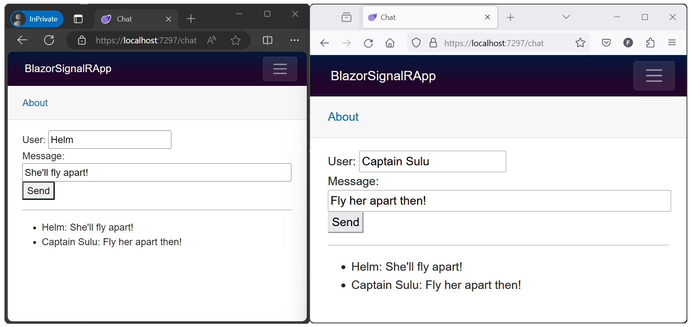

# Use ASP.NET Core SignalR with Blazor

[!INCLUDE[](~/includes/not-latest-version.md)]

This tutorial provides a basic working experience for building a real-time app using SignalR with Blazor. This article is useful for developers who are already familiar with SignalR and are seeking to understand how to use SignalR in a Blazor app. For detailed guidance on the SignalR and Blazor frameworks, see the following reference documentation sets and the API documentation:

* <xref:signalr/introduction>
* <xref:blazor/index>
* [.NET API browser](/dotnet/api/)

Learn how to:

> [!div class="checklist"]
> * Create a Blazor app
> * Add the SignalR client library
> * Add a SignalR hub
> * Add SignalR services and an endpoint for the SignalR hub
> * Add a Razor component code for chat

At the end of this tutorial, you'll have a working chat app.

:::moniker range=">= aspnetcore-8.0"

<!-- UPDATE 8.0 Update prereq content -->

## Prerequisites

# [Visual Studio](#tab/visual-studio)

[Visual Studio 2022 Preview](https://visualstudio.microsoft.com/vs/preview/) with the **ASP.NET and web development** workload

# [Visual Studio Code](#tab/visual-studio-code)

* [Visual Studio Code](https://code.visualstudio.com/download)
* [C# for Visual Studio Code (latest version)](https://marketplace.visualstudio.com/items?itemName=ms-dotnettools.csharp)
* [.NET 8.0 Preview](https://dotnet.microsoft.com/download/dotnet/8.0) if it isn't already installed on the system or if the system doesn't have the latest version installed.

The Visual Studio Code instructions use the .NET CLI for ASP.NET Core development functions such as project creation. You can follow these instructions on macOS, Linux, or Windows and with any code editor. Minor changes may be required if you use something other than Visual Studio Code.

# [.NET Core CLI](#tab/netcore-cli/)

[.NET 8.0 Preview](https://dotnet.microsoft.com/download/dotnet/8.0)

---

## Sample app

Downloading the tutorial's sample chat app isn't required for this tutorial. The sample app is the final, working app produced by following the steps of this tutorial.

[View or download sample code](https://github.com/dotnet/blazor-samples)

## Create a Blazor Web App

Follow the guidance for your choice of tooling:

# [Visual Studio](#tab/visual-studio)

> [!NOTE]
> Visual Studio 2022 or later and .NET Core SDK 8.0.0 or later are required.

Create a new project.

Select the **Blazor Web App** template. Select **Next**.

Type `BlazorSignalRApp` in the **Project name** field. Confirm the **Location** entry is correct or provide a location for the project. Select **Next**.

Confirm the **Framework** is .NET 8.0 or later. Select **Create**.

# [Visual Studio Code](#tab/visual-studio-code)

In a command shell, execute the following command:

```dotnetcli
dotnet new blazor -o BlazorSignalRApp
```

The `-o|--output` option creates a folder for the project. If you've created a folder for the project and the command shell is open in that folder, omit the `-o|--output` option and value to create the project.

In Visual Studio Code, open the app's project folder.

When Visual Studio Code requests that you add assets to build and debug the project, select **Yes**.

If Visual Studio Code doesn't automatically offer to add build and debug assets (the `.vscode` folder with `launch.json` and `tasks.json` files), select **View** > **Command Palette** and type "`.NET`" into the search box. From the list of commands, select the "`.NET: Generate Assets for Build and Debug`" command.

# [.NET Core CLI](#tab/netcore-cli/)

In a command shell, execute the following command:

```dotnetcli
dotnet new blazor -o BlazorSignalRApp
```

The `-o|--output` option creates a folder for the project. If you've created a folder for the project and the command shell is open in that folder, omit the `-o|--output` option and value to create the project.

---

## Add the SignalR client library

# [Visual Studio](#tab/visual-studio/)

In **Solution Explorer**, right-click the `BlazorSignalRApp` project and select **Manage NuGet Packages**.

In the **Manage NuGet Packages** dialog, confirm that the **Package source** is set to `nuget.org`.

With **Browse** and **Include prerelease** selected, type `Microsoft.AspNetCore.SignalR.Client` in the search box.

In the search results, select the latest **preview** [`Microsoft.AspNetCore.SignalR.Client`](https://www.nuget.org/packages/Microsoft.AspNetCore.SignalR.Client) package. <!-- Set the version to match the shared framework of the app. --> Select **Install**.

If the **Preview Changes** dialog appears, select **OK**.

If the **License Acceptance** dialog appears, select **I Accept** if you agree with the license terms.

# [Visual Studio Code](#tab/visual-studio-code/)

In the **Integrated Terminal** (**View** > **Terminal** from the toolbar), execute the following command:

```dotnetcli
dotnet add package Microsoft.AspNetCore.SignalR.Client --prerelease
```

<!-- UPDATE 8.0

Remove prerelease flag.

To add an earlier version of the package, supply the `--version {VERSION}` option, where the `{VERSION}` placeholder is the version of the package to add.

-->

# [.NET Core CLI](#tab/netcore-cli/)

In a command shell from the project's folder, execute the following command:

```dotnetcli
dotnet add package Microsoft.AspNetCore.SignalR.Client --prerelease
```

<!-- UPDATE 8.0

Remove prerelease flag.

To add an earlier version of the package, supply the `--version {VERSION}` option, where the `{VERSION}` placeholder is the version of the package to add.

-->

---

## Add a SignalR hub

Create a `Hubs` (plural) folder and add the following `ChatHub` class (`Hubs/ChatHub.cs`) to the root of the app:

:::code language="csharp" source="~/../blazor-samples/8.0/BlazorSignalRApp/Hubs/ChatHub.cs":::

## Add services and an endpoint for the SignalR hub

Open the `Program` file.

Add the namespaces for <xref:Microsoft.AspNetCore.ResponseCompression?displayProperty=fullName> and the `ChatHub` class to the top of the file:

```csharp
using Microsoft.AspNetCore.ResponseCompression;
using BlazorSignalRApp.Hubs;
```

Add Response Compression Middleware services:

```csharp
builder.Services.AddResponseCompression(opts =>
{
   opts.MimeTypes = ResponseCompressionDefaults.MimeTypes.Concat(
         new[] { "application/octet-stream" });
});
```

Use Response Compression Middleware at the top of the processing pipeline's configuration:
   
```csharp
app.UseResponseCompression();
```

Add an endpoint for the hub immediately after the line that maps Razor comonents (`app.MapRazorComponents<T>()`):

```csharp
app.MapHub<ChatHub>("/chathub");
```

## Add Razor component code for chat

Open the `Components/Pages/Home.razor` file.

Replace the markup with the following code:

:::code language="razor" source="~/../blazor-samples/8.0/BlazorSignalRApp/Components/Pages/Home.razor":::

> [!NOTE]
> Disable Response Compression Middleware in the `Development` environment when using [Hot Reload](xref:test/hot-reload). For more information, see <xref:blazor/fundamentals/signalr#disable-response-compression-for-hot-reload>.

## Run the app

Follow the guidance for your tooling:

# [Visual Studio](#tab/visual-studio)

Press <kbd>F5</kbd> to run the app with debugging or <kbd>Ctrl</kbd>+<kbd>F5</kbd> (Windows)/<kbd>⌘</kbd>+<kbd>F5</kbd> (macOS) to run the app without debugging.

# [Visual Studio Code](#tab/visual-studio-code)

Press <kbd>F5</kbd> to run the app with debugging or <kbd>Ctrl</kbd>+<kbd>F5</kbd> (Windows)/<kbd>⌘</kbd>+<kbd>F5</kbd> (macOS) to run the app without debugging.

# [.NET Core CLI](#tab/netcore-cli/)

In a command shell from the project's folder, execute the following commands:

```dotnetcli
dotnet run
```

---

Copy the URL from the address bar, open another browser instance or tab, and paste the URL in the address bar.

Choose either browser, enter a name and message, and select the button to send the message. The name and message are displayed on both pages instantly:



Quotes: *Star Trek VI: The Undiscovered Country* &copy;1991 [Paramount](https://www.paramountmovies.com/movies/star-trek-vi-the-undiscovered-country)

:::moniker-end

:::moniker range="< aspnetcore-8.0"

## Prerequisites

# [Visual Studio](#tab/visual-studio)

[Visual Studio 2022 or later](https://visualstudio.microsoft.com/downloads/?utm_medium=microsoft&utm_source=learn.microsoft.com&utm_campaign=inline+link&utm_content=download+vs2022) with the **ASP.NET and web development** workload

# [Visual Studio Code](#tab/visual-studio-code)

* [Visual Studio Code](https://code.visualstudio.com/download)
* [C# for Visual Studio Code (latest version)](https://marketplace.visualstudio.com/items?itemName=ms-dotnettools.csharp)
* [Download and install .NET](https://dotnet.microsoft.com/download/dotnet) if it isn't already installed on the system or if the system doesn't have the latest version installed.

The Visual Studio Code instructions use the .NET CLI for ASP.NET Core development functions such as project creation. You can follow these instructions on macOS, Linux, or Windows and with any code editor. Minor changes may be required if you use something other than Visual Studio Code.

# [.NET Core CLI](#tab/netcore-cli/)

[Download and install .NET](https://dotnet.microsoft.com/download/dotnet) if it isn't already installed on the system or if the system doesn't have the latest version installed.

---

## Sample app

Downloading the tutorial's sample chat app isn't required for this tutorial. The sample app is the final, working app produced by following the steps of this tutorial.

[View or download sample code](https://github.com/dotnet/blazor-samples)

## Hosted Blazor WebAssembly experience

### Create the app

Follow the guidance for your choice of tooling to create a hosted Blazor WebAssembly app:

# [Visual Studio](#tab/visual-studio)

> [!NOTE]
> Visual Studio 2022 or later and .NET Core SDK 6.0.0 or later are required.

Create a new project.

Choose the **Blazor WebAssembly App** template. Select **Next**.

Type `BlazorWebAssemblySignalRApp` in the **Project name** field. Confirm the **Location** entry is correct or provide a location for the project. Select **Next**.

In the **Additional information** dialog, select the **ASP.NET Core Hosted** checkbox.

Select **Create**.

Confirm that a hosted Blazor WebAssembly app was created: In **Solution Explorer**, confirm the presence of a **:::no-loc text="Client":::** project and a **:::no-loc text="Server":::** project. If the two projects aren't present, start over and confirm selection of the **ASP.NET Core Hosted** checkbox before selecting **Create**.

# [Visual Studio Code](#tab/visual-studio-code)

In a command shell, execute the following command:

```dotnetcli
dotnet new blazorwasm -ho -o BlazorWebAssemblySignalRApp
```

The `-ho|--hosted` option creates a hosted Blazor WebAssembly [solution](xref:blazor/tooling#visual-studio-solution-file-sln). For information on configuring VS Code assets in the `.vscode` folder, see the **Linux** operating system guidance in <xref:blazor/tooling>.

The `-o|--output` option creates a folder for the solution. If you've created a folder for the solution and the command shell is open in that folder, omit the `-o|--output` option and value to create the solution.

In Visual Studio Code, open the app's project folder.

Confirm that a hosted Blazor WebAssembly app was created: Confirm the presence of a **:::no-loc text="Client":::** project and a **:::no-loc text="Server":::** project in the app's solution folder. If the two projects aren't present, start over and confirm passing the `-ho` or `--hosted` option to the `dotnet new` command when creating the solution.

To configure Visual Studio Code debugging assets, see:

* <xref:blazor/tooling?pivots=linux-macos> (use the guidance for the *Linux / macOS* operating system regardless of platform)
* <xref:blazor/debug>

# [.NET Core CLI](#tab/netcore-cli)

In a command shell, execute the following command:

```dotnetcli
dotnet new blazorwasm -ho -o BlazorWebAssemblySignalRApp
```

The `-ho|--hosted` option creates a hosted Blazor WebAssembly [solution](xref:blazor/tooling#visual-studio-solution-file-sln).

The `-o|--output` option creates a folder for the solution. If you've created a folder for the solution and the command shell is open in that folder, omit the `-o|--output` option and value to create the solution.

Confirm that a hosted Blazor WebAssembly app was created: Confirm the presence of a **:::no-loc text="Client":::** project and a **:::no-loc text="Server":::** project in the app's solution folder. If the two projects aren't present, start over and confirm passing the `-ho` or `--hosted` option to the `dotnet new` command when creating the solution.

---

### Add the SignalR client library

# [Visual Studio](#tab/visual-studio/)

In **Solution Explorer**, right-click the `BlazorWebAssemblySignalRApp.Client` project and select **Manage NuGet Packages**.

In the **Manage NuGet Packages** dialog, confirm that the **Package source** is set to `nuget.org`.

With **Browse** selected, type `Microsoft.AspNetCore.SignalR.Client` in the search box.

In the search results, select the [`Microsoft.AspNetCore.SignalR.Client`](https://www.nuget.org/packages/Microsoft.AspNetCore.SignalR.Client) package. Set the version to match the shared framework of the app. Select **Install**.

If the **Preview Changes** dialog appears, select **OK**.

If the **License Acceptance** dialog appears, select **I Accept** if you agree with the license terms.

# [Visual Studio Code](#tab/visual-studio-code/)

In the **Integrated Terminal** (**View** > **Terminal** from the toolbar), execute the following command:

```dotnetcli
dotnet add Client package Microsoft.AspNetCore.SignalR.Client
```

To add an earlier version of the package, supply the `--version {VERSION}` option, where the `{VERSION}` placeholder is the version of the package to add.

# [.NET Core CLI](#tab/netcore-cli/)

In a command shell from the [solution's](xref:blazor/tooling#visual-studio-solution-file-sln) folder, execute the following command:

```dotnetcli
dotnet add Client package Microsoft.AspNetCore.SignalR.Client
```

To add an earlier version of the package, supply the `--version {VERSION}` option, where the `{VERSION}` placeholder is the version of the package to add.

---

### Add a SignalR hub

In the `BlazorWebAssemblySignalRApp.Server` project, create a `Hubs` (plural) folder and add the following `ChatHub` class (`Hubs/ChatHub.cs`):

:::moniker-end

:::moniker range=">= aspnetcore-7.0 < aspnetcore-8.0"

:::code language="csharp" source="~/../blazor-samples/7.0/BlazorWebAssemblySignalRApp/Server/Hubs/ChatHub.cs":::

:::moniker-end

:::moniker range=">= aspnetcore-6.0 < aspnetcore-7.0"

:::code language="csharp" source="~/../blazor-samples/6.0/BlazorWebAssemblySignalRApp/Server/Hubs/ChatHub.cs":::

:::moniker-end

:::moniker range=">= aspnetcore-5.0 < aspnetcore-6.0"

:::code language="csharp" source="~/../blazor-samples/5.0/BlazorWebAssemblySignalRApp/Server/Hubs/ChatHub.cs":::

:::moniker-end

:::moniker range="< aspnetcore-5.0"

:::code language="csharp" source="~/../blazor-samples/3.1/BlazorWebAssemblySignalRApp/Server/Hubs/ChatHub.cs":::

:::moniker-end

:::moniker range="< aspnetcore-8.0"

### Add services and an endpoint for the SignalR hub

:::moniker-end

:::moniker range=">= aspnetcore-6.0 < aspnetcore-8.0"

In the `BlazorWebAssemblySignalRApp.Server` project, open the `Program.cs` file.

Add the namespace for the `ChatHub` class to the top of the file:

```csharp
using BlazorWebAssemblySignalRApp.Server.Hubs;
```

Add SignalR and Response Compression Middleware services:

```csharp
builder.Services.AddSignalR();
builder.Services.AddResponseCompression(opts =>
{
      opts.MimeTypes = ResponseCompressionDefaults.MimeTypes.Concat(
         new[] { "application/octet-stream" });
});
```

Use Response Compression Middleware at the top of the processing pipeline's configuration immediately after the line that builds the app:
   
```csharp
app.UseResponseCompression();
```

Between the endpoints for controllers and the client-side fallback, add an endpoint for the hub. Immediately after the line `app.MapControllers();`, add the following line:

```csharp
app.MapHub<ChatHub>("/chathub");
```

:::moniker-end

:::moniker range="< aspnetcore-6.0"

In the `BlazorWebAssemblySignalRApp.Server` project, open the `Startup.cs` file.

Add the namespace for the `ChatHub` class to the top of the file:

```csharp
using BlazorWebAssemblySignalRApp.Server.Hubs;
```

Add SignalR and Response Compression Middleware services:

```csharp
services.AddSignalR();
services.AddResponseCompression(opts =>
{
      opts.MimeTypes = ResponseCompressionDefaults.MimeTypes.Concat(
         new[] { "application/octet-stream" });
});
```

Use Response Compression Middleware at the top of the processing pipeline's configuration:
   
```csharp
app.UseResponseCompression();
```

Between the endpoints for controllers and the client-side fallback, add an endpoint for the hub immediately after the line `endpoints.MapControllers();`:

```csharp
endpoints.MapHub<ChatHub>("/chathub");
```

:::moniker-end

:::moniker range="< aspnetcore-8.0"

### Add Razor component code for chat

In the `BlazorWebAssemblySignalRApp.Client` project, open the `Pages/Index.razor` file.

Replace the markup with the following code:

:::moniker-end

:::moniker range=">= aspnetcore-7.0 < aspnetcore-8.0"

:::code language="razor" source="~/../blazor-samples/7.0/BlazorWebAssemblySignalRApp/Client/Pages/Index.razor":::

:::moniker-end

:::moniker range=">= aspnetcore-6.0 < aspnetcore-7.0"

:::code language="razor" source="~/../blazor-samples/6.0/BlazorWebAssemblySignalRApp/Client/Pages/Index.razor":::

:::moniker-end

:::moniker range=">= aspnetcore-5.0 < aspnetcore-6.0"

:::code language="razor" source="~/../blazor-samples/5.0/BlazorWebAssemblySignalRApp/Client/Pages/Index.razor":::

:::moniker-end

:::moniker range="< aspnetcore-5.0"

:::code language="razor" source="~/../blazor-samples/3.1/BlazorWebAssemblySignalRApp/Client/Pages/Index.razor":::

:::moniker-end

:::moniker range=">= aspnetcore-6.0 < aspnetcore-8.0"

> [!NOTE]
> Disable Response Compression Middleware in the `Development` environment when using [Hot Reload](xref:test/hot-reload). For more information, see <xref:blazor/fundamentals/signalr#disable-response-compression-for-hot-reload>.

:::moniker-end

:::moniker range="< aspnetcore-8.0"

### Run the app

Follow the guidance for your tooling:

# [Visual Studio](#tab/visual-studio)

In **Solution Explorer**, select the `BlazorWebAssemblySignalRApp.Server` project. Press <kbd>F5</kbd> to run the app with debugging or <kbd>Ctrl</kbd>+<kbd>F5</kbd> (Windows)/<kbd>⌘</kbd>+<kbd>F5</kbd> (macOS) to run the app without debugging.

> [!IMPORTANT]
> When executing a hosted Blazor WebAssembly app, run the app from the [solution's](xref:blazor/tooling#visual-studio-solution-file-sln) **:::no-loc text="Server":::** project.
>
> Google Chrome or Microsoft Edge must be the selected browser for a debugging session.
> 
> If the app fails to start in the browser:
> 
> * In the .NET console, confirm that the solution is running from the ":::no-loc text="Server":::" project.
> * Refresh the browser using the browser's reload button.

# [Visual Studio Code](#tab/visual-studio-code)

For information on configuring VS Code assets in the `.vscode` folder, see the **Linux** operating system guidance in <xref:blazor/tooling>.

Press <kbd>F5</kbd> to run the app with debugging or <kbd>Ctrl</kbd>+<kbd>F5</kbd> (Windows)/<kbd>⌘</kbd>+<kbd>F5</kbd> (macOS) to run the app without debugging.

> [!IMPORTANT]
> When executing a hosted Blazor WebAssembly app, run the app from the [solution's](xref:blazor/tooling#visual-studio-solution-file-sln) **:::no-loc text="Server":::** project.
>
> Google Chrome or Microsoft Edge must be the selected browser for a debugging session.
> 
> If the app fails to start in the browser:
> 
> * In the .NET console, confirm that the solution is running from the ":::no-loc text="Server":::" project.
> * Refresh the browser using the browser's reload button.

# [.NET Core CLI](#tab/netcore-cli/)

In a command shell from the [solution's](xref:blazor/tooling#visual-studio-solution-file-sln) folder, execute the following commands:

```dotnetcli
cd Server
dotnet run
```

> [!IMPORTANT]
> When executing a hosted Blazor WebAssembly app, run the app from the solution's **:::no-loc text="Server":::** project.
> 
> If the app fails to start in the browser:
> 
> * In the .NET console, confirm that the solution is running from the ":::no-loc text="Server":::" project.
> * Refresh the browser using the browser's reload button.

---

Copy the URL from the address bar, open another browser instance or tab, and paste the URL in the address bar.

Choose either browser, enter a name and message, and select the button to send the message. The name and message are displayed on both pages instantly:


Quotes: *Star Trek VI: The Undiscovered Country* &copy;1991 [Paramount](https://www.paramountmovies.com/movies/star-trek-vi-the-undiscovered-country)

## Blazor Server experience

### Create the app

Follow the guidance for your choice of tooling to create a Blazor Server app:

# [Visual Studio](#tab/visual-studio)

> [!NOTE]
> Visual Studio 2022 or later and .NET Core SDK 6.0.0 or later are required.

Create a new project.

Select the **Blazor Server App** template. Select **Next**.

Type `BlazorServerSignalRApp` in the **Project name** field. Confirm the **Location** entry is correct or provide a location for the project. Select **Next**.

Select **Create**.

# [Visual Studio Code](#tab/visual-studio-code)

In a command shell, execute the following command:

```dotnetcli
dotnet new blazorserver -o BlazorServerSignalRApp
```

The `-o|--output` option creates a folder for the project. If you've created a folder for the project and the command shell is open in that folder, omit the `-o|--output` option and value to create the project.

In Visual Studio Code, open the app's project folder.

When the dialog appears to add assets to build and debug the app, select **Yes**. Visual Studio Code automatically adds the `.vscode` folder with generated `launch.json` and `tasks.json` files. For information on configuring VS Code assets in the `.vscode` folder, including how to manually add the files to the [solution](xref:blazor/tooling#visual-studio-solution-file-sln), see the **Linux** operating system guidance in <xref:blazor/tooling?pivot=linux>.

# [.NET Core CLI](#tab/netcore-cli/)

In a command shell, execute the following command:

```dotnetcli
dotnet new blazorserver -o BlazorServerSignalRApp
```

The `-o|--output` option creates a folder for the project. If you've created a folder for the project and the command shell is open in that folder, omit the `-o|--output` option and value to create the project.

---

### Add the SignalR client library

# [Visual Studio](#tab/visual-studio/)

In **Solution Explorer**, right-click the `BlazorServerSignalRApp` project and select **Manage NuGet Packages**.

In the **Manage NuGet Packages** dialog, confirm that the **Package source** is set to `nuget.org`.

With **Browse** selected, type `Microsoft.AspNetCore.SignalR.Client` in the search box.

In the search results, select the [`Microsoft.AspNetCore.SignalR.Client`](https://www.nuget.org/packages/Microsoft.AspNetCore.SignalR.Client) package. Set the version to match the shared framework of the app. Select **Install**.

If the **Preview Changes** dialog appears, select **OK**.

If the **License Acceptance** dialog appears, select **I Accept** if you agree with the license terms.

# [Visual Studio Code](#tab/visual-studio-code/)

In the **Integrated Terminal** (**View** > **Terminal** from the toolbar), execute the following command:

```dotnetcli
dotnet add package Microsoft.AspNetCore.SignalR.Client
```

To add an earlier version of the package, supply the `--version {VERSION}` option, where the `{VERSION}` placeholder is the version of the package to add.

# [.NET Core CLI](#tab/netcore-cli/)

In a command shell from the project's folder, execute the following command:

```dotnetcli
dotnet add package Microsoft.AspNetCore.SignalR.Client
```

To add an earlier version of the package, supply the `--version {VERSION}` option, where the `{VERSION}` placeholder is the version of the package to add.

---

:::moniker-end

:::moniker range="< aspnetcore-5.0"

### Add the System.Text.Encodings.Web package

*This section only applies to apps for ASP.NET Core version 3.x.*

Due to a package resolution issue when using [`System.Text.Json`](https://www.nuget.org/packages/System.Text.Json) 5.x in an ASP.NET Core 3.x app, the project requires a package reference for [`System.Text.Encodings.Web`](https://www.nuget.org/packages/System.Text.Encodings.Web). The underlying issue was resolved in a patch release and backported to ASP.NET Core 5.0. For more information, see [System.Text.Json defines netcoreapp3.0 with no dependencies (dotnet/runtime #45560)](https://github.com/dotnet/runtime/issues/45560).

To add [`System.Text.Encodings.Web`](https://www.nuget.org/packages/System.Text.Encodings.Web) to the project, follow the guidance for your choice of tooling:

# [Visual Studio](#tab/visual-studio/)

In **Solution Explorer**, right-click the `BlazorServerSignalRApp` project and select **Manage NuGet Packages**.

In the **Manage NuGet Packages** dialog, confirm that the **Package source** is set to `nuget.org`.

With **Browse** selected, type `System.Text.Encodings.Web` in the search box.

In the search results, select the [`System.Text.Encodings.Web`](https://www.nuget.org/packages/System.Text.Encodings.Web) package. Select the version of the package that matches the shared framework in use. Select **Install**.

If the **Preview Changes** dialog appears, select **OK**.

If the **License Acceptance** dialog appears, select **I Accept** if you agree with the license terms.

# [Visual Studio Code](#tab/visual-studio-code/)

In the **Integrated Terminal** (**View** > **Terminal** from the toolbar), execute the following commands:

```dotnetcli
dotnet add package System.Text.Encodings.Web
```

To add an earlier version of the package, supply the `--version {VERSION}` option, where the `{VERSION}` placeholder is the version of the package to add.

# [.NET Core CLI](#tab/netcore-cli/)

In a command shell from the project's folder, execute the following command:

```dotnetcli
dotnet add package System.Text.Encodings.Web
```

To add an earlier version of the package, supply the `--version {VERSION}` option, where the `{VERSION}` placeholder is the version of the package to add.

---

:::moniker-end

:::moniker range="< aspnetcore-8.0"

### Add a SignalR hub

Create a `Hubs` (plural) folder and add the following `ChatHub` class (`Hubs/ChatHub.cs`):

:::moniker-end

:::moniker range=">= aspnetcore-7.0 < aspnetcore-8.0"

:::code language="csharp" source="~/../blazor-samples/7.0/BlazorServerSignalRApp/Hubs/ChatHub.cs":::

:::moniker-end

:::moniker range=">= aspnetcore-6.0 < aspnetcore-7.0"

:::code language="csharp" source="~/../blazor-samples/6.0/BlazorServerSignalRApp/Hubs/ChatHub.cs":::

:::moniker-end

:::moniker range=">= aspnetcore-5.0 < aspnetcore-6.0"

:::code language="csharp" source="~/../blazor-samples/5.0/BlazorServerSignalRApp/Hubs/ChatHub.cs":::

:::moniker-end

:::moniker range="< aspnetcore-5.0"

:::code language="csharp" source="~/../blazor-samples/3.1/BlazorServerSignalRApp/Hubs/ChatHub.cs":::

:::moniker-end

:::moniker range="< aspnetcore-8.0"

### Add services and an endpoint for the SignalR hub

:::moniker-end

:::moniker range=">= aspnetcore-6.0 < aspnetcore-8.0"

Open the `Program.cs` file.

Add the namespaces for <xref:Microsoft.AspNetCore.ResponseCompression?displayProperty=fullName> and the `ChatHub` class to the top of the file:

```csharp
using Microsoft.AspNetCore.ResponseCompression;
using BlazorServerSignalRApp.Server.Hubs;
```

Add Response Compression Middleware services:

```csharp
builder.Services.AddResponseCompression(opts =>
{
   opts.MimeTypes = ResponseCompressionDefaults.MimeTypes.Concat(
         new[] { "application/octet-stream" });
});
```

Use Response Compression Middleware at the top of the processing pipeline's configuration:
   
```csharp
app.UseResponseCompression();
```

Between the endpoints for mapping the Blazor hub and the client-side fallback, add an endpoint for the hub immediately after the line `app.MapBlazorHub();`:

```csharp
app.MapHub<ChatHub>("/chathub");
```

:::moniker-end

:::moniker range="< aspnetcore-6.0"

Open the `Startup.cs` file.

Add the namespaces for <xref:Microsoft.AspNetCore.ResponseCompression?displayProperty=fullName> and the `ChatHub` class to the top of the file:

```csharp
using Microsoft.AspNetCore.ResponseCompression;
using BlazorServerSignalRApp.Server.Hubs;
```

Add Response Compression Middleware services:

```csharp
services.AddResponseCompression(opts =>
{
   opts.MimeTypes = ResponseCompressionDefaults.MimeTypes.Concat(
         new[] { "application/octet-stream" });
});
```

Use Response Compression Middleware at the top of the processing pipeline's configuration:
   
```csharp
app.UseResponseCompression();
```

Between the endpoints for mapping the Blazor hub and the client-side fallback, add an endpoint for the hub immediately after the line `endpoints.MapBlazorHub();`:

```csharp
endpoints.MapHub<ChatHub>("/chathub");
```

:::moniker-end

:::moniker range="< aspnetcore-8.0"

### Add Razor component code for chat

Open the `Pages/Index.razor` file.

Replace the markup with the following code:

:::moniker-end

:::moniker range=">= aspnetcore-7.0 < aspnetcore-8.0"

:::code language="razor" source="~/../blazor-samples/7.0/BlazorServerSignalRApp/Pages/Index.razor":::

:::moniker-end

:::moniker range=">= aspnetcore-6.0 < aspnetcore-7.0"

:::code language="razor" source="~/../blazor-samples/6.0/BlazorServerSignalRApp/Pages/Index.razor":::

:::moniker-end

:::moniker range=">= aspnetcore-5.0 < aspnetcore-6.0"

:::code language="razor" source="~/../blazor-samples/5.0/BlazorServerSignalRApp/Pages/Index.razor":::

:::moniker-end

:::moniker range="< aspnetcore-5.0"

:::code language="razor" source="~/../blazor-samples/3.1/BlazorServerSignalRApp/Pages/Index.razor":::

:::moniker-end

:::moniker range=">= aspnetcore-6.0 < aspnetcore-8.0"

> [!NOTE]
> Disable Response Compression Middleware in the `Development` environment when using [Hot Reload](xref:test/hot-reload). For more information, see <xref:blazor/fundamentals/signalr#disable-response-compression-for-hot-reload>.

:::moniker-end

:::moniker range="< aspnetcore-8.0"

### Run the app

Follow the guidance for your tooling:

# [Visual Studio](#tab/visual-studio)

Press <kbd>F5</kbd> to run the app with debugging or <kbd>Ctrl</kbd>+<kbd>F5</kbd> (Windows)/<kbd>⌘</kbd>+<kbd>F5</kbd> (macOS) to run the app without debugging.

# [Visual Studio Code](#tab/visual-studio-code)

Press <kbd>F5</kbd> to run the app with debugging or <kbd>Ctrl</kbd>+<kbd>F5</kbd> (Windows)/<kbd>⌘</kbd>+<kbd>F5</kbd> (macOS) to run the app without debugging.

# [.NET Core CLI](#tab/netcore-cli/)

In a command shell from the project's folder, execute the following commands:

```dotnetcli
dotnet run
```

---

Copy the URL from the address bar, open another browser instance or tab, and paste the URL in the address bar.

Choose either browser, enter a name and message, and select the button to send the message. The name and message are displayed on both pages instantly:


Quotes: *Star Trek VI: The Undiscovered Country* &copy;1991 [Paramount](https://www.paramountmovies.com/movies/star-trek-vi-the-undiscovered-country)

:::moniker-end

## Next steps

In this tutorial, you learned how to:

> [!div class="checklist"]
> * Create a Blazor app
> * Add the SignalR client library
> * Add a SignalR hub
> * Add SignalR services and an endpoint for the SignalR hub
> * Add a Razor component code for chat

For detailed guidance on the SignalR and Blazor frameworks, see the following reference documentation sets:

> [!div class="nextstepaction"]
> <xref:signalr/introduction>
> <xref:blazor/index>

## Additional resources

* [Bearer token authentication with Identity Server, WebSockets, and Server-Sent Events](xref:signalr/authn-and-authz#bearer-token-authentication)
* [Secure a SignalR hub in hosted Blazor WebAssembly apps](xref:blazor/security/webassembly/index#secure-a-signalr-hub)
* [SignalR cross-origin negotiation for authentication](xref:blazor/fundamentals/signalr#client-side-signalr-cross-origin-negotiation-for-authentication)
* [SignalR configuration](xref:blazor/host-and-deploy/server#signalr-configuration)
* <xref:blazor/debug>
* <xref:blazor/security/server/threat-mitigation>
* [Blazor samples GitHub repository (`dotnet/blazor-samples`)](https://github.com/dotnet/blazor-samples)
