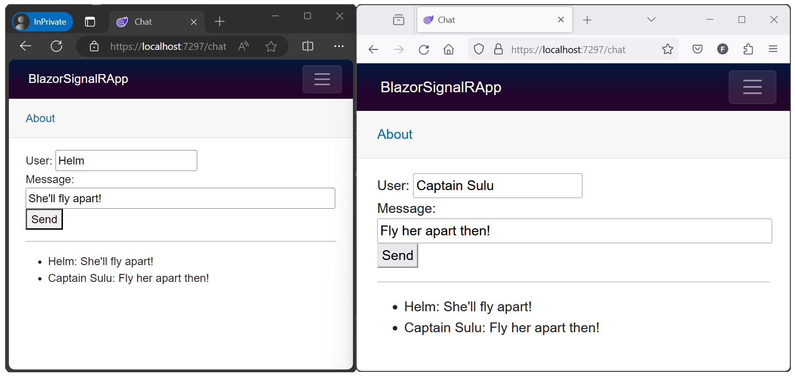
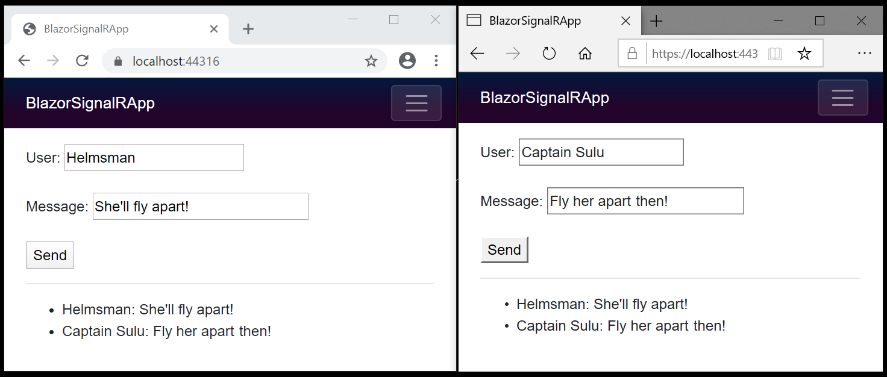

# Use ASP.NET Core SignalR with Blazor

[!INCLUDE[](~/includes/not-latest-version.md)]

This tutorial provides a basic working experience for building a real-time app using SignalR with Blazor. This article is useful for developers who are already familiar with SignalR and are seeking to understand how to use SignalR in a Blazor app. For detailed guidance on the SignalR and Blazor frameworks, see the following reference documentation sets and the API documentation:

* <xref:signalr/introduction>
* <xref:blazor/index>
* [.NET API browser](/dotnet/api/)

Learn how to:

> [!div class="checklist"]
> * Create a Blazor app
> * Add the SignalR client library
> * Add a SignalR hub
> * Add SignalR services and an endpoint for the SignalR hub
> * Add a Razor component code for chat

At the end of this tutorial, you'll have a working chat app.

## Prerequisites

# [Visual Studio](#tab/visual-studio)

[Visual Studio (latest release)](https://visualstudio.microsoft.com/downloads/?utm_medium=microsoft&utm_source=learn.microsoft.com&utm_campaign=inline+link&utm_content=download+vs2022) with the **ASP.NET and web development** workload

# [Visual Studio Code](#tab/visual-studio-code)

Install the latest releases of the following:

* [Visual Studio Code](https://code.visualstudio.com/download)
* [C# Dev Kit](https://marketplace.visualstudio.com/items?itemName=ms-dotnettools.csdevkit)
* [.NET SDK](https://dotnet.microsoft.com/download/dotnet)

For more information, see <xref:blazor/debug#visual-studio-code-prerequisites>.

The Visual Studio Code instructions use the .NET CLI for ASP.NET Core development functions such as project creation. You can follow these instructions on macOS, Linux, or Windows and with any code editor. Minor changes may be required if you use an integrated development environment (IDE) other than Visual Studio Code.

# [.NET CLI](#tab/net-cli/)

[.NET SDK (latest release)](https://dotnet.microsoft.com/download/dotnet)

---

## Sample app

:::moniker range=">= aspnetcore-8.0"

Downloading the tutorial's sample chat app isn't required for this tutorial. The sample app is the final, working app produced by following the steps of this tutorial. When you open the samples repository, open the version folder that you plan to target and find the sample named `BlazorSignalRApp`.

:::moniker-end

:::moniker range="< aspnetcore-8.0"

Downloading the tutorial's sample chat app isn't required for this tutorial. The sample app is the final, working app produced by following the steps of this tutorial. When you open the samples repository, open the version folder that you plan to target and find the sample named `BlazorWebAssemblySignalRApp`.

:::moniker-end

[View or download sample code](https://github.com/dotnet/blazor-samples) ([how to download](xref:blazor/fundamentals/index#sample-apps))

:::moniker range=">= aspnetcore-8.0"

## Create a Blazor Web App

Follow the guidance for your choice of tooling:

# [Visual Studio](#tab/visual-studio)

> [!NOTE]
> Visual Studio 2022 or later and .NET Core SDK 8.0.0 or later are required.

In Visual Studio:

* Select **Create a new project** from the **Start Window** or select **File** > **New** > **Project** from the menu bar.
* In the **Create a new project** dialog, select **Blazor Web App** from the list of project templates. Select the **Next** button.
* In the **Configure your new project** dialog, name the project `BlazorSignalRApp` in the **Project name** field, including matching the capitalization. Using this exact project name is important to ensure that the namespaces match for code that you copy from the tutorial into the app that you're building.
* Confirm that the **Location** for the app is suitable. Leave the **Place solution and project in the same directory** checkbox selected. Select the **Next** button.
* In the **Additional information** dialog, use the following settings:
  * **Framework**: Confirm that the [latest framework](https://dotnet.microsoft.com/download/dotnet) is selected. If Visual Studio's **Framework** dropdown list doesn't include the latest available .NET framework, [update Visual Studio](/visualstudio/install/update-visual-studio) and restart the tutorial.
  * **Authentication type**: **None**
  * **Configure for HTTPS**: Selected
  * **Interactive render mode**: **WebAssembly**
  * **Interactivity location**: **Per page/component**
  * **Include sample pages**: Selected
  * **Do not use top-level statements**: Not selected
  * Select **Create**.

# [Visual Studio Code](#tab/visual-studio-code)

This tutorial assumes that you have familiarity with VS Code. If you're new to VS Code, see the [VS Code documentation](https://code.visualstudio.com/docs). The videos listed by the [Introductory Videos page](https://code.visualstudio.com/docs/getstarted/introvideos) are designed to give you an overview of VS Code's features.

In VS Code:

* Go to the **Explorer** view and select the **Create .NET Project** button. Alternatively, you can bring up the **Command Palette** using <kbd>Ctrl</kbd>+<kbd>Shift</kbd>+<kbd>P</kbd>, and then type "`.NET`" and find and select the **.NET: New Project** command.

* Select the **Blazor Web App** project template from the list.

* In the **Project Location** dialog, create or select a folder for the project.

* In the **Command Palette**, name the project `BlazorSignalRApp`, including matching the capitalization. Using this exact project name is important to ensure that the namespaces match for code that you copy from the tutorial into the app that you're building.

* Adjust the project's options by selecting **Show all template options**.

  Change **Interactive render mode** to **WebAssembly**.

  After the preceding changes are made, the **Command Palette** shows the following:

  * **Framework**: Set to the latest public non-preview release of .NET.
  * **Authentication type**: **None**
  * **Configure for HTTPS**: **true**
  * **Interactive render mode**: **WebAssembly**
  * **Interactivity location**: **Per page/component**
  * **Include sample pages**: **true**
  * **Do not use top-level statements**: **false**

* Select **Create project** from the **Command Palette**.

# [.NET CLI](#tab/net-cli/)

In a command shell:

* Change to the directory using the `cd` command to where you want to create the project folder (for example, `cd c:/users/Bernie_Kopell/Documents`).
* Use the [`dotnet new` command](/dotnet/core/tools/dotnet-new) with the [`blazor` project template](/dotnet/core/tools/dotnet-new-sdk-templates#blazor) to create a new Blazor Web App project. The [`-o|--output` option](/dotnet/core/tools/dotnet-new#options) passed to the command creates the project in a new folder named `BlazorSignalRApp` at the current directory location. Pass the `-int|--interactivity` option with `WebAssembly` to adopt client-side rendering (CSR). Pass the `-ai|--all-interactive` option with `False` to adopt per-page/component interactivity location.

  > [!IMPORTANT]
  > Name the project `BlazorSignalRApp`, including matching the capitalization, so the namespaces match for code that you copy from the tutorial to the app as you follow the tutorial.

  ```dotnetcli
  dotnet new blazor -o BlazorSignalRApp -int WebAssembly -ai False
  ```

---

The guidance in this article uses a WebAssembly component for the SignalR client because it doesn't make sense to use SignalR to connect to a hub from an Interactive Server component in the same app, as that can lead to server port exhaustion.

## Add the SignalR client library

# [Visual Studio](#tab/visual-studio/)

In **Solution Explorer**, right-click the `BlazorSignalRApp.Client` project and select **Manage NuGet Packages**.

In the **Manage NuGet Packages** dialog, confirm that the **Package source** is set to `nuget.org`.

With **Browse** selected, type `Microsoft.AspNetCore.SignalR.Client` in the search box.

In the search results, select the latest release of the [`Microsoft.AspNetCore.SignalR.Client`](https://www.nuget.org/packages/Microsoft.AspNetCore.SignalR.Client) package. Select **Install**.

If the **Preview Changes** dialog appears, select **OK**.

If the **License Acceptance** dialog appears, select **I Accept** if you agree with the license terms.

# [Visual Studio Code](#tab/visual-studio-code/)

In the **Terminal** (**Terminal** > **New Terminal** from the menu bar opened to the `BlazorSignalRApp.Client` project using `cd BlazorSignalRApp.Client`), execute the following command:

```powershell
dotnet add package Microsoft.AspNetCore.SignalR.Client
```

To add an earlier version of the package, supply the `--version {VERSION}` option, where the `{VERSION}` placeholder is the version of the package to add.

# [.NET CLI](#tab/net-cli/)

In a command shell opened to the `BlazorSignalRApp.Client` project, execute the following command:

```dotnetcli
dotnet add package Microsoft.AspNetCore.SignalR.Client
```

To add an earlier version of the package, supply the `--version {VERSION}` option, where the `{VERSION}` placeholder is the version of the package to add.

---

## Add a SignalR hub

In the server `BlazorSignalRApp` project, create a `Hubs` (plural) folder and add the following `ChatHub` class (`Hubs/ChatHub.cs`):

:::code language="csharp" source="~/../blazor-samples/8.0/BlazorSignalRApp/BlazorSignalRApp/Hubs/ChatHub.cs":::

## Add services and an endpoint for the SignalR hub

Open the `Program` file of the server `BlazorSignalRApp` project.

Add the namespaces for <xref:Microsoft.AspNetCore.ResponseCompression?displayProperty=fullName> and the `ChatHub` class to the top of the file:

```csharp
using Microsoft.AspNetCore.ResponseCompression;
using BlazorSignalRApp.Hubs;
```

Add SignalR and Response Compression Middleware services:

```csharp
builder.Services.AddSignalR();

builder.Services.AddResponseCompression(opts =>
{
   opts.MimeTypes = ResponseCompressionDefaults.MimeTypes.Concat(
       ["application/octet-stream"]);
});
```

Use Response Compression Middleware at the top of the processing pipeline's configuration. Place the following line of code immediately after the line that builds the app (`var app = builder.Build();`):
   
```csharp
app.UseResponseCompression();
```

Add an endpoint for the hub immediately before the line that runs the app (`app.Run();`):

```csharp
app.MapHub<ChatHub>("/chathub");
```

## Add Razor component code for chat

Add the following `Pages/Chat.razor` file to the `BlazorSignalRApp.Client` project:

:::code language="razor" source="~/../blazor-samples/8.0/BlazorSignalRApp/BlazorSignalRApp.Client/Pages/Chat.razor":::

Add an entry to the `NavMenu` component to reach the chat page. In `Components/Layout/NavMenu.razor` immediately after the `<div>` block for the `Weather` component, add the following `<div>` block:

```razor
<div class="nav-item px-3">
    <NavLink class="nav-link" href="chat">
        <span class="bi bi-list-nested-nav-menu" aria-hidden="true"></span> Chat
    </NavLink>
</div>
```

> [!NOTE]
> Disable Response Compression Middleware in the `Development` environment when using [Hot Reload](xref:test/hot-reload). For more information, see <xref:blazor/fundamentals/signalr#disable-response-compression-for-hot-reload>.

## Run the app

Follow the guidance for your tooling:

# [Visual Studio](#tab/visual-studio)

With the server `BlazorSignalRApp` project selected in **Solution Explorer**, press <kbd>F5</kbd> to run the app with debugging or <kbd>Ctrl</kbd>+<kbd>F5</kbd> (Windows)/<kbd>⌘</kbd>+<kbd>F5</kbd> (macOS) to run the app without debugging.

# [Visual Studio Code](#tab/visual-studio-code)

Press <kbd>F5</kbd> to run the app with debugging or <kbd>Ctrl</kbd>+<kbd>F5</kbd> (Windows)/<kbd>⌘</kbd>+<kbd>F5</kbd> (macOS) to run the app without debugging.

# [.NET CLI](#tab/net-cli/)

In a command shell opened to the root folder of the server `BlazorSignalRApp` project, execute the following command:

```dotnetcli
dotnet watch
```

---

Copy the URL from the address bar, open another browser instance or tab, and paste the URL in the address bar.

Choose either browser, enter a name and message, and select the button to send the message. The name and message are displayed on both pages instantly:



Quotes: *Star Trek VI: The Undiscovered Country* &copy;1991 [Paramount](https://www.paramountmovies.com/movies/star-trek-vi-the-undiscovered-country)

:::moniker-end

:::moniker range="< aspnetcore-8.0"

## Hosted Blazor WebAssembly experience

### Create the app

Follow the guidance for your choice of tooling to create a hosted Blazor WebAssembly app:

# [Visual Studio](#tab/visual-studio)

> [!NOTE]
> Visual Studio 2022 or later and .NET Core SDK 6.0.0 or later are required.

Create a new project.

Choose the **Blazor WebAssembly App** template. Select **Next**.

Type `BlazorWebAssemblySignalRApp` in the **Project name** field. Confirm the **Location** entry is correct or provide a location for the project. Select **Next**.

In the **Additional information** dialog, select the **ASP.NET Core Hosted** checkbox.

Select **Create**.

Confirm that a hosted Blazor WebAssembly app was created: In **Solution Explorer**, confirm the presence of a **:::no-loc text="Client":::** project and a **:::no-loc text="Server":::** project. If the two projects aren't present, start over and confirm selection of the **ASP.NET Core Hosted** checkbox before selecting **Create**.

# [Visual Studio Code](#tab/visual-studio-code)

In a command shell, execute the following command:

```dotnetcli
dotnet new blazorwasm -ho -o BlazorWebAssemblySignalRApp
```

The `-ho|--hosted` option creates a hosted Blazor WebAssembly [solution](xref:blazor/tooling#visual-studio-solution-file-sln). For information on configuring VS Code assets in the `.vscode` folder, see the **Linux** operating system guidance in <xref:blazor/tooling>.

The `-o|--output` option creates a folder for the solution. If you've created a folder for the solution and the command shell is open in that folder, omit the `-o|--output` option and value to create the solution.

In Visual Studio Code, open the app's project folder.

Confirm that a hosted Blazor WebAssembly app was created: Confirm the presence of a **:::no-loc text="Client":::** project and a **:::no-loc text="Server":::** project in the app's solution folder. If the two projects aren't present, start over and confirm passing the `-ho` or `--hosted` option to the `dotnet new` command when creating the solution.

To configure Visual Studio Code debugging assets, see:

* <xref:blazor/tooling?pivots=linux-macos> (use the guidance for the *Linux / macOS* operating system regardless of platform)
* <xref:blazor/debug>

# [.NET CLI](#tab/net-cli)

In a command shell, execute the following command:

```dotnetcli
dotnet new blazorwasm -ho -o BlazorWebAssemblySignalRApp
```

The `-ho|--hosted` option creates a hosted Blazor WebAssembly [solution](xref:blazor/tooling#visual-studio-solution-file-sln).

The `-o|--output` option creates a folder for the solution. If you've created a folder for the solution and the command shell is open in that folder, omit the `-o|--output` option and value to create the solution.

Confirm that a hosted Blazor WebAssembly app was created: Confirm the presence of a **:::no-loc text="Client":::** project and a **:::no-loc text="Server":::** project in the app's solution folder. If the two projects aren't present, start over and confirm passing the `-ho` or `--hosted` option to the `dotnet new` command when creating the solution.

---

### Add the SignalR client library

# [Visual Studio](#tab/visual-studio/)

In **Solution Explorer**, right-click the `BlazorWebAssemblySignalRApp.Client` project and select **Manage NuGet Packages**.

In the **Manage NuGet Packages** dialog, confirm that the **Package source** is set to `nuget.org`.

With **Browse** selected, type `Microsoft.AspNetCore.SignalR.Client` in the search box.

In the search results, select the [`Microsoft.AspNetCore.SignalR.Client`](https://www.nuget.org/packages/Microsoft.AspNetCore.SignalR.Client) package. Set the version to match the shared framework of the app. Select **Install**.

If the **Preview Changes** dialog appears, select **OK**.

If the **License Acceptance** dialog appears, select **I Accept** if you agree with the license terms.

# [Visual Studio Code](#tab/visual-studio-code/)

In the **Terminal** (**Terminal** > **New Terminal** from the menu bar opened to the `BlazorWebAssemblySignalRApp.Client` project using `cd BlazorWebAssemblySignalRApp.Client`), execute the following command:

```dotnetcli
dotnet add Client package Microsoft.AspNetCore.SignalR.Client
```

To add an earlier version of the package, supply the `--version {VERSION}` option, where the `{VERSION}` placeholder is the version of the package to add.

# [.NET CLI](#tab/net-cli/)

In a command shell from the [solution's](xref:blazor/tooling#visual-studio-solution-file-sln) folder, execute the following command:

```dotnetcli
dotnet add Client package Microsoft.AspNetCore.SignalR.Client
```

To add an earlier version of the package, supply the `--version {VERSION}` option, where the `{VERSION}` placeholder is the version of the package to add.

---

### Add a SignalR hub

In the `BlazorWebAssemblySignalRApp.Server` project, create a `Hubs` (plural) folder and add the following `ChatHub` class (`Hubs/ChatHub.cs`):

:::moniker-end

:::moniker range=">= aspnetcore-7.0 < aspnetcore-8.0"

:::code language="csharp" source="~/../blazor-samples/7.0/BlazorWebAssemblySignalRApp/Server/Hubs/ChatHub.cs":::

:::moniker-end

:::moniker range=">= aspnetcore-6.0 < aspnetcore-7.0"

:::code language="csharp" source="~/../blazor-samples/6.0/BlazorWebAssemblySignalRApp/Server/Hubs/ChatHub.cs":::

:::moniker-end

:::moniker range=">= aspnetcore-5.0 < aspnetcore-6.0"

:::code language="csharp" source="~/../blazor-samples/5.0/BlazorWebAssemblySignalRApp/Server/Hubs/ChatHub.cs":::

:::moniker-end

:::moniker range="< aspnetcore-5.0"

:::code language="csharp" source="~/../blazor-samples/3.1/BlazorWebAssemblySignalRApp/Server/Hubs/ChatHub.cs":::

:::moniker-end

:::moniker range="< aspnetcore-8.0"

### Add services and an endpoint for the SignalR hub

:::moniker-end

:::moniker range=">= aspnetcore-6.0 < aspnetcore-8.0"

In the `BlazorWebAssemblySignalRApp.Server` project, open the `Program.cs` file.

Add the namespace for the `ChatHub` class to the top of the file:

```csharp
using BlazorWebAssemblySignalRApp.Server.Hubs;
```

Add SignalR and Response Compression Middleware services:

```csharp
builder.Services.AddSignalR();
builder.Services.AddResponseCompression(opts =>
{
      opts.MimeTypes = ResponseCompressionDefaults.MimeTypes.Concat(
         new[] { "application/octet-stream" });
});
```

Use Response Compression Middleware at the top of the processing pipeline's configuration immediately after the line that builds the app:
   
```csharp
app.UseResponseCompression();
```

Between the endpoints for controllers and the client-side fallback, add an endpoint for the hub. Immediately after the line `app.MapControllers();`, add the following line:

```csharp
app.MapHub<ChatHub>("/chathub");
```

:::moniker-end

:::moniker range="< aspnetcore-6.0"

In the `BlazorWebAssemblySignalRApp.Server` project, open the `Startup.cs` file.

Add the namespace for the `ChatHub` class to the top of the file:

```csharp
using BlazorWebAssemblySignalRApp.Server.Hubs;
```

Add SignalR and Response Compression Middleware services:

```csharp
services.AddSignalR();
services.AddResponseCompression(opts =>
{
      opts.MimeTypes = ResponseCompressionDefaults.MimeTypes.Concat(
         new[] { "application/octet-stream" });
});
```

Use Response Compression Middleware at the top of the processing pipeline's configuration:
   
```csharp
app.UseResponseCompression();
```

Between the endpoints for controllers and the client-side fallback, add an endpoint for the hub immediately after the line `endpoints.MapControllers();`:

```csharp
endpoints.MapHub<ChatHub>("/chathub");
```

:::moniker-end

:::moniker range="< aspnetcore-8.0"

### Add Razor component code for chat

In the `BlazorWebAssemblySignalRApp.Client` project, open the `Pages/Index.razor` file.

Replace the markup with the following code:

:::moniker-end

:::moniker range=">= aspnetcore-7.0 < aspnetcore-8.0"

:::code language="razor" source="~/../blazor-samples/7.0/BlazorWebAssemblySignalRApp/Client/Pages/Index.razor":::

:::moniker-end

:::moniker range=">= aspnetcore-6.0 < aspnetcore-7.0"

:::code language="razor" source="~/../blazor-samples/6.0/BlazorWebAssemblySignalRApp/Client/Pages/Index.razor":::

:::moniker-end

:::moniker range=">= aspnetcore-5.0 < aspnetcore-6.0"

:::code language="razor" source="~/../blazor-samples/5.0/BlazorWebAssemblySignalRApp/Client/Pages/Index.razor":::

:::moniker-end

:::moniker range="< aspnetcore-5.0"

:::code language="razor" source="~/../blazor-samples/3.1/BlazorWebAssemblySignalRApp/Client/Pages/Index.razor":::

:::moniker-end

:::moniker range=">= aspnetcore-6.0 < aspnetcore-8.0"

> [!NOTE]
> Disable Response Compression Middleware in the `Development` environment when using [Hot Reload](xref:test/hot-reload). For more information, see <xref:blazor/fundamentals/signalr#disable-response-compression-for-hot-reload>.

:::moniker-end

:::moniker range="< aspnetcore-8.0"

### Run the app

Follow the guidance for your tooling:

# [Visual Studio](#tab/visual-studio)

In **Solution Explorer**, select the `BlazorWebAssemblySignalRApp.Server` project. Press <kbd>F5</kbd> to run the app with debugging or <kbd>Ctrl</kbd>+<kbd>F5</kbd> (Windows)/<kbd>⌘</kbd>+<kbd>F5</kbd> (macOS) to run the app without debugging.

> [!IMPORTANT]
> When executing a hosted Blazor WebAssembly app, run the app from the [solution's](xref:blazor/tooling#visual-studio-solution-file-sln) **:::no-loc text="Server":::** project.
>
> Google Chrome or Microsoft Edge must be the selected browser for a debugging session.
> 
> If the app fails to start in the browser:
> 
> * In the .NET console, confirm that the solution is running from the ":::no-loc text="Server":::" project.
> * Refresh the browser using the browser's reload button.

# [Visual Studio Code](#tab/visual-studio-code)

For information on configuring VS Code assets in the `.vscode` folder, see the **Linux** operating system guidance in <xref:blazor/tooling>.

Press <kbd>F5</kbd> to run the app with debugging or <kbd>Ctrl</kbd>+<kbd>F5</kbd> (Windows)/<kbd>⌘</kbd>+<kbd>F5</kbd> (macOS) to run the app without debugging.

> [!IMPORTANT]
> When executing a hosted Blazor WebAssembly app, run the app from the [solution's](xref:blazor/tooling#visual-studio-solution-file-sln) **:::no-loc text="Server":::** project.
>
> Google Chrome or Microsoft Edge must be the selected browser for a debugging session.
> 
> If the app fails to start in the browser:
> 
> * In the .NET console, confirm that the solution is running from the ":::no-loc text="Server":::" project.
> * Refresh the browser using the browser's reload button.

# [.NET CLI](#tab/net-cli/)

In a command shell from the [solution's](xref:blazor/tooling#visual-studio-solution-file-sln) folder, execute the following command to change the directory to the `Server` project folder:

```dotnetcli
cd Server
```

Run the server project with the `dotnet watch` (or `dotnet run`) command:

```dotnetcli
dotnet watch
```

> [!IMPORTANT]
> When executing a hosted Blazor WebAssembly app, run the app from the solution's **:::no-loc text="Server":::** project.
> 
> If the app fails to start in the browser:
> 
> * In the .NET console, confirm that the solution is running from the ":::no-loc text="Server":::" project.
> * Refresh the browser using the browser's reload button.

---

Copy the URL from the address bar, open another browser instance or tab, and paste the URL in the address bar.

Choose either browser, enter a name and message, and select the button to send the message. The name and message are displayed on both pages instantly:



Quotes: *Star Trek VI: The Undiscovered Country* &copy;1991 [Paramount](https://www.paramountmovies.com/movies/star-trek-vi-the-undiscovered-country)

:::moniker-end

## Next steps

In this tutorial, you learned how to:

> [!div class="checklist"]
> * Create a Blazor app
> * Add the SignalR client library
> * Add a SignalR hub
> * Add SignalR services and an endpoint for the SignalR hub
> * Add a Razor component code for chat

For detailed guidance on the SignalR and Blazor frameworks, see the following reference documentation sets:

> [!div class="nextstepaction"]
> <xref:signalr/introduction>
> <xref:blazor/index>

## Additional resources

* [Bearer token authentication with Identity Server, WebSockets, and Server-Sent Events](xref:signalr/authn-and-authz#bearer-token-authentication)
* [Secure a SignalR hub in Blazor WebAssembly apps](xref:blazor/security/webassembly/index#secure-a-signalr-hub)
* [SignalR cross-origin negotiation for authentication](xref:blazor/fundamentals/signalr#client-side-signalr-cross-origin-negotiation-for-authentication)
* [SignalR configuration](xref:blazor/host-and-deploy/server#signalr-configuration)
* <xref:blazor/debug>
* [Blazor samples GitHub repository (`dotnet/blazor-samples`)](https://github.com/dotnet/blazor-samples) ([how to download](xref:blazor/fundamentals/index#sample-apps))
