# Using SpaServices for Creating Universal Applications with ASP.NET Core 

By [Fiyaz Hasan](http://fiyazhasan.me/)

In this article, you will learn how to build a SPA-style ASP.NET with Angular using [SpaServices](https://github.com/aspnet/JavaScriptServices/tree/dev/src/Microsoft.AspNetCore.SpaServices).

## Using SpaServices with ASP.NET Core

SPAs (Single-Page Applications) are very popular these days and also great for rich end user experience when it comes to building web applications. But integrating client side SPA frameworks such as Angular / React with server-side framework like ASP.NET Core can be challenging. To ease up the process of integration and keep the client side and server side in-harmony with each other, ASP.NET Core team shipped [SpaServices](https://github.com/aspnet/JavaScriptServices/tree/dev/src/Microsoft.AspNetCore.SpaServices) as a Nuget package which can be used while building applications using SPA frameworks. 

## What is SpaServices

`SpaServices` (Microsoft.AspNetCore.SpaServices) is one of the packages included in the [JavaScriptServices](https://github.com/aspnet/JavaScriptServices) project. It provides infrastructure that's generally useful when building single page applications with technologies such as [Angular](https://angular.io/) or [React](https://facebook.github.io/react/). 

It is not mandatory to use the package as a part of developing SPA application with ASP.NET Core. However, while using it you can get access to features like,

### Server-side prerendering for universal application

An universal (a.k.a. isomorphic ) application is a javascript application that can run both on server and client. Angular, React and other well-known freamworks provide universal platform for such applicaiton development. The idea is to first render the framework components on the server side and then send to the client for further execution.

`SpaServices` offers some ASP.NET Core APIs that know how to invoke JavaScript functions on the server-side. Context information can also be passed as arguments to those functions if needed. Under the hood this is all done by the [NodeServices](https://github.com/aspnet/JavaScriptServices/tree/dev/src/Microsoft.AspNetCore.NodeServices) package. 

> [!NOTE]
> `Microsoft.AspNetCore.SpaServices` package is built on top of `Microsoft.AspNetCore.NodeServices` package. Whether you are building SPAs or not the stand-alone `NodeServices` package can come in handy if you want to execute javascript code on the server-side. 

The way `NodeServices` package does this: it creates a hidden instance of `Node.js` which executes some javascript functions on the server-side.

### Tag Helpers

SpaServices comes with built-in Tag Helpers, which are used in the pre-rendering process. They do all the heavy-lifting and saves you from communicating with the low-level APIs directly.

One of the Tag Helper `asp-prerender-module` is for running code from a specified javascript module. For example, the following makrup will try to execute javascript code that is in `morning-greeter.js` file under `app` folder. 

    

Specified javascript module should reurn a markup in order to render it on the server side. Following is an example of a simple javascript function that returns some `HTML` markups wrapped in a promise object:

    var prerendering = require('aspnet-prerendering');

    module.exports = prerendering.createServerRenderer(function() {
        return new Promise(function (resolve, reject) {
            var result = '<h1>Good Morning!</h1>';

            resolve({ html: result });
        });
    });

> [!NOTE] 
> If a module is not found in a specified location; SpaServices will throw a `Error: Cannot Find Module` while in development mode.

Another Tag Helper `asp-prerender-data` is for passing contextual information from a view element to a javascript function. For example, the following markup passes some user data to the `morning-greeter` module:

    

Recieved data are serialized using the bult-in `JSON` serializer and stored in `params.data` object. Following is an example that uses the user data read from `param.data` object in order to construct a simple markup:

    var prerendering = require('aspnet-prerendering');
    
    module.exports = prerendering.createServerRenderer(function (params) {
        return new Promise(function (resolve, reject) {
            var result = '<h1>Good Morning, ' + params.data.userName  + '!</h1 >';
            resolve({ html: result });
        });
    });

> [!NOTE] 
> Even though `PascalCase` notation is used for property names in the `asp-prerender-data`, in javascript they are used in `camelCase`. This is because of how the JSON serialization is configured by default.

Data can also be passed back to the view. While returning the promise that resolves markup, use the `globals` property to send data back to the view. 

    resolve({
        html: result,
        globals: {
            postList: [
                'Introduction to ASP.NET Core',
                'Making apps with Angular and ASP.NET Core',
            ]
        }
    });

> [!NOTE] 
> Each of the properties set inside the `globals` object will create individual globally accessible javascript variables with the exact same property names and their values.

## Webpack dev middleware

It generates `Webpack` built resources on demand. It doesn’t need you to run webpack manually every time you modify the markup or the code. It will automatically compile and serve the client side resources once you reload the page.

To configure the webpack dev middleware, following lines of code must be added in the `Startup.cs` before the middleware that add supports for serving static files:

    if (env.IsDevelopment()) {
        app.UseWebpackDevMiddleware();
    }

    app.UseStaticFiles();

Webpack dev middleware feature means you don’t have to run webpack manually. But if you do want to run webpack manually from the command line, you can use the following commands:
    
    webpack --config webpack.config.vendor.js 
    webpack

The first line of command repackages all of your vendor dependencies, i.e. third party libraries such as Angular and its other dependencies. The second line (running webpack with no parameters) rebuilds your own application code. 

> [!NOTE] 
> Run `webpack --config webpack.config.vendor.js` only when you are modifying third-party dependencies. For example, run it if you are upgrading to a newer version of your chosen SPA framework.

These commands will produce development-mode builds. If you want to produce production-mode builds, then also pass the flag `--env.prod` when invoking Webpack.

### Hot module replacement (HRM)

This feature can be enabled while configuring the webpack dev middleware. It watches the changes made to the code or markup and push them directly in the running application without having to reload the whole page. It is important cause if you are in the middle of a debugging session, a full page reload will delete your application state and you have to start over.

To enable HMR, configure the webpack dev middleware like this:
    
    app.UseWebpackDevMiddleware(new WebpackDevMiddlewareOptions {
        HotModuleReplacement = true
    });

## Prerequisites for using SpaServices
To work with SpaServices, first make sure you’ve installed the following:
* .NET Core SDK 1.0 RC4 (or later) for Windows, Mac, or Linux
* If you’re on Windows, you can install the latest Visual Studio 2017, which includes it. Be sure you have VS2017 build 26206 or later – older versions won’t work.
* Node.js, version 6 or later

## Creating an Angular application using SpaServices

For statring point, `JavascriptServices` provides pre-configured application templates where `SpaServices` is used in conjunction with different frameworks such as Angular, React, Aurelia, Knockout, React, and React+Redux.

These templates can be installed using `dotnet-cli` by running the following command:

    dotnet new --install Microsoft.AspNetCore.SpaTemplates::*

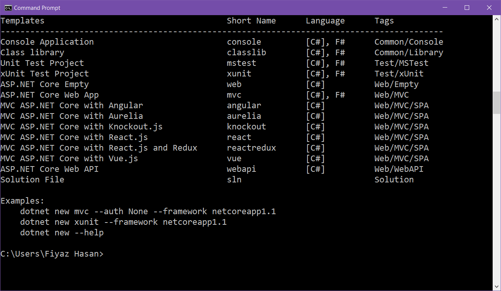

To create a new project using one of the spa templates, include the short name of the template after `dotnet new` command. In this case, run `dotnet new angular` to create an Angular application with ASP.NET Core MVC configured for server-side. 

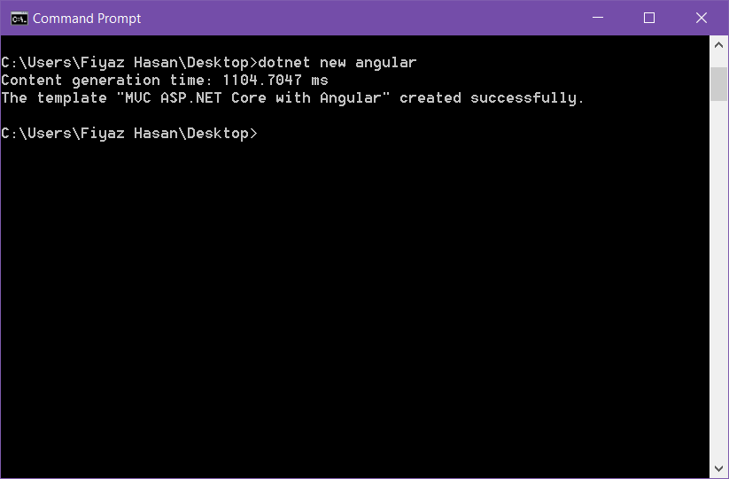

## Restoring dotnet and npm packages

Out of the box the spa template includes additional `dotnet` and `npm` packages to make things work together. To restore them, run these following commands:
    
    dotnet restore
    npm install

Then, set an environment variable to tell ASP.NET to run in `development` mode:

* If you’re using PowerShell in Windows, execute $Env:ASPNETCORE_ENVIRONMENT = "Development"
* If you’re using cmd.exe in Windows, execute setx ASPNETCORE_ENVIRONMENT "Development", and then restart your command prompt to make the change take effect
* If you’re using Mac/Linux, execute export ASPNETCORE_ENVIRONMENT=Development

To run the application now execute `dotnet run` in the command prompt. It will run the in development mode under `localhost` on port `5000`. Navigating to `http://localhost:5000` will show the following UI,

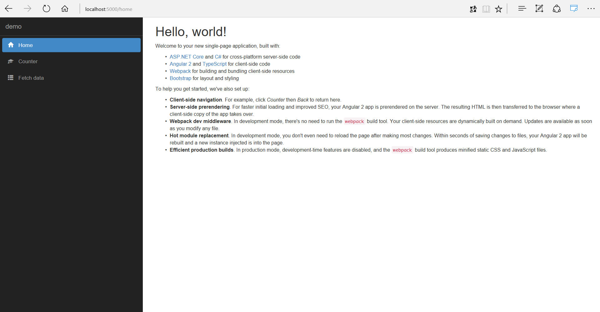

## Get advantage of Yarn:

`dotnet cli` is not the only way that can generate these SPA templates. `Yeoman` can be used instead. For this Yoeman and the spa template generator for ASP.NET Core must be installed globally. Use the following command to install those:

    npm install -g yo generator-aspnetcore-spa

Create an empty folder where your project will go. Change your directory to that newly created folder from the command prompt and run the following command to create a new project from available spa template options:

    yo aspnetcore-spa

One of the benefit of using this approach is, the created application resolves npm dependencies using Yarn which is much faster than the npm itself. Other than that, everything is pretty much same as the project created with the `dotnet-cli`.

## Project structure

Out of the box, the Angular SPA project template uses ASP.NET Core on the server-side. On the client-side it uses Angular which is configured to work with `Typescript`. Angular 2 provides a universal platform. That’s why it can run both on the client side and on the server-side to some extent. For compiling Typescript back to plain javascript, minification and bundling of resources etc. webpack is in place. For basic layout and styling, `Bootstrap` is used.

### Web API

In order to show how a client can make a http call back to server-side API, the demo project is set up with an `API Controller`. The API controller returns some sample `weather` data back to the client. It is under the `Controllers` folder and it is named `SampleDataController.cs`. That’s all for `Web API` part. Later in the article we will add additional API controllers here.

### Angular

Angular is a `Component` based framework. The main component, where your application starts bootstrapping is the `AppComponent`. Along with this bootstrapping component there are other predefined components. For example, `FetchDataComponent` is responsible for showing sample weather data in the client. So a `http` call to the backend API is made from it's `constructor`.  These components are declared in a module name `AppModule`. Components are self-contained and they got their own `markup` and `styling`.

## Routing Helper: MapSpaFallbackRoute

In most single-page applications, you'll want client-side routing as well as your server-side routing. Most of the time, the two routing systems work independently without interfering. However, there is one case where things get challenging: identifying 404s.

If a request arrives for `/some/page`, and it doesn't match any server-side route, it's likely that you want to return HTML that starts up your client-side application, which probably understands the route `/some/page`. But if a request arrives for `/images/user-512.png`, and it doesn't match any server-side route or static file, it's not likely that your client-side application would handle it - you probably want to return a `404`.

To help distinguish between these cases a MVC routing helper, `MapSpaFallbackRoute` is used. For example, in your `Startup.cs` file's `Configure` method, you may see:

    app.UseStaticFiles();

    app.UseMvc(routes =>
    {
        routes.MapRoute(
            name: "default",
            template: "{controller=Home}/{action=Index}/{id?}");

        routes.MapSpaFallbackRoute(
            name: "spa-fallback",
            defaults: new { controller = "Home", action = "Index" });
    });

## Karma and Jasmine for testing:

SpaServices templates is also pre-configured to run client-side tests using `Karma` and `Jasmine`. Jasmine is a popular test framework for client-side web application development whereas karma is a test runner for npm test. Karma is configured to work with the webpack dev middleware so that you don’t have to stop and run the test every time you make changes. Whether it’s going to be the test case or the code running against the test case; the test will run automatically. How to test a simple Angular component will be shown later in the article.

## Developing the existing application:

The following approach demonstrates developing a `parent-child` workflow application. We will show a list of `blogs` in the parent page. A list of associate `posts` will be shown in the child page.

### Adding new controllers:

Add a new controller under the `Controllers` folder and name it `BlogsController`. It is a simple `Web API` controller. The `Get` action of this controller will return a list of blogs once it’s being called. Add the following code on the controller.
    
    [Route("api/[controller]")]
    public class BlogsController : Controller
    {
        [HttpGet]
        public IActionResult Get()
        {
            var blogs = SampleData.Blogs();

            return Ok(blogs);
        }
    }

Here, `SampleData` is a static class from where a sets of demo data is used throughout the application. `SampleData.cs` contains two static methods which are the followings

    public static class SampleData
    {
        public static IEnumerable<Blog> Blogs()
        {
            return new List<Blog>()
            {
                new Blog { 
                    BlogId = 1, Url = "http://blog.stevensanderson.com/", Title = "Steve Sanderson's Blog" 
                },
                new Blog { 
                    BlogId = 2, Url = "http://fiyazhasan.me", Title = "Classroom of Fizz" 
                }
            };
        }

        public static IEnumerable<Post> Posts()
        {
            return new List<Post>
            {
                 new Post { 
                     PostId=1, Title="ASP.NET Core + Angular 2 template for Visual Studio", Author= "Steve Sanderson", Link="http://blog.stevensanderson.com/2016/10/04/angular2-template-for-visual-studio/", BlogId=1
                },
                 new Post { 
                     PostId=2, Title="Angular 2, React, and Knockout apps on ASP.NET Core", Author= "Steve Sanderson", Link="http://blog.stevensanderson.com/2016/05/02/angular2-react-knockout-apps-on-aspnet-core/", BlogId=1
                },
                 new Post { 
                     PostId=3, Title="Building Custom Formatters for .Net Core (Yaml Formatters)", Author= "Fiyaz Hasan", Link="http://www.fiyazhasan.me/building-custom-formatters-for-net-core-yaml-formatters/", BlogId=2 
                },
                 new Post {
                     PostId=4, Title="Preventing XSRF in AngularJS Apps with ASP.NET CORE Anti-Forgery Middleware", Author= "Fiyaz Hasan", Link="http://www.fiyazhasan.me/angularjs-anti-forgery-with-asp-net-core/", BlogId=2
                }
            };
        }
    }

Notice that, two `POCO` (plain-old class object) is used here namely `Blog.cs` and `Post.cs`. Add these two POCO classes in a separate folder named `Models`. Here are the class structures:

    public class Blog
    {
        public int BlogId { get; set; }
        public string Url { get; set; }
        public string Title { get; set; }

        public List<Post> Posts { get; set; }
    }

    public class Post
    {
        public int PostId { get; set; }
        public string Title { get; set; }
        public string Link { get; set; }
        public string Author { get; set; }
        public int BlogId { get; set; }
    }

Notice the one to many association between the `Blog` and the `Post` object. A blog can have a multiple number of posts where a post belongs to a single blog. These exact class objects can also be used as data transfer objects if some kind of `ORM` (Object Relational Model) is in place.

Add another similar controller with a `GET` action. This will return the list of posts associated with an individual blog. Name the controller `PostsController.cs` and add the following lines of code in there:
    
    [Route("api/blogs/{blogId}/posts")]
    public class PostsController : Controller
    {
        [HttpGet()]
        public IActionResult Get(int blogId)
        {
            var posts = SampleData.Posts().Where(p => p.BlogId == blogId);

            return Ok(posts);
        }
    } 

Notice the `Route` attribute on the code snippet. The `blogId` from the route is passed as a parameter in the `GET` action where it is used to get associated posts.

### Creating Angular components:

The `Blog` and `Post` require their own component. Generally, components have their own markup and they are managed in separate `Html` files. In the component folder under the `ClientApp/App` folder, create two folders namely `blog` and `post`.

Under the `blog` folder add a `typescript` file and name it `blog.componet.ts`. Add these lines of code in the file:

    import { Component } from '@angular/core';
    import { Http } from '@angular/http';

    @Component({
        selector: 'blog',
        templateUrl: './blog.component.html'
    })
    export class BlogComponent {
        public blogs: Blog[];

        constructor(private router: Router, http: Http) {
            http.get('/api/blogs').subscribe(result => {
                this.blogs = result.json() as Blog[];
            });
        }
    }

    interface Blog {
        blogId: number;
        title: string;
        url: string;
    }

Notice that the component is making a call to the backend `API` and storing the list of blogs in an `array`. Here, `@Component` is a decorator which marks a class as a component. Additional `meta-data` is set in the decorator to let the component know how it should work. For example: `templateUrl` meta-data decides from where the markup file for a component should be loaded. 

Following is the markup for the blog component:

    <h1>Blogs</h1>

    
<em>Loading...</em>

    <table class='table' *ngIf="blogs">
        <thead>
            <tr>
                <td>Title</td>
                <th>Url</th>
            </tr>
        </thead>
        <tbody>
            <tr *ngFor="let blog of blogs">
                <td>{{ blog.title }}</td>
                <td>{{ blog.url }}</td>
            </tr>
        </tbody>
    </table>

In angular 2 `*ngFor` is use for iterating through a list of items. If the blogs array is `null` it will show an error in the console and stop the application. That is why a conditional directive `*ngIf` is used to check if the blogs array is `null` or not. If it is null then angular will stop showing the piece of markup in `*ngIf` block.  Opposite happens in the markup that is showing a `Loading...` message. If the blogs variable isn’t populated with data, it means it is still trying to load the data.

Once the component is created, it should be added in the `app.module.ts` to make it available through the application. In `app.module.ts` under the `declarations` array add the `BlogComponent`. Make sure you `import` the component first. 

    /* Code removed for sanity */
    import { PostComponent } from './components/post/post.component';

    @NgModule({
        bootstrap: [ AppComponent ],
        declarations: [
	        /* Code removed for sanity */
            BlogComponent
        ],
        imports: [
            UniversalModule,
            RouterModule.forRoot([
                /* Code removed for sanity */
                { path: 'blog', component: BlogComponent }
            ])
        ]
    })

    export class AppModule { }

> [!NOTE] 
> Some of the existing code in `app.modue.ts` is commented out for sanity.

Notice that a new route is also configured in the `RouterModule` so the blog component is loaded once someone navigates to the link: `http://localhost:5000/blog`

Add a navigation menu in the `navmenu.component.html` similarly like the others that are already been set by default:

    <li [routerLinkActive]="['link-active']">
        <a [routerLink]="['/blog']">
             Blogs
        </a>
    </li>

`routerLinkActive` checks the current activated route and change the `<li>` element style according to the `css` styling rule for `link-active`. You can find the styling of the navigation component in the `navigation.component.css` file. `routerLink` activates the route defined in the markup once it is clicked.

Running the application now will have a new navigation item on the left navigation bar. Clicking on it will take you to the blog component view where a list of blogs will be served from the backend Api.

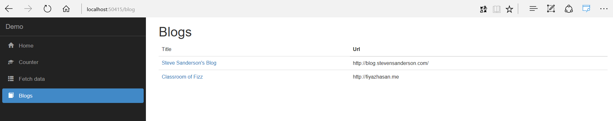

The post component will be a child of the blog component. Means once a specific blog `title` is clicked, user will be navigated to a page where all the posts from that specific blog will be shown.

Post component needs a child route configuration. We will add it later once the `PostComponent` is created. Create a folder named post under the `ClientApp/App/Component` folder and add a new `typescrip`t file named `post.componet.ts`. Add the following lines of code in the file:

    import { Component } from '@angular/core';
    import { Http } from '@angular/http';
    import { ActivatedRoute, Params } from '@angular/router';
    import { Location } from '@angular/common';
    import 'rxjs/add/operator/switchMap';

    @Component({
        selector: 'post',
        templateUrl: './post.component.html'
    })
    export class PostComponent {
        public posts: Post[];

        constructor(private route: ActivatedRoute, private location: Location, private http: Http) {
            this.route.params
                .switchMap((params: Params) => http.get('/api/blogs/' + params['id'] + '/posts'))
                .subscribe(result => this.posts = result.json() as Post[]);
        }
    }

    interface Post {
        postId: number;
        title: string;
        author: string;
        link: string;
    }

To make a http `GET` call back to the `PostsController`, one must pass a `blogId`. We will pass a selected `blogId` in the routing `URL`. To parse that `blogId` back in the `PostsComponent`, `ActivatedRoute` is used. For explicit typing of route parameters `Params` is important from Angular.

Some `RxJs` operators is used throughout the examples. `swithMap` operator is used in order to cancel the inflight `http` calls; those of which didn’t yet completed resolving response. For example: if a request for fetching specific blog post is made and before it gets resolved, another similar request is made then the previous call will be cancelled. `suscbribe` subscribes an observer to the observable sequence. In this case, it translates a `http` call back to a sequence of observable in order to parse the `success` or `error` callbacks.

For the component markup, create a new file in the post folder and name it `post.component.html`. Add the following markup in that file:

    <h1>Posts</h1>

    
<em>Loading...</em>

    <table class='table' *ngIf="posts">
        <thead>
            <tr>
                <th>Title</th>
                <th>Author</th>
                <th>Link</th>
            </tr>
        </thead>
        <tbody>
            <tr *ngFor="let post of posts">
                <td>{{ post.title }}</td>
                <td>{{ post.author }}</td>
                <td>
                    <a href="{{post.link}}">
                         Read
                    </a>
                </td>
            </tr>
        </tbody>
    </table>

Add a new routing for the child `PostComponet` navigation in `app.module.ts` like the following:

    /* Code removed for sanity */
    import { BlogComponent } from './components/blog/blog.component';
    import { PostComponent } from './components/post/post.component';

    @NgModule({
        bootstrap: [ AppComponent ],
        declarations: [
	        /* Code removed for sanity */
            BlogComponent,
            PostComponent
        ],
        imports: [
            UniversalModule,
            RouterModule.forRoot([
                /* Code removed for sanity */
                { path: 'blog', component: BlogComponent },
                { path: 'blog/:id', component: PostComponent },
                { path: '**', redirectTo: 'home' }
            ])
        ]
    })

    export class AppModule { }

Modify the `blog.componet.html` markup in order to add individual blog posts navigation. Modify the markup that shows the `title` a blog and make a routing navigation link like the following:

    <tr *ngFor="let blog of blogs">
        <td><a [routerLink]="['/blog', blog.blogId]">{{ blog.title }}</a></td>
        <td>{{ blog.url }}</td>
    </tr>

Run the application and try navigating to the `PostComponent` as followings:

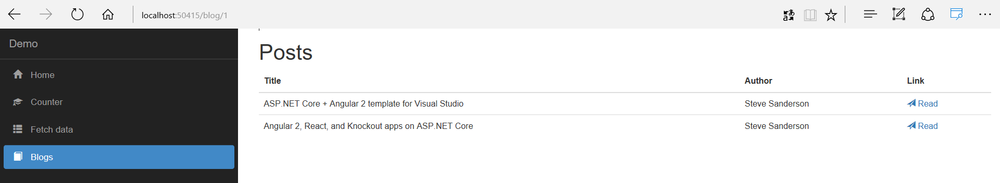

### Add lazy-loading for components:

Instead of loading all components at once, they can be `lazy-loaded`. Once a component is `lazy-loaded`, request for that component will be sent as a chunk of code block back to the client. The component declaration should be removed from the `app.module.ts` and taken to a new module. For example, lazy-loading the default `CounterComponent` requires a new module of itself. 

Add a new `typescript` file under the `counter` folder and name it `counter.module.ts`.

    import { NgModule } from '@angular/core';
    import { RouterModule } from '@angular/router';
    import { CounterComponent } from './counter.component';

    @NgModule({
        imports: [
            RouterModule.forChild([{ path: '', component: CounterComponent }])
        ],
        exports: [RouterModule],
        declarations: [CounterComponent]
    })

    export class CounterModule { }

Modify the `app.module.ts` and remove the `AppComponet` reference from the file; remove the `import` statement, remove component declaration from the `declarations` array. The component `route` should be configured in a new way to so that it loads the `ComponentModule` once the route for it is activated. Following is the modified `app.module.ts` code:

    import { NgModule } from '@angular/core';
    import { RouterModule } from '@angular/router';
    import { UniversalModule } from 'angular2-universal';
    import { AppComponent } from './components/app/app.component'
    import { NavMenuComponent } from './components/navmenu/navmenu.component';
    import { HomeComponent } from './components/home/home.component';
    import { FetchDataComponent } from './components/fetchdata/fetchdata.component';
    import { BlogComponent } from './components/blog/blog.component';
    import { PostComponent } from './components/post/post.component';
    
    @NgModule({
        bootstrap: [ AppComponent ],
        declarations: [
            AppComponent,
            NavMenuComponent,
            FetchDataComponent,
            HomeComponent,
            BlogComponent,
            PostComponent
        ],
        imports: [
            UniversalModule,
            RouterModule.forRoot([
                { path: '', redirectTo: 'home', pathMatch: 'full' },
                { path: 'home', component: HomeComponent },
            
                { path: 'counter', loadChildren:    './components/counter/counter.module#CounterModule' },
            
                { path: 'fetch-data', component: FetchDataComponent },
                { path: 'blog', component: BlogComponent },
                { path: 'blog/:id', component: PostComponent },
                { path: '**', redirectTo: 'home' }
            ])
        ]
    })
    export class AppModule { }

To load the routing declared inside the `CounterModule`, `angular2-router-loader` package must be installed and configured in the webpack.configure.js. Use `npm` to install the dependency:

    npm install  --save angular2-router-loader

If you used `Yoeman` `aspnetcore-spa` to generate your application template then use the `Yarn` package manager. Use the following command to install the dependency:

    yarn add angular2-router-loader

Configure the `router-loader` in the `webpack.configure.js`. In the `use` array, add another entry for `angular2-router-loader` along with `awesome-typescript-loader?silent=true, angular2-template-loader`. The module section should now look like the following:

    module: {
        rules: [
            { test: /\.ts$/, include: /ClientApp/, use: ['awesome-typescript-loader?silent=true', 'angular2-template-loader', 'angular2-router-loader'] },
            { test: /\.html$/, use: 'html-loader?minimize=false' },
            { test: /\.css$/, use: ['to-string-loader', 'css-loader'] },
            { test: /\.(png|jpg|jpeg|gif|svg)$/, use: 'url-loader?limit=25000' }
        ]
    }

Build and run the application. To make sure the `CounterComponent` is being lazy-loaded, open the `developer` console of your favorite browser and go to the `network` tab. Navigating to the `counter` route will now load a chunk of new code via http.

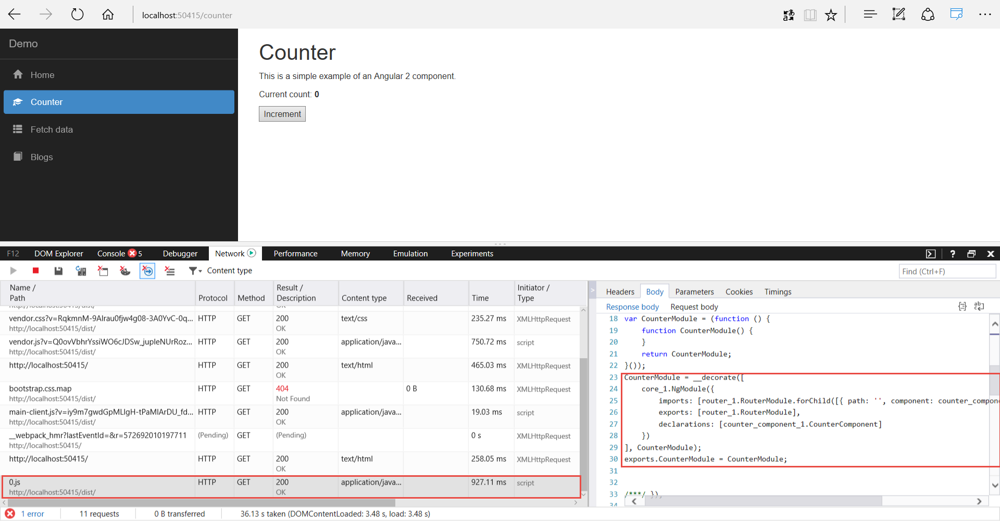

### Testing a component:

There are two test cases already defined for the `CounterComponen`t and they can be found in the `counter.component.spec.ts`. To run the tests, open up a command prompt on the root of your application and run the following `npm` command:

    npm test

You can find the script to run the test command in `the project.json` file.

    "scripts": {
        "test": "karma start ClientApp/test/karma.conf.js"
    }

Notice that it is configured to run `Karma` test runner which uses the configuration defined in the `karma.conf.js`

If you didn’t make any changes yet to the `CounterComponet`, both of the test cases should pass and you should see the following:

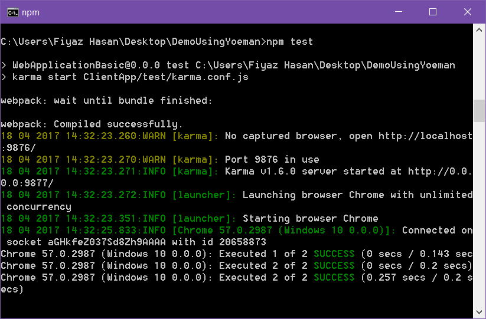

Let's make a test case fail by simply changing the first headline of the `CounterComponent`'s markup file. For example: replace the text `Counter` with `Incrementer` for the `<h1>` element in `counter.component.html` file:

    <h1>Incrementer</h1>

    
This is a simple example of an Angular 2 component.

    <!-- Markup revomed for sanity -->

Once you save the changes, `Karma` will run the tests immediately and tell you that one of the two test cases have failed.

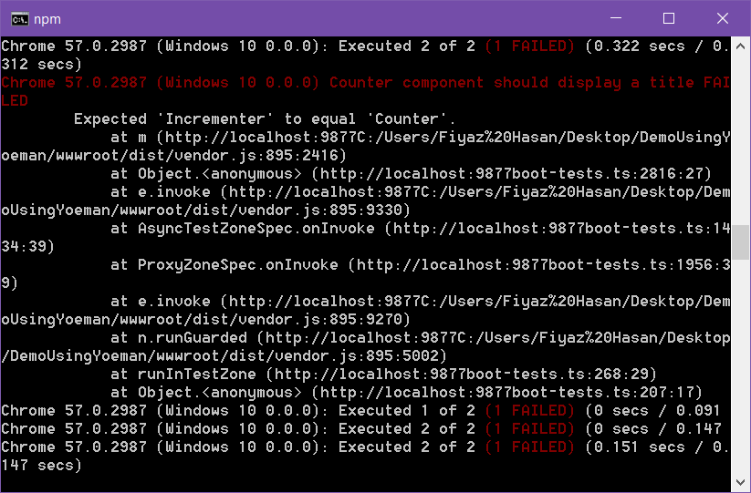

Notice that the heading element text content was expected to be `Counter` but it is set to `Incrementer`.

Modify the test case, so that it no longer fails.
    
    it('should display a title', async(() => {
        const titleText = fixture.nativeElement.querySelector('h1').textContent;
        expect(titleText).toEqual('Incrementer');
    }));

All the test cases will be passed again.

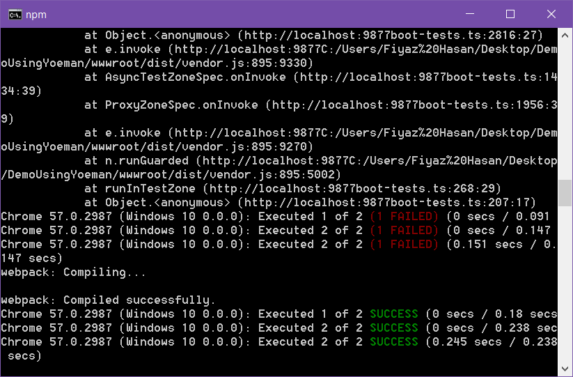

## Debugging your application

### Debugging your C# code that runs on the server

You can use any `.NET debugger`, for example Visual Studio's C# debugger or Visual Studio Code's C# debugger.

### Debugging your JavaScript/TypeScript code when it's running in a browser

The absolute most reliable way of debugging your client-side code is to use your browser's built-in debugger. This is much easier to make work than debugging via an IDE, plus it offers much richer insight into what's going on than your IDE will do (for example, you'll be able to inspect the DOM and capture performance profiles as well as just set breakpoints and step through code).

### Using your browser's built-in debugging tools

In the developer tools `Sources` tab, expand folders in the hierarchy pane on the left to find the file you want (e.g., `counter.component.ts`).
With source maps enabled, you'll be able to see your original `TypeScript` source code, set breakpoints on it, etc.

### How browser-based debugging interacts with Hot Module Replacement (HMR)

If you're using `HMR`, then each time you modify a file, the `Webpack dev middleware` restarts your client-side application, adding a new version of each affected module, without reloading the page. This can be confusing during debugging, because any breakpoints set on the old version of the code will still be there, but they will no longer get hit, because the old version of the module is no longer in use.

You have two options to get breakpoints that will be hit as expected:

Reload the page (e.g., by pressing F5). Then your existing breakpoints will be applied to the new version of the module. This is obviously the easiest solution.

Or, if you don't want to reload the page, you can set new breakpoints on the new version of the module. To do this, look in your browser's debug tools' list of source files, and identify the newly-injected copy of the module you want to debug. It will typically have a suffix on its URL such as `?4a2c`, and may appear in a new top-level hierarchy entry called `webpack://`. Set a breakpoint in the newly-injected module, and it will be hit as expected as your application runs.

### Using Visual Studio Code's "Debugger for Chrome" extension

If you're using Visual Studio Code and Chrome, you can set breakpoints directly on your TypeScript source code in the IDE. To do this:

* Install VS Code's Debugger for Chrome extension
Ensure your application server has started and can be reached with a browser (for example, run `dotnet watch run`)
* In VS Code, open its Debug view (on Windows/Linux, press `ctrl+shift+d`; on Mac, press `cmd+shift+d`).
* Press the cog icon and when prompted to Select environment, choose Chrome. VS Code will create a launch.json file for you. This describes how the debugger and browser should be launched.
* Edit your new `.vscode/launch.json` file to specify the correct url and webRoot for your application. If you're using the project templates in this repo, then the values you probably want are:
* For url, put `http://localhost:5000` (but of course, change this if you're using a different port)
    * For port, put `5000` (or your custom port number if applicable)
    * For workspace in both configurations, put `${workspaceRoot}/wwwroot`
    * This tells the debugger how URLs within your application correspond to files in your VS Code workspace. By default, ASP.NET Core projects treat `wwwroot` as the root directory for publicly-served files, so `http://localhost:5000/dist/myfile.js` corresponds to `<yourprojectroot>/wwwroot/dist/myfile.js`. VS Code doesn't know about wwwroot unless you tell it.

> [!NOTE]
> If your VS Code window's workspace root is not the same as your ASP.NET Core project root (for example, if VS Code is opened at a higher-level directory to show both your ASP.NET Core project plus other peer-level directories), then you will need to amend workspace correspondingly (e.g., to `${workspaceRoot}/SomeDir/MyAspNetProject/wwwroot`).

* Start the debugger:
    * While still on the Debug view, from the dropdown near the top-left, choose `Launch Chrome against localhost, with sourcemaps`.
    * Press the `Play` icon. Your application will launch in Chrome.
    * If it does nothing for a while, then eventually gives the error Cannot connect to runtime process, that's because you already have an instance of Chrome running. Close it first, then try again.
* Finally, you can now set and hit breakpoints in your TypeScript code in VS Code.

### Using Visual Studio's built-in debugger for Internet Explorer

If you're using Visual Studio on Windows, and are running your app in Internet Explorer 11 (not Edge!), then you can use VS's built-in debugger rather than Interner Explorer's F12 tools if you prefer. To do this:

* In Internet Explorer, enable script debugging
* In Visual Studio, set the default `Browse with` option to Internet Explorer
* In Visual Studio, press F5 to launch your application with the debugger in Internet Explorer.
    * When the page has loaded in the browser, you'll be able to set and hit breakpoints in your TypeScript source files in Visual Studio.

## Debugging your JavaScript/TypeScript code when it runs on the server

When you're using NodeServices or the server-side prerendering feature, JavaScript/TypeScript code will execute on the server in a background instance of Node.js. You can enable debugging via V8 Inspector Integration on that Node.js instance. Here's how to do it.

First, in your `Startup.cs` file, in the `ConfigureServices` method, add the following:

    services.AddNodeServices(options => {
        options.LaunchWithDebugging = true;
        options.DebuggingPort = 9229;
    });

Now, run your application from that command line (e.g., `dotnet run`). Then in a browser visit one of your pages that causes server-side JS to execute.

In the console, you should see all the normal trace messages appear, plus among them will be:

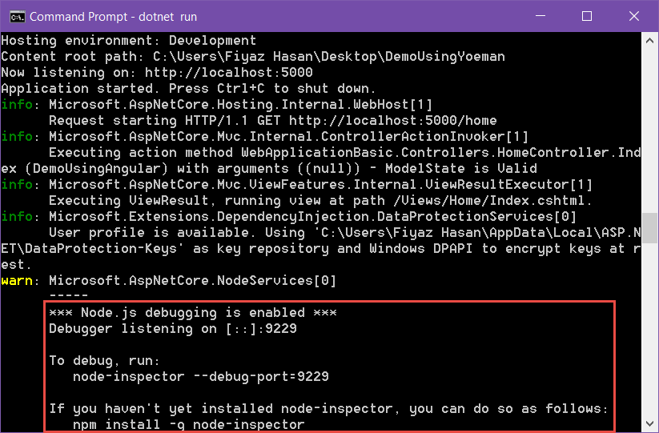

Follow the instructions and install `node-inspector` globally in a seperate command promt. Once installed run the following command:

    node-inspector --debug-port=9229

It will tell you to go to a specific link to start debugging the code.

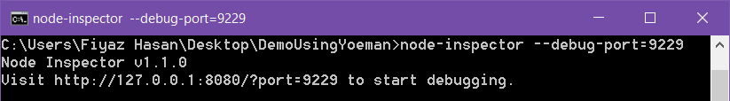

As per instructions open the URL in Chrome. By expanding the `webpack://` entry in the sidebar, you'll be able to find your original source code (it's using source maps), and then set breakpoints in it. When you re-run your app in another browser window, your breakpoints will be hit, then you can debug the server-side execution just like you'd debug client-side execution. It looks like this:

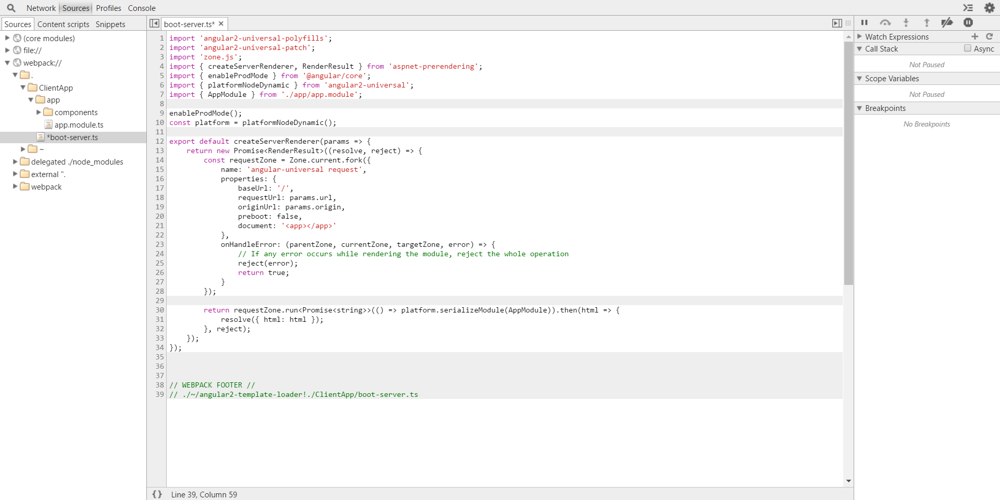

## Publishing for deployment

To deploy your application to production, you can use the publish feature which is built into dotnet command line tooling and Visual Studio. For example, on the command line, run:

dotnet publish -c Release

This will produce a ready-to-deploy production build of your application. It includes .NET code compiled in Release mode, and invokes Webpack with the `--env.prod` flag to produce a production build of front-end assets. Equivalently, you can use the Publish option from Visual Studio’s Build menu.

## Deploying in Azure:

Deploying to Azure needs an account in the Azure portal. Create a free account if you don’t have any. Once logged into the portal create a new web app (`New > Web + Mobile > Web App) and give a valid application name:

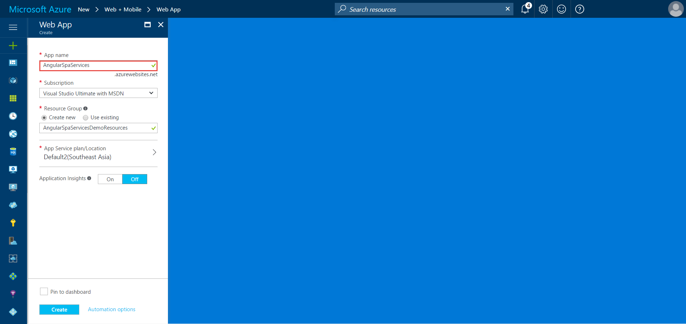

After the web app is created go to the `App Services` menu and choose a deployment option. The following approach shows how to deploy application from a local `Git` repository:

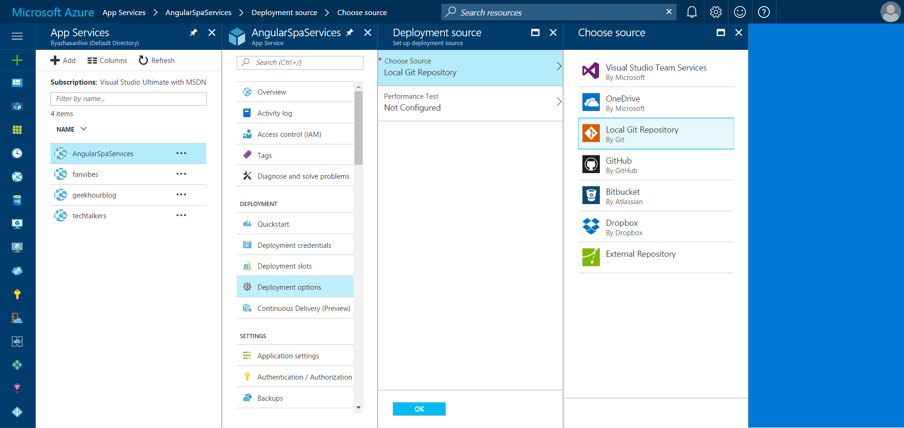

`Git` and `FTP` deployment doesn’t let you deploy application using portal credential. Create a new credential for local git repository deployment from the `Deployment Credential` window.

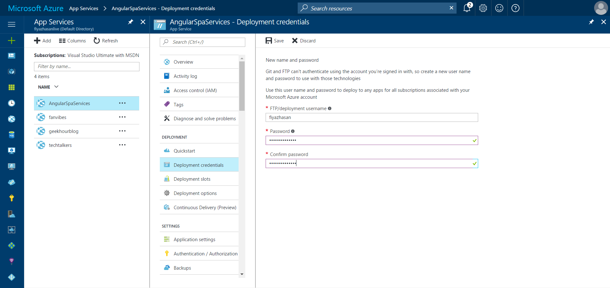

### Publish Using VS Code:

Initialize a local git repository from the source control menu. Enter a commit message and commit the changes:

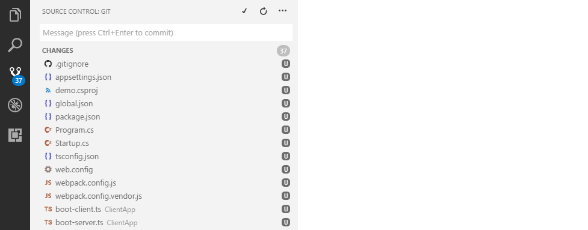

Attach the remote git repository with your local git reposity. You will find your remote git repository url from here:

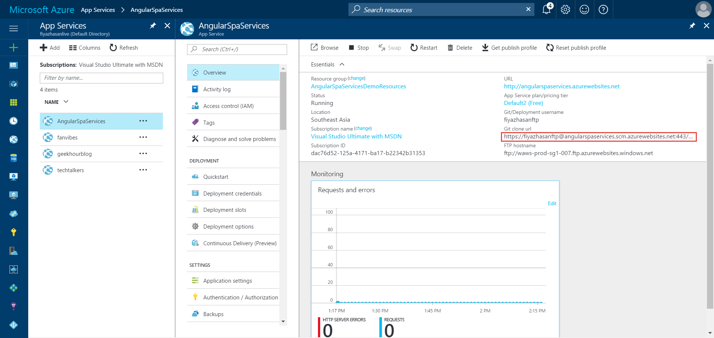

Copy the URL. Open up the command prompt inside your application folder and attach your remote repository with the following command:

    git remote add <repo_url> 

Replace the <repo_url> field with your copied git clone url. 

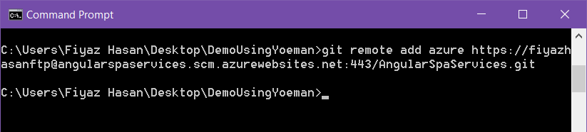

Go back to VS Code's `Source Control` menu and click on the ellipsis and select `Publish`.

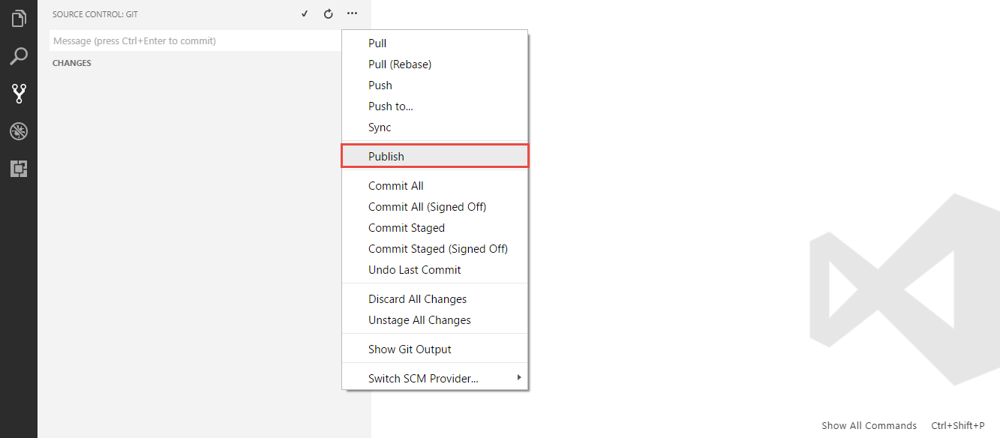

Once you pick a remote (azure) to publish the master branch, VS Code will ask for the git credential. Enter the credential you used while configuring the `Deployment Credentials`. The publishing process can take some time depending on your network connectivity. 

After publishing you will be able to see your current build of the application in the deployment options section.

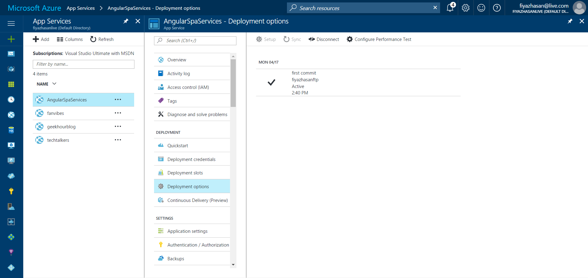

Now go to your application URL and you will see your application up and running. This is a continuous build system. Means everytime you make a new commit it will automatically build the solution and deploy it. 

### Using Visual Studio:

If you prefer using Visual Studio for direct publishing without continuous build system, right click on your project and select the publish option. 

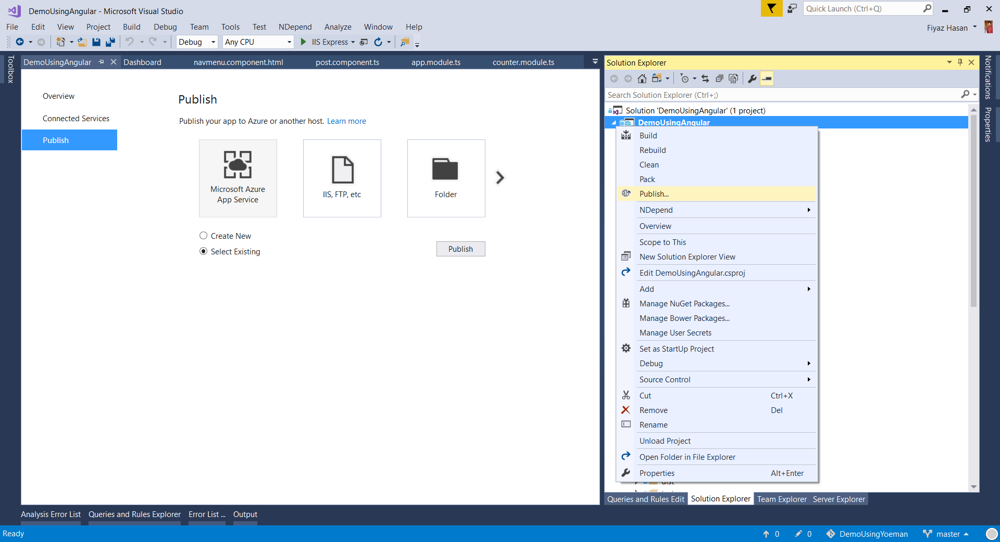

Select `Microsoft Azure App Service` and `Select Existing` before you click on publish. Once you click on publish it will let you choose your existing app service:

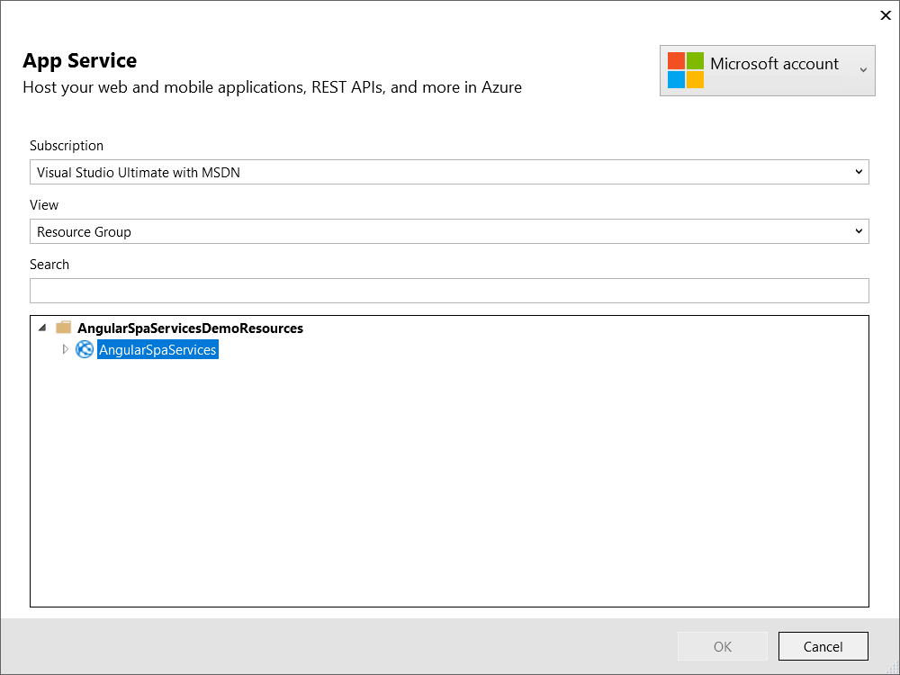

Select the app service you created in the azure portal and click `OK`. It will publish your application and open up the browser and take you to your application.

