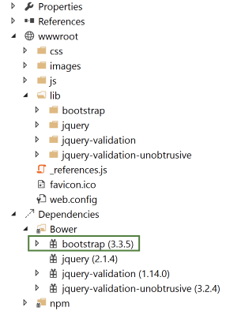
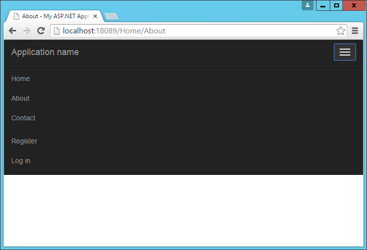
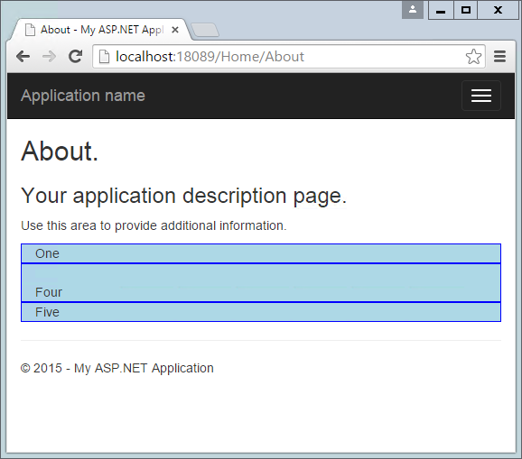
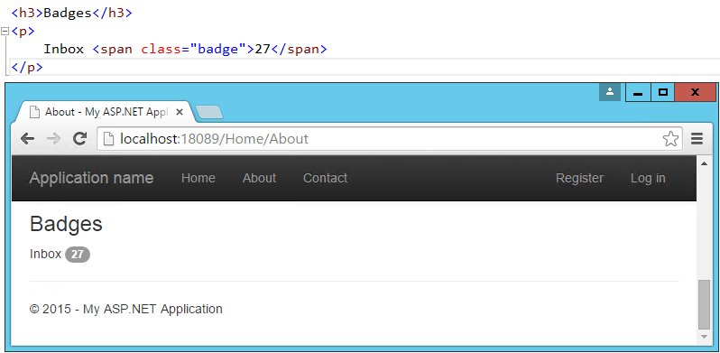
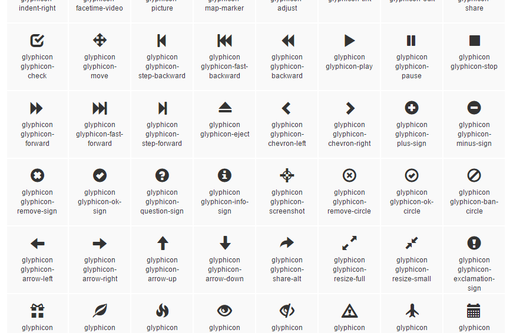

# Building beautiful, responsive sites with Bootstrap

<a name=bootstrap-index></a>

By [Steve Smith](https://ardalis.com/)

Bootstrap is currently the most popular web framework for developing responsive web applications. It offers a number of features and benefits that can improve your users' experience with your web site, whether you're a novice at front-end design and development or an expert. Bootstrap is deployed as a set of CSS and JavaScript files, and is designed to help your website or application scale efficiently from phones to tablets to desktops.

## Getting started

There are several ways to get started with Bootstrap. If you're starting a new web application in Visual Studio, you can choose the default starter template for ASP.NET Core, in which case Bootstrap will come pre-installed:



Adding Bootstrap to an ASP.NET Core project is simply a matter of adding it to *bower.json* as a dependency:

[!code-json[Main](../common/samples/WebApplication1/bower.json?highlight=5)]

This is the recommended way to add Bootstrap to an ASP.NET Core project.

You can also install bootstrap using one of several package managers, such as Bower, npm, or NuGet. In each case, the process is essentially the same:

### Bower

```console
bower install bootstrap
```

### npm

```console
npm install bootstrap
```

### NuGet

```console
Install-Package bootstrap
```

> [!NOTE]
> The recommended way to install client-side dependencies like Bootstrap in ASP.NET Core is via Bower (using *bower.json*, as shown above). The use of npm/NuGet are shown to demonstrate how easily Bootstrap can be added to other kinds of web applications, including earlier versions of ASP.NET.

If you're referencing your own local versions of Bootstrap, you'll need to reference them in any pages that will use it. In production you should reference bootstrap using a CDN. In the default ASP.NET site template, the *_Layout.cshtml* file does so like this:

[!code-html[Main](../common/samples/WebApplication1/Views/Shared/_Layout.cshtml?highlight=9,13,51,59)]

> [!NOTE]
> If you're going to be using any of Bootstrap's jQuery plugins, you will also need to reference jQuery.

## Basic templates and features

The most basic Bootstrap template looks very much like the *_Layout.cshtml* file shown above, and simply includes a basic menu for navigation and a place to render the rest of the page.

### Basic navigation

The default template uses a set of `<div>` elements to render a top navbar and the main body of the page. If you're using HTML5, you can replace the first `<div>` tag with a `<nav>` tag to get the same effect, but with more precise semantics.  Within this first `<div>` you can see there are several others. First, a `<div>` with a class of "container", and then within that, two more `<div>` elements: "navbar-header" and "navbar-collapse".  The navbar-header div includes a button that will appear when the screen is below a certain minimum width, showing 3 horizontal lines (a so-called "hamburger icon"). The icon is rendered using pure HTML and CSS; no image is required. This is the code that displays the icon, with each of the <span> tags rendering one of the white bars:

```html
<button type="button" class="navbar-toggle" data-toggle="collapse" data-target=".navbar-collapse">
    <span class="icon-bar"></span>
    <span class="icon-bar"></span>
    <span class="icon-bar"></span>
</button>
```

It also includes the application name, which appears in the top left.  The main navigation menu is rendered by the `<ul>` element within the second div, and includes links to Home, About, and Contact. Additional links for Register and Login are added by the _LoginPartial line on line 29. Below the navigation, the main body of each page is rendered in another `<div>`, marked with the "container" and "body-content" classes. In the simple default _Layout file shown here, the contents of the page are rendered by the specific View associated with the page, and then a simple `<footer>` is added to the end of the `<div>` element.  You can see how the built-in About page appears using this template:


The collapsed navbar, with "hamburger" button in the top right, appears when the window drops below a certain width:


Clicking the icon reveals the menu items in a vertical drawer that slides down from the top of the page:



### Typography and links

Bootstrap sets up the site's basic typography, colors, and link formatting in its CSS file. This CSS file includes default styles for tables, buttons, form elements, images, and more ([learn more](http://getbootstrap.com/css/)). One particularly useful feature is the grid layout system, covered next.

### Grids

One of the most popular features of Bootstrap is its grid layout system. Modern web applications should avoid using the `<table>` tag for layout, instead restricting the use of this element to actual tabular data. Instead, columns and rows can be laid out using a series of `<div>` elements and the appropriate CSS classes. There are several advantages to this approach, including the ability to adjust the layout of grids to display vertically on narrow screens, such as on phones.

[Bootstrap's grid layout system](http://getbootstrap.com/css/#grid) is based on twelve columns. This number was chosen because it can be divided evenly into 1, 2, 3, or 4 columns, and column widths can vary to within 1/12th of the vertical width of the screen. To start using the grid layout system, you should begin with a container `<div>` and then add a row `<div>`, as shown here:

```html
<div class="container">
    <div class="row">
        ...
    </div>
</div>
```

Next, add additional `<div>` elements for each column, and specify the number of columns that `<div>` should occupy (out of 12) as part of a CSS class starting with "col-md-". For instance, if you want to simply have two columns of equal size, you would use a class of "col-md-6" for each one. In this case "md" is short for "medium" and refers to standard-sized desktop computer display sizes. There are four different options you can choose from, and each will be used for higher widths unless overridden (so if you want the layout to be fixed regardless of screen width, you can just specify xs classes).

CSS Class Prefix | Device Tier | Width
:---: | :---: | :---:
col-xs- | Phones | < 768px
col-sm- | Tablets | >= 768px
col-md- | Desktops | >= 992px
col-lg- | Larger Desktop Displays | >= 1200px

When specifying two columns both with "col-md-6" the resulting layout will be two columns at desktop resolutions, but these two columns will stack vertically when rendered on smaller devices (or a narrower browser window on a desktop), allowing users to easily view content without the need to scroll horizontally.

Bootstrap will always default to a single-column layout, so you only need to specify columns when you want more than one column. The only time you would want to explicitly specify that a `<div>` take up all 12 columns would be to override the behavior of a larger device tier. When specifying multiple device tier classes, you may need to reset the column rendering at certain points. Adding a clearfix div that is only visible within a certain viewport can achieve this, as shown here:


In the above example, One and Two share a row in the "md" layout, while Two and Three share a row in the "xs" layout. Without the clearfix `<div>`, Two and Three are not shown correctly in the "xs" view (note that only One, Four, and Five are shown):



In this example, only a single row `<div>` was used, and Bootstrap still mostly did the right thing with regard to the layout and stacking of the columns. Typically, you should specify a row `<div>` for each horizontal row your layout requires, and of course you can nest Bootstrap grids within one another. When you do, each nested grid will occupy 100% of the width of the element in which it is placed, which can then be subdivided using column classes.

### Jumbotron

If you've used the default ASP.NET MVC templates in Visual Studio 2012 or 2013, you've probably seen the Jumbotron in action. It refers to a large full-width section of a page that can be used to display a large background image, a call to action, a rotator, or similar elements. To add a jumbotron to a page, simply add a `<div>` and give it a class of "jumbotron", then place a container `<div>` inside and add your content.  We can easily adjust the standard About page to use a jumbotron for the main headings it displays:


### Buttons

The default button classes and their colors are shown in the figure below.


### Badges

Badges refer to small, usually numeric callouts next to a navigation item. They can indicate a number of messages or notifications waiting, or the presence of updates. Specifying such badges is as simple as adding a <span> containing the text, with a class of "badge":



### Alerts

You may need to display some kind of notification, alert, or error message to your application's users. That's where the standard alert classes are useful.  There are four different severity levels with associated color schemes:


### Navbars and menus

Our layout already includes a standard navbar, but the Bootstrap theme supports additional styling options. We can also easily opt to display the navbar vertically rather than horizontally if that's preferred, as well as adding sub-navigation items in flyout menus. Simple navigation menus, like tab strips, are built on top of <ul> elements. These can be created very simply by just providing them with the CSS classes "nav" and "nav-tabs":


Navbars are built similarly, but are a bit more complex.  They start with a `<nav>` or `<div>` with a class of "navbar", within which a container div holds the rest of the elements. Our page includes a navbar in its header already – the one shown below simply expands on this, adding support for a dropdown menu:


### Additional elements

The default theme can also be used to present HTML tables in a nicely formatted style, including support for striped views. There are labels with styles that are similar to those of the buttons. You can create custom Dropdown menus that support additional styling options beyond the standard HTML `<select>` element, along with Navbars like the one our default starter site is already using. If you need a progress bar, there are several styles to choose from, as well as List Groups and panels that include a title and content.  Explore additional options within the standard Bootstrap Theme here:

[http://getbootstrap.com/examples/theme/](http://getbootstrap.com/examples/theme/)

## More themes

You can extend the standard Bootstrap theme by overriding some or all of its CSS, adjusting the colors and styles to suit your own application's needs. If you'd like to start from a ready-made theme, there are several theme galleries available online that specialize in Bootstrap themes, such as WrapBootstrap.com (which has a variety of commercial themes) and Bootswatch.com (which offers free themes).  Some of the paid templates available provide a great deal of functionality on top of the basic Bootstrap theme, such as rich support for administrative menus, and dashboards with rich charts and gauges. An example of a popular paid template is Inspinia, currently for sale for $18, which includes an ASP.NET MVC5 template in addition to AngularJS and static HTML versions. A sample screenshot is shown below.


If you want to change your Bootstrap theme, put the *bootstrap.css* file for the theme you want in the **wwwroot/css** folder and change the references in *_Layout.cshtml* to point it.  Change the links for all environments:

```html
<environment names="Development">
    <link rel="stylesheet" href="~/css/bootstrap.css" />
```

```html
<environment names="Staging,Production">
    <link rel="stylesheet" href="~/css/bootstrap.min.css" />
```

If you want to build your own dashboard, you can start from the free example available here: [http://getbootstrap.com/examples/dashboard/](http://getbootstrap.com/examples/dashboard/).

## Components

In addition to those elements already discussed, Bootstrap includes support for a variety of [built-in UI components](http://getbootstrap.com/components/).

### Glyphicons

Bootstrap includes icon sets from Glyphicons ([http://glyphicons.com](http://glyphicons.com)), with over 200 icons freely available for use within your Bootstrap-enabled web application. Here's just a small sample:



### Input groups

Input groups allow bundling of additional text or buttons with an input element, providing the user with a more intuitive experience:


### Breadcrumbs

Breadcrumbs are a common UI component used to show a user their recent history or depth within a site's navigation hierarchy. Add them easily by applying the "breadcrumb" class to any `<ol>` list element. Include built-in support for pagination by using the "pagination" class on a `<ul>` element within a `<nav>`. Add responsive embedded slideshows and video by using `<iframe>`, `<embed>`, `<video>`, or `<object>` elements, which Bootstrap will style automatically. Specify a particular aspect ratio by using specific classes like "embed-responsive-16by9".

## JavaScript support

Bootstrap's JavaScript library includes API support for the included components, allowing you to control their behavior programmatically within your application. In addition, *bootstrap.js* includes over a dozen custom jQuery plugins, providing additional features like transitions, modal dialogs, scroll detection (updating styles based on where the user has scrolled in the document), collapse behavior, carousels, and affixing menus to the window so they do not scroll off the screen. There's not sufficient room to cover all of the JavaScript add-ons built into Bootstrap – to learn more please visit [http://getbootstrap.com/javascript/](http://getbootstrap.com/javascript/).

## Summary

Bootstrap provides a web framework that can be used to quickly and productively lay out and style a wide variety of websites and applications. Its basic typography and styles provide a pleasant look and feel that can easily be manipulated through custom theme support, which can be hand-crafted or purchased commercially. It supports a host of web components that in the past would have required expensive third-party controls to accomplish, while supporting modern and open web standards.
