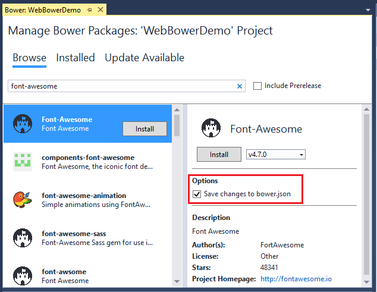
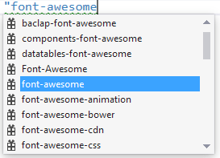
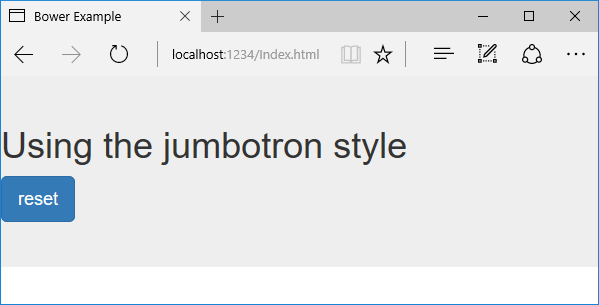

# Manage client-side packages with Bower in ASP.NET Core

By [Rick Anderson](https://twitter.com/RickAndMSFT), [Noel Rice](https://blog.falafel.com/falafel-software-recognized-sitefinity-website-year/), and [Scott Addie](https://scottaddie.com) 

[Bower](https://bower.io/) calls itself "A package manager for the web." Within the .NET ecosystem, it fills the void left by NuGet’s inability to deliver static content files. For ASP.NET Core projects, these static files are inherent to client-side libraries like [jQuery](http://jquery.com/) and [Bootstrap](http://getbootstrap.com/). For .NET libraries, you still use [NuGet](https://www.nuget.org/) package manager.

New projects created with the ASP.NET Core project templates set up the client-side build process. [jQuery](http://jquery.com/) and [Bootstrap](http://getbootstrap.com/) are installed, and Bower is supported.

Client-side packages are listed in the *bower.json* file. The ASP.NET Core project templates configures *bower.json* with jQuery, jQuery validation, and Bootstrap.

In this tutorial, we'll add support for [Font Awesome](http://fontawesome.io). Bower packages can be installed with the **Manage Bower Packages** UI or manually in the *bower.json* file.

### Installation via Manage Bower Packages UI

* Create a new ASP.NET Core Web app with the **ASP.NET Core Web Application (.NET Core)** template. Select **Web Application** and **No Authentication**.

* Right-click the project in Solution Explorer and select **Manage Bower Packages** (alternatively from the main menu, **Project** > **Manage Bower Packages**).

* In the **Bower: \<project name\>** window, click the "Browse" tab, and then filter the packages list by entering `font-awesome` in the search box:

 

* Confirm that the "Save changes to *bower.json*" checkbox is checked. Select a version from the drop-down list and click the **Install** button. The **Output** window shows the installation details.

### Manual installation in bower.json

Open the *bower.json* file and add "font-awesome" to the dependencies. IntelliSense shows the available packages. When a package is selected, the available versions are displayed. The images below are older and will not match what you see.




Bower uses [semantic versioning](http://semver.org/) to organize dependencies. Semantic versioning, also known as SemVer, identifies packages with the numbering scheme \<major>.\<minor>.\<patch>. IntelliSense simplifies semantic versioning by showing only a few common choices. The top item in the IntelliSense list (4.6.3 in the example above) is considered the latest stable version of the package. The caret (^) symbol matches the most recent major version and the tilde (~) matches the most recent minor version.

Save the *bower.json* file. Visual Studio watches the *bower.json* file for changes. Upon saving, the *bower install* command is executed. See the Output window's **Bower/npm** view for the exact command executed.

Open the *.bowerrc* file under *bower.json*. The `directory` property is set to *wwwroot/lib* which indicates the location Bower will install the package assets.

```json
{
 "directory": "wwwroot/lib"
}
```

You can use the search box in Solution Explorer to find and display the font-awesome package.

Open the *Views\Shared\_Layout.cshtml* file and add the font-awesome CSS file to the environment [Tag Helper](xref:mvc/views/tag-helpers/intro) for `Development`. From Solution Explorer, drag and drop *font-awesome.css* inside the `<environment names="Development">` element.

[!code-html[Main](bower/sample/_Layout.cshtml?highlight=4&range=9-13)]

In a production app you would add *font-awesome.min.css* to the environment tag helper for `Staging,Production`.

Replace the contents of the *Views\Home\About.cshtml* Razor file with the following markup:

[!code-html[Main](bower/sample/About.cshtml)]

Run the app and navigate to the About view to verify the font-awesome package works.

## Exploring the client-side build process

Most ASP.NET Core project templates are already configured to use Bower. This next walkthrough starts with an empty ASP.NET Core project and adds each piece manually, so you can get a feel for how Bower is used in a project. You see can what happens to the project structure and the runtime output as each configuration change is made.

The general steps to use the client-side build process with Bower are:

* Define packages used in your project. <!-- once defined, you don't need to download them, VS does -->
* Reference packages from your web pages.

### Define packages

Once you list packages in the *bower.json* file, Visual Studio will download them. The following example uses Bower to load jQuery and Bootstrap to the *wwwroot* folder.

* Create a new ASP.NET Core Web app with the **ASP.NET Core Web Application (.NET Core)** template. Select the **Empty** project template and click **OK**.

* In Solution Explorer, right-click the project > **Add New Item** and select **Bower Configuration File**. Note: A *.bowerrc* file is also added.

* Open *bower.json*, and add jquery and bootstrap to the `dependencies` section. The resulting *bower.json* file will look like the following example. The versions will change over time and may not match the image below.

[!code-json[Main](bower/sample/bower.json?highlight=5,6)]

* Save the *bower.json* file.

 Verify the project includes the *bootstrap* and *jQuery* directories in *wwwroot/lib*. Bower uses the *.bowerrc* file to install the assets in *wwwroot/lib*.

 Note: The "Manage Bower Packages" UI provides an alternative to manual file editing.

### Enable static files

* Add the `Microsoft.AspNetCore.StaticFiles` NuGet package to the project.
* Enable static files to be served with the [Static file middleware](https://docs.microsoft.com/aspnet/core/api/microsoft.aspnetcore.builder.staticfileextensions). Add a call to [UseStaticFiles](https://docs.microsoft.com/aspnet/core/api/microsoft.aspnetcore.builder.staticfileextensions) to the `Configure` method of `Startup`.

[!code-csharp[Main](bower/sample/Startup.cs?highlight=9)]

### Reference packages

In this section, you will create an HTML page to verify it can access the deployed packages.

* Add a new HTML page named *Index.html* to the *wwwroot* folder. Note: You must add the HTML file to the *wwwroot* folder. By default, static content cannot be served outside *wwwroot*. See [Working with static files](xref:fundamentals/static-files) for more information.

 Replace the contents of *Index.html* with the following markup:

[!code-html[Main](bower/sample/Index.html)]

* Run the app and navigate to `http://localhost:<port>/Index.html`. Alternatively, with *Index.html* opened, press `Ctrl+Shift+W`. Verify that the jumbotron styling is applied, the jQuery code responds when the button is clicked, and that the Bootstrap button changes state.

 
