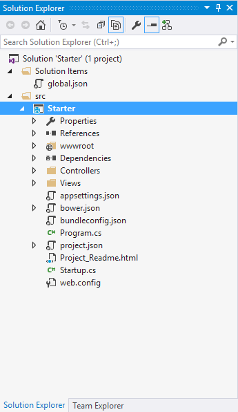
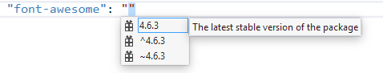
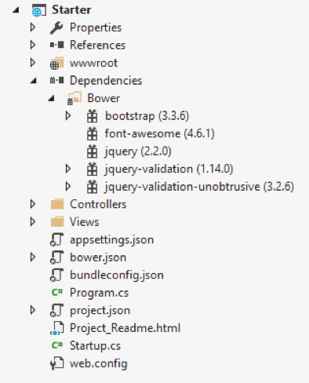
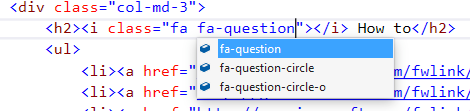
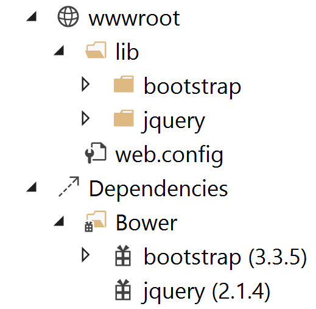

# Manage client-side packages with Bower

<a name=bower-index></a>

By [Noel Rice](http://blog.falafel.com/author/noel-rice/), [Scott Addie](https://scottaddie.com), and [Shayne Boyer](https://twitter.com/spboyer)

Bower is a "package manager for the web." Bower lets you install and restore client-side packages, including JavaScript and CSS libraries. For example, with Bower you can install CSS files, fonts, client frameworks, and JavaScript libraries from external sources. Bower resolves dependencies and will automatically download and install all the packages you need. For example, if you configure Bower to load the Bootstrap package, the necessary jQuery package will automatically come along for the ride. For .NET libraries you still use [NuGet](https://nuget.org) package manager.

> [!NOTE]
> Visual Studio developers are already familiar with NuGet, so why not use NuGet instead of Bower? Mainly because Bower already has a rich ecosystem with over 34,000 packages in play; and, it integrates well with the Gulp and Grunt task runners.

## Getting started

ASP.NET Core project templates pre-construct the client build process for you. The ubiquitous jQuery and Bootstrap packages are installed, and the plumbing for Bower is already in place. The screenshot below depicts the initial project in Solution Explorer. It's important to enable the "Show All Files" option, as the *bower.json* file is hidden by default.



Client-side packages are listed in the *bower.json* file. The ASP.NET Core project template pre-configures *bower.json* with jQuery, jQuery validation, and Bootstrap.

Let’s add support for [Font Awesome](http://fontawesome.io) to add some scalable vector css icons to the HTML. Bower packages can be installed either via the Manage Bower Packages UI or manually in the *bower.json* file.

### Installation via Manage Bower Packages UI

* Right-click the project name in Solution Explorer, and select the "Manage Bower Packages" menu option.

* In the window that appears, click the "Browse" tab, and filter the packages list by typing "font-awesome" into the search box:

    

* Confirm that the "Save changes to *bower.json*" checkbox is checked, select the desired version from the drop-down list, and click the Install button.

* Across the bottom status bar of the IDE, an *Installing "font-awesome" complete* message appears to indicate a successful installation.

### Manual installation in bower.json

* At the end of the `dependencies` section in *bower.json*, add a comma and type "font-awesome". Notice as you type that you get IntelliSense with a list of available packages. Select "font-awesome" from the list.

    

* Add a colon and then select the latest stable version of the package from the drop-down list. The double quotes will be added automatically.

    

    > [!NOTE]
    > Bower uses [semantic versioning](http://semver.org/) to organize dependencies. Semantic versioning, also known as SemVer, identifies packages with the numbering scheme \<major>.\<minor>.\<patch>. Intellisense simplifies semantic versioning by showing only a few common choices. The top item in the Intellisense list (4.6.3 in the example above) is considered the latest stable version of the package. The caret (^) symbol matches the most recent major version and the tilde (~) matches the most recent minor version.

* Save the *bower.json* file.

    > [!NOTE]
    > Visual Studio watches the *bower.json* file for changes. Upon saving, the *bower install* command is executed. See the Output window's "Bower/npm" view for the exact command which was executed.

Now that the installation step has been completed, expand the twisty to the left of *bower.json*, and locate the *.bowerrc* file. Open it, and notice that the `directory` property is set to *wwwroot/lib*. This setting indicates the location at which Bower will install the package assets.

```json
{
  "directory": "wwwroot/lib"
}
```

In Solution Explorer, expand the *wwwroot* node. The *lib* directory should now contain all of the packages, including the font-awesome package.



Let's add the Font Awesome Icons to the Home Page.  Open `Views\Shared\_Layout.cshtml` and add the css resource to the environment tag helper for **Development**.

```html
<environment names="Development">
    <link rel="stylesheet" href="~/lib/bootstrap/dist/css/bootstrap.css" />
    <link rel="stylesheet" href="~/css/site.css" />
    <link rel="stylesheet" href="~/lib/font-awesome/css/font-awesome.min.css" />
</environment>
```

In the environment tag helper for **Staging,Production**, use the CDN location of the css resource and the local file as the fallback. If the CDN fails, then the local file will be used.

```html
<environment names="Staging,Production">
    <link rel="stylesheet" href="https://ajax.aspnetcdn.com/ajax/bootstrap/3.3.6/css/bootstrap.min.css"
        asp-fallback-href="~/lib/bootstrap/dist/css/bootstrap.min.css"
        asp-fallback-test-class="sr-only" asp-fallback-test-property="position" asp-fallback-test-value="absolute" />
    <link rel="stylesheet" href="~/css/site.min.css" asp-append-version="true" />
    <link rel="stylesheet" href="https://maxcdn.bootstrapcdn.com/font-awesome/4.6.3/css/font-awesome.min.css"
        asp-fallback-href="~/lib/font-awesome/css/font-awesome.min.css" />
</environment>
```

Open `Views\Home\Index.cshtml` and add the icons to the **How to**, **Overview**, and **Run & Deploy** headers. You'll notice when typing, IntelliSense is available on the css classes.



Add the question icon to the **How to** header.

```html
<div class="col-md-3">
    <h2><i class="fa fa-question"></i> How to</h2>
    <ul>
        <li><a href="http://go.microsoft.com/fwlink/?LinkID=398600">Add a Controller and View</a></li>
        <li><a href="http://go.microsoft.com/fwlink/?LinkID=699562">Add an appsetting in config and access it in app.</a></li>
        <li><a href="http://go.microsoft.com/fwlink/?LinkId=699315">Manage User Secrets using Secret Manager.</a></li>
        <li><a href="http://go.microsoft.com/fwlink/?LinkId=699316">Use logging to log a message.</a></li>
        <li><a href="http://go.microsoft.com/fwlink/?LinkId=699317">Add packages using NuGet.</a></li>
        <li><a href="http://go.microsoft.com/fwlink/?LinkId=699318">Add client packages using Bower.</a></li>
        <li><a href="http://go.microsoft.com/fwlink/?LinkId=699319">Target development, staging or production environment.</a></li>
    </ul>
</div>
```

Run the application to see the changes.


## Exploring the client build process

Most ASP.NET Core project templates are already configured to use Bower. This next walkthrough starts with an empty ASP.NET Core project and adds each piece manually, so you can get a feel for how Bower is used in a project. See what happens to the project structure and the runtime output as each configuration change is made to the project.

The general steps to use the client-side build process with Bower are:

*  Define and download packages used in your project.

*  Reference packages from your web pages.

### Define packages

The first step is to define the packages your application needs and to download them. This example uses Bower to load jQuery and Bootstrap in the desired location.

1.  In Visual Studio, create a new ASP.NET Web Application.

2.  In the **New ASP.NET Project** dialog, select the ASP.NET Core **Empty** project template and click **OK**.

3.  In Solution Explorer, the *src* directory includes a *project.json* file, and *wwwroot* and *Dependencies* nodes. The project directory will look like the screenshot below.

    

4.  In Solution Explorer, right-click the project, and add the following item:

    * Bower Configuration File – *bower.json*
    
    > [!NOTE]
    > The Bower Configuration File item template also adds a *.bowerrc* file.

5.  Open *bower.json*, and add jquery and bootstrap to the `dependencies` section. As an alternative to the manual file editing, the "Manage Bower Packages" UI may be used. The resulting *bower.json* file should look like the example here. The versions will change over time, so use the latest stable build version from the drop-down list.

    ```json
    {
      "name": "ASP.NET",
      "private": true,
      "dependencies": {
        "jquery": "2.1.4",
        "bootstrap": "3.3.5"
      }
    }
    ```

6.  Save the *bower.json* file.

    The project should now include *bootstrap* and *jQuery* directories in two locations: *Dependencies/Bower* and *wwwroot/lib*. It's the *.bowerrc* file which instructed Bower to install the assets within *wwwroot/lib*.

    

### Reference packages

Now that Bower has copied the client support packages needed by the application, you can test that an HTML page can use the deployed jQuery and Bootstrap functionality.

1.  Right-click *wwwroot* and select **Add** > **New Item** > **HTML Page**. Name the page Index.html.

2.  Add the CSS and JavaScript references.

    * In Solution Explorer, expand *wwwroot/lib/bootstrap* and locate bootstrap.css. Drag this file into the `head` element of the HTML page.

    * Drag *jquery.js* and *bootstrap.js* to the end of the `body` element.

Make sure *bootstrap.js* follows *jquery.js*, so that jQuery is loaded first.

```html
<!DOCTYPE html>
<html>
<head>
    <meta charset="utf-8" />
    <title>Bower Example</title>
    <link href="lib/bootstrap/dist/css/bootstrap.css" rel="stylesheet" />
</head>
<body>
    ...
    <script src="lib/jquery/dist/jquery.js"></script>
    <script src="lib/bootstrap/dist/js/bootstrap.js"></script>
</body>
</html>
```

### Use the installed packages

Add jQuery and Bootstrap components to the page to verify that the web application is configured correctly.

1.  Inside the `body` tag, above the `script` references, add a `div` element with the Bootstrap **jumbotron** class and an anchor tag.

    ```html
    <div class="jumbotron">
        <h1>Using the jumbotron style</h1>
        <p>
            <a class="btn btn-primary btn-lg" role="button">Stateful button</a>
        </p>
    </div>
    ```
2.  Add the following code after the jQuery and Bootstrap `script` references.

    ```html
    <script>
      $(".btn").click(function() {
        $(this).text('loading')
          .delay(1000)
          .queue(function () {
            $(this).text('reset');
            $(this).dequeue();
          });
      });
    </script>
    ```

3.  Within the `Configure` method of the *Startup.cs* file, add a call to the `UseStaticFiles` extension method. This middleware adds files, found within the web root, to the request pipeline. This line of code will look as follows:

    ```csharp
    app.UseStaticFiles();
    ```

    > [!NOTE]
    > Be sure to install the `Microsoft.AspNetCore.StaticFiles` NuGet package. Without it, the `UseStaticFiles` extension method will not resolve.

4.  With the *Index.html* file opened, press `Ctrl+Shift+W` to view the page in the browser. Verify that the jumbotron styling is applied, the jQuery code responds when the button is clicked, and that the Bootstrap button changes state.

    
