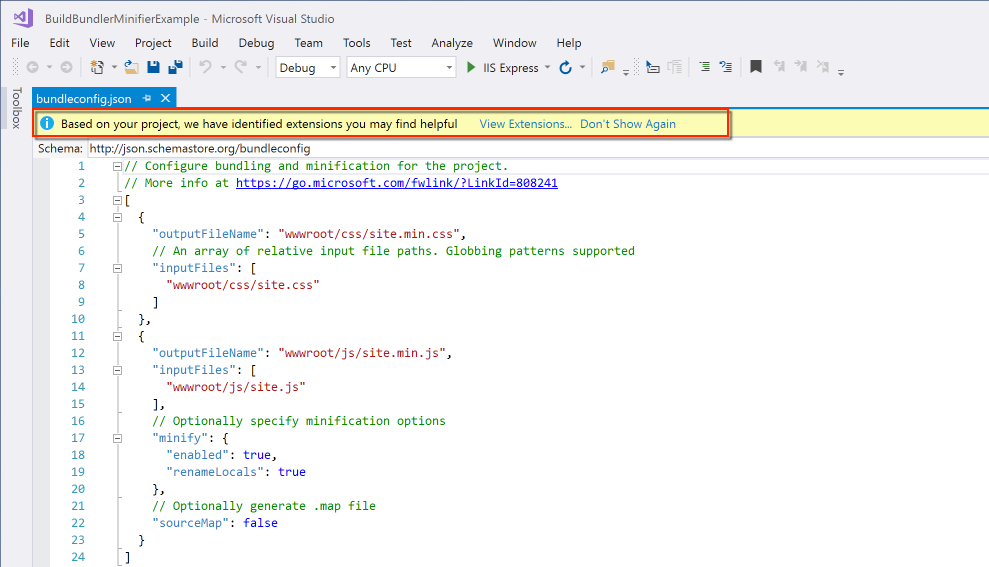
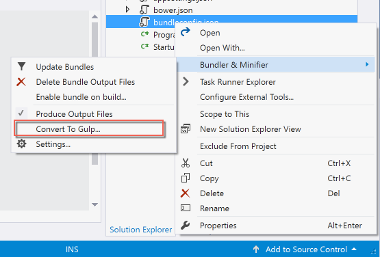

# Bundling and minification in ASP.NET Core

Bundling and minification are two techniques you can use in ASP.NET to improve page load performance for your web application. Bundling combines multiple files into a single file. Minification performs a variety of different code optimizations to scripts and CSS, which results in smaller payloads. Used together, bundling and minification improves load time performance by reducing the number of requests to the server and reducing the size of the requested assets (such as CSS and JavaScript files).

This article explains the benefits of using bundling and minification, including how these features can be used with ASP.NET Core applications.

## Overview

In ASP.NET Core apps, there are multiple options for bundling and minifying client-side resources. The core templates for MVC provide an out-of-the-box solution using a configuration file and BuildBundlerMinifier NuGet package. Third party tools, such as [Gulp](using-gulp.md) and [Grunt](using-grunt.md) are also available to accomplish the same tasks should your processes require additional workflow or complexities. By using design-time bundling and minification, the minified files are created prior to the application’s deployment. Bundling and minifying before deployment provides the advantage of reduced server load. However, it’s important to recognize that design-time bundling and minification increases build complexity and only works with static files.

Bundling and minification primarily improve the first page request load time. Once a web page has been requested, the browser caches the assets (JavaScript, CSS and images) so bundling and minification won’t provide any performance boost when requesting the same page, or pages on the same site requesting the same assets. If you don’t set the expires header correctly on your assets, and you don’t use bundling and minification, the browser's freshness heuristics will mark the assets stale after a few days and the browser will require a validation request for each asset. In this case, bundling and minification provide a performance increase even after the first page request.

### Bundling

Bundling is a feature that makes it easy to combine or bundle multiple files into a single file. Because bundling combines multiple files into a single file, it reduces the number of requests to the server that are required to retrieve and display a web asset, such as a web page. You can create CSS, JavaScript and other bundles. Fewer files means fewer HTTP requests from your browser to the server or from the service providing your application. This results in improved first page load performance.

### Minification

Minification performs a variety of different code optimizations to reduce the size of requested assets (such as CSS, images, JavaScript files). Common results of minification include removing unnecessary white space and comments, and shortening variable names to one character.

Consider the following JavaScript function:

```javascript
AddAltToImg = function (imageTagAndImageID, imageContext) {
  ///<signature>
  ///<summary> Adds an alt tab to the image
  // </summary>
  //<param name="imgElement" type="String">The image selector.</param>
  //<param name="ContextForImage" type="String">The image context.</param>
  ///</signature>
  var imageElement = $(imageTagAndImageID, imageContext);
  imageElement.attr('alt', imageElement.attr('id').replace(/ID/, ''));
}
```

After minification, the function is reduced to the following:

```javascript
AddAltToImg=function(t,a){var r=$(t,a);r.attr("alt",r.attr("id").replace(/ID/,""))};
```

In addition to removing the comments and unnecessary whitespace, the following parameters and variable names were renamed (shortened) as follows:

Original | Renamed
--- | :---:
imageTagAndImageID | t
imageContext | a
imageElement | r

## Impact of bundling and minification

The following table shows several important differences between listing all the assets individually and using bundling and minification on a simple web page:

Action | With B/M | Without B/M | Change
--- | :---: | :---: | :---:
File Requests |7 | 18 | 157%
KB Transferred | 156 | 264.68 | 70%
Load Time (MS) | 885 | 2360 | 167%

The bytes sent had a significant reduction with bundling as browsers are fairly verbose with the HTTP headers that they apply on requests. The load time shows a big improvement, however this example was run locally. You will get greater gains in performance when using bundling and minification with assets transferred over a network.

## Using bundling and minification in a project

The MVC project template provides a `bundleconfig.json` configuration file which defines the options for each bundle. By default, a single bundle configuration is defined for the custom JavaScript (`wwwroot/js/site.js`) and Stylesheet (`wwwroot/css/site.css`) files.

[!code-json[Main](../client-side/bundling-and-minification/samples/BuildBundlerMinifierExample/bundleconfig.json)]

Bundle options include:

* outputFileName - name of the bundle file to output. Can contain a relative path from the `bundleconfig.json` file. **required**
* inputFiles - array of files to bundle together. These are relative paths to the configuration file. **optional**, *an empty value results in an empty output file. [globbing](http://www.tldp.org/LDP/abs/html/globbingref.html) patterns are supported.
* minify - minification options for the output type. **optional**, *default - `minify: { enabled: true }`*
  * Configuration options are available per output file type.
    * [CSS Minifier](https://github.com/madskristensen/BundlerMinifier/wiki/cssminifier)
    * [JavaScript Minifier](https://github.com/madskristensen/BundlerMinifier/wiki)
    * [HTML Minifier](https://github.com/madskristensen/BundlerMinifier/wiki)
* includeInProject - add generated files to project file. **optional**, *default - false*
* sourceMaps - generate source maps for the bundled file. **optional**, *default - false*

### Visual Studio 2015 / 2017

Open `bundleconfig.json` in Visual Studio, if your environment does not have the extension installed; a prompt is presented suggesting that there is one that could assist with this file type.



Select View Extensions, and install the **Bundler & Minifier** extension (Requires Visual Studio restart).


When the restart is complete, you need to configure the build to run the processes of minifying and bundling the client-side assets. Right-click the `bundleconfig.json` file and select *Enable bundle on build...*.

Build the project, and the `bundleconfig.json` is included in the build process to produce the output files based on the configuration.

```console
1>------ Build started: Project: BuildBundlerMinifierExample, Configuration: Debug Any CPU ------
1>
1>Bundler: Begin processing bundleconfig.json
1>Bundler: Done processing bundleconfig.json
1>BuildBundlerMinifierExample -> C:\BuildBundlerMinifierExample\bin\Debug\netcoreapp1.1\BuildBundlerMinifierExample.dll
========== Build: 1 succeeded or up-to-date, 0 failed, 0 skipped ==========
```

### Visual Studio Code or Command Line

Visual Studio and the extension drive the bundling and minification process using GUI gestures; however, the same capabilities are available with the `dotnet` CLI and BuildBundlerMinifier NuGet package.

Add the NuGet package to your project:

```console
dotnet add package BuildBundlerMinifier
```

Restore the dependencies:

```console
dotnet restore
```

Build the app:

```console
dotnet build
```

The output from the build command shows the results of the minification and/or bundling according to what is configured.

```console
Microsoft (R) Build Engine version 15.1.545.13942
Copyright (C) Microsoft Corporation. All rights reserved.


  Bundler: Begin processing bundleconfig.json
     Minified wwwroot/css/site.min.css
  Bundler: Done processing bundleconfig.json
  BuildBundlerMinifierExample -> /BuildBundlerMinifierExample/bin/Debug/netcoreapp1.0/BuildBundlerMinifierExample.dll
```

## Adding files

In this example, an additional CSS file is added called `custom.css` and configured for bundling and minification with `site.css`, resulting in a single `site.min.css`.

custom.css

```css
.about, [role=main], [role=complementary]
{
    margin-top: 60px;
}

footer
{
    margin-top: 10px;
}
```

Add the relative path to `bundleconfig.json`.

[!code-json[Main](../client-side/bundling-and-minification/samples/BuildBundlerMinifierExample/bundleconfig2.json)]

> [!NOTE]
> Alternatively, the globbing pattern could be used - `"inputFiles": ["wwwroot/**/*(*.css|!(*.min.css)"]` which gets all CSS files and excludes the minified file pattern.

Build the application and if you open `site.min.css`, you'll now notice that contents of `custom.css` has been appended to the end of the file.

## Controlling bundling and minification

In general, you want to use the bundled and minified files of your app only in a production environment. During development, you want to use your original files so your app is easier to debug.

You can specify which scripts and CSS files to include in your pages using the environment tag helper in your layout pages (see [Tag Helpers](../mvc/views/tag-helpers/index.md)). The environment tag helper will only render its contents when running in specific environments. See [Working with Multiple Environments](../fundamentals/environments.md) for details on specifying the current environment.

The following environment tag will render the unprocessed CSS files when running in the `Development` environment:

[!code-html[Main](../client-side/bundling-and-minification/samples/BuildBundlerMinifierExample/Views/Shared/_Layout.cshtml?highlight=3&range=9-12)]

This environment tag will render the bundled and minified CSS files only when running in `Production` or `Staging`:

[!code-html[Main](../client-side/bundling-and-minification/samples/BuildBundlerMinifierExample/Views/Shared/_Layout.cshtml?highlight=5&range=13-18)]

## Consuming bundleconfig.json from Gulp

If your app bundling and minification workflow requires additional processes such as image processing, cache busting, CDN assest processing, etc., then you can convert the Bundle and Minify process to Gulp.

> [!NOTE]
> Conversion option only available in Visual Studio 2015 and 2017.

Right-click the `bundleconfig.json` and select **Convert to Gulp...**. This will generate the `gulpfile.js` and install the necessary npm packages.



The `gulpfile.js` produced reads the `bundleconfig.json` file for the configuration, therefore it can continue to be used for the inputs/outputs and settings.

[!code-javascript[Main](../client-side/bundling-and-minification/samples/BuildBundlerMinifierExample/gulpfile.js)]

To enable Gulp when the project builds in Visual Studio 2017, add the following to the *.csproj file:

```xml
<Target Name="MyPreCompileTarget" BeforeTargets="Build">
    <Exec Command="gulp min" />
</Target>
```

To enable Gulp when the project builds in Visual Studio 2015, add the following to the `project.json` file:

```json
"scripts": {
    "precompile": "gulp min"
}
```

## Additional resources

* [Using Gulp](using-gulp.md)
* [Using Grunt](using-grunt.md)
* [Working with Multiple Environments](../fundamentals/environments.md)
* [Tag Helpers](../mvc/views/tag-helpers/index.md)
