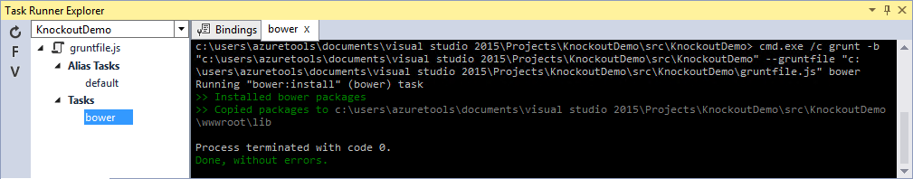
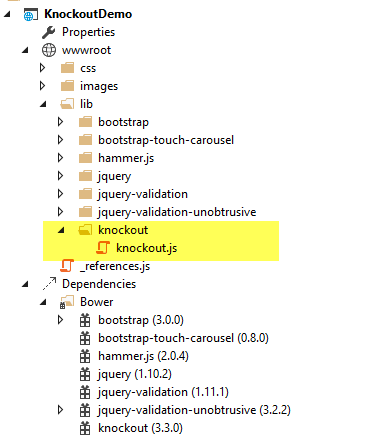
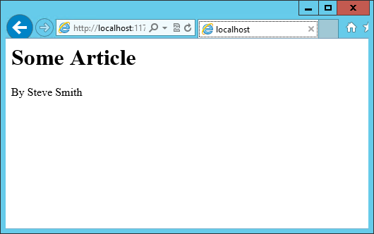
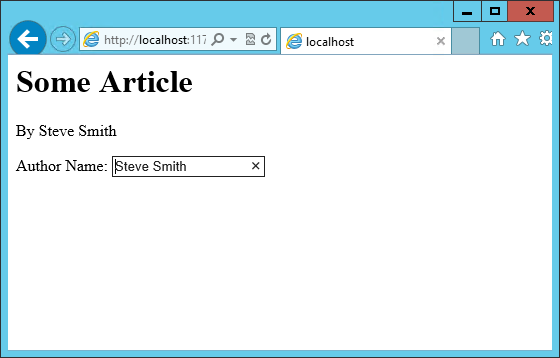
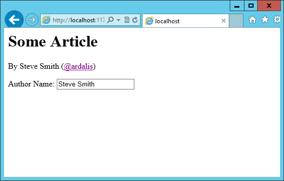
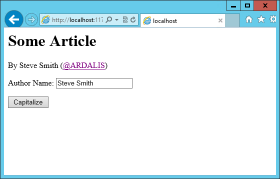
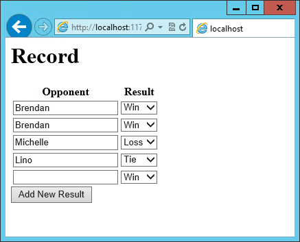
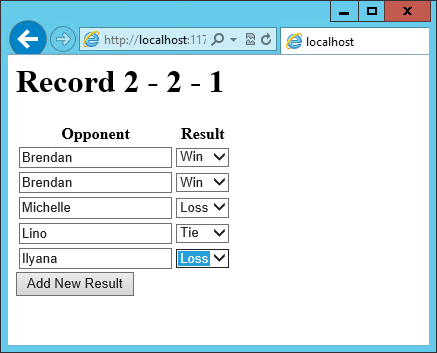

# Knockout.js MVVM Framework in ASP.NET Core

By [Steve Smith](https://ardalis.com/)

Knockout is a popular JavaScript library that simplifies the creation of complex data-based user interfaces. It can be used alone or with other libraries, such as jQuery. Its primary purpose is to bind UI elements to an underlying data model defined as a JavaScript object, such that when changes are made to the UI, the model is updated, and vice versa. Knockout facilitates the use of a Model-View-ViewModel (MVVM) pattern in a web application's client-side behavior. The two main concepts one must learn when working with Knockout's MVVM implementation are Observables and Bindings.

## Getting started

Knockout is deployed as a single JavaScript file, so installing and using it is very straightforward using [bower](bower.md). Assuming you already have [bower](bower.md) and [gulp](using-gulp.md) configured, open *bower.json* in your ASP.NET Core project and add the knockout dependency as shown here:

```json
{
  "name": "KnockoutDemo",
  "private": true,
  "dependencies": {
    "knockout" : "^3.3.0"
  },
  "exportsOverride": {
  }
}
```

With this in place, you can then manually run bower by opening the Task Runner Explorer (under View ‣ Other Windows ‣ Task Runner Explorer) and then under Tasks, right-click on bower and select Run. The result should appear similar to this:



Now if you look in your project's `wwwroot` folder, you should see knockout installed under the lib folder.



It's recommended that in your production environment you reference knockout via a Content Delivery Network, or CDN, as this increases the likelihood that your users will already have a cached copy of the file and thus will not need to download it at all. Knockout is available on several CDNs, including the Microsoft Ajax CDN, here:

[http://ajax.aspnetcdn.com/ajax/knockout/knockout-3.3.0.js](http://ajax.aspnetcdn.com/ajax/knockout/knockout-3.3.0.js)

To include Knockout on a page that will use it, simply add a `<script>` element referencing the file from wherever you will be hosting it (with your application, or via a CDN):

```html
<script type="text/javascript" src="knockout-3.3.0.js"></script>
```

## Observables, ViewModels, and simple binding

You may already be familiar with using JavaScript to manipulate elements on a web page, either via direct access to the DOM or using a library like jQuery. Typically this kind of behavior is achieved by writing code to directly set element values in response to certain user actions. With Knockout, a declarative approach is taken instead, through which elements on the page are bound to properties on an object. Instead of writing code to manipulate DOM elements, user actions simply interact with the ViewModel object, and Knockout takes care of ensuring the page elements are synchronized.

As a simple example, consider the page list below. It includes a `<span>` element with a `data-bind` attribute indicating that the text content should be bound to authorName. Next, in a JavaScript block a variable viewModel is defined with a single property, `authorName`, set to some value. Finally, a call to `ko.applyBindings` is made, passing in this viewModel variable.

```html
<html>
<head>
    <script type="text/javascript" src="lib/knockout/knockout.js"></script>
</head>
<body>
    <h1>Some Article</h1>
    <p>
        By <span data-bind="text: authorName"></span>
    </p>
    <script type="text/javascript">
      var viewModel = {
        authorName: 'Steve Smith'
      };
      ko.applyBindings(viewModel);
    </script>
</body>
</html>
```

When viewed in the browser, the content of the <span> element is replaced with the value in the viewModel variable:



We now have simple one-way binding working. Notice that nowhere in the code did we write JavaScript to assign a value to the span's contents. If we want to manipulate the ViewModel, we can take this a step further and add an HTML input textbox, and bind to its value, like so:

```html
<p>
    Author Name: <input type="text" data-bind="value: authorName" />
</p>
```

Reloading the page, we see that this value is indeed bound to the input box:



However, if we change the value in the textbox, the corresponding value in the `<span>` element doesn't change. Why not?

The issue is that nothing notified the `<span>` that it needed to be updated. Simply updating the ViewModel isn't by itself sufficient, unless the ViewModel's properties are wrapped in a special type. We need to use **observables** in the ViewModel for any properties that need to have changes automatically updated as they occur. By changing the ViewModel to use `ko.observable("value")` instead of just "value", the ViewModel will update any HTML elements that are bound to its value whenever a change occurs. Note that input boxes don't update their value until they lose focus, so you won't see changes to bound elements as you type.

> [!NOTE]
> Adding support for live updating after each keypress is simply a matter of adding `valueUpdate: "afterkeydown"` to the `data-bind` attribute's contents. You can also get this behavior by using `data-bind="textInput: authorName"` to get instant updates of values. 

Our viewModel, after updating it to use ko.observable:

```javascript
var viewModel = {
  authorName: ko.observable('Steve Smith')
};
ko.applyBindings(viewModel);
```

Knockout supports a number of different kinds of bindings. So far we've seen how to bind to `text` and to `value`. You can also bind to any given attribute. For instance, to create a hyperlink with an anchor tag, the `src` attribute can be bound to the viewModel. Knockout also supports binding to functions. To demonstrate this, let's update the viewModel to include the author's twitter handle, and display the twitter handle as a link to the author's twitter page. We'll do this in three stages.

First, add the HTML to display the hyperlink, which we'll show in parentheses after the author's name:

```html
<h1>Some Article</h1>
<p>
    By <span data-bind="text: authorName"></span>
    (<a data-bind="attr: { href: twitterUrl}, text: twitterAlias" ></a>)
</p>
```

Next, update the viewModel to include the twitterUrl and twitterAlias properties:

```javascript
var viewModel = {
  authorName: ko.observable('Steve Smith'),
  twitterAlias: ko.observable('@ardalis'),
  twitterUrl: ko.computed(function() {
    return "https://twitter.com/";
  }, this)
};
ko.applyBindings(viewModel);
```

Notice that at this point we haven't yet updated the twitterUrl to go to the correct URL for this twitter alias – it's just pointing at twitter.com. Also notice that we're using a new Knockout function, `computed`, for twitterUrl. This is an observable function that will notify any UI elements if it changes. However, for it to have access to other properties in the viewModel, we need to change how we are creating the viewModel, so that each property is its own statement.

The revised viewModel declaration is shown below. It is now declared as a function. Notice that each property is its own statement now, ending with a semicolon. Also notice that to access the twitterAlias property value, we need to execute it, so its reference includes ().

```javascript
function viewModel() {
  this.authorName = ko.observable('Steve Smith');
  this.twitterAlias = ko.observable('@ardalis');

  this.twitterUrl = ko.computed(function() {
    return "https://twitter.com/" + this.twitterAlias().replace('@','');
  }, this)
};
ko.applyBindings(viewModel);
```

The result works as expected in the browser:



Knockout also supports binding to certain UI element events, such as the click event. This allows you to easily and declaratively bind UI elements to functions within the application's viewModel. As a simple example, we can add a button that, when clicked, modifies the author's twitterAlias to be all caps.

First, we add the button, binding to the button's click event, and referencing the function name we're going to add to the viewModel:

```html
<p>
    <button data-bind="click: capitalizeTwitterAlias">Capitalize</button>
</p>
```

Then, add the function to the viewModel, and wire it up to modify the viewModel's state. Notice that to set a new value to the twitterAlias property, we call it as a method and pass in the new value.

```javascript
function viewModel() {
  this.authorName = ko.observable('Steve Smith');
  this.twitterAlias = ko.observable('@ardalis');

  this.twitterUrl = ko.computed(function() {
    return "https://twitter.com/" + this.twitterAlias().replace('@','');
  }, this);

  this.capitalizeTwitterAlias = function() {
    var currentValue = this.twitterAlias();
    this.twitterAlias(currentValue.toUpperCase());
  }
};
ko.applyBindings(viewModel);
```

Running the code and clicking the button modifies the displayed link as expected:



## Control flow

Knockout includes bindings that can perform conditional and looping operations. Looping operations are especially useful for binding lists of data to UI lists, menus, and grids or tables. The foreach binding will iterate over an array. When used with an observable array, it will automatically update the UI elements when items are added or removed from the array, without re-creating every element in the UI tree. The following example uses a new viewModel which includes an observable array of game results. It is bound to a simple table with two columns using a `foreach` binding on the `<tbody>` element. Each `<tr>` element within `<tbody>` will be bound to an element of the gameResults collection.

```html
<h1>Record</h1>
<table>
    <thead>
        <tr>
            <th>Opponent</th>
            <th>Result</th>
        </tr>
    </thead>
    <tbody data-bind="foreach: gameResults">
        <tr>
            <td data-bind="text:opponent"></td>
            <td data-bind="text:result"></td>
        </tr>
    </tbody>
</table>
<script type="text/javascript">
  function GameResult(opponent, result) {
    var self = this;
    self.opponent = opponent;
    self.result = ko.observable(result);
  }

  function ViewModel() {
    var self = this;

    self.resultChoices = ["Win", "Loss", "Tie"];

    self.gameResults = ko.observableArray([
      new GameResult("Brendan", self.resultChoices[0]),
      new GameResult("Brendan", self.resultChoices[0]),
      new GameResult("Michelle", self.resultChoices[1])
    ]);
  };
  ko.applyBindings(new ViewModel);
</script>
```

Notice that this time we're using ViewModel with a capital “V" because we expect to construct it using “new" (in the applyBindings call). When executed, the page results in the following output:


To demonstrate that the observable collection is working, let's add a bit more functionality. We can include the ability to record the results of another game to the ViewModel, and then add a button and some UI to work with this new function.  First, let's create the addResult method:

```javascript
// add this to ViewModel()
self.addResult = function() {
  self.gameResults.push(new GameResult("", self.resultChoices[0]));
}
```

Bind this method to a button using the `click` binding:

```html
<button data-bind="click: addResult">Add New Result</button>
```

Open the page in the browser and click the button a couple of times, resulting in a new table row with each click:


There are a few ways to support adding new records in the UI, typically either inline or in a separate form. We can easily modify the table to use textboxes and dropdownlists so that the whole thing is editable. Just change the `<tr>` element as shown:

```html
<tbody data-bind="foreach: gameResults">
    <tr>
      <td><input data-bind="value:opponent" /></td>
      <td><select data-bind="options: $root.resultChoices, value:result, optionsText: $data"></select></td>
    </tr>
</tbody>
```

Note that `$root` refers to the root ViewModel, which is where the possible choices are exposed. `$data` refers to whatever the current model is within a given context - in this case it refers to an individual element of the resultChoices array, each of which is a simple string.

With this change, the entire grid becomes editable:



If we weren't using Knockout, we could achieve all of this using jQuery, but most likely it would not be nearly as efficient. Knockout tracks which bound data items in the ViewModel correspond to which UI elements, and only updates those elements that need to be added, removed, or updated. It would take significant effort to achieve this ourselves using jQuery or direct DOM manipulation, and even then if we then wanted to display aggregate results (such as a win-loss record) based on the table's data, we would need to once more loop through it and parse the HTML elements.  With Knockout, displaying the win-loss record is trivial. We can perform the calculations within the ViewModel itself, and then display it with a simple text binding and a `<span>`.

To build the win-loss record string, we can use a computed observable. Note that references to observable properties within the ViewModel must be function calls, otherwise they will not retrieve the value of the observable (i.e. `gameResults()` not `gameResults` in the code shown):

```javascript
self.displayRecord = ko.computed(function () {
  var wins = self.gameResults().filter(function (value) { return value.result() == "Win"; }).length;
  var losses = self.gameResults().filter(function (value) { return value.result() == "Loss"; }).length;
  var ties = self.gameResults().filter(function (value) { return value.result() == "Tie"; }).length;
  return wins + " - " + losses + " - " + ties;
}, this);
```

Bind this function to a span within the `<h1>` element at the top of the page:

```html
<h1>Record <span data-bind="text: displayRecord"></span></h1>
```

The result:



Adding rows or modifying the selected element in any row's Result column will update the record shown at the top of the window.

In addition to binding to values, you can also use almost any legal JavaScript expression within a binding. For example, if a UI element should only appear under certain conditions, such as when a value exceeds a certain threshold, you can specify this logically within the binding expression:

```html
<div data-bind="visible: customerValue > 100"></div>
```

This `<div>` will only be visible when the customerValue is over 100.

## Templates

Knockout has support for templates, so that you can easily separate your UI from your behavior, or incrementally load UI elements into a large application on demand. We can update our previous example to make each row its own template by simply pulling the HTML out into a template and specifying the template by name in the data-bind call on `<tbody>`.

```html
<tbody data-bind="template: { name: 'rowTemplate', foreach: gameResults }">
</tbody>
<script type="text/html" id="rowTemplate">
  <tr>
      <td><input data-bind="value:opponent" /></td>
      <td><select data-bind="options: $root.resultChoices, value:result, optionsText: $data"></select></td>
  </tr>
</script>
```

Knockout also supports other templating engines, such as the jQuery.tmpl library and Underscore.js's templating engine.

## Components

Components allow you to organize and reuse UI code, usually along with the ViewModel data on which the UI code depends. To create a component, you simply need to specify its template and its viewModel, and give it a name. This is done by calling `ko.components.register()`. In addition to defining the templates and viewmodel inline, they can be loaded from external files using a library like *require.js*, resulting in very clean and efficient code.

## Communicating with APIs

Knockout can work with any data in JSON format. A common way to retrieve and save data using Knockout is with jQuery, which supports the `$.getJSON()` function to retrieve data, and the `$.post()` method to send data from the browser to an API endpoint. Of course, if you prefer a different way to send and receive JSON data, Knockout will work with it as well.

## Summary

Knockout provides a simple, elegant way to bind UI elements to the current state of the client application, defined in a ViewModel. Knockout's binding syntax uses the data-bind attribute, applied to HTML elements that are to be processed. Knockout is able to efficiently render and update large data sets by tracking UI elements and only processing changes to affected elements. Large applications can break up UI logic using templates and components, which can be loaded on demand from external files. Currently version 3, Knockout is a stable JavaScript library that can improve web applications that require rich client interactivity.
