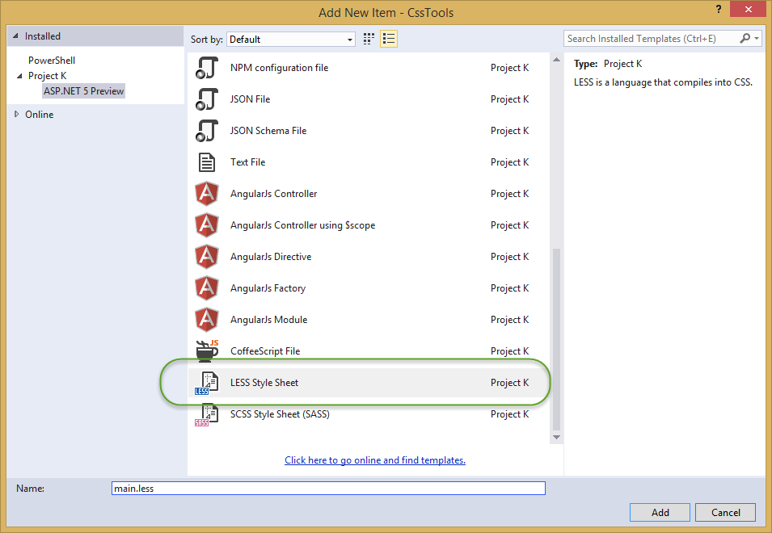
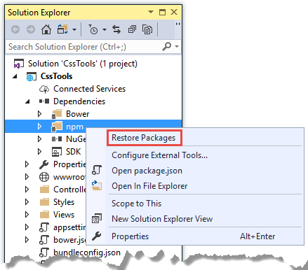
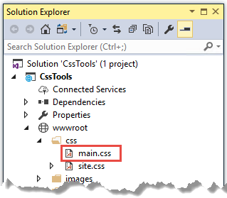
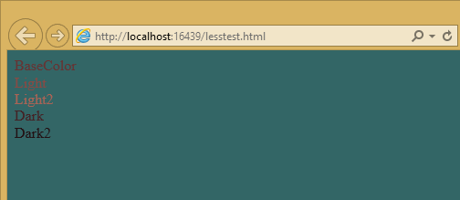
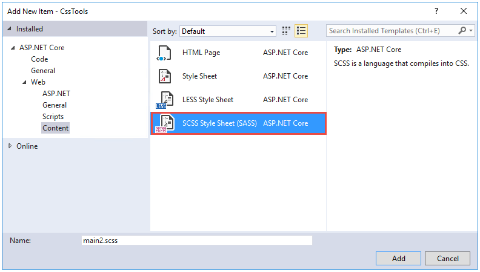

# Introduction to styling applications with Less, Sass, and Font Awesome in ASP.NET Core

By [Steve Smith](https://ardalis.com/)

Users of web applications have increasingly high expectations when it comes to style and overall experience. Modern web applications frequently leverage rich tools and frameworks for defining and managing their look and feel in a consistent manner. Frameworks like [Bootstrap](http://getbootstrap.com/) can go a long way toward defining a common set of styles and layout options for web sites. However, most non-trivial sites also benefit from being able to effectively define and maintain styles and cascading style sheet (CSS) files, as well as having easy access to non-image icons that help make the site's interface more intuitive. That's where languages and tools that support [Less](http://lesscss.org/) and [Sass](http://sass-lang.com/), and libraries like [Font Awesome](http://fontawesome.io/), come in.

## CSS preprocessor languages

Languages that are compiled into other languages, in order to improve the experience of working with the underlying language, are referred to as preprocessors. There are two popular preprocessors for CSS: Less and Sass.  These preprocessors add features to CSS, such as support for variables and nested rules, which improve the maintainability of large, complex stylesheets. CSS as a language is very basic, lacking support even for something as simple as variables, and this tends to make CSS files repetitive and bloated. Adding real programming language features via preprocessors can help reduce duplication and provide better organization of styling rules. Visual Studio provides built-in support for both Less and Sass, as well as extensions that can further improve the development experience when working with these languages.

As a quick example of how preprocessors can improve readability and maintainability of style information, consider this CSS:

```css
.header {
    color: black;
    font-weight: bold;
    font-size: 18px;
    font-family: Helvetica, Arial, sans-serif;
}

.small-header {
    color: black;
    font-weight: bold;
    font-size: 14px;
    font-family: Helvetica, Arial, sans-serif;
}
```

Using Less, this can be rewritten to eliminate all of the duplication, using a *mixin* (so named because it allows you to "mix in" properties from one class or rule-set into another):

```less
.header {
    color: black;
    font-weight: bold;
    font-size: 18px;
    font-family: Helvetica, Arial, sans-serif;
}

.small-header {
    .header;
    font-size: 14px;
}
```

## Less

The Less CSS preprocessor runs using Node.js. To install Less, use Node Package Manager (npm) from a command prompt (-g means "global"):

```console
npm install -g less
```

If you're using Visual Studio, you can get started with Less by adding one or more Less files to your project, and then configuring Gulp (or Grunt) to process them at compile-time. Add a *Styles* folder to your project, and then add a new Less file named *main.less* to this folder.



Once added, your folder structure should look something like this:


Now you can add some basic styling to the file, which will be compiled into CSS and deployed to the wwwroot folder by Gulp.

Modify *main.less* to include the following content, which creates a simple color palette from a single base color.

```less
@base: #663333;
@background: spin(@base, 180);
@lighter: lighten(spin(@base, 5), 10%);
@lighter2: lighten(spin(@base, 10), 20%);
@darker: darken(spin(@base, -5), 10%);
@darker2: darken(spin(@base, -10), 20%);

body {
    background-color:@background;
}
.baseColor  {color:@base}
.bgLight    {color:@lighter}
.bgLight2   {color:@lighter2}
.bgDark     {color:@darker}
.bgDark2    {color:@darker2}
```

`@base` and the other @-prefixed items are variables. Each of them represents a color. Except for `@base`, they are set using color functions: lighten, darken, and spin. Lighten and darken do pretty much what you would expect; spin adjusts the hue of a color by a number of degrees (around the color wheel). The Less processor is smart enough to ignore variables that aren't used, so to demonstrate how these variables work, we need to use them somewhere. The classes `.baseColor`, etc. will demonstrate the calculated values of each of the variables in the CSS file that is produced.

### Getting started

Create an **npm Configuration File** (*package.json*) in your project folder and edit it to reference `gulp` and `gulp-less`:

```json
{
  "version": "1.0.0",
  "name": "asp.net",
  "private": true,
  "devDependencies": {
    "gulp": "3.9.1",
    "gulp-less": "3.3.0"
  }
}
```

Install the dependencies either at a command prompt in your project folder, or in Visual Studio **Solution Explorer** (**Dependencies > npm > Restore packages**).

```console
npm install
```



In the project folder, create a **Gulp Configuration File** (*gulpfile.js*) to define the automated process.  Add a variable at the top of the file to represent Less, and a task to run Less:

```javascript
var gulp = require("gulp"),
  fs = require("fs"),
  less = require("gulp-less");

gulp.task("less", function () {
  return gulp.src('Styles/main.less')
    .pipe(less())
    .pipe(gulp.dest('wwwroot/css'));
});
```

Open the **Task Runner Explorer** (**View > Other Windows > Task Runner Explorer**). Among the tasks, you should see a new task named `less`. You might have to refresh the window.

Run the `less` task, and you see output similar to what is shown here:


The *wwwroot/css* folder now contains a new file, *main.css*:



Open *main.css* and you see something like the following:

```css
body {
    background-color: #336666;
}
.baseColor {
    color: #663333;
}
.bgLight {
    color: #884a44;
}
.bgLight2 {
    color: #aa6355;
}
.bgDark {
    color: #442225;
}
.bgDark2 {
    color: #221114;
}
```

Add a simple HTML page to the *wwwroot* folder, and reference *main.css* to see the color palette in action.

```html
<!DOCTYPE html>
<html>
<head>
    <meta charset="utf-8" />
    <link href="css/main.css" rel="stylesheet" />
    <title></title>
</head>
<body>
    <div>
        <div class="baseColor">BaseColor</div>
        <div class="bgLight">Light</div>
        <div class="bgLight2">Light2</div>
        <div class="bgDark">Dark</div>
        <div class="bgDark2">Dark2</div>
    </div>
</body>
</html>
```

You can see that the 180 degree spin on `@base` used to produce `@background` resulted in the color wheel opposing color of `@base`:



Less also provides support for nested rules, as well as nested media queries. For example, defining nested hierarchies like menus can result in verbose CSS rules like these:

```css
nav {
    height: 40px;
    width: 100%;
}
nav li {
    height: 38px;
    width: 100px;
}
nav li a:link {
    color: #000;
    text-decoration: none;
}
nav li a:visited {
    text-decoration: none;
    color: #CC3333;
}
nav li a:hover {
    text-decoration: underline;
    font-weight: bold;
}
nav li a:active {
    text-decoration: underline;
}
```

Ideally all of the related style rules will be placed together within the CSS file, but in practice there is nothing enforcing this rule except convention and perhaps block comments.

Defining these same rules using Less looks like this:

```less
nav {
    height: 40px;
    width: 100%;
    li {
        height: 38px;
        width: 100px;
        a {
            color: #000;
            &:link { text-decoration:none}
            &:visited { color: #CC3333; text-decoration:none}
            &:hover { text-decoration:underline; font-weight:bold}
            &:active {text-decoration:underline}
        }
    }
}
```

Note that in this case, all of the subordinate elements of `nav` are contained within its scope. There is no longer any repetition of parent elements (`nav`, `li`, `a`), and the total line count has dropped as well (though some of that is a result of putting values on the same lines in the second example). It can be very helpful, organizationally, to see all of the rules for a given UI element within an explicitly bounded scope, in this case set off from the rest of the file by curly braces.

The `&` syntax is a Less selector feature, with & representing the current selector parent. So, within the a {...} block, `&` represents an `a` tag, and thus `&:link` is equivalent to `a:link`.

Media queries, extremely useful in creating responsive designs, can also contribute heavily to repetition and complexity in CSS. Less allows media queries to be nested within classes, so that the entire class definition doesn't need to be repeated within different top-level `@media` elements. For example, here is CSS for a responsive menu:

```css
.navigation {
    margin-top: 30%;
    width: 100%;
}
@media screen and (min-width: 40em) {
    .navigation {
        margin: 0;
    }
}
@media screen and (min-width: 62em) {
    .navigation {
        width: 960px;
        margin: 0;
    }
}
```

This can be better defined in Less as:

```less
.navigation {
    margin-top: 30%;
    width: 100%;
    @media screen and (min-width: 40em) {
        margin: 0;
    }
    @media screen and (min-width: 62em) {
        width: 960px;
        margin: 0;
    }
}
```

Another feature of Less that we have already seen is its support for mathematical operations, allowing style attributes to be constructed from pre-defined variables. This makes updating related styles much easier, since the base variable can be modified and all dependent values change automatically.

CSS files, especially for large sites (and especially if media queries are being used), tend to get quite large over time, making working with them unwieldy. Less files can be defined separately, then pulled together using `@import` directives. Less can also be used to import individual CSS files, as well, if desired.

*Mixins* can accept parameters, and Less supports conditional logic in the form of mixin guards, which provide a declarative way to define when certain mixins take effect. A common use for mixin guards is to adjust colors based on how light or dark the source color is. Given a mixin that accepts a parameter for color, a mixin guard can be used to modify the mixin based on that color:

```less
.box (@color) when (lightness(@color) >= 50%) {
    background-color: #000;
}
.box (@color) when (lightness(@color) < 50%) {
    background-color: #FFF;
}
.box (@color) {
    color: @color;
}

.feature {
    .box (@base);
}
```

Given our current `@base` value of `#663333`, this Less script will produce the following CSS:

```css
.feature {
    background-color: #FFF;
    color: #663333;
}
```

Less provides a number of additional features, but this should give you some idea of the power of this preprocessing language.

## Sass

Sass is similar to Less, providing support for many of the same features, but with slightly different syntax. It is built using Ruby, rather than JavaScript, and so has different setup requirements. The original Sass language did not use curly braces or semicolons, but instead defined scope using white space and indentation. In version 3 of Sass, a new syntax was introduced, **SCSS** ("Sassy CSS"). SCSS is similar to CSS in that it ignores indentation levels and whitespace, and instead uses semicolons and curly braces.

To install Sass, typically you would first install Ruby (pre-installed on Mac), and then run:

```console
gem install sass
```

However, if you're running Visual Studio, you can get started with Sass in much the same way as you would with Less. Open *package.json* and add the "gulp-sass" package to `devDependencies`:

```json
"devDependencies": {
  "gulp": "3.9.1",
  "gulp-less": "3.3.0",
  "gulp-sass": "3.1.0"
}
```

Next, modify *gulpfile.js* to add a sass variable and a task to compile your Sass files and place the results in the wwwroot folder:

```javascript
var gulp = require("gulp"),
  fs = require("fs"),
  less = require("gulp-less"),
  sass = require("gulp-sass");

// other content removed

gulp.task("sass", function () {
  return gulp.src('Styles/main2.scss')
    .pipe(sass())
    .pipe(gulp.dest('wwwroot/css'));
});
```

Now you can add the Sass file *main2.scss* to the *Styles* folder in the root of the project:



Open *main2.scss* and add the following:

```sass
$base: #CC0000;
body {
    background-color: $base;
}
```

Save all of your files. Now when you refresh **Task Runner Explorer**, you see a `sass` task. Run it, and look in the */wwwroot/css* folder. There is now a *main2.css* file, with these contents:

```css
body {
    background-color: #CC0000;
}
```

Sass supports nesting in much the same was that Less does, providing similar benefits. Files can be split up by function and included using the `@import` directive:

```sass
@import 'anotherfile';
```

Sass supports mixins as well, using the `@mixin` keyword to define them and `@include` to include them, as in this example from [sass-lang.com](http://sass-lang.com):

```sass
@mixin border-radius($radius) {
    -webkit-border-radius: $radius;
    -moz-border-radius: $radius;
    -ms-border-radius: $radius;
    border-radius: $radius;
}

.box { @include border-radius(10px); }
```

In addition to mixins, Sass also supports the concept of inheritance, allowing one class to extend another. It's conceptually similar to a mixin, but results in less CSS code. It's accomplished using the `@extend` keyword. To try out mixins, add the following to your *main2.scss* file:

```sass
@mixin alert {
    border: 1px solid black;
    padding: 5px;
    color: #333333;
}

.success {
    @include alert;
    border-color: green;
}

.error {
    @include alert;
    color: red;
    border-color: red;
    font-weight:bold;
}
```

Examine the output in *main2.css* after running the `sass` task in **Task Runner Explorer**:

```css
.success {
    border: 1px solid black;
    padding: 5px;
    color: #333333;
    border-color: green;
 }

.error {
    border: 1px solid black;
    padding: 5px;
    color: #333333;
    color: red;
    border-color: red;
    font-weight: bold;
}
```

Notice that all of the common properties of the alert mixin are repeated in each class. The mixin did a good job of helping eliminate duplication at development time, but it's still creating CSS with a lot of duplication in it, resulting in larger than necessary CSS files - a potential performance issue.

Now replace the alert mixin with a `.alert` class, and change `@include` to `@extend` (remembering to extend `.alert`, not `alert`):

```sass
.alert {
    border: 1px solid black;
    padding: 5px;
    color: #333333;
}

.success {
    @extend .alert;
    border-color: green;
}

.error {
    @extend .alert;
    color: red;
    border-color: red;
    font-weight:bold;
}
```

Run Sass once more, and examine the resulting CSS:

```css
.alert, .success, .error {
    border: 1px solid black;
    padding: 5px;
    color: #333333;
}

.success {
    border-color: green;
}

.error {
    color: red;
    border-color: red;
    font-weight: bold;
}
```

Now the properties are defined only as many times as needed, and better CSS is generated.

Sass also includes functions and conditional logic operations, similar to Less. In fact, the two languages' capabilities are very similar.

## Less or Sass?

There is still no consensus as to whether it's generally better to use Less or Sass (or even whether to prefer the original Sass or the newer SCSS syntax within Sass). Probably the most important decision is to **use one of these tools**, as opposed to just hand-coding your CSS files. Once you've made that decision, both Less and Sass are good choices.

## Font Awesome

In addition to CSS preprocessors, another great resource for styling modern web applications is Font Awesome. Font Awesome is a toolkit that provides over 500 scalable vector icons that can be freely used in your web applications. It was originally designed to work with Bootstrap, but it has no dependency on that framework or on any JavaScript libraries.

The easiest way to get started with Font Awesome is to add a reference to it, using its public content delivery network (CDN) location:

```html
<link rel="stylesheet" href="//maxcdn.bootstrapcdn.com/font-awesome/4.3.0/css/font-awesome.min.css">
```

You can also add it to your Visual Studio project by adding it to the "dependencies" in *bower.json*:

```json
{
  "name": "ASP.NET",
  "private": true,
  "dependencies": {
    "bootstrap": "3.0.0",
    "jquery": "1.10.2",
    "jquery-validation": "1.11.1",
    "jquery-validation-unobtrusive": "3.2.2",
    "hammer.js": "2.0.4",
    "bootstrap-touch-carousel": "0.8.0",
    "Font-Awesome": "4.3.0"
  }
}
```

Once you have a reference to Font Awesome on a page, you can add icons to your application by applying Font Awesome classes, typically prefixed with "fa-", to your inline HTML elements (such as `<span>` or `<i>`).  For example, you can add icons to simple lists and menus using code like this:

```html
<!DOCTYPE html>
<html>
<head>
    <meta charset="utf-8" />
    <title></title>
    <link href="lib/font-awesome/css/font-awesome.css" rel="stylesheet" />
</head>
<body>
    <ul class="fa-ul">
        <li><i class="fa fa-li fa-home"></i> Home</li>
        <li><i class="fa fa-li fa-cog"></i> Settings</li>
    </ul>
</body>
</html>
```

This produces the following in the browser - note the icon beside each item:


You can view a complete list of the available icons here:

http://fontawesome.io/icons/

## Summary

Modern web applications increasingly demand responsive, fluid designs that are clean, intuitive, and easy to use from a variety of devices. Managing the complexity of the CSS stylesheets required to achieve these goals is best done using a preprocessor like Less or Sass. In addition, toolkits like Font Awesome quickly provide well-known icons to textual navigation menus and buttons, improving the overall user experience of your application.
