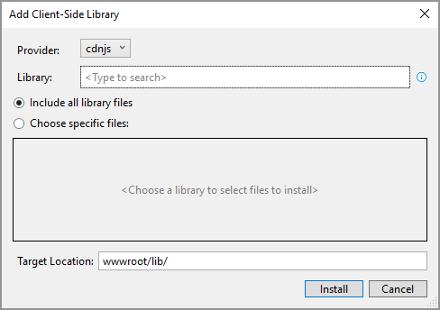
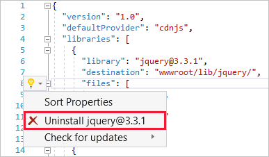
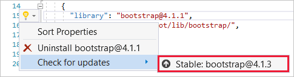

# Use LibMan with ASP.NET Core in Visual Studio

By [Scott Addie](https://twitter.com/Scott_Addie)

Visual Studio has built-in support for [LibMan](xref:client-side/libman/index) in ASP.NET Core projects, including:

* Support for configuring and running LibMan restore operations on build.
* Menu items for triggering LibMan restore and clean operations.
* Search dialog for finding libraries and adding the files to a project.
* Editing support for `libman.json`&mdash;the LibMan manifest file.

[View or download sample code](https://github.com/dotnet/AspNetCore.Docs/tree/main/aspnetcore/client-side/libman/samples/) [(how to download)](xref:index#how-to-download-a-sample)

## Prerequisites

* [Visual Studio 2019](https://visualstudio.microsoft.com/downloads/?utm_medium=microsoft&utm_source=learn.microsoft.com&utm_campaign=inline+link&utm_content=download+vs2019) with the **ASP.NET and web development** workload

## Add library files

Library files can be added to an ASP.NET Core project in two different ways:

1. [Use the Add Client-Side Library dialog](#use-the-add-client-side-library-dialog)
1. [Manually configure LibMan manifest file entries](#manually-configure-libman-manifest-file-entries)

### Use the Add Client-Side Library dialog

Follow these steps to install a client-side library:

* In **Solution Explorer**, right-click the project folder in which the files should be added. Choose **Add** > **Client-Side Library**. The **Add Client-Side Library** dialog appears:

  

* Select the library provider from the **Provider** drop down. CDNJS is the default provider.
* Type the library name to fetch in the **Library** text box. IntelliSense provides a list of libraries beginning with the provided text.
* Select the library from the IntelliSense list. Notice the library name is suffixed with the `@` symbol and the latest stable version known to the selected provider.
* Decide which files to include:
  * Select the **Include all library files** radio button to include all of the library's files.
  * Select the **Choose specific files** radio button to include a subset of the library's files. When the radio button is selected, the file selector tree is enabled. Check the boxes to the left of the file names to download.
* Specify the project folder for storing the files in the **Target Location** text box. As a recommendation, store each library in a separate folder.

  The suggested **Target Location** folder is based on the location from which the dialog launched:

  * If launched from the project root:
    * *wwwroot/lib* is used if *wwwroot* exists.
    * *lib* is used if *wwwroot* doesn't exist.
  * If launched from a project folder, the corresponding folder name is used.

  The folder suggestion is suffixed with the library name. The following table illustrates folder suggestions when installing jQuery in a Razor Pages project.
  
  |Launch location                           |Suggested folder      |
  |------------------------------------------|----------------------|
  |project root (if *wwwroot* exists)        |*wwwroot/lib/jquery/* |
  |project root (if *wwwroot* doesn't exist) |*lib/jquery/*         |
  |*Pages* folder in project                 |*Pages/jquery/*       |

* Click the **Install** button to download the files, per the configuration in `libman.json`.
* Review the **Library Manager** feed of the **Output** window for installation details. For example:

  ```console
  Restore operation started...
  Restoring libraries for project LibManSample
  Restoring library jquery@3.3.1... (LibManSample)
  wwwroot/lib/jquery/jquery.min.js written to destination (LibManSample)
  wwwroot/lib/jquery/jquery.js written to destination (LibManSample)
  wwwroot/lib/jquery/jquery.min.map written to destination (LibManSample)
  Restore operation completed
  1 libraries restored in 2.32 seconds
  ```

### Manually configure LibMan manifest file entries

All LibMan operations in Visual Studio are based on the content of the project root's LibMan manifest (`libman.json`). You can manually edit `libman.json` to configure library files for the project. Visual Studio restores all library files once `libman.json` is saved.

To open `libman.json` for editing, the following options exist:

* Double-click the `libman.json` file in **Solution Explorer**.
* Right-click the project in **Solution Explorer** and select **Manage Client-Side Libraries**. **&#8224;**
* Select **Manage Client-Side Libraries** from the Visual Studio **Project** menu. **&#8224;**

**&#8224;** If the `libman.json` file doesn't already exist in the project root, it will be created with the default item template content.

Visual Studio offers rich JSON editing support such as colorization, formatting, IntelliSense, and schema validation. The LibMan manifest's JSON schema is found at [https://json.schemastore.org/libman](https://json.schemastore.org/libman).

With the following manifest file, LibMan retrieves files per the configuration defined in the `libraries` property. An explanation of the object literals defined within `libraries` follows:

* A subset of [jQuery](https://jquery.com/) version 3.3.1 is retrieved from the CDNJS provider. The subset is defined in the `files` property&mdash;`jquery.min.js`, `jquery.js`, and *jquery.min.map*. The files are placed in the project's *wwwroot/lib/jquery* folder.
* The entirety of [Bootstrap](https://getbootstrap.com/) version 4.1.3 is retrieved and placed in a *wwwroot/lib/bootstrap* folder. The object literal's `provider` property overrides the `defaultProvider` property value. LibMan retrieves the Bootstrap files from the unpkg provider.
* A subset of [Lodash](https://lodash.com/) was approved by a governing body within the organization. The `lodash.js` and `lodash.min.js` files are retrieved from the local file system at *C:\\temp\\lodash\\*. The files are copied to the project's *wwwroot/lib/lodash* folder.

[!code-json[](samples/LibManSample/libman.json)]

> [!NOTE]
> LibMan only supports one version of each library from each provider. The `libman.json` file fails schema validation if it contains two libraries with the same library name for a given provider.

## Restore library files

To restore library files from within Visual Studio, there must be a valid `libman.json` file in the project root. Restored files are placed in the project at the location specified for each library.

Library files can be restored in an ASP.NET Core project in two ways:

1. [Restore files during build](#restore-files-during-build)
1. [Restore files manually](#restore-files-manually)

### Restore files during build

LibMan can restore the defined library files as part of the build process. By default, the *restore-on-build* behavior is disabled.

To enable and test the restore-on-build behavior:

* Right-click `libman.json` in **Solution Explorer** and select **Enable Restore Client-Side Libraries on Build** from the context menu.
* Click the **Yes** button when prompted to install a NuGet package. The [Microsoft.Web.LibraryManager.Build](https://www.nuget.org/packages/Microsoft.Web.LibraryManager.Build/) NuGet package is added to the project:

  [!code-xml[](samples/LibManSample/LibManSample.csproj?name=snippet_RestoreOnBuildPackage)]

* Build the project to confirm LibMan file restoration occurs. The `Microsoft.Web.LibraryManager.Build` package injects an MSBuild target that runs LibMan during the project's build operation.
* Review the **Build** feed of the **Output** window for a LibMan activity log:

  ```console
  1>------ Build started: Project: LibManSample, Configuration: Debug Any CPU ------
  1>
  1>Restore operation started...
  1>Restoring library jquery@3.3.1...
  1>Restoring library bootstrap@4.1.3...
  1>
  1>2 libraries restored in 10.66 seconds
  1>LibManSample -> C:\LibManSample\bin\Debug\netcoreapp2.1\LibManSample.dll
  ========== Build: 1 succeeded, 0 failed, 0 up-to-date, 0 skipped ==========
  ```

When the restore-on-build behavior is enabled, the `libman.json` context menu displays a **Disable Restore Client-Side Libraries on Build** option. Selecting this option removes the `Microsoft.Web.LibraryManager.Build` package reference from the project file. Consequently, the client-side libraries are no longer restored on each build.

Regardless of the restore-on-build setting, you can manually restore at any time from the `libman.json` context menu. For more information, see [Restore files manually](#restore-files-manually).

### Restore files manually

To manually restore library files:

* For all projects in the solution:
  * Right-click the solution name in **Solution Explorer**.
  * Select the **Restore Client-Side Libraries** option.
* For a specific project:
  * Right-click the `libman.json` file in **Solution Explorer**.
  * Select the **Restore Client-Side Libraries** option.

While the restore operation is running:

* The Task Status Center (TSC) icon on the Visual Studio status bar will be animated and will read *Restore operation started*. Clicking the icon opens a tooltip listing the known background tasks.
* Messages will be sent to the status bar and the **Library Manager** feed of the **Output** window. For example:

  ```console
  Restore operation started...
  Restoring libraries for project LibManSample
  Restoring library jquery@3.3.1... (LibManSample)
  wwwroot/lib/jquery/jquery.min.js written to destination (LibManSample)
  wwwroot/lib/jquery/jquery.js written to destination (LibManSample)
  wwwroot/lib/jquery/jquery.min.map written to destination (LibManSample)
  Restore operation completed
  1 libraries restored in 2.32 seconds
  ```

## Delete library files

To perform the *clean* operation, which deletes library files previously restored in Visual Studio:

* Right-click the `libman.json` file in **Solution Explorer**.
* Select the **Clean Client-Side Libraries** option.

To prevent unintentional removal of non-library files, the clean operation doesn't delete whole directories. It only removes files that were included in the previous restore.

While the clean operation is running:

* The TSC icon on the Visual Studio status bar will be animated and will read *Client libraries operation started*. Clicking the icon opens a tooltip listing the known background tasks.
* Messages are sent to the status bar and the **Library Manager** feed of the **Output** window. For example:

```console
Clean libraries operation started...
Clean libraries operation completed
2 libraries were successfully deleted in 1.91 secs
```

The clean operation only deletes files from the project. Library files stay in the cache for faster retrieval on future restore operations. To manage library files stored in the local machine's cache, use the [LibMan CLI](xref:client-side/libman/libman-cli).

## Uninstall library files

To uninstall library files:

* Open `libman.json`.
* Position the caret inside the corresponding `libraries` object literal.
* Click the light bulb icon that appears in the left margin, and select **Uninstall \<library_name>@\<library_version>**:

  

Alternatively, you can manually edit and save the LibMan manifest (`libman.json`). The [restore operation](#restore-library-files) runs when the file is saved. Library files that are no longer defined in `libman.json` are removed from the project.

## Update library version

To check for an updated library version:

* Open `libman.json`.
* Position the caret inside the corresponding `libraries` object literal.
* Click the light bulb icon that appears in the left margin. Hover over **Check for updates**.

LibMan checks for a library version newer than the version installed. The following outcomes can occur:

* A **No updates found** message is displayed if the latest version is already installed.
* The latest stable version is displayed if not already installed.

  

* If a pre-release newer than the installed version is available, the pre-release is displayed.

To downgrade to an older library version, manually edit the `libman.json` file. When the file is saved, the LibMan [restore operation](#restore-library-files):

* Removes redundant files from the previous version.
* Adds new and updated files from the new version.

## Additional resources

* <xref:client-side/libman/libman-cli>
* [LibMan GitHub repository](https://github.com/aspnet/LibraryManager)
