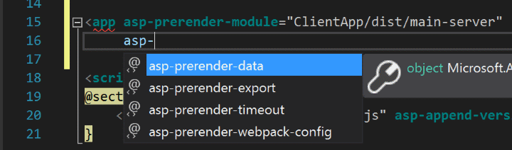

# Using SpaServices for Creating Single Page Applications with ASP.NET Core

By [Scott Addie](https://github.com/scottaddie)

In this article, you will learn about the value proposition of [SpaServices](https://github.com/aspnet/JavaScriptServices/tree/dev/src/Microsoft.AspNetCore.SpaServices) in building a Single Page Application (SPA) with ASP.NET Core.

[View or download sample code](https://github.com/aspnet/Docs/tree/master/aspnetcore/client-side/spa-services/sample)

<a name="using-spa-services"></a>

## Using SpaServices with ASP.NET Core

A SPA is a very popular breed of web application due to its inherent rich user experience. Alas, integrating client-side SPA frameworks or libraries, such as [Angular](https://angular.io/) or [React](https://facebook.github.io/react/), with server-side frameworks like ASP.NET Core can be daunting. The `Microsoft.AspNetCore.SpaServices` NuGet package, or SpaServices for short, was developed to reduce friction in the integration process. It enables seamless operation between the disparate client and server technology stacks.

<a name="what-is-spa-services"></a>

## What is SpaServices?

SpaServices was created as a component of the larger [JavaScriptServices](https://github.com/aspnet/JavaScriptServices) project, whose goal is to position ASP.NET Core as developers' preferred server-side platform for building SPAs. With that said, SpaServices is not required to develop SPAs with ASP.NET Core. Because SpaServices is a nonopinionated, client framework-agnostic library, it doesn't lock you into a particular client framework, library, or coding style.

SpaServices provides useful infrastructure such as:
* [Server-side prerendering](#server-prerendering)
* [Webpack Dev Middleware](#webpack-dev-middleware)
* [Hot Module Replacement](#hot-module-replacement)
* [Routing helpers](#routing-helpers)

Collectively, these infrastructure components enhance both the development workflow and the runtime experience. Moreover, the components may be adopted in an à la carte fashion.

<a name="spa-services-prereqs"></a>

## Prerequisites for using SpaServices

To work with SpaServices, install the following:
1. [Node.js](https://nodejs.org/) (version 6 or later) with npm
    * To verify these component are installed and can be found, run the following from the command line:

    ```console
    node -v && npm -v
    ```

    > [!NOTE]
    > If you're deploying to an Azure web site, you don't need to do anything here &mdash; Node.js is already installed and available in the server environments.

1. [.NET Core SDK](https://www.microsoft.com/net/download/core) 1.0 RC4 (or later)
    * If you're on Windows, you can install Visual Studio 2017, which includes the .NET Core SDK.

<a name="server-prerendering"></a>

## Server-side prerendering

A universal (also known as isomorphic) application is a JavaScript application capable of running both on the server and the client. Angular, React, and other popular frameworks provide a universal platform for this application development style. The idea is to first render the framework components on the server via Node.js and then delegate further execution to the client.

SpaServices' ASP.NET Core [Tag Helpers](xref:mvc/views/tag-helpers/intro) simplify the implementation of server-side prerendering by invoking the JavaScript functions on the server for you.

### Prerequisites

Install the following prerequisites:
1. [Microsoft.AspNetCore.SpaServices](http://www.nuget.org/packages/Microsoft.AspNetCore.SpaServices/) NuGet package
1. [aspnet-prerendering](https://www.npmjs.com/package/aspnet-prerendering) npm package:

    ```console
    npm i -S aspnet-prerendering
    ```

### Configuration

The Tag Helpers are made discoverable via namespace registration in the project's *_ViewImports.cshtml* file:

[!code-csharp[Main](../client-side/spa-services/sample/SpaServicesSampleApp/Views/_ViewImports.cshtml?highlight=3)]

These Tag Helpers abstract away the intricacies of communicating directly with low-level APIs by leveraging an HTML-like syntax inside the Razor view:

[!code-html[Main](../client-side/spa-services/sample/SpaServicesSampleApp/Views/Home/Index.cshtml?range=5)]

> [!TIP]
> Microsoft's **[Razor Language Services](https://marketplace.visualstudio.com/items?itemName=ms-madsk.RazorLanguageServices)** extension improves Visual Studio 2017's Tag Helpers development experience by adding context-aware IntelliSense and syntax highlighting:
>
> 

### The `asp-prerender-module` Tag Helper

The `asp-prerender-module` Tag Helper, used in the preceding code example, executes *ClientApp/dist/main-server.js* on the server via Node.js. For clarity's sake, *main-server.js* file is an artifact of the [Webpack](http://webpack.github.io/) build process' TypeScript-to-JavaScript transpilation task. Webpack defines an entry point alias of `main-server`; and, traversal of the dependency graph for this alias begins at the *ClientApp/boot-server.ts* file:

[!code-javascript[Main](../client-side/spa-services/sample/SpaServicesSampleApp/webpack.config.js?range=53)]

In the following Angular example, the *ClientApp/boot-server.ts* file utilizes the `createServerRenderer` function and `RenderResult` type of the `aspnet-prerendering` npm package to configure server rendering via Node.js. The HTML markup destined for server-side rendering is passed to a `resolve` function call, which is wrapped in a JavaScript `Promise` object of type `RenderResult`. The `Promise` object's significance is that it asynchronously supplies the HTML markup to the page for injection in the DOM's placeholder element.

[!code-javascript[Main](../client-side/spa-services/sample/SpaServicesSampleApp/ClientApp/boot-server.ts?range=6,10-34,79-)]

### The `asp-prerender-data` Tag Helper

Sometimes contextual information must be passed as arguments from the Razor view to the server-side JavaScript. To satisfy this requirement, the `asp-prerender-data` Tag Helper is used in conjunction with the aforementioned `asp-prerender-module` Tag Helper. For example, the following markup passes user data to the `main-server` module:

[!code-html[Main](../client-side/spa-services/sample/SpaServicesSampleApp/Views/Home/Index.cshtml?range=9-12)]

The received `UserName` argument is serialized using the built-in JSON serializer and is stored in the `params.data` object. In the following Angular example, the data is used to construct a personalized greeting within an `h1` element:

[!code-javascript[Main](../client-side/spa-services/sample/SpaServicesSampleApp/ClientApp/boot-server.ts?range=6,10-21,38-52,79-)]

> [!NOTE]
> Property names passed in Tag Helpers are represented with **PascalCase** notation. Contrast that to JavaScript, where the same property names are represented with **camelCase**. The default JSON serialization configuration is responsible for this difference.

To expand upon the preceding code example, data can be passed from the server to the view by hydrating the `globals` property provided to the `resolve` function:

[!code-javascript[Main](../client-side/spa-services/sample/SpaServicesSampleApp/ClientApp/boot-server.ts?range=6,10-21,57-77,79-)]

The `postList` array defined inside the `globals` object is attached to the browser's global `window` object. This variable hoisting to global scope eliminates duplication of effort, particularly as it pertains to loading the same data once on the server and again on the client.


<a name="webpack-dev-middleware"></a>

## Webpack Dev Middleware

[Webpack Dev Middleware](https://webpack.github.io/docs/webpack-dev-middleware.html) introduces a streamlined development workflow whereby Webpack builds resources on demand. The middleware automatically compiles and serves client-side resources when a page is reloaded in the browser. The alternate, less efficient approach is to manually invoke Webpack via the project's npm build script when a third-party dependency or the custom code changes. An example of said build script in the `package.json` file is:

[!code-json[Main](../client-side/spa-services/sample/SpaServicesSampleApp/package.json?range=5)]

### Prerequisites

Install the following prerequisites:
1. [Microsoft.AspNetCore.SpaServices](http://www.nuget.org/packages/Microsoft.AspNetCore.SpaServices/) NuGet package
1. [aspnet-webpack](https://www.npmjs.com/package/aspnet-webpack) npm package:

    ```console
    npm i -D aspnet-webpack
    ```

### Configuration

Webpack Dev Middleware is registered into the HTTP request pipeline via the following code in the *Startup.cs* file's `Configure` method:

[!code-csharp[Main](../client-side/spa-services/sample/SpaServicesSampleApp/Startup.cs?name=webpack-middleware-registration&highlight=4)]

With regard to the `UseWebpackDevMiddleware` extension method, some critical details are:
1. It must be called before [registering static file hosting](xref:fundamentals/static-files) via the `UseStaticFiles` extension method
1. It should be registered for use only when running the application in development mode

Finally, the *webpack.config.js* file's `output.publicPath` property tells the middleware to watch the `dist` folder for changes:

[!code-javascript[Main](../client-side/spa-services/sample/SpaServicesSampleApp/webpack.config.js?range=6,13-16)]

<a name="hot-module-replacement"></a>

## Hot Module Replacement

Think of Webpack's [Hot Module Replacement](https://webpack.github.io/docs/hot-module-replacement-with-webpack.html) (HMR) feature as an evolution of [Webpack Dev Middleware](#webpack-dev-middleware). HMR introduces all the same benefits; but, it further streamlines the development workflow by automatically updating page content after compiling the changes. Don't confuse this with a refresh of the browser, which would interfere with the current in-memory state and debugging session of the SPA. There is a live link between the Webpack Dev Middleware service and the browser, which means changes are simply pushed to the browser.

### Prerequisites

Install the following prerequisites:
1. [Microsoft.AspNetCore.SpaServices](http://www.nuget.org/packages/Microsoft.AspNetCore.SpaServices/) NuGet package
1. [webpack-hot-middleware](https://www.npmjs.com/package/webpack-hot-middleware) npm package:

    ```console
    npm i -D webpack-hot-middleware
    ```

### Configuration

The HMR component must be registered into MVC's HTTP request pipeline. An overload of the `UseWebpackDevMiddleware` extension method must be used in the `Startup` class' `Configure` method:

```csharp
app.UseWebpackDevMiddleware(new WebpackDevMiddlewareOptions {
    HotModuleReplacement = true
});
```

As was true with Webpack Dev Middleware, there are a few critical points when using `UseWebpackDevMiddleware`:
1. It must be called before the `UseStaticFiles` extension method
1. It should be registered for use only when running the application in development mode

Finally, the *webpack.config.js* file must define a `plugins` array, even if it's left empty:

[!code-javascript[Main](../client-side/spa-services/sample/SpaServicesSampleApp/webpack.config.js?range=6,25)]

After loading the application in the browser, the developer tools' Console tab provides confirmation of HMR activation:


<a name="routing-helpers"></a>

## Routing helpers

In most ASP.NET Core-based SPAs, you'll want client-side routing in addition to server-side routing. The SPA and MVC routing systems can work independently without interference. There is, however, one edge case posing challenges: identifying 404 HTTP responses.

Consider the scenario in which an extensionless route of `/some/page` is used. Assume the request doesn't pattern-match a server-side route, but its pattern does match a client-side route. Now consider an incoming request for `/images/user-512.png`, which undoubtedly expects to find an image file on the server. As such, if that requested resource path doesn't match any server-side route or static file, it's unlikely that the client-side application would handle it — you probably want to return a 404 HTTP status code.

### Prerequisites

Install the following prerequisites:
1. [Microsoft.AspNetCore.SpaServices](http://www.nuget.org/packages/Microsoft.AspNetCore.SpaServices/) NuGet package
1. The client-side routing npm package. Using Angular as an example:

    ```console
    npm i -S @angular/router
    ```

### Configuration

An extension method named `MapSpaFallbackRoute` is used in the `Startup` class' `Configure` method:

[!code-csharp[Main](../client-side/spa-services/sample/SpaServicesSampleApp/Startup.cs?name=mvc-routing-table&highlight=7-9)]

> [!TIP]
> Routes are evaluated in the order in which they're configured. Consequently, the `default` route in the preceding code example will be consulted first for pattern matching.

<a name="new-project-creation"></a>

## Creating a new project

JavaScriptServices provides pre-configured application templates. SpaServices is used in these templates, in conjunction with different frameworks and libraries such as Angular, Aurelia, Knockout, React, and Vue.

These templates can be installed via the .NET Core CLI by running the following command:

```console
dotnet new --install Microsoft.AspNetCore.SpaTemplates::*
```

Upon successful installation, a list of available SPA templates is provided:

| Templates                                 | Short Name | Language | Tags        |
|:------------------------------------------|:-----------|:---------|:------------|
| MVC ASP.NET Core with Angular             | angular    | [C#]     | Web/MVC/SPA |
| MVC ASP.NET Core with Aurelia             | aurelia    | [C#]     | Web/MVC/SPA |
| MVC ASP.NET Core with Knockout.js         | knockout   | [C#]     | Web/MVC/SPA |
| MVC ASP.NET Core with React.js            | react      | [C#]     | Web/MVC/SPA |
| MVC ASP.NET Core with React.js and Redux  | reactredux | [C#]     | Web/MVC/SPA |
| MVC ASP.NET Core with Vue.js              | vue        | [C#]     | Web/MVC/SPA | 

To create a new project using one of the SPA templates, include the **Short Name** of the template in the `dotnet new` command. The following command creates an Angular application with ASP.NET Core MVC configured for the server-side:

```console
dotnet new angular
```

<a name="runtime-config-mode"></a>

### Set the runtime configuration mode

Be aware that two primary runtime configuration modes exist:
1. **Development**:
    * includes source maps to ease debugging
    * doesn't optimize the client-side code for performance
1. **Production**:
    * excludes source maps
    * optimizes the client-side code via bundling & minification

ASP.NET Core uses an environment variable named `ASPNETCORE_ENVIRONMENT` to store the configuration mode. See instructions at **[Setting the environment](xref:fundamentals/environments#setting-the-environment)** for more information.

### Running with .NET Core CLI

Restore the required NuGet and npm packages by running the following command at the project root:

```console
dotnet restore && npm i
```

Build and run the application:

```console
dotnet run
```

The application will start on localhost according to the [runtime configuration mode](#runtime-config-mode). Navigating to `http://localhost:5000` in the browser will display the landing page.

### Running with Visual Studio 2017

Open the *.csproj* file generated by the `dotnet new` command. The required NuGet and npm packages will be restored automatically upon project open. This restoration process may take up to a few minutes; and, the application is ready to run when it completes. Click the green run button or press `Ctrl` + `F5`, and the browser opens to the application's landing page. The application will be running on localhost according to the [runtime configuration mode](#runtime-config-mode). 

<a name="app-testing"></a>

## Testing the application

SpaServices templates are pre-configured to run client-side tests using [Karma](https://karma-runner.github.io/1.0/index.html) and [Jasmine](https://jasmine.github.io/). Jasmine is a popular unit testing framework for JavaScript, whereas Karma is a test runner for those tests. Karma is configured to work with the [Webpack Dev Middleware](#webpack-dev-middleware) such that you don’t have to stop and run the test every time changes are made. Whether it's the code running against the test case or the test case itself, the test will run automatically.

Using the Angular application as an example, two Jasmine test cases are already provided for the `CounterComponent` in the *counter.component.spec.ts* file:

[!code-javascript[Main](../client-side/spa-services/sample/SpaServicesSampleApp/ClientApp/app/components/counter/counter.component.spec.ts?range=15-28)]

Open the command prompt at the project root, and run the following command:

```console
npm test
```

The script launches the Karma test runner, which reads the settings defined in the *karma.conf.js* file. Amongst other settings, the *karma.conf.js* identifies the test files to be executed via its `files` array:

[!code-javascript[Main](../client-side/spa-services/sample/SpaServicesSampleApp/ClientApp/test/karma.conf.js?range=4-5,8-11)]

<a name="app-publishing"></a>

## Publishing the application

Without SpaServices, packaging up the appropriate client-side assets with the published ASP.NET Core assets can be cumbersome. SpaServices includes a custom MSBuild target named `RunWebpack`: 

[!code-xml[Main](../client-side/spa-services/sample/SpaServicesSampleApp/SpaServicesSampleApp.csproj?range=31-45)]

The target has the following responsibilities:
1. Restore the npm packages
1. Create a production-grade build of the third-party, client-side code
1. Create a production-grade build of the custom client-side code
1. Copy the Webpack-generated assets to the publish folder

## Additional resources

* [Angular Docs](https://angular.io/docs)