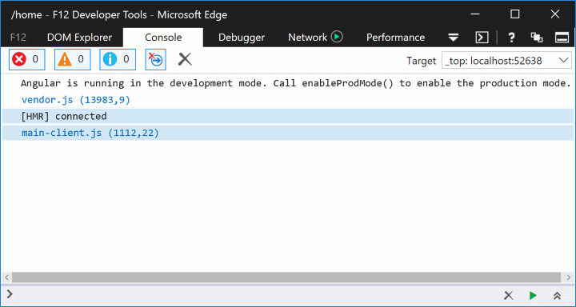

# Use JavaScript Services to Create Single Page Applications in ASP.NET Core

By [Scott Addie](https://github.com/scottaddie) and [Fiyaz Hasan](https://fiyazhasan.me/)

A Single Page Application (SPA) is a popular type of web application due to its inherent rich user experience. Integrating client-side SPA frameworks or libraries, such as [Angular](https://angular.io/) or [React](https://facebook.github.io/react/), with server-side frameworks such as ASP.NET Core can be difficult. JavaScript Services was developed to reduce friction in the integration process. It enables seamless operation between the different client and server technology stacks.

:::moniker range=">= aspnetcore-3.0"

> [!WARNING]
> The features described in this article are obsolete as of ASP.NET Core 3.0. A simpler SPA frameworks integration mechanism is available in the [Microsoft.AspNetCore.SpaServices.Extensions](https://www.nuget.org/packages/Microsoft.AspNetCore.SpaServices.Extensions) NuGet package. For more information, see [[Announcement] Obsoleting Microsoft.AspNetCore.SpaServices and Microsoft.AspNetCore.NodeServices](https://github.com/dotnet/AspNetCore/issues/12890).

:::moniker-end

## What is JavaScript Services

JavaScript Services is a collection of client-side technologies for ASP.NET Core. Its goal is to position ASP.NET Core as developers' preferred server-side platform for building SPAs.

JavaScript Services consists of two distinct NuGet packages:

* [Microsoft.AspNetCore.NodeServices](https://www.nuget.org/packages/Microsoft.AspNetCore.NodeServices/) (NodeServices)
* [Microsoft.AspNetCore.SpaServices](https://www.nuget.org/packages/Microsoft.AspNetCore.SpaServices/) (SpaServices)

These packages are useful in the following scenarios:

* Run JavaScript on the server
* Use a SPA framework or library
* Build client-side assets with Webpack

Much of the focus in this article is placed on using the SpaServices package.

## What is SpaServices

SpaServices was created to position ASP.NET Core as developers' preferred server-side platform for building SPAs. SpaServices isn't required to develop SPAs with ASP.NET Core, and it doesn't lock developers into a particular client framework.

SpaServices provides useful infrastructure such as:

* [Server-side prerendering](#server-side-prerendering)
* [Webpack Dev Middleware](#webpack-dev-middleware)
* [Hot Module Replacement](#hot-module-replacement)
* [Routing helpers](#routing-helpers)

Collectively, these infrastructure components enhance both the development workflow and the runtime experience. The components can be adopted individually.

## Prerequisites for using SpaServices

To work with SpaServices, install the following:

* [Node.js](https://nodejs.org/) (version 6 or later) with npm

  * To verify these components are installed and can be found, run the following from the command line:

    ```console
    node -v && npm -v
    ```

  * If deploying to an Azure web site, no action is required&mdash;Node.js is installed and available in the server environments.

* [!INCLUDE [](~/includes/net-core-sdk-download-link.md)]

  * On Windows using Visual Studio 2017, the SDK is installed by selecting the **.NET Core cross-platform development** workload.

* [Microsoft.AspNetCore.SpaServices](https://www.nuget.org/packages/Microsoft.AspNetCore.SpaServices/) NuGet package

## Server-side prerendering

A universal (also known as isomorphic) application is a JavaScript application capable of running both on the server and the client. Angular, React, and other popular frameworks provide a universal platform for this application development style. The idea is to first render the framework components on the server via Node.js, and then delegate further execution to the client.

ASP.NET Core [Tag Helpers](xref:mvc/views/tag-helpers/intro) provided by SpaServices simplify the implementation of server-side prerendering by invoking the JavaScript functions on the server.

### Server-side prerendering prerequisites

Install the [aspnet-prerendering](https://www.npmjs.com/package/aspnet-prerendering) npm package:

```console
npm i -S aspnet-prerendering
```

### Server-side prerendering configuration

The Tag Helpers are made discoverable via namespace registration in the project's `_ViewImports.cshtml` file:

[!code-cshtml[](../client-side/spa-services/sample/SpaServicesSampleApp/Views/_ViewImports.cshtml?highlight=3)]

These Tag Helpers abstract away the intricacies of communicating directly with low-level APIs by leveraging an HTML-like syntax inside the Razor view:

[!code-cshtml[](../client-side/spa-services/sample/SpaServicesSampleApp/Views/Home/Index.cshtml?range=5)]

### asp-prerender-module Tag Helper

The `asp-prerender-module` Tag Helper, used in the preceding code example, executes `ClientApp/dist/main-server.js` on the server via Node.js. For clarity's sake, `main-server.js` file is an artifact of the TypeScript-to-JavaScript transpilation task in the [Webpack](https://webpack.github.io/) build process. Webpack defines an entry point alias of `main-server`; and, traversal of the dependency graph for this alias begins at the `ClientApp/boot-server.ts` file:

[!code-javascript[](../client-side/spa-services/sample/SpaServicesSampleApp/webpack.config.js?range=53)]

In the following Angular example, the `ClientApp/boot-server.ts` file utilizes the `createServerRenderer` function and `RenderResult` type of the `aspnet-prerendering` npm package to configure server rendering via Node.js. The HTML markup destined for server-side rendering is passed to a resolve function call, which is wrapped in a strongly-typed JavaScript `Promise` object. The `Promise` object's significance is that it asynchronously supplies the HTML markup to the page for injection in the DOM's placeholder element.

[!code-typescript[](../client-side/spa-services/sample/SpaServicesSampleApp/ClientApp/boot-server.ts?range=6,10-34,79-)]

### asp-prerender-data Tag Helper

When coupled with the `asp-prerender-module` Tag Helper, the `asp-prerender-data` Tag Helper can be used to pass contextual information from the Razor view to the server-side JavaScript. For example, the following markup passes user data to the `main-server` module:

[!code-cshtml[](../client-side/spa-services/sample/SpaServicesSampleApp/Views/Home/Index.cshtml?range=9-12)]

The received `UserName` argument is serialized using the built-in JSON serializer and is stored in the `params.data` object. In the following Angular example, the data is used to construct a personalized greeting within an `h1` element:

[!code-typescript[](../client-side/spa-services/sample/SpaServicesSampleApp/ClientApp/boot-server.ts?range=6,10-21,38-52,79-)]

Property names passed in Tag Helpers are represented with **PascalCase** notation. Contrast that to JavaScript, where the same property names are represented with **camelCase**. The default JSON serialization configuration is responsible for this difference.

To expand upon the preceding code example, data can be passed from the server to the view by hydrating the `globals` property provided to the `resolve` function:

[!code-typescript[](../client-side/spa-services/sample/SpaServicesSampleApp/ClientApp/boot-server.ts?range=6,10-21,57-77,79-)]

The `postList` array defined inside the `globals` object is attached to the browser's global `window` object. This variable hoisting to global scope eliminates duplication of effort, particularly as it pertains to loading the same data once on the server and again on the client.


## Webpack Dev Middleware

[Webpack Dev Middleware](https://webpack.js.org/guides/development/#using-webpack-dev-middleware) introduces a streamlined development workflow whereby Webpack builds resources on demand. The middleware automatically compiles and serves client-side resources when a page is reloaded in the browser. The alternate approach is to manually invoke Webpack via the project's npm build script when a third-party dependency or the custom code changes. An npm build script in the `package.json` file is shown in the following example:

```json
"build": "npm run build:vendor && npm run build:custom",
```

### Webpack Dev Middleware prerequisites

Install the [aspnet-webpack](https://www.npmjs.com/package/aspnet-webpack) npm package:

```console
npm i -D aspnet-webpack
```

### Webpack Dev Middleware configuration

Webpack Dev Middleware is registered into the HTTP request pipeline via the following code in the `Startup.cs` file's `Configure` method:

[!code-csharp[](../client-side/spa-services/sample/SpaServicesSampleApp/Startup.cs?name=snippet_WebpackMiddlewareRegistration&highlight=4)]

The `UseWebpackDevMiddleware` extension method must be called before [registering static file hosting](xref:fundamentals/static-files) via the `UseStaticFiles` extension method. For security reasons, register the middleware only when the app runs in development mode.

The `webpack.config.js` file's `output.publicPath` property tells the middleware to watch the `dist` folder for changes:

[!code-javascript[](../client-side/spa-services/sample/SpaServicesSampleApp/webpack.config.js?range=6,13-16)]

## Hot Module Replacement

Think of Webpack's [Hot Module Replacement](https://webpack.js.org/concepts/hot-module-replacement/) (HMR) feature as an evolution of [Webpack Dev Middleware](#webpack-dev-middleware). HMR introduces all the same benefits, but it further streamlines the development workflow by automatically updating page content after compiling the changes. Don't confuse this with a refresh of the browser, which would interfere with the current in-memory state and debugging session of the SPA. There's a live link between the Webpack Dev Middleware service and the browser, which means changes are pushed to the browser.

### Hot Module Replacement prerequisites

Install the [webpack-hot-middleware](https://www.npmjs.com/package/webpack-hot-middleware) npm package:

```console
npm i -D webpack-hot-middleware
```

### Hot Module Replacement configuration

The HMR component must be registered into MVC's HTTP request pipeline in the `Configure` method:

```csharp
app.UseWebpackDevMiddleware(new WebpackDevMiddlewareOptions {
    HotModuleReplacement = true
});
```

As was true with [Webpack Dev Middleware](#webpack-dev-middleware), the `UseWebpackDevMiddleware` extension method must be called before the `UseStaticFiles` extension method. For security reasons, register the middleware only when the app runs in development mode.

The `webpack.config.js` file must define a `plugins` array, even if it's left empty:

[!code-javascript[](../client-side/spa-services/sample/SpaServicesSampleApp/webpack.config.js?range=6,25)]

After loading the app in the browser, the developer tools' Console tab provides confirmation of HMR activation:



## Routing helpers

In most ASP.NET Core-based SPAs, client-side routing is often desired in addition to server-side routing. The SPA and MVC routing systems can work independently without interference. There's, however, one edge case posing challenges: identifying 404 HTTP responses.

Consider the scenario in which an extensionless route of `/some/page` is used. Assume the request doesn't pattern-match a server-side route, but its pattern does match a client-side route. Now consider an incoming request for `/images/user-512.png`, which generally expects to find an image file on the server. If that requested resource path doesn't match any server-side route or static file, it's unlikely that the client-side application would handle it&mdash;generally returning a 404 HTTP status code is desired.

### Routing helpers prerequisites

Install the client-side routing npm package. Using Angular as an example:

```console
npm i -S @angular/router
```

### Routing helpers configuration

An extension method named `MapSpaFallbackRoute` is used in the `Configure` method:

[!code-csharp[](../client-side/spa-services/sample/SpaServicesSampleApp/Startup.cs?name=snippet_MvcRoutingTable&highlight=7-9)]

Routes are evaluated in the order in which they're configured. Consequently, the `default` route in the preceding code example is used first for pattern matching.

## Create a new project

JavaScript Services provide pre-configured application templates. SpaServices is used in these templates in conjunction with different frameworks and libraries such as Angular, React, and Redux.

These templates can be installed via the .NET Core CLI by running the following command:

```dotnetcli
dotnet new --install Microsoft.AspNetCore.SpaTemplates::*
```

A list of available SPA templates is displayed:

| Templates                                 | Short Name | Language | Tags        |
| ------------------------------------------| :--------: | :------: | :---------: |
| MVC ASP.NET Core with Angular             | angular    | [C#]     | Web/MVC/SPA |
| MVC ASP.NET Core with React.js            | react      | [C#]     | Web/MVC/SPA |
| MVC ASP.NET Core with React.js and Redux  | reactredux | [C#]     | Web/MVC/SPA |

To create a new project using one of the SPA templates, include the **Short Name** of the template in the [dotnet new](/dotnet/core/tools/dotnet-new) command. The following command creates an Angular application with ASP.NET Core MVC configured for the server side:

```dotnetcli
dotnet new angular
```

### Set the runtime configuration mode

Two primary runtime configuration modes exist:

* **Development**:
  * Includes source maps to ease debugging.
  * Doesn't optimize the client-side code for performance.
* **Production**:
  * Excludes source maps.
  * Optimizes the client-side code via bundling and minification.

ASP.NET Core uses an environment variable named `ASPNETCORE_ENVIRONMENT` to store the configuration mode. For more information, see [Set the environment](xref:fundamentals/environments#set-the-environment).

### Run with .NET Core CLI

Restore the required NuGet and npm packages by running the following command at the project root:

```dotnetcli
dotnet restore && npm i
```

Build and run the application:

```dotnetcli
dotnet run
```

The application starts on localhost according to the [runtime configuration mode](#set-the-runtime-configuration-mode). Navigating to `http://localhost:5000` in the browser displays the landing page.

### Run with Visual Studio 2017

Open the `.csproj` file generated by the [dotnet new](/dotnet/core/tools/dotnet-new) command. The required NuGet and npm packages are restored automatically upon project open. This restoration process may take up to a few minutes, and the application is ready to run when it completes. Click the green run button or press `Ctrl + F5`, and the browser opens to the application's landing page. The application runs on localhost according to the [runtime configuration mode](#set-the-runtime-configuration-mode).

## Test the app

SpaServices templates are pre-configured to run client-side tests using [Karma](https://karma-runner.github.io/1.0/index.html) and [Jasmine](https://jasmine.github.io/). Jasmine is a popular unit testing framework for JavaScript, whereas Karma is a test runner for those tests. Karma is configured to work with the [Webpack Dev Middleware](#webpack-dev-middleware) such that the developer isn't required to stop and run the test every time changes are made. Whether it's the code running against the test case or the test case itself, the test runs automatically.

Using the Angular application as an example, two Jasmine test cases are already provided for the `CounterComponent` in the `counter.component.spec.ts` file:

[!code-typescript[](../client-side/spa-services/sample/SpaServicesSampleApp/ClientApp/app/components/counter/counter.component.spec.ts?range=15-28)]

Open the command prompt in the *ClientApp* directory. Run the following command:

```console
npm test
```

The script launches the Karma test runner, which reads the settings defined in the `karma.conf.js` file. Among other settings, the `karma.conf.js` identifies the test files to be executed via its `files` array:

[!code-javascript[](../client-side/spa-services/sample/SpaServicesSampleApp/ClientApp/test/karma.conf.js?range=4-5,8-11)]

## Publish the app

See [this GitHub issue](https://github.com/dotnet/AspNetCore.Docs/issues/12474) for more information on publishing to Azure.

Combining the generated client-side assets and the published ASP.NET Core artifacts into a ready-to-deploy package can be cumbersome. Thankfully, SpaServices orchestrates that entire publication process with a custom MSBuild target named `RunWebpack`:

[!code-xml[](../client-side/spa-services/sample/SpaServicesSampleApp/SpaServicesSampleApp.csproj?range=31-45)]

The MSBuild target has the following responsibilities:

1. Restore the npm packages.
1. Create a production-grade build of the third-party, client-side assets.
1. Create a production-grade build of the custom client-side assets.
1. Copy the Webpack-generated assets to the publish folder.

The MSBuild target is invoked when running:

```dotnetcli
dotnet publish -c Release
```

## Additional resources

* [Angular Docs](https://angular.io/docs)
