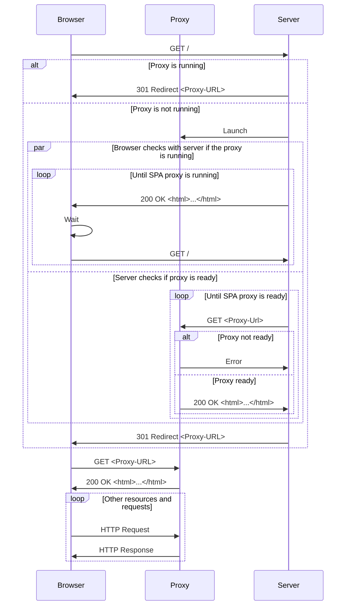

```mermaid
sequenceDiagram
participant Browser
participant Proxy
participant Server
Browser->>Server: GET /
alt Proxy is running
  Server->>Browser: 301 Redirect <Proxy-URL>
else Proxy is not running
  Server->>Proxy: Launch
  par Browser checks with server if the proxy is running
    loop Until SPA proxy is running
      Server->>Browser: 200 OK <html>...</html>
      Browser->>Browser: Wait
      Browser->>Server: GET /
    end
  and Server checks if proxy is ready
    loop Until SPA proxy is ready
      Server->>Proxy: GET <Proxy-Url>
      alt Proxy not ready
        Proxy->>Server: Error
      else Proxy ready
        Proxy->>Server: 200 OK <html>...</html>
      end
    end
  end
  Server->>Browser: 301 Redirect <Proxy-URL>
end
Browser->>Proxy: GET <Proxy-URL>
Proxy->>Browser: 200 OK <html>...</html>
loop Other resources and requests
  Browser->>Proxy: HTTP Request
  Proxy->>Browser: HTTP Response
end
```