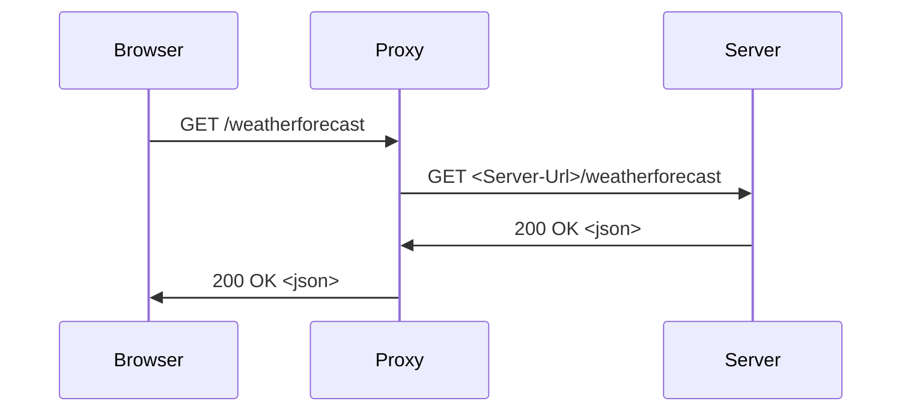

```mermaid
sequenceDiagram
participant Browser
participant Proxy
participant Server
Browser->>Proxy: GET /weatherforecast
Proxy->>Server: GET <Server-Url>/weatherforecast
Server->>Proxy: 200 OK <json> 
Proxy->>Browser: 200 OK <json> 
```