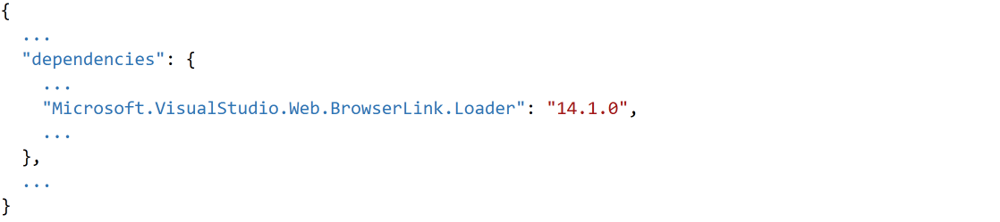
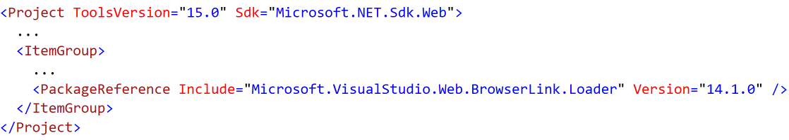
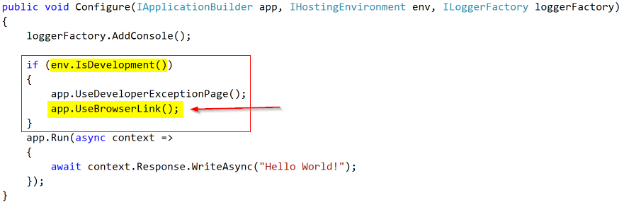

# Using Browser Link

<a name=using-browserlink></a>

By [Nicolò Carandini](https://github.com/ncarandini)

Browser Link is a feature in Visual Studio that creates a communication channel between the development environment and one or more web browsers. You can use Browser Link to refresh your web application in several browsers at once, which is useful for cross-browser testing.

## Browser Link setup

The Browser Link feature is available since Visual Studio 2013, and the Visual Studio 2015 and Visual Studio 2017 templates for ASP.NET Core _Web application_ projects include all the things needed to make it works.

But if you choose the _Empty_ template or the _Web API_ template, and you later decide to add the _Web Application_ functionalities it's good to know that to enable the browser link feature you need only to:
1. Add the Microsoft.VisualStudio.Web.BrowserLink.Loader package 
2. Add the configuration code in the Startup.cs file.

### _Add the package_

Since we are using a Visual Studio feature, the easiest way to add the package is to open the Package Manager Console (View >> Other Windows >> Package Manager Console) and type:

`install-package Microsoft.VisualStudio.Web.BrowserLink.Loader`

Alternatively, you can right click on the project name in the Solution Explorer to open the Nuget Package Manager:


and add the package frome there:


You can also manually edit the project.json file:



or manually edit the .csproj file if you are using the new project type:



### _Add the configuration code_

Open the `Startup.cs` file and in the `Configure` method add the following code:

```csharp
app.UseBrowserLink();
```

Usually that code is nested inside an `if` block controlled by an `env.IsDevelopment()` predicate to enable the browser link only when debugging, as shown here:



For more information, see [Working with Multiple Environments](../fundamentals/environments.md).

## Use the Browser Link

When creating or opening an ASP.NET Core Web Application, Visual Studio shows the _Browser Link toolbar control_ right after the _Debug Target toolbar control_ (the F5 command), as shown here:


From the  _Browser Link toolbar control_ you can:

- Refresh the web application in several browsers at once
- Open the Browser Link Dashboard
- Enable or disable the Browser Link
- Enable or disable the CSS Auto-Sync

> [!NOTE]
> Some Visual Studio Plugins, most notabily the Web Extensions for Visual Studio 2015, offer extended functionalities for the Browser Link, but actually none of these work with ASP.NET Core project. When available we will update this page with more info.

### _Refresh the web application in several browsers at once_

We can choose the web browser to launch when starting the project on the _Debug Target toolbar control_ dropdown menu:


We can also open multiple browsers at once with the _Browse with..._ command of the same dropdown, selecting multiple browser with CTRL-click and then start debugging clicking the _Browse_ button:


Here is a sample screenshot of Visual Studio with two open browsers, showing the index view:


if we hoover over the _Browser Link toolbar control_ we can see that we have the two browser linked with the project:


Now, changing the text in the index view and clicking the _Browser Link toolbar control_ refresh button force the update of the browsers content without the need to restart the app:


### _Enable and disable the Browser Link_

If for any reason you disable the Browser Link from the _Browser Link toolbar control_ dropdown menu command, and later on you want to enable it again, please note that you have to refresh each browser to reconnect the Browser Link.

### _Enable or disable the CSS Auto-Sync_

When the CSS Auto-Sync is enabled, any change to the project CSS files is syncronized with the connected browsers.

## How it works?

You may have noted, from the above images, that even if we started the two browsers and the web app under IIS Explorer, we don't need to have a running debugging session to use the browser link features.

So how the two browsers are linked to the project file changes ?

Browser Link uses SignalR to create a communication channel between Visual Studio and the browser. When Browser Link is enabled, Visual Studio acts as a SignalR server that multiple clients (browsers) can connect to. Browser Link also registers a middleware component in the ASP.NET request pipeline. This component injects special `<script>` references into every page request from the server. You can see the script references by selecting “View source” in the browser and scrolling near to the end of the `<body>` tag content:

```javascript
    <!-- Visual Studio Browser Link -->
    <script type="application/json" id="__browserLink_initializationData">
        {"requestId":"a717d5a07c1741949a7cefd6fa2bad08","requestMappingFromServer":false}
    </script>
    <script type="text/javascript" src="http://localhost:54139/b6e36e429d034f578ebccd6a79bf19bf/browserLink" async="async"></script>
    <!-- End Browser Link -->
</body>
</html>
```

Your source files are not modified. The middleware component injects the script references dynamically. Because the browser-side code is all JavaScript, it works on all browsers that SignalR supports, without requiring any browser plug-in.

> [!NOTE]
> This article borrow the structure and some (revisited and updated when needed) text from the original [Using Browser Link in Visual Studio 2013](https://www.asp.net/visual-studio/overview/2013/using-browser-link) article written by Mike Wasson.