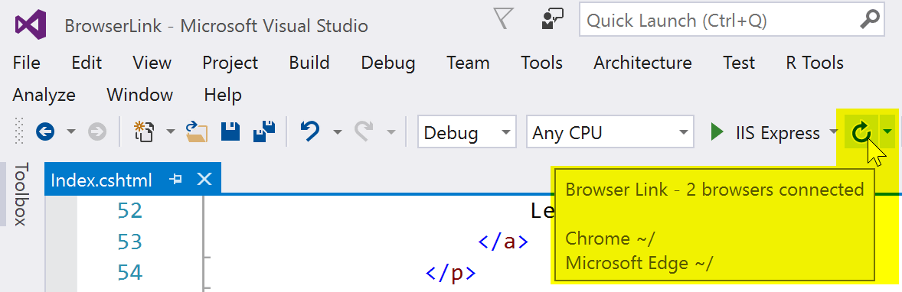

# Browser Link in ASP.NET Core 

By [Nicolò Carandini](https://github.com/ncarandini), [Mike Wasson](https://github.com/MikeWasson), and [Tom Dykstra](https://github.com/tdykstra)

Browser Link is a feature in Visual Studio that creates a communication channel between the development environment and one or more web browsers. You can use Browser Link to refresh your web application in several browsers at once, which is useful for cross-browser testing.

## Browser Link setup

# [ASP.NET Core 2.x](#tab/aspnetcore2x)

The ASP.NET Core 2.x **Web Application**, **Empty**, and **Web API** template projects use the [Microsoft.AspNetCore.All](https://www.nuget.org/packages/Microsoft.AspNetCore.All/) meta-package, which contains a package reference for [Microsoft.VisualStudio.Web.BrowserLink](https://www.nuget.org/packages/Microsoft.VisualStudio.Web.BrowserLink/). Therefore, using the `Microsoft.AspNetCore.All` meta-package requires no further action to make Browser Link available for use.

# [ASP.NET Core 1.x](#tab/aspnetcore1x)

The ASP.NET Core 1.x **Web Application** project template has a package reference for the [Microsoft.VisualStudio.Web.BrowserLink](https://www.nuget.org/packages/Microsoft.VisualStudio.Web.BrowserLink/) package. The **Empty** or **Web API** template projects require you to add a package reference to `Microsoft.VisualStudio.Web.BrowserLink`.

Since this is a Visual Studio feature, the easiest way to add the package to an **Empty** or **Web API** template project is to open the **Package Manager Console** (**View** > **Other Windows** > **Package Manager Console**) and run the following command:

```console
install-package Microsoft.VisualStudio.Web.BrowserLink
```

Alternatively, you can use **NuGet Package Manager**. Right-click the project name in **Solution Explorer** and choose **Manage NuGet Packages**:


Find and install the package:


---

### Configuration

In the `Configure` method of the *Startup.cs* file:

```csharp
app.UseBrowserLink();
```

Usually the code is inside an `if` block that only enables Browser Link in the Development environment, as shown here:

```csharp
if (env.IsDevelopment())
{
    app.UseDeveloperExceptionPage();
    app.UseBrowserLink();
}
```

For more information, see [Working with Multiple Environments](xref:fundamentals/environments).

## How to use Browser Link

When you have an ASP.NET Core project open, Visual Studio shows the Browser Link toolbar control next to the **Debug Target** toolbar control:


From the Browser Link toolbar control, you can:

* Refresh the web application in several browsers at once.
* Open the **Browser Link Dashboard**.
* Enable or disable **Browser Link**. Note: Browser Link is disabled by default in Visual Studio 2017 (15.3).
* Enable or disable [CSS Auto-Sync](#enable-or-disable-css-auto-sync).

> [!NOTE]
> Some Visual Studio plug-ins, most notably *Web Extension Pack 2015* and *Web Extension Pack 2017*, offer extended functionality for Browser Link, but some of the additional features don't work with ASP.NET Core projects.

## Refresh the web application in several browsers at once

To choose a single web browser to launch when starting the project, use the drop-down menu in the **Debug Target** toolbar control:


To open multiple browsers at once, choose **Browse with...** from the same drop-down. Hold down the CTRL key to select the browsers you want, and then click **Browse**:


Here's a screenshot showing Visual Studio with the Index view open and two open browsers:


Hover over the Browser Link toolbar control to see the browsers that are connected to the project:



Change the Index view, and all connected browsers are updated when you click the Browser Link refresh button:


Browser Link also works with browsers that you launch from outside Visual Studio and navigate to the application URL.

### The Browser Link Dashboard

Open the Browser Link Dashboard from the Browser Link drop down menu to manage the connection with open browsers:


If no browser is connected, you can start a non-debugging session by selecting the *View in Browser* link:


Otherwise, the connected browsers are shown with the path to the page that each browser is showing:


If you like, you can click on a listed browser name to refresh that single browser.

### Enable or disable Browser Link

When you re-enable Browser Link after disabling it, you must refresh the browsers to reconnect them.

### Enable or disable CSS Auto-Sync

When CSS Auto-Sync is enabled, connected browsers are automatically refreshed when you make any change to CSS files.

## How does it work?

Browser Link uses SignalR to create a communication channel between Visual Studio and the browser. When Browser Link is enabled, Visual Studio acts as a SignalR server that multiple clients (browsers) can connect to. Browser Link also registers a middleware component in the ASP.NET request pipeline. This component injects special `<script>` references into every page request from the server. You can see the script references by selecting **View source** in the browser and scrolling to the end of the `<body>` tag content:

```javascript
    <!-- Visual Studio Browser Link -->
    <script type="application/json" id="__browserLink_initializationData">
        {"requestId":"a717d5a07c1741949a7cefd6fa2bad08","requestMappingFromServer":false}
    </script>
    <script type="text/javascript" src="http://localhost:54139/b6e36e429d034f578ebccd6a79bf19bf/browserLink" async="async"></script>
    <!-- End Browser Link -->
</body>
```

Your source files aren't modified. The middleware component injects the script references dynamically. 

Because the browser-side code is all JavaScript, it works on all browsers that SignalR supports without requiring a browser plug-in.
