# Use Grunt in ASP.NET Core

Grunt is a JavaScript task runner that automates script minification, TypeScript compilation, code quality "lint" tools, CSS pre-processors, and just about any repetitive chore that needs doing to support client development. Grunt is fully supported in Visual Studio.

This example uses an empty ASP.NET Core project as its starting point, to show how to automate the client build process from scratch.

The finished example cleans the target deployment directory, combines JavaScript files, checks code quality, condenses JavaScript file content and deploys to the root of your web application. We will use the following packages:

* **grunt**: The Grunt task runner package.

* **grunt-contrib-clean**: A plugin that removes files or directories.

* **grunt-contrib-jshint**: A plugin that reviews JavaScript code quality.

* **grunt-contrib-concat**: A plugin that joins files into a single file.

* **grunt-contrib-uglify**: A plugin that minifies JavaScript to reduce size.

* **grunt-contrib-watch**: A plugin that watches file activity.

## Preparing the application

To begin, set up a new empty web application and add TypeScript example files. TypeScript files are automatically compiled into JavaScript using default Visual Studio settings and will be our raw material to process using Grunt.

1. In Visual Studio, create a new `ASP.NET Web Application`.

2. In the **New ASP.NET Project** dialog, select the ASP.NET Core **Empty** template and click the OK button.

3. In the Solution Explorer, review the project structure. The `\src` folder includes empty `wwwroot` and `Dependencies` nodes.

    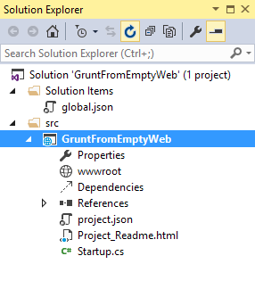

4. Add a new folder named `TypeScript` to your project directory.

5. Before adding any files, make sure that Visual Studio has the option 'compile on save' for TypeScript files checked. Navigate to **Tools** > **Options** > **Text Editor** > **Typescript** > **Project**:

    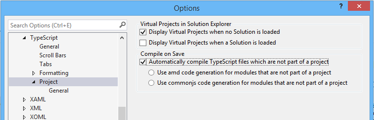

6. Right-click the `TypeScript` directory and select **Add > New Item** from the context menu. Select the **JavaScript file** item and name the file `Tastes.ts` (note the \*.ts extension). Copy the line of TypeScript code below into the file (when you save, a new `Tastes.js` file will appear with the JavaScript source).

    ```typescript
    enum Tastes { Sweet, Sour, Salty, Bitter }
    ```

7. Add a second file to the **TypeScript** directory and name it `Food.ts`. Copy the code below into the file.

    ```typescript
    class Food {
      constructor(name: string, calories: number) {
        this._name = name;
        this._calories = calories;
      }

      private _name: string;
      get Name() {
        return this._name;
      }

      private _calories: number;
      get Calories() {
        return this._calories;
      }

      private _taste: Tastes;
      get Taste(): Tastes { return this._taste }
      set Taste(value: Tastes) {
        this._taste = value;
      }
    }
    ```

## Configuring NPM

Next, configure NPM to download grunt and grunt-tasks.

1. In the Solution Explorer, right-click the project and select **Add > New Item** from the context menu. Select the **NPM configuration file** item, leave the default name, `package.json`, and click the **Add** button.

2. In the `package.json` file, inside the `devDependencies` object braces, enter "grunt". Select `grunt` from the Intellisense list and press the Enter key. Visual Studio will quote the grunt package name, and add a colon. To the right of the colon, select the latest stable version of the package from the top of the Intellisense list (press `Ctrl-Space` if Intellisense doesn't appear).

    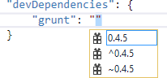

    > [!NOTE]
    > NPM uses [semantic versioning](https://semver.org/) to organize dependencies. Semantic versioning, also known as SemVer, identifies packages with the numbering scheme \<major>.\<minor>.\<patch>. Intellisense simplifies semantic versioning by showing only a few common choices. The top item in the Intellisense list (0.4.5 in the example above) is considered the latest stable version of the package. The caret (^) symbol matches the most recent major version and the tilde (~) matches the most recent minor version. See the [NPM semver version parser reference](https://www.npmjs.com/package/semver) as a guide to the full expressivity that SemVer provides.

3. Add more dependencies to load grunt-contrib-\* packages for *clean*, *jshint*, *concat*, *uglify*, and *watch* as shown in the example below. The versions don't need to match the example.

    ```json
    "devDependencies": {
      "grunt": "0.4.5",
      "grunt-contrib-clean": "0.6.0",
      "grunt-contrib-jshint": "0.11.0",
      "grunt-contrib-concat": "0.5.1",
      "grunt-contrib-uglify": "0.8.0",
      "grunt-contrib-watch": "0.6.1"
    }
    ```

4. Save the `package.json` file.

The packages for each `devDependencies` item will download, along with any files that each package requires. You can find the package files in the *node_modules* directory by enabling the **Show All Files** button in **Solution Explorer**.

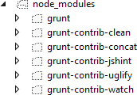

> [!NOTE]
> If you need to, you can manually restore dependencies in **Solution Explorer** by right-clicking on `Dependencies\NPM` and selecting the **Restore Packages** menu option.

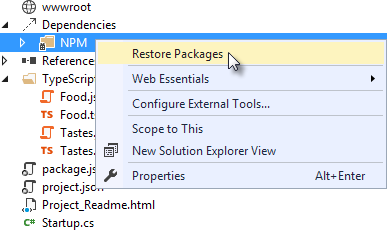

## Configuring Grunt

Grunt is configured using a manifest named `Gruntfile.js` that defines, loads and registers tasks that can be run manually or configured to run automatically based on events in Visual Studio.

1. Right-click the project and select **Add** > **New Item**. Select the **JavaScript File** item template, change the name to `Gruntfile.js`, and click the **Add** button.

1. Add the following code to `Gruntfile.js`. The `initConfig` function sets options for each package, and the remainder of the module loads and register tasks.

   ```javascript
   module.exports = function (grunt) {
     grunt.initConfig({
     });
   };
   ```

1. Inside the `initConfig` function, add options for the `clean` task as shown in the example `Gruntfile.js` below. The `clean` task accepts an array of directory strings. This task removes files from *wwwroot/lib* and removes the entire */temp* directory.

    ```javascript
    module.exports = function (grunt) {
      grunt.initConfig({
        clean: ["wwwroot/lib/*", "temp/"],
      });
    };
    ```

1. Below the `initConfig` function, add a call to `grunt.loadNpmTasks`. This will make the task runnable from Visual Studio.

    ```javascript
    grunt.loadNpmTasks("grunt-contrib-clean");
    ```

1. Save `Gruntfile.js`. The file should look something like the screenshot below.

    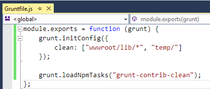

1. Right-click `Gruntfile.js` and select **Task Runner Explorer** from the context menu. The **Task Runner Explorer** window will open.

    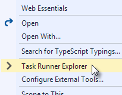

1. Verify that `clean` shows under **Tasks** in the **Task Runner Explorer**.

    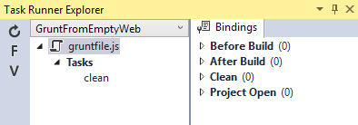

1. Right-click the clean task and select **Run** from the context menu. A command window displays progress of the task.

    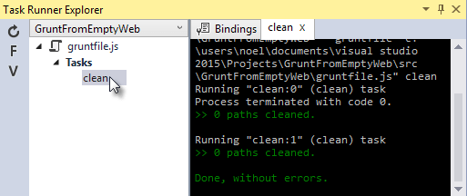

    > [!NOTE]
    > There are no files or directories to clean yet. If you like, you can manually create them in the Solution Explorer and then run the clean task as a test.

1. In the `initConfig` function, add an entry for `concat` using the code below.

    The `src` property array lists files to combine, in the order that they should be combined. The `dest` property assigns the path to the combined file that's produced.

    ```javascript
    concat: {
      all: {
        src: ['TypeScript/Tastes.js', 'TypeScript/Food.js'],
        dest: 'temp/combined.js'
      }
    },
    ```

    > [!NOTE]
    > The `all` property in the code above is the name of a target. Targets are used in some Grunt tasks to allow multiple build environments. You can view the built-in targets using IntelliSense or assign your own.

1. Add the `jshint` task using the code below.

    The jshint `code-quality` utility is run against every JavaScript file found in the *temp* directory.

    ```javascript
    jshint: {
      files: ['temp/*.js'],
      options: {
        '-W069': false,
      }
    },
    ```

    > [!NOTE]
    > The option "-W069" is an error produced by jshint when JavaScript uses bracket syntax to assign a property instead of dot notation, i.e. `Tastes["Sweet"]` instead of `Tastes.Sweet`. The option turns off the warning to allow the rest of the process to continue.

1. Add the `uglify` task using the code below.

    The task minifies the `combined.js` file found in the temp directory and creates the result file in wwwroot/lib following the standard naming convention *\<file name\>.min.js*.

    ```javascript
    uglify: {
     all: {
       src: ['temp/combined.js'],
       dest: 'wwwroot/lib/combined.min.js'
     }
    },
    ```

1. Under the call to `grunt.loadNpmTasks` that loads `grunt-contrib-clean`, include the same call for jshint, concat, and uglify using the code below.

    ```javascript
    grunt.loadNpmTasks('grunt-contrib-jshint');
    grunt.loadNpmTasks('grunt-contrib-concat');
    grunt.loadNpmTasks('grunt-contrib-uglify');
    ```

1. Save `Gruntfile.js`. The file should look something like the example below.

    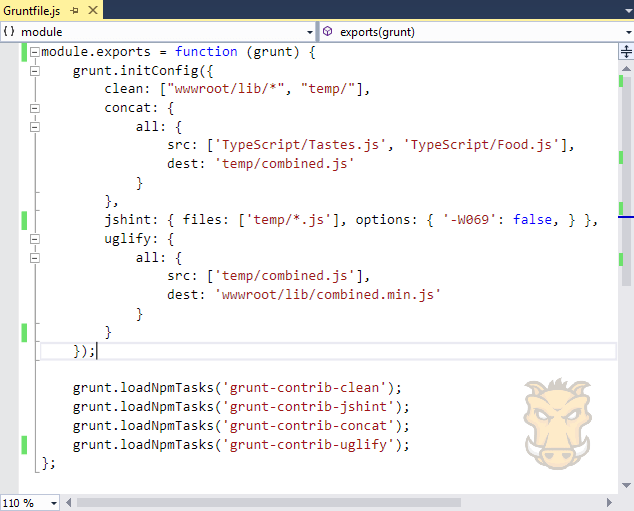

1. Notice that the **Task Runner Explorer** Tasks list includes `clean`, `concat`, `jshint` and `uglify` tasks. Run each task in order and observe the results in **Solution Explorer**. Each task should run without errors.

    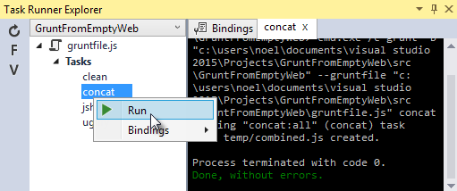

    The concat task creates a new `combined.js` file and places it into the temp directory. The `jshint` task simply runs and doesn't produce output. The `uglify` task creates a new `combined.min.js` file and places it into *wwwroot/lib*. On completion, the solution should look something like the screenshot below:

    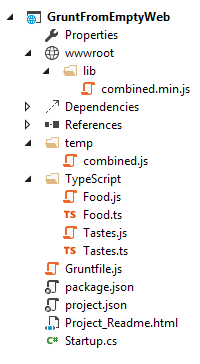

    > [!NOTE]
    > For more information on the options for each package, visit [https://www.npmjs.com/](https://www.npmjs.com/) and lookup the package name in the search box on the main page. For example, you can look up the grunt-contrib-clean package to get a documentation link that explains all of its parameters.

### All together now

Use the Grunt `registerTask()` method to run a series of tasks in a particular sequence. For example, to run the example steps above in the order clean -> concat -> jshint -> uglify, add the code below to the module. The code should be added to the same level as the loadNpmTasks() calls, outside initConfig.

```javascript
grunt.registerTask("all", ['clean', 'concat', 'jshint', 'uglify']);
```

The new task shows up in Task Runner Explorer under Alias Tasks. You can right-click and run it just as you would other tasks. The `all` task will run `clean`, `concat`, `jshint` and `uglify`, in order.

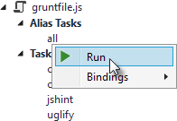

## Watching for changes

A `watch` task keeps an eye on files and directories. The watch triggers tasks automatically if it detects changes. Add the code below to initConfig to watch for changes to \*.js files in the TypeScript directory. If a JavaScript file is changed, `watch` will run the `all` task.

```javascript
watch: {
  files: ["TypeScript/*.js"],
  tasks: ["all"]
}
```

Add a call to `loadNpmTasks()` to show the `watch` task in Task Runner Explorer.

```javascript
grunt.loadNpmTasks('grunt-contrib-watch');
```

Right-click the watch task in Task Runner Explorer and select Run from the context menu. The command window that shows the watch task running will display a "Waiting…" message. Open one of the TypeScript files, add a space, and then save the file. This will trigger the watch task and trigger the other tasks to run in order. The screenshot below shows a sample run.

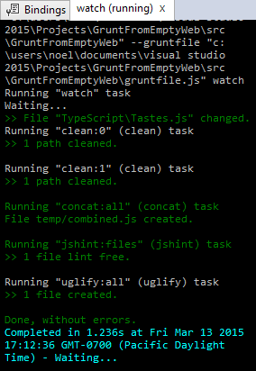

## Binding to Visual Studio events

Unless you want to manually start your tasks every time you work in Visual Studio, bind tasks to **Before Build**, **After Build**, **Clean**, and **Project Open** events.

Bind `watch` so that it runs every time Visual Studio opens. In Task Runner Explorer, right-click the watch task and select **Bindings** > **Project Open** from the context menu.


Unload and reload the project. When the project loads again, the watch task starts running automatically.

## Summary

Grunt is a powerful task runner that can be used to automate most client-build tasks. Grunt leverages NPM to deliver its packages, and features tooling integration with Visual Studio. Visual Studio's Task Runner Explorer detects changes to configuration files and provides a convenient interface to run tasks, view running tasks, and bind tasks to Visual Studio events.
