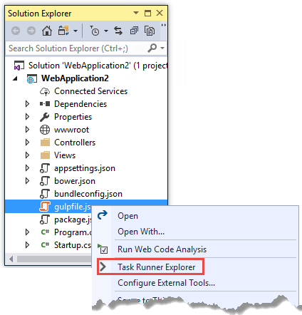
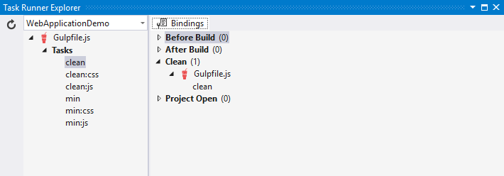
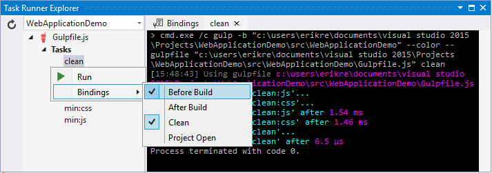
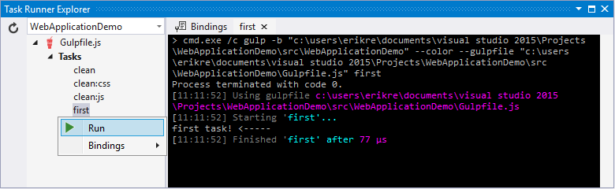
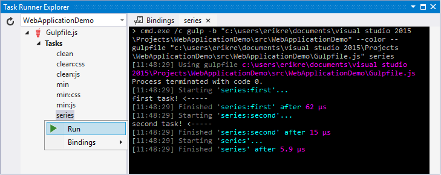
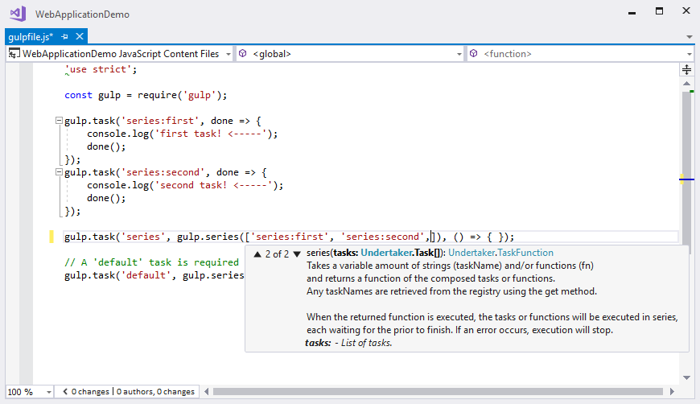

# Introduction to using Gulp in ASP.NET Core 

By [Erik Reitan](https://github.com/Erikre), [Scott Addie](https://scottaddie.com), [Daniel Roth](https://github.com/danroth27), and [Shayne Boyer](https://twitter.com/spboyer)

In a typical modern web application, the build process might:

* Bundle and minify JavaScript and CSS files.
* Run tools to call the bundling and minification tasks before each build.
* Compile LESS or SASS files to CSS.
* Compile CoffeeScript or TypeScript files to JavaScript.

A *task runner* is a tool which automates these routine development tasks and more. Visual Studio provides built-in support for two popular JavaScript-based task runners: [Gulp](https://gulpjs.com/) and [Grunt](using-grunt.md).

## Gulp

Gulp is a JavaScript-based streaming build toolkit for client-side code. It is commonly used to stream client-side files through a series of processes when a specific event is triggered in a build environment. For instance, Gulp can be used to automate [bundling and minification](bundling-and-minification.md) or the cleansing of a development environment before a new build.

A set of Gulp tasks is defined in *gulpfile.js*. The following JavaScript includes Gulp modules and specifies file paths to be referenced within the forthcoming tasks:

```javascript
/// <binding Clean='clean' />
"use strict";

var gulp = require("gulp"),
  rimraf = require("rimraf"),
  concat = require("gulp-concat"),
  cssmin = require("gulp-cssmin"),
  uglify = require("gulp-uglify");

var paths = {
  webroot: "./wwwroot/"
};

paths.js = paths.webroot + "js/**/*.js";
paths.minJs = paths.webroot + "js/**/*.min.js";
paths.css = paths.webroot + "css/**/*.css";
paths.minCss = paths.webroot + "css/**/*.min.css";
paths.concatJsDest = paths.webroot + "js/site.min.js";
paths.concatCssDest = paths.webroot + "css/site.min.css";
```

The above code specifies which Node modules are required. The `require` function imports each module so that the dependent tasks can utilize their features. Each of the imported modules is assigned to a variable. The modules can be located either by name or path. In this example, the modules named `gulp`, `rimraf`, `gulp-concat`, `gulp-cssmin`, and `gulp-uglify` are retrieved by name. Additionally, a series of paths are created so that the locations of CSS and JavaScript files can be reused and referenced within the tasks. The following table provides descriptions of the modules included in *gulpfile.js*.

|Module Name|Description|
|---|---|
|gulp|The Gulp streaming build system. For more information, see [gulp](https://www.npmjs.com/package/gulp).|
|rimraf|A Node deletion module. For more information, see [rimraf](https://www.npmjs.com/package/rimraf).|
|gulp-concat|A module that concatenates files based on the operating system’s newline character. For more information, see [gulp-concat](https://www.npmjs.com/package/gulp-concat).|
|gulp-cssmin|A module that minifies CSS files. For more information, see [gulp-cssmin](https://www.npmjs.com/package/gulp-cssmin).|
|gulp-uglify|A module that minifies *.js* files. For more information, see [gulp-uglify](https://www.npmjs.com/package/gulp-uglify).|

Once the requisite modules are imported, the tasks can be specified. Here there are six tasks registered, represented by the following code:

```javascript
gulp.task("clean:js", function (cb) {
  rimraf(paths.concatJsDest, cb);
});

gulp.task("clean:css", function (cb) {
  rimraf(paths.concatCssDest, cb);
});

gulp.task("clean", ["clean:js", "clean:css"]);

gulp.task("min:js", function () {
  return gulp.src([paths.js, "!" + paths.minJs], { base: "." })
    .pipe(concat(paths.concatJsDest))
    .pipe(uglify())
    .pipe(gulp.dest("."));
});

gulp.task("min:css", function () {
  return gulp.src([paths.css, "!" + paths.minCss])
    .pipe(concat(paths.concatCssDest))
    .pipe(cssmin())
    .pipe(gulp.dest("."));
});

gulp.task("min", ["min:js", "min:css"]);
```

The following table provides an explanation of the tasks specified in the code above:

|Task Name|Description|
|--- |--- |
|clean:js|A task that uses the rimraf Node deletion module to remove the minified version of the site.js file.|
|clean:css|A task that uses the rimraf Node deletion module to remove the minified version of the site.css file.|
|clean|A task that calls the `clean:js` task, followed by the `clean:css` task.|
|min:js|A task that minifies and concatenates all .js files within the js folder. The .min.js files are excluded.|
|min:css|A task that minifies and concatenates all .css files within the css folder. The .min.css files are excluded.|
|min|A task that calls the `min:js` task, followed by the `min:css` task.|

## Running default tasks

If you haven’t already created a new Web app, create a new ASP.NET Web Application project in Visual Studio.

1.  Add a new JavaScript file to your project and name it *gulpfile.js*, then copy the following code.

    ```javascript
    /// <binding Clean='clean' />
    "use strict";
    
    var gulp = require("gulp"),
      rimraf = require("rimraf"),
      concat = require("gulp-concat"),
      cssmin = require("gulp-cssmin"),
      uglify = require("gulp-uglify");
    
    var paths = {
      webroot: "./wwwroot/"
    };
    
    paths.js = paths.webroot + "js/**/*.js";
    paths.minJs = paths.webroot + "js/**/*.min.js";
    paths.css = paths.webroot + "css/**/*.css";
    paths.minCss = paths.webroot + "css/**/*.min.css";
    paths.concatJsDest = paths.webroot + "js/site.min.js";
    paths.concatCssDest = paths.webroot + "css/site.min.css";
    
    gulp.task("clean:js", function (cb) {
      rimraf(paths.concatJsDest, cb);
    });
    
    gulp.task("clean:css", function (cb) {
      rimraf(paths.concatCssDest, cb);
    });
    
    gulp.task("clean", ["clean:js", "clean:css"]);
    
    gulp.task("min:js", function () {
      return gulp.src([paths.js, "!" + paths.minJs], { base: "." })
        .pipe(concat(paths.concatJsDest))
        .pipe(uglify())
        .pipe(gulp.dest("."));
    });
    
    gulp.task("min:css", function () {
      return gulp.src([paths.css, "!" + paths.minCss])
        .pipe(concat(paths.concatCssDest))
        .pipe(cssmin())
        .pipe(gulp.dest("."));
    });
    
    gulp.task("min", ["min:js", "min:css"]);
    ```

2.  Open the *package.json* file (add if not there) and add the following.

    ```json
    {
      "devDependencies": {
        "gulp": "3.9.1",
        "gulp-concat": "2.6.1",
        "gulp-cssmin": "0.1.7",
        "gulp-uglify": "2.0.1",
        "rimraf": "2.6.1"
      }
    }
    ```

3.  In **Solution Explorer**, right-click *gulpfile.js*, and select **Task Runner Explorer**.
    
    
    
    **Task Runner Explorer** shows the list of Gulp tasks. (You might have to click the **Refresh** button that appears to the left of the project name.)
    
    

4.  Underneath **Tasks** in **Task Runner Explorer**, right-click **clean**, and select **Run** from the pop-up menu.

    

    **Task Runner Explorer** will create a new tab named **clean** and execute the clean task as it is defined in *gulpfile.js*.

5.  Right-click the **clean** task, then select **Bindings** > **Before Build**.

    

    The **Before Build** binding configures the clean task to run automatically before each build of the project.

The bindings you set up with **Task Runner Explorer** are stored in the form of a comment at the top of your *gulpfile.js* and are effective only in Visual Studio. An alternative that doesn't require Visual Studio is to configure automatic execution of gulp tasks in your *.csproj* file. For example, put this in your *.csproj* file:

```xml
<Target Name="MyPreCompileTarget" BeforeTargets="Build">
  <Exec Command="gulp clean" />
</Target>
```

Now the clean task is executed when you run the project in Visual Studio or from a command prompt using the `dotnet run` command (run `npm install` first).

## Defining and running a new task

To define a new Gulp task, modify *gulpfile.js*.

1.  Add the following JavaScript to the end of *gulpfile.js*:

    ```javascript
    gulp.task("first", function () {
      console.log('first task! <-----');
    });
    ```

    This task is named `first`, and it simply displays a string.

2.  Save *gulpfile.js*.

3.  In **Solution Explorer**, right-click *gulpfile.js*, and select *Task Runner Explorer*.

4.  In **Task Runner Explorer**, right-click **first**, and select **Run**.

    

    You’ll see that the output text is displayed. If you are interested in examples based on a common scenario, see Gulp Recipes.

## Defining and running tasks in a series

When you run multiple tasks, the tasks run concurrently by default. However, if you need to run tasks in a specific order, you must specify when each task is complete, as well as which tasks depend on the completion of another task.

1.  To define a series of tasks to run in order, replace the `first` task that you added above in *gulpfile.js* with the following:

    ```javascript
    gulp.task("series:first", function () {
      console.log('first task! <-----');
    });
 
    gulp.task("series:second", ["series:first"], function () {
      console.log('second task! <-----');
    });
 
    gulp.task("series", ["series:first", "series:second"], function () {});
    ```
 
    You now have three tasks: `series:first`, `series:second`, and `series`. The `series:second` task includes a second parameter which specifies an array of tasks to be run and completed before the `series:second` task will run.  As specified in the code above, only the `series:first` task must be completed before the `series:second` task will run.

2.  Save *gulpfile.js*.

3.  In **Solution Explorer**, right-click *gulpfile.js* and select **Task Runner Explorer** if it isn’t already open.

4.  In **Task Runner Explorer**, right-click **series** and select **Run**.

    

## IntelliSense

IntelliSense provides code completion, parameter descriptions, and other features to boost productivity and to decrease errors. Gulp tasks are written in JavaScript; therefore, IntelliSense can provide assistance while developing. As you work with JavaScript, IntelliSense lists the objects, functions, properties, and parameters that are available based on your current context. Select a coding option from the pop-up list provided by IntelliSense to complete the code.



For more information about IntelliSense, see [JavaScript IntelliSense](https://docs.microsoft.com/visualstudio/ide/javascript-intellisense).

## Development, staging, and production environments

When Gulp is used to optimize client-side files for staging and production, the processed files are saved to a local staging and production location. The *_Layout.cshtml* file uses the **environment** tag helper to provide two different versions of CSS files. One version of CSS files is for development and the other version is optimized for both staging and production. In Visual Studio 2017, when you change the **ASPNETCORE_ENVIRONMENT** environment variable to `Production`, Visual Studio will build the Web app and link to the minimized CSS files. The following markup shows the **environment** tag helpers containing link tags to the `Development` CSS files and the minified `Staging, Production` CSS files.

```html
<environment names="Development">
    <script src="~/lib/jquery/dist/jquery.js"></script>
    <script src="~/lib/bootstrap/dist/js/bootstrap.js"></script>
    <script src="~/js/site.js" asp-append-version="true"></script>
</environment>
<environment names="Staging,Production">
    <script src="https://ajax.aspnetcdn.com/ajax/jquery/jquery-2.2.0.min.js"
            asp-fallback-src="~/lib/jquery/dist/jquery.min.js"
            asp-fallback-test="window.jQuery"
            crossorigin="anonymous"
            integrity="sha384-K+ctZQ+LL8q6tP7I94W+qzQsfRV2a+AfHIi9k8z8l9ggpc8X+Ytst4yBo/hH+8Fk">
    </script>
    <script src="https://ajax.aspnetcdn.com/ajax/bootstrap/3.3.7/bootstrap.min.js"
            asp-fallback-src="~/lib/bootstrap/dist/js/bootstrap.min.js"
            asp-fallback-test="window.jQuery && window.jQuery.fn && window.jQuery.fn.modal"
            crossorigin="anonymous"
            integrity="sha384-Tc5IQib027qvyjSMfHjOMaLkfuWVxZxUPnCJA7l2mCWNIpG9mGCD8wGNIcPD7Txa">
    </script>
    <script src="~/js/site.min.js" asp-append-version="true"></script>
</environment>
```

## Switching between environments

To switch between compiling for different environments, modify the **ASPNETCORE_ENVIRONMENT** environment variable's value.

1.  In **Task Runner Explorer**, verify that the **min** task has been set to run **Before Build**.

2.  In **Solution Explorer**, right-click the project name and select **Properties**.

    The property sheet for the Web app is displayed.

3.  Click the **Debug** tab.

4.  Set the value of the **Hosting:Environment** environment variable to `Production`.

5.  Press **F5** to run the application in a browser.

6.  In the browser window, right-click the page and select **View Source** to view the HTML for the page.

    Notice that the stylesheet links point to the minified CSS files.

7.  Close the browser to stop the Web app.

8.  In Visual Studio, return to the property sheet for the Web app and change the **Hosting:Environment** environment variable back to `Development`.

9.  Press **F5** to run the application in a browser again.

10. In the browser window, right-click the page and select **View Source** to see the HTML for the page.

    Notice that the stylesheet links point to the unminified versions of the CSS files.

For more information related to environments in ASP.NET Core, see [Working with Multiple Environments](../fundamentals/environments.md).

## Task and module details

A Gulp task is registered with a function name.  You can specify dependencies if other tasks must run before the current task. Additional functions allow you to run and watch the Gulp tasks, as well as set the source (*src*) and destination (*dest*) of the files being modified. The following are the primary Gulp API functions:

|Gulp Function|Syntax|Description|
|---   |--- |--- |
|task  |`gulp.task(name[, deps], fn) { }`|The `task` function creates a task. The `name` parameter defines the name of the task. The `deps` parameter contains an array of tasks to be completed before this task runs. The `fn` parameter represents a callback function which performs the operations of the task.|
|watch |`gulp.watch(glob [, opts], tasks) { }`|The `watch` function monitors files and runs tasks when a file change occurs. The `glob` parameter is a `string` or `array` that determines which files to watch. The `opts` parameter provides additional file watching options.|
|src   |`gulp.src(globs[, options]) { }`|The `src` function provides files that match the glob value(s). The `glob` parameter is a `string` or `array` that determines which files to read. The `options` parameter provides additional file options.|
|dest  |`gulp.dest(path[, options]) { }`|The `dest` function defines a location to which files can be written. The `path` parameter is a string or function that determines the destination folder. The `options` parameter is an object that specifies output folder options.|

For additional Gulp API reference information, see [Gulp Docs API](https://github.com/gulpjs/gulp/blob/master/docs/API.md).

## Gulp recipes

The Gulp community provides Gulp [recipes](https://github.com/gulpjs/gulp/blob/master/docs/recipes/README.md). These recipes consist of Gulp tasks to address common scenarios.

## Additional resources

* [Gulp documentation](https://github.com/gulpjs/gulp/blob/master/docs/README.md)
* [Bundling and minification in ASP.NET Core](bundling-and-minification.md)
* [Using Grunt in ASP.NET Core](using-grunt.md)
