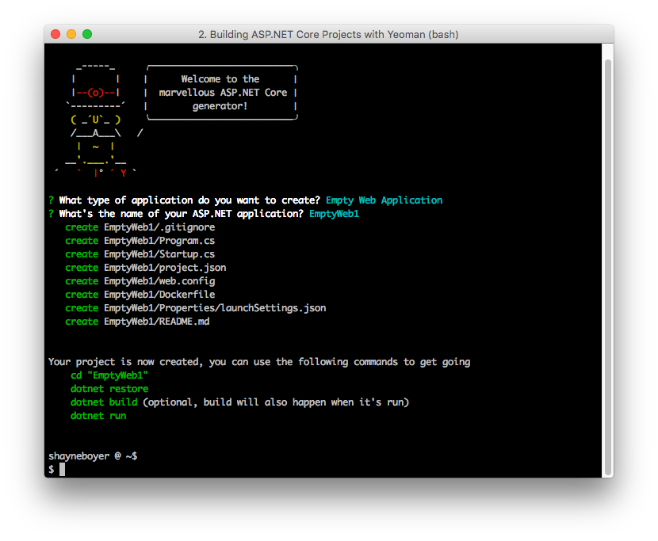
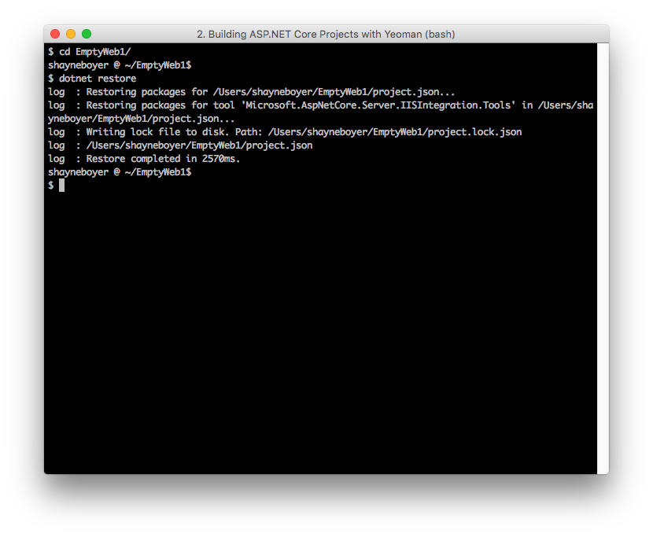
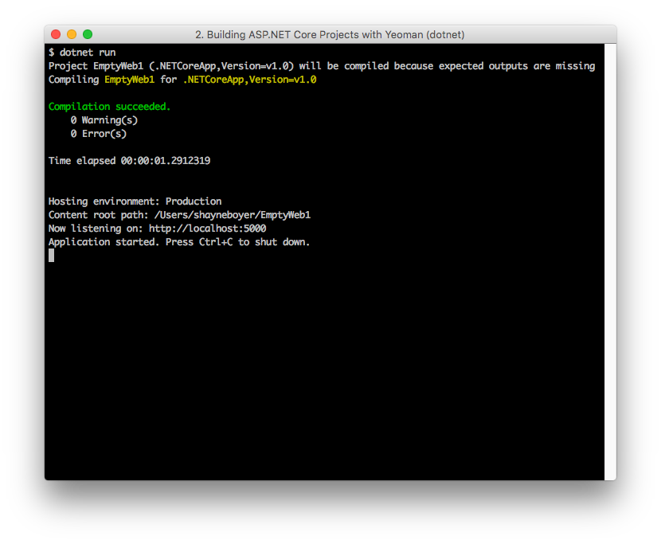
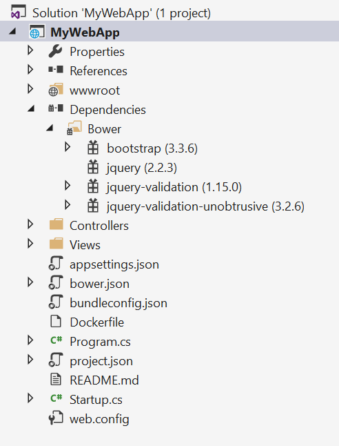
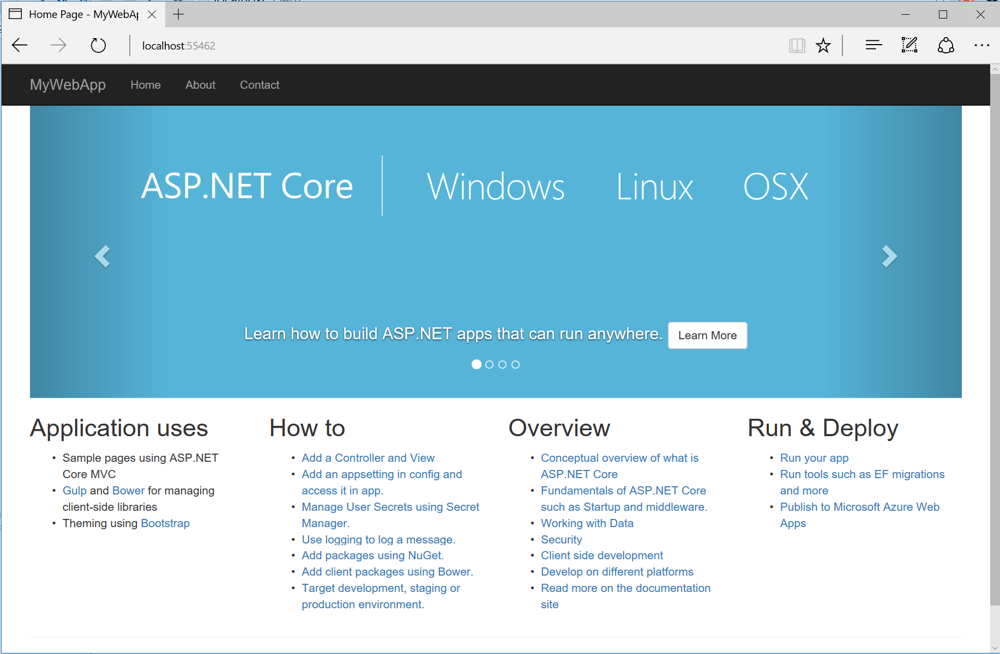

# Introduction to building projects with Yeoman in ASP.NET Core

[Yeoman](http://yeoman.io/) is a project scaffolding system for creating many kinds of applications. The Yeoman generator for ASP.NET Core contains a variety of project templates for starting a new web, MVC, or console application.

## Install Node.js, npm, and Yeoman

### Prerequisites

Node.js and npm are required for Yeoman. Download from [Node.js](https://nodejs.org/). The installer includes [Node.js](https://nodejs.org/) and [npm](https://www.npmjs.com/). Bower is also required for installing UI frameworks like Bootstrap.

To install Yeoman and Bower, run the following command:

```console
npm install -g yo bower
```

>[!Note]
>If you get the error `npm ERR! Please try running this command again as root/Administrator.` on macOS, run the following command using [sudo](https://developer.apple.com/library/mac/documentation/Darwin/Reference/ManPages/man8/sudo.8.html): `sudo npm install -g yo bower`

From a command prompt, install the ASP.NET generator:

```console
npm install -g generator-aspnet
```

> [!NOTE]
> If you get a permission error, run the command under `sudo` as described above.

The `–g` flag installs the generator globally, so that it can be used from any path.

## Create an ASP.NET app

Run the Yeoman-based ASP.NET generator:

```console
yo aspnet
```

The generator displays a menu. Arrow down to the **Web Application Basic [without Membership and Authorization]** project and tap **Enter**:


Select Bootstrap as the UI Framework and tap **Enter**.

Use "**MyWebApp**" for the app name and then tap **Enter**.

Yeoman will scaffold the project and its supporting files. Suggested next steps are also provided in the form of commands.



The [ASP.NET generator](https://www.npmjs.com/package/generator-aspnet) creates ASP.NET Core projects that can be loaded into Visual Studio Code, Visual Studio, or run from the command line.

## Restore, build, and run

Follow the suggested commands by changing directories to the `MyWebApp` directory. Then run `dotnet restore`.



Build and run the app using `dotnet build` and `dotnet run`:



At this point, you can navigate to the URL shown to test the newly-created ASP.NET Core app.

## Client-side packages

The front-end resources are provided by the templates from the Yeoman generator using the [Bower](xref:client-side/bower) client-side package manager, adding *bower.json* and *.bowerrc* files to restore client-side packages using Bower.

The [BundlerMinifier](xref:client-side/bundling-and-minification) component is also included by default for ease of concatenation (bundling) and minification of CSS, JavaScript, and HTML.

## Building and running from Visual Studio

You can load your generated ASP.NET Core web project directly into Visual Studio, then build and run your project from there. Follow the instructions above to scaffold a new ASP.NET Core app using Yeoman. This time, choose **Web Application** from the menu and name the app `MyWebApp`.

Open Visual Studio. From the File menu, select Open ‣ Project/Solution.

In the Open Project dialog, navigate to the *.csproj* file, select it, and click the **Open** button. In the Solution Explorer, the project should look something like the screenshot below.


Yeoman scaffolds a MVC web application, complete with both server- and client-side build support. Server-side dependencies are listed under the **Dependencies/NuGet** node, and client-side dependencies in the **Dependencies/Bower** node of Solution Explorer. Dependencies are restored automatically when the project is loaded.



When all the dependencies are restored, press **F5** to run the project. The default home page displays in the browser.



## Restoring, building, and hosting from a command line

You can prepare and host your web application using the .NET Core CLI.

At a command prompt, change the current directory to the folder containing the project (that is, the folder containing the *.csproj* file):

```console
cd src\MyWebApp
```

Restore the project's NuGet package dependencies:

```console
dotnet restore
```

Run the application:

```console
dotnet run
```

The cross-platform [Kestrel](xref:fundamentals/servers/kestrel) web server will begin listening on port 5000.

Open a web browser, and navigate to `http://localhost:5000`.


## Adding to your project with sub generators

Using Yeoman [sub generators](https://github.com/omnisharp/generator-aspnet), you can add either a `nuget.config` or a `web.config` after the project is created. For example, execute the following command from the directory in which the file should be created:

```console
yo aspnet:nugetconfig
```

The result is a NuGet configuration file named `nuget.config` with the following content:

```xml
<?xml version="1.0" encoding="utf-8"?>
<configuration>
 <packageSources>
    <!--To inherit the global NuGet package sources remove the <clear/> line below -->
    <clear />
 </packageSources>
</configuration>
```

## Additional resources

* [Servers (Kestrel and WebListener)](xref:fundamentals/servers/index)
* [Fundamentals](xref:fundamentals/index)
