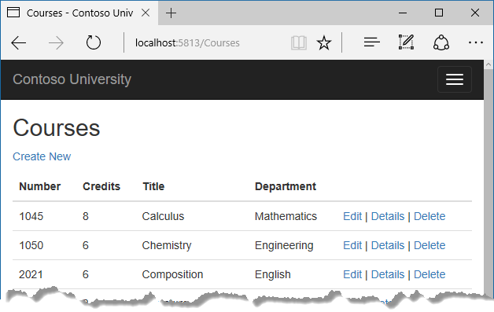

# Advanced topics

The Contoso University sample web application demonstrates how to create ASP.NET Core 1.0 MVC web applications using Entity Framework Core 1.0 and Visual Studio 2015. For information about the tutorial series, see [the first tutorial in the series](intro.md).

In the previous tutorial you implemented table-per-hierarchy inheritance. This tutorial introduces several topics that are useful to be aware of when you go beyond the basics of developing ASP.NET web applications that use Entity Framework Core.

## Raw SQL Queries

One of the advantages of using the Entity Framework is that it avoids tying your code too closely to a particular method of storing data. It does this by generating SQL queries and commands for you, which also frees you from having to write them yourself. But there are exceptional scenarios when you need to run specific SQL queries that you have manually created. For these scenarios, the Entity Framework Code First API includes methods that enable you to pass SQL commands directly to the database. You have the following options in EF Core 1.0:

* Use the `DbSet.FromSql` method for queries that return entity types. The returned objects must be of the type expected by the `DbSet` object, and they are automatically tracked by the database context unless you [turn tracking off](crud.md#no-tracking-queries).

* Use the `Database.ExecuteSqlCommand` for non-query commands.

If you need to run a query that returns types that aren't entities, you can use ADO.NET with the database connection provided by EF. The returned data isn't tracked by the database context, even if you use this method to retrieve entity types.

As is always true when you execute SQL commands in a web application, you must take precautions to protect your site against SQL injection attacks. One way to do that is to use parameterized queries to make sure that strings submitted by a web page can't be interpreted as SQL commands. In this tutorial you'll use parameterized queries when integrating user input into a query.

## Call a query that returns entities

The `DbSet<TEntity>` class provides a method that you can use to execute a query that returns an entity of type `TEntity`. To see how this works you'll change the code in the `Details` method of the Department controller.

In *DepartmentsController.cs*, in the `Details` method, replace the code that retrieves a department with a `FromSql` method call, as shown in the following highlighted code:

[!code-csharp[Main](intro/samples/cu/Controllers/DepartmentsController.cs?name=snippet_RawSQL&highlight=8,9,10,13)]

To verify that the new code works correctly, select the **Departments** tab and then **Details** for one of the departments.


## Call a query that returns other types

Earlier you created a student statistics grid for the About page that showed the number of students for each enrollment date. You got the data from the Students entity set (`_context.Students`) and used LINQ to project the results into a list of `EnrollmentDatGroup` view model objects. Suppose you want to write the SQL itself rather than using LINQ. To do that you need to run a SQL query that returns something other than entity objects. In EF Core 1.0, one way to do that is write ADO.NET code and get the database connection from EF.

In HomeController.cs, replace the LINQ statement in the `About` method with ADO.NET code, as shown in the following highlighted code:

[!code-csharp[Main](intro/samples/cu/Controllers/HomeController.cs?name=snippet_UseRawSQL&highlight=3,4,5,6,7,8,9,10,11,12,13,14,15,16,17,18,19,20,21,22,23,24,25,26,27,28,29,30,31,32)]

Add a using statement:

[!code-csharp[Main](intro/samples/cu/Controllers/HomeController.cs?name=snippet_Usings2)]

Run the About page. It displays the same data it did before.


## Call an update query

Suppose Contoso University administrators want to perform global changes in the database, such as changing the number of credits for every course. If the university has a large number of courses, it would be inefficient to retrieve them all as entities and change them individually. In this section you'll implement a web page that enables the user to specify a factor by which to change the number of credits for all courses, and you'll make the change by executing a SQL UPDATE statement. The web page will look like the following illustration:


In *CoursesContoller.cs*, add UpdateCourseCredits methods for HttpGet and HttpPost:

[!code-csharp[Main](intro/samples/cu/Controllers/CoursesController.cs?name=snippet_UpdateGet)]

[!code-csharp[Main](intro/samples/cu/Controllers/CoursesController.cs?name=snippet_UpdatePost)]

When the controller processes an HttpGet request, nothing is returned in `ViewData["RowsAffected"]`, and the view displays an empty text box and a submit button, as shown in the preceding illustration.

When the **Update** button is clicked, the HttpPost method is called, and multiplier has the value entered in the text box. The code then executes the SQL that updates courses and returns the number of affected rows to the view in `ViewData`. When the view gets a `RowsAffected` value, it displays the number of rows updated.

In **Solution Explorer**, right-click the *Views/Courses* folder, and then click **Add > New Item**.

In the **Add New Item** dialog, click **ASP.NET** under **Installed** in the left pane, click **MVC View Page**, and name the new view *UpdateCourseCredits.cshtml*.

In *Views/Courses/UpdateCourseCredits.cshtml*, replace the template code with the following code:

[!code-html[Main](intro/samples/cu/Views/Courses/UpdateCourseCredits.cshtml)]

Run the `UpdateCourseCredits` method by selecting the **Courses** tab, then adding "/UpdateCourseCredits" to the end of the URL in the browser's address bar (for example: `http://localhost:50205/Course/UpdateCourseCredits)`. Enter a number in the text box:


Click **Update**. You see the number of rows affected:


Click **Back to List** to see the list of courses with the revised number of credits.



For more information about raw SQL queries, see [Raw SQL Queries](https://ef.readthedocs.io/en/latest/querying/raw-sql.html).

## Examine SQL sent to the database

Sometimes it's helpful to be able to see the actual SQL queries that are sent to the database. Built-in logging functionality for ASP.NET Core is automatically used by EF Core to write logs that contain the SQL for queries and updates. In this section you'll see some examples of SQL logging.

Open *StudentsController.cs* and in the `Details` method set a breakpoint on the `if (student == null)` statement.

Run the application in debug mode, and go to the Details page for a student.

Go to the **Output** window showing debug output, and you see the query:

```text

Microsoft.EntityFrameworkCore.Storage.Internal
.RelationalCommandBuilderFactory:Information:
Executed DbCommand (9ms) [Parameters=[@__id_0='?'],
CommandType='Text', CommandTimeout='30']
SELECT [e].[EnrollmentID], [e].[CourseID], [e].[Grade], [e].[StudentID], [c].[CourseID], [c].[Credits], [c].[DepartmentID], [c].[Title]
FROM [Enrollment] AS [e]
INNER JOIN [Course] AS [c] ON [e].[CourseID] = [c].[CourseID]
WHERE EXISTS (
    SELECT TOP(2) 1
    FROM [Student] AS [s]
    WHERE ([s].[ID] = @__id_0) AND ([e].[StudentID] = [s].[ID]))
ORDER BY [e].[StudentID]
```

You'll notice something here that might surprise you: the SQL selects up to 2 rows (`TOP(2)`). The `SingleOrDefaultAsync` method doesn't resolve to one row on the server. If the Where clause matches multiple rows, the method must return null, so EF only has to select a maximum of 2 rows, because if 3 or more match the Where clause, the result from the `SingleOrDefault` method is the same as if 2 rows match.

Note that you don't have to use debug mode and stop at a breakpoint to get logging output in the **Output** window. It's just a convenient way to stop the logging at the point you want to look at the output. If you don't do that, logging continues and you have to scroll back to find the parts you're interested in.

## Repository and unit of work patterns

Many developers write code to implement the repository and unit of work patterns as a wrapper around code that works with the Entity Framework. These patterns are intended to create an abstraction layer between the data access layer and the business logic layer of an application. Implementing these patterns can help insulate your application from changes in the data store and can facilitate automated unit testing or test-driven development (TDD). However, writing additional code to implement these patterns is not always the best choice for applications that use EF, for several reasons:

* The EF context class itself insulates your code from data-store-specific code.

* The EF context class can act as a unit-of-work class for database updates that you do using EF.

* EF includes features for implementing TDD without writing repository code.

For information about how to implement the repository and unit of work patterns, see [the Entity Framework 5 version of this tutorial series](http://www.asp.net/mvc/overview/older-versions/getting-started-with-ef-5-using-mvc-4/implementing-the-repository-and-unit-of-work-patterns-in-an-asp-net-mvc-application).

Entity Framework Core implements an in-memory database provider that can be used for testing. For more information, see [Testing with InMemory](https://ef.readthedocs.io/en/latest/miscellaneous/testing.html).

## Automatic change detection

The Entity Framework determines how an entity has changed (and therefore which updates need to be sent to the database) by comparing the current values of an entity with the original values. The original values are stored when the entity is queried or attached. Some of the methods that cause automatic change detection are the following:

* DbContext.SaveChanges

* DbContext.Entry

* ChangeTracker.Entries

If you're tracking a large number of entities and you call one of these methods many times in a loop, you might get significant performance improvements by temporarily turning off automatic change detection using the `ChangeTracker.AutoDetectChangesEnabled` property. For example:

```csharp
_context.ChangeTracker.AutoDetectChangesEnabled = false;
```

## Entity Framework Core source code

The source code for Entity Framework Core is available at [https://github.com/aspnet/EntityFramework](https://github.com/aspnet/EntityFramework). Besides source code, you can get nightly builds, issue tracking, feature specs, design meeting notes, and more. You can file bugs, and you can contribute your own enhancements to the EF source code.

Although the source code is open, Entity Framework Core is fully supported as a Microsoft product. The Microsoft Entity Framework team keeps control over which contributions are accepted and tests all code changes to ensure the quality of each release.

## Reverse engineer from existing database

To reverse engineer a data model including entity classes from an existing database, use the [scaffold-dbcontext](https://ef.readthedocs.io/en/latest/miscellaneous/cli/powershell.html#scaffold-dbcontext) command. See the [getting-started tutorial](https://docs.efproject.net/en/latest/platforms/aspnetcore/existing-db.html).

## Summary

This completes this series of tutorials on using the Entity Framework Core in an ASP.NET MVC application. For more information about how to work with data using the Entity Framework, see the [EF documentation](https://ef.readthedocs.io/).

For information about how to deploy your web application after you've built it, see [Publishing and deployment](https://docs.asp.net/en/latest/publishing/index.html).
For information about other topics related to ASP.NET Core MVC, such as authentication and authorization, see the [ASP.NET Core documentation](https://docs.asp.net/).
## Acknowledgments

Tom Dykstra and Rick Anderson (twitter @RickAndMSFT) wrote this tutorial. Rowan Miller, Diego Vega, and other members of the Entity Framework team assisted with code reviews and helped debug issues that arose while we were writing code for the tutorials.

## Common errors  

### ContosoUniversity.dll used by another process

Error message:

> Cannot open 'C:\ContosoUniversity\src\ContosoUniversity\bin\Debug\netcoreapp1.0\ContosoUniversity.dll' for writing -- 'The process cannot access the file 'C:\ContosoUniversity\src\ContosoUniversity\bin\Debug\netcoreapp1.0\ContosoUniversity.dll' because it is being used by another process.

Solution:

Stop the site in IIS Express. Go to the Windows System Tray, find IIS Express and right-click its icon, select the Contoso University site, and then click **Stop Site**.

### Migration scaffolded with no code in Up and Down methods

Possible cause:

The EF CLI commands don't automatically close and save code files. If you have unsaved changes when you run the `migrations add` command, EF won't find your changes.

Solution:

Run the `migrations remove` command, save your code changes and rerun the `migrations add` command.

### Errors while running database update

It's possible to get other errors when making schema changes in a database that has existing data. If you get migration errors you can't resolve, you can either change the database name in the connection string or delete the database. With a new database, there is no data to migrate, and the update-database command is much more likely to complete without errors.

The simplest approach is to rename the database in *appsettings.json*. The next time you run `database update`, a new database will be created.

To delete a database in SSOX, right-click the database, click **Delete**, and then in the **Delete Database** dialog box select **Close existing connections** and click **OK**.

To delete a database by using the CLI, run the `database drop` CLI command:

```console
dotnet ef database drop -c SchoolContext
```

### Error locating SQL Server instance

Error Message:

> A network-related or instance-specific error occurred while establishing a connection to SQL Server. The server was not found or was not accessible. Verify that the instance name is correct and that SQL Server is configured to allow remote connections. (provider: SQL Network Interfaces, error: 26 - Error Locating Server/Instance Specified)

Solution:

Check the connection string. If you have manually deleted the database file, change the name of the database in the construction string to start over with a new database.

>[!div class="step-by-step"]
[Previous](inheritance.md)
