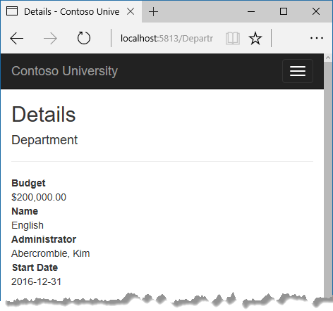
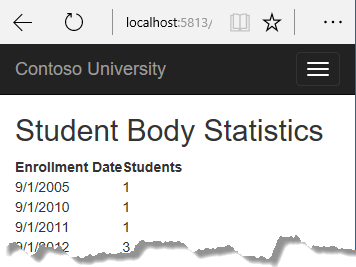
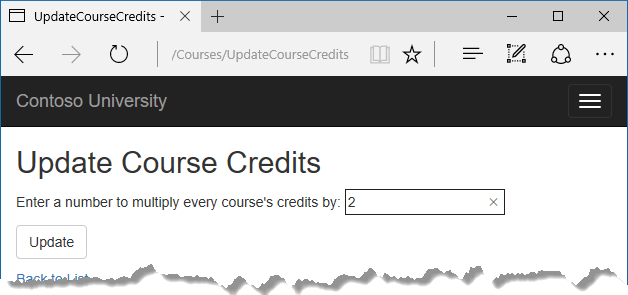
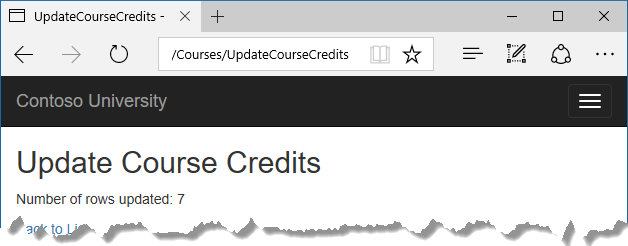

# Tutorial: Learn about advanced scenarios - ASP.NET MVC with EF Core

In the previous tutorial, you implemented table-per-hierarchy inheritance. This tutorial introduces several topics that are useful to be aware of when you go beyond the basics of developing ASP.NET Core web applications that use Entity Framework Core.

In this tutorial, you:

> [!div class="checklist"]
> * Perform raw SQL queries
> * Call a query to return entities
> * Call a query to return other types
> * Call an update query
> * Examine SQL queries
> * Create an abstraction layer
> * Learn about Automatic change detection
> * Learn about EF Core source code and development plans
> * Learn how to use dynamic LINQ to simplify code

## Prerequisites

* [Implement Inheritance](inheritance.md)

## Perform raw SQL queries

One of the advantages of using the Entity Framework is that it avoids tying your code too closely to a particular method of storing data. It does this by generating SQL queries and commands for you, which also frees you from having to write them yourself. But there are exceptional scenarios when you need to run specific SQL queries that you have manually created. For these scenarios, the Entity Framework Code First API includes methods that enable you to pass SQL commands directly to the database. You have the following options in EF Core 1.0:

* Use the `DbSet.FromSql` method for queries that return entity types. The returned objects must be of the type expected by the `DbSet` object, and they're automatically tracked by the database context unless you [turn tracking off](crud.md#no-tracking-queries).

* Use the `Database.ExecuteSqlCommand` for non-query commands.

If you need to run a query that returns types that aren't entities, you can use ADO.NET with the database connection provided by EF. The returned data isn't tracked by the database context, even if you use this method to retrieve entity types.

As is always true when you execute SQL commands in a web application, you must take precautions to protect your site against SQL injection attacks. One way to do that is to use parameterized queries to make sure that strings submitted by a web page can't be interpreted as SQL commands. In this tutorial you'll use parameterized queries when integrating user input into a query.

## Call a query to return entities

The `DbSet<TEntity>` class provides a method that you can use to execute a query that returns an entity of type `TEntity`. To see how this works you'll change the code in the `Details` method of the Department controller.

In `DepartmentsController.cs`, in the `Details` method, replace the code that retrieves a department with a `FromSql` method call, as shown in the following highlighted code:

[!code-csharp[](intro/samples/cu/Controllers/DepartmentsController.cs?name=snippet_RawSQL&highlight=8,9,10)]

To verify that the new code works correctly, select the **Departments** tab and then **Details** for one of the departments.



## Call a query to return other types

Earlier you created a student statistics grid for the About page that showed the number of students for each enrollment date. You got the data from the Students entity set (`_context.Students`) and used LINQ to project the results into a list of `EnrollmentDateGroup` view model objects. Suppose you want to write the SQL itself rather than using LINQ. To do that you need to run a SQL query that returns something other than entity objects. In EF Core 1.0, one way to do that is to write ADO.NET code and get the database connection from EF.

In `HomeController.cs`, replace the `About` method with the following code:

[!code-csharp[](intro/samples/cu/Controllers/HomeController.cs?name=snippet_UseRawSQL&highlight=3-32)]

Add a using statement:

[!code-csharp[](intro/samples/cu/Controllers/HomeController.cs?name=snippet_Usings2)]

Run the app and go to the About page. It displays the same data it did before.



## Call an update query

Suppose Contoso University administrators want to perform global changes in the database, such as changing the number of credits for every course. If the university has a large number of courses, it would be inefficient to retrieve them all as entities and change them individually. In this section you'll implement a web page that enables the user to specify a factor by which to change the number of credits for all courses, and you'll make the change by executing a SQL UPDATE statement. The web page will look like the following illustration:



In `CoursesController.cs`, add UpdateCourseCredits methods for HttpGet and HttpPost:

[!code-csharp[](intro/samples/cu/Controllers/CoursesController.cs?name=snippet_UpdateGet)]

[!code-csharp[](intro/samples/cu/Controllers/CoursesController.cs?name=snippet_UpdatePost)]

When the controller processes an HttpGet request, nothing is returned in `ViewData["RowsAffected"]`, and the view displays an empty text box and a submit button, as shown in the preceding illustration.

When the **Update** button is clicked, the HttpPost method is called, and multiplier has the value entered in the text box. The code then executes the SQL that updates courses and returns the number of affected rows to the view in `ViewData`. When the view gets a `RowsAffected` value, it displays the number of rows updated.

In **Solution Explorer**, right-click the *Views/Courses* folder, and then click **Add > New Item**.

In the **Add New Item** dialog, click **ASP.NET Core** under **Installed** in the left pane, click **Razor View**, and name the new view `UpdateCourseCredits.cshtml`.

In `Views/Courses/UpdateCourseCredits.cshtml`, replace the template code with the following code:

[!code-cshtml[](intro/samples/cu/Views/Courses/UpdateCourseCredits.cshtml)]

Run the `UpdateCourseCredits` method by selecting the **Courses** tab, then adding "/UpdateCourseCredits" to the end of the URL in the browser's address bar (for example: `http://localhost:5813/Courses/UpdateCourseCredits`). Enter a number in the text box:


Click **Update**. You see the number of rows affected:



Click **Back to List** to see the list of courses with the revised number of credits.

Note that production code would ensure that updates always result in valid data. The simplified code shown here could multiply the number of credits enough to result in numbers greater than 5. (The `Credits` property has a `[Range(0, 5)]` attribute.) The update query would work but the invalid data could cause unexpected results in other parts of the system that assume the number of credits is 5 or less.

For more information about raw SQL queries, see [Raw SQL Queries](/ef/core/querying/raw-sql).

## Examine SQL queries

Sometimes it's helpful to be able to see the actual SQL queries that are sent to the database. Built-in logging functionality for ASP.NET Core is automatically used by EF Core to write logs that contain the SQL for queries and updates. In this section you'll see some examples of SQL logging.

Open `StudentsController.cs` and in the `Details` method set a breakpoint on the `if (student == null)` statement.

Run the app in debug mode, and go to the Details page for a student.

Go to the **Output** window showing debug output, and you see the query:

```
Microsoft.EntityFrameworkCore.Database.Command:Information: Executed DbCommand (56ms) [Parameters=[@__id_0='?'], CommandType='Text', CommandTimeout='30']
SELECT TOP(2) [s].[ID], [s].[Discriminator], [s].[FirstName], [s].[LastName], [s].[EnrollmentDate]
FROM [Person] AS [s]
WHERE ([s].[Discriminator] = N'Student') AND ([s].[ID] = @__id_0)
ORDER BY [s].[ID]
Microsoft.EntityFrameworkCore.Database.Command:Information: Executed DbCommand (122ms) [Parameters=[@__id_0='?'], CommandType='Text', CommandTimeout='30']
SELECT [s.Enrollments].[EnrollmentID], [s.Enrollments].[CourseID], [s.Enrollments].[Grade], [s.Enrollments].[StudentID], [e.Course].[CourseID], [e.Course].[Credits], [e.Course].[DepartmentID], [e.Course].[Title]
FROM [Enrollment] AS [s.Enrollments]
INNER JOIN [Course] AS [e.Course] ON [s.Enrollments].[CourseID] = [e.Course].[CourseID]
INNER JOIN (
    SELECT TOP(1) [s0].[ID]
    FROM [Person] AS [s0]
    WHERE ([s0].[Discriminator] = N'Student') AND ([s0].[ID] = @__id_0)
    ORDER BY [s0].[ID]
) AS [t] ON [s.Enrollments].[StudentID] = [t].[ID]
ORDER BY [t].[ID]
```

You'll notice something here that might surprise you: the SQL selects up to 2 rows (`TOP(2)`) from the Person table. The `SingleOrDefaultAsync` method doesn't resolve to 1 row on the server. Here's why:

* If the query would return multiple rows, the method returns null.
* To determine whether the query would return multiple rows, EF has to check if it returns at least 2.

Note that you don't have to use debug mode and stop at a breakpoint to get logging output in the **Output** window. It's just a convenient way to stop the logging at the point you want to look at the output. If you don't do that, logging continues and you have to scroll back to find the parts you're interested in.

## Create an abstraction layer

Many developers write code to implement the repository and unit of work patterns as a wrapper around code that works with the Entity Framework. These patterns are intended to create an abstraction layer between the data access layer and the business logic layer of an application. Implementing these patterns can help insulate your application from changes in the data store and can facilitate automated unit testing or test-driven development (TDD). However, writing additional code to implement these patterns isn't always the best choice for applications that use EF, for several reasons:

* The EF context class itself insulates your code from data-store-specific code.

* The EF context class can act as a unit-of-work class for database updates that you do using EF.

* EF includes features for implementing TDD without writing repository code.

For information about how to implement the repository and unit of work patterns, see [the Entity Framework 5 version of this tutorial series](/aspnet/mvc/overview/older-versions/getting-started-with-ef-5-using-mvc-4/implementing-the-repository-and-unit-of-work-patterns-in-an-asp-net-mvc-application).

Entity Framework Core implements an in-memory database provider that can be used for testing. For more information, see [Test with InMemory](/ef/core/miscellaneous/testing/in-memory).

## Automatic change detection

The Entity Framework determines how an entity has changed (and therefore which updates need to be sent to the database) by comparing the current values of an entity with the original values. The original values are stored when the entity is queried or attached. Some of the methods that cause automatic change detection are the following:

* DbContext.SaveChanges

* DbContext.Entry

* ChangeTracker.Entries

If you're tracking a large number of entities and you call one of these methods many times in a loop, you might get significant performance improvements by temporarily turning off automatic change detection using the `ChangeTracker.AutoDetectChangesEnabled` property. For example:

```csharp
_context.ChangeTracker.AutoDetectChangesEnabled = false;
```

## EF Core source code and development plans

The Entity Framework Core source is at [https://github.com/dotnet/efcore](https://github.com/dotnet/efcore). The EF Core repository contains nightly builds, issue tracking, feature specs, design meeting notes, and [the roadmap for future development](https://github.com/dotnet/efcore/wiki/Roadmap). You can file or find bugs, and contribute.

Although the source code is open, Entity Framework Core is fully supported as a Microsoft product. The Microsoft Entity Framework team keeps control over which contributions are accepted and tests all code changes to ensure the quality of each release.

## Reverse engineer from existing database

To reverse engineer a data model including entity classes from an existing database, use the [scaffold-dbcontext](/ef/core/miscellaneous/cli/powershell#scaffold-dbcontext) command. See the [getting-started tutorial](/ef/core/get-started/aspnetcore/existing-db).

<a id="dynamic-linq"></a>

## Use dynamic LINQ to simplify code

The [third tutorial in this series](sort-filter-page.md) shows how to write LINQ code by hard-coding column names in a `switch` statement. With two columns to choose from, this works fine, but if you have many columns the code could get verbose. To solve that problem, you can use the `EF.Property` method to specify the name of the property as a string. To try out this approach, replace the `Index` method in the `StudentsController` with the following code.

[!code-csharp[](intro/samples/cu/Controllers/StudentsController.cs?name=snippet_DynamicLinq)]

## Acknowledgments

Tom Dykstra and Rick Anderson (twitter @RickAndMSFT) wrote this tutorial. Rowan Miller, Diego Vega, and other members of the Entity Framework team assisted with code reviews and helped debug issues that arose while we were writing code for the tutorials. John Parente and Paul Goldman worked on updating the tutorial for ASP.NET Core 2.2.

<a id="common-errors"></a>

## Troubleshoot common errors

### ContosoUniversity.dll used by another process

Error message:

> Cannot open '...bin\Debug\netcoreapp1.0\ContosoUniversity.dll' for writing -- 'The process cannot access the file '...\bin\Debug\netcoreapp1.0\ContosoUniversity.dll' because it is being used by another process.

Solution:

Stop the site in IIS Express. Go to the Windows System Tray, find IIS Express and right-click its icon, select the Contoso University site, and then click **Stop Site**.

### Migration scaffolded with no code in Up and Down methods

Possible cause:

The EF CLI commands don't automatically close and save code files. If you have unsaved changes when you run the `migrations add` command, EF won't find your changes.

Solution:

Run the `migrations remove` command, save your code changes and rerun the `migrations add` command.

### Errors while running database update

It's possible to get other errors when making schema changes in a database that has existing data. If you get migration errors you can't resolve, you can either change the database name in the connection string or delete the database. With a new database, there's no data to migrate, and the update-database command is much more likely to complete without errors.

The simplest approach is to rename the database in `appsettings.json`. The next time you run `database update`, a new database will be created.

To delete a database in SSOX, right-click the database, click **Delete**, and then in the **Delete Database** dialog box select **Close existing connections** and click **OK**.

To delete a database by using the CLI, run the `database drop` CLI command:

```dotnetcli
dotnet ef database drop
```

### Error locating SQL Server instance

Error Message:

> A network-related or instance-specific error occurred while establishing a connection to SQL Server. The server was not found or was not accessible. Verify that the instance name is correct and that SQL Server is configured to allow remote connections. (provider: SQL Network Interfaces, error: 26 - Error Locating Server/Instance Specified)

Solution:

Check the connection string. If you have manually deleted the database file, change the name of the database in the construction string to start over with a new database.

## Get the code

[Download or view the completed application.](https://github.com/dotnet/AspNetCore.Docs/tree/main/aspnetcore/data/ef-mvc/intro/samples/cu-final)

## Additional resources

For more information about EF Core, see the [Entity Framework Core documentation](/ef/core). A book is also available: [Entity Framework Core in Action](https://www.manning.com/books/entity-framework-core-in-action).

For information on how to deploy a web app, see <xref:host-and-deploy/index>.

For information about other topics related to ASP.NET Core MVC, such as authentication and authorization, see <xref:index>.

## Next steps

In this tutorial, you:

> [!div class="checklist"]
> * Performed raw SQL queries
> * Called a query to return entities
> * Called a query to return other types
> * Called an update query
> * Examined SQL queries
> * Created an abstraction layer
> * Learned about Automatic change detection
> * Learned about EF Core source code and development plans
> * Learned how to use dynamic LINQ to simplify code

This completes this series of tutorials on using the Entity Framework Core in an ASP.NET Core MVC application. This series worked with a new database; an alternative is to  [reverse engineer a model from an existing database](/ef/core/managing-schemas/scaffolding).

> [!div class="nextstepaction"]
> [Tutorial: EF Core with MVC, existing database](/ef/core/get-started/aspnetcore/existing-db?toc=/aspnet/core/toc.json&bc=/aspnet/core/breadcrumb/toc.json)
