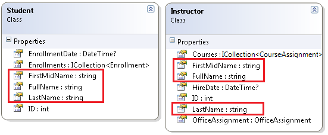
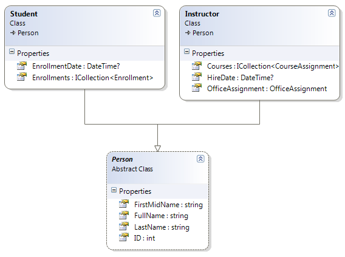
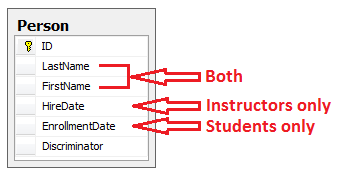
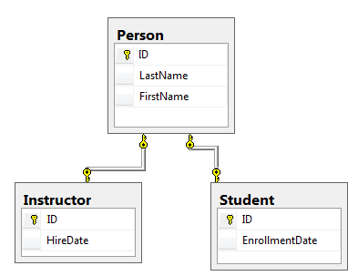
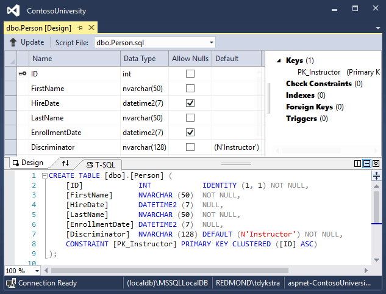
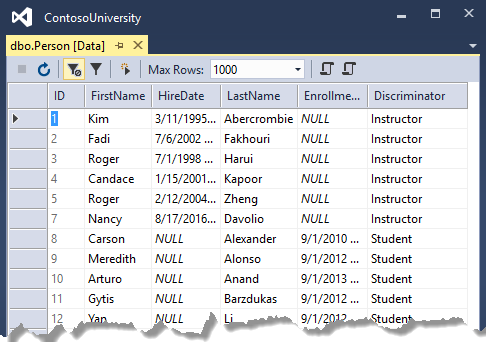

# Tutorial: Implement inheritance - ASP.NET MVC with EF Core

In the previous tutorial, you handled concurrency exceptions. This tutorial will show you how to implement inheritance in the data model.

In object-oriented programming, you can use inheritance to facilitate code reuse. In this tutorial, you'll change the `Instructor` and `Student` classes so that they derive from a `Person` base class which contains properties such as `LastName` that are common to both instructors and students. You won't add or change any web pages, but you'll change some of the code and those changes will be automatically reflected in the database.

In this tutorial, you:

> [!div class="checklist"]
> * Map inheritance to database
> * Create the Person class
> * Update Instructor and Student
> * Add Person to the model
> * Create and update migrations
> * Test the implementation

## Prerequisites

* [Handle Concurrency](concurrency.md)

## Map inheritance to database

The `Instructor` and `Student` classes in the School data model have several properties that are identical:



Suppose you want to eliminate the redundant code for the properties that are shared by the `Instructor` and `Student` entities. Or you want to write a service that can format names without caring whether the name came from an instructor or a student. You could create a `Person` base class that contains only those shared properties, then make the `Instructor` and `Student` classes inherit from that base class, as shown in the following illustration:



There are several ways this inheritance structure could be represented in the database. You could have a `Person` table that includes information about both students and instructors in a single table. Some of the columns could apply only to instructors (HireDate), some only to students (EnrollmentDate), some to both (LastName, FirstName). Typically, you'd have a discriminator column to indicate which type each row represents. For example, the discriminator column might have "Instructor" for instructors and "Student" for students.



This pattern of generating an entity inheritance structure from a single database table is called *table-per-hierarchy (TPH)* inheritance.

An alternative is to make the database look more like the inheritance structure. For example, you could have only the name fields in the `Person` table and have separate `Instructor` and `Student` tables with the date fields.

> [!WARNING]
> Table-Per-Type (TPT) is not supported by EF Core 3.x, however it is has been implemented in [EF Core 5.0](/ef/core/what-is-new/ef-core-5.0/plan).



This pattern of making a database table for each entity class is called *table-per-type (TPT)* inheritance.

Yet another option is to map all non-abstract types to individual tables. All properties of a class, including inherited properties, map to columns of the corresponding table. This pattern is called *Table-per-Concrete Class (TPC)* inheritance. If you implemented TPC inheritance for the `Person`, `Student`, and `Instructor` classes as shown earlier, the `Student` and `Instructor` tables would look no different after implementing inheritance than they did before.

TPC and TPH inheritance patterns generally deliver better performance than TPT inheritance patterns, because TPT patterns can result in complex join queries.

This tutorial demonstrates how to implement TPH inheritance. TPH is the only inheritance pattern that the Entity Framework Core supports.  What you'll do is create a `Person` class, change the `Instructor` and `Student` classes to derive from `Person`, add the new class to the `DbContext`, and create a migration.

> [!TIP]
> Consider saving a copy of the project before making the following changes.  Then if you run into problems and need to start over, it will be easier to start from the saved project instead of reversing steps done for this tutorial or going back to the beginning of the whole series.

## Create the Person class

In the Models folder, create Person.cs and replace the template code with the following code:

[!code-csharp[](intro/samples/cu/Models/Person.cs)]

## Update Instructor and Student

In `Instructor.cs`, derive the Instructor class from the Person class and remove the key and name fields. The code will look like the following example:

[!code-csharp[](intro/samples/cu/Models/Instructor.cs?name=snippet_AfterInheritance&highlight=8)]

Make the same changes in `Student.cs`.

[!code-csharp[](intro/samples/cu/Models/Student.cs?name=snippet_AfterInheritance&highlight=8)]

## Add Person to the model

Add the Person entity type to `SchoolContext.cs`. The new lines are highlighted.

[!code-csharp[](intro/samples/cu/Data/SchoolContext.cs?name=snippet_AfterInheritance&highlight=19,30)]

This is all that the Entity Framework needs in order to configure table-per-hierarchy inheritance. As you'll see, when the database is updated, it will have a Person table in place of the Student and Instructor tables.

## Create and update migrations

Save your changes and build the project. Then open the command window in the project folder and enter the following command:

```dotnetcli
dotnet ef migrations add Inheritance
```

Don't run the `database update` command yet. That command will result in lost data because it will drop the Instructor table and rename the Student table to Person. You need to provide custom code to preserve existing data.

Open `Migrations/<timestamp>_Inheritance.cs` and replace the `Up` method with the following code:

[!code-csharp[](intro/samples/cu/Migrations/20170216215525_Inheritance.cs?name=snippet_Up)]

This code takes care of the following database update tasks:

* Removes foreign key constraints and indexes that point to the Student table.

* Renames the Instructor table as Person and makes changes needed for it to store Student data:

* Adds nullable EnrollmentDate for students.

* Adds Discriminator column to indicate whether a row is for a student or an instructor.

* Makes HireDate nullable since student rows won't have hire dates.

* Adds a temporary field that will be used to update foreign keys that point to students. When you copy students into the Person table they will get new primary key values.

* Copies data from the Student table into the Person table. This causes students to get assigned new primary key values.

* Fixes foreign key values that point to students.

* Re-creates foreign key constraints and indexes, now pointing them to the Person table.

(If you had used GUID instead of integer as the primary key type, the student primary key values wouldn't have to change, and several of these steps could have been omitted.)

Run the `database update` command:

```dotnetcli
dotnet ef database update
```

(In a production system you would make corresponding changes to the `Down` method in case you ever had to use that to go back to the previous database version. For this tutorial you won't be using the `Down` method.)

> [!NOTE]
> It's possible to get other errors when making schema changes in a database that has existing data. If you get migration errors that you can't resolve, you can either change the database name in the connection string or delete the database. With a new database, there's no data to migrate, and the update-database command is more likely to complete without errors. To delete the database, use SSOX or run the `database drop` CLI command.

## Test the implementation

Run the app and try various pages. Everything works the same as it did before.

In **SQL Server Object Explorer**, expand **Data Connections/SchoolContext** and then **Tables**, and you see that the Student and Instructor tables have been replaced by a Person table. Open the Person table designer and you see that it has all of the columns that used to be in the Student and Instructor tables.



Right-click the Person table, and then click **Show Table Data** to see the discriminator column.



## Get the code

[Download or view the completed application.](https://github.com/dotnet/AspNetCore.Docs/tree/main/aspnetcore/data/ef-mvc/intro/samples/cu-final)

## Additional resources

For more information about inheritance in Entity Framework Core, see [Inheritance](/ef/core/modeling/inheritance).

## Next steps

In this tutorial, you:

> [!div class="checklist"]
> * Mapped inheritance to database
> * Created the Person class
> * Updated Instructor and Student
> * Added Person to the model
> * Created and update migrations
> * Tested the implementation

Advance to the next tutorial to learn how to handle a variety of relatively advanced Entity Framework scenarios.

> [!div class="nextstepaction"]
> [Next: Advanced topics](advanced.md)
