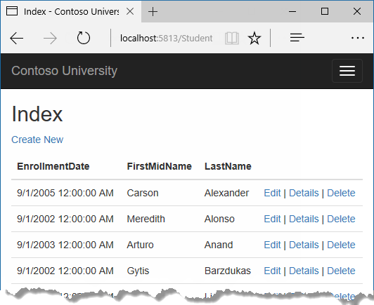
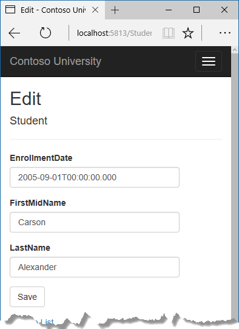
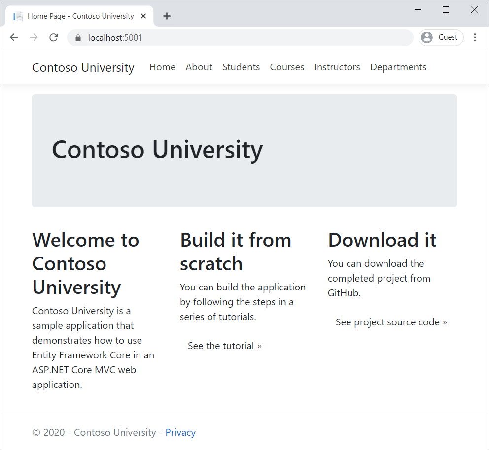
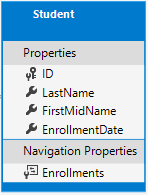
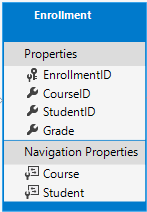
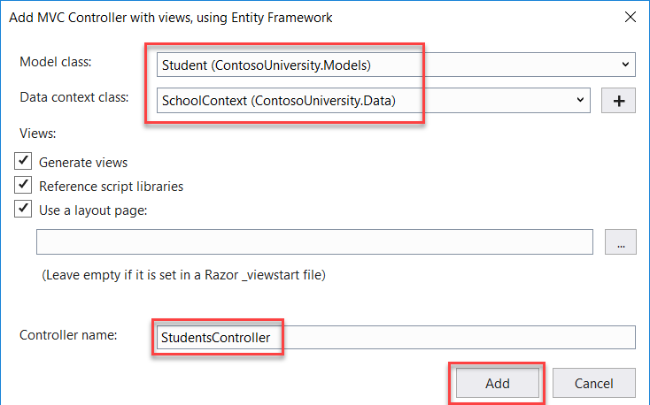
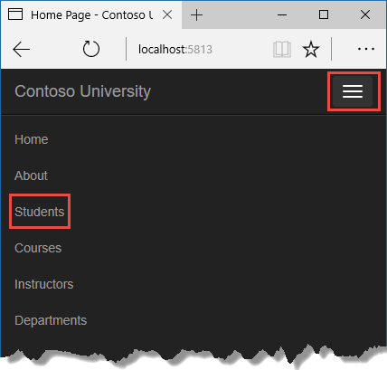
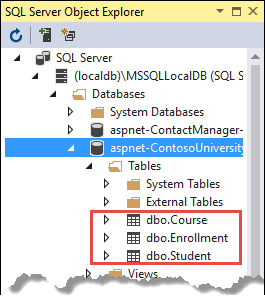
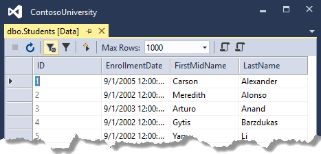
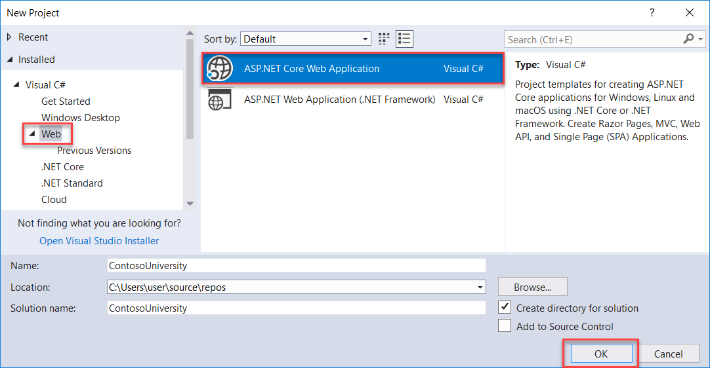

# Tutorial: Get started with EF Core in an ASP.NET MVC web app

By [Tom Dykstra](https://github.com/tdykstra) and [Rick Anderson](https://twitter.com/RickAndMSFT)

:::moniker range=">= aspnetcore-5.0"

[!INCLUDE [RP better than MVC](~/includes/RP-EF/rp-over-mvc.md)]


The Contoso University sample web app demonstrates how to create an ASP.NET Core MVC web app using Entity Framework (EF) Core and Visual Studio.

The sample app is a web site for a fictional Contoso University. It includes functionality such as student admission, course creation, and instructor assignments. This is the first in a series of tutorials that explain how to build the Contoso University sample app.

## Prerequisites

* If you're new to ASP.NET Core MVC, go through the [Get started with ASP.NET Core MVC](xref:tutorials/first-mvc-app/start-mvc) tutorial series before starting this one.

[!INCLUDE[VS prereqs](~/includes/net-prereqs-vs-6.0.md)]

This tutorial has not been updated for ASP.NET Core 6 or later. The tutorial's instructions will not work correctly if you create a project that targets ASP.NET Core 6 or 7. For example, the ASP.NET Core 6 and 7 web templates use the [minimal hosting model](xref:migration/50-to-60#new-hosting-model), which unifies `Startup.cs` and `Program.cs` into a single `Program.cs` file.

Another difference introduced in .NET 6 is the NRT [(nullable reference types)](/ef/core/miscellaneous/nullable-reference-types ) feature. The project templates enable this feature by default. Problems can happen where EF considers a property to be required in .NET 6 which is nullable in .NET 5. For example, the Create Student page will fail silently unless the `Enrollments` property is made nullable or the `asp-validation-summary` helper tag is changed from `ModelOnly` to `All`.

We recommend that you install and use the .NET 5 SDK for this tutorial. Until this tutorial is updated, see <xref:data/ef-rp/intro> on how to use Entity Framework with ASP.NET Core 6 or later.

## Database engines

The Visual Studio instructions use [SQL Server LocalDB](/sql/database-engine/configure-windows/sql-server-2016-express-localdb), a version of SQL Server Express that runs only on Windows.

<!--
The Visual Studio Code instructions use [SQLite](https://www.sqlite.org/), a cross-platform database engine.

If you choose to use SQLite, download and install a third-party tool for managing and viewing a SQLite database, such as [DB Browser for SQLite](https://sqlitebrowser.org/).
-->

## Solve problems and troubleshoot

If you run into a problem you can't resolve, you can generally find the solution by comparing your code to the [completed project](https://github.com/dotnet/AspNetCore.Docs/tree/main/aspnetcore/data/ef-mvc/intro/samples). For a list of common errors and how to solve them, see [the Troubleshooting section of the last tutorial in the series](advanced.md#common-errors). If you don't find what you need there, you can post a question to StackOverflow.com for [ASP.NET Core](https://stackoverflow.com/questions/tagged/asp.net-core) or [EF Core](https://stackoverflow.com/questions/tagged/entity-framework-core).

> [!TIP]
> This is a series of 10 tutorials, each of which builds on what is done in earlier tutorials. Consider saving a copy of the project after each successful tutorial completion. Then if you run into problems, you can start over from the previous tutorial instead of going back to the beginning of the whole series.

## Contoso University web app

The app built in these tutorials is a basic university web site.

Users can view and update student, course, and instructor information. Here are a few of the screens in the app:





## Create web app

1. Start Visual Studio and select **Create a new project**.
1. In the **Create a new project** dialog, select **ASP.NET Core Web Application** > **Next**.
1. In the **Configure your new project** dialog, enter `ContosoUniversity` for **Project name**. It's important to use this exact name including capitalization, so each `namespace` matches when code is copied.
1. Select **Create**.
1. In the **Create a new ASP.NET Core web application** dialog, select:
    1. **.NET Core** and **ASP.NET Core 5.0** in the dropdowns.
    1. **ASP.NET Core Web App (Model-View-Controller)**.
    1. **Create**
      

## Set up the site style

A few basic changes set up the site menu, layout, and home page.

Open `Views/Shared/_Layout.cshtml` and make the following changes:

* Change each occurrence of `ContosoUniversity` to `Contoso University`. There are three occurrences.
* Add menu entries for **About**, **Students**, **Courses**, **Instructors**, and **Departments**, and delete the **Privacy** menu entry.

The preceding changes are highlighted in the following code:

[!code-cshtml[](intro/samples/5cu/Views/Shared/_Layout.cshtml?highlight=6,24-38,52)]

In `Views/Home/Index.cshtml`, replace the contents of the file with the following markup:

[!code-cshtml[](intro/samples/5cu/Views/Home/Index.cshtml)]

Press CTRL+F5 to run the project or choose **Debug > Start Without Debugging** from the menu. The home page is displayed with tabs for the pages created in this tutorial.



## EF Core NuGet packages

This tutorial uses SQL Server, and the provider package is [Microsoft.EntityFrameworkCore.SqlServer](https://www.nuget.org/packages/Microsoft.EntityFrameworkCore.SqlServer/).

The EF SQL Server package and its dependencies, `Microsoft.EntityFrameworkCore` and `Microsoft.EntityFrameworkCore.Relational`, provide runtime support for EF.

Add the [Microsoft.AspNetCore.Diagnostics.EntityFrameworkCore](https://www.nuget.org/packages/Microsoft.AspNetCore.Diagnostics.EntityFrameworkCore) NuGet package. In the Package Manager Console (PMC), enter the following commands to add the NuGet packages:

```powershell
Install-Package Microsoft.AspNetCore.Diagnostics.EntityFrameworkCore
Install-Package Microsoft.EntityFrameworkCore.SqlServer
```

The `Microsoft.AspNetCore.Diagnostics.EntityFrameworkCore` NuGet package provides ASP.NET Core middleware for EF Core error pages. This middleware helps to detect and diagnose errors with EF Core migrations.

For information about other database providers that are available for EF Core, see [Database providers](/ef/core/providers/).

## Create the data model

The following entity classes are created for this app:


The preceding entities have the following relationships:

* A one-to-many relationship between `Student` and `Enrollment` entities. A student can be enrolled in any number of courses.
* A one-to-many relationship between `Course` and `Enrollment` entities. A course can have any number of students enrolled in it.

In the following sections, a class is created for each of these entities.

### The Student entity



In the *Models* folder, create the `Student` class with the following code:

[!code-csharp[](intro/samples/cu/Models/Student.cs?name=snippet_Intro)]

The `ID` property is the primary key (**PK**) column of the database table that corresponds to this class. By default, EF interprets a property that's named `ID` or `classnameID` as the primary key. For example, the PK could be named `StudentID` rather than `ID`.

The `Enrollments` property is a [navigation property](/ef/core/modeling/relationships). Navigation properties hold other entities that are related to this entity. The `Enrollments` property of a `Student` entity:

* Contains all of the `Enrollment` entities that are related to that `Student` entity.
* If a specific `Student` row in the database has two related `Enrollment` rows:
  * That `Student` entity's `Enrollments` navigation property contains those two `Enrollment` entities.
  
`Enrollment` rows contain a student's PK value in the `StudentID` foreign key (**FK**) column.

If a navigation property can hold multiple entities:

 * The type must be a list, such as `ICollection<T>`, `List<T>`, or `HashSet<T>`.
 * Entities can be added, deleted, and updated.

Many-to-many and one-to-many navigation relationships can contain multiple entities. When `ICollection<T>` is used, EF creates a `HashSet<T>` collection by default.

### The Enrollment entity



In the *Models* folder, create the `Enrollment` class with the following code:

[!code-csharp[](intro/samples/cu/Models/Enrollment.cs?name=snippet_Intro)]

The `EnrollmentID` property is the PK. This entity uses the `classnameID` pattern instead of `ID` by itself. The `Student` entity used the `ID` pattern. Some developers prefer to use one pattern throughout the data model. In this tutorial, the variation illustrates that either pattern can be used. A [later tutorial](inheritance.md) shows how using `ID` without classname makes it easier to implement inheritance in the data model.

The `Grade` property is an `enum`. The `?` after the `Grade` type declaration indicates that the `Grade` property is [nullable](/dotnet/csharp/language-reference/builtin-types/nullable-value-types). A grade that's `null` is different from a zero grade. `null` means a grade isn't known or hasn't been assigned yet.

The `StudentID` property is a foreign key (FK), and the corresponding navigation property is `Student`. An `Enrollment` entity is associated with one `Student` entity, so the property can only hold a single `Student` entity. This differs from the `Student.Enrollments` navigation property, which can hold multiple `Enrollment` entities.

The `CourseID` property is a FK, and the corresponding navigation property is `Course`. An `Enrollment` entity is associated with one `Course` entity.

Entity Framework interprets a property as a FK property if it's named `<`navigation property name`><`primary key property name`>`. For example, `StudentID` for the `Student` navigation property since the `Student` entity's PK is `ID`. FK properties can also be named  `<`primary key property name`>`. For example, `CourseID` because the `Course` entity's PK is `CourseID`.

### The Course entity


In the *Models* folder, create the `Course` class with the following code:

[!code-csharp[](intro/samples/cu/Models/Course.cs?name=snippet_Intro)]

The `Enrollments` property is a navigation property. A `Course` entity can be related to any number of `Enrollment` entities.

The [DatabaseGenerated](xref:System.ComponentModel.DataAnnotations.DatabaseGeneratedAttribute) attribute is explained in a [later tutorial](complex-data-model.md). This attribute allows entering the PK for the course rather than having the database generate it.

## Create the database context

The main class that coordinates EF functionality for a given data model is the <xref:Microsoft.EntityFrameworkCore.DbContext> database context class. This class is created by deriving from the `Microsoft.EntityFrameworkCore.DbContext` class. The `DbContext` derived class specifies which entities are included in the data model. Some EF behaviors can be customized. In this project, the class is named `SchoolContext`.

In the project folder, create a folder named `Data`.

In the *Data* folder create a `SchoolContext` class with the following code:

[!code-csharp[](intro/samples/cu/Data/SchoolContext.cs?name=snippet_Intro)]

The preceding code creates a `DbSet` property for each entity set. In EF terminology:

* An entity set typically corresponds to a database table.
* An entity corresponds to a row in the table.

The `DbSet<Enrollment>` and `DbSet<Course>` statements could be omitted and it would work the same. EF would include them implicitly because:

* The `Student` entity references the `Enrollment` entity.
* The `Enrollment` entity references the `Course` entity.

When the database is created, EF creates tables that have names the same as the `DbSet` property names. Property names for collections are typically plural. For example, `Students` rather than `Student`. Developers disagree about whether table names should be pluralized or not. For these tutorials, the default behavior is overridden by specifying singular table names in the `DbContext`. To do that, add the following highlighted code after the last DbSet property.

[!code-csharp[](intro/samples/cu/Data/SchoolContext.cs?name=snippet_TableNames&highlight=16-21)]

## Register the `SchoolContext`

ASP.NET Core includes [dependency injection](../../fundamentals/dependency-injection.md). Services, such as the EF database context, are registered with dependency injection during app startup. Components that require these services, such as MVC controllers, are provided these services via constructor parameters. The controller constructor code that gets a context instance is shown later in this tutorial.

To register `SchoolContext` as a service, open `Startup.cs`, and add the highlighted lines to the `ConfigureServices` method.

[!code-csharp[](intro/samples/5cu-snap/Startup.cs?name=snippet&highlight=1-2,22-23)]

The name of the connection string is passed in to the context by calling a method on a `DbContextOptionsBuilder` object. For local development, the [ASP.NET Core configuration system](xref:fundamentals/configuration/index) reads the connection string from the `appsettings.json` file.

Open the `appsettings.json` file and add a connection string as shown in the following markup:

[!code-json[](./intro/samples/5cu/appsettings1.json?highlight=2-4)]

### Add the database exception filter

Add <xref:Microsoft.Extensions.DependencyInjection.DatabaseDeveloperPageExceptionFilterServiceExtensions.AddDatabaseDeveloperPageExceptionFilter%2A> to `ConfigureServices` as shown in the following code:

[!code-csharp[](intro/samples/5cu/Startup.cs?name=snippet&highlight=6)]

The `AddDatabaseDeveloperPageExceptionFilter` provides helpful error information in the [development environment](xref:fundamentals/environments).

### SQL Server Express LocalDB

The connection string specifies [SQL Server LocalDB](/sql/database-engine/configure-windows/sql-server-2016-express-localdb). LocalDB is a lightweight version of the SQL Server Express Database Engine and is intended for app development, not production use. LocalDB starts on demand and runs in user mode, so there's no complex configuration. By default, LocalDB creates *.mdf* DB files in the `C:/Users/<user>` directory.

## Initialize DB with test data

EF creates an empty database. In this section, a method is added that's called after the database is created in order to populate it with test data.

The `EnsureCreated` method is used to automatically create the database. In a [later tutorial](migrations.md), you see how to handle model changes by using Code First Migrations to change the database schema instead of dropping and re-creating the database.

In the *Data* folder, create a new class named `DbInitializer` with the following code:

[!code-csharp[DbInitializer](intro/samples/5cu-snap/DbInitializer.cs)]

The preceding code checks if the database exists:

* If the database is not found;
  * It is created and loaded with test data. It loads test data into arrays rather than `List<T>` collections to optimize performance.
* If the database is found, it takes no action.

Update `Program.cs` with the following code:

[!code-csharp[Program file](intro/samples/5cu-snap/Program.cs?highlight=1-2,14-18,21-37)]

`Program.cs` does the following on app startup:

* Get a database context instance from the dependency injection container.
* Call the `DbInitializer.Initialize` method.
* Dispose the context when the `Initialize` method completes as shown in the following code:

[!code-csharp[](intro/samples/cu/Program.cs?name=snippet_Seed&highlight=5-18)]

The first time the app is run, the database is created and loaded with test data. Whenever the data model changes:

* Delete the database.
* Update the seed method, and start afresh with a new database.

 In later tutorials, the database is modified when the data model changes, without deleting and re-creating it. No data is lost when the data model changes.

## Create controller and views

Use the scaffolding engine in Visual Studio to add an MVC controller and views that will use EF to query and save data.

The automatic creation of [CRUD](https://wikipedia.org/wiki/Create,_read,_update_and_delete) action methods and views is known as scaffolding.

* In **Solution Explorer**, right-click the `Controllers` folder  and select **Add > New Scaffolded Item**.
* In the **Add Scaffold** dialog box:
  * Select **MVC controller with views, using Entity Framework**.
  * Click **Add**. The **Add MVC Controller with views, using Entity Framework** dialog box appears:
    
  * In **Model class**, select **Student**.
  * In **Data context class**, select **SchoolContext**.
  * Accept the default **StudentsController** as the name.
  * Click **Add**.

The Visual Studio scaffolding engine creates a `StudentsController.cs` file and a set of views (`*.cshtml` files) that work with the controller.

Notice the controller takes a `SchoolContext` as a constructor parameter.

[!code-csharp[](intro/samples/cu/Controllers/StudentsController.cs?name=snippet_Context&highlight=5,7,9)]

ASP.NET Core dependency injection takes care of passing an instance of `SchoolContext` into the controller. You configured that in the `Startup` class.

The controller contains an `Index` action method, which displays all students in the database. The method gets a list of students from the Students entity set by reading the `Students` property of the database context instance:

[!code-csharp[](intro/samples/cu/Controllers/StudentsController.cs?name=snippet_ScaffoldedIndex&highlight=3)]

The asynchronous programming elements in this code are explained later in the tutorial.

The `Views/Students/Index.cshtml` view displays this list in a table:

[!code-cshtml[](intro/samples/cu/Views/Students/Index1.cshtml)]

Press CTRL+F5 to run the project or choose **Debug > Start Without Debugging** from the menu.

Click the Students tab to see the test data that the `DbInitializer.Initialize` method inserted. Depending on how narrow your browser window is, you'll see the `Students` tab link at the top of the page or you'll have to click the navigation icon in the upper right corner to see the link.




## View the database

When the app is started, the `DbInitializer.Initialize` method calls `EnsureCreated`. EF saw that there was no database:

* So it created a database.
* The `Initialize` method code populated the database with data.

Use **SQL Server Object Explorer** (SSOX) to view the database in Visual Studio:

* Select **SQL Server Object Explorer** from the **View** menu in Visual Studio.
* In SSOX, select **(localdb)\MSSQLLocalDB > Databases**.
* Select `ContosoUniversity1`, the entry for the database name that's in the connection string in the `appsettings.json` file.
* Expand the **Tables** node to see the tables in the database.



Right-click the **Student** table and click **View Data** to see the data in the table.



The `*.mdf` and `*.ldf` database files are in the *C:\Users\\\<username>* folder.

Because `EnsureCreated` is called in the initializer method that runs on app start, you could:

* Make a change to the `Student` class.
* Delete the database.
* Stop, then start the app. The database is automatically re-created to match the change.

For example, if an `EmailAddress` property is added to the `Student` class, a new `EmailAddress` column in the re-created table. The view won't display the new `EmailAddress` property.

## Conventions

The amount of code written in order for the EF to create a complete database is minimal because of the use of the conventions EF uses:

* The names of `DbSet` properties are used as table names. For entities not referenced by a `DbSet` property, entity class names are used as table names.
* Entity property names are used for column names.
* Entity properties that are named `ID` or `classnameID` are recognized as PK properties.
* A property is interpreted as a FK property if it's named `<`navigation property name`><`PK property name`>`. For example, `StudentID` for the `Student` navigation property since the `Student` entity's PK is `ID`. FK properties can also be named `<`primary key property name`>`. For example, `EnrollmentID` since the `Enrollment` entity's PK is `EnrollmentID`.

Conventional behavior can be overridden. For example, table names can be explicitly specified, as shown earlier in this tutorial. Column names and any property can be set as a PK or FK.

## Asynchronous code

Asynchronous programming is the default mode for ASP.NET Core and EF Core.

A web server has a limited number of threads available, and in high load situations all of the available threads might be in use. When that happens, the server can't process new requests until the threads are freed up. With synchronous code, many threads may be tied up while they aren't actually doing any work because they're waiting for I/O to complete. With asynchronous code, when a process is waiting for I/O to complete, its thread is freed up for the server to use for processing other requests. As a result, asynchronous code enables server resources to be used more efficiently, and the server is enabled to handle more traffic without delays.

Asynchronous code does introduce a small amount of overhead at run time, but for low traffic situations the performance hit is negligible, while for high traffic situations, the potential performance improvement is substantial.

In the following code, `async`, `Task<T>`, `await`, and `ToListAsync` make the code execute asynchronously.

[!code-csharp[](intro/samples/cu/Controllers/StudentsController.cs?name=snippet_ScaffoldedIndex)]

* The `async` keyword tells the compiler to generate callbacks for parts of the method body and to automatically create the `Task<IActionResult>` object that's returned.
* The return type `Task<IActionResult>` represents ongoing work with a result of type `IActionResult`.
* The `await` keyword causes the compiler to split the method into two parts. The first part ends with the operation that's started asynchronously. The second part is put into a callback method that's called when the operation completes.
* `ToListAsync` is the asynchronous version of the `ToList` extension method.

Some things to be aware of when  writing asynchronous code that uses EF:

* Only statements that cause queries or commands to be sent to the database are executed asynchronously. That includes, for example, `ToListAsync`, `SingleOrDefaultAsync`, and `SaveChangesAsync`. It doesn't include, for example, statements that just change an `IQueryable`, such as `var students = context.Students.Where(s => s.LastName == "Davolio")`.
* An EF context isn't thread safe: don't try to do multiple operations in parallel. When you call any async EF method, always use the `await` keyword.
* To take advantage of the performance benefits of async code, make sure that any library packages used also use async if they call any EF methods that cause queries to be sent to the database.

For more information about asynchronous programming in .NET, see [Async Overview](/dotnet/articles/standard/async).

## Limit entities fetched

See [Performance considerations](xref:data/ef-rp/intro#performance-considerations) for information on limiting the number of entities returned from a query.

[!INCLUDE[s](~/includes/sql-log.md)]

Advance to the next tutorial to learn how to perform basic CRUD (create, read, update, delete) operations.

> [!div class="nextstepaction"]
> [Implement basic CRUD functionality](crud.md)

:::moniker-end

:::moniker range="<= aspnetcore-3.1"

[!INCLUDE [RP better than MVC](~/includes/RP-EF/rp-over-mvc.md)]

The Contoso University sample web application demonstrates how to create ASP.NET Core 2.2 MVC web applications using Entity Framework (EF) Core 2.2 and Visual Studio 2019.

This tutorial has not been updated for ASP.NET Core 3.1. It has been updated for [ASP.NET Core 5.0](xref:data/ef-mvc/intro?view=aspnetcore-5.0&preserve-view=true).

The sample application is a web site for a fictional Contoso University. It includes functionality such as student admission, course creation, and instructor assignments. This is the first in a series of tutorials that explain how to build the Contoso University sample application from scratch.

## Prerequisites

* [.NET Core SDK 2.2](https://dotnet.microsoft.com/download)
* [Visual Studio 2019](https://visualstudio.microsoft.com/downloads/?utm_medium=microsoft&utm_source=learn.microsoft.com&utm_campaign=inline+link&utm_content=download+vs2019) with the following workloads:
  * **ASP.NET and web development** workload
  * **.NET Core cross-platform development** workload

## Troubleshooting

If you run into a problem you can't resolve, you can generally find the solution by comparing your code to the [completed project](https://github.com/dotnet/AspNetCore.Docs/tree/main/aspnetcore/data/ef-mvc/intro/samples). For a list of common errors and how to solve them, see [the Troubleshooting section of the last tutorial in the series](advanced.md#common-errors). If you don't find what you need there, you can post a question to StackOverflow.com for [ASP.NET Core](https://stackoverflow.com/questions/tagged/asp.net-core) or [EF Core](https://stackoverflow.com/questions/tagged/entity-framework-core).

> [!TIP]
> This is a series of 10 tutorials, each of which builds on what is done in earlier tutorials. Consider saving a copy of the project after each successful tutorial completion. Then if you run into problems, you can start over from the previous tutorial instead of going back to the beginning of the whole series.

## Contoso University web app

The application you'll be building in these tutorials is a simple university web site.

Users can view and update student, course, and instructor information. Here are a few of the screens you'll create.


## Create web app

* Open Visual Studio.

* From the **File** menu, select **New > Project**.

* From the left pane, select **Installed > Visual C# > Web**.

* Select the **ASP.NET Core Web Application** project template.

* Enter **ContosoUniversity** as the name and click **OK**.

  

* Wait for the **New ASP.NET Core Web Application** dialog to appear.

* Select **.NET Core**, **ASP.NET Core 2.2** and the **Web Application (Model-View-Controller)** template.

* Make sure **Authentication** is set to **No Authentication**.

* Select **OK**

  

## Set up the site style

A few simple changes will set up the site menu, layout, and home page.

Open `Views/Shared/_Layout.cshtml` and make the following changes:

* Change each occurrence of "ContosoUniversity" to "Contoso University". There are three occurrences.

* Add menu entries for **About**, **Students**, **Courses**, **Instructors**, and **Departments**, and delete the **Privacy** menu entry.

The changes are highlighted.

[!code-cshtml[](intro/samples/cu/Views/Shared/_Layout.cshtml?highlight=6,34-48,63)]

In `Views/Home/Index.cshtml`, replace the contents of the file with the following code to replace the text about ASP.NET and MVC with text about this application:

[!code-cshtml[](intro/samples/cu/Views/Home/Index.cshtml)]

Press CTRL+F5 to run the project or choose **Debug > Start Without Debugging** from the menu. You see the home page with tabs for the pages you'll create in these tutorials.


## About EF Core NuGet packages

To add EF Core support to a project, install the database provider that you want to target. This tutorial uses SQL Server, and the provider package is [Microsoft.EntityFrameworkCore.SqlServer](https://www.nuget.org/packages/Microsoft.EntityFrameworkCore.SqlServer/). This package is included in the [Microsoft.AspNetCore.App metapackage](xref:fundamentals/metapackage-app), so you don't need to reference the package.

The EF SQL Server package and its dependencies (`Microsoft.EntityFrameworkCore` and `Microsoft.EntityFrameworkCore.Relational`) provide runtime support for EF. You'll add a tooling package later, in the [Migrations](migrations.md) tutorial.

For information about other database providers that are available for Entity Framework Core, see [Database providers](/ef/core/providers/).

## Create the data model

Next you'll create entity classes for the Contoso University application. You'll start with the following three entities.


There's a one-to-many relationship between `Student` and `Enrollment` entities, and there's a one-to-many relationship between `Course` and `Enrollment` entities. In other words, a student can be enrolled in any number of courses, and a course can have any number of students enrolled in it.

In the following sections you'll create a class for each one of these entities.

### The Student entity


In the *Models* folder, create a class file named `Student.cs` and replace the template code with the following code.

[!code-csharp[](intro/samples/cu/Models/Student.cs?name=snippet_Intro)]

The `ID` property will become the primary key column of the database table that corresponds to this class. By default, the Entity Framework interprets a property that's named `ID` or `classnameID` as the primary key.

The `Enrollments` property is a [navigation property](/ef/core/modeling/relationships). Navigation properties hold other entities that are related to this entity. In this case, the `Enrollments` property of a `Student entity` will hold all of the `Enrollment` entities that are related to that `Student` entity. In other words, if a `Student` row in the database has two related `Enrollment` rows (rows that contain that student's primary key value in their StudentID foreign key column), that `Student` entity's `Enrollments` navigation property will contain those two `Enrollment` entities.

If a navigation property can hold multiple entities (as in many-to-many or one-to-many relationships), its type must be a list in which entries can be added, deleted, and updated, such as `ICollection<T>`. You can specify `ICollection<T>` or a type such as `List<T>` or `HashSet<T>`. If you specify `ICollection<T>`, EF creates a `HashSet<T>` collection by default.

### The Enrollment entity


In the *Models* folder, create `Enrollment.cs` and replace the existing code with the following code:

[!code-csharp[](intro/samples/cu/Models/Enrollment.cs?name=snippet_Intro)]

The `EnrollmentID` property will be the primary key; this entity uses the `classnameID` pattern instead of `ID` by itself as you saw in the `Student` entity. Ordinarily you would choose one pattern and use it throughout your data model. Here, the variation illustrates that you can use either pattern. In a [later tutorial](inheritance.md), you'll see how using ID without classname makes it easier to implement inheritance in the data model.

The `Grade` property is an `enum`. The question mark after the `Grade` type declaration indicates that the `Grade` property is nullable. A grade that's null is different from a zero grade -- null means a grade isn't known or hasn't been assigned yet.

The `StudentID` property is a foreign key, and the corresponding navigation property is `Student`. An `Enrollment` entity is associated with one `Student` entity, so the property can only hold a single `Student` entity (unlike the `Student.Enrollments` navigation property you saw earlier, which can hold multiple `Enrollment` entities).

The `CourseID` property is a foreign key, and the corresponding navigation property is `Course`. An `Enrollment` entity is associated with one `Course` entity.

Entity Framework interprets a property as a foreign key property if it's named `<navigation property name><primary key property name>` (for example, `StudentID` for the `Student` navigation property since the `Student` entity's primary key is `ID`). Foreign key properties can also be named simply `<primary key property name>` (for example, `CourseID` since the `Course` entity's primary key is `CourseID`).

### The Course entity


In the *Models* folder, create `Course.cs` and replace the existing code with the following code:

[!code-csharp[](intro/samples/cu/Models/Course.cs?name=snippet_Intro)]

The `Enrollments` property is a navigation property. A `Course` entity can be related to any number of `Enrollment` entities.

We'll say more about the `DatabaseGenerated` attribute in a [later tutorial](complex-data-model.md) in this series. Basically, this attribute lets you enter the primary key for the course rather than having the database generate it.

## Create the database context

The main class that coordinates Entity Framework functionality for a given data model is the database context class. You create this class by deriving from the `Microsoft.EntityFrameworkCore.DbContext` class. In your code you specify which entities are included in the data model. You can also customize certain Entity Framework behavior. In this project, the class is named `SchoolContext`.

In the project folder, create a folder named *Data*.

In the *Data* folder create a new class file named `SchoolContext.cs`, and replace the template code with the following code:

[!code-csharp[](intro/samples/cu/Data/SchoolContext.cs?name=snippet_Intro)]

This code creates a `DbSet` property for each entity set. In Entity Framework terminology, an entity set typically corresponds to a database table, and an entity corresponds to a row in the table.

You could've omitted the `DbSet<Enrollment>` and `DbSet<Course>` statements and it would work the same. The Entity Framework would include them implicitly because the `Student` entity references the `Enrollment` entity and the `Enrollment` entity references the `Course` entity.

When the database is created, EF creates tables that have names the same as the `DbSet` property names. Property names for collections are typically plural (Students rather than Student), but developers disagree about whether table names should be pluralized or not. For these tutorials you'll override the default behavior by specifying singular table names in the DbContext. To do that, add the following highlighted code after the last DbSet property.

[!code-csharp[](intro/samples/cu/Data/SchoolContext.cs?name=snippet_TableNames&highlight=16-21)]

Build the project as a check for compiler errors.

## Register the SchoolContext

ASP.NET Core implements [dependency injection](../../fundamentals/dependency-injection.md) by default. Services (such as the EF database context) are registered with dependency injection during application startup. Components that require these services (such as MVC controllers) are provided these services via constructor parameters. You'll see the controller constructor code that gets a context instance later in this tutorial.

To register `SchoolContext` as a service, open `Startup.cs`, and add the highlighted lines to the `ConfigureServices` method.

[!code-csharp[](intro/samples/cu/Startup.cs?name=snippet_SchoolContext&highlight=9-10)]

The name of the connection string is passed in to the context by calling a method on a `DbContextOptionsBuilder` object. For local development, the [ASP.NET Core configuration system](xref:fundamentals/configuration/index) reads the connection string from the `appsettings.json` file.

Add `using` statements for `ContosoUniversity.Data` and `Microsoft.EntityFrameworkCore` namespaces, and then build the project.

[!code-csharp[](intro/samples/cu/Startup.cs?name=snippet_Usings)]

Open the `appsettings.json` file and add a connection string as shown in the following example.

[!code-json[](./intro/samples/cu/appsettings1.json?highlight=2-4)]

### SQL Server Express LocalDB

The connection string specifies a SQL Server LocalDB database. LocalDB is a lightweight version of the SQL Server Express Database Engine and is intended for application development, not production use. LocalDB starts on demand and runs in user mode, so there's no complex configuration. By default, LocalDB creates *.mdf* database files in the `C:/Users/<user>` directory.

## Initialize DB with test data

The Entity Framework will create an empty database for you. In this section, you write a method that's called after the database is created in order to populate it with test data.

Here you'll use the `EnsureCreated` method to automatically create the database. In a [later tutorial](migrations.md) you'll see how to handle model changes by using Code First Migrations to change the database schema instead of dropping and re-creating the database.

In the *Data* folder, create a new class file named `DbInitializer.cs` and replace the template code with the following code, which causes a database to be created when needed and loads test data into the new database.

[!code-csharp[](intro/samples/cu/Data/DbInitializer.cs?name=snippet_Intro)]

The code checks if there are any students in the database, and if not, it assumes the database is new and needs to be seeded with test data. It loads test data into arrays rather than `List<T>` collections to optimize performance.

In `Program.cs`, modify the `Main` method to do the following on application startup:

* Get a database context instance from the dependency injection container.
* Call the seed method, passing to it the context.
* Dispose the context when the seed method is done.

[!code-csharp[](intro/samples/5cu-snap/Program.cs?highlight=1-2,14-18,21-38)]

The first time you run the application, the database will be created and seeded with test data. Whenever you change the data model:

 * Delete the database.
 * Update the seed method, and start afresh with a new database the same way.
 
In later tutorials, you'll see how to modify the database when the data model changes, without deleting and re-creating it.

## Create controller and views

In this section, the scaffolding engine in Visual Studio is used to add an MVC controller and views that will use EF to query and save data.

The automatic creation of CRUD action methods and views is known as scaffolding. Scaffolding differs from code generation in that the scaffolded code is a starting point that you can modify to suit your own requirements, whereas you typically don't modify generated code. When you need to customize generated code, you use partial classes or you regenerate the code when things change.

* Right-click the **Controllers** folder in **Solution Explorer** and select **Add > New Scaffolded Item**.
* In the **Add Scaffold** dialog box:
  * Select **MVC controller with views, using Entity Framework**.
  * Click **Add**. The **Add MVC Controller with views, using Entity Framework** dialog box appears:
    
  * In **Model class** select **Student**.
  * In **Data context class** select **SchoolContext**.
  * Accept the default **StudentsController** as the name.
  * Click **Add**.

The Visual Studio scaffolding engine creates a `StudentsController.cs` file and a set of views (`.cshtml` files) that work with the controller.

Notice the controller takes a `SchoolContext` as a constructor parameter.

[!code-csharp[](intro/samples/cu/Controllers/StudentsController.cs?name=snippet_Context&highlight=5,7,9)]

ASP.NET Core dependency injection takes care of passing an instance of `SchoolContext` into the controller. That was configured  in the `Startup.cs` file.

The controller contains an `Index` action method, which displays all students in the database. The method gets a list of students from the Students entity set by reading the `Students` property of the database context instance:

[!code-csharp[](intro/samples/cu/Controllers/StudentsController.cs?name=snippet_ScaffoldedIndex&highlight=3)]

You learn about the asynchronous programming elements in this code later in the tutorial.

The `Views/Students/Index.cshtml` view displays this list in a table:

[!code-cshtml[](intro/samples/cu/Views/Students/Index1.cshtml)]

Press CTRL+F5 to run the project or choose **Debug > Start Without Debugging** from the menu.

Click the Students tab to see the test data that the `DbInitializer.Initialize` method inserted. Depending on how narrow your browser window is, you'll see the `Students` tab link at the top of the page or you'll have to click the navigation icon in the upper right corner to see the link.


## View the database

When you started the application, the `DbInitializer.Initialize` method calls `EnsureCreated`. EF saw that there was no database and so it created one, then the remainder of the `Initialize` method code populated the database with data. You can use **SQL Server Object Explorer** (SSOX) to view the database in Visual Studio.

Close the browser.

If the SSOX window isn't already open, select it from the **View** menu in Visual Studio.

In SSOX, click **(localdb)\MSSQLLocalDB > Databases**, and then click the entry for the database name that's in the connection string in the `appsettings.json` file.

Expand the **Tables** node to see the tables in the database.


Right-click the **Student** table and click **View Data** to see the columns that were created and the rows that were inserted into the table.


The *.mdf* and *.ldf* database files are in the *C:\Users\\\<username>* folder.

Because you're calling `EnsureCreated` in the initializer method that runs on app start, you could now make a change to the `Student` class, delete the database, run the application again, and the database would automatically be re-created to match your change. For example, if you add an `EmailAddress` property to the `Student` class, you'll see a new `EmailAddress` column in the re-created table.

## Conventions

The amount of code you had to write in order for the Entity Framework to be able to create a complete database for you is minimal because of the use of conventions, or assumptions that the Entity Framework makes.

* The names of `DbSet` properties are used as table names. For entities not referenced by a `DbSet` property, entity class names are used as table names.
* Entity property names are used for column names.
* Entity properties that are named ID or classnameID are recognized as primary key properties.
* A property is interpreted as a foreign key property if it's named *\<navigation property name>\<primary key property name>* (for example, `StudentID` for the `Student` navigation property since the `Student` entity's primary key is `ID`). Foreign key properties can also be named simply *\<primary key property name>* (for example, `EnrollmentID` since the `Enrollment` entity's primary key is `EnrollmentID`).

Conventional behavior can be overridden. For example, you can explicitly specify table names, as you saw earlier in this tutorial. And you can set column names and set any property as primary key or foreign key, as you'll see in a [later tutorial](complex-data-model.md) in this series.

## Asynchronous code

Asynchronous programming is the default mode for ASP.NET Core and EF Core.

A web server has a limited number of threads available, and in high load situations all of the available threads might be in use. When that happens, the server can't process new requests until the threads are freed up. With synchronous code, many threads may be tied up while they aren't actually doing any work because they're waiting for I/O to complete. With asynchronous code, when a process is waiting for I/O to complete, its thread is freed up for the server to use for processing other requests. As a result, asynchronous code enables server resources to be used more efficiently, and the server is enabled to handle more traffic without delays.

Asynchronous code does introduce a small amount of overhead at run time, but for low traffic situations the performance hit is negligible, while for high traffic situations, the potential performance improvement is substantial.

In the following code, the `async` keyword, `Task<T>` return value, `await` keyword, and `ToListAsync` method make the code execute asynchronously.

[!code-csharp[](intro/samples/cu/Controllers/StudentsController.cs?name=snippet_ScaffoldedIndex)]

* The `async` keyword tells the compiler to generate callbacks for parts of the method body and to automatically create the `Task<IActionResult>` object that's returned.
* The return type `Task<IActionResult>` represents ongoing work with a result of type `IActionResult`.
* The `await` keyword causes the compiler to split the method into two parts. The first part ends with the operation that's started asynchronously. The second part is put into a callback method that's called when the operation completes.
* `ToListAsync` is the asynchronous version of the `ToList` extension method.

Some things to be aware of when you are writing asynchronous code that uses the Entity Framework:

* Only statements that cause queries or commands to be sent to the database are executed asynchronously. That includes, for example, `ToListAsync`, `SingleOrDefaultAsync`, and `SaveChangesAsync`. It doesn't include, for example, statements that just change an `IQueryable`, such as `var students = context.Students.Where(s => s.LastName == "Davolio")`.
* An EF context isn't thread safe: don't try to do multiple operations in parallel. When you call any async EF method, always use the `await` keyword.
* If you want to take advantage of the performance benefits of async code, make sure that any library packages that you're using (such as for paging), also use async if they call any Entity Framework methods that cause queries to be sent to the database.

For more information about asynchronous programming in .NET, see [Async Overview](/dotnet/articles/standard/async).

## Next steps

Advance to the next tutorial to learn how to perform basic CRUD (create, read, update, delete) operations.

> [!div class="nextstepaction"]
> [Implement basic CRUD functionality](crud.md)

:::moniker-end
