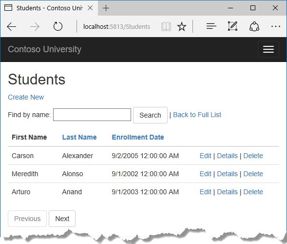
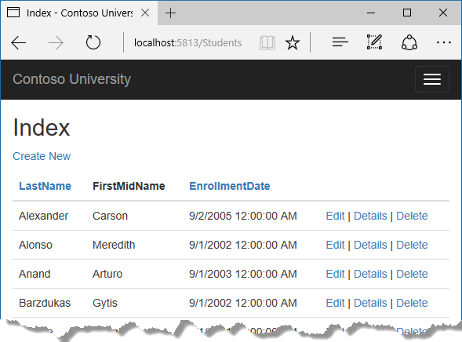
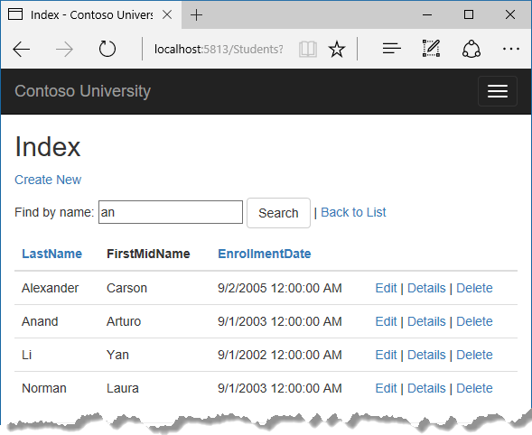

# Tutorial: Add sorting, filtering, and paging - ASP.NET MVC with EF Core

In the previous tutorial, you implemented a set of web pages for basic CRUD operations for Student entities. In this tutorial you'll add sorting, filtering, and paging functionality to the Students Index page. You'll also create a page that does simple grouping.

The following illustration shows what the page will look like when you're done. The column headings are links that the user can click to sort by that column. Clicking a column heading repeatedly toggles between ascending and descending sort order.



In this tutorial, you:

> [!div class="checklist"]
> * Add column sort links
> * Add a Search box
> * Add paging to Students Index
> * Add paging to Index method
> * Add paging links
> * Create an About page

## Prerequisites

* [Implement CRUD Functionality](crud.md)

## Add column sort links

To add sorting to the Student Index page, you'll change the `Index` method of the Students controller and add code to the Student Index view.

### Add sorting Functionality to the Index method

In `StudentsController.cs`, replace the `Index` method with the following code:

[!code-csharp[](intro/samples/cu/Controllers/StudentsController.cs?name=snippet_SortOnly)]

This code receives a `sortOrder` parameter from the query string in the URL. The query string value is provided by ASP.NET Core MVC as a parameter to the action method. The parameter will be a string that's either "Name" or "Date", optionally followed by an underscore and the string "desc" to specify descending order. The default sort order is ascending.

The first time the Index page is requested, there's no query string. The students are displayed in ascending order by last name, which is the default as established by the fall-through case in the `switch` statement. When the user clicks a column heading hyperlink, the appropriate `sortOrder` value is provided in the query string.

The two `ViewData` elements (NameSortParm and DateSortParm) are used by the view to configure the column heading hyperlinks with the appropriate query string values.

[!code-csharp[](intro/samples/cu/Controllers/StudentsController.cs?name=snippet_SortOnly&highlight=3-4)]

These are ternary statements. The first one specifies that if the `sortOrder` parameter is null or empty, NameSortParm should be set to "name_desc"; otherwise, it should be set to an empty string. These two statements enable the view to set the column heading hyperlinks as follows:

|  Current sort order  | Last Name Hyperlink | Date Hyperlink |
|:--------------------:|:-------------------:|:--------------:|
| Last Name ascending  | descending          | ascending      |
| Last Name descending | ascending           | ascending      |
| Date ascending       | ascending           | descending     |
| Date descending      | ascending           | ascending      |

The method uses LINQ to Entities to specify the column to sort by. The code creates an `IQueryable` variable before the switch statement, modifies it in the switch statement, and calls the `ToListAsync` method after the `switch` statement. When you create and modify `IQueryable` variables, no query is sent to the database. The query isn't executed until you convert the `IQueryable` object into a collection by calling a method such as `ToListAsync`. Therefore, this code results in a single query that's not executed until the `return View` statement.

This code could get verbose with a large number of columns. [The last tutorial in this series](advanced.md#dynamic-linq) shows how to write code that lets you pass the name of the `OrderBy` column in a string variable.

### Add column heading hyperlinks to the Student Index view

Replace the code in `Views/Students/Index.cshtml`, with the following code to add column heading hyperlinks. The changed lines are highlighted.

[!code-cshtml[](intro/samples/cu/Views/Students/Index2.cshtml?highlight=16,22)]

This code uses the information in `ViewData` properties to set up hyperlinks with the appropriate query string values.

Run the app, select the **Students** tab, and click the **Last Name** and **Enrollment Date** column headings to verify that sorting works.



## Add a Search box

To add filtering to the Students Index page, you'll add a text box and a submit button to the view and make corresponding changes in the `Index` method. The text box will let you enter a string to search for in the first name and last name fields.

### Add filtering functionality to the Index method

In `StudentsController.cs`, replace the `Index` method with the following code (the changes are highlighted).

[!code-csharp[](intro/samples/cu/Controllers/StudentsController.cs?name=snippet_SortFilter&highlight=1,5,9-13)]

You've added a `searchString` parameter to the `Index` method. The search string value is received from a text box that you'll add to the Index view. You've also added to the LINQ statement a where clause that selects only students whose first name or last name contains the search string. The statement that adds the where clause is executed only if there's a value to search for.

> [!NOTE]
> Here you are calling the `Where` method on an `IQueryable` object, and the filter will be processed on the server. In some scenarios you might be calling the `Where` method as an extension method on an in-memory collection. (For example, suppose you change the reference to `_context.Students` so that instead of an EF `DbSet` it references a repository method that returns an `IEnumerable` collection.) The result would normally be the same but in some cases may be different.
>
>For example, the .NET Framework implementation of the `Contains` method performs a case-sensitive comparison by default, but in SQL Server this is determined by the collation setting of the SQL Server instance. That setting defaults to case-insensitive. You could call the `ToUpper` method to make the test explicitly case-insensitive:  *Where(s => s.LastName.ToUpper().Contains(searchString.ToUpper())*. That would ensure that results stay the same if you change the code later to use a repository which returns   an `IEnumerable` collection instead of an `IQueryable` object. (When you call the `Contains` method on an `IEnumerable` collection, you get the .NET Framework implementation; when you call it on an `IQueryable` object, you get the database provider implementation.) However, there's a performance penalty for this solution. The `ToUpper` code would put a function in the WHERE clause of the TSQL SELECT statement. That would prevent the optimizer from using an index. Given that SQL is mostly installed as case-insensitive, it's best to avoid the `ToUpper` code until you migrate to a case-sensitive data store.

### Add a Search Box to the Student Index View

In `Views/Student/Index.cshtml`, add the highlighted code immediately before the opening table tag in order to create a caption, a text box, and a **Search** button.

[!code-cshtml[](intro/samples/cu/Views/Students/Index3.cshtml?range=9-23&highlight=5-13)]

This code uses the `<form>` [tag helper](xref:mvc/views/tag-helpers/intro) to add the search text box and button. By default, the `<form>` tag helper submits form data with a POST, which means that parameters are passed in the HTTP message body and not in the URL as query strings. When you specify HTTP GET, the form data is passed in the URL as query strings, which enables users to bookmark the URL. The W3C guidelines recommend that you should use GET when the action doesn't result in an update.

Run the app, select the **Students** tab, enter a search string, and click Search to verify that filtering is working.



Notice that the URL contains the search string.

```html
http://localhost:5813/Students?SearchString=an
```

If you bookmark this page, you'll get the filtered list when you use the bookmark. Adding `method="get"` to the `form` tag is what caused the query string to be generated.

At this stage, if you click a column heading sort link you'll lose the filter value that you entered in the **Search** box. You'll fix that in the next section.

## Add paging to Students Index

To add paging to the Students Index page, you'll create a `PaginatedList` class that uses `Skip` and `Take` statements to filter data on the server instead of always retrieving all rows of the table. Then you'll make additional changes in the `Index` method and add paging buttons to the `Index` view. The following illustration shows the paging buttons.


In the project folder, create `PaginatedList.cs`, and then replace the template code with the following code.

[!code-csharp[](intro/samples/cu/PaginatedList.cs)]

The `CreateAsync` method in this code takes page size and page number and applies the appropriate `Skip` and `Take` statements to the `IQueryable`. When `ToListAsync` is called on the `IQueryable`, it will return a List containing only the requested page. The properties `HasPreviousPage` and `HasNextPage` can be used to enable or disable **Previous** and **Next** paging buttons.

A `CreateAsync` method is used instead of a constructor to create the `PaginatedList<T>` object because constructors can't run asynchronous code.

## Add paging to Index method

In `StudentsController.cs`, replace the `Index` method with the following code.

[!code-csharp[](intro/samples/cu/Controllers/StudentsController.cs?name=snippet_SortFilterPage&highlight=1-5,7,11-18,45-46)]

This code adds a page number parameter, a current sort order parameter, and a current filter parameter to the method signature.

```csharp
public async Task<IActionResult> Index(
    string sortOrder,
    string currentFilter,
    string searchString,
    int? pageNumber)
```

The first time the page is displayed, or if the user hasn't clicked a paging or sorting link, all the parameters will be null.  If a paging link is clicked, the page variable will contain the page number to display.

The `ViewData` element named CurrentSort provides the view with the current sort order, because this must be included in the paging links in order to keep the sort order the same while paging.

The `ViewData` element named CurrentFilter provides the view with the current filter string. This value must be included in the paging links in order to maintain the filter settings during paging, and it must be restored to the text box when the page is redisplayed.

If the search string is changed during paging, the page has to be reset to 1, because the new filter can result in different data to display. The search string is changed when a value is entered in the text box and the Submit button is pressed. In that case, the `searchString` parameter isn't null.

```csharp
if (searchString != null)
{
    pageNumber = 1;
}
else
{
    searchString = currentFilter;
}
```

At the end of the `Index` method, the `PaginatedList.CreateAsync` method converts the student query to a single page of students in a collection type that supports paging. That single page of students is then passed to the view.

```csharp
return View(await PaginatedList<Student>.CreateAsync(students.AsNoTracking(), pageNumber ?? 1, pageSize));
```

The `PaginatedList.CreateAsync` method takes a page number. The two question marks represent the null-coalescing operator. The null-coalescing operator defines a default value for a nullable type; the expression `(pageNumber ?? 1)` means return the value of `pageNumber` if it has a value, or return 1 if `pageNumber` is null.

## Add paging links

In `Views/Students/Index.cshtml`, replace the existing code with the following code. The changes are highlighted.

[!code-cshtml[](intro/samples/cu/Views/Students/Index.cshtml?highlight=1,27,30,33,61-79)]

The `@model` statement at the top of the page specifies that the view now gets a `PaginatedList<T>` object instead of a `List<T>` object.

The column header links use the query string to pass the current search string to the controller so that the user can sort within filter results:

```html
<a asp-action="Index" asp-route-sortOrder="@ViewData["DateSortParm"]" asp-route-currentFilter ="@ViewData["CurrentFilter"]">Enrollment Date</a>
```

The paging buttons are displayed by tag helpers:

```html
<a asp-action="Index"
   asp-route-sortOrder="@ViewData["CurrentSort"]"
   asp-route-pageNumber="@(Model.PageIndex - 1)"
   asp-route-currentFilter="@ViewData["CurrentFilter"]"
   class="btn btn-default @prevDisabled">
   Previous
</a>
```

Run the app and go to the Students page.


Click the paging links in different sort orders to make sure paging works. Then enter a search string and try paging again to verify that paging also works correctly with sorting and filtering.

## Create an About page

For the Contoso University website's **About** page, you'll display how many students have enrolled for each enrollment date. This requires grouping and simple calculations on the groups. To accomplish this, you'll do the following:

* Create a view model class for the data that you need to pass to the view.
* Create the About method in the Home controller.
* Create the About view.

### Create the view model

Create a *SchoolViewModels* folder in the *Models* folder.

In the new folder, add a class file `EnrollmentDateGroup.cs` and replace the template code with the following code:

[!code-csharp[](intro/samples/cu/Models/SchoolViewModels/EnrollmentDateGroup.cs)]

### Modify the Home Controller

In `HomeController.cs`, add the following using statements at the top of the file:

[!code-csharp[](intro/samples/cu/Controllers/HomeController.cs?name=snippet_Usings1)]

Add a class variable for the database context immediately after the opening curly brace for the class, and get an instance of the context from ASP.NET Core DI:

[!code-csharp[](intro/samples/cu/Controllers/HomeController.cs?name=snippet_AddContext&highlight=4,6,9)]

Add an `About` method with the following code:

[!code-csharp[](intro/samples/cu/Controllers/HomeController.cs?name=snippet_UseDbSet)]

The LINQ statement groups the student entities by enrollment date, calculates the number of entities in each group, and stores the results in a collection of `EnrollmentDateGroup` view model objects.

### Create the About View

Add a `Views/Home/About.cshtml` file with the following code:

[!code-cshtml[](intro/samples/cu/Views/Home/About.cshtml)]

Run the app and go to the About page. The count of students for each enrollment date is displayed in a table.

## Get the code

[Download or view the completed application.](https://github.com/dotnet/AspNetCore.Docs/tree/main/aspnetcore/data/ef-mvc/intro/samples/cu-final)

## Next steps

In this tutorial, you:

> [!div class="checklist"]
> * Added column sort links
> * Added a Search box
> * Added paging to Students Index
> * Added paging to Index method
> * Added paging links
> * Created an About page

Advance to the next tutorial to learn how to handle data model changes by using migrations.

> [!div class="nextstepaction"]
> [Next: Handle data model changes](migrations.md)
